# Base Computacional 

Você vai aprender sobre a origem e a evolução dos computadores, os principais componentes de um sistema computacional — como hardware, software e sistema operacional — e a importância das redes para a integração dos sistemas. Esse estudo vai proporcionar uma visão sólida sobre a estrutura, o funcionamento e a interconectividade dos ambientes computacionais atuais. 

Prof. Leandro de Mattos Ferreira 

1. Itens iniciais 

### Objetivos 

- Reconhecer a evolução histórica dos computadores. 

- 

- Identificar os componentes de um sistema computacional – hardware e software. 

- 

- Interpretar o papel do sistema operacional nos computadores. 

- 

- Relacionar a importância da comunicação em rede com os sistemas computacionais. 

- 

### Introdução 

O século XX foi marcado por inúmeras inovações nos campos da ciência e da tecnologia. Entre elas, a invenção e o desenvolvimento dos computadores transformaram de forma decisiva a sociedade e o modo de viver. Este material aborda a história e a evolução dos computadores. 

Serão apresentados os componentes de um sistema computacional, os conceitos de hardware e software, seus diferentes tipos e como a interação entre eles abriu caminho para soluções inovadoras. Também serão discutidas as tendências e os impactos dos avanços tecnológicos. 

Além disso, o conteúdo explora o papel do sistema operacional, seu histórico, funções e tendências de mercado. Destaca ainda a relação entre comunicação em rede e sistemas computacionais, trazendo um panorama que vai da internet discada até os dias atuais. 

Vamos lá! 

#### Conteúdo interativo 

Acesse a versão digital para assistir ao vídeo. 

1. A evolução dos computadores 

## Desenvolvimento do computador em quatro gerações 

Neste vídeo, exploramos a evolução dos computadores ao longo de quatro gerações, destacando os avanços tecnológicos que tornaram possível a transição de máquinas gigantes para dispositivos pessoais modernos. Conheça as inovações marcantes de cada geração e o papel de empresas como Microsoft e Apple nessa transformação. 

Conteúdo interativo 

Acesse a versão digital para assistir ao vídeo. 

Veja os principais marcos da invenção e da evolução dos computadores, entendendo como e por que os sistemas computacionais surgiram e quais foram suas etapas de desenvolvimento. 

### Máquina de Turing 

Antes de entender o desenvolvimento do primeiro computador, assista a este vídeo sobre a máquina de Turing: um precursor matemático do computador. 

Conteúdo interativo 

Acesse a versão digital para assistir ao vídeo. 

Vamos ver agora como ocorreu o desenvolvimento do computador, conhecendo suas quatro gerações. Vamos lá! 

### Gerações dos computadores Confira no vídeo! 

Conteúdo interativo 

Acesse a versão digital para assistir ao vídeo. 

### Primeira geração: vávulas termiônicas 

Ainda durante a Segunda Guerra Mundial, nos Estados Unidos, foi desenvolvido o primeiro computador eletrônico da história. Trata-se do ENIAC, um computador integrador numérico eletrônico, cujos números impressionam. Veja a seguir uma foto deste modelo: 

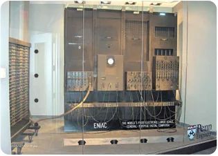

<!-- Start of picture text -->
• • • • <!-- End of picture text -->

Componentes: 170.000 válvulas termiônicas. Peso: cerca de 30 toneladas. Espaço utilizado: Sala de 150 m². 

Capacidade de processamento (número de cálculos por segundo): 1 bilhão de vezes menor que a dos celulares usados hoje em dia. 

• Componentes: 170.000 válvulas termiônicas. 

- Peso: cerca de 30 toneladas. 

- 

- Espaço utilizado: Sala de 150 m². 

- 

- Capacidade de processamento (número de cálculos por segundo): 1 bilhão de vezes menor que a dos celulares usados hoje em dia. 

Para evoluirmos desse verdadeiro elefante para os computadores atuais, foi preciso substituir as válvulas, já que elas eram pesadas e espaçosas. 

Mas o que permitiu a evolução dos enormes computadores de válvulas para os modelos atuais? 

### Segunda geração: transistores 

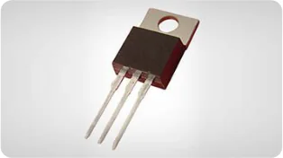

O transistor possibilitou a evolução dos computadores e deu início à era da microeletrônica. Com ele, surgia a segunda geração de computadores, marcada pela substituição das válvulas e pela redução significativa de tamanho, consumo de energia e custo. 

Os primeiros transistores ocupavam apenas alguns milímetros, precisando de bem menos energia que as válvulas. Assim, foi possível reduzir o tamanho de rádios, equipamentos eletrônicos, em geral, e computadores. 

### Terceira geração: circuitos integrados 

Na década de 1960, o próximo salto de evolução foi dado com a criação dos circuitos integrados (CI): pastilhas de silício que contêm um circuito eletrônico miniaturizado. É o que, de forma comum, chamamos de chip de computador. 

Com o uso de transistores e CI, os computadores ficaram menores e cada vez mais baratos. 

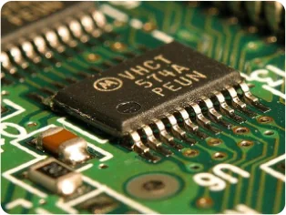

Em meados da década de 1970, houve a eclosão dos computadores pessoais, denominados PCs (personal computers). 

Duas gigantes da tecnologia foram fundadas na década de 1970. 

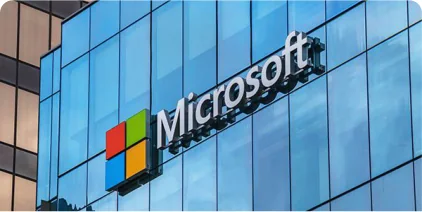

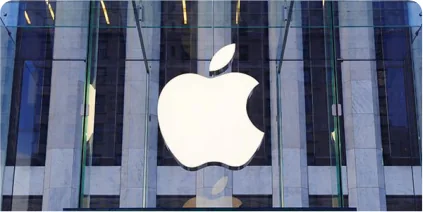

#### Microsoft Corporation 

#### Apple Inc. 

Empresa americana fundada em 1975 por Bill Gates e Paul Allen. É a maior em faturamento no setor de programas de computador, conhecida pelo sistema operacional Windows e pelo pacote de produtividade Office. 

Em 1976, a empresa vendeu 200 unidades do Apple I, seu primeiro computador pessoal. No ano seguinte, o Apple II alcançou vendas de milhares de unidades, e a companhia abriu seu capital na Bolsa de Nova York. 

### Quarta geração: microprocessadores 

A década de 1980 presenciou a proliferação de PCs cada vez mais potentes, baratos e conectados por meio do surgimento das redes locais de computadores e da internet: a rede mundial. 

Além disso, um novo aparelho chegava aos lares: o videogame, um tipo de computador especializado, com programas em forma de jogos eletrônicos que destacam gráficos e interação com os usuários. 

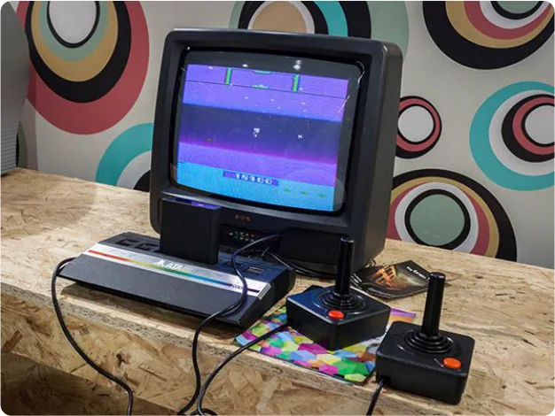

Após o fim do século XX, os computadores se tornaram pequenos e potentes, sendo incorporados a diversos equipamentos do dia a dia, como automóveis, aviões e videogames. O uso de laptops também se tornou mais comum nas residências. Pouco depois, computadores começaram a ser integrados a televisões e celulares e, na década 2010, essa integração passou a ocorrer principalmente por meio de smartphones e smart TVs. 

## Computação no cotidiano 

Neste vídeo, discutimos como a computação moderna está integrada ao nosso cotidiano de maneira quase invisível, influenciando áreas como saúde, mobilidade e comunicação. Abordamos também as tendências emergentes da ciência da computação e como elas moldam o futuro da tecnologia e da sociedade. 

#### Conteúdo interativo 

Acesse a versão digital para assistir ao vídeo. 

Hoje em dia, muitos celulares já são, de fato, computadores pessoais portáteis, plenamente conectados pela rede de telefonia móvel (celular). Nossa dependência em relação a eles para as tarefas do cotidiano já é tão forte que nem percebemos quando os utilizamos, inclusive estranhando sua ausência. Diversas atividades do dia a dia dependem do uso de computadores, por exemplo: 

Comunicação. 

Meios de transporte. 

Transações bancárias e comerciais. 

Atualmente, até o dinheiro não é guardado mais em cofres. Os saldos bancários são armazenados digitalmente nos servidores dos bancos. Se todos os correntistas de um banco solicitassem retirar inteiramente o dinheiro guardado nele, não haveria cédulas suficientes no cofre para atendê-los. 

#### Saiba mais 

Para demonstrar a evolução desse conceito, foi desenvolvido um sistema de troca de dinheiro independente dos bancos. Proposto em 2008, o coin utiliza uma cadeia de transações descentralizada que qualquer pessoa pode auditar: o blockchain. Com essa tecnologia, é possível receber e enviar dinheiro sem precisar de bancos, além de todas as suas transações serem verificáveis por qualquer pessoa com acesso à internet. 

## Tendências 

O ramo da ciência da computação está em amplo desenvolvimento. Segundo o portal Statista, em 2019, cinco das seis maiores companhias do mundo (em valor de mercado) eram do ramo da computação: 

Apple 

Microsoft 

Amazon 

Alphabet (Google) 

Facebook 

Na área da tecnologia, estudos e pesquisas continuam sendo realizados em busca de um novo salto de desenvolvimento. 

#### Exemplo 

Computadores quânticos usam as características da mecânica quântica a fim de permitir a solução de problemas muito complexos para PCs convencionais. 

## Verificando o aprendizado 

##### Questão 1 

Potentes, os computadores atuais podem ser levados até nossos bolsos, como os celulares. Entretanto, em sua primeira versão, um computador ocupava uma sala inteira e pesava o equivalente a 30 carros. Para essa enorme evolução acontecer, diversas descobertas científicas e tecnológicas foram fundamentais. 

Assinale a alternativa que contém o conjunto de tecnologias desenvolvido na ordem cronológica correta para permitir o desenvolvimento dos computadores: 

A Transistor, microprocessador e circuito integrado. B Rádio, válvulas termiônicas e microprocessador. 

C Transistor, circuito integrado e microprocessador. 

D Transistor, circuito integrado e rádio. 

E Transistor, microprocessadores e válvulas termiônicas. 

#### A alternativa C está correta. 

O transistor permitiu a miniaturização dos componentes do computador, rendendo aos seus criadores o Nobel de Física de 1956. Os circuitos integrados permitiram a colocação de diversos transistores e portas lógicas em uma só pastilha de silício. Isso possibilitou a feitura de microprocessadores capazes de operar um computador programável e genérico a partir de um único chip. 

##### Questão 2 

Assim como a maioria dos avanços tecnológicos, os computadores foram construídos e desenvolvidos a partir de outras tecnologias que os precederam. Assinale a alternativa que não representa uma tecnologia precursora dos computadores: 

A Máquina universal de Turing B Transistor C Calculadora D Energia elétrica 

E Ábacos 

#### A alternativa B está correta. 

O primeiro computador funcionava à base de válvulas termiônicas. O transistor as substituiu posteriormente. 

2. Sistema computacional 

## Hardware e software 

Neste vídeo, exploramos a relação entre hardware e software — os dois pilares fundamentais do funcionamento dos computadores. Entenda o que são, como se complementam e descubra exemplos práticos e analogias que tornam mais fácil compreender essa interação essencial para os sistemas computacionais do nosso dia a dia. 

#### Conteúdo interativo 

Acesse a versão digital para assistir ao vídeo. 

Os computadores são feitos com um conjunto de componentes dividido em dois grandes grupos: 

Hardware (HW) Software (SW) Componentes físicos, ou seja, o que pode Programas executados no ser visto e tocado. computador. 

Apresentaremos, a seguir, os diversos tipos de hardware presentes em um computador e os tipos de software mais importantes. Além disso, entenderemos como a interação entre eles permite que nossos PCs sejam capazes de resolver quase todos os problemas, abrindo o caminho para soluções inovadoras e não planejadas. 

### Conceitos 

A grande propagação dos computadores se deve à implementação de diversas funções genéricas (hardware) e ao uso delas para gerar programas úteis a muitas pessoas (software). O hardware forma a base para o que conseguimos extrair de um sistema computacional. 

#### Exemplo 

Se você tentar se conectar à internet em um computador sem placa de rede, não conseguirá. Isso se deve à falta do hardware, que é o responsável por dar uma capacidade de conexão à internet: a placa de rede. 

Para exemplificarmos os conceitos de hardware e software, podemos fazer uma analogia com a linha de produção de um automóvel. A montadora constrói um modelo, colocando nele: 

Isso equivale ao hardware do computador. O automóvel tem todas essas possibilidades já descritas, mas não sabemos de antemão como ele vai ser usado. Sua função, afinal, dependerá do motorista que o comprar. A pessoa pode resolver usar o carro para viajar nos finais de semana, ir ao trabalho e voltar todo dia – ou até para trabalhar como motorista de aplicativo. A função do carro só será decidida pelo motorista. Isso equivale ao software de nosso computador. Da mesma maneira, os programas executados definem como o computador vai ser usado. 

No entanto, se o motorista quiser usar seu veículo para levar um reboque, só vai conseguir fazer isso se possuir um engate, já que ele não tem essa capacidade instalada. Do mesmo modo, um computador só consegue executar programas se tiver o hardware necessário para tal. 

#### Engate 

Artefato ou conjunto de peças utilizado para unir vagões a uma locomotiva, animais a carroças ou carros, e também veículos entre si (Houaiss, 2002). 

## Principais componentes de hardware dos computadores 

Neste vídeo, você vai conhecer os principais componentes de hardware que fazem os computadores funcionarem. Descubra o papel do processador, da memória RAM, da placa-mãe, dos periféricos e muito mais — elementos essenciais que estão presentes desde os desktops até os smartphones e servidores. 

#### Conteúdo interativo 

Acesse a versão digital para assistir ao vídeo. 

Vamos conhecê-los a seguir. 

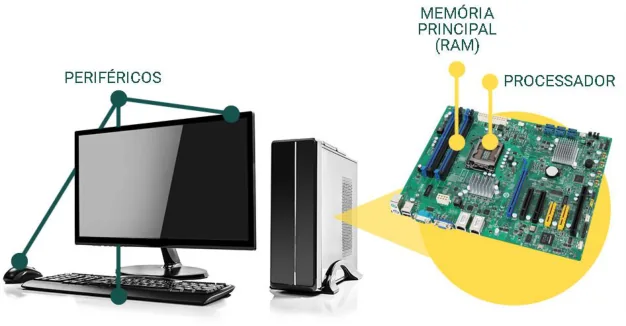

Processador Assista ao vídeo! 

#### Conteúdo interativo 

Acesse a versão digital para assistir ao vídeo. 

Também conhecido como CPU (Central Processing Unit ou Unidade Central de Processamento, em português), processador é o cérebro do computador, pois recebe as instruções e as executa sequencialmente. Seu principal componente é a unidade lógica e aritmética, responsável por operações como adicionar e subtrair. 

A execução das instruções em um processador é regulada pela 

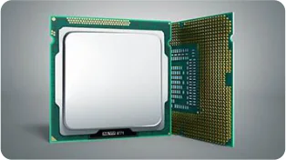

presença de um pulso de frequência constante denominado clock, que é medido em Hertz (Hz) – número de pulsos por segundo. 

Uma das principais características de um processador é a velocidade com que consegue executar instruções. Isso depende diretamente da frequência do clock. 

Como vimos, os processadores foram criados na década de 1970. Inicialmente, eles tiveram sua velocidade aumentada, gerando uma competição acirrada entre as produtoras de microprocessadores. Era comum medir a qualidade do CPU pela velocidade de seu clock. Entendia-se que um processador de 1800 MHz era melhor que um de 1600 MHz. 

#### Saiba mais 

Overclocking é o processo para customizar a velocidade do clock do processador acima de sua frequência de uso normal. Tal prática deixa o computador mais rápido, pois uma maior quantidade de operações pode ser realizada ao mesmo tempo. Há certos riscos envolvidos no overclocking, como danos ao processador e sobreaquecimento. 

O aumento de clock a cada geração de processadores seguiu ao longo dos anos, até que, por conta de interferências físicas entre seus componentes, ficou inviável a continuação desse procedimento. A solução dada pelos projetistas foi colocar diversos miniprocessadores (chamados de núcleos) dentro de um mesmo chip de processador. Em termos práticos, é como se houvesse dois, quatro ou até mais processadores 

trabalhando em um mesmo chip. Essa técnica é conhecida como multicore, mas, em função do número de núcleos, também é chamada de: 

Dual core (dois núcleos) 

Quad core (quatro núcleos) 

Atualmente, a maioria dos processadores de mercado (inclusive os de celulares) utiliza ao menos quatro cores e frequências de clock de alguns bilhões de pulsos por segundo (GHz). Além do clock e do número de núcleos, outra característica importante do processador é a memória cache. 

- A memória cache corresponde a uma pequena parte da memória principal integrada ao próprio chip do processador. 

- Nela, as informações são lidas e gravadas com muito mais velocidade do que nos pentes de memória. 

- 

- Quanto maior a quantidade de memória cache, maior tende a ser a velocidade de processamento. 

- 

#### pentes de memória. 

Pequenos circuitos impressos de formato parecido com pentes de cabelo. 

Por fim, outra característica importante na avaliação do processador é o seu encaixe, conhecido como pinagem. Para ser fixado na placa-mãe, o processador possui pinos que precisam corresponder ao formato dos orifícios do soquete. 

### Memória principal (RAM) 

### Confira no vídeo! 

#### Conteúdo interativo 

Acesse a versão digital para assistir ao vídeo. 

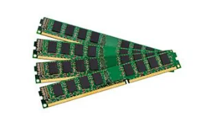

A memória principal é parte fundamental do computador, pois se trata do espaço onde são armazenados os dados e os programas executados no processador. Ela funciona como uma série de células em que cada uma armazena um conjunto de oito bits (chamado de um byte). Essas células funcionam como caixas de correio: cada uma tem seu endereço, embora só armazene uma carta por vez. 

A memória também é chamada de RAM (em seu formato mais comum) por permitir o acesso a qualquer endereço em qualquer ordem. Disso resulta o nome Memória de Acesso Aleatório (em inglês, Random Access Memory). Normalmente, as memórias RAM são vendidas em pentes de memória. 

A memória RAM é volátil, ou seja, seus dados são apagados quando o sistema fica sem energia. 

Veja as principais características de uma memória RAM: 

1 

#### Capacidade de armazenamento 

Se possui 4 GB (quatro gigabytes) de armazenamento, a memória RAM conta com 4 bilhões dessas células, podendo armazenar até 32 bilhões de bits de dados. 

##### 2 

#### Velocidade de comunicação com o barramento 

Trata-se da velocidade com que a memória consegue transferir os dados para o processador. Por exemplo, uma memória de 400 MHz consegue transferir dados para o processador com uma taxa de até 3200 Mbps (3 bilhões e 200 milhões de bits por segundo). 

### Placa-mãe Confira no vídeo! 

#### Conteúdo interativo 

Acesse a versão digital para assistir ao vídeo. 

A placa-mãe é um circuito impresso que reúne diversos componentes conectados entre si. Os principais são: 

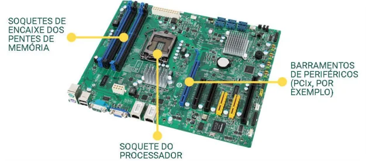

A função básica da placa-mãe é conectar o processador, a memória principal e os periféricos (outros componentes não essenciais do computador). Essas conexões são chamadas de barramentos. Conforme a tecnologia se desenvolve, a placa-mãe começa a integrar em si periféricos que, até então, precisavam ser encaixados nela, como placas de vídeo, placas de rede, placas controladoras de portas seriais e paralelas. 

#### Atenção 

As placas-mãe dos celulares atuais são circuitos altamente complexos, contando com processador, memória, controladora de vídeo, controladora de tela touchscreen, acelerômetros, GPS e placa de rede sem fio e celular. Todos eles estão diretamente integrados à placa-mãe. 

### Periféricos 

Por se conectarem à parte central do computador, seus demais componentes são chamados, em geral, de periféricos. Muitos mostram ser tão relevantes que não seríamos capazes de imaginar sistemas computacionais sem eles. O primeiro computador usava apenas uma série de lâmpadas como saída e alguns cartões perfurados como entrada. Inicialmente, são necessários apenas dois instrumentos nesse processo, embora haja outro que também precisa ser apontado. 

### Dispositivos de entrada 

Usados para interagir com o computador. Os mais comuns são: 

1. Tela touchscreen: permite a seleção de elementos sem precisar de um mouse. 

2. Teclado: segue um padrão já difundido das máquinas de escrever, facilitando seu uso e sua aceitação. 

3. Mouse: abre novos rumos por permitir a indicação de pontos na tela e a seleção deles, o que gerou um grande impacto no desenvolvimento de interfaces gráficas. 

4. Microfone: capta o áudio. 

5. Câmera: capta áudio com vídeo. 

6. Placa de rede: recebe os dados transmitidos pela rede. 

Veja na imagem os dispositivos listados: 

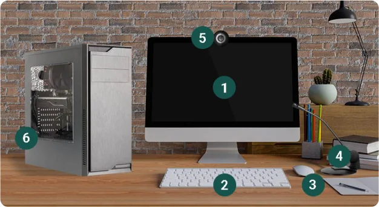

### Dispositivos de saída 

Eles leem os resultados por computador. Os mais usuais são: 

#### Sistema de vídeo 

Composto, geralmente, por uma placa de vídeo e um monitor ou uma tela. 

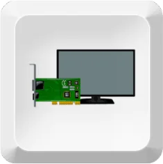

Alto-falantes ou caixas de som 

Emite sons e sinais sonoros. 

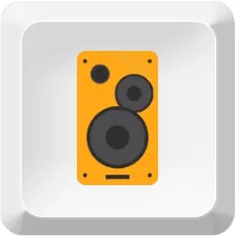

Impressora 

Imprime documentos elaborados no computador. 

#### Placa de rede 

Envia os dados pela rede. 

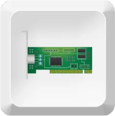

Mesmo com a operacionalidade garantida por esses dispositivos, ainda existe o seguinte problema: a memória principal perde as informações quando se desliga o computador, ou seja, ela é volátil. 

Mas é possível resolver esse tipo de problema? 

A resposta é: sim. Precisamos de um sistema de armazenamento persistente que não perca as informações após esse desligamento. 

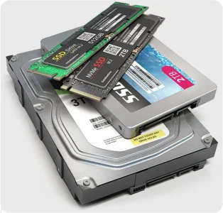

Para isso, são usadas as memórias secundárias. Mais conhecidas como HD (Hard disk ou disco rígido, em português), elas possuem essa nomenclatura porque sua tecnologia predominante envolve discos magnéticos lidos e escritos por um cabeçote. Atualmente, essa tecnologia tem sido substituída por discos de estado sólido (SSD), que são muito mais rápidos e menos propensos a falhas e desgaste por não haver partes móveis mecânicas neles. 

As características das memórias secundárias, em comparação com as primárias, incluem: 

#### Capacidade de armazenamento 

Normalmente medida em GB (gigabytes ou bilhões de bytes) ou TB (terabytes ou trilhões de bytes). 

#### Velocidade de transmissão 

Depende do barramento que o liga à placa-mãe. 

Hoje, a principal tecnologia de barramento de memória secundária é o SATA2, que é capaz de atingir taxas de transmissão de 3 Gb/s (3 gigas por segundo). 

### Principais componentes de hardware 

Confira neste vídeo quais são os principais componentes de hardware de um computador e suas funções. 

Conteúdo interativo 

Acesse a versão digital para assistir ao vídeo. 

## Software 

Neste vídeo, vamos aprofundar o estudo sobre software, analisando como diferentes tipos — como os softwares de sistema e de aplicação — atuam no funcionamento do computador. Através de exemplos práticos, você entenderá como esses programas tornam o uso do hardware possível, eficiente e acessível no dia a dia. 

#### Conteúdo interativo 

Acesse a versão digital para assistir ao vídeo. 

O hardware de um computador só revela suas funcionalidades por meio da execução de programas, que formam o software. Esse software costuma ser dividido em dois tipos: 

Softwares finalísticos ou de aplicação 

Geralmente, são rodados de forma consciente nos computadores, entregando as funcionalidades desejadas por seu usuário. Exemplos: 

- Navegadores de internet - Chrome, Firefox e Internet Explorer. 

- 

- Planilhas: - Excel e Libreoffice Calc. 

- 

- Editores de texto - Word e Libreoffice Writer. 

- 

- Jogos eletrônicos - LoL e Fortnite. 

- 

Softwares de sistema 

Permitem que os programas finalísticos funcionem em diferentes máquinas, mesmo com hardwares variados. Os softwares de sistema incluem os drivers dos dispositivos instalados no computador, que controlam o acesso e o funcionamento de cada periférico, como uma placa de rede. O principal software de sistema é o sistema operacional. 

## Tendências 

A área de desenvolvimento de hardwares e softwares mostra diversos casos de sucesso. O surgimento de circuitos integrados (CI), microprocessadores, placas de vídeo, mouse, touchscreen, USB e muitos outros hardwares gerou saltos evolutivos no desenvolvimento dos computadores, alguns chegando a mudar drasticamente a sua forma de uso. 

Você consegue se imaginar usando um computador sem mouse ou touchscreen? 

No ramo de softwares, diversos programas mudaram a forma como trabalhamos e nos divertimos, tais como: 

- Jogos eletrônicos. 

- 

- Sistemas operacionais com interface gráfica (Windows). 

- 

- Aplicativos para realizar diversas tarefas cotidianas (e-bank, e-commerce e e-mail). 

- 

- Navegador de internet (web browser). 

- 

- Planilhas. 

- 

- Editores de texto. 

- 

Pense em como a tecnologia mudou seu dia a dia. Ideias aparentemente simples, mas que resolvem problemas cotidianos, são o que impulsionam o valor das maiores empresas de tecnologia. Vejamos as inovações que fizeram as cinco maiores empresas de computação do mundo alcançarem um valor de mercado bilionário: 

<!-- Start of picture text -->
Apple <!-- End of picture text -->

<!-- Start of picture text -->
Microsoft <!-- End of picture text -->

PCs e, posteriormente, iPods e iPads. 

DOS e Windows (sistemas operacionais). 

Facebook Redes sociais. 

Alphabet 

Mecanismo de busca na internet (Google). 

<!-- Start of picture text -->
Amazon <!-- End of picture text -->

Sistema de vendas on-line com grande qualidade de serviço e sem lojas físicas. 

## Verificando o aprendizado 

##### Questão 1 

Escolha a alternativa que, respectivamente, apresenta exemplos de software e de hardware em um sistema computacional: 

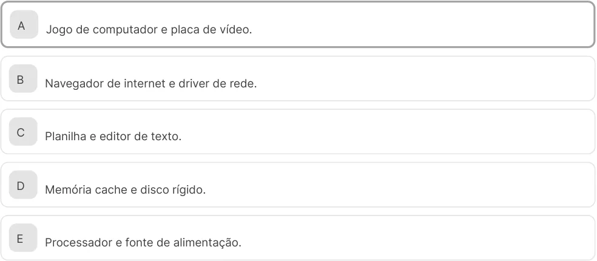

<!-- Start of picture text -->
A Jogo de computador e placa de vídeo. B Navegador de internet e driver de rede. C Planilha e editor de texto. D Memória cache e disco rígido. E Processador e fonte de alimentação. <!-- End of picture text -->

#### A alternativa A está correta. 

O jogo de computador é um software finalístico, enquanto a placa de vídeo é um exemplo de hardware periférico que permite a execução de jogos com gráficos avançados. 

##### Questão 2 

Um sistema computacional precisa de um local para armazenar os dados e os programas que nele serão executados. Que elemento exerce essa função essencial? 

<!-- Start of picture text -->
A Memória secundária B Disco rígido C Memória cache D Memória principal <!-- End of picture text -->

E Unidade de fita 

A alternativa D está correta. 

Das quatro opções apresentadas, a única considerada fundamental para o funcionamento de um sistema computacional é a memória principal: trata-se da implementação da fita teórica da máquina universal pensada por Alan Turing. 

3. O papel do sistema computacional 

## O sistema operacional 

Neste vídeo, acompanhe a evolução dos sistemas operacionais desde seus primórdios até os dias atuais. Conheça os marcos históricos, como Unix, MS-DOS, Windows, iOS e Android, e descubra as tendências que estão moldando o futuro dos sistemas operacionais, especialmente no universo dos dispositivos móveis. 

#### Conteúdo interativo 

Acesse a versão digital para assistir ao vídeo. 

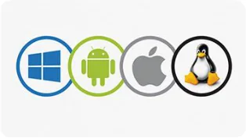

O OS é um dos principais softwares de sistema, responsável por gerenciar o hardware do computador e executar diversas funções essenciais. 

Essas funções incluem gerenciar o acesso dos programas ao processador e aos periféricos, garantindo um uso organizado e eficiente. A seguir, exploraremos a importância do sistema operacional 

e sua evolução. 

## Funções do sistema operacional 

Neste vídeo, exploramos as funções essenciais do sistema operacional, o software que faz a ponte entre o hardware e os programas. Você vai entender como o OS gerencia recursos, reconhece componentes físicos e cria um ambiente seguro e eficiente para o funcionamento dos aplicativos, facilitando o uso dos computadores. 

#### Conteúdo interativo 

Acesse a versão digital para assistir ao vídeo. 

### Assista ao vídeo! 

#### Conteúdo interativo 

Acesse a versão digital para assistir ao vídeo. 

Vamos entender as funções do sistema operacional analisando o seguinte exemplo: 

Pense em um automóvel. Imagine-se como um motorista (programa) ciente de que precisa acelerar, frear, passar as marchas e virar para a direita e a esquerda a fim de chegar a seu destino. Como motorista (programa), você, então, é capaz de dirigir um automóvel (hardware) até um destino. 

Mas o que aconteceria se, em vez de um carro, você estivesse a bordo de uma motocicleta ou de um carro de Fórmula 1? 

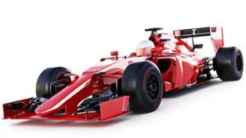

Os conceitos de acelerar, frear e virar são parecidos, mas a forma com que são executados é completamente diferente. O sistema operacional funcionaria, então, como um intermediário que sabe como executar cada operação em seu veículo específico (hardware), para que programas possam ser genéricos e independentes do hardware no qual estão sendo executados. 

Imagine que você decide entrar em um carro de Fórmula 1. Como motorista (programa), você não precisa se preocupar com a mecânica da troca de marchas, pois o sistema do carro faz isso para você, apenas recebendo o seu pedido e o executando. 

De forma similar, o sistema operacional (OS) atua como uma camada de abstração, intermediando a relação entre o hardware e o usuário, para que você não precise gerenciar diretamente os componentes do computador. 

Uma das funções mais importantes do sistema operacional é cuidar da alocação de armazenamento e da memória principal. Quando você decide executar um programa, o OS é o responsável por encontrar e alocar o espaço necessário na memória do computador para que tanto o programa quanto os dados que ele irá manipular possam ser processados. 

Além disso, o OS é fundamental para gerenciar os programas. Atualmente, diversos programas podem ser executados ao mesmo tempo, tanto em primeiro plano (os que você está vendo na tela) quanto em segundo plano (aqueles que rodam em segundo plano ou background). Por exemplo, ao ligar o computador, vários programas como antivírus e aplicativos de comunicação, como Skype ou Discord, já são iniciados. 

Para gerenciar a execução de todos esses programas de forma eficiente, o sistema operacional usa um subsistema chamado escalonador. A principal tarefa do escalonador é decidir quando e quais programas têm acesso ao uso do processador. Como os processadores modernos costumam ter vários núcleos, o escalonador considera tanto todos os núcleos disponíveis quanto as características de cada programa para distribuir o tempo de processamento de maneira otimizada. 

O sistema operacional (OS) é o programa que gerencia todos os recursos do computador e permite que os outros programas funcionem. 

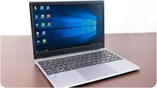

No entanto, o OS é carregado depois que um programa chamado BIOS (Basic Input/Output System) é executado. Gravado em um chip na placa-mãe, o BIOS é o primeiro programa a ser inicializado ao ligar o computador. Ele é essencial, pois quando o computador é ligado, a memória principal está vazia. 

Sem o BIOS, não seria possível carregar o OS, que está na memória 

secundária (geralmente o disco rígido), para a memória principal, onde ele precisa estar para ser executado. 

#### Atenção 

O sistema operacional é um programa e, para ser executado, precisa ser carregado do disco rígido para a memória principal. 

## Histórico 

### Tendências para o futuro dos OS Assista ao vídeo! 

#### Conteúdo interativo 

Acesse a versão digital para assistir ao vídeo. 

Os primeiros sistemas operacionais eram específicos para as máquinas que os empregavam. Basicamente, eles serviam de interface entre os programas do usuário e o hardware. Veja sua evolução histórica! 

##### Década de 1970 

Surge o Unix, um OS de uso geral muito difundido por ter sido distribuído gratuitamente para o setor acadêmico e o público nos Estados Unidos. Como ele não possuía uma interface gráfica, todos os seus comandos eram dados via console a partir de um texto. 

##### Exemplo 

Se estiver em um Windows, segure a tecla Windows + R, digite cmd e aperte Enter. No Linux, segure as teclas Ctrl + Alt + T. Você verá o terminal aparecer. Podem ser dados ali comandos de texto para executar programas em sua máquina. 

##### Década de 1980 

Microsoft: a empresa começa a vender seu sistema operacional, o MSDOS, presente nos computadores comercializados pela International Business Machine Corporation (IBM). Com isso, esse sistema ganhou projeção no mundo da computação. 

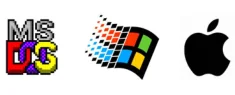

A Microsoft se destaca frente à concorrência com o sistema operacional Windows, que permite executar programas em janelas sobre uma área de trabalho. O Windows chegou a ocupar 90% do mercado de PCs. 

Apple: a empresa lança uma versão de seu OS que contém interface gráfica e conceito de ícones para representar programas. 

Século XX 

Vemos o nascimento de OS para os dispositivos móveis (mobiles): 

- Smartphones 

- Tablets 

- Smart TVs 

A Apple lança um sistema operacional exclusivo para seus aparelhos: o iOS. 

Enquanto isso, a Google e alguns parceiros desenvolvem o OS Android. Ambos disputam o mercado de OS para mobile e destronam a Microsoft. 

## Tendências 

Os sistemas operacionais são indispensáveis para o funcionamento dos computadores. Com a integração de desktops, celulares e tablets, há grande atenção ao desenvolvimento e à melhoria de OS para dispositivos móveis. Os principais são: 

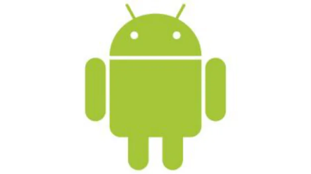

###### Android 

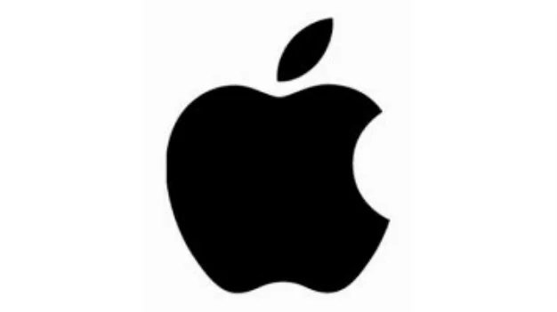

iOS 

Cálculos indicam a existência de mais de 8 bilhões de celulares no mundo. Essa quantidade é maior que o número de indivíduos na Terra, cuja população é formada por 7,5 bilhões de pessoas. Enquanto isso, o número de microcomputadores pessoais é estimado em cerca de 2 bilhões de unidades. 

### Função, importância e evolução dos sistemas operacionais 

Descubra neste vídeo como os sistemas operacionais funcionam, por que eles são essenciais e como evoluíram ao longo do tempo. 

#### Conteúdo interativo 

Acesse a versão digital para assistir ao vídeo. 

## Verificando o aprendizado 

##### Questão 1 

Os sistemas operacionais modernos têm muitas responsabilidades na tarefa de gerir os recursos de um computador. Com isso, assinale a alternativa que lista as tarefas do sistema operacional. 

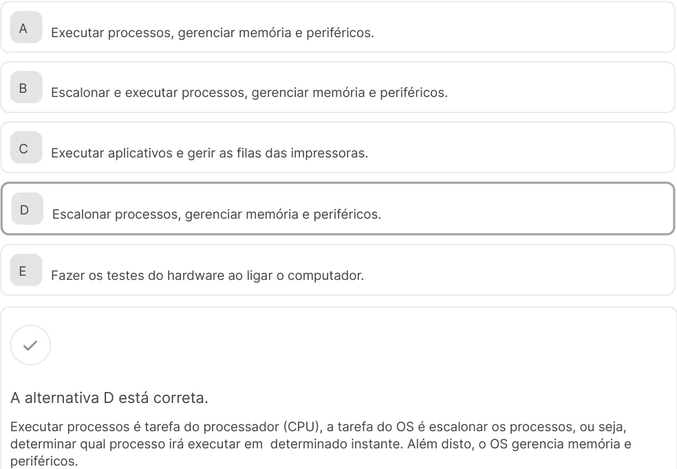

<!-- Start of picture text -->
A Executar processos, gerenciar memória e periféricos. B Escalonar e executar processos, gerenciar memória e periféricos. C Executar aplicativos e gerir as filas das impressoras. D Escalonar processos, gerenciar memória e periféricos. E Fazer os testes do hardware ao ligar o computador. A alternativa D está correta. Executar processos é tarefa do processador (CPU), a tarefa do OS é escalonar os processos, ou seja, determinar qual processo irá executar em  determinado instante. Além disto, o OS gerencia memória e periféricos. <!-- End of picture text -->

##### Questão 2 

Antes da carga do sistema operacional, outro software é responsável por inicializar o computador e fazer as configurações e acessos ao disco necessários para o seu correto funcionamento. Esse software é chamado de 

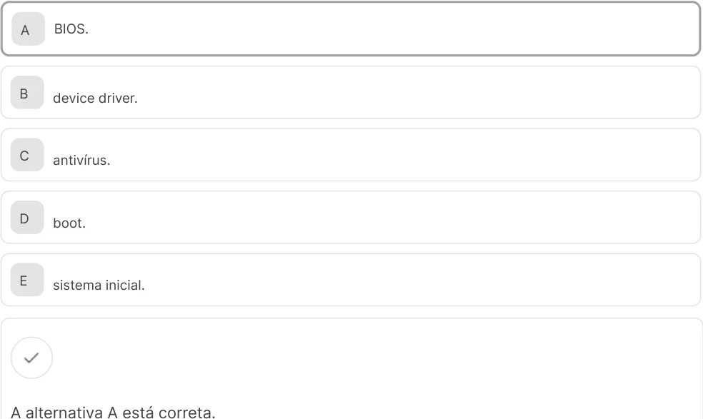

<!-- Start of picture text -->
A BIOS. B device driver. C antivírus. D boot. E sistema inicial. A alternativa A está correta. <!-- End of picture text -->

A BIOS é o software responsável por testar o hardware ao ligar o computador e dar início a carga do sistema operacional. É gravada em memória flash e seu acesso independe de ação do usuário. 

4. Comunicação em rede e sistema computacional 

## Origem da internet 

Neste vídeo, você vai conhecer a origem da ARPANET, projeto desenvolvido pelo Departamento de Defesa dos EUA nos anos 1960, e entender como ela deu início à revolução das redes de computadores, dando origem à internet. Veja como a troca de informações evoluiu de sistemas isolados para a conectividade global que transforma o mundo hoje. 

#### Conteúdo interativo 

Acesse a versão digital para assistir ao vídeo. 

### Assista ao vídeo! 

#### Conteúdo interativo 

Acesse a versão digital para assistir ao vídeo. 

Na década de 1960, os computadores já eram uma realidade consolidada. Desse modo, o Departamento de Defesa Norte-Americano resolveu iniciar os estudos para a construção de uma rede de comunicação capaz de permitir trabalhos em conjunto de pessoas muito distantes geograficamente. Assim, a ARPANET foi criada. 

Evolução da ARPANET, uma rede de armazenamento de dados que, inicialmente, conectava algumas universidades e alguns centros de pesquisa. 

Pensado para possibilitar uma troca de informações, o conceito de sistemas computacionais em rede necessariamente evoluiu, permitindo, hoje em dia, a interação com diversas aplicações, o que era uma realidade até então impensável para sistemas isolados. 

## A internet 

Neste vídeo, você vai acompanhar a evolução da internet e entender como recursos como e-mail, páginas web, chats, jogos online e aplicativos transformaram nossa forma de viver e nos comunicar. Explore os marcos dessa jornada digital que moldou — e ainda molda — um mundo cada vez mais conectado. 

Acesse a versão digital para assistir ao vídeo. 

#### Conteúdo interativo 

### Rede de redes 

Embora os primeiros computadores não tivessem sido projetados para se conectar, a ideia de comunicação em rede surgiu nas décadas de 1960 e 1970. Nesses anos, ocorreram os primeiros passos que levaram à criação da internet Veja! 

#### Década de 1960 

#### Década de 1970 

Surgiu a ideia de conectar computadores espalhados pelos centros acadêmicos norteamericanos. 

A ARPANET foi montada para permitir o trabalho de pesquisa em conjunto por pessoas nas duas costas dos Estados Unidos. Essa ligação foi efetivada em 1970, surgindo, dessa forma, a primeira rede a integrar a internet. 

Apesar da ideia de conexão ter surgido, conectar computadores exigiu a solução de alguns desafios técnicos, como: 

#### Comunicação entre computadores 

#### Protocolos de comunicação 

Foi preciso criar meios de comunicação, como cabos de cobre ou sinais de rádio, para que os computadores pudessem se conectar. 

Para que os computadores pudessem "conversar", foi necessário criar regras (protocolos) de comunicação. Eles definem como enviar e receber dados pela rede. 

Conforme outras redes iam se juntando, crescia a rede de redes (que passou a ser chamada de internet em 1986). Os computadores pessoais já estavam entrando no mercado, e as pessoas queriam se conectar de suas casas. 

### Internet discada 

Por uma questão de simplicidade, as empresas de telefonia assumiram o papel de prover conexão à internet para os usuários domésticos. Surgia, assim, o modem de internet discada, que se conectava como se estivéssemos fazendo um telefonema e atingia taxas de transmissão de 14400 bps (s por segundo). 

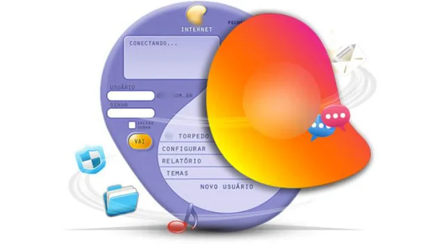

### Endereço IP e roteador 

Uma das barreiras a serem vencidas para interligar tantas máquinas foi a forma de endereçamento, ou seja, como identificar unicamente um computador com o qual se deseja falar. A solução foi dar um endereço – como o da sua casa, por exemplo – para cada máquina. Trata-se de um processo denominado endereço IP, abreviação de internet protocol (protocolo de internet). O endereço IP consistia em uma sequência de quatro números entre 0 a 255 (representados em 8 bits). Como exemplos de endereço IP, temos: 

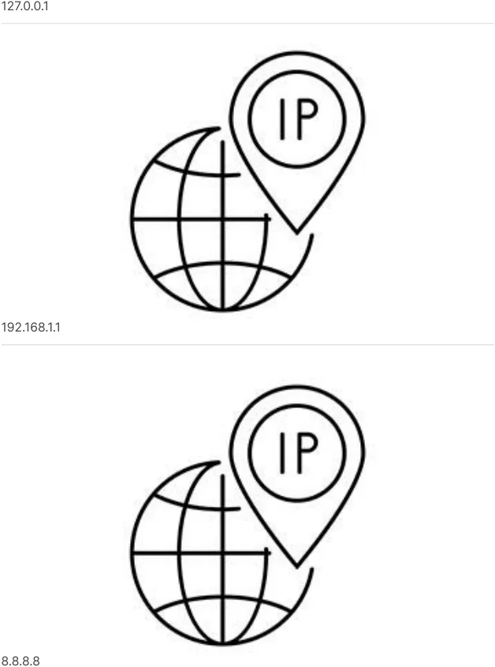

<!-- Start of picture text -->
127.0.0.1 192.168.1.1 8.8.8.8 <!-- End of picture text -->

Ao ser enviado, o pacote de dados — também chamado de datagrama — viaja pela rede até chegar ao seu destino. Nas fronteiras das redes, os roteadores funcionam como postos de controle, que selecionam a rota 

que o pacote deve seguir. Dessa forma, passando de roteador em roteador, o datagrama chega com sucesso ao seu destino. 

Exemplo de estrutura de roteamento 

|Internet - Rede Mundial de Computadores. Tier 3 Network - Rede de camada 3, que costuma prover acesso à internet para a maioria dos usuários caseiros. • •|
|---|
|Metro-fiber - Fibra ótica metropolitana, geralmente usada por empresas para ter acesso de banda larga à internet. Ethernet - Rede local cabeada. • •|
|PSTN - Public Switched Telephone Network - Rede de telefonia local, base de conexão inicial à internet. •|
|Leased line - Linha (alugada) que fornece conexão dedicada à PSTN. •|
|Router - Roteador. •|
|PABX - Private Automatic Branch Exchange - Serviço de ramais telefônicos locais, geralmente usados em empresas. •|
|Cable Operator - Empresa de serviço de televisão a cabo que também pode prover acesso à internet. •|
|Cable plant - Interligação do cabo até a casa do assinante. Cable customer - Assinante do serviço de TV a cabo. DSLAM - Digital Subscriber Line Access Multiplexer - Multiplexador que permite o uso de linhas telefônicas convencionais para acesso à internet (banda larga). • • •|
|ADSL - Assymetrical Digital Subscriber Line - Tecnologia para transmissão de dados em banda larga sobre o par trançado de cobre (linha telefônica comum). •|
|ADSL customer - Assinantes de linha ADSL (geralmente telefone mais acesso à internet via empresa telefônica). O triple play indica que também há sinal de televisão e que todo o serviço é feito via internet (roteador na entrada da casa). •|
|POTS - Plain Old Telephone Service - Linha telefônica comum. Nas origens de acesso à internet, os modems enviavam sinais por meio de uma ligação telefônica convencional entre o usuário e o provedor de serviço de acesso à internet. •|

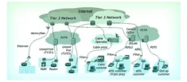

### E-mail e páginas disponíveis na rede 

A conexão de tantos usuários em rede não trouxe só dificuldades técnicas a serem superadas como também – e principalmente – propiciou a criação de oportunidades para outros mercados e outras tecnologias. 

No início, os correios eletrônicos (e-mails) eram enviados pela rede em analogia ao sistema de correios que inspirou o conceito da ARPANET. Três décadas depois, o correio tradicional quase não transporta cartas, ficando restrito a encomendas e boletos. Hoje, a maior parte do tráfego de correspondência é eletrônica. 

Da mesma forma, quando se desenvolveu o conceito de páginas disponíveis na rede (originalmente chamado de World Wide Web: WWW) e se criou um navegador capaz de passear por essa rede de páginas, surgiu o que a maior parte das pessoas entende ser a internet. Essa tecnologia mudou a maneira como: 

- Fazemos comércio (por meio de sites de e-commerce). 

- 

- Vamos ao banco (internet banking). 

- 

- Acessamos serviços públicos (a maioria está disponível na rede). 

- 

- Adquirimos informação. 

- 

### Páginas de pesquisa, chats e programas de troca de mensagens 

Para organizar a procura por tanta informação e pelas páginas disponíveis na World Wide Web, o software de busca Google se mostrou vitorioso entre diversos concorrentes. 

Atualmente, é possível buscar qualquer página ou tópico na web. Isso tornou a Google uma das empresas mais ricas do mundo. 

Após alguns anos, as pessoas se acostumaram a ficar sentadas diante de seus computadores, estando conectadas à internet em grande parte do dia. Com essa nova realidade, a comunicação por e-mail ficou lenta, pois podia levar dias para que uma troca de mensagens fosse realizada. Surgiram, então, os servidores de chat, nos quais os usuários podiam interagir entre si em tempo real. O IRC, por exemplo, é usado até hoje. Também foram desenvolvidos programas de trocas de mensagem, como o ICQ. 

#### IRC 

Internet Relay Chat – Protocolo de comunicação usado na internet para troca de arquivos e bate-papo. 

#### Comentário 

Ao longo dos anos, com a criação de smartphones, o ICQ (e seus demais concorrentes) foram naturalmente substituídos por versões mais modernas, como WhatsApp, Telegram e Discord. 

### Interação entre usuários 

Com a conexão de diversos usuários domésticos, uma nova geração que crescia na década de 1990 via seus jogos eletrônicos começarem a permitir uma interação entre usuários. 

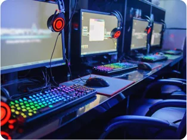

Inicialmente, essa interação foi realizada em redes locais (chamadas de LAN), o que impulsionou o surgimento de LAN Houses: lojas onde era possível jogar em rede usando os computadores e a LAN dos estabelecimentos. Em um processo de evolução natural, as empresas começaram a realizar jogos por meio da internet. 

Com sua Battle.net, a Blizzard Entertainment pavimentou o caminho para o surgimento do que é conhecido como e-sports: jogos competitivos entre usuários de computador via internet. 

#### Battle.net, Blizzard Entertainment 

O Battle.net foi um serviço pioneiro, lançado pela Blizzard Entertainment em 1997 com o jogo Diablo. Seu objetivo era oferecer serviços de jogo multijogador on-line pela internet. Esse conceito superou o de jogos em redes locais, que até então dominavam o cenário. Atualmente, a maioria dos jogos multijogadores já opera via internet, seguindo o modelo proposto de forma inovadora pelo Battle.net. 

#### Saiba mais 

A Blizzard Entertainment, empresa de jogos eletrônicos da Califórnia, foi fundada em 1991 com o nome Silicon & Synapse. Ela é conhecida por jogos de sucesso como Lost Vikings, Warcraft, StarCraft, Diablo e Overwatch. 

### Banda larga, streaming e aplicativos 

### Banda larga 

Conteúdo interativo 

Acesse a versão digital para assistir ao vídeo. 

Graças ao desenvolvimento de novas tecnologias de transmissão, como a fibra ótica, o aumento da banda de internet disponível ao usuário doméstico permitiu que novos serviços fossem oferecidos, como música e vídeo via internet. Atualmente, testemunhamos a gradual – embora inevitável – substituição da televisão por serviços de streaming, como: 

Netflix 

<!-- Start of picture text -->
Youtube <!-- End of picture text -->

A profissão de influenciador digital tornou-se rentável. Novos tipos de programas surgiram com a conexão em nível pessoal. Os celulares passaram a funcionar como computadores de bolso, e a tecnologia de transmissão de dados já possibilita até envio de vídeo (acima de 1 Mbps). Assim, as pessoas permanecem conectadas o tempo todo. Essa conectividade constante impulsionou o desenvolvimento de mensageiros, redes sociais, jogos e, principalmente, de aplicativos colaborativos. Veja! 

Waze Evitar engarrafamentos nas cidades grandes. 

Uber Locomover-se, substituindo serviços de táxi. 

Tinder Buscar relacionamentos. 

Tendências 

Elon Musk. 

A conexão em rede dos computadores mudou o paradigma de uso dessas máquinas, moldando diversos hábitos de nossa sociedade. Atualmente, o mundo caminha em direção à conectividade plena. A maioria dos aplicativos já é planejada para trabalhar conectada à internet ou contém funcionalidades adicionais que dependem de tal conexão. Cientistas e engenheiros trabalham em soluções para entregar uma rede de comunicação que permita o acesso à internet de qualquer ponto do planeta. O chamado Projeto Starlink é encabeçado pelo futurista Elon Musk e por sua empresa SpaceX. 

### Inovações tecnológicas que a internet possibilitou 

Confira neste vídeo as inovações tecnológicas que a operação de rede possibilitou em diversos ramos. 

Conteúdo interativo 

Acesse a versão digital para assistir ao vídeo. 

## Verificando o aprendizado 

##### Questão 1 

Diversas tecnologias, desde cabos que conectam os computadores a protocolos de comunicação, são necessárias para o funcionamento da internet. 

Qual é o elemento responsável por determinar os caminhos e enviar os pacotes de dados entre as redes que compõem a internet? 

|A|Correio eletrônico|
|---|---|
|B|Roteador|
|C|Transmissor|
|D|Modem|
|E|Rádio|

A alternativa B está correta. 

Os roteadores são os responsáveis por determinar as rotas intermediárias e transmitir os pacotes entre redes para que eles possam chegar ao destino. O cerne da internet é de roteadores de grande capacidade 

dos ISP (provedores de serviço de internet), que fazem conexões entre si com cabos de altíssima velocidade. 

##### Questão 2 

Discutimos como a conexão de computadores em rede e o posterior surgimento da internet foram importantes para o desenvolvimento e a relevância da área da computação. Uma das principais tecnologias desenvolvidas na área foi a World Wide Web (WWW), muitas vezes confundida com a própria internet. 

Assinale a alternativa que apresenta o que é a WWW. 

A Rede mundial de computadores e roteadores. 

- B Conjunto de programas disponíveis on-line. 

- C Conjunto de empresas que disponibiliza serviços on-line. 

D Conjunto de páginas hospedadas em servidores e ligadas por conexões chamadas de links. 

E Conjunto de aplicativos da internet. 

#### A alternativa D está correta. 

A World Wide Web é o conjunto de páginas de hipertexto (texto com links para outras páginas) que surgiu no início da difusão da internet – o principal serviço utilizado nela. Ao iniciarmos nosso programa navegador de internet (em browsers como Chrome, Firefox, Safari ou Internet Explorer), navegamos pelas páginas da WWW. Há diversos outros serviços que utilizam a internet para se conectar aos usuários, como e-mail, mensagens instantâneas, jogos on-line etc. 

5. Conclusão 

## Considerações finais 

Revisitamos os principais marcos históricos que levaram à criação dos computadores, acompanhando sua evolução desde as origens até os dias atuais. 

Vimos que, hoje, os computadores estão em toda parte e sustentam as empresas de maior valor de mercado no mundo. Por isso, a área de ciência da computação oferece amplas oportunidades de emprego e demonstra estar em constante expansão. 

Também compreendemos o funcionamento básico de um computador e analisamos como ocorreu a evolução da interconexão entre sistemas computacionais. 

#### Podcast 

Ouça agora as grandes empresas e o impacto do desenvolvimento tecnológico no mundo da computação. 

Conteúdo interativo 

Acesse a versão digital para ouvir o áudio. 

### Explore + 

Confira as indicações que separamos especialmente para você! 

Assista aos vídeos: 

Processador (CPU) – principais características (Dell Suporte Brasil, 2016). 

Introdução ao roteamento de pacotes IP (NIC.br, 2014). 

Leia as matérias e artigos: 

Saiba por que o Dia da Informática é comemorado em 15 de agosto (Exame, 2014). 

O que é um transistor e por que ele é importante para o computador? (TecMundo, 2010). 

Como funciona um Circuito Integrado (TecMundo, 2013). 

SpaceX lança primeiros satélites para rede que vai prover internet do espaço (G1, 2019). 

Assista ao filme: 

The Imitation Game (Morten Tyldum, 2014) 

### Referências 

HOUAISS. Dicionário Eletrônico Houaiss da Língua Portuguesa. CD-ROM, 2002. 

PATTERSON, D. A.; HENESSY, J. L. Organização e projeto de computadores: a interface hardware/software. 4. ed. Rio de Janeiro: Elsevier, 2014. 

SHANNON, C. E. A mathematical theory of communication. Bell System Technical Journal, v. 27, p. 379-423, 1947. 

STATISTA. The 100 largest companies in the world by market value in 2019. Statista, 2019. 

TURING, A. M. On computable numbers, with an application to the entscheidungs problem. Proceedings of the London Mathematical Society, v. 42, p. 230-265, 1937. 

ZELENOVSKY, R.; MENDONÇA, A. PC: um guia prático de hardware e interfaceamento. 3. ed. Rio de Janeiro: MZ Editora, 2003. 
