# LÓGICA DIGITAL 

Você vai explorar os princípios da lógica digital a partir da álgebra booleana, destacando seu papel no funcionamento de circuitos e dispositivos eletrônicos. Com base em conceitos fundamentais, será possível compreender como essa lógica sustenta o desenvolvimento de tecnologias modernas e sistemas computacionais. 

Prof. Mauro Cesar Cantarino Gil 

1. Itens iniciais 

#### Propósito 

Compreender a lógica booleana e a importância das aplicações de portas e circuitos lógicos no desenvolvimento de programas e equipamentos eletrônicos. 

#### Objetivos 

- Identificar as operações básicas da álgebra booleana. 

- 

- Compreender portas lógicas, operações lógicas e as suas tabelas-verdade. 

- 

- Aplicar as expressões lógicas e diagramas lógicos. 

- 

###### Introdução 

No decorrer do conteúdo, você aprenderá os conceitos básicos das regras booleanas, como elas influenciam no desenvolvimento dos softwares e dos equipamentos eletrônicos. Você irá compreender também o conceito de portas lógicas, diagramas lógicos, operações lógicas, e as suas tabelas-verdade. 

Comece pelo vídeo seguir, no qual apresentaremos os principais tópicos que serão abordados ao longo do conteúdo, com ênfase no conceito de portas lógicas, diagramas lógicos, operações lógicas, e as suas tabelasverdade, assim como nas regras booleanas. 

##### Conteúdo interativo 

Acesse a versão digital para assistir ao vídeo. 

1. Operações básicas da álgebra booleana 

## Portas lógicas e lógica booleana 

As ações realizadas por computadores, como comparar ou somar dados, são resultado de operações lógicas simples com bits. Essas operações ocorrem por meio de circuitos eletrônicos chamados portas lógicas, baseados na lógica booleana. Com apenas dois estados possíveis — 0 e 1 — é possível representar decisões, comandos e fluxos de controle. 

A lógica booleana ajuda a descrever e projetar esses circuitos de forma clara e eficiente. Compreender o funcionamento das portas lógicas e a forma como geram saídas a partir de entradas binárias permite entender o funcionamento de sistemas digitais e dispositivos eletrônicos. 

Neste vídeo, você verá como portas lógicas (AND, OR, NOT) são usadas pelos computadores para processar bits e tomar decisões com base apenas nos estados 0 e 1. 

##### Conteúdo interativo 

Acesse a versão digital para assistir ao vídeo. 

Em um computador binário, suas operações internas podem ser vistas como movimentos simples — quase como em um jogo de pecinhas de Lego: juntar duas peças, virar uma delas, deslizar outra ou conferir qual é maior. Essas ações são conduzidas por “caixinhas mágicas” no interior do computador que, como guardiãs, analisam as combinações de entrada e decidem o que deve sair. 

Embora pareçam complexas, essas operações podem ser compreendidas como combinações básicas de ações lógicas e aritméticas (por analogia, simples “movimentos de pecinhas de Lego”), como mostrado a seguir. 

##### Somar bits 

Juntar duas peças de Lego. 

##### Complementar bits 

Virar uma peça de Lego. 

##### Mover bits 

Deslizar uma peça de Lego. 

##### Comparar bits 

Conferir qual peça é maior. 

Essas operações são realizadas por circuitos eletrônicos chamados gates ou portas lógicas — as “caixinhas mágicas” que mencionamos — responsáveis por tornar possível toda a lógica de funcionamento de um sistema digital.Na lógica digital, há somente duas condições, 1 e 0, e os circuitos lógicos utilizam faixas de tensões predefinidas para representar esses valores binários. Assim, é possível construir circuitos lógicos que possuem a capacidade de produzir ações que irão permitir tomadas de decisões inteligentes, coerentes e lógicas. 

Pense no bit 0 e no bit 1 como duas posições de um interruptor: 

- 0 = desligado (tensão baixa) 

- 1 = ligado (tensão alta) 

- 

É importante que tenhamos a capacidade de descrever a operação dos circuitos, pois eles são citados repetidas vezes em textos técnicos. 

Boole desenvolveu a sua lógica a partir de símbolos e representou as expressões por letras, efetuando a sua ligação através dos conectivos (símbolos algébricos). A seguir, vamos entender no que consiste a então chamada lógica booleana. 

#### Lógica booleana 

Assista ao vídeo a seguir para conhecer a lógica booleana e como ela está presente em nossa vida. 

##### Conteúdo interativo 

Acesse a versão digital para assistir ao vídeo. 

Para este tipo de aplicação, podemos analisar a conversão de um valor de uma tensão em um determinado circuito, conforme apresentado na gráfico a seguir, em que os valores considerados como baixos serão convertidos em 0 (zeros) e os valores considerados altos serão convertidos em 1 (um). 

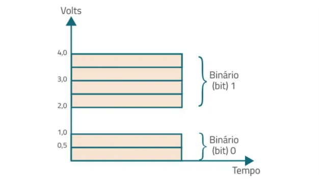

Perceba que, com a tensão baixa (bit 0), o equipamento estará desligado, já, com a tensão alta (bit 1), ele estará ligado. 

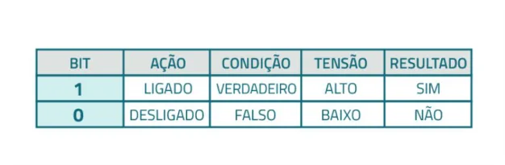

Em 1938, o pesquisador Claude Shannon, do Instituto de Tecnologia de Massachusetts (MIT), propôs o uso da álgebra booleana para resolver problemas no projeto de circuitos com comutadores. As técnicas de Shannon passaram a ser aplicadas na análise e no desenvolvimento de circuitos digitais eletrônicos. 

##### Comentário 

Da mesma forma que um cozinheiro segue um livro de receitas para preparar um prato, a álgebra booleana seria uma espécie de receita utilizada para montar circuitos. 

A álgebra booleana, por meio de suas propriedades básicas, funciona como uma ferramenta para: 

###### Análise 

###### Projeto 

A função de um circuito digital é descrita de acordo com a análise de um modo simplificado. 

A lógica booleana é utilizada para que seja desenvolvida uma implementação simplificada desta função, ao especificar uma determinada função de um circuito. 

Iniciando o nosso estudo, representaremos os operadores lógicos e, a partir desses, perceberemos a representação das suas respectivas portas lógicas. Neste caso, para que possamos compreender os valores resultantes de cada operador lógico, é necessário conhecer as tabelas-verdade (tabelas que representam todas as possíveis combinações dos valores das variáveis de entrada com os seus respectivos valores de saída). 

## Atividade 1 

Descreva o que são portas lógicas e qual a importância da lógica booleana para o funcionamento dos circuitos digitais. Utilize uma analogia simples para explicar como as portas lógicas processam sinais binários. 

##### Chave de resposta 

Portas lógicas são circuitos eletrônicos que realizam operações básicas com sinais binários, que podem assumir apenas dois valores: 0 e 1. Elas funcionam como elementos que recebem esses sinais de entrada e produzem um sinal de saída, ajudando a controlar o funcionamento de equipamentos eletrônicos digitais. 

A lógica booleana é a ferramenta matemática que permite representar e analisar essas operações, ajudando a descrever como os circuitos digitais devem se comportar. 

Uma analogia para entender as portas lógicas é pensar nelas como pequenas “caixinhas mágicas” que recebem sinais ligados (1) ou desligados (0) e decidem o que liberar para a saída, como um interruptor que controla a passagem da eletricidade. 

## Tabela-verdade 

Compreender o comportamento lógico de um circuito é importante para a formação de qualquer profissional da computação. A tabela-verdade permite visualizar todas as combinações possíveis de entradas e suas saídas. Vamos agora aprender a interpretar e montar tabelas-verdade de circuitos lógicos simples, e ver como essa representação se relaciona com situações do dia a dia que envolvem escolhas, regras e consequências. 

Neste vídeo, serão mostradas todas as combinações possíveis de entradas e como elas determinam as saídas, com exemplos práticos que conectam lógica digital a situações do dia a dia. 

##### Conteúdo interativo 

Acesse a versão digital para assistir ao vídeo. 

A tabela-verdade é uma técnica utilizada para descrever como a saída de um circuito lógico é dependente dos níveis lógicos de entrada, isto é, são tabelas que conterão todas as possíveis combinações das variáveis de entrada de uma determinada função e, como resultado, os valores de saída.Neste caso, a tabela-verdade conterá o número necessário de linhas para representar todas as combinações possíveis das suas variáveis de entrada.Os valores 0 e 1 são considerados como 0 = FALSO e 1 = VERDADEIRO. Como exemplo, observe a imagem a seguir: 

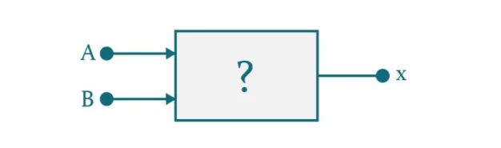

Representação de um circuito com duas entradas e uma saída 

Imagine uma cena simples e familiar: um prédio com uma porta automática que só abre se duas condições forem verdadeiras ao mesmo tempo: o visitante deve ser um morador (Entrada A = 1) e possuir o cartão de acesso ativo (Entrada B = 1). 

Se qualquer uma dessas condições não for satisfeita (ou ambas forem falsas), a porta permanecerá fechada (Saída = 0). Essa é exatamente a lógica que um circuito com duas entradas e uma saída, do tipo AND, representa e que a tabela-verdade revela com precisão (estudaremos circuitos AND, OR, entre outros). Pensar nesses circuitos como portarias digitais pode ajudar bastante! 

Agora, veja como fica a tabela-verdade do circuito com duas entradas e uma saída: 

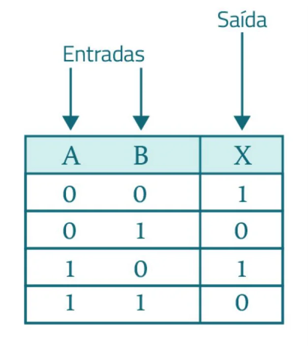

## Atividade 2 

Imagine um sistema de segurança que libera o acesso a uma sala somente quando dois sensores estão ativados simultaneamente: o sensor de presença (A) e o sensor de reconhecimento facial (B). Se algum dos sensores não detectar o requisito, o acesso é negado. 

Qual das tabelas representa corretamente o comportamento desse sistema? 

||A|B|Acesso|
|---|---|---|---|
||0|0|1|
## |A|0|1|1|
||1|0|1|
||1|1|0|
||A|B|Acesso|
||0|0|0|
## |B|0|1|0|
||1|0|0|
||1|1|1|
||A|B|Acesso|
||0|0|0|
## |C|0|1|1|
||1|0|0|
||1|1|1|
||A|B|Acesso|
||0|0|1|
## |D|0|1|0|
||1|0|0|
||1|1|1|

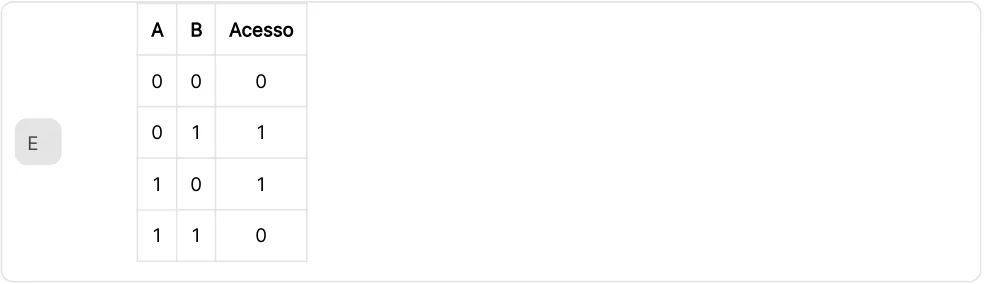

<!-- Start of picture text -->
A B Acesso 0 0 0 0 1 1 E 1 0 1 1 1 0 <!-- End of picture text -->

##### A alternativa B está correta. 

O sistema só libera o acesso (1) quando ambos os sensores A e B estão ativados simultaneamente (1). Em todas as outras situações, o acesso é negado (0). Portanto, a tabela que corresponde a essa lógica é a alternativa b. 

## Operadores e portas lógicas básicas 

São elementos centrais da lógica digital, pois permitem que decisões e controles sejam implementados em sistemas computacionais. Através de combinações simples de sinais binários, operadores como AND, OR e NOT definem comportamentos lógicos em algoritmos, circuitos e dispositivos eletrônicos. 

Já as portas lógicas são suas representações físicas em hardware, capazes de executar essas operações em alta velocidade. É importante compreender essas estruturas para analisar e projetar circuitos digitais, e para interpretar o modo como máquinas “pensam” e reagem a diferentes combinações de entrada. 

Neste vídeo, você conhecerá os operadores lógicos AND, OR e NOT e entender como eles se transformam em portas lógicas no hardware. 

##### Conteúdo interativo 

Acesse a versão digital para assistir ao vídeo. 

###### Operadores lógicos 

São símbolos ou palavras que conectam valores lógicos (verdadeiro ou falso) para formar expressões que descrevem condições ou decisões. Eles são a base da lógica booleana e permitem a manipulação e combinação de informações em sistemas digitais, como computadores e circuitos eletrônicos. Através desses operadores, podemos construir regras que determinam o funcionamento de programas, equipamentos e processos automatizados, possibilitando tomadas de decisão claras e precisas. 

Portas lógicas básicas 

São dispositivos eletrônicos fundamentais que realizam operações lógicas básicas, processando sinais binários (0 e 1). Cada porta executa uma função específica, como combinar ou inverter sinais de entrada, e entrega um resultado que depende das condições dessas entradas. São os blocos construtores dos circuitos digitais, presentes em tudo, desde computadores até aparelhos eletrônicos do dia a dia, viabilizando o processamento e controle de informações de forma rápida e confiável. 

#### O operador e a porta OR (OU) 

O operador OR (OU) é a primeira das três operações básicas que vamos estudar e, para ilustrar a sua aplicação, vamos utilizar o seguinte cenário: 

Ao abrir a porta de um automóvel, a lâmpada de iluminação da cabine do veículo deverá acender?A resposta é sim.E, ao fechar a porta, a lâmpada deverá ser desligada.Dessa forma, a lâmpada estará acesa em duas situações distintas, se a porta do veículo estiver aberta OU (OR) o interruptor da lâmpada for acionado, mesmo com a porta fechada. 

Neste cenário, vamos representar cada uma dessas seguintes possibilidades: 

- A variável A representará a abertura da porta. 

- 

- A variável B representará o interruptor. 

- 

- A variável X representará o estado da lâmpada, se está acesa ou apagada. 

- 

Assim, a expressão booleana para a operação OR é definida como: 

## X = A + B

Em que o sinal (+) não representa uma soma, e sim a operação OR, cuja expressão é lida como: 

X é igual a A OR B. 

Ao analisar as combinações possíveis, levando em consideração os valores, temos o seguinte: 

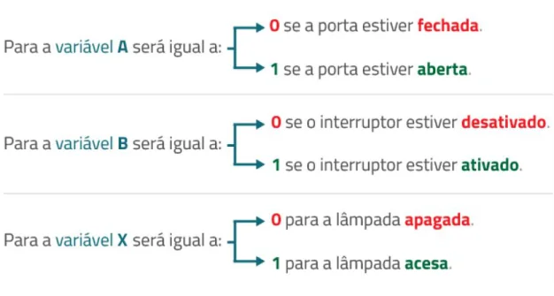

Resultado das análises das combinações dos valores. 

Na tabela a seguir, estão representadas as combinações dos valores possíveis com a construção da tabelaverdade para o operador OR com duas entradas. Confira! 

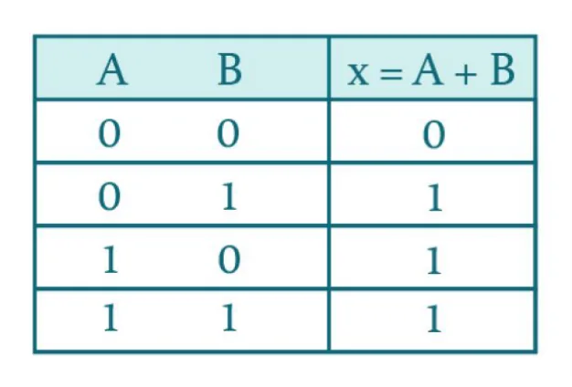

Ao analisar a tabela-verdade, chegaremos à conclusão de que a lâmpada estará apagada (valor igual a 0, FALSO) se — e somente se — tanto o interruptor quanto a porta possuírem o valor de entrada igual a FALSO (igual a 0) e, para as demais combinações, a lâmpada estará acesa (igual a 1, VERDADEIRO).Nos circuitos digitais, uma porta OR é um circuito que tem duas ou mais entradas e a sua saída é igual à combinação das entradas através da operação OR, como ilustrado na seguinte imagem: 

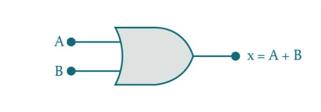

Símbolo de uma porta OR com duas entradas e uma saída. 

A seguir, veja outro caso e a sua correspondente tabela-verdade com três entradas e uma saída: 

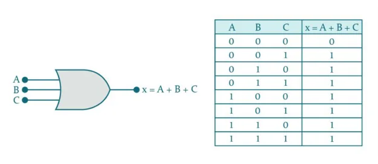

Símbolo de uma porta OR. 

#### Vamos praticar! 

Seja A = 1100, B = 1111 e C = 0001, para calcular L = A + B + C (A or B or C), o cálculo deve ser realizado em duas etapas, utilizando a seguinte Tabela Verdade da porta OR: 

Sempre utilizando as combinações de entrada e os resultados definidos nas tabelas-verdade da porta OR, vamos iniciar os cálculos. Na primeira etapa, vamos calcular M = A + B (A or B): 

Conteúdo interativo Acesse a versão digital para ver mais detalhes da imagem abaixo. 

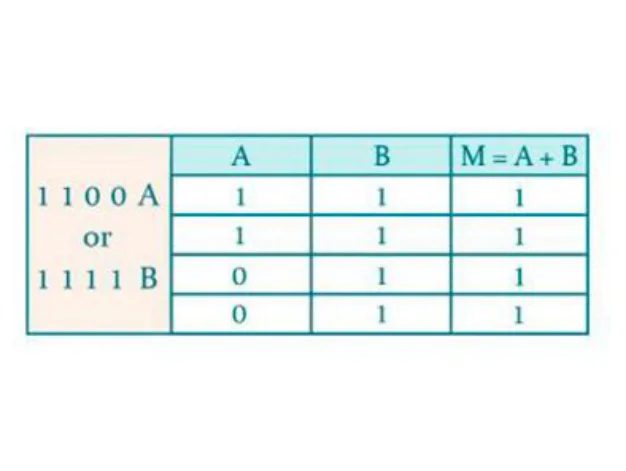

Em seguida, o resultado parcial obtido M (1111) será combinado com C (0001) em outra operação lógica OR, L = M + C (M or C): 

##### Conteúdo interativo 

Acesse a versão digital para ver mais detalhes da imagem abaixo. 

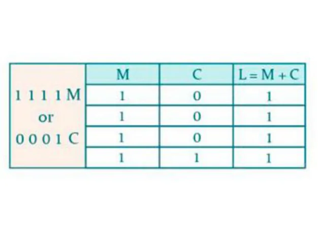

O resultado final obtido será: L = 1111. 

#### O operador e a porta AND (E) 

O operador AND (E) é a segunda das três operações básicas que vamos estudar. Para ilustrar a sua aplicação, vamos utilizar o seguinte cenário: 

Ao acionar a botoeira da cabine de um elevador, será acionado o motor do elevador imediatamente?Esta resposta dependerá de que outras condições estejam atreladas ao seu acionamento.Vamos analisar o acionamento deste botão em conjunto com um sensor que identificará se a porta do elevador está fechada. Logo, a resposta será sim.Se a porta estiver fechada, então o motor será ligado. O motor será acionado (valor igual a 1, verdadeiro) em uma única situação, se a porta do elevador estiver fechada (valor igual a 1, verdadeiro) E (AND) o botão do elevador for acionado (valor igual a 1, verdadeiro). 

Neste cenário, vamos representar cada uma dessas possibilidades: 

- A variável A representará o sensor da porta. 

- 

- A variável B representará o botão. 

- 

- A variável X representará o acionamento do motor. 

- 

Deste modo, a expressão booleana para a operação AND é definida como: 

## X = A · B

Em que o sinal ( · ) não representa uma multiplicação, e sim a operação AND e a expressão é lida como: 

X é igual a A AND B. 

Agora, ao analisar as combinações possíveis, levando em consideração os valores, temos o seguinte: 

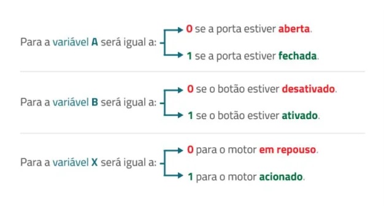

Resultado das análises das combinações dos valores. 

A seguir, estão representadas as combinações com dois valores de entrada e uma saída para a tabela - verdade com o operador AND. 

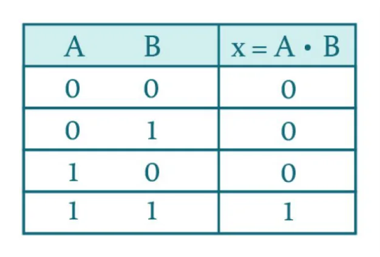

Ao analisar a tabela-verdade, chegaremos à conclusão de que o motor será acionado (valor igual a 1, verdadeiro) se — e somente se — tanto o botão quanto o sensor da porta possuírem o valor igual a verdadeiro (igual a 1) e, para as demais combinações, o motor estará desligado (igual a 0).Nos circuitos digitais, uma porta AND é um circuito que tem duas ou mais entradas e a sua saída é igual à combinação das entradas através da operação AND, conforme ilustrado na imagem a seguir: 

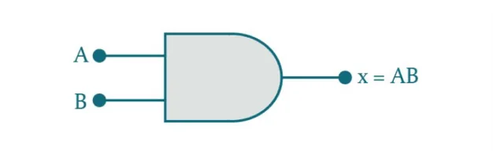

Símbolo de uma porta AND com duas entradas e uma saída. 

Observe agora outro caso e a sua correspondente tabela-verdade com três entradas e uma saída. 

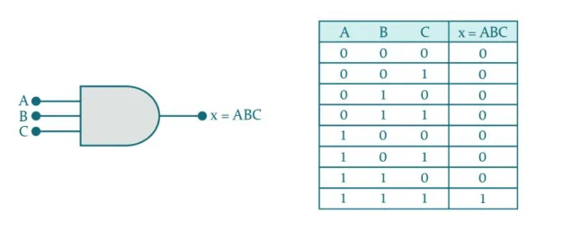

Símbolo de uma porta AND. 

Vamos praticar! 

### Prática 1 

Seja A = 1 e B = 0, calcule o valor de X, quando X = A • B (A and B). 

Vamos analisar a seguinte tabela-verdade da porta AND: 

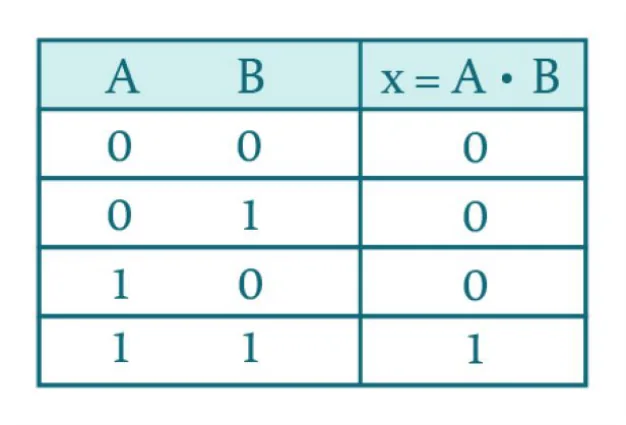

Podemos verificar que o valor de X = 0, pois 1 and 0 = 0. 

#### Prática 2 

Agora, seja A = 0110 e B = 1101, calcule o valor de X, quando X = A • B (A and B). Analisando a seguinte tabela-verdade da porta AND: 

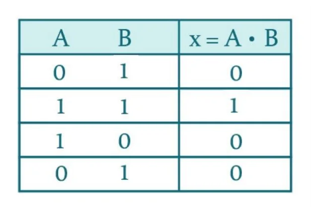

Temos o seguinte: 

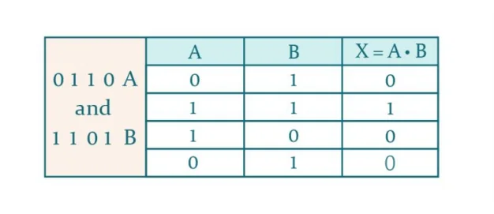

Operando bit a bit, encontramos o valor de X = 0100. 

#### O operador e a porta NOT (NÃO) 

O operador NOT (NÃO) ou inversor é a terceira das três operações básicas que estudaremos, sendo este operador totalmente diferente dos outros já estudados, porque pode ser realizado através de uma única variável.Como exemplo, se uma variável A for submetida à operação de inversão, o resultado X pode ser expresso como: 

## X = A

Em que a barra sobre o nome da variável representa a operação de inversão e a expressão é lida como: 

X é igual a NOT A ou X é igual a A negado ou X é igual ao inverso de A ou X é igual ao complemento de A. 

Como utilizaremos a barra para identificar a negação, outra representação também é utilizada para a inversão por outros autores, que é a seguinte: 

<!-- Start of picture text -->
A' = A <!-- End of picture text -->

A seguir, veja a representação da tabela-verdade para o operador NOT com uma entrada e uma saída. 

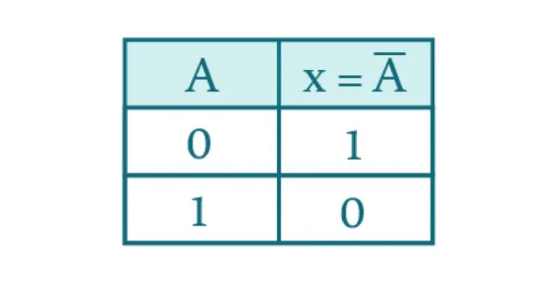

Nos circuitos digitais, uma porta NOT é um circuito que tem uma entrada, e a sua saída, a negação, é indicada por um pequeno círculo: 

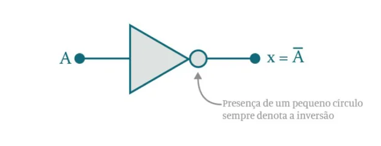

Símbolo de uma porta NOT com uma entrada e uma saída. 

## Atividade 3 

Um sistema foi desenvolvido para ativar uma sirene de emergência em uma fábrica. A sirene deve ser acionada sempre que houver detecção de fumaça ou quando o botão de emergência for pressionado. 

Qual alternativa descreve corretamente o comportamento esperado da sirene? 

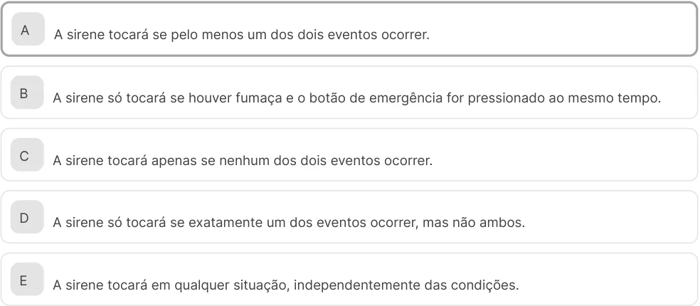

<!-- Start of picture text -->
A A sirene tocará se pelo menos um dos dois eventos ocorrer. B A sirene só tocará se houver fumaça e o botão de emergência for pressionado ao mesmo tempo. C A sirene tocará apenas se nenhum dos dois eventos ocorrer. D A sirene só tocará se exatamente um dos eventos ocorrer, mas não ambos. E A sirene tocará em qualquer situação, independentemente das condições. <!-- End of picture text -->

##### A alternativa A está correta. 

O comportamento descrito corresponde à lógica da operação OR: a sirene será acionada sempre que ao menos uma das condições for verdadeira. Ou seja, se houver fumaça, ou se o botão for pressionado, ou ambos — a sirene toca. As demais alternativas refletem lógicas diferentes (AND, NOR, XOR ou tautologia) e, portanto, estão incorretas. 

## Outras portas lógicas fundamentais 

Além das portas lógicas básicas, como AND e OR, existem outras importantes na construção de circuitos digitais: as portas NOR e NAND, que combinam funções lógicas com a negação, permitindo resultados mais complexos e versáteis. A seguir, você verá como essas portas funcionam, como são representadas nos circuitos e a lógica por trás de seu comportamento. Trouxemos alguns exemplos que ajudarão a entender seu papel no processamento de sinais binários em dispositivos eletrônicos. 

Neste vídeo, conheça as portas lógicas NAND e NOR, suas representações em circuitos, o funcionamento lógico por trás de cada uma e suas aplicações práticas em dispositivos eletrônicos. 

##### Conteúdo interativo 

Acesse a versão digital para assistir ao vídeo. 

A porta NOR (Não OU) 

Para ampliar o nosso estudo sobre as portas lógicas, é importante perceber que o inversor, ou a função NOT (NÃO), pode ser aplicada tanto em variáveis como em portas lógicas inteiras, assim invertendo toda sua saída.Seria possível, portanto, concatenar a saída de uma porta lógica com a entrada do inversor, conforme apresentado na imagem a seguir, produzindo a inversão de todos os seus valores de saída.Porém, podemos construir a sua representação de uma forma diferente, criando a inversão em toda porta lógica de modo bastante peculiar — com a identificação de um pequeno círculo na sua saída, indicando a inversão. Veja a imagem a seguir: 

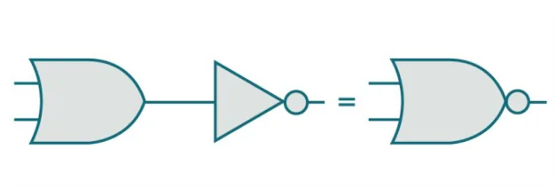

A porta NOR (Não OU). 

Você pode perceber que o símbolo da porta NOR de duas entradas representado na imagem a seguir é o mesmo símbolo utilizado para representar a porta OR, com apenas uma diferença — a inclusão de um pequeno círculo na sua saída, que representa a inversão da operação OR.A expressão que representa a porta NOR é: 

Note que a barra que indica a negação/inversão será estendida a todas as variáveis de entrada, neste exemplo com duas variáveis: 

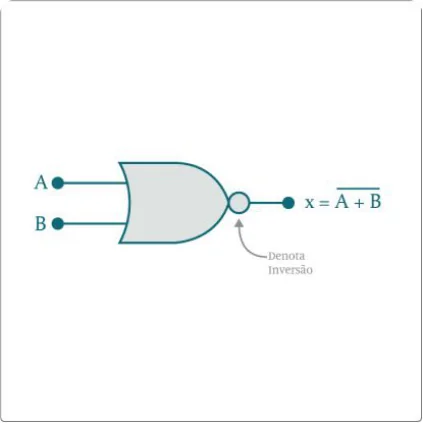

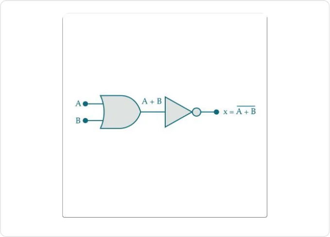

A tabela-verdade a seguir mostra que a saída da porta NOR é exatamente o inverso da saída da porta OR: 

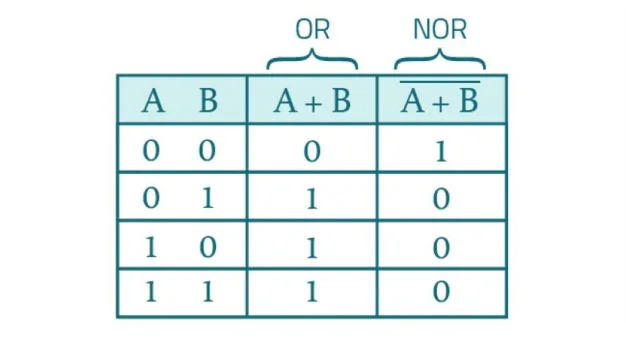

Ao analisar as combinações possíveis com duas entradas, levando em consideração os valores para as variáveis de entrada A e B, somente produzirá uma saída 1 (VERDADEIRO) se — e somente se — todas as 

entradas sejam 0 (FALSO) e, para as demais condições, produzirá como resultado na saída igual a 0 (FALSO).Utilizando uma adaptação do cenário descrito na porta OR, podemos ter o seguinte: 

###### Variável A, B e X 

Nós podemos representar a aplicação desta função como: a lâmpada poderá estar apagada em duas situações distintas, se a porta do veículo estiver aberta e o interruptor da lâmpada for acionado. Neste cenário, vamos representar cada uma dessas possibilidades: a variável A representará a abertura da porta, a variável B representará o interruptor e a variável X representará o estado da lâmpada; se está acesa ou apagada. 

Igual a 0 e igual a 1 

Ao analisarmos as combinações possíveis, levando em consideração os valores para a variável A, será igual a 0 se a porta estiver fechada e será igual a 1 se a porta estiver aberta. Em relação à variável B, temos o valor igual a 0 para o interruptor ativado e 1 para o interruptor desativado e, por fim, a variável X possuirá o valor 0 para a lâmpada apagada e 1 para a lâmpada acesa. 

#### A porta NAND (Não E) 

O símbolo da porta NAND de duas entradas, representado na imagem a seguir, é o mesmo símbolo utilizado para representá-la, com apenas uma diferença – a inclusão de um pequeno círculo na sua saída, que representa a inversão da operação AND.A expressão que representa a porta NAND é: 

## X = A · B

Em que a barra sobre o nome da variável representa a operação de inversão e a expressão é lida como: 

X é igual a NOT A ou X é igual a A negado ou X é igual ao inverso de A ou X é igual ao complemento de A. 

Veja o símbolo e o circuito a seguir: 

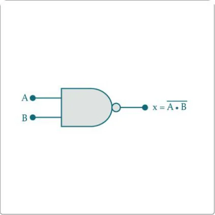

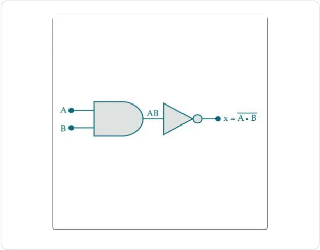

A seguinte A tabela-verdade mostra que a saída da porta NAND é exatamente o inverso da saída da porta AND: 

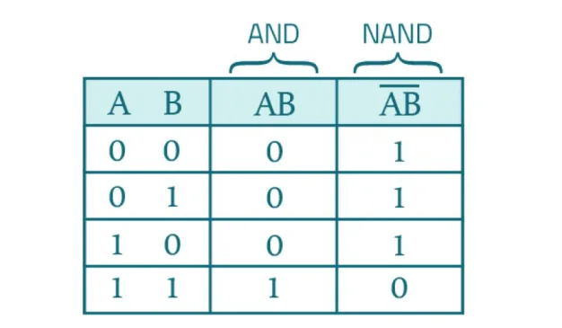

Ao analisar as combinações possíveis, levando em consideração os valores para as variáveis de entrada A e B, somente produzirá uma saída 0 (FALSO) se — e somente se — todas as entradas forem 1 (VERDADEIRO) e, para as demais condições, produzirá como resultado na saída igual a 1 (VERDADEIRO).Conforme apresentado anteriormente, veja o cenário a seguir. 

Um semáforo para bicicletas e um sensor de movimento para a passagem de pedestres.Assim, o sinal verde (liberando a passagem para ciclistas) estará ligado (0, FALSO) se duas condições forem atendidas: um botão seja acionado (1, VERDADEIRO) e o sensor de movimento não detecte a existência de um pedestre naquele momento (1, VERDADEIRO). Para as demais possibilidades, o semáforo estará com o farol vermelho acionado (1, VERDADEIRO), bloqueando o tráfego de ciclistas. 

#### Vamos praticar! 

Seja A = 1 0 0 1 0 e B = 1 1 1 1 0, calcule X = A · B. Uma resposta interessante para este caso é a realização de duas operações lógicas em sequência. Primeiro, realiza-se a operação AND e, em seguida, obtém-se o inverso do resultado, produzindo o valor final para uma operação NAND.Pela tabela-verdade da porta AND, temos: 

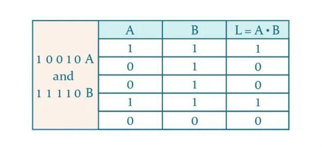

O resultado parcial: L = 10010. Invertendo os bits de L, usando a Tabela Verdade da porta NOT:1 0 0 1 0 = T = A · B0 1 1 0 1 = T = A · B Resultado: X = T = A · B = 0 1 1 0 1. 

#### Resolução da expressão booleana 

Para entender a lógica da situação apresentada, assista ao vídeo a seguir! 

##### Conteúdo interativo 

Acesse a versão digital para assistir ao vídeo. 

#### A porta XOR (Ou exclusivo) 

A porta XOR que é uma abreviação do termo exclusive or, poderá ser considerada como um caso particular da função OR.Neste sentido, a porta XOR produzirá um resultado igual a 1 (VERDADEIRO), se pelo menos um dos valores das entradas for diferente dos demais (exclusividade de valor da variável), isto é, a porta produzirá o resultado 0 (FALSO) se — e somente se — todos os valores das 

entradas forem iguais, conforme é apresentado na tabela-verdade a seguir: 

A expressão que representa a porta XOR é: 

##### X = A ⊕ B 

E seu símbolo fica da seguinte forma: 

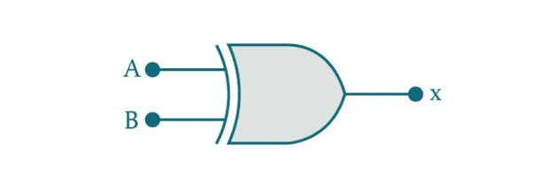

Símbolo de uma Porta XOR. 

Para ilustrar a sua aplicação, vamos utilizar o seguinte cenário: ao se acionar um motor elétrico de um equipamento por dois botões distintos em dois locais diferentes. O motor somente será acionado se — e somente se — um dos botões for acionado (valor igual a 1, VERDADEIRO). Para os demais casos, o botão não fará a atuação do motor (valor igual a 0, FALSO), isto é, se ambos os botões não forem acionados ou ambos forem acionados ao mesmo instante, o equipamento não será ligado. Assim, podemos, neste exemplo, utilizar uma função XOR. 

#### Vamos praticar! 

Seja A = 1 e B = 0, calcule o valor de X, quando X = A ⊕ B. Analisando a tabela-verdade da porta XOR, temos: 

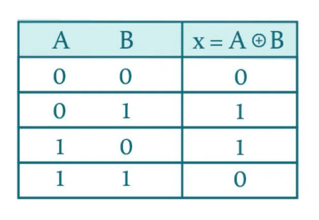

Podemos verificar que: 

O valor de X = 1, pois 0 xor 1 = 1. 

#### A porta XNOR (coincidência) 

A expressão que representa a porta XNOR é: 

A tabela-verdade da porta XNOR fica da seguinte forma: 

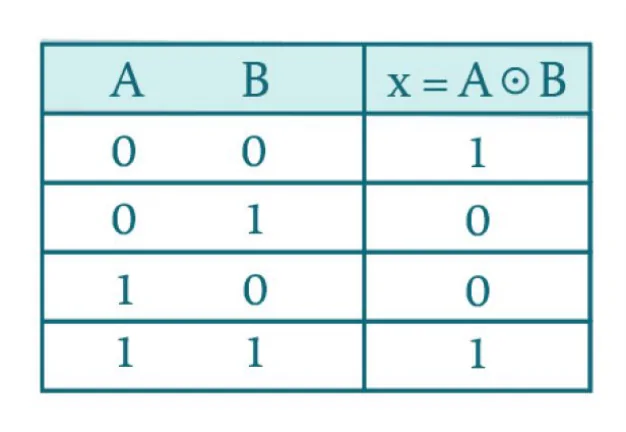

E o símbolo a seguir: 

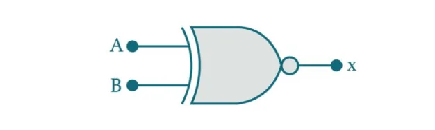

Símbolo de uma Porta XNOR. 

Poderíamos citar um exemplo que negue a condição definida pela função XOR. Para ilustrar a sua aplicação, veja o seguinte cenário. 

Ao se acionar uma porta rotatória em um banco através de dois botões distintos, localizados nos dois lados da porta. A porta será liberada se — e somente se — um dos botões for acionado (valor igual a 1, VERDADEIRO).Para os demais casos, ele manterá a porta bloqueada (valor igual a 0, FALSO), isto é, se ambos os botões não forem acionados ou ambos forem acionados ao mesmo instante. Assim, podemos, neste exemplo, utilizar uma função XNOR. 

## Atividade 4 

Explique com suas palavras o que são as portas lógicas NOR e NAND e como elas se diferenciam de suas versões básicas (OR e AND). Use uma analogia simples para ilustrar 

como o uso da inversão nessas portas afeta o resultado final. 

###### Chave de resposta 

As portas lógicas NOR e NAND são variações das portas OR (OU) e AND (E), respectivamente, com a diferença de que apresentam uma inversão (NOT) em sua saída. No caso da porta NOR, ela realiza a mesma operação da porta OR, mas inverte o resultado: sua saída será 1 apenas se todas as entradas forem 0; caso contrário, a saída será 0. Já a porta NAND faz o oposto da AND: ela só gera saída 0 quando todas as entradas forem 1; em qualquer outra situação, a saída será 1. 

Para ilustrar esse comportamento, podemos imaginar um sistema de segurança com sensores. A porta OR seria comparável a um alarme que dispara se qualquer sensor for ativado. A NOR, por sua vez, representa um sistema que só permanece ativo se nenhum sensor estiver acionado. 

A porta AND pode ser vista como um portão que só abre quando todos os sensores estão corretamente posicionados, enquanto a 

NAND age de forma inversa, bloqueando a passagem justamente quando todos os sensores estão ativados. 

Essas portas são essenciais para compor combinações lógicas mais complexas e possibilitam o funcionamento das decisões eletrônicas dentro de computadores e diversos dispositivos digitais. 

2. Portas e operações lógicas 

## Expressões lógicas 

São a representação algébrica de circuitos digitais, permitindo descrever de forma clara e sistemática como sinais de entrada (variáveis binárias) se combinam para gerar uma saída única. Ao traduzir portas e conexões em operadores como AND, OR e NOT, facilitamos a análise, o projeto e a manutenção de sistemas digitais. Dominar essa notação é fundamental para prever o comportamento de circuitos, identificar falhas e propor modificações, além de servir de ponte entre a teoria da álgebra booleana e sua aplicação prática em hardware e software. 

Neste vídeo, você vai entender como expressões lógicas traduzem o funcionamento de circuitos digitais para uma forma algébrica. 

##### Conteúdo interativo 

Acesse a versão digital para assistir ao vídeo. 

Como você descobriria a lógica de saída de um circuito que nunca viu antes? 

Imagine-se como um engenheiro de TI que encontra uma "caixa preta" de circuitos sem documentação: por quais entradas você começaria a testar para entender como cada combinação acende ou apaga a saída? 

Em muitos casos, a interpretação de um circuito digital exige uma análise aprofundada e meticulosa sobre o circuito com o objetivo de conhecer o seu funcionamento, ou mesmo para analisar situações de criação, falha, expansão e alterações, entre outras possibilidades.Nesse contexto, para documentar e analisar circuitos de modo claro, representamos sua lógica por expressões algébricas — as expressões lógicas. 

Também denominadas como funções lógicas, podem ser definidas da mesma forma que uma expressão algébrica, isto é, com o uso de sinais de entrada (variáveis lógicas — binárias), ligados por conectivos lógicos (símbolos que representarão uma operação lógica, com parênteses, opcionalmente) e também com o sinal de igualdade (=), produzindo, como resultado, um único sinal de saída. 

Pense em uma expressão lógica como uma receita: cada variável é um ingrediente e cada operador, o modo de preparo. 

Desse modo, podemos afirmar que todo circuito lógico executará uma expressão booleana. Por exemplo: 

## X = A + B · C

O exemplo X é uma expressão lógica e, como uma função lógica, somente poderá possuir como valor 0 ou 1. O seu resultado dependerá dos valores das variáveis A, B e C e das operações lógicas OR, NOT e AND, nesta expressão apresentada. 

#### Vamos praticar! 

Vamos supor que, a partir de um circuito lógico, devemos construir a sua respectiva expressão lógica. Seja o circuito: 

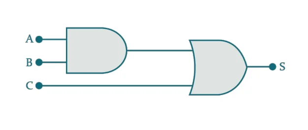

Circuito lógico. 

Como sugestão, utilizaremos a decomposição deste circuito em partes (blocos) a partir da sua saída (S). 

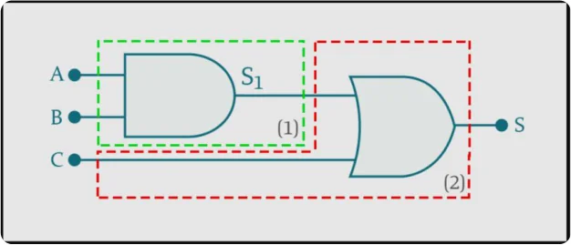

Decomposição do circuito. 

Dessa maneira, analisaremos o circuito nas duas seguintes partes: 

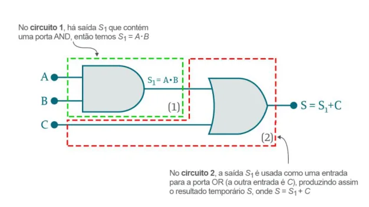

Decomposição do circuito. 

Agora, para obter a expressão final deste circuito, vamos substituir a expressão S1 em função de A e B. Como temos a seguinte fórmula: 

Temos, então: 

## Atividade 1 

Explique o que são expressões lógicas e por que elas são fundamentais para o entendimento de circuitos digitais. Em seguida, imagine um circuito com três entradas A, B e C e uma saída S, em que a saída é verdadeira somente quando exatamente duas das entradas estão ativas (valem 1). Escreva a expressão lógica usando os símbolos AND (·), OR (+) e NOT (barra) que representa essa condição. 

###### Chave de resposta 

Expressões lógicas são representações algébricas que combinam variáveis binárias (0 ou 1) por meio de operadores lógicos para descrever o comportamento de circuitos digitais. Elas são fundamentais porque permitem analisar, projetar e compreender como as entradas influenciam a saída de um sistema digital, facilitando o desenvolvimento e a manutenção de circuitos. 

Para o circuito descrito, a saída S será verdadeira quando exatamente duas das entradas A, B e C estiverem ativas. A expressão lógica é: S=(A⋅B⋅C)+(A⋅B⋅C)+(A⋅B⋅C) 

## Avaliação de uma expressão lógica 

Avaliar uma expressão lógica exige respeitar a ordem de precedência dos operadores, semelhante à utilizada em expressões aritméticas: o operador NOT tem prioridade, seguido por AND e depois OR. O uso de parênteses ajuda a organizar e tornar mais clara a avaliação. Seguindo essa hierarquia, é possível construir tabelas-verdade precisas, que ajudam a analisar e projetar sistemas digitais de forma correta e sem ambiguidades. 

Neste vídeo, você aprenderá a avaliar corretamente expressões lógicas, seguindo a ordem de precedência dos operadores: NOT primeiro, depois AND, e por fim OR. 

##### Conteúdo interativo 

Acesse a versão digital para assistir ao vídeo. 

Assim como na matemática, em que a multiplicação vem antes da soma, as expressões lógicas também seguem uma ordem de precedência entre os operadores. 

1. Primeiro avaliamos o operador NOT (negação). 

2. Depois o AND (conjunção). 

3. E por último o OR (disjunção). 

Os parênteses indicam partes da expressão que devem ser resolvidas antes de outras operações, garantindo que a lógica seja avaliada corretamente. Isso evita ambiguidades e erros na interpretação. Ou seja, os conteúdos entre parênteses devem ser executados primeiro.Seguindo o exemplo anterior, X = A + B · C, lê-se: 

##### X = A OR (NOT B) AND C 

A seguir, no diagrama lógico da função, podemos observar como cada porta representa uma operação lógica da expressão: a porta NOT atua sobre B, depois o resultado é combinado com C pela porta AND, e finalmente o resultado dessa operação é combinado com A pela porta OR. 

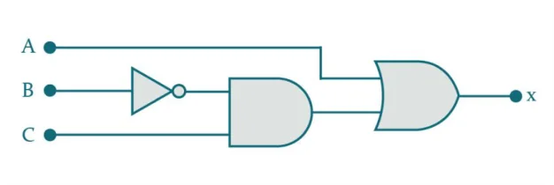

Diagrama lógico da função X. 

Agora, vamos proceder com a construção dessa tabela-verdade seguindo a ordem de precedência da expressão: 

##### X = A + B · C 

Observe como a saída X varia conforme as entradas, e como a ordem das operações influencia o resultado final. Essa prática ajuda a entender o impacto de cada operador e a importância da precedência para obter resultados corretos. 

Ou seja, NOT B, (NOT B) AND C, A OR (NOT B) AND C. Como temos três variáveis de entrada com dois valores possíveis (0 e 1) para cada uma, temos 2³ = 8 combinações, conforme a tabela-verdade da função X a seguir: 

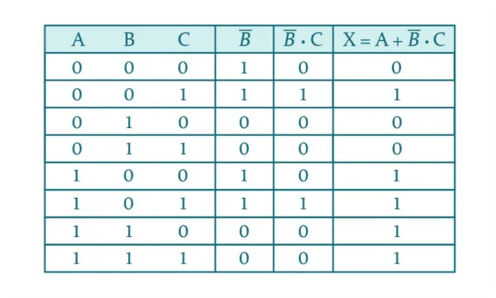

#### Expressões lógicas 

Para encerrar este tópico, assista ao vídeo a seguir. 

##### Conteúdo interativo 

Acesse a versão digital para assistir ao vídeo. 

## Atividade 2 

Considere a expressão lógica: 

## Y = (NOT A) AND (B OR C)

Seguindo a ordem correta de precedência dos operadores lógicos, qual das opções apresenta o valor de saída Y quando A = 0, B = 0, C = 1? 

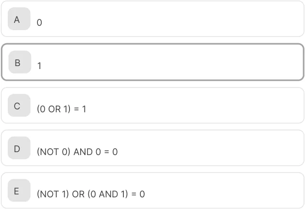

<!-- Start of picture text -->
A 0 B 1 C (0 OR 1) = 1 D (NOT 0) AND 0 = 0 E (NOT 1) OR (0 AND 1) = 0 <!-- End of picture text -->

A alternativa B está correta. Y = (NOT A) AND (B OR C) com: 

•    A = 0 •    B = 0 •    C = 1 Temos: Y = (NOT 0) AND (0 OR 1)Y = 1 AND 1Y = 1 

## Equivalência de funções lógicas 

No estudo dos circuitos digitais, é comum encontrar diferentes expressões lógicas que, apesar de escritas de formas distintas, apresentam exatamente o mesmo comportamento. Identificar quando duas funções são logicamente equivalentes permite otimizar circuitos, reduzir custos e melhorar o desempenho de sistemas digitais. 

Neste vídeo, você vai entender como diferentes expressões podem representar a mesma função lógica. Vamos explorar critérios para identificar essa equivalência e mostrar como ela pode ser usada para otimizar circuitos digitais. 

##### Conteúdo interativo 

Acesse a versão digital para assistir ao vídeo. 

#### Conceito 

Duas funções lógicas são consideradas equivalentes se, e somente se, para todas as possíveis combinações de entrada, elas produzirem os mesmos valores de saída. Em outras palavras, quando duas funções lógicas resultam em tabelas-verdade idênticas, dizemos que representam circuitos logicamente equivalentes, mesmo que utilizem portas diferentes em sua construção. 

#### Vamos praticar! 

### Prática 1 

Seja a função X = A · A, ao construir a tabela-verdade da função X, temos: 

##### Conteúdo interativo 

Acesse a versão digital para assistir ao vídeo. 

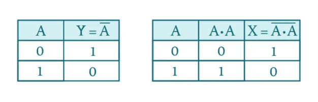

Como você pode verificar, o resultado da tabela-verdade da função X = A · A é idêntico à tabela-verdade da função Y = A. 

Assim, podemos afirmar que tanto a função X como a função Y são equivalentes. 

#### Prática 2 

Escreva a expressão lógica a partir do diagrama lógico a seguir: 

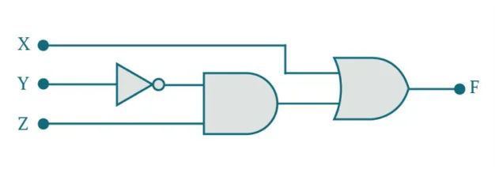

Diagrama lógico. 

##### Conteúdo interativo 

Acesse a versão digital para assistir ao vídeo. 

Partindo da variável saída X, nós podemos representar a expressão deste circuito nas seguintes partes: 

A partir da variável F, nós temos a porta OR que receberá os seguintes valores de entrada X e um resultado intermediário T1, assim F = X + T1. 

Para resolver o valor de T1, iremos identificar que T1 será o valor de saída da porta AND que possui os seguintes valores de entrada: not Y e Z, assim, T1 = X· Y. 

Substituindo a equação que possui T1 como saída na primeira equação, temos: F = X +Y· Z. 

Prática 3 

Escreva a expressão lógica a partir do diagrama lógico a seguir: 

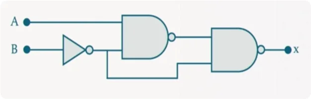

##### Conteúdo interativo 

Acesse a versão digital para assistir ao vídeo. 

Partindo da variável saída F, nós podemos representar a expressão deste circuito nas seguintes partes: 

A partir da variável X nós temos a porta NAND que receberá os seguintes valores de entrada not B e um resultado . intermediário T1, assim, 

Para resolver o valor de T1, iremos identificar que T1 será o valor de saída da porta NAND que possui os seguintes valores de entrada: not B e A, assim, . 

Substituindo a equação que possui T1 como saída na primeira equação, temos: 

#### Prática 4 

Seja A = 1, B = 0, C = 1, D = 1, calcule X = A +B · C ⊕ D. 

Adotando o esquema de prioridade, o valor de X será obtido com a realização das quatro etapas seguintes: 

##### Conteúdo interativo 

Acesse a versão digital para assistir ao vídeo. 

Realizar a operação AND (maior prioridade, além de ter uma inversão determinada sobre a operação). Assim, trata-se de calcular B · C = T1. 

Inverter o resultado parcial T1. 

Realizar a operação OR (as operações OR e XOR têm mesma prioridade, optando-se pela que está primeiro à 

esquerda).Assim, calcula-se: T2 = A + T1. 

Realizar a operação XOR, calculando-se X = T2 ⊕ D. 

Assim, vamos efetuar as etapas indicadas: 

0 · 1 = 0 = T1 0 = 1 1 + 1 = 1 = T2 1 ⊕ 1 = 0 = X 

#### Prática 5 

Seja A = 0, B = 0, C = 1, D = 1, calcule: 

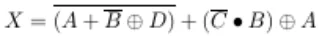

Adotando uma sequência de etapas, vamos considerar a ordem de precedência de cada operação. 

A primeira prioridade é solucionar os parênteses, e dentro ou fora destes, a prioridade é da operação AND sobre as demais, exceto se houver inversão (NOT).Assim, temos: 

##### Conteúdo interativo 

Acesse a versão digital para assistir ao vídeo. 

Calcular o parêntese mais à esquerda; dentro deste parêntese, efetuar primeiro a inversão do valor de B: B = 0 e notB = 1. 

Ainda dentro do parêntese, efetuar A + notB ou 0 + 1 = 1 = T1. 

Encerra-se o cálculo do interior do parêntese efetuando T1 ⊕ D = T2. Total do parêntese: 1 ⊕ 1 = 0 = T2 T1 = 1 e T2 = 0 

Calcula-se o outro parêntese, primeiro invertendo o valor de C (NOT), depois efetuando a operação AND daquele resultado com a variável B. O valor final é, temporariamente, T3. C = 1 e not C = 0, 0 · 0 = 0 = T3 

Finalmente, calcula-se a operação OR do resultado do primeiro parêntese (T2) com o do outro parêntese (T3), para concluir com a operação XOR com A. 0 + 0 = 0, X = 0 ⊕ 0 = 0. Resultado: X = 0 

#### Prática 6 

Vamos realizar operações lógicas com palavras de dados? Isto é, com variáveis de múltiplos bits. 

A = 1 0 0 1, B = 0 0 1 0, C = 1 1 1 0, D = 1 1 1 1, calcule o valor de X na seguinte expressão lógica: 

Para resolver essa expressão, utilizaremos o mesmo método, execução por etapas, mas, agora, são 4 algarismos binários em vez de um apenas. Considerando as prioridades já definidas anteriormente, temos: 

##### Etapa a 

Executar a operação AND de B e C, obtendo resultado parcial T1. 

##### Etapa b 

Inverter o valor de T1 (not T1). 

##### Etapa c 

Executar a operação OR de not T1, com D, atualizando um novo resultado parcial T2, que é a solução do primeiro parêntese. 

##### Etapa d 

Inverter o valor de D no segundo parêntese. 

##### Etapa e 

Executar a operação XOR de B com o inverso de D, obtendo o resultado parcial T3, que é a solução do segundo parêntese. 

##### Etapa f 

Executar a operação XOR de A com T2, obtendo um valor temporário para T4. 

##### Etapa g 

Executar a operação OR de T4 com T3, obtendo o resultado de X. 

Executando as etapas aqui indicadas, temos etapa (a): T1 = B • C, com resultado parcial: T1 = 0010. Veja a tabela a seguir: 

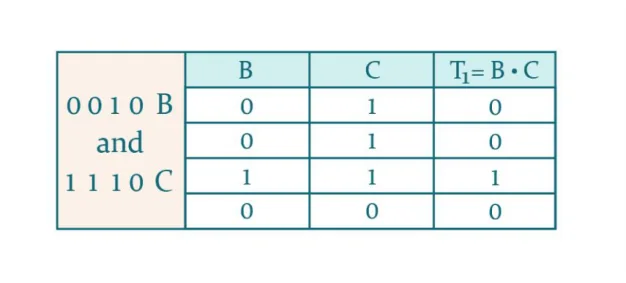

Temos a etapa (b): T1 = not T1 em que T1 = 0010 e not T1 = 1101. Como resultado parcial, fica o novo T1 = 1101.Temos a etapa (c): T1 = T1 + D, com o resultado parcial: T1 atualizado: T1 = 1111.Observe! 

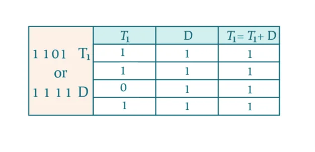

Temos a etapa (d): not D, em que D = 1111 e not D = 0000.Temos a etapa (e): em que o resultado parcial é T2 = 0010. Confira! 

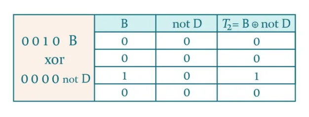

Temos a etapa (f): X = A ⊕ T1, em que o resultado parcial X = 0110. Veja a tabela a seguir: 

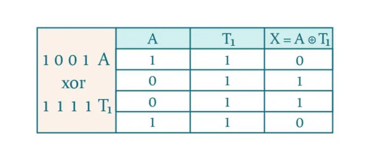

Temos a etapa (g): X = X + T2, em que o resultado de X = 0100. Vejamos! 

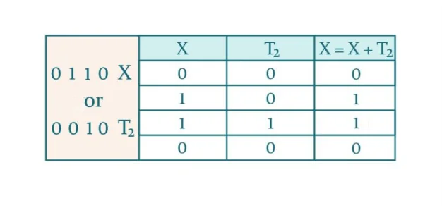

A etapa g será concluída na tabela a seguir. Lembrando que a operação or retornará um valor falso quando todas entradas forem falsas. 

Etapa (g):X = X + T2 

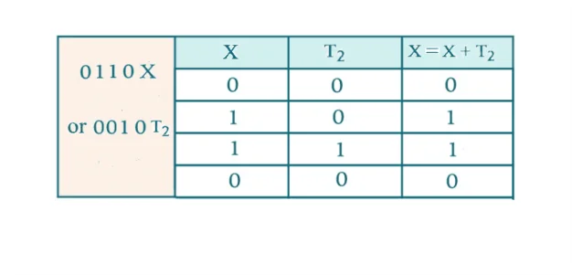

Assim, sendo: A=1001, B=0010, C=1110, D=1111. 

Calcular o valor de X na seguinte expressão lógica: 

Irá retornar o valor final de X=0110. 

## Atividade 3 

Duas funções lógicas diferentes podem, em certas situações, produzir os mesmos resultados para todas as combinações possíveis de entradas. 

Explique o que significa dizer que duas funções lógicas são equivalentes e descreva uma forma prática de verificar essa equivalência. 

Chave de resposta 

Vamos dividir a resposta em duas partes: 

- Definição de equivalência lógica 

Dizer que duas funções lógicas são equivalentes significa afirmar que, para todas as possíveis combinações de entrada, elas produzem os mesmos valores de saída. Em outras palavras, suas tabelas-verdade são idênticas. 

- Forma prática de verificação 

Uma forma prática e confiável de verificar essa equivalência é construir a tabela-verdade de cada uma das funções e comparar linha por linha os resultados obtidos. Se, em todas as situações, as saídas coincidirem, então as funções são logicamente equivalentes, mesmo que estejam escritas de maneira diferente ou utilizem operadores distintos. Essa verificação é fundamental na otimização de circuitos digitais, permitindo substituir expressões mais complexas por outras mais simples que realizam a mesma operação lógica. 

3. Expressões lógicas e diagramas lógicos 

## Propriedades da álgebra de Boole 

As regras da álgebra de Boole oferecem ferramentas para analisar, simplificar e otimizar expressões lógicas em circuitos digitais. Ao aplicar essas propriedades, podemos demonstrar equivalências, reduzir o número de portas e componentes físicos necessários e preparar designs mais eficientes e econômicos. Essas leis ajudam na verificação formal de projetos, na identificação de falhas e na adaptação de sistemas eletrônicos já existentes. 

Neste vídeo, você vai conhecer as principais propriedades da álgebra de Boole e entender como elas são aplicadas para simplificar expressões lógicas em projetos digitais. 

##### Conteúdo interativo 

Acesse a versão digital para assistir ao vídeo. 

As regras básicas da álgebra de Boole são bastante úteis quando devemos analisar a equivalência e a simplificação das expressões booleanas (lógicas) que definem uma função de um determinado dispositivo digital.Essas regras também facilitam a compreensão do funcionamento de dispositivos digitais, assim como a redução de custos na fabricação de circuitos digitais com a redução de componentes eletrônicos usados. 

Regras básicas da álgebra booleana 

Cada regra será mostrada em sua forma algébrica, acompanhada de uma explicação que ajuda na sua aplicação prática no projeto e na simplificação de circuitos. 

Confira, a seguir, a tabela das regras básicas da álgebra booleana. 

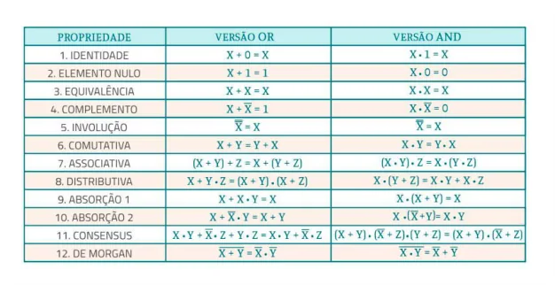

Tabela álgebra booleana. 

Vamos compreender a tabela com mais detalhes a seguir. 

##### Identidade 

- Lei: A + 0 = A; A · 1 = A • Explicação: Somar 0 ou multiplicar por 1 não altera o valor lógico. 

- Elemento nulo • Lei: A + 1 = 1; A · 0 = 0 

##### Elemento nulo 

- Explicação: Somar 1 torna a expressão verdadeira; multiplicar por 0 torna falsa. 

##### Equivalência 

- Lei: A + A = A; A · A = A • Explicação: Repetir a mesma variável em uma operação não muda o resultado. 

- Complemento • Lei: A + A̅ = 1; A · A̅ = 0 

##### Complemento 

- Explicação: Variável e seu complemento cobrem todas as possibilidades (tornam sempre verdadeiro ou falso). 

##### Involução 

- Lei: (A̅)̅ = A • Explicação: A negação da negação retorna ao valor original. 

##### Comutativa 

- Lei: A + B = B + A; A · B = B · A 

- Explicação: Ordem dos operandos não altera o resultado. 

##### Associativa 

- Lei: (A + B) + C = A + (B + C); (A · B) · C = A · (B · C) • Explicação: Agrupamento de variáveis pode ser alterado sem mudança de valor. 

##### Distributiva 

- Lei: A · (B + C) = A·B + A·C; A + (B · C) = (A + B) · (A + C) 

- Explicação: Misturar operações de soma e multiplicação segue regras semelhantes à matemática. 

##### Absorção 1 

- Lei: A + (A · B) = A • Explicação: Se A é verdadeiro, A·B pode ser ignorado; resultado já garantido. 

##### Absorção 2 

- Lei: A · (A + B) = A • Explicação: Se A for falso, A+B reduz à variável B mas A·(A+B) mantém falso. 

##### Lei do consenso (Cobertura) 

- Lei: (A · B) + (A̅ · C) + (B · C) = (A · B) + (A̅ · C) • Explicação: O termo B·C é redundante quando os outros dois termos já cobrem as combinações. 

##### De Morgan 

- Lei: (A · B)̅ = A̅ + B̅; (A + B)̅ = A̅ · B̅ 

- Explicação: Negações de conjunções viram disjunções de negações, e vice-versa. 

## Atividade 1 

Em um projeto de circuito digital, há a necessidade de simplificar uma expressão para reduzir o número de portas lógicas utilizadas, diminuindo custo e consumo de energia. 

A expressão lógica utilizada no circuito seria a seguinte: X=(A+B) **⋅** (A+C) 

Qual das alternativas apresenta a forma simplificada, logicamente equivalente, de X? 

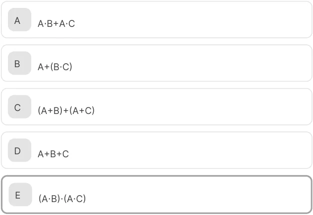

<!-- Start of picture text -->
A A⋅B+A⋅C B A+(B⋅C) C (A+B)+(A+C) D A+B+C E (A⋅B)⋅(A⋅C) <!-- End of picture text -->

A alternativa E está correta. 

Utilizando a segunda forma da lei distributiva da álgebra de Boole, observamos que a expressão A+(B⋅C) é equivalente a (A+B)⋅(A+C). Ou seja, ao expandir A+(B⋅C), reaplicamos distributivamente e chegamos à forma original. Essa equivalência garante que o circuito continue funcionando da mesma maneira, mas com menos portas, tornando-o mais eficiente. As demais opções não obedecem às propriedades fundamentais e, portanto, não reproduzem o mesmo comportamento lógico para todas as combinações de A, B e C. 

## Simplificação de expressões lógicas 

Agora, as propriedades da álgebra de Boole serão aplicadas de forma sistemática para reduzir expressões lógicas, mantendo o comportamento funcional. Cada exercício apresenta uma expressão que pode ser simplificada com o uso de leis como absorção, distributiva e de Morgan. O objetivo é desenvolver a habilidade de reconhecer termos redundantes e demonstrar equivalências, favorecendo projetos de circuitos digitais mais econômicos e eficientes. 

Neste vídeo, você aprenderá a aplicar as propriedades da álgebra de Boole para simplificar expressões lógicas de forma sistemática. Exploraremos leis como absorção, distributiva e de Morgan, com foco em identificar redundâncias e otimizar circuitos digitais, tornando-os mais eficientes e econômicos. 

##### Conteúdo interativo 

Acesse a versão digital para assistir ao vídeo. 

Vamos praticar! 

<!-- Start of picture text -->
Prática 1 <!-- End of picture text -->

Vamos analisar a possibilidade de simplificar a seguinte expressão lógica: 

A seguir, veja o diagrama dessa expressão: 

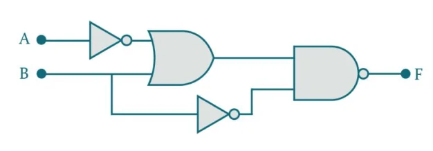

Como primeiro passo, vamos analisar as regras básicas da álgebra booleana e verificar se é possível aplicar alguma dessas regras na expressão. 

##### Etapa a 

Agora, podemos iniciar o processo de simplificação usando a regra 12 referente ao Teorema de de Morgan na versão AND de X · Y = X + Y: 

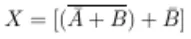

Etapa b Usando novamente o Teorema de Morgan na versão OR de X + Y = X · Y: 

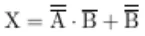

Etapa c Aplicando a regra 5 da involução em A e B, temos: X = A · B + B 

##### Etapa d 

Continuando com a simplificação pela regra 6 da comutatividade, temos: X = B + B · A 

Etapa e 

Usando a regra 9 da absorção 2, temos: X = A + B 

Por fim, podemos perceber que tanto na expressão inicial quanto na expressão simplificada, ambas produzem o mesmo resultado através da seguinte tabela-verdade e, neste caso, pode ser utilizada uma simplificação de um circuito com uma porta NAND e inversores (NOT) sendo substituído por uma única porta OR. 

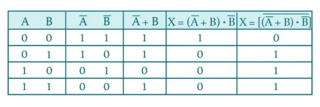

E a tabela-verdade da expressão X=A+B: 

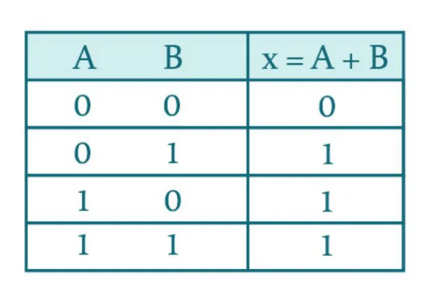

###### Prática 2 

Vamos simplificar a seguinte expressão: 

Usando as regras básicas da álgebra booleana, temos: 

- Usando a regra 8:X = A · B · (C + C) + A · C · (B + B) 

- 

- Usando a regra 4:X = A · B · 1 + A · C · 1 

- Usando a regra 1:X = A · B + A · C 

###### Prática 3 

Vamos simplificar a seguinte expressão: 

Usando as regras básicas da Álgebra booleana, temos: 

- Usando a regra 8:X = A · (B · C + C + B) 

- Ordenando os termos:X = A · (B · C + (C + B)) 

- Usando a regra 12:X = A · (B · C + (B · C)) 

- 

- Explicitando o termo B · C = Y:X = A · (Y +Y) 

- 

- Usando a regra 4:X = A · 1 

- 

- Usando a regra 1:X = A 

Prática 4 

Vamos simplificar a seguinte expressão: 

Usando a regra 9, temos: X = A. 

## Atividade 2 

Dada a expressão booleana a seguir, aplique passo a passo as propriedades fundamentais da álgebra de Boole para demonstrar sua simplificação completa: 

X = A · A + A · C + B · A + B · C 

Em sua resposta, apresente: 

1. A sequência de leis utilizadas (por exemplo, comutativa, distributiva, absorção etc.). 

2. O resultado de cada etapa intermediária. 

3. A forma final simplificada da expressão. 

Chave de resposta 

X = A · A + A · C + B · A + B · C 

Usando a regra 3, temos: 

X = A + A · C + B · A + B · C 

Usando a regra 9, temos: 

X = A + B · A + B · C 

Usando a regra 9 novamente, temos: 

## X = A + B · C

Logo, X = A · A + A · C + B · A + B · C = A + B · C 

4. Conclusão 

## Considerações finais 

O que você aprendeu neste conteúdo? 

- Os símbolos e as expressões que compõem a lógica booleana. 

- 

- Os conceitos de operadores e portas lógicas. 

- 

- O conceito de tabela-verdade. 

- 

- A avaliação e simplificação de expressões lógicas. 

- 

- As propriedades da álgebra de Boole. 

###### Explore + 

Para saber mais sobre os assuntos explorados neste conteúdo, sugerimos que leia: 

- Conceitos da Lógica Digital, capítulo redigido por Mario Monteiro no livro Introdução à Organização de Computadores. 

- Lógica Digital, capítulo de William Stallings, no livro Arquitetura e organização de computadores. 

- O artigo Lógica Booleana? Saiba um pouco mais sobre esta lógica e como ela funciona, de Elaine Martins. 

###### Referências 

MONTEIRO, M. Introdução à Organização de Computadores. 5. ed. Rio de Janeiro: LTC, 2007. 

STALLINGS, W. Arquitetura e organização de computadores. 10. ed. São Paulo: Pearson Education do Brasil, 2017. 

TANENAUM, A. S. Organização Estruturada de Computadores. 5. ed. São Paulo: Pearson Prentice Hall, 2007. 

TOCCI, R. J. Sistemas digitais e aplicações. 10. ed. São Paulo: Pearson Prentice Hall, 2007. 
