# Processamento em paralelo 

Apresentação do vínculo entre o alto desempenho da computação e o processamento em paralelo, identificando tipos de organização de processadores e a propensão para o uso da tecnologia multicore em busca do aumento de desempenho. 

Prof. Mauro Cesar Cantarino Gil 

1. Itens iniciais 

#### Propósito 

Apontar as arquiteturas multiprocessadas e multicore como uma alternativa às limitações da eficiência e do custo de desenvolvimento dos computadores com um único processador e único núcleo de execução, melhorando o desempenho do hardware com o aumento da frequência do clock do processador. 

#### Objetivos 

- Reconhecer as vantagens da computação de alto desempenho por meio do processamento em paralelo. 

- Identificar os tipos de organizações de processadores paralelos. 

- 

- Identificar as questões de desempenho do hardware que direcionam o movimento para os computadores multicore. 

#### Introdução 

Com os avanços tecnológicos houve uma crescente necessidade em aumentar o desempenho dos equipamentos usados em nosso cotidiano. Exemplo disso são processos executados em nossos celulares, tablets e notebooks. Para atender a essas demandas, o processamento em paralelo fez com que as operações pudessem ser executadas independentemente, minimizando o tempo de execução. Assim, veremos o vínculo entre o alto desempenho da computação e o processamento em paralelo. 

O vídeo introdutório a seguir nos faz compreender a importância por soluções paralelizáveis de modo a responder: o que é o processamento em paralelo? 

#### Introdução 

Conteúdo interativo 

Acesse a versão digital para assistir ao vídeo. 

1. Computação de alto desempenho por meio do processamento em paralelo 

## Evolução dos computadores 

### Questões de desempenho 

Nas últimas décadas, o custo dos sistemas computacionais diminuiu à medida que o desempenho e a capacidade das máquinas aumentaram significativamente. Exemplos disso são os equipamentos usados em nosso cotidiano, como computadores, tablets, smartphones e outros, que possuem uma capacidade computacional superior em comparação a um computador (mainframe) da década de 1960 ou 1970, considerado um supercomputador para a época. Observe a imagem a seguir: 

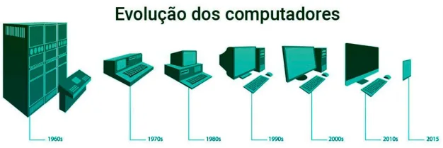

<!-- Start of picture text -->
A evolução da máquina. <!-- End of picture text -->

As limitações do passado foram colocadas de lado, tanto pelo custo quanto pela capacidade de processamento. Podemos citar algumas aplicações que, atualmente, possuem uma grande capacidade de processamento em sistemas baseados em microprocessadores: 

<!-- Start of picture text -->
Processamento de imagem Renderização tridimensional Reconhecimento de linguagem Videoconferência Modelagem e simulação <!-- End of picture text -->

Agora, responda: qual seria o resultado se determinada tarefa fosse realizada por várias pessoas ao invés de apenas uma? 

As respostas poderiam ser várias, inclusive a possibilidade de não conclusão dessa tarefa. Mas, se olhássemos a distribuição das ações que compõem a tarefa de forma organizada, buscando controlar a sua eficiência, poderíamos obter as seguintes respostas: 

##### Saiba mais 

A tarefa será realizada no mesmo tempo. O tempo de conclusão da tarefa será reduzido. 

A partir dessa análise, podemos compreender a importância da busca por soluções paralelizáveis, já que, atualmente, a maior parte das aplicações com software e hardware é implementada dessa forma. 

## Paralelismo em nível de instruções e processadores superescalares 

### Superescalar e pipeline 

#### Superescalar 

##### Conteúdo interativo 

Acesse a versão digital para assistir ao vídeo. 

O termo superescalar foi criado em 1987, por Agerwala e Cocke (apud STALLINGS, 2017), em função do projeto de uma máquina, cujo foco estava ligado à melhoria no desempenho da execução das instruções escalares. 

Veja a comparação: 

###### Superescalar 

Nesta organização, as instruções comuns (aritméticas de inteiros e pontos flutuantes), a carga do valor da memória em um registrador, o armazenamento do valor do registrador na memória e os desvios condicionais poderão ser iniciados e executados de forma independente. 

###### Pipeline 

Nesta técnica, o caminho executável de uma instrução é dividido em estágios discretos, permitindo ao processador efetuar várias instruções simultaneamente, contanto que apenas uma delas ocupe cada estágio durante um ciclo de relógio. 

Como exemplo, vamos representar a decomposição do processamento de instruções em um pipeline de seis estágios. Presumindo que os estágios tenham a mesma duração, um pipeline de seis estágios pode reduzir o tempo de execução de 9 instruções de 54 para 14 unidades de tempo. Veja o diagrama: 

**❯** 

Comparação da execução de instruções sem e com pipeline. 

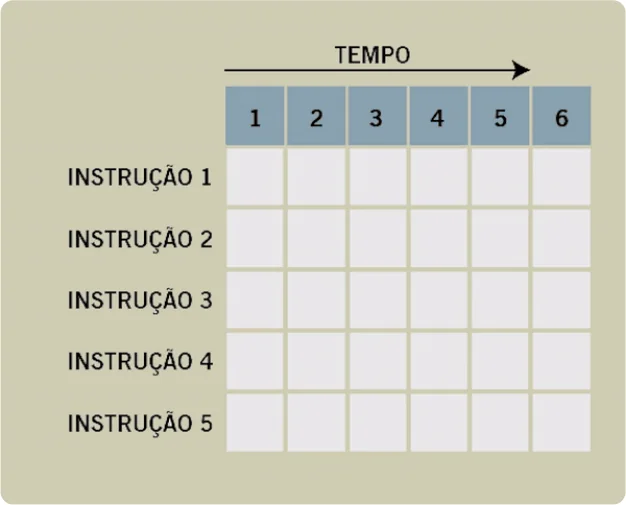

Comparação da execução de instruções sem e com pipeline. 

#### Execução de uma instrução em pipeline 

Vejamos agora esse processo passo a passo no vídeo abaixo. 

##### Conteúdo interativo 

Acesse a versão digital para assistir ao vídeo. 

As técnicas VLIW (Very Long Instruction Word) e superescalar emitem várias instruções independentes (de um fluxo de instruções) que são realizadas simultaneamente em diferentes unidades de execução. 

A VLIW depende de um compilador para determinar quais instruções emitir a qualquer ciclo de relógio, enquanto um projeto superescalar requer que um processador tome essa decisão. A tecnologia HyperThreading (HT) da Intel introduziu paralelismo ao criar dois processadores virtuais a partir de um único processador físico, dando ao sistema operacional habilitado a multiprocessador a impressão de executar em dois processadores, cada um com pouco menos da metade da velocidade do processador físico. 

Processadores vetoriais contêm uma unidade de processamento que executa cada instrução vetorial em um conjunto de dados, processando a mesma operação em cada elemento de dados. Eles dependem de pipelines profundos e altas velocidades de clock. 

Um processador matricial, também denominado processador maciçamente paralelo, contém diversas unidades de processamento que executam a mesma instrução em paralelo sobre muitos elementos de dados. Esse modelo pode conter dezenas de milhares de elementos de processamento. Portanto, esses processadores são mais eficientes quando manipulam grandes conjuntos de dados. 

Veja o esquema a seguir: 

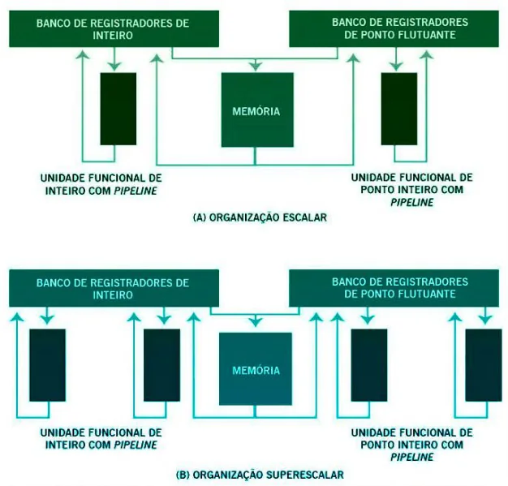

Organização escalar e superescalar. 

A essência da abordagem superescalar é a possibilidade de execução independente e concorrente em pipelines diferentes, inclusive em ordem diversa daquela definida no programa. 

### Pipelines profundos 

Pipelines profundos permitem que o processador realize trabalho em diversas instruções simultaneamente, de modo que muitos elementos de dados possam ser manipulados de uma só vez. 

##### Atenção 

O paralelismo é obtido quando as múltiplas instruções são habilitadas para estarem em diferentes estágios do pipeline no mesmo momento, diferente da organização escalar tradicional, na qual existe uma unidade funcional em um pipeline único para as operações inteiras e outra para as operações de ponto flutuante. 

### Superescalar X superpipeline 

Na abordagem conhecida como superpipeline — em que múltiplos estágios do pipeline executam tarefas que necessitam de menos da metade de um ciclo de clock — é possível dobrar a velocidade do clock interno, aumentando o desempenho, ao executar duas tarefas em um ciclo de clock externo. Veja o exemplo a seguir: 

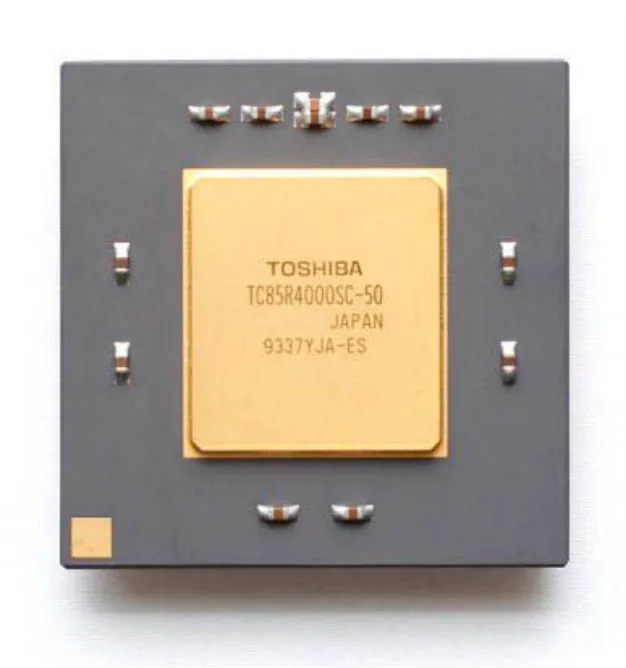

MIPS R4000. 

No esquema a seguir, podemos visualizar uma comparação entre as organizações superpipeline e superescalar, tendo um pipeline comum na parte superior do diagrama que será utilizado apenas como referência: 

No caso apresentado, o pipeline inicia a instrução e executa um estágio, ambos por ciclo de clock. Nesse exemplo, o pipeline possui quatro estágios (busca por instrução, decodificação da operação, execução da operação-quadro com linhas cruzadas e atualização do resultado). 

Note que, mesmo que várias instruções sejam executadas simultaneamente, apenas uma está no seu estágio de execução em determinado tempo. 

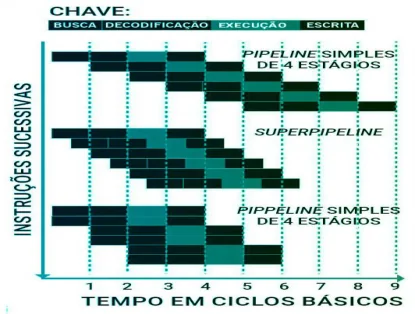

Superescalar X superpipeline 

Na representação do superpipeline, temos execução de dois estágios de pipeline por ciclo de clock. Repare que as funções executadas 

em cada estágio podem ser divididas em duas partes, que não se sobrepõem, e cada uma pode ser executada na metade do ciclo de clock. 

A parte final do diagrama ilustra a implementação superescalar, em que é possível perceber a execução de duas instâncias de cada estágio em paralelo. 

##### Atenção 

Nesse diagrama, tanto o superpipeline como o superescalar possuem o mesmo número de instruções executadas ao mesmo tempo em determinado estado. Assim, o processador superpipeline “perde” quando comparado ao superescalar no início do programa e a cada alvo de desvio. 

## Verificando o aprendizado 

##### Questão 1 

Considere um processador com pipeline ideal de 4 estágios, em que cada estágio ocupa um ciclo de processador. A execução de um programa com 9 instruções, utilizando os 4 estágios, levará 

A 

28 ciclos. 

B 

18 ciclos. 

C 

24 ciclos. 

D 

12 ciclos. 

E 

16 ciclos 

##### A alternativa D está correta. 

Veja como o cálculo foi feito: 

Como existem 4 estágios, cada instrução demandará percorrer 4 ciclos para ser executada e cada estágio ocupa 1 ciclo. 

###### NI = número da instrução 

|Ciclo|1º estágio|2º estágio|3º estágio|4º estágio|
|---|---|---|---|---|
|1|1l||||
|2|2l|1l|||
|3|3l|2l|1l|0|
|4|4l|3l|2l|1l|
|5|5l|4l|3l|2l|
|6|6l|5l|4l|3l|
|7|7l|6l|5l|4l|
|8|8l|7l|6l|5l|
|9|9l|8l|7l|6l|
|10||9l|8l|7l|
|11|||9l|8l|
|12||||9l|

Tabela: Ciclos. 

Assim, serão necessários 12 ciclos para que a nona instrução seja executada completamente. 

##### Questão 2 

Com os avanços tecnológicos, tornou-se possível a construção de máquinas multiprocessadas para atender às demandas em função do aumento do desempenho. Essa arquitetura nos possibilitou compreender a importância por soluções paralelizáveis, pois 

I- a tarefa será realizada no mesmo tempo. II- o tempo de conclusão da tarefa será reduzido. 

III- minimizou o custo na construção de máquinas pessoais. 

Considerando as afirmações acima, são verdadeira(s) 

A 

somente a I. 

B somente a II. C somente a I e a II. D somente a II e a III. E 

I, II e III. 

A alternativa C está correta. Máquinas com arquitetura com multiprocessador permitem execução de múltiplas tarefas em mesmo tempo, minimizando o tempo de conclusão das tarefas. 

2. Tipos de organizações de processadores paralelos 

## Múltiplos processadores 

### Arquitetura clássica 

A maior parte dos usuários considera o computador uma máquina sequencial, já que a maioria das linguagens de programação exige que o programador especifique os algoritmos com instruções ordenadas de modo contínuo. Seguindo essa linha de raciocínio, podemos concluir que: 

Os processadores executam programas com instruções de máquina em sequência porque cada instrução traz uma sequência de operações. 

Essa percepção poderia ser revertida se o conhecimento sobre a operação dessas máquinas fosse analisado com maiores detalhes. Como, por exemplo, no nível da realização de várias micro-operações, as quais possuem diferentes sinais de controle que são gerados de forma paralela (ao mesmo tempo) e de forma transparente (invisível). Um exemplo disso é o pipeline de instruções, no qual ocorre a sobreposição das operações de leitura e de execução, ambas refletindo a implementação de funções paralelas. 

Por outro lado, um dos fatores que permitiu a implementação de soluções para ampliar a eficiência nos computadores foi a redução do custo de hardware, mediante projetos de arquiteturas que realizassem as operações demandadas de forma mais rápida, robusta e com maior disponibilidade. As soluções paralelizadas vêm ao encontro dessas demandas. 

### Tipos de processadores paralelos – taxonomia de Flynn 

Levando em consideração a possibilidade de implementar uma solução de múltiplos processadores, Michael J. Flynn (foto) propôs, em 1966, a taxonomia de Flynn, esquema considerado pioneiro na classificação de computadores em configurações de paralelismo crescente. 

Esse esquema é composto de quatro categorias baseadas em tipos diferentes de fluxos (sequência de bytes) usados por processadores, os quais podem aceitar dois tipos de fluxos — de instru ções ou de dados. 

Vamos conhecer essas categorias, a seguir, na tabela da classificação de Flynn: 

Single-Instruction-Stream, Single-Data-Stream — SISD 

Significa "Computadores de fluxo único de instruções, fluxo único de dados". 

É o tipo mais simples da classificação. São considerados monoprocessadores tradicionais, onde um único processador busca por uma instrução por vez e a executa sobre um único item de dado. 

Técnicas como pipeline, palavra de instrução muito longa (VLIW) e projeto superescalar podem introduzir paralelismo em computadores SISD. 

Como exemplo, temos a Arquitetura sequencial e a Máquina de Von-Neumann. Multiple-Instruction-Stream, Single-Data-Stream — MISD 

Significa "Computadores de fluxo múltiplo de instruções, fluxo único de dados". 

Essa arquitetura não é utilizada devido à impossibilidade de garantir o acesso de múltiplas unidades de execução para uma unidade de dados, isto é, uma arquitetura MISD deveria possuir várias unidades de processamento agindo sobre um único fluxo de dados. Nesse caso, cada uma das unidades deveria executar uma instrução diferente nos dados e passaria o resultado para a próxima. É considerada apenas uma máquina teórica. 

Single-Instruction-Stream, Multiple-Data-Stream — SIMD 

Significa "Computadores de fluxo único de instruções, fluxo múltiplo de dados". 

As máquinas que fazem parte dessa classificação emitem instruções que atuam sobre vários itens de dados. Um computador SIMD consiste em uma ou mais unidades de processamento. 

Como exemplo, temos os processadores vetoriais e matriciais, que usam arquitetura SIMD. Um processador executa uma instrução SIMD processando-a em um bloco de dados (por exemplo, adicionando um a todos os elementos de um arranjo). Se houver mais elementos de dados do que unidades de processamento, elas buscarão elementos de dados adicionais para o ciclo seguinte. 

Isso pode melhorar o desempenho em relação às arquiteturas SISD, que exigem um laço para realizar a mesma operação em um elemento de dados por vez. Um laço contém muitos testes condicionais e requer que o processador SISD decodifique a mesma instrução várias vezes e leia dados uma palavra por vez. Ao contrário, arquiteturas SIMD leem um bloco de dados por vez, reduzindo dispendiosas transferências da memória para o registrador. Arquiteturas SIMD são mais efetivas em ambientes em que um sistema aplica a mesma instrução a grandes conjuntos de dados. 

Multiple-Instruction-Stream, Multiple-Data-Stream — MIMD 

Significa "Computadores de fluxo múltiplo de instruções, fluxo múltiplo de dados". 

Os computadores que fazem parte desta classificação possuem múltiplos processadores, onde as unidades processadoras são completamente independentes e atuam sobre fluxos de instruções separados. Esses computadores normalmente contêm hardware que permite que os processadores se sincronizem uns com os outros quando necessário, tal como ao acessarem um dispositivo periférico compartilhado. Essa classe foi subdividida em: 

- Sistemas fortemente acoplados 

- 

- Sistemas fracamente acoplados 

|||Nº FLUXOS D |E INSTRUÇÃO |
|---|---|---|---|
## |||ÚNICO|MÚLTIPLOS|
|Nº FLUXO DE|ÚNICO|SISD (Single Instruction Single Data) Monoprocessador|MISD (Multiple Instruction Single Data) Máquina Teórica|
|DADOS|MÚLTIPLOS|SIMD (Single Instruction Multiple Data) Máquinas Vetoriais|MIMD (Multiple Instruction Multiple Data) SMP, Cluster, NUMA|

Tabela: Classificação de Flynn. 

##### Saiba mais 

Single-Instruction-Stream, Single-Data-Stream — SISD Significa "Computadores de fluxo único de instruções, fluxo único de dados". É o tipo mais simples da classificação. São considerados monoprocessadores tradicionais, onde um único processador busca por uma instrução por vez e a executa sobre um único item de dado. Técnicas como pipeline, palavra de instrução muito longa (VLIW) e projeto superescalar podem introduzir paralelismo em computadores SISD. Como exemplo, temos a Arquitetura sequencial e a Máquina de Von-Neumann. 

Veja o esquema seguir: 

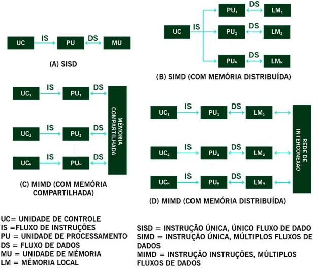

Organizações alternativas de computadores. 

### Multiprocessadores simétricos 

#### Multiprocessadores Simétricos 

##### Conteúdo interativo 

Acesse a versão digital para assistir ao vídeo. 

Há algumas décadas, os computadores pessoais e as máquinas com capacidade computacional similar eram construídas com um único processador de uso geral. A partir da evolução das tecnologias envolvidas na construção dos componentes de hardware e a redução do seu custo de produção, foi possível atender às demandas em função do aumento de desempenho dessas máquinas. 

Os fabricantes introduziram sistemas com uma organização SMP – sigla para o termo symmetric multiprocessing, traduzido do inglês para multiprocessamento simétrico –, relacionada à arquitetura do hardware e ao comportamento dos sistemas operacionais. 

Um sistema SMP pode ser definido como uma arquitetura independente com as seguintes características: 

Há dois ou mais processadores semelhantes (capacidades que podem ser comparadas). 

Os processadores compartilham a mesma memória principal e os dispositivos de E/S, além de serem interconectados por barramentos ou algum outro esquema de conexão que permita a equalização do tempo de resposta para cada processador. 

Todos os processadores desempenham as mesmas funções. O termo simétrico é derivado dessa afirmação. 

Todo o sistema é controlado pelo sistema operacional integrado que fornece a integração entre os processadores, seja para os seus programas, arquivos, dados ou suas tarefas. 

As máquinas construídas com um único processador executavam instruções em sequência. Com a inclusão dos multiprocessadores, as operações poderiam ser executadas independentemente, minimizando o tempo de execução. No entanto, a conexão dos processadores em máquinas multiprocessadoras pode gerar gargalos em relação à performance de máquinas multiprocessadas. Dessa forma, temos que analisar as formas de conexões físicas. O vídeo a seguir tratará de tais conceitos. 

#### Esquemas de interconexão de processadores 

Veja o vídeo a seguir, com a apresentação dos esquemas de interconexão de processadores. 

##### Conteúdo interativo 

Acesse a versão digital para assistir ao vídeo. 

## Coerência de cache 

A coerência de memória passou a ser uma consideração de projeto quando surgiram os caches, porque as arquiteturas de computador permitiam caminhos de acesso diferentes aos dados, ou seja, por meio da cópia do cache ou da cópia da memória principal. Em sistemas multiprocessadores, o tratamento da coerência é complexo porque cada processador mantém um cache privado. 

Entenda melhor: 

##### Coerência de cache UMA 

Implementar protocolos de coerência de cache para multiprocessadores UMA é simples porque os caches são relativamente pequenos e o barramento que conecta a memória compartilhada é relativamente rápido. 

Quando um processador atualiza um item de dado, o sistema também deve atualizar ou descartar todas as instâncias daquele dado nos caches de outros processadores e na memória principal, o que pode ser realizado por escuta do barramento (também denominado escuta do cache). Nesse protocolo, um processador “escuta” o barramento, determinando se a escrita requisitada de outro processador é destinada ao item de dado que está no cache. Se o dado residir no cache do processador, ele remove o item do seu cache. 

A escuta de barramento é simples de implementar, mas gera tráfego adicional no barramento compartilhado. 

##### NUMA com cache coerente (CC-NUMA) 

NUMA com cache coerente (Cache Coherent NUMA — CC-NUMA) são multiprocessadores NUMA que impõem coerência de cache. Em uma arquitetura CC-NUMA típica, cada endereço de memória física está associado a um nó nativo responsável por armazenar o item de dado com aquele endereço de memória principal. Muitas vezes o nó nativo é simplesmente determinado pelos bits de ordem mais alta do endereço. 

Quando ocorrer uma falha de cache em um nó, ele contata o nó associado ao endereço de memória requisitado: 

Se o item de dado estiver limpo (se nenhum outro nó tiver uma versão modificada do item em seu cache), o nó nativo o despachará para o cache do processador requisitante; Se o item de dado estiver sujo (se outro nó escreveu para o item de dado desde a última vez que a entrada da memória principal foi atualizada), o nó nativo despachará a requisição para o nó que tem a cópia suja; esse nó envia o item de dado para o requisitante e também para o nó nativo. Requisições para modificar dados são realizadas via nó nativo. O nó que desejar modificar dados em determinado endereço de memória requisita propriedade exclusiva dos dados. 

A versão mais recente dos dados, ou seja, se não estiver no cache do nó modificador, é obtida da mesma maneira que uma requisição de leitura. Após a modificação, o nó nativo notifica a outros nós com cópias dos dados que os dados foram modificados. 

Esse protocolo é relativamente simples de implementar porque todas as leituras e escritas contatam o nó nativo e, embora possa parecer ineficiente, requer o número máximo de comunicações de rede. Além disso, ele também facilita a distribuição de carga por todo o sistema, designando cada nó nativo com aproximadamente o mesmo número de endereços, o que aumenta a tolerância à falha e reduz a contenção. Contudo, esse protocolo pode ter mau desempenho se a maioria dos acessos aos dados vier de nós remotos. 

Dentre as arquiteturas de máquinas multiprocessadas, existem diferentes formas de classifica-las. No vídeo a seguir vamos abordar estes tipos de classificação. 

#### Arquiteturas de acesso à memória 

Assista o vídeo a seguir para conhecer os tipos de arquiteturas de acesso à memória. 

Conteúdo interativo 

Acesse a versão digital para assistir ao vídeo. 

A seguir, apresentamos a taxonomia de múltiplos processadores e classificação segundo o acesso à memória: 

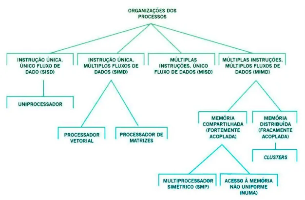

Taxonomia de múltiplos processadores e classificação segundo o acesso à memória. 

## Verificando o aprendizado 

##### Questão 1 

Em relação ao multiprocessamento simétrico (SMP), é correto afirmar: 

I. Os processadores compartilham a mesma memória principal, mas cada um deles usa os seus próprios recursos de E/S; 

II. O termo “simétrico” faz alusão ao fato de que todos os processadores executam as mesmas funções; III. Existem, no mínimo, dois processadores com capacidades semelhantes. 

Assinale a alternativa correta. 

A 

Somente a I está correta. 

B 

I e II estão corretas. 

C 

Somente a III está correta. 

D 

II e III estão corretas. 

E 

Somente a II está correta. 

##### A alternativa D está correta. 

Em um sistema SMP todos os processadores desempenham as mesmas funções, sendo essa a razão desse multiprocessamento ser chamado de simétrico. Além disso, o número de processadores semelhantes, ou seja, com capacidades que podem ser comparadas, é de dois ou mais processadores. 

Portanto, as afirmações II e III estão corretas. Por outro lado, a afirmação I está incorreta, pois tanto a memória principal quanto os dispositivos de E/S são compartilhados pelos processadores em um sistema de multiprocessamento simétrico (SMP). Assim, a alternativa correta é a D. 

##### Questão 2 

Quanto à comparação entre organizações de acesso uniforme à memória (UMA) e acesso não uniforme à memória (NUMA), pode-se afirmar: 

I. No UMA, a uniformidade do acesso à memória é garantida em função do acesso à memória por meio de um barramento comum compartilhado por todos os processadores. 

II. No NUMA, há barramentos independentes entre os módulos de memória e os processadores. Além disso, poderá haver um barramento compartilhado para permitir a comunicação entre os processadores. III. Tanto no UMA como no NUMA, não haverá limitações em função da taxa de processadores nessas estruturas. 

Assinale a alternativa correta: 

###### A 

I, II e III estão corretas. 

## B C

I, II e III estão incorretas. 

Somente I e II estão corretas. 

###### D 

Somente II está correta. 

E 

Somente II e III estão corretas. 

A alternativa C está correta. 

As alternativas I e II estão especificadas na própria definição dessas organizações. Entretanto, na afirmativa III haverá problemas de escala em ambas as soluções: incialmente na UMA, por se tratar de um barramento único compartilhado, o aumento de processadores introduzirá uma maior complexidade no controle de fluxo de comunicação entre os processadores e, consequentemente, o barramento tenderá a saturar mais facilmente do que no NUMA. 

3. Desempenho do hardware 

## Computadores multicore 

Um processador é considerado multicore quando combina duas ou mais unidades de processamento (chamados de core) em uma única pastilha de silício. De modo geral, cada um dos cores possui os componentes de um processador de forma independente, tais como registradores, ULA, hardware de pipeline e UC, além das caches L1 de dados e instruções e caches L2 e L3. 

Saiba mais 

Alguns processadores multicore também incluem memória e controladores de periféricos. 

## Desempenho do hardware 

Desempenho do Hardware 

Conteúdo interativo 

Acesse a versão digital para assistir ao vídeo. 

O projeto de evolução dos processadores se baseou, inicialmente, no aumento de paralelismo em nível das instruções, buscando realizar mais trabalho em cada ciclo do clock, o que resultou em soluções como o pipeline, estrutura superescalar e SMT (multithreading simultâneo). Em cada uma delas, os projetistas tentaram aumentar o desempenho do sistema incrementando a complexidade das soluções. 

Entretanto, muitas dessas soluções se depararam com algumas limitações (nos processos de fabricação, nos materiais utilizados) e exigência de melhores controles para que fosse possível garantir a sua eficiência. 

Com a construção de novos processadores, houve o acréscimo do número de transistores por chip e altas frequências de clock. Nesse contexto, o aumento do consumo de energia cresceu exponencialmente e, por conseguinte, a produção de calor, entre outras inúmeras situações. 

Observe a comparação: 

Superescalar 

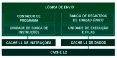

Multithreading simultâneo 

Multicore 

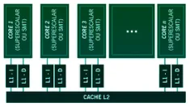

Seguindo essa linha de raciocínio, podemos referenciar a Regra de Pollack. Ela determina que o aumento de desempenho é diretamente proporcional à raiz quadrada do aumento da complexidade. Nesse caso, se a lógica utilizada em um core do processador for dobrada, apenas conseguirá um aumento de 40% no seu desempenho. Logo, com o uso de vários cores, cria-se potencial para aumentar o desempenho de forma quase linear, caso o software possa usar essa vantagem. 

Outro ponto importante deve-se à capacidade de integração das pastilhas, o que permite aumentar proporcionalmente o espaço destinado ao uso das caches, reduzindo, assim, o consumo de energia. 

## Desempenho do software 

#### Desempenho no Software 

##### Conteúdo interativo 

Acesse a versão digital para assistir ao vídeo. 

Diferentes análises podem ser realizadas para medir o desempenho em softwares, partindo das medições do tempo necessário para realizar as partes serial e paralelizável, considerando a sobrecarga de escalonamento. 

Estudos apontam que, mesmo com uma pequena parte do código sendo serial, executar esse código no sistema multicore poderia ser vantajoso quando comparado a soluções de um único core. Os softwares desenvolvidos para servidores também podem utilizar de forma eficiente uma estrutura multicore paralela, pois os servidores geralmente lidam com numerosas transações em paralelo e, em muitos casos, independentes. 

É possível identificar vantagens nos softwares de uso geral para servidores, de acordo com a habilidade de dimensionar o rendimento em função do número de cores. Stallings (2017) lista vários exemplos: 

##### Aplicações multithread nativas (paralelismo em nível de thread) 

São caracterizadas por possuírem um pequeno número de processos com alto nível de paralelização. 

##### Aplicações com múltiplos processos (paralelismo em nível de processo) 

São caracterizadas pela presença de muitos processos de thread única (threads podem ser consideradas como fluxos de um processo). 

##### Aplicações Java 

Aceitam threads de uma maneira natural, isto é, a Máquina Virtual Java (JVM) é um processo multithread que permite o escalonamento e o gerenciamento de memória para aplicações Java. 

Aplicações com múltiplas instâncias (paralelismo em nível de aplicação) 

Mesmo que uma aplicação individual não possa ser dimensionada para obter vantagem em um número grande de threads, ainda é possível que se beneficie com a execução de várias instâncias da aplicação em paralelo. 

## Organização multicore 

As principais variáveis em uma organização multicore são: 

Número de cores processadores no chip 

Número de níveis da memória cache 

Quantidade de memória cache Emprego do multithreading simultâneo compartilhada (SMT) 

### Níveis de cache e cache compartilhada 

Dada a importância dos caches em uma arquitetura multicore, ilustramos as organizações de cache a seguir: 

##### Cache L1 dedicada 

Há dois ou mais processadores semelhantes (capacidades que podem ser comparadas). 

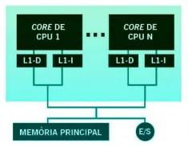

##### Cache L2 dedicada 

As caches L1 não são compartilhadas, mas, neste caso, há espaço suficiente no chip para permitir a cache L2. Exemplo: AMD Opteron e Athlon X2. 

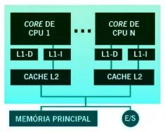

##### Cache L2 compartilhada 

É representada uma organização semelhante ao item anterior, mas agora o uso de cache L2 é compartilhada. Exemplo: Intel Core Duo – esse foi um marco definido pela Intel para a construção de processadores multicore com maior eficiência. O uso de caches L2 compartilhadas no chip possui inúmeras vantagens quando comparado à dependência exclusiva das caches dedicadas, como, por exemplo, a comunicação mais eficiente entre os processadores e a implementação de caches coerentes. 

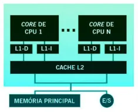

##### Cache L3 compartilhada 

Representa a possibilidade de expansão na quantidade de área disponível para caches no chip. Aqui, temos a divisão de uma cache L3 separada e compartilhada, com caches L1 e L2 dedicadas para cada core do processador. Exemplo: o Intel Core I7. 

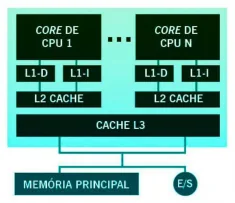

#### Arquitetura Multicore 

No vídeo a seguir o especialista fala sobre arquitetura multicore ou multi-núcleo. 

##### Conteúdo interativo 

Acesse a versão digital para assistir ao vídeo. 

### Multithreading simultâneo 

Outro ponto importante, que deve ser considerado no projeto de sistemas multicore, são os cores individuais e a possibilidade de implementação de multithreading simultâneo (SMT), também conhecido comercialmente como hyper-threading. 

Veja a comparação entre as duas arquiteturas: 

Intel Core Duo Intel Core I7 Utiliza cores superescalares puros. Utiliza cores SMT. 

##### Saiba mais 

Cores SMT O SMT permite ampliar o uso de threads em nível de hardware que o sistema multicore suporta. Um sistema multicore com quatro cores e SMT, que suporta quatro threads simultâneos em cada core, assemelha-se a um sistema multicore de 16 cores. Exemplo: Blue Gene/Q da IBM possui SMT de 4 vias. 

Veja, a seguir, a comparação da execução de várias threads com a implementação de um processador de diferentes arquiteturas: 

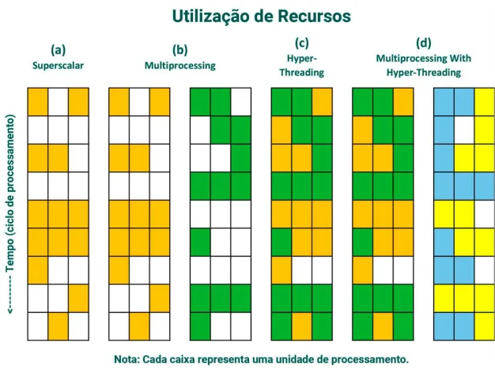

Exemplo de execução de threads com: (a) um processador escalar; (b) dois processadores; (c) um processador habilitado com hyper-threading; (d) dois processadores habilitados com hyper-threading. 

Observe a descrição: 

##### (a) Superescalar 

No primeiro exemplo, com um único processador superescalar – o processador está em uso, mas cerca de metade do tempo do processador permanece sem uso. 

##### (b) Multiprocessing 

No multiprocessamento, é possível verificar um sistema de CPU dupla trabalhando em dois threads separados. No entanto, novamente cerca de 50% do tempo de ambas as CPUs permanecem sem uso. 

##### (c) Hyper-threading 

No terceiro caso, um único processador está habilitado para hyper-threading, os dois threads estão sendo computados simultaneamente e a eficiência da CPU aumentou de cerca de 50% para mais de 90%. 

##### (d) Multiprocessing with hyper-threading 

No último exemplo, há dois processadores habilitados para hyper-threading que podem funcionar em quatro threads independentes ao mesmo tempo. Novamente, a eficiência da CPU é de cerca de 90%. Nesse caso, teríamos quatro processadores lógicos e dois processadores físicos. 

Para concluir, devemos avaliar os benefícios quando os softwares forem desenvolvidos com a capacidade de usufruir de recursos paralelos, valorizando a abordagem SMT. 

## Verificando o aprendizado 

##### Questão 1 

Dentre as alternativas abaixo, qual delas não é considerada uma das principais variáveis na organização multicore? 

A 

Número de cores processadores no chip. 

B 

Número de níveis da memória cache. 

C 

Cache L1 compartilhada. 

D 

Quantidade de memória cache compartilhada. 

E 

O emprego do multithreading simultâneo. 

A alternativa C está correta. 

A quantidade de cache compartilhada é importante, mas não exclusivamente a cache L1. 

##### Questão 2 

Considere os termos abaixo e relacione-os aos respectivos significados: 

I. Simultaneous Multiprocessing (SMP) II. Multithreading III. Multithreading simultâneo SMT 

IV. Multicore 

A. Processador possui a capacidade de executar mais de uma thread no mesmo instante. 

B. Técnica que permite explorar TLP (paralelismo a nível de threads) e ILP (paralelismo a nível de instrução). C. Múltiplos núcleos de execução em um processador. 

D. Arquitetura que permite a mais de um processador compartilhar recursos de memória, discos e rodar no mesmo SO. 

Assinale a alternativa correta: 

A 

I (A) - II (B) - III (C) - IV (D) 

B 

I (B) - II (C) - III (D) - IV (A) 

C 

I (C) - II (D) - III (A) - IV (B) 

D 

I (D) - II (B) - III (A) - IV (C) 

E 

I (A) - II (C) - III (D) - IV (B) 

A alternativa D está correta. 

A configuração correta é: 

I- Simultaneous Multiprocessing (SMP) -> D – arquitetura que permite a mais de um processador compartilhar recursos de memória, discos e rodar no mesmo SO. II- Multithreading -> A – processador possui a capacidade de executar mais de uma thread no mesmo instante. 

III- Multithreading simultâneo SMT -> B – técnica que permite explorar TLP (paralelismo a nível de threads) e ILP (paralelismo a nível de instrução). 

IV- Multicore -> C – Múltiplos núcleos de execução em um processador. 

4. Conclusão 

## Considerações finais 

Muitas das limitações associadas ao desenvolvimento de dispositivos e equipamentos com maior desempenho estavam relacionadas ao problema de controle da temperatura gerada pelos seus componentes, isto é, com transistores menores, buscava-se construir processadores mais rápidos e, como consequência, esses dispositivos consumiam mais energia, produzindo um aumento de calor (energia térmica). 

Soluções que buscavam aumentar o desempenho, simplesmente com o objetivo de serem mais rápidos, produziam processadores instáveis e não confiáveis. Além disso, outros fatores inibiam o desenvolvimento, seja em função de restrições físicas, como a estabilidade dos materiais utilizados, ou da redução de suas dimensões (litografia). 

As arquiteturas paralelas vieram ao encontro desses objetivos, por trazerem a possibilidade de integrar elementos do hardware, permitindo que o aumento do desempenho estivesse vinculado não somente à velocidade de processamento desses dispositivos, mas à capacidade de tratar as suas execuções de forma paralelizada. 

As diferentes soluções idealizadas em processamento paralelo, como as estruturas superescalares, superpipeline e multiprocessadores simétricos, permitiram a construção de computadores e dispositivos que convergissem na direção de soluções de alto desempenho. 

Os processadores multicore, por sua vez, são economicamente viáveis para a produção em larga escala de dispositivos, que buscam uma alta capacidade de processamento, por serem confiáveis e estáveis, além de permitir a sua integração com os demais componentes de cada equipamento. 

##### Podcast 

Ouça o podcast para reforçar os principais pontos abordados no estudo deste conteúdo! 

##### Conteúdo interativo 

Acesse a versão digital para ouvir o áudio. 

#### Explore + 

#### Referências 

MONTEIRO, M. Introdução à Organização de Computadores. 5. ed. Rio de Janeiro: LTC, 2007. 

STALLINGS, W. Arquitetura e organização de computadores. 10. ed. São Paulo: Pearson Education do Brasil, 2017. 

TANENBAUM, A. S.; STEEN, M. Sistemas Distribuídos: Princípios e Paradigmas. 2. ed. São Paulo: Pearson Prentice Hall, 2007. 
