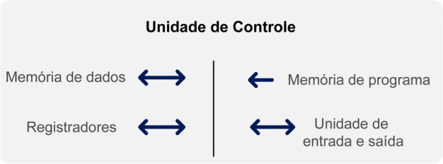
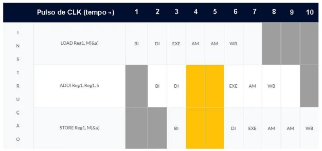
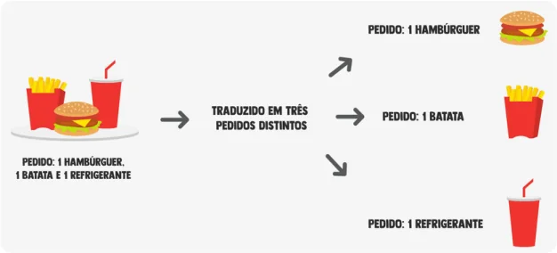

# Arquitetura CISC X RISC 

Conceitos de arquiteturas CISC e RISC: características, vantagens e desvantagens. Prof. Leandro Ferreira 

1. Itens iniciais 

### Propósito 

Compreender as vantagens e desvantagens das arquiteturas RISC e CISC e suas influências no desenvolvimento dos processadores, assim como identificar os motivos para a escolha de cada uma das arquiteturas, lembrando que, atualmente, os processadores costumam utilizar uma combinação de ambas (em arquiteturas híbridas). 

### Preparação 

Antes de iniciar o estudo, você deve conhecer os conceitos de Estrutura Básica do Computador, Instruções e Etapas de Processamento. 

### Objetivos 

- Identificar características e propriedades da arquitetura CISC. 

- 

- Identificar características e propriedades da arquitetura RISC. 

- 

### Introdução 

Os termos RISC e CISC podem ser compreendidas como tipos de conjuntos de instruções de máquinas que fazem parte da arquitetura de computadores desenvolvidas pela indústria de computação. 

Conhecer o tipo de arquitetura RISC e CISC é importante, pois é esse conjunto de instruções que dará a ordem para que o computador execute determinada operação. Assim, o projeto de um processador é centrado no conjunto de instruções de máquina elabodado para que ele execute, ou seja, do conjunto de operações primitivas que ele pode executar. 

Cada arquitetura tem sua forma de ser implementada, suas vantagens e desvantagens que acabam norteando a escolha de uma ou de outra, ou de ambas, a chamada arquitetura híbrida. 

Aqui você compreenderá bem o que são as arquiteturas CISC, RISC e híbrida, bem como suas características e principais diferenças. 

Bons estudos! 

#### Conteúdo interativo 

Acesse a versão digital para assistir ao vídeo. 

1. Características da arquitetura CISC 

## Revisões sobre o funcionamento do computador 

Veja alguns conceitos importantes para o funcionamento do computador. 

#### Conteúdo interativo 

Acesse a versão digital para assistir ao vídeo. 

## Arquitetura CISC 

Abordagem CISC na arquitetura de processadores 

#### Conteúdo interativo 

Acesse a versão digital para assistir ao vídeo. 

### O conceito da arquitetura 

A abordagem CISC (Complex Instruction Set Computer - Computador com Conjunto Complexo de Instruções) está relacionada às possibilidades na hora de se projetar a arquitetura de um processador, com instruções específicas para o maior número de funcionalidades possível. Além disso, essas instruções realizam operações com diferentes níveis de complexidade, buscando, muitas vezes, operandos na memória principal e retornando a ela os resultados. 

Isso faz com que a quantidade de instruções seja extensa e que a Unidade de Controle do processador seja bastante complexa para decodificar a instrução a ser executada. Entretanto, a complexidade é compensada por poucos acessos à memória e soluções adequadas para problemas específicos. 

Veja um esquema que ilustra a arquitetura CISC: 

Esquema ilustrativo da arquitetura CISC. 

### Origem 

A abordagem CISC surgiu de uma evolução dos processadores. Essa sigla só começou a ser usada após a criação do conceito de RISC no início da década de 1980 (a ser visto no próximo módulo), quando os processadores anteriores passaram a ser chamados de CISC de forma retroativa. 

Conforme a tecnologia de fabricação e a capacidade computacional evoluíam, problemas mais complexos puderam ser resolvidos pelos processadores. Para esses problemas, foram sendo criadas novas instruções específicas. 

#### Exemplo 

É possível adicionar uma instrução específica para multiplicar números reais em vez de realizar repetidas somas (instrução mais simples). 

### Características 

Veja na tabela exemplos de processadores CISC, sua evolução no que diz respeito à quantidade e ao tamanho das instruções. 

|Processador|Ano|Tamanho da instrução|Quantidade de instruções|Tamanho do registrador|Endereçamento|
|---|---|---|---|---|---|
|IBM 370|1970|2 a 6 bytes|208|32 bits|R-R; R-M; M-M|
|VAX11|1978|2 a 57 bytes|303|32 bits|R-R; R-M; M-M|
|Intel 8008|1972|1 a 3 bytes|49|8 bits|R-R; R-M; M-M|
|Intel 286|1982|2 a 5 bytes|175|16 bits|R-R; R-M; M-M|
|Intel 386|1985|2 a 16 bytes|312|32 bits|R-R; R-M; M-M|

Tabela: Exemplos de processadores CISC. Leandro Ferreira. 

### Múltiplo endereçamento 

Observando a última coluna da tabela anterior, é possível perceber o conceito principal e uma das definições mais usuais de arquitetura com abordagem CISC: diversos tipos de endereçamento. 

Dessa forma, temos: 

#### R-R 

Para instruções que usam registradores como entrada e saída. 

#### R-M 

Quando um dos elementos (operandos ou resultado) deve ser buscado/escrito na memória e ao menos um em registrador. 

#### M-M 

Para instruções em que os operandos e o resultado estão na memória. 

O princípio fundamental da abordagem CISC é a realização de operações complexas, que envolvem buscar operandos na memória principal, operar sobre eles (na ULA) e guardar o resultado já na memória. 

Nesses casos, o código de máquina é mais simples de se gerar pelo compilador, pois, geralmente, há relação direta entre uma linha de código em alto nível e uma instrução da arquitetura, veja: 

#### Código de máquina 

A linguagem de máquina é o conjunto de instruções (em binário) que determinado processador consegue executar. Para ser executado, um programa escrito em alto nível (em C, Python, ou Java, por exemplo) deve ser convertido em linguagem de máquina, formando o código de máquina: versão do programa compreensível pelo processador. 

plain-text 

1  int a = 3 2  a = a + 5 

Na linha 1, temos a declaração da variável a. Vamos assumir que ela está alocada na memória principal em M[&a] (em que &a representa o endereço de a). 

Na linha 2, desejamos realizar a soma entre os valores de a e 5 e guardar o resultado, sobrescrevendo o valor da variável a para 8. 

No caso de uma abordagem CISC, há uma instrução que realiza exatamente esse processo. Como exemplo, na arquitetura do 386, temos a instrução ADDI, que realiza a adição de um valor imediato. Veja a instrução em Assembly: 

assembly 

## 1  ADDI M[&a], 5

Segundo o manual do Processador 386, essa instrução leva 2 pulsos de clock (2 CLK) quando operada sobre um registrador e 7 CLK quando operada sobre um endereço de memória. Essa diferença se dá pela necessidade de buscar o operando e escrever o resultado na memória. 

#### Clock 

Para operar de forma organizada, o processador utiliza um relógio (Clock) que gera pulsos em intervalos regulares. A cada vez que um pulso de clock é recebido, uma “etapa” é executada, e todo o circuito avança um passo. Dessa forma, uma instrução que leve 2 pulsos (ciclos) de clock será executada após dois pulsos serem emitidos para o circuito. 

## Analogia da hamburgueria 

### Arquitetura CISC – Na analogia da hamburgueria 

Conteúdo interativo 

Acesse a versão digital para assistir ao vídeo. 

Para facilitar o entendimento da abordagem CISC, usaremos uma analogia com uma hamburgueria. 

Na primeira loja (CISC), temos uma grande quantidade de lanches possíveis, cada um é identificado por um número. 

Originalmente, essa loja só vendia hambúrguer (1) ou cheeseburger (2) e, por simplicidade, cada pedido era processado por completo antes de o próximo ser iniciado. 

Analogia da hamburgueria 

<!-- Start of picture text -->
Hambúrguer (1) Cheeseburger (2) <!-- End of picture text -->

O mesmo funcionário desempenhava diferentes funções: 

<!-- Start of picture text -->
Anotar o pedido Montar os sanduíches Busca de Instrução. 1 ou 2 (Execução). Entregar o pedido no balcão WriteBack ou Escrita de Registrador. <!-- End of picture text -->

Com a evolução da loja, o pedido ganhou acompanhamentos (batata, refrigerante, milk-shake, tortinhas etc.) e passou a ter duas opções de entrega: 

No balcão Em casa Registrador. Escrita em memória. 

Por conta desse incremento, mais de cem tipos de lanches podiam ser pedidos. 

Agora, um passo adicional era necessário após o recebimento do pedido (BI – Buscar Instrução): descobrir a receita do sanduíche escolhido, pois ninguém conseguia decorar tantas combinações e separar os ingredientes do pedido (Decodificação de Instrução e Busca de Operandos). 

Com isso, dois novos problemas surgiram: 

##### Espaço 

As receitas e os novos ingredientes ocupavam muito espaço na loja, diminuindo a extensão do balcão (registradores). 

##### Tempo 

Por vezes, a falta de algum ingrediente fazia com que o funcionário fosse buscá-lo no mercado (acesso à memória para buscar um operando), aumentando a espera pelo pedido. 

Da mesma forma, a abordagem CISC necessita de um circuito complexo de Unidade de Controle para decodificar as instruções (microprograma) que ocupa parte do processador, limitando o número de registradores. 

Além disso, dependendo da quantidade de acessos à memória, o tempo de execução das instruções varia muito (receber o pedido, buscar ingrediente no mercado, entregar o pedido em casa). 

A primeira solução para agilizar a produção na hamburgueria foi contratar cinco funcionários especializados, um para cada atividade. Veja: 

Processar pedidos no caixa BI - Buscar Instrução. Separar ingredientes e receita DI - Decodificar Instrução. Montar os lanches EXE - Execução. Entregar no balcão WB - WriteBack. Entregar em domicílio AM - Acesso à Memória. 

Com cada funcionário realizando uma atividade específica, bastava passar a tarefa processada adiante para que a próxima pudesse ser realizada, como em uma linha de montagem. Muito satisfeito com o resultado, o dono da loja resolveu contratar mais funcionários especializados para a linha de montagem, que chegava a ter 31 etapas nos pedidos mais complexos. 

#### Comentário 

Essa implementação é feita nos processadores (pipeline) de forma similar. Uma das características dos computadores CISC é a complexidade de seus pipelines. Alguns chegaram a ter 31 estágios de pipeline. 

O pipeline do processador 

#### Conteúdo interativo 

Acesse a versão digital para assistir ao vídeo. 

Veja exemplos de estágios de pipeline nas microarquiteturas da Intel: 

#### Intel 

A Intel Corporation, empresa de tecnologia americana, é uma das maiores produtoras mundiais de chips, principalmente processadores. É reconhecida pela criação da série de chips x86 e também da série Pentium. 

|Microarquitetura|Estágios de Pipeline|
|---|---|
|P5 (Pentium)|5|
|P6 (Pentium 3)|14|
|P6 (Pentium Pro)|14|
|NetBurst (Willamette)|20|
|NetBurst (Northwood)|20|
|NetBurst (Prescott)|31|
|NetBurst (Cedar Mill)|31|
|Core|14|
|Broadwell|14 a 19|
|Sandy Bridge|14|
|Silvermont|14 a 17|
|Haswell|14 a 19|
|Skylake|14 a 19|
|Kabylake|14 a 19|

Tabela: Exemplos de estágios de pipeline. Leandro Ferreira. 

Diante do exemplo, podemos dizer que todos os problemas da hamburgueria acabaram? 

##### Resposta 

A solução da linha de montagem ajudou a hamburgueria, mas ainda existiam gargalos que a paralisavam, principalmente quando havia necessidade de entregar pedidos ou buscar ingredientes (acessos à memória). 

## Verificando o aprendizado 

##### Questão 1 

A abordagem CISC para arquitetura do processador possui diversas características e peculiaridades, como a combinação de operações e formas de armazenamento, com o objetivo de aperfeiçoar a execução das instruções. 

Assinale a alternativa em que as operações, quando presentes como etapas da mesma instrução, permitem caracterizar a presença de uma abordagem CISC. 

A 

Operação Aritmética na ULA e armazenamento na memória. 

B 

Busca de Registrador e Operação Aritmética na ULA. 

C 

Busca de Registrador e Escrita de Registrador. 

D 

Busca de Registrador e armazenamento na memória. 

##### E 

Busca e escrita em cache L1. 

#### A alternativa A está correta. 

A abordagem CISC tem como principal característica a execução de operações complexas, como a combinação de operações aritméticas e o acesso direto à memória (para busca ou escrita de dados). A única opção que garante que tal operação complexa está acontecendo é a letra A , pois as demais podem ocorrer em operações simples. 

##### Questão 2 

Os processadores CISC possuem várias características que, quando agregadas, permitem classificá-los dessa forma. 

Assinale a opção que não representa uma característica de processadores CISC. 

A 

Múltiplos tipos de endereçamento. 

B 

Conjunto de muitas instruções. 

C 

Unidade de controle simples. 

D 

Pipeline com poucos estágios. 

E 

Unidade de controle hardwired, isto é, não há microprograma. 

A alternativa C está correta. 

Por conter muitas instruções possíveis e diferentes, a Unidade de Controle CISC é complexa. Ela precisa decodificar qual instrução será executada e gerar todos os seus sinais de controle. 

2. Características da arquitetura RISC 

## Arquitetura RISC 

### Abordagem RISC na arquitetura de processadores 

Conteúdo interativo 

Acesse a versão digital para assistir ao vídeo. 

### O conceito da arquitetura 

A abordagem RISC (Reduced Instruction Set Computer - Computador com Conjunto Restrito de Instruções) se refere às escolhas na hora de projetar a arquitetura de um processador. Essa abordagem possui poucas instruções genéricas, com as quais se montam as operações mais complexas. Além disso, as instruções realizam operações apenas sobre os registradores, exceto nos casos de instruções específicas, que servem apenas para buscar ou guardar dados na memória. 

Com uma pequena quantidade de instruções, a Unidade de Controle do processador é bastante simples para decodificar a instrução para ser executada. Dessa forma, sobra espaço para mais registradores. 

Veja um esquema que ilustra a arquitetura RISC: 

Esquema ilustrativo da arquitetura RISC. 

### Origem 

A abordagem RISC surgiu no início da década de 1980. A partir da sua criação, os processadores anteriores passaram a ser retroativamente chamados de CISC. O surgimento da abordagem RISC se deu na tentativa de resolver as deficiências que começavam a aparecer nos processadores tradicionais (que passariam a ser chamados de CISC). 

As diversas operações complexas eram pouco utilizadas pelos programas, pois dependiam de otimização do código em alto nível. As múltiplas formas de endereçamento faziam com que cada instrução demorasse um número variável de clocks para que fosse possível executar. Por fim, a Unidade de Controle grande deixava pouco espaço para registradores, demandando diversas operações de acesso à memória. 

Para resolver esses problemas, foi proposta a abordagem RISC. 

### Premissas e características 

A nova abordagem proposta possuía algumas premissas que geraram certas características na arquitetura resultante: 

Quantidade de instruções 

Premissa: quantidade restrita de instruções, com as quais era possível montar as outras. 

A quantidade reduzida de instruções diminui o tamanho e a complexidade da Unidade de Controle para decodificação da instrução. Com isso, sobra mais espaço para registradores no processador. Enquanto os processadores CISC costumam ter até 8 registradores, é comum que os processadores RISC tenham mais de 32, chegando até a algumas centenas. 

##### Tempo de execução 

Premissa: as instruções devem ser executadas com duração próxima, facilitando o pipeline. 

A premissa de execução com duração próxima serve para facilitar a previsibilidade do processamento de cada instrução. A ideia é que cada etapa da instrução consiga ser executada em um ciclo de máquina (CLK). Como todas as instruções operam usando apenas os rápidos registradores, isso é possível. As exceções são as instruções LOAD e STORE. 

##### Operação das instruções 

Premissa: as instruções devem operar sobre registradores, exceto em algumas específicas para busca e gravação de dados na memória (LOAD e STORE). As instruções LOAD e STORE servem para acessar a memória. 

Com a operação sobre os registradores, o pipeline executa de forma próxima ao ideal (1 etapa por ciclo), exceto pelos acessos à memória das instruções LOAD e STORE, que demandam um tempo maior de espera. 

### Pipeline 

Considere as etapas vistas no módulo anterior: 

1. Buscar Instrução (BI) 

2. Decodificar Instrução (DI) 

3. Execução (EXE) 

4. Acesso à Memória (AM). 

5. WriteBack (WB). 

Veja agora um exemplo de pipeline com modelo RISC com 3 instruções executadas durante 10 pulsos de clock: 

Tabela: Exemplo de pipeline com modelo RISC. 

Com essa tabela, percebemos que três instruções são executadas: 

1. Começa no primeiro pulso de clock. 

2. Começa no segundo pulso de clock. 

3. Começa no terceiro pulso de clock. 

##### Todo o processo leva 10 pulsos de clock. 

Repare que os quadrados vazios (marcados em amarelo na tabela anterior) indicam a parada do pipeline para aguardar os dois ciclos necessários para a busca do valor guardado na memória. Além disso, determinada etapa só pode aparecer uma vez em cada coluna. Portanto, apenas uma instrução pode iniciar por pulso, pois todas devem executar BI inicialmente. 

### Convertendo o código 

No módulo anterior, vimos as seguintes linhas de pseudocódigo de alto nível: 

plain-text 

1  int a = 3 2  a = a + 5 

Como podemos realizar essa operação no modelo RISC, onde não há operações que façam adição de elementos diretamente da memória (terceira premissa de um processador RISC)? 

Para isso, precisaremos desmembrar a operação complexa em várias simples: 

1. Buscar o valor da variavel a na memória (LOAD). 

2. Realizar a adição imediata de 5. 

   - Salvar o valor resultante em um registrador (ADDI). 

3. 

4. Guardar o novo valor na variável a em memória (STORE). 

Lembre-se de que na abordagem CISC esse código usava apenas uma instrução – “ADDI M[&a], 5”. 

Essa sequência de operações é exatamente a mesma do exemplo do pipeline dado anteriormente: 

- LOAD Reg1, M[&a] 

- 

- ADDI Reg1, Reg1, 5 

- 

- STORE Reg1, M[&a] 

- 

Podemos ver, na tabela de exemplo do pipeline, que esta simples operação está levando dez ciclos de máquina (CLK). Então, não parece tão vantajosa quando comparada a um CISC (que realizava em 7). 

A diferença é que essas operações de LOAD e STORE, que são custosas e atrasam o pipeline, não são usadas tantas vezes assim. Com vários registradores, as variáveis são carregadas nos registradores quando aparecem pela primeira vez e ficam sendo operadas ali até que seja necessário usar esse registrador para outra função. 

Para obtermos uma Unidade de Controle menor, sem microprograma, reduzimos o conjunto de instruções. 

Agora, tente responder a próxima pergunta para refletir e consolidar seus conhecimentos. 

### Atividade discursiva 

De quem é a responsabilidade de converter a linguagem de alto nível para esse conjunto reduzido de instruções? 

#### Chave de resposta 

O ônus desse trabalho recai sobre o compilador, que precisará otimizar a necessidade de acessar a memória para o mínimo possível. 

### Exemplo 

Veja algumas arquiteturas que usam a abordagem RISC: 

|Processador|Ano|Endereçamento|Registradores|Tamanho de Instrução|
|---|---|---|---|---|
|MIPS|1981|R-R|04 a 32|4 bytes|
|ARM/A32|1983|R-R|15|4 bytes|
|SPARC|1985|R-R|32|4 bytes|
|PowerPC|1990|R-R|32|4 bytes|
|||R-R||4 bytes|

Tabela: Arquiteturas que usam abordagem RISC. Leandro Ferreira. 

Podemos perceber duas características comuns à abordagem RISC: 

Tamanho fixo de instrução Operações com endereçamento Para simplificar a decodificação. Registrador-Registrador. 

## Retorno à analogia da hamburgueria 

Conteúdo interativo 

Acesse a versão digital para assistir ao vídeo. 

Analisaremos agora a rede de hambúrgueres RISC. 

O dono da empresa resolveu contratar apenas cinco funcionários para sua linha de montagem: 

Processador de pedidos no caixa BI - Buscar Instrução. 

Preparador DI - Decodificar Instrução. 

Montador EXE - Execução. Entregador AM - Acesso à Memória. Balconista WB - WriteBack. 

Os funcionários dessa loja devem saber montar pequenas partes de pedidos: montar um hambúrguer, uma batata, um refrigerante etc. 

Os pedidos completos são feitos em uma série de pedidos menores. Por exemplo: 

Além disso, existe um pedido especial que tem a responsabilidade de buscar ingredientes no mercado (LOAD) e um funcionário apenas para fazer entregas em domicílio (STORE). Nesse caso, o conjunto de pedidos menores ficaria assim: 

Podemos perceber que, se houvesse uma série de pedidos de 1 hambúrguer apenas, teríamos uma sequência LOAD/hambúrguer/STORE. Isso seria muito ruim, pois as operações normais levam um tempo menor e fixo (um pulso de CLK), que podemos definir como 1 minuto na analogia. Já a busca de ingredientes e entrega em domicílio pode demorar vários pulsos de CLK (por exemplo, 5 minutos). 

Assim, o pedido de 1 hambúrguer para entrega demoraria 11 minutos, que é o tempo próximo de um pedido similar na hamburgueria CISC (10 minutos). Todavia, se for possível otimizar o conjunto de pedidos para buscar ingredientes uma única vez e fazer a entrega apenas no final, montando 10 hambúrgueres de uma vez, teremos a entrega de 10 pedidos em 20 minutos – muito melhor que os 100 minutos da CISC. 

#### Comentário 

Podemos perceber o fator determinante no sucesso ou no fracasso da abordagem RISC. Como vimos, o ônus de otimizar as instruções a partir do código de alto nível é do compilador, e, se for bem executado, as operações de acesso à memória serão reduzidas e as operações em registradores, priorizadas, fazendo o pipeline do processador operar bem perto do ideal (1 instrução por ciclo). 

## Comparação CISC x RISC 

Agora que já sabemos como essas duas abordagens funcionam, vamos assistir ao vídeo e compará-las! Veja as diferenças e semelhanças, além das vantagens e desvantagens entre as abordagens. 

#### Conteúdo interativo 

Acesse a versão digital para assistir ao vídeo. 

## Tendências 

Tendências de junção das arquiteturas CISC e RISC nos processadores atuais 

#### Conteúdo interativo 

Acesse a versão digital para assistir ao vídeo. 

Como vimos, a abordagem CISC surgiu de forma natural, com a evolução dos processadores; na verdade, ela só foi assim denominada após o surgimento da abordagem “rival”: RISC. Hoje em dia, como os processadores tentam misturar as melhores características de ambas as abordagens, é difícil encontrar processadores CISC “puros”. O mais usual é encontrar processadores híbridos, que disponibilizam diversas instruções complexas, 

com abordagem CISC, mas com um subconjunto reduzido de instruções otimizadas, como na abordagem RISC, capazes de serem executadas em pouquíssimos ciclos de clock. 

## Verificando o aprendizado 

##### Questão 1 

A abordagem RISC para a arquitetura do processador tem diversas características e peculiaridades. Assinale a alternativa que contém duas dessas características. 

A 

Grande conjunto de instruções e pipeline com poucos estágios. 

B 

Endereçamento múltiplo e pipeline com poucos estágios. 

C 

Endereçamento tipo R-R e pequeno conjunto de instruções. 

D 

Endereçamento tipo R-M e grande quantidade de registradores. 

##### E 

Endereçamento tipo M-M e grande quantidade de registradores. 

#### A alternativa C está correta. 

A abordagem RISC tem como principais "características": pequeno conjunto de instruções, endereçamento do tipo R-R (exceto por LOAD e STORE), pipeline de poucos estágios e grande quantidade de registradores. 

##### Questão 2 

Um processador RISC busca implementar um pipeline pequeno e bastante eficiente. Com relação a essa afirmação, podemos definir como pipeline ideal aquele que teoricamente consiga "executar": 

A 

- 1 instrução a cada 5 pulsos de clock. 

B 

- 1 instrução por ciclo de clock. 

C 

2 instruções por ciclo de clock. D 5 instruções por ciclo de clock. E 10 instruções por ciclo de clock. A alternativa B está correta. O pipeline ideal tenta realizar 1 instrução por ciclo, com cada etapa sendo executada de forma independente em 1 ciclo. Embora cada instrução leve n ciclos para ser executada (sendo n o número de estágios do pipeline), o pipeline como um todo finaliza 1 instrução por ciclo. 

3. Conclusão 

## Considerações finais 

Vimos como a evolução da arquitetura dos processadores aumentou a sua complexidade. Com a inclusão de instruções mais complexas e endereçamento múltiplo, essa abordagem viria a ser chamada de CISC (Complex Instruction Set Computer – Computador com Conjunto Complexo de Instruções). 

Mas esse nome só apareceria após o surgimento de um novo paradigma no projeto de processadores: a abordagem RISC (Reduced Instruction Set Computer – Computador com Conjunto Restrito de Instruções). 

A abordagem RISC inovou a forma como os processadores eram projetados, permitindo o surgimento de várias tecnologias que possuímos hoje, como smartphones e Internet das Coisas (IoT - Internet of Things), isto é, diversos aparelhos, como geladeiras, câmeras e outros, conectados à Internet com processadores simples. 

A presença das duas abordagens foi importante para tipos distintos de sistemas. Atualmente, a maioria dos processadores utiliza uma abordagem híbrida, tentando capitalizar no melhor dos dois mundos. 

#### Podcast 

Para encerrar, ouça uma discussão sobre as arquiteturas CISC e RISC, incluindo uma comparação entre as suas principais características e propriedades. 

#### Conteúdo interativo 

Acesse a versão digital para ouvir o áudio. 

### Explore + 

Confira o que separamos especialmente para você! 

Pesquise: 

- Os trabalhos sobre arquiteturas RISC feitos por David Patterson e John Hennessy, autores premiados na área. 

- O manual 8 Bit Parallel Central Processor Unit, que contém as instruções para o processador Intel 8008. 

- O manual de referência do programador para o processador Intel 286. 

- 

- O manual de referência do programador para o processador Intel 386. 

- 

### Referências 

PATTERSON, D. A.; HENESSY, J. L. Organização e projeto de computadores: a interface hardware/software. 4. ed. Rio de Janeiro: Editora Elsevier, 2014. 

ZELENOVSKY, R.; MENDONÇA, A. PC: um guia prático de hardware e interfaceamento. 3. ed. Rio de Janeiro: MZ Editora, 2003. 
