Fundamentos de software e gerenciamento de projetos 

O processo de desenvolvimento de software e sua aplicação no Gerenciamento de Projeto. Prof. Alberto Tavares da Silva 

1. Itens iniciais 

## Propósito 

Compreender a importância do processo de desenvolvimento de software e do Gerenciamento de Projetos no contexto da Engenharia de Software. 

## Objetivos 

- Reconhecer os conceitos básicos relacionados com o desenvolvimento de software 

- 

- Descrever as etapas essenciais de um processo de desenvolvimento de software 

- 

- Relacionar as etapas de um processo de desenvolvimento de software com as etapas de Gerenciamento de Projeto 

- Descrever a importância do Gerenciamento de Risco no projeto de software 

- 

## Introdução 

Nos dias atuais, a importância do software é facilmente perceptível em função dos inúmeros serviços digitais disponíveis na nossa Sociedade da Informação. Em outros cenários, o software também está presente em sistemas de controle de veículos, aviões, refinarias entre outros. 

Podemos afirmar que o “produto” software tem que ser projetado aplicando-se as melhores práticas da engenharia, pois quais seriam as consequências de um defeito de software em uma aeronave com 500 pessoas ou na falha de um sistema de controle de tráfego aéreo? Realmente, o software necessita das melhores práticas da engenharia no seu projeto. 

Neste contexto, destaca-se a disciplina Engenharia de Software, que trata dos aspectos técnicos que permitem a geração do “produto” software. De uma forma geral, a engenharia, qualquer que seja, necessita de processos. Em função dessa premissa, podemos afirmar que não existe engenharia sem processo. 

O processo de desenvolvimento de software inclui algumas etapas básicas, cujo momento de aplicação depende do modelo adotado pelo engenheiro de software. 

Uma área de conhecimento importante, aplicada em qualquer engenharia, é o Gerenciamento de Projeto. Ele permite elaborar um plano de projeto onde são otimizados os recursos, que incluem pessoas, materiais e equipamentos. A metodologia de gerenciamento de projeto permite, a partir de requisitos identificados nas primeiras etapas do processo de qualquer engenharia, a geração do produto objeto do projeto de acordo com o planejado e de forma controlada. 

A Engenharia de Software está alinhada com a área de conhecimento Gerenciamento de Projetos, sendo esta fundamental ao engenheiro de software. Cabe um destaque especial nesse contexto ao Gerenciamento de Riscos, principalmente, na seleção de portfólio de projetos de software. 

1. Conceitos básicos relacionados com o desenvolvimento de software 

# Software 

Seria possível a sua vida hoje sem o smartphone? 

Acredito que a maioria em uma pesquisa iria responder um enfático “não”! 

O que você acha que torna o telefone móvel tão atrativo? O software? 

É provável, pois, não descartando a importância do hardware, o software permite uma relação de usabilidade interativa e intuitiva, gerando um uso intensivo. Essa competência é resultado de trabalho multidisciplinar árduo de engenheiros de softwares, administradores de banco de dados, web designers, entre outros profissionais. 

Neste contexto, vamos iniciar nosso estudo sobre a extraordinária área de conhecimento Engenharia de Software, que tem como principal produto o software. 

Atenção 

Destacamos que a bibliografia Pressman (2016) é uma referência mundial nessa área. 

O conceito de software a seguir define esse importante produto. 

Software consiste em:(1) instruções (programa de computador) que, quando executadas, fornecem características, funções e desempenho desejados; (2) estruturas de dados que possibilitam aos programas manipular informações adequadamente; e (3) informação descritiva, tanto na forma impressa quanto na virtual, descrevendo a operação e o uso dos programas. 

(PRESSMAN, 2016). 

Implicitamente, o software relaciona-se com o hardware. Essa relação gerou a denominada “Crise do Software”, sintetizada pela afirmativa a seguir de Edsger. 

A maior causa da Crise do Software é que as máquinas se tornaram várias ordens de magnitude mais potentes! Em termos diretos, enquanto não havia máquinas, programar não era um problema; quando tivemos computadores fracos, isso se tornou um problema pequeno; e agora que temos computadores gigantescos, programar tornou-se um problema gigantesco. 

(DIJKSTRA, 1972). 

É importante destacar que o desenvolvimento tecnológico do hardware nos últimos anos permitiu o desenvolvimento de softwares cada vez mais complexos, tendo um forte impacto na indústria de software. Como exemplo, podemos apresentar a substituição do paradigma estruturado pelo paradigma orientado a objetos, baseado na programação orientada a objetos que permite o reuso intensivo de especificação, bem como uma melhor manutenibilidade e, como consequência, o desenvolvimento de softwares mais complexos. 

Vamos enfatizar uma das principais finalidades do software: a geração de informação. A figura 1 ilustra de forma implícita os principais componentes tecnológicos de um Sistema de Informação, i.e., hardware, software, sistema gerenciador de banco de dados, redes de comunicação e serviços, sendo os referidos componentes interdependentes. O ambiente empresarial está representado pela respectiva pirâmide funcional, cabendo ao componente software, o importante papel de agregar valor aos dados quando da geração de informações aos diferentes níveis de gestão – operacional, gerencial e estratégico, pois essa pode ser utilizada em um processo de tomada de decisão ou no controle de funções empresariais, tais como financeiro, recursos humanos e outras. 

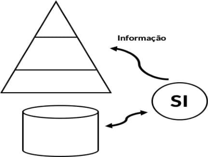

Figura 1 – Sistema de Informação x Software. 

Um segundo exemplo, vamos considerar a complexidade do desenvolvimento de um software embarcado em uma aeronave com 500 pessoas e que realiza o seu controle total, em que um defeito pode ter um impacto altamente negativo. 

Vamos imaginar o que seria do piloto sem as informações do voo no painel de controle. 

Em ambos exemplos, observamos que o software apresenta dois papéis distintos, o primeiro como um produto a ser utilizado pelos usuários, o segundo como veículo que distribui o produto, pois a comunicação entre os diversos componentes de um sistema de informação ocorre por meio de sistemas operacionais, software de comunicação entre outros. O software distribui o produto mais importante da nossa era – a Informação (PRESSMAN, 2016). 

Você consegue imaginar quais os desafios atuais de um engenheiro de software? 

Destacamos que os desafios incluem sete grandes categorias: 

# Software de sistema 

Camadas de software que atendem a outros softwares, tais como, sistemas operacionais, drivers e outros. 

# Software de aplicação 

Inclui software com escopo específico, tais como, sistemas de gestão empresarial (ERP). 

# Software de engenharia/científico 

Inclui software aplicado às áreas de engenharia e científica, tal como, software para cálculo estrutural na área de engenharia civil ou processamento de imagem. 

# Software embarcado 

Instalado em produtos com funções específicas, tal como, o controle de um veículo com informações disponíveis no painel digital. 

# Software para linha de produtos 

Projetado com determinado conjunto de funcionalidades e utilizado por diferentes clientes, por exemplo, sistema emissor de nota fiscal. 

# Aplicações web/aplicativos móveis 

Software específico para dispositivo móvel. 

# Software de inteligência artificial 

Utilizam técnicas de inteligência artificial, tais como, sistema especialistas, redes neurais, aprendizado de máquinas e outros. 

# Engenharia de Software 

Vimos nos exemplos do software embarcado em uma aeronave ou controlando o tráfego aéreo uma característica comum: a complexidade. A melhor tratativa para a complexidade é a aplicação de metodologia que permita a decomposição do problema em problemas menores de forma sistemática, cabendo à engenharia essa sistematização. 

Uma premissa básica é que a engenharia permite a solução de problemas e, quanto mais complexo um produto a ser gerado, mais a engenharia faz-se necessária. 

Vamos ver no caso da construção de uma simples casa, talvez um engenheiro resolva o problema; e no caso de um edifício inteligente com vários andares? Neste caso, o problema tornou-se multidisciplinar, ou seja, serão necessários vários profissionais de várias áreas, e.g., arquiteto, engenheiros civis, mecânicos, elétricos, de software etc. A construção do prédio torna-se inviável caso não haja uma tratativa sistemática por meio da aplicação das melhores práticas da engenharia. 

A mesma correlação pode ser aplicada quando o produto a ser gerado é o software. No caso do software, aplica-se a Engenharia de Software. 

O desenvolvimento de software deve submeter-se aos mesmos princípios aplicados nas engenharias tradicionais, sendo um produto distinto em função da sua intangibilidade que o associa, muitas vezes, somente aos códigos dos programas de computador. Entretanto, diferentemente de outros produtos de outras engenharias em produção, possui alta volatilidade em função de constantes evoluções na tecnologia e nos requisitos, agregando ao software uma complexidade adicional. 

A primeira referência ao termo “Engenharia de Software” foi em 1968, em uma conferência sobre o tema, sob responsabilidade do Comitê de Ciência da NATO (North Atlantic Treaty Organization). Nesse contexto, o Guide to the Software Engineering Body of Knowledge Version 3.0 

(SWEBOK Guide V3.0) apresenta a seguinte definição para a Engenharia de Software: 

A aplicação de uma abordagem sistemática, disciplinada e quantificável para o desenvolvimento, operação e manutenção de software, que é a aplicação de engenharia ao software. 

(SWEBOK Guide V3.0) 

# Tecnologia em Camadas 

A Engenharia de Software é uma tecnologia em camadas, como ilustra a figura 2. Vejamos as descrições das referidas camadas: 

# Camada de qualidade 

Garante que os requisitos que atendem às expectativas do usuário serão cumpridos. 

# Camada de processo 

Determina as etapas de desenvolvimento do software. 

# Camada de métodos 

Define, por exemplo, quais as técnicas de elicitação de requisitos, os artefatos gerados em função da técnica de modelagem adotada, tal como, modelo de casos de uso ou de classes. 

# Camada de ferramentas 

Estimula a utilização de ferramentas “CASE” (Computer-Aided Software Engineering) no desenho dos diversos artefatos ou mesmo na geração automática de código, entre outras aplicações; a tecnologia CASE está disponível para uso em todas as etapas do processo de desenvolvimento de software. 

Figura 2 - Camadas da Engenharia de Software. 

Considerando um produto tangível para todos nós, você poderia imaginar que um dia construirá sua casa própria? Vamos imaginar que sim. O que você precisaria para levar em frente esta construção? Um processo? 

Certamente, pois terá que organizar as etapas da construção: fundação, estrutura, cobertura, alvenaria, instalações etc. Agora a construção da casa fica mais fácil. 

Da mesma maneira, a construção de um software necessita de processo; esse deverá ocorrer de acordo com as melhores práticas estabelecidas pela Engenharia de Software. 

É importante destacar que a base da Engenharia de Software é a camada de processo. 

# Processo de Software 

Processo é uma sequência de etapas que permitem a geração de um produto, no nosso caso, o software. O processo permite uma melhor tratativa em relação à complexidade de obtenção de um determinado produto, pois, na maioria das vezes, é um trabalho multidisciplinar realizado por analistas, programadores, gerentes de projeto, gerentes de teste e outros profissionais. 

Assim como em todas as engenharias, a 

Engenharia de Software possui uma diversidade de modelos para processos de desenvolvimento de software que atendem a diferentes problemas. 

Um requisito importante na seleção de um processo de software é a complexidade. Basicamente, quanto maior a complexidade de um sistema, mais formal deve ser o processo adotado. Importante: a qualidade é a camada base que sustenta a camada processo. 

Uma metodologia de processo genérica compreende cinco atividades (figura 3). 

Figura 3 - Metodologia do Processo. 

# Comunicação 

As primeiras atividades de um processo de software requerem uma comunicação intensiva com os usuários, buscando o entendimento do problema, a definição de objetivos para o projeto, bem como a identificação de requisitos. 

# Planejamento 

Destaca-se nesta atividade a área de conhecimento Gerenciamento de Projeto, que permitirá a elaboração de um Plano de Gerenciamento do Projeto de forma sistemática, tendo como entrega importante o cronograma que inclui as atividades a serem desenvolvidas no referido projeto, contemplando diferentes áreas de conhecimento. 

O processo de desenvolvimento de software disponibiliza as principais atividades que irão compor o Plano de Gerenciamento do Projeto, sendo esse plano executado e monitorado. 

# Modelagem 

A engenharia tem como melhor prática a geração de modelos, tal como a planta baixa de uma casa. A maioria desses modelos gráficos, denominados de diagramas na Engenharia de Software, podem ser complementados por descrições textuais. Como exemplo, apresentamos o modelo de casos de uso que inclui diagramas de casos de uso, artefatos gráficos e descrições de cenários dos casos de uso, artefatos textuais. 

# Construção 

A partir dos modelos gerados, é realizada a construção ou implementação do software, portanto, os modelos determinam o comportamento do software. Essa atividade inclui a codificação e os testes de software de acordo com o planejado. 

# Entrega 

Ao final, ocorre o objetivo de um plano de projeto de software, i.e., a entrega do produto em produção de acordo com o planejado. 

Assista agora ao vídeo Metodologia do processo de desenvolvimento. 

#### Conteúdo interativo 

Acesse a versão digital para assistir ao vídeo. 

As atividades básicas apresentadas são complementadas pelas denominadas “atividades de apoio”, que incluem: 

### Controle e acompanhamento de projeto 

Dentro do princípio de que “não se controla o que não se mede”, a etapa do Gerenciamento de Projeto Monitoramento e Controle permite verificar se a execução está de acordo com o planejado, pois, caso seja identificada alguma não conformidade, ações corretivas devem ser implementadas. 

### Administração de riscos 

Ênfase à área de Gerenciamento de Risco, de modo que qualquer evento, positivo ou negativo que possa impactar o desenvolvimento do projeto, seja tratado. 

### Garantia da qualidade de software 

Ênfase à área de Gerenciamento da Qualidade, a fim de garantir que os requisitos do projeto sejam atendidos. 

### Revisões técnicas 

Atividade intrínseca da qualidade, pois todos os artefatos devem ser testados, inclusive, processos, modelos, código do software e outros. 

### Medição 

Outra atividade da qualidade que permite a definição de métricas para avaliar as várias atividades durante o desenvolvimento do software. 

### Gerenciamento da configuração de software 

Inclui os efeitos das mudanças, por exemplo o gerenciamento de versionamento do software em um processo iterativo e incremental, onde um defeito em produção pode surgir em uma versão anterior à desenvolvida no momento, sendo a manutenção realizada na versão anterior e propagada para a versão atual. Este procedimento, muitas vezes, exige uma ferramenta que automatize a solução deste problema, que pode ser bem complexo. 

### Gerenciamento da capacidade de reutilização 

O reuso de software deve ser um objetivo persistido por quem desenvolve o software. No paradigma estruturado, existiam as bibliotecas de funções que permitiam a reutilização de código em várias aplicações com possibilidades bem limitadas e com o advento do paradigma orientado a objetos, o reuso ficou mais sofisticado em função de mecanismos, e.g. herança, que possibilitam uma melhor componentização do software. 

### Preparo e produção de artefatos de software 

Um processo de software encadeia uma série de atividades, sendo que estas atividades possuem métodos próprios para a geração de artefatos que necessitam ser documentados, e.g., modelo de casos de uso. 

Cabe ao engenheiro de software documentar cada atividade que será aplicada no processo de desenvolvimento de software em função da natureza do problema (complexidade), das características das pessoas que realizarão o trabalho e dos usuários envolvidos. 

# Resumindo 

Neste módulo, podemos destacar a importância do software atualmente, bem como da complexidade no seu desenvolvimento. A aplicação da Engenharia de Software permite lidar com a referida complexidade, pois melhores práticas podem ser aplicadas de forma a gerar um produto “software” que atenda às necessidades para as quais foi projetado. 

Destacamos que a Engenharia de Software é uma tecnologia em camadas, ou seja, com foco na qualidade, processo, métodos e ferramentas. Cabe enfatizar que a base da Engenharia de Software é a camada de processo, por isso foram descritas as principais atividades genéricas que devem compor um processo de software: comunicação, planejamento, modelagem, construção e entrega. 

# Verificando o aprendizado 

Questão 1 

FCC – 2010 (adaptado) - Sobre a engenharia de software, considere: 

I. Atualmente, todos os problemas na construção de software de alta qualidade no prazo e dentro do orçamento foram solucionados. 

II. Ao longo dos últimos 50 anos, o software evoluiu de um produto de indústria para um ferramental especializado em solução de problemas e análise de informações específicas. III. Todo projeto de software é iniciado por alguma necessidade do negócio. IV. O intuito da engenharia de software é fornecer uma estrutura para a construção de software com alta qualidade. 

Está correto o que consta em: 

A 

III e IV, somente. 

B 

II e III, somente. 

C I, II e IV, somente. D 

II, III e IV, somente. 

#### A alternativa A está correta. 

O software tem como um dos principais objetivos agregar valor ao negócio, permitindo a automação de rotinas comumente associadas ao controle administrativo ou em apoio ao processo de decisão. A Engenharia de Software permite o fornecimento dessa estrutura disponibilizando processos, métodos e ferramentas. 

##### Questão 2 

Prefeitura Municipal de Manaus – 2010 - A Engenharia de Software compreende um conjunto de etapas comumente citadas como paradigmas de Engenharia de Software. No tocante a essas etapas, assinale a opção correta. 

##### A 

Os procedimentos da Engenharia de Software constituem o elo que mantém juntos os métodos e as ferramentas. 

##### B 

Os métodos de Engenharia de Software proporcionam os detalhes de “o que fazer” para construir o software. 

C 

As ferramentas de Engenharia de Software proporcionam apoio totalmente automatizado aos métodos. 

##### D 

Os procedimentos da Engenharia de Software garantem o desenvolvimento dentro do prazo. 

#### A alternativa A está correta. 

A Engenharia de Software possui quatro camadas: qualidade, processo, métodos e ferramentas. Cabe à camada de processo, a determinação das etapas de desenvolvimento do software. Definido o processo, o engenheiro de software especifica os métodos e as ferramentas que serão utilizadas. 

2. Descrever as etapas essenciais de um processo de desenvolvimento de software 

# Processo de desenvolvimento de software 

Você sabe por que se aplica de forma intensa o conceito de abstração no desenvolvimento de software? 

Porque o processo de software é iniciado com especificações e modelos com alto nível de abstração e, à medida que o desenvolvimento de software se aproxima da codificação, o nível de abstração diminui, de modo que o código representa o nível mais baixo da abstração ou de maior detalhamento na especificação do software. 

Vamos agora diminuir o nível de abstração do Modelo Genérico apresentado no módulo 1 (figura 3), ou seja, aumentar os detalhes das atividades do processo de software. 

#### (figura 3) 

O engenheiro de software deverá definir qual o processo de desenvolvimento a ser aplicado em um determinado projeto de software como especificação de requisito não funcional. Inicialmente, terá que identificar quais as atividades que irão compor o desejado processo e, em seguida, definir o sequenciamento das referidas atividades, ou seja, o fluxo do processo. 

As atividades típicas que compõem o processo de desenvolvimento de software estão ilustradas na figura 4. O objetivo é ilustrar as atividades mais comuns que compõem os processos de desenvolvimento de software, ou seja, qualquer processo deverá possuir as referidas atividades. 

Figura 4 - Atividades típicas de um processo de desenvolvimento de software. 

Assista agora ao vídeo sobre Atividades típicas de um Processo de Desenvolvimento de Software. 

#### Conteúdo interativo 

Acesse a versão digital para assistir ao vídeo. 

Vamos agora descrever cada uma das atividades comumente previstas em um processo de desenvolvimento de software. 

## Etapa de Levantamento de Requisitos 

A primeira etapa, também denominada de Elicitação de Requisitos, inclui o primeiro desafio do engenheiro de software, entender o problema! 

Imagine você como engenheiro de software, projetando um software para o mercado financeiro! O desafio impressiona? Talvez você concorde comigo – “sim”! 

Realmente, o desafio é grande, pois o referido engenheiro, normalmente, não entende do ambiente de negócio que o software será implementado. Portanto, terá que se comunicar com diferentes usuários que, muitas vezes, entendem de somente parte do problema; para tal, deverá utilizar diferentes técnicas de levantamento de requisitos, tais como, entrevistas, questionários, leituras de documentos, etnografia e outros. 

Nesta etapa, são identificados os requisitos que serão implementados no software projetado. O grande desafio é que o engenheiro de software tenha o mesmo entendimento do negócio que os usuários. 

Neste momento, precisamos apresentar a conceituação de requisito: 

Os requisitos de um sistema são descrições dos serviços fornecidos pelo sistema e as suas restrições operacionais. Esses requisitos refletem as necessidades dos clientes de um sistema que ajuda a resolver algum problema. 

SOMMERVILLE, 2007. 

A partir dessa conceituação, identificamos a tipificação de requisitos comumente utilizada: requisitos funcionais, não funcionais e de domínio. 

# Requisitos funcionais 

Estão relacionados com os serviços fornecidos pelo sistema, ou seja, as funcionalidades que estarão disponíveis no software, tal como, a geração de um histórico escolar em um sistema de gestão acadêmico ou geração de uma nota fiscal em um sistema de vendas 

# Requisitos não funcionais 

Incluem as restrições operacionais impostas ao software, tais como, o sistema gerenciador de banco de dados, a linguagem de programação, legislação pertinente à compliance, entre outros, bem como os requisitos de qualidade, tais como: confiabilidade, manutenibilidade, usabilidade e outros. 

# Requisitos de domínio 

Também são conhecidos como “regras de negócio”, que, normalmente, apresentam-se como restrições ao requisito funcional. Como exemplo, temos o cálculo da média para aprovação em uma determinada disciplina, a contagem de pontuação de multas para computo da perda de uma carteira de motorista ou o cálculo dos impostos quando da geração de uma nota fiscal. O não cumprimento de um requisito de domínio pode comprometer o uso do sistema. 

Cabe destacar que Sommerville (2007) apresenta uma classificação relativa aos níveis de abstração aplicados na descrição dos requisitos, utilizando o termo requisitos de usuários, para especificação com alto nível de abstração, e requisitos de sistema, para especificação com descrições detalhadas, ou seja, com baixo nível de abstração. Realizada essa primeira classificação, os requisitos de sistema são tipificados em funcionais, não funcionais e de domínio, como anteriormente apresentados. 

Muitos estudos destacam a importância desta etapa, pois o mau entendimento de um requisito é propagado nas próximas etapas no processo, ilustrado na figura 4, refletindo de forma negativa no produto software. 

Quando da especificação de requisitos, o engenheiro de software firma um contrato com os usuários, de modo a definir qual produto de software será entregue. A participação dos usuários envolvidos, ou clientes, deve permitir feedbacks sobre defeitos na especificação, evitando a propagação dos referidos defeitos. 

Nesta etapa do PDS, normalmente, é realizada uma entrega, ou uma especificação, denominada de Documento de Requisitos, sendo determinado o Escopo do projeto. 

A partir desse documento, inicia-se a rastreabilidade dos requisitos, ou seja, a relação com os produtos gerados, e.g. modelos, a partir dos mesmos. 

#### Exemplo 

Na etapa de Análise, é gerado o modelo de casos de uso e o modelo de classes; na etapa de Projeto, o modelo de interação; e na etapa de Implementação, a codificação. A rastreabilidade de requisitos garante que as especificações geradas até a codificação estejam de acordo com a documentação de requisitos. 

## Etapa de Análise 

Ainda no contexto da construção de uma casa, quais seriam os requisitos iniciais para que essa construção ocorresse? 

Poderíamos imaginar uma descrição especificando que você quer uma casa com uma sala, três quartos, uma suíte, cozinha, piscina, churrasqueira e com aproximadamente 120 m2. Textualmente, temos um documento de requisitos. 

### E agora, o que fazer com esse documento? 

Podemos contratar um arquiteto para desenhar uma planta baixa que atenda aos requisitos descritos. Essa planta é o que chamamos de modelo, que representa parte da solução do problema “construir a sua casa”. 

A engenharia tem como boa prática a construção de modelos que permitem uma melhor tratativa da complexidade em função de abstrações aplicadas, e.g., o diagrama de casos de uso enfatiza a abstração funcional e o diagrama de sequência, os aspectos dinâmicos do sistema, ou seja, a comunicação entre objetos na realização 

de um caso de uso. O modelo permite, também, a comunicação entre as partes interessadas do projeto, pois podemos considerar que um diagrama de caso de uso permite uma comunicação, por exemplo, entre analistas e usuários ou entre analistas e gerentes de projeto. Os modelos permitem, ainda, uma economicidade no projeto, pois uma correção em um modelo de classes na etapa de análise por um erro no entendimento de um determinado requisito evita a propagação desse defeito no código em produção, manutenção essa que seria bem mais custosa. Uma última colocação: os modelos determinam a forma da solução do problema, ou seja, se o diagrama de componentes estabelece três camadas de software, o software implantado deverá refletir a referida especificação. 

Na etapa de Análise, as especificações contidas no Documento de Requisitos são convertidas em modelos de análise que incluem artefatos gráficos e textuais. Como exemplo, os requisitos funcionais evoluem para uma especificação gráfica denominada Modelo de Casos de Uso, sendo este composto por diagramas de caso de uso, artefatos gráficos, e descrições de caso de uso, artefatos textuais. Importante destacar que uma descrição de caso de uso permite identificar os diferentes cenários de utilização do referido caso. A figura 5 ilustra um diagrama de casos de uso. 

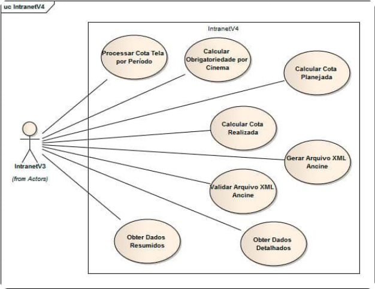

Figura 5 - Exemplo de Diagrama de Casos de Uso. 

Nesta etapa, o engenheiro de software aplica um alto nível de abstração de modo a definir “O QUE” o sistema deverá implementar, ou seja, nenhum tipo de restrição tecnológica é considerado, e.g., como ocorre a comunicação entre os objetos que permitirão implementar o caso de uso “Agendar consulta”. 

A entrega da referida etapa inclui os modelos denominados “modelos de análise” com alto nível de abstração. 

O entendimento do problema modelado está correto? 

Em função desse questionamento, o engenheiro de software necessita VALIDAR seus modelos com os usuários, pois, afinal, são estes que entendem do problema. A validação por parte do usuário garante ao engenheiro que o entendimento da solução do problema está correto e, de acordo com as suas expectativas, i.e., de acordo com os requisitos registrados no documento de requisitos. 

Os modelos estão corretos e balanceados? 

A verificação é uma atividade técnica do engenheiro de software que permite a verificação da correção de cada modelo e o balanceamento entre esses. 

A figura 6 ilustra um diagrama de classes, sendo este um artefato do Modelo de Classes que permite identificar os objetos do domínio do problema que serão utilizados na implementação dos casos de uso. Cabe ao engenheiro de software, verificar a correção do modelo e a consistência com o Modelo de Casos de Uso. 

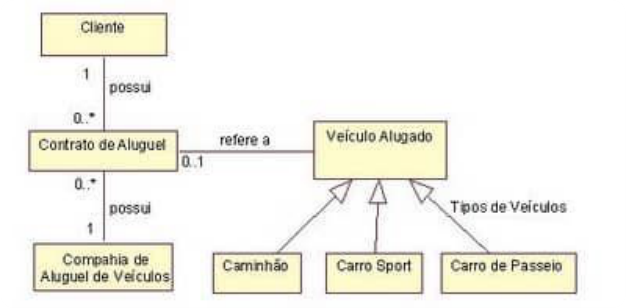

Figura 6 - Exemplo de Diagrama de Classes. 

## Etapa de Projeto 

A fase de Projeto permite os refinamentos dos modelos gerados na análise, bem como a construção de novos modelos gerando especificações com menor nível de abstração e que permitam definir “COMO” implementar a solução especificada, ou seja, ao final desta etapa, o nível de detalhamento da especificação permite a implementação da solução. 

Dentre as principais atividades, destacamos: 

- Refinamento do modelo de classes iniciado na análise. 

- 

- Construção do modelo de interação, que permite identificar a comunicação entre objetos que irão permitir a implementação das funcionalidades especificadas pelos casos de uso. 

- Mapeamento objeto-relacional, permitindo a geração do modelo lógico do banco de dados, ou seja, identificação das tabelas necessárias ao sistema considerando um requisito não funcional que determine uma tecnologia relacional. 

- Desenho dos componentes do sistema e dos nós computacionais necessários para a sua implantação, gerando modelos que determinam a arquitetura do sistema. 

## Etapa de Implementação 

Nesta etapa, ocorre a codificação do software de acordo com os requisitos definidos na etapa de Projeto. Os padrões de projeto devem ser considerados por representarem melhores práticas de implementação do software. 

## Etapa de Testes 

Nesta etapa, são aplicados os denominados testes de software ou testes de validação que permitem verificar se o produto certo está sendo construído. 

Os testes validam os componentes individualmente bem como a integração entre eles. Em geral, esta etapa inicia com os testes unitários, em seguida, os testes de integração e os testes de aceitação ou homologação. Ao final dessa sequência, ocorre a migração do sistema para o ambiente de produção. 

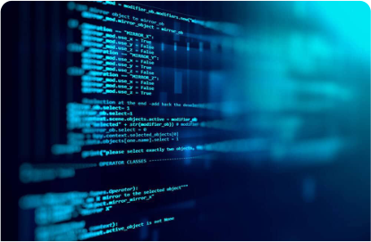

#### Recomendação 

Nesta etapa, é fundamental a geração de um Plano de Teste a partir dos casos de testes, que, por sua vez, estão vinculados aos cenários descritos na descrição de cada caso de uso. 

Outro aspecto importante é a automação dos testes em função da provável repetição destes em um ciclo iterativo e incremental, onde o software é implementado em versões e, a cada nova versão, os testes anteriores necessitam ser refeitos. 

## Etapa de Implantação 

Nesta etapa, o software é migrado para o ambiente de produção, de acordo com o aval da equipe de qualidade. 

Esta etapa pode exigir a geração de manuais de utilização, a migração de dados do ambiente de homologação para o de produção, treinamento de usuários, ou até mesmo a implantação de um call center em caso de sistemas complexos assim o exigirem. 

# Fluxo de Processo 

A especificação de um processo de desenvolvimento de software, lembrando ser este um requisito não funcional, requer a definição de quais atividades irão compor o respectivo processo e como as referidas atividades serão encadeadas, também denominada de Fluxo de Processo ou Ciclo de Vida. 

# Fluxo de Processo Linear 

A figura 7 ilustra o denominado Fluxo de Processo Linear, onde as atividades são executadas em sequência, de modo que cada atividade é realizada por completo uma única vez. 

# Fluxo de Processo Iterativo 

A figura 8 ilustra o denominado Fluxo de Processo Iterativo, onde uma atividade ou um conjunto de atividades podem ser repetidas antes de prosseguir para a seguinte. 

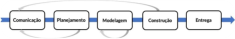

# Fluxo de Processo Evolucionário 

A figura 9 ilustra o denominado Fluxo de Processo Evolucionário, onde o sequenciamento de cada fluxo inclui todas as atividades, sendo que cada iteração completa gera uma nova versão do software, ou seja, o software agrega valor às suas funcionalidades a cada ciclo completo. 

# Fluxo de Processo Paralelo 

A figura 10 ilustra o denominado Fluxo de Processo Paralelo, que permite a execução de uma ou mais atividades em paralelo. 

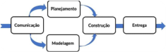

# Modelo de ciclo de vida iterativo e incremental 

A figura 11 ilustra o Modelo de Ciclo de Vida Iterativo e Incremental, onde cada iteração inclui todas as atividades e ocorre o versionamento do produto software gerado. Este modelo corresponde ao Fluxo de Processo Evolucionário. A cada novo ciclo, um subconjunto de requisitos é considerado. 

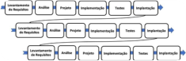

# Resumindo 

Neste módulo, podemos avaliar a importância do processo de desenvolvimento de software. Cabe destacar que processo é a principal camada da Engenharia de Software. 

Foram descritas as principais atividades que, genericamente, compõem um processo de desenvolvimento de software, que inclui: levantamento de requisitos, análise, projeto, implementação, testes e implantação. 

Cabe ao engenheiro de software determinar as atividades que comporão a especificação de um processo de desenvolvimento de software, sendo o sequenciamento determinado pelo Fluxo de Processo, podendo ser 

Fluxo de Processo Linear, Fluxo de Processo Iterativo, Fluxo de Processo Evolucionário ou Fluxo de Processo Paralelo. 

Lembre-se, não existe engenharia sem processo. 

# Verificando o aprendizado 

Questão 1 

O processo da Engenharia de Requisitos inclui o levantamento de requisitos, que corresponde à etapa de compreensão do problema aplicada ao desenvolvimento de software, e tem como principal objetivo fazer com que usuários e desenvolvedores tenham a mesma visão do problema a ser resolvido. 

Neste contexto, (1) na etapa levantamento de requisitos, os desenvolvedores, juntamente com os clientes, tentam levantar e definir as necessidades dos futuros usuários do sistema a ser desenvolvido, prosseguimento no processo, temos (2) a etapa de validação dos requisitos onde os analistas apresentam os modelos criados para representar o sistema aos futuros usuários para que esses modelos sejam validados. 

Considerando as afirmativas (1) e (2), escolha a opção correta: 

A 

Ambas as afirmativas são falsas. 

B 

A afirmativa 1 é verdadeira e a afirmativa 2 é falsa. 

C 

Ambas as afirmativas são verdadeiras, mas a (2) não é uma sequência correta de (1). 

D 

A afirmativa 1 é falsa e a afirmativa 2 é verdadeira. 

A alternativa C está correta. 

Após a realização da etapa de levantamento dos requisitos, temos a etapa de análise, onde o engenheiro de software gera os modelos, tal como, o modelo de casos de uso. Após essa etapa, ocorre a validação dos requisitos pelos usuários do sistema. 

Questão 2 

Um engenheiro de software está identificando os requisitos não funcionais para um novo projeto de software com elevado grau de complexidade em função dos requisitos funcionais levantados até o momento. Neste ponto, o referido engenheiro identificou as tarefas do processo de software adotado e necessita definir o encadeamento das tarefas, ou seja, o fluxo de processo. Nesse caso, assinale qual a opção mais adequada: 

A 

Fluxo de Processo Linear. 

B 

Fluxo de Processo Paralelo. 

C 

Fluxo de Processo Iterativo. 

D 

Fluxo de Processo Evolucionário. 

A alternativa D está correta. 

O Fluxo de Processo Evolucionário permite o versionamento do software e o melhor trato da complexidade. A cada nova iteração, todas as tarefas são executadas, permitindo a solução de um subconjunto de requisitos, e uma nova versão do software é gerada. 

3. Etapas de um processo de desenvolvimento de software e Gerenciamento de Projeto 

# Gerenciamento de Projeto 

Agora que você tem uma boa compreensão das atividades genéricas que compõem um processo e as possibilidades de fluxos de processos, ou seja, os encadeamentos possíveis das referidas atividades, temos agora que compreender como aplicar de forma sistemática uma metodologia que lhe permita, a partir de uma necessidade de um determinado usuário, gerar o produto software desejado. 

A sigla PMI lhe diz algo? O PMI, Project Management Institute, é uma organização que visa disseminar as melhores práticas de Gerenciamento de Projetos em todo o mundo e que tem como premissa o fato de ser esse gerenciamento uma profissão. 

#### Dica 

A certificação de Profissional de Gerenciamento de Projetos (PMP)® do PMI é a certificação para gerentes de projeto reconhecida como uma das mais importantes para a indústria, incluindo a de software. No Brasil, podemos afirmar que é a mais importante. Qual seria a importância de uma certificação para você? A certificação complementa a formação acadêmica tornando o profissional de TI mais atualizado e com maior empregabilidade, tanto na busca de um novo posto de trabalho como de uma promoção. 

Retornando ao nosso tema PMI, este publica um conjunto de melhores práticas denominado de Guia de Conhecimento em Gerenciamento de Projetos – PMBOK, ou Project Management Body of Knowledge, em inglês. O Guia PMBOK é uma base sobre a qual podemos criar uma metodologia para obtenção do nosso produto, i.e., o software. 

Nesse contexto, temos que apresentar um primeiro conceito: 

Um projeto é um esforço temporário empreendido para criar um produto, serviço ou resultado único. 

(PMI, 2017) 

Podemos inferir do conceito que todo projeto tem início, meio e fim, por isso é temporário, sendo o mesmo fator impulsionador de mudança nas organizações. 

Agora, podemos apresentar um segundo conceito que cabe destaque: 

Gerenciamento de projetos é a aplicação de conhecimentos, habilidades, ferramentas e técnicas às atividades do projeto a fim de cumprir os seus requisitos. O gerenciamento de projetos é realizado através da aplicação e integração apropriadas dos processos de gerenciamento de projetos identificados para o projeto. O gerenciamento de projetos permite que as organizações executem projetos de forma eficaz e eficiente (PMI, 2017). 

Lembra que a Engenharia de Software está baseada em processos? 

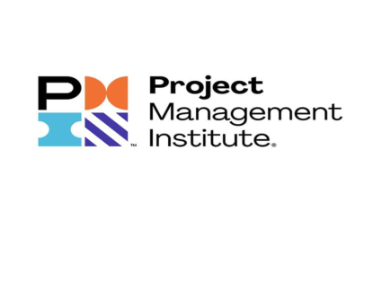

A atividade de gerenciamento de projetos tem a mesma base. 

Vamos entender a seguir como funciona. 

# Ciclo de vida do projeto x Grupos de processos 

O ciclo de vida do projeto inclui as fases genéricas ilustradas na figura 12 e que fazem parte de todo projeto. 

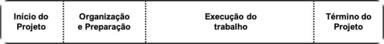

Figura 12 – Ciclo de vida do projeto. 

Qual a relação do ciclo de vida do projeto com o fluxo de processo do software? 

Os fluxos de processos ou ciclos de vida que apresentamos anteriormente incluem os tipos: linear, iterativo, evolucionário e paralelo. A seleção de um determinado Fluxo de Processo determina as fases pelas quais um projeto irá passar, do início ao término. 

Exemplificando: o engenheiro de software seleciona o Fluxo de Processo Evolucionário, ou Iterativo e Incremental, representado na figura 11. A partir dessa especificação, o ciclo de vida do projeto está estabelecido e as entregas do projeto ocorrerão por meio de uma série de iterações. 

Como esse ciclo de vida do projeto estabelecido é gerenciado? 

Por meio da execução de uma série de atividades de gerenciamento de projeto, conhecidas como processos de gerenciamento de projetos. 

Cada processo de gerenciamento de projetos transforma entradas em saídas através da aplicação de técnicas e ferramentas de gerenciamento de projetos apropriadas (figura 13). As saídas podem ser uma entrega ou um resultado. 

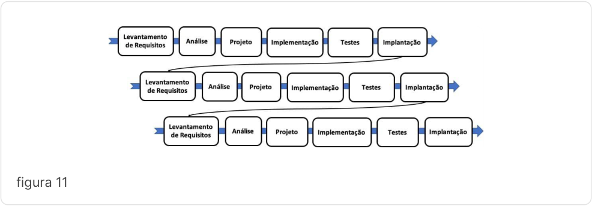

<!-- Start of picture text -->
figura 11 <!-- End of picture text -->

Figura 13 – Processo de Gerenciamento de Projeto. 

A figura 14 ilustra as cinco etapas que permitem a “GESTÃO” de um projeto: Iniciação; Planejamento; Execução; Monitoramento e Controle; e Encerramento. 

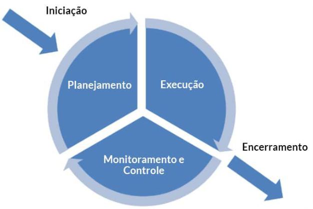

Figura 14 – Grupos de Processos. 

Temos que considerar que cada etapa possui um conjunto de processos, conjunto este denominado de Grupo de Processos de Gerenciamento de Projetos. 

De uma forma simplificada, o gerente de projetos tem que considerar as etapas de gestão, por exemplo, para a etapa INICIAÇÃO: 

1. Seleciona os processos que serão utilizados, considerando a complexidade do projeto. 

2. Aloca responsáveis por cada processo de acordo com a área de conhecimento. 

   - Os responsáveis realizam os processos de acordo com o que preconiza o PMBOK. 

3. 

4. Os responsáveis geram seus respectivos resultados para cada processo. 

Em seguida, aplica os passos de 1 a 4 anteriores para cada etapa do ciclo de vida do projeto: Planejamento, Execução, Monitoramento e Controle e Encerramento. Em projetos complexos, as etapas podem ocorrer de forma iterativa. 

Os cinco grupos de processos ilustrados na figura 14 serão descritos a seguir: 

# Grupo de processos de iniciação 

Grupo que inclui os processos realizados no início de um projeto, cabendo destaque ao Termo de Abertura do Projeto, termo que autoriza a alocação de recursos ao projeto. 

# Grupo de processos de planejamento 

Grupo que inclui os processos realizados para planejar a execução de um novo projeto. A primeira atividade de planejamento é o gerenciamento do escopo do projeto. 

A principal entrega do planejamento é o cronograma. O cronograma físico inclui as datas de início e término de todas as atividades do projeto. 

# Grupo de processos de execução 

Aqui está um dos grandes desafios do gerente de projeto, que é executar o projeto de acordo com o planejado. Lembre-se de que o gerente de projetos não está sozinho, sendo um integrador de pessoas e distintos conhecimentos. 

# Grupo de processos de monitoramento e controle 

Nesse grupo, podemos aplicar a máxima de que “não se controla o que não se mede”. 

Grupo que inclui os processos que permitem monitorar e controlar o progresso e desempenho do projeto. Caso alguma atividade não ocorra de acordo com o planejado, terá que ser avaliada uma ação corretiva a fim de que essa não conformidade seja tratada por meio de um gerenciamento de mudanças. 

# Grupo de processos de encerramento 

Lembre-se, todo projeto é temporário, portanto, em algum momento, terá que ser, formalmente, encerrado. 

Grupo que inclui os processos que permitirão a conclusão ou encerramento do projeto, tais como, a entrega e aceitação do produto, a dispensa da equipe de projeto ou avaliação geral dos resultados. 

# Áreas de conhecimento em Gerenciamento de Projetos 

Assim como a complexidade é um fator determinante na definição de um processo de software, também é inerente ao Gerenciamento de Projeto, de modo que, quanto maior o problema, mais multidisciplinar este se torna. 

Em função dessa complexidade, qual seria a sua equipe técnica para desenvolver um projeto de software? 

Provavelmente, você pensaria em engenheiro de software, analistas, administrador de banco de dados, programadores, arquitetos de software, entre outros. 

Perfeito, essa seria uma boa equipe! 

Mas essa equipe seria capaz de realizar a “GESTÃO” de um projeto de software? Podemos considerar que uma equipe de Gerenciamento de Projeto deve ser composta por especialistas em custos que realizem orçamentos realistas; especialistas em aquisições que tenham capacitações na realização de contratações ou licitações; especialistas em recursos humanos, a fim de gerenciar os direitos trabalhistas da equipe de projeto; e outros. 

É possível que essa equipe técnica resolva parte do problema em função da complexidade na área de gestão que um projeto de software possa requerer. 

Considerando que o gerenciamento de projetos é uma atividade multidisciplinar, o PMBOK realiza a fatoração dessa complexidade em 10 (dez) áreas de conhecimento, onde cada área é composta por um conjunto de processos, como ilustra a figura 15. 

figura 15 

A figura 15 lista as áreas de conhecimento e o seu relacionamento com os grupos de processos. 

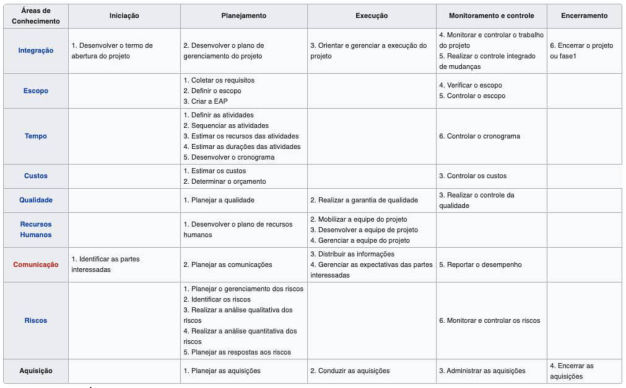

Figura 15 – Áreas de conhecimento x Grupos de processos. 

Você poderia perguntar como gerente de projeto: qual a minha equipe então? 

Respondendo ao questionamento, o perfil de sua equipe deverá estar alinhado às áreas de conhecimento que serão descritas a seguir. 

Conheça no vídeo a seguir as Áreas de Conhecimento e Grupos de Processos do PMBOK aplicados ao Desenvolvimento de Software. 

Conteúdo interativo 

Acesse a versão digital para assistir ao vídeo. 

## Gerenciamento da integração do projeto 

Área que inclui os processos que permitem a integração das diferentes áreas de conhecimento, estando essa área sob controle direto do gerente de projetos. 

Podemos dizer que o gerente de projeto atua como um maestro, pois não precisa ter conhecimento específico de cada área de conhecimento. Este combina os resultados em todas as outras áreas de conhecimento e tem a visão geral do projeto, pois é o único responsável pelo projeto como um todo. 

Observe na figura 15 que a única área com processos em todos os grupos de processos é a Integração. Isso significa que o gerente de projetos está presente em todas as etapas de gestão. 

Cabe destacar, mais uma vez, que o Termo de Abertura do Projeto é o documento que autoriza a alocação de recursos ao projeto. 

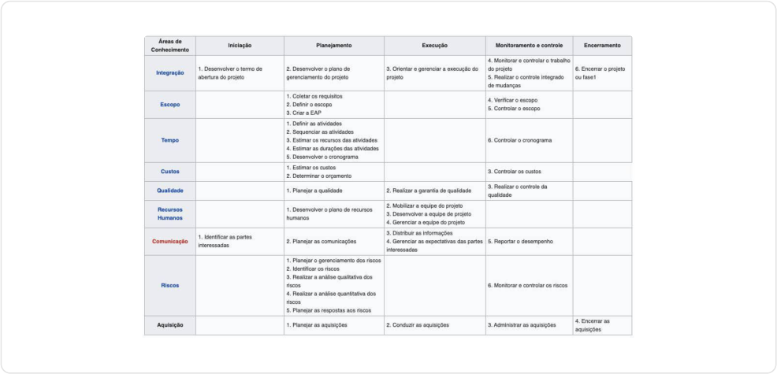

## Gerenciamento do escopo do projeto 

Área que inclui os processos necessários para assegurar que o projeto contemple todo e somente o trabalho necessário para que este termine com sucesso. Nesta área, são especificados e detalhados os requisitos de software. 

A principal técnica para a definição do escopo é a confecção da Estrutura Analítica do Projeto (EAP) ou Work Breakdown Structure (WBS). 

A figura 16 ilustra um exemplo de EAP, onde cada elemento constitui uma entrega e as entregas que não são decompostas são chamadas de pacotes de trabalho ou workpackages. Os pacotes de trabalho são conjuntos de tarefas ou ações que, efetivamente, serão executadas no projeto. 

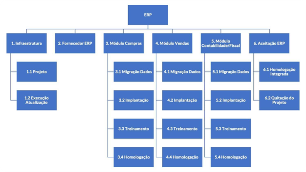

Figura 16 – Exemplo de EAP. 

## Gerenciamento do cronograma do projeto 

Área que inclui os processos necessários para gerenciar o término pontual do projeto, tendo como principal entrega no planejamento o cronograma (físico) do projeto. 

O cronograma do projeto é gerado na etapa de planejamento do projeto. Inicialmente, são identificadas as atividades, a partir dos pacotes de trabalho da EAP e, para cada atividade, devemos especificar a duração e 

os respectivos insumos. Em seguida, é elaborado o diagrama de rede do cronograma do projeto, que determina as interdependências entre as atividades, tal como ilustrado na figura 17. 

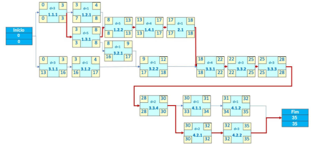

Figura 17 – Diagrama de Rede do Cronograma do Projeto. 

Finalmente, podemos gerar o cronograma do projeto, exemplificado na figura 18. 

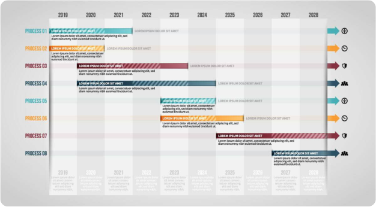

Figura 18 – Exemplo de Cronograma Detalhado do Projeto. 

# Gerenciamento dos custos do projeto 

Inclui os processos envolvidos na gestão dos orçamentos do projeto, a fim de permitir que o projeto possa ser encerrado dentro do orçamento aprovado. 

# Gerenciamento da qualidade do projeto 

Área que inclui os processos que garantem o atendimento aos requisitos do projeto e, como consequência, as expectativas dos financiadores do projeto. 

# Gerenciamento dos recursos do projeto 

Área que inclui os processos para identificar, adquirir e gerenciar os recursos necessários para a conclusão bem-sucedida do projeto. 

# Gerenciamento das comunicações do projeto 

Área que inclui os processos necessários para assegurar que as informações do projeto tenham uma gestão oportuna e apropriada. 

# Gerenciamento dos riscos do projeto 

Área que inclui os processos de gestão dos riscos em um projeto. 

# Gerenciamento das aquisições do projeto 

Área que inclui os processos necessários para comprar ou adquirir produtos, serviços ou resultados externos à equipe do projeto. 

# Gerenciamento das partes interessadas do projeto 

Área que inclui os processos exigidos para identificar partes interessadas que possam gerar impacto no projeto, bem como desenvolver estratégias para o seu engajamento eficaz nas decisões e execução do projeto. 

# Resumindo 

Neste módulo, podemos avaliar a importância do relacionamento entre o fluxo de processo de software com o ciclo de vida de Gerenciamento do Projeto. 

Ambos os ciclos têm como base o conceito processo, pois, como vimos, processo é a principal camada da Engenharia de Software e o gerenciamento de projeto é orientado a projeto em função dos grupos de processos. Importante destacar que um processo no Gerenciamento de Projetos tem duas dimensões: a primeira, como parte de um grupo de processos; e a segunda, como parte de uma das 10 (dez) áreas de conhecimento. 

As áreas de conhecimento permitem a tratativa da complexidade de projetos multidisciplinares, pois a equipe de gerenciamento de projetos deverá ser composta por especialistas nas diversas áreas de conhecimento. 

# Verificando o aprendizado 

Questão 1 

O gerente de projeto de um determinado projeto de software definiu o processo de desenvolvimento com as atividades comumente utilizadas, tais como, levantamento de requisitos, análise, projeto etc. O fluxo de processos adotado foi o evolucionário por permitir o versionamento do software. A equipe do projeto, no momento, está definindo a duração de cada atividade do processo de desenvolvimento de software e as respectivas dependências. Qual o grupo de processos do PMBOK e a área de conhecimento do projeto encontra-se a equipe de projeto? 

A 

Grupo de processos planejamento e área de conhecimento gerenciamento do cronograma. 

B 

Grupo de processos execução e área de conhecimento gerenciamento da integração. 

C 

Grupo de processos execução e área de conhecimento gerenciamento do cronograma. 

D 

Grupo de processos planejamento e área de conhecimento gerenciamento do escopo. 

A alternativa A está correta. 

A área de gerenciamento do escopo permite criar a EAP. Na sequência, ainda no grupo de processos planejamento, podemos iniciar os processos da área de conhecimento gerenciamento do cronograma que inclui a identificação das atividades e suas dependências. 

Questão 2 

O engenheiro de software necessita definir o escopo do projeto de um determinado software e decidiu utilizar o processo que permite a criação da Estrutura Analítica do Projeto (EAP). Assinale a afirmativa correta relativa à EAP: 

A 

As entregas que sofrem decomposição na EAP são chamadas de pacotes de trabalho. 

##### B 

A EAP é elaborada no grupo de processo iniciação. 

C 

A área de conhecimento do processo “Criar a EAP” é gerenciamento do cronograma. 

D 

Após a criação da EAP, o engenheiro de software poderá iniciar os processos que permitem o estabelecimento do cronograma do projeto. 

A alternativa D está correta. 

A Estrutura Analítica de Projeto, ou simplesmente EAP, permite a representação gráfica do escopo do projeto, sendo confeccionada no grupo de processos planejamento e pertence à área de conhecimento gerenciamento de escopo. A criação da EAP permite, em continuidade à etapa de planejamento, a execução de processo que conduzam ao desenvolvimento do cronograma. 

4. A importância do Gerenciamento de Risco no projeto de software 

# Risco 

As melhores práticas desenvolvidas neste módulo têm por fundamento o PMBOK, cujos processos estão definidos na figura 15, vista no módulo 3. 

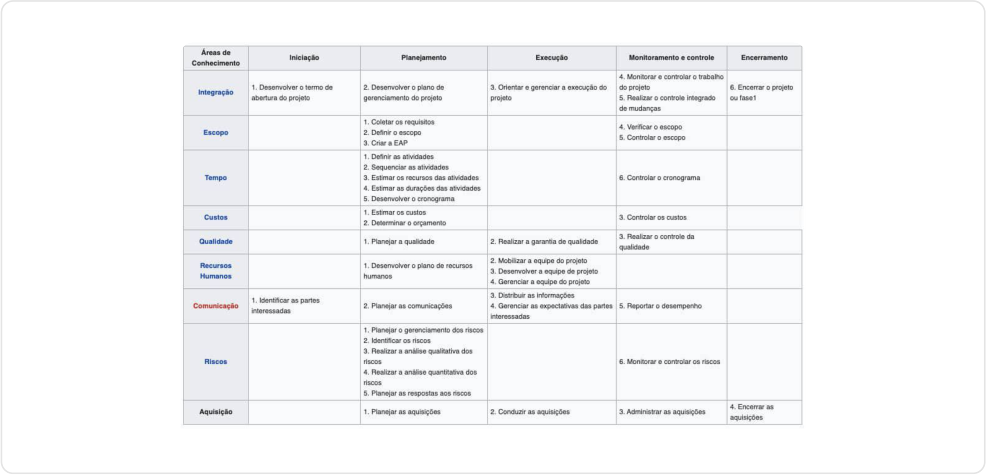

Imagine você realizando um planejamento de uma viagem ao exterior nas próximas férias. Considerando que o roteiro está definido, bem como as reservas dos hotéis realizadas, as passagens reservadas e uma quantidade de dólares adquiridos, podemos, intuitivamente, aplicar uma abstração denominada risco, ou seja, o que pode ocorrer de errado na minha viagem? 

Vamos, então, gerar uma pequena lista de possíveis eventos negativos para entendermos os conceitos: 

- Ocorrência de um problema de saúde, por causa de um acidente ou ter contraído alguma doença. 

- Cancelamento da passagem pela companhia aérea. 

- 

- A quantidade de dólar adquirida não ser suficiente. 

- 

Observe que a avaliação de risco gera uma preocupação que o conduz ao futuro, inserindo um grau de incerteza – ele pode ou não ocorrer. Ao mesmo tempo, espera-se que fique clara a importância de sua avaliação, pois, caso ocorra algum dos eventos listados durante a sua viagem, essa pode estar seriamente comprometida. 

Um risco é um evento ou condição incerta que, se ocorrer, provocará um efeito positivo ou negativo em um ou mais objetivos do projeto. 

(PMI, 2017) 

Você pode agora questionar: efeito positivo? 

O risco não trata de efeitos negativos ou coisas que podem dar errado? Realmente, o mais comum é associar risco a algo negativo, mas, conceitualmente, pode ser algo positivo. Vamos exemplificar. 

Imagine uma empresa exportadora de minério que elabora o seu plano de investimento para o próximo ano e que identificou o seguinte risco: variação cambial do dólar, sendo essa a moeda padrão da comercialização de commodities. O planejamento inclui aplicar os recursos de investimentos em novos projetos de prospecção de minas. 

Neste momento, faz-se necessário realizar uma projeção do valor do câmbio para o próximo ano, pois, como apresentado, o faturamento da empresa está atrelado à referida moeda – vamos imaginar que o valor projetado para o dólar foi de R$ 5,50 (reais). Temos então dois cenários possíveis: 

### Cenário negativo 

O dólar chega a valer R$ 4,00, ou seja, a empresa terá que reduzir o seu portfólio de projetos em função da redução do capital de investimento, pois a empresa irá faturar menos com a mesma quantidade de produtos exportados. Esse cenário é um obstáculo para a consecução dos resultados esperados. 

### Cenário positivo 

O dólar chega a valer R$ 7,00, ou seja, a empresa poderá incrementar o seu portfólio de projetos em função do aumento de capital de investimento, pois a empresa irá faturar mais com mesma quantidade de produtos exportados. Esse cenário é uma oportunidade para a consecução dos resultados esperados. 

Atenção 

Lembrando que nosso contexto é a Engenharia de Software, a melhor prática é focar nos cenários negativos. 

Como citado anteriormente, o risco permite planejar o futuro e evitar que empresas tenham “sustos” nos seus projetos em função de eventos inesperados e, a partir destes, iniciar as devidas tratativas. Em síntese, a área de Gerenciamento de Risco permite a sistematização dessas tratativas em forma de plano. 

Veja, na figura 15, os processos que fazem parte da área de conhecimento Gerenciamento de Riscos. Os referidos processos permitem a sistematização da identificação, da análise e das respostas aos riscos de um projeto. 

figura 15 

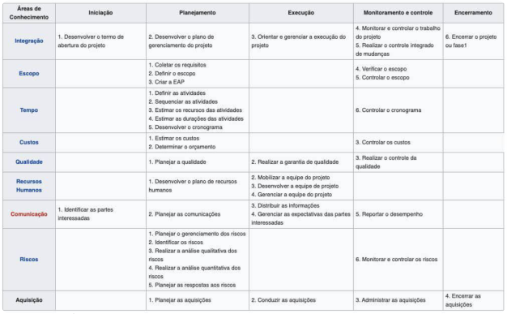

Figura 15 – Áreas de conhecimento x Grupos de processos. 

## Identificação de riscos 

Alinhado às descrições apresentadas, podemos determinar que um risco possui três componentes: um evento; a probabilidade de ocorrência do evento, associada ao grau de incerteza; e o impacto decorrente do evento, caso aconteça, associado ao grau de perda. 

Como parte do Plano de Gerenciamento de Riscos, a elaboração de uma Estrutura Analítica do Risco (EAR) auxilia na definição de potenciais fontes de riscos para o projeto, permitindo a identificação de riscos de forma categorizada, exemplificada na figura 19. 

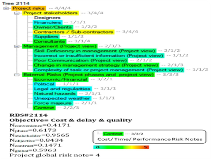

Figura 19 - Extrato de um exemplo de EAR. 

O processo de Identificação de Riscos requer uma clara compreensão da missão, escopo e objetivos do projeto. 

Segundo Pressman (2016), uma proposta para identificação de categorias genéricas de risco relacionadas com o software inclui: 

# Tamanho do produto 

Riscos associados ao tamanho do software. 

# Impacto no negócio 

Riscos oriundos de restrições impostas pelo cliente ou pelo mercado. 

# Características do envolvido 

Riscos relacionados com a comunicação oportuna, por exemplo, entre engenheiro de software e um determinado cliente. 

# Definição do processo 

Riscos relacionados com a auditoria de processos por parte da equipe de qualidade. 

# Ambiente de desenvolvimento 

Riscos associados às ferramentas disponíveis para criar o software, tais como, ferramentas case disponíveis. 

# Tecnologia a ser criada 

Risco relacionado com as inovações tecnológicas aplicadas no desenvolvimento do software, tal como, um novo framework de persistência de dados. 

# Quantidade de pessoas e experiência 

Riscos que associados aos perfis dos engenheiros de software, administradores de banco de dados, web designers, enfim, da equipe que realizará o trabalho. 

O processo de identificação de riscos é iterativo, pois novos riscos podem aparecer durante o projeto. Uma técnica muito comum a ser utilizada na identificação de riscos é a técnica denominada de Brainstorming. Esta inclui uma reunião com um conjunto multidisciplinar de especialistas com a finalidade de obter uma lista abrangente de cada risco de projeto e as fontes do risco geral do projeto, sendo as ideias geradas sob a orientação de um facilitador. 

Uma segunda técnica é conhecida como Lista de Verificação ou Check List, ou seja, uma lista de riscos baseada em informações históricas e conhecimentos acumulados de projetos semelhantes e outras fontes de informações. Essas listas ajudam a identificar pontos fracos no projeto atual a partir de experiências passadas. 

Uma terceira técnica proposta pelo PMBOK é a entrevista. 

A seguir, vamos explorar um exemplo da aplicação dessa técnica com experientes gerentes de projeto de software, que levantaram as seguintes questões e foram apresentadas por Pressman (2016). 

Exemplo da Técnica de Entrevista 

- A alta gerência e o cliente estão formalmente comprometidos em apoiar o projeto? 

- Os usuários estão bastante comprometidos com o projeto e o sistema/produto a ser criado? 

- Os requisitos são amplamente entendidos pela equipe de engenharia de software e clientes? 

- Os clientes foram totalmente envolvidos na definição dos requisitos? 

- Os usuários têm expectativas realistas? 

- 

- O escopo do projeto é estável? 

- 

- A equipe de Engenharia de Software tem a combinação de aptidões adequadas? 

- 

- Os requisitos de projetos são estáveis? 

- 

- A equipe de projeto tem experiência com a tecnologia a ser implementada? 

- 

- O número de pessoas na equipe de projeto é adequado para o trabalho? 

- 

- Todos os clientes e usuários concordam com a importância do projeto e com os requisitos do sistema/produto a ser criado? 

Caso alguma questão seja respondida negativamente, insira o risco, ou riscos, na sua lista de riscos. 

# Análise Qualitativa dos Riscos 

Até o momento, temos uma lista com os prováveis riscos do projeto. 

Vamos imaginar que tenhamos uma longa lista. Isso, intuitivamente, nos leva a considerar a necessidade de determinarmos a importância relativa entre os referidos riscos, a fim de que possamos saber quais os riscos prioritários. 

É interessante destacar que a tratativa de riscos poderá gerar alocação de recursos financeiros, impactando o orçamento do projeto, ou seja, não é possível tratar os riscos listados com a mesma prioridade, devido às limitações de tempo e recursos. 

O objetivo da Análise Qualitativa dos Riscos é priorizar os riscos, combinando a probabilidade de ocorrência e, caso o risco ocorra, o seu impacto. Essa combinação permite determinar o potencial de cada risco em influenciar os resultados do projeto. A probabilidade determina a dimensão da incerteza e o impacto, o efeito sobre os objetivos do projeto. 

No início deste módulo, definimos três eventos, a título de exemplo, no projeto de uma viagem ao exterior. Vamos agora aplicar a Análise Qualitativa de Riscos nesses eventos. 

## Probabilidades 

Temos que definir as probabilidades que serão adotadas: 

|Grande chance de ocorrer|0,95|
|---|---|
|Provavelmente ocorrerá|0,75|
|Igual chance de ocorrer ou não|0,50|
|Baixa chance de ocorrer|0,25|
|Pouca chance de ocorrer|0,10|

## Graus de impacto 

Definir os graus de impacto: 

|Grau de impacto|Peso|
|---|---|
|Muito grande|5|
|Grande|4|
|Moderado|3|
|Pequeno|2|
|Muito pequeno|1|

## Aplicação 

# Podemos, então, aplicar os valores a cada evento: 

|Evento|Probabilidade|Impacto|Probabilidade x Impacto|
|---|---|---|---|
|1) Ocorrência de um problema de saúde, por causa de um acidente ou ter contraído alguma doença|0,75|5|3,75|
|1) Cancelamento da passagem pela companhia aérea|0,50|3|1,5|
|3) A quantidade de dólar adquirida não ser suficiente|0,50|4|2,0|

Temos agora prioridades! De acordo com a tabela, o evento mais crítico está relacionado com a saúde, em seguida, com a quantidade de dólar e, finalmente, com a passagem. 

#### Saiba mais 

A Força Aérea Americana determina em seus projetos de software os seguintes componentes de risco: desempenho, custo, suporte e cronograma. As categorias de impacto incluem: catastrófico, crítico, marginal e negligenciável. 

Você pode questionar: como determino a probabilidade e o impacto, valores que agregam incertezas? Lembre-se de que a área de conhecimento Gerenciamento de Risco do Projeto requer, como as demais áreas, especialistas na respectiva área. Os profissionais que trabalham com risco têm a expertise necessária no trato desses números que representam incertezas, principalmente, por experiências em projetos passados semelhantes. 

O gerente de projetos é um integrador de conhecimentos e não precisa ter expertise em todas as áreas de conhecimento, mas tem que entender bem dos processos aplicados nas diferentes áreas. 

# Análise Quantitativa dos Riscos 

A Análise Quantitativa dos Riscos é um processo de analisar numericamente os efeitos dos riscos priorizados pela Análise Qualitativa de Riscos, pois estes podem gerar impacto potencial e substancial nos resultados do projeto. 

As técnicas aplicadas incluem simulações, árvore de decisão entre outras. No contexto da Engenharia de Software, podemos aplicar a árvore de decisão, a fim de avaliar (1) a contratação de uma fábrica de software para desenvolvimento de um determinado software ou (2) realizar o desenvolvimento na empresa. 

Vamos agora dar continuidade ao nosso pequeno exemplo. A tabela a seguir, considerando a simplicidade do cenário adotado, ilustra o resultado da análise quantitativa: 

|Prioridade|Evento|Custo (R$)|
|---|---|---|
|1|Ocorrência de um problema de saúde, por causa de um acidente ou ter contraído alguma doença|10.000,00|
|2|A quantidade de dólar adquirida não ser suficiente|1.000,00|
|3|Cancelamento da passagem pela companhia aérea|3.000,00|

# Planejamento de Respostas aos Riscos 

O processo Planejar Respostas aos Riscos inclui o planejamento de ações para o aumento das oportunidades e redução das ameaças aos objetivos do projeto, gerenciando os riscos de acordo com sua prioridade. As referidas ações são representadas pelas respostas adequadas a cada risco, podendo ser incluído o tratamento a ser aplicado, por exemplo, mitigação, quando se busca reduzir o impacto no resultado do projeto, ou eliminação, uma resposta que elimine o referido impacto. 

Retornando ao nosso pequeno exemplo, temos uma proposta de respostas aos riscos identificados na tabela a seguir: 

|Prioridade|Evento|Tratamento|Resposta|
|---|---|---|---|
|1|Ocorrência de um problema de saúde, por causa de um acidente ou ter contraído alguma doença|Eliminação|Contratar o seguro viagem|
|2|A quantidade de dólar adquirida não ser suficiente|Eliminação|Atualizar o cartão de crédito para uso internacional|
|3|Cancelamento da passagem pela companhia aérea|Mitigação|Confirmar a reserva em companhia aérea com boas alternativas de voos|

Assista agora ao vídeo sobre o Processo de gerenciamento de riscos na etapa de planejamento. 

Conteúdo interativo 

Acesse a versão digital para assistir ao vídeo. 

# Resumindo 

Neste módulo, podemos destacar a importância da área de conhecimento Gerenciamento dos Riscos do Projeto. Um risco é um evento ou condição incerta que, se ocorrer, provocará um efeito positivo ou negativo em um ou mais objetivos do projeto. 

A identificação dos riscos pode ser facilitada pela definição de uma Estrutura Analítica de Riscos (EAR), pois essa permite a categorização dos riscos. 

Definidos os riscos, surge a necessidade de priorização destes, pois a tratativa dos riscos poderá impactar o orçamento final do projeto. O processo de análise qualitativa permite a referida priorização definindo para cada risco a sua probabilidade de ocorrência e o grau de impacto, caso ocorra, nos resultados do projeto. Obtidos os dois valores numéricos, pode-se então priorizar os riscos. 

Priorizados os riscos, o próximo processo inclui a realização da análise quantitativa dos riscos, permitindo, de acordo com a priorização realizada anteriormente, quantificar os impactos sobre os custos do projeto em função dos riscos. 

O planejamento tem como último processo a elaboração do Planejamento de Respostas aos Riscos, incluindo as ações que irão realizar as tratativas que permitirão eliminar ou mitigar os impactos nos resultados do projeto. O referido plano é colocado em execução por meio do processo Implementar Respostas aos Riscos e devidamente monitorado pelo processo Monitorar os Riscos (veja figura 15). 

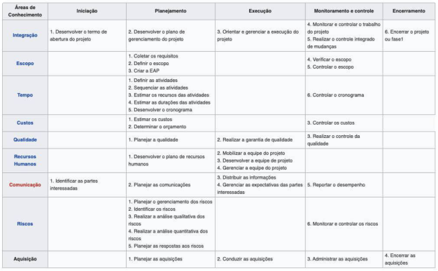

figura 15 

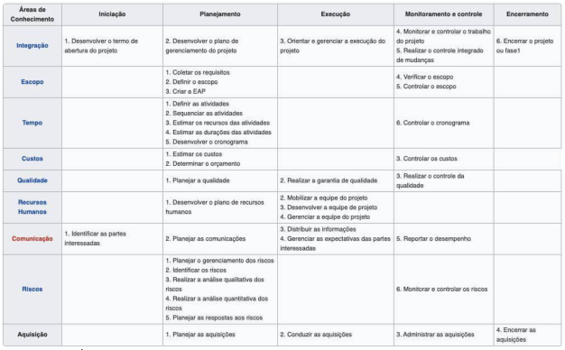

Figura 15 – Áreas de conhecimento x Grupos de processos. 

O projeto de software possui características que necessitam das melhores práticas de gerenciamento de riscos contidas no PMBOK, com destaque para as atualizações constantes das tecnologias e a alta volatilidade dos requisitos durante o projeto. 

Lembre-se, analise os riscos do seu projeto. 

# Verificando o aprendizado 

##### Questão 1 

Um engenheiro de software, responsável pelo gerenciamento de riscos, detectou um risco relacionado ao uso de uma nova tecnologia de persistência de dados nunca utilizada na empresa. Em uma reunião de Brainstorming, participantes do projeto apresentaram outros riscos do projeto em desenvolvimento. Ao final da reunião, cada risco foi priorizado em função das respectivas ameaças ao projeto, sendo gerada uma ata da reunião com o plano de respostas a todos os riscos. No contexto do gerenciamento de risco, analise o final da referida reunião e assinale a opção correta: 

##### A 

O gerente de riscos agiu corretamente, gerando uma evidência de tratativa dos riscos, ou seja, o plano de respostas aos riscos. 

##### B 

O gerente de riscos realizou a análise quantitativa corretamente. 

##### C 

O gerente de riscos deveria ter realizado a análise quantitativa antes da geração do plano de respostas aos riscos. 

##### D 

O gerente de riscos elaborou corretamente o plano de respostas a riscos. 

A alternativa C está correta. 

A elaboração do plano de respostas a riscos ocorre após a análise quantitativa, pois essa permite a análise numérica dos riscos que serão inseridos no referido plano. 

##### Questão 2 

COVEST- COPSET – 2019 (adaptada) Ao fazer seu plano de riscos, um analista elaborou uma matriz de probabilidade e impacto. Sobre o emprego deste tipo de metodologia, é correto afirmar que: 

##### A 

Deve-se evitar o uso de probabilidades numéricas, aplicando-se a terminologia “baixo, médio ou alto” para indicar a chance de um determinado risco acontecer. 

##### B 

Uma matriz de probabilidade e impacto deve considerar, também, fatores qualitativos como o agente responsável e o plano de ação a ser tomado. 

##### C 

Os riscos devem ser previstos e documentados livres de contexto, isto é, da forma mais objetiva possível. 

##### D 

Nessa matriz, foram especificadas as combinações de probabilidade e o impacto que levam à classificação dos riscos, podendo estes serem classificados separadamente por objetivo, como custo, tempo e escopo. 

#### A alternativa D está correta. 

A Análise qualitativa dos riscos permite definir, para cada risco identificado, uma probabilidade e um grau de impacto, o que permite priorizar os riscos em função de seu efeito sobre os resultados do projeto. 

5. Conclusão 

# Considerações finais 

Apresentamos os principais conceitos da Engenharia de Software relacionados com processo de desenvolvimento de software e Gerenciamento de Projetos. 

O processo de desenvolvimento de software permite identificar as atividades que permitem a geração do produto software. Embora existam diferentes modelos de processos, destacamos as atividades típicas ou genéricas que compõem os referidos processos, cujo entendimento permite ao engenheiro de software compreender os possíveis modelos a serem adotados em um determinado projeto de software. 

O Gerenciamento de Projetos tem foco na gestão durante o desenvolvimento de software, diferentemente do processo de software, que determina as atividades técnicas. Ele define as atividades de gestão relacionadas à iniciação, ao planejamento, à execução, ao monitoramento e controle e ao encerramento do projeto. Nesse contexto, destacamos o gerenciamento de risco. 

#### Podcast 

Para encerrar, ouça sobre Fundamentos de software e gerenciamento de projetos. 

Conteúdo interativo 

Acesse a versão digital para ouvir o áudio. 

## Explore + 

Para aprofundar seus conhecimentos sobre os assuntos explorados neste tema, leia: 

Os capítulos 1, 2, 3, 31 e 35 de: 

- PRESSMAN, R. S.; MAXIM. B. R. Engenharia de Software. 8. ed. Porto Alegre: Amgh Editora, 2016. 

Os capítulos 1, 4 e 5 de: 

- SOMMERVILLE, I. Engenharia de Software. 8. ed. São Paulo: Pearson Prentice Hall, 2007. 

O capítulo 1 de: 

- PMI. Um Guia do Conhecimento em Gerenciamento de Projetos. GUIA PMBOK® 6. ed. EUA: Project Management Institute, 2017. 

## Referências 

BEZERRA, E. Princípios de Análise e Projeto de Sistemas com UML. 3. ed. Rio de Janeiro: Elsevier, 2014. 

PRESSMAN, Roger S.; MAXIM, B. R. Engenharia de Software. 8. ed. Porto Alegre: Amgh Editora, 2016. 

SOMMERVILLE, I. Engenharia de Software. 8. ed. São Paulo: Pearson Prentice Hall, 2007. 

PMI. Um Guia do Conhecimento em Gerenciamento de Projetos. GUIA PMBOK® 6a. ed. EUA: Project Management Institute, 2017. 

