# Fases do Desenvolvimento de Software 

O processo de desenvolvimento de software e suas atividades genéricas. Prof. Alberto Tavares da Silva 

1. Itens iniciais 

### Propósito 

Compreender as etapas do processo de desenvolvimento de software, que abrange atividades de levantamento de requisitos, análise, projeto, implementação, teste, implantação e manutenção. 

### Objetivos 

- Descrever as atividades da Engenharia de Requisitos do processo de desenvolvimento de software 

- 

- Reconhecer as atividades do projeto de software do processo de desenvolvimento de software 

- 

- Reconhecer as etapas de implementação e testes do processo de desenvolvimento de software 

- 

- Descrever as etapas de implantação e manutenção do processo de desenvolvimento de software 

- 

### Introdução 

Nos dias atuais, o software tem destaque cada vez maior. Uma tendência que ratifica essa importância está no uso intensivo dos smartphones. 

O sucesso dessa tecnologia, não descartando a importância do hardware, tem um forte respaldo na competência do software, ou seja, interfaces com designs atraentes, responsivas, usabilidade intuitiva, entre outras características. 

Por trás dessa competência, temos vários especialistas, tais como engenheiros de software, web designers, administradores de banco de dados, arquitetos de software e outros que trabalham arduamente para manutenção desse sucesso exponencial. 

A referida equipe tem uma composição multidisciplinar, refletindo uma característica do software: a complexidade . O trato dessa complexidade requer a aplicação da Engenharia de Software, que, por sua vez, tem como base a camada de processos. Podemos afirmar que não existe engenharia sem processo. 

Nesse contexto, é importante compreender as principais atividades desenvolvidas nas etapas genéricas de um Processo de Desenvolvimento de Software, também conhecido pela sigla PDS. 

1. Engenharia de Requisitos e o desenvolvimento de software 

## Engenharia de software 

Vamos iniciar nosso estudo sobre o processo de desenvolvimento de software, no contexto da Engenharia de Software, que tem como principal produto o software. Aproveito para destacar que a bibliografia Pressman (2016) é uma referência mundial nesta área. 

Imaginando um software embarcado em uma aeronave com centenas de pessoas ou controlando o tráfego aéreo de uma grande cidade, podemos destacar uma característica comum: a complexidade. A melhor tratativa para a complexidade é a aplicação de metodologia que permita a decomposição do problema em problemas menores de forma sistemática, cabendo à Engenharia de Software essa sistematização. 

Entretanto, diferentemente de produtos de outras engenharias em produção, o software possui alta volatilidade, em função de constantes evoluções na tecnologia e nos requisitos, agregando a ele uma complexidade adicional. 

A Engenharia de Software é uma tecnologia em camadas. Vejamos as descrições das referidas camadas na tabela a seguir: 

|Camada|Descrição|
|---|---|
|Camada qualidade|Garante que os requisitos atendam às expectativas dos usuários.|
|Camada de processo|Define as etapas de desenvolvimento do software.|
|Camada de métodos|Determina as técnicas e os artefatos de software.|
|Camada ferramentas|Estimula a utilização de ferramentas CASE.|

Importante destacar que a base da Engenharia de Software é a camada de processo que trata das etapas de desenvolvimento. 

## Processo de desenvolvimento de software 

Você sabe por que se aplica de forma intensa o conceito de abstração no desenvolvimento de software? Porque esse processo é iniciado com especificações e modelos com alto nível de abstração e, à medida que o desenvolvimento de software se aproxima da codificação, o nível de abstração diminui, de modo que o código representa o nível mais baixo da abstração ou de maior detalhamento na especificação do software. 

Os diferentes modelos de processos de desenvolvimento de software possuem as seguintes atividades típicas: 

- Levantamento de requisitos 

- 

- Análise 

- 

- Projeto 

- 

- Implementação 

- 

- Testes 

Vamos, agora, descrever cada uma das atividades comumente previstas em um processo de desenvolvimento de software. 

## Engenharia de Requisitos 

As etapas de levantamento de requisitos e análise, no processo de desenvolvimento de software, compõem a Engenharia de Requisitos, de modo que essa engenharia está no contexto da Engenharia de Software. 

Neste momento, precisamos apresentar a conceituação de requisito: 

“Os requisitos de um sistema são descrições dos serviços fornecidos pelo sistema e as suas restrições operacionais. Esses requisitos refletem as necessidades dos clientes de um sistema que ajuda a resolver algum problema”. 

SOMMERVILLE, 2007 

A Engenharia de Requisitos inclui as atividades de descobrir, analisar, documentar e verificar os serviços fornecidos pelo sistema e suas restrições operacionais, possuindo um processo próprio, como veremos na listagem a seguir. Destacamos a existência de outras propostas de processos. 

1. Concepção 

2. Levantamento 

3. Elaboração 

4. Negociação 

5. Especificação 

##### 6. Validação 

##### 7. Gestão 

Você poderia perguntar: “Outro processo?”. Sim! Lembre-se de que a engenharia tem como base a camada de processos. Vamos entender cada etapa desse processo. 

### Atividades da Engenharia de Requisitos 

Neste vídeo, você conhecerá um pouco sobre as atividades da Engenharia de Requisitos. 

#### Conteúdo interativo 

Acesse a versão digital para assistir ao vídeo. 

Agora, confira mais detalhes sobre concepção e levantamento! 

## Concepção 

Essa etapa exige do engenheiro de software o estabelecimento do entendimento inicial do problema, a identificação das partes interessadas que serão atendidas pelo software, a natureza da solução desejada e a eficácia da comunicação e colaboração preliminares entre clientes e usuários com a equipe de projeto. 

Cabe destacar que um software costuma ter vários tipos de usuários, como, por exemplo, as partes interessadas em diferentes níveis gerenciais de uma empresa. 

## Levantamento 

Atividade que permite definir o escopo do projeto, ou “tamanho do problema”, além de possibilitar que usuários e desenvolvedores tenham a mesma visão do problema a ser resolvido. Isso é um desafio! Concorda? 

Nesta etapa, é gerada uma especificação de requisitos que serve como um contrato entre clientes e equipe de projeto, esclarecendo aos clientes o que será entregue como produto do trabalho da equipe de desenvolvimento. 

Ainda sobre a etapa de levantamento, esses clientes devem ser capazes de compreender os requisitos e fornecer feedback sobre eventuais falhas na especificação, para que estas sejam corrigidas de imediato, antes que o trabalho errado se propague pelo projeto. 

A referida especificação comumente tipifica os requisitos em três categorias: requisitos funcionais, não funcionais e de domínio. 

Os requisitos funcionais estão relacionados aos serviços fornecidos pelo sistema, ou seja, as funcionalidades que estarão disponíveis no software, tal como a geração de um histórico escolar em um sistema de gestão acadêmica. 

Os requisitos não funcionais incluem as restrições operacionais impostas ao software, tais como o sistema gerenciador de banco de dados, a linguagem de programação, legislação pertinente a compliance, entre outros, bem como os requisitos de qualidade, e.g., confiabilidade, manutenibilidade, usabilidade etc. 

Os requisitos de domínio também são conhecidos como “regras de negócio”, que normalmente apresentam-se como restrições ao requisito funcional. Como exemplo, temos o cálculo da média para aprovação em determinada disciplina, a contagem de pontuação de multas para cômputo da perda de uma carteira de motorista ou o cálculo dos impostos quando da geração de uma nota fiscal. O não cumprimento de um requisito de domínio pode comprometer o uso do sistema. 

Agora, vejamos as técnicas mais utilizadas para levantar requisitos. 

- A observação, ou etnografia, permite ao engenheiro de software imergir no ambiente de trabalho onde a solução será usada, observando o trabalho rotineiro e tomando notas das tarefas em execução nas quais as partes interessadas estão envolvidas. 

- A entrevista é uma forma de diálogo, formal ou informal, onde o entrevistador busca respostas para um conjunto de questões previamente definidas e os entrevistados se apresentam como fontes de informação. 

- A pesquisa consiste na aplicação de um questionário às partes interessadas e posterior análise das respostas. Essa técnica permite a rápida obtenção de informações quantitativas e qualitativas de um público-alvo numeroso, particularmente quando não estão em um único local físico. 

- O JAD, Joint Application Design, é um método de projeto interativo que substitui as entrevistas individuais por reuniões de grupo, onde participam representantes dos usuários e dos desenvolvedores. 

- A técnica brainstorming inclui reuniões na qual participam todos os envolvidos na idealização do produto, como os engenheiros de software, clientes e usuários finais. Todos os envolvidos devem expor suas ideias e necessidades em relação ao produto. 

## Você poderia imaginar uma entrega nesta etapa? 

Temos uma entrega denominada “documento de requisitos”, cujo objetivo é documentar de forma fiel e completa todas as necessidades dos clientes e obter um aceite sobre o que se está propondo entregar em termos de produto. 

A partir desse documento, inicia-se a rastreabilidade dos requisitos, garantindo que as especificações geradas até a codificação estejam de acordo com a documentação de requisitos. 

## Elaboração 

Nesta etapa, os engenheiros de software realizam um estudo detalhado dos requisitos levantados e, a partir desse estudo, são construídos modelos para representar o sistema a ser construído. 

Na etapa de elaboração, a modelagem é guiada pela criação e pelo refinamento de cenários, identificados a partir dos requisitos funcionais, que descrevem como os usuários interagem com o sistema. A modelagem de casos de uso da UML (Unified Modeling Language) representa os referidos cenários, incluindo diagramas de casos de uso, artefatos gráficos, e descrições de casos de uso, artefatos textuais. A Figura 2 ilustra um diagrama de caso de uso. 

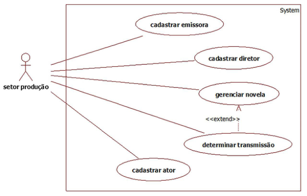

Figura 2 – Exemplo de diagrama de casos de uso. 

A partir dos casos de uso, podemos identificar as classes de análise que representam os objetos do negócio ou do domínio do problema. A Figura 3 ilustra um diagrama de classes da UML. 

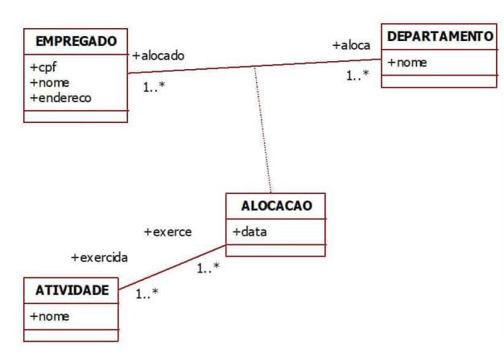

Figura 3 – Exemplo de diagrama de classes. 

Na modelagem de análise, podemos considerar a construção do modelo de atividades e do modelo de estados. O modelo de atividades, ilustrado na Figura 4, possui diagramas que podem ser utilizados no mapeamento de processos de negócios, na descrição gráfica de um caso de uso ou na definição do algoritmo de um método. O modelo de estados permite representar mudanças de estados significativas e respectivos eventos que causam a referida mudança. 

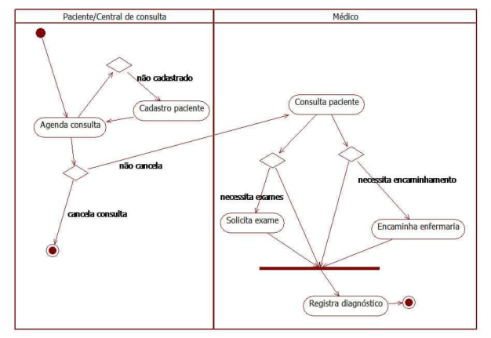

Figura 4 – Exemplo de diagrama de atividades. 

Agora, vejamos algumas etapas importantes no processo de engenharia! 

#### Negociação 

Nesta etapa, ocorre a priorização e a resolução de conflitos entre os requisitos definidos nas etapas anteriores. Todos os envolvidos, equipe de projeto e usuários, participam da avaliação de custos, riscos e conflitos, a fim de eliminar, combinar e/ou modificar os referidos requisitos e, logicamente, priorizá-los. 

#### Especificação 

O engenheiro de software deverá gerar um documento de especificação incluindo todos os requisitos e modelos gerados nas etapas anteriores. 

#### Validação 

A validação permite ao engenheiro de software evidenciar que os modelos refletem as necessidades dos usuários com relação ao sistema a ser desenvolvido. Um defeito não considerado gera a construção de um sistema que não corresponderá às expectativas do usuário. 

#### Gestão 

Finalizando o processo da engenharia de requisitos, a etapa de gestão permite controlar as mudanças dos requisitos à medida que o projeto evolui. 

Podemos destacar que o engenheiro de software deverá considerar que o gerenciamento do escopo do projeto inclui um documento denominado matriz de rastreabilidade dos requisitos, sendo essa uma tabela que liga os requisitos dos produtos desde as suas origens até as entregas que lhes satisfazem. A manutenção desse documento permite monitorar a estabilidade dos requisitos. 

#### Resumindo 

Neste módulo, podemos destacar a relevância da Engenharia de Requisitos no contexto do processo de desenvolvimento de software. Importante lembrar que a Engenharia de Requisitos inclui as etapas de levantamento de requisitos e análise do referido processo. Os requisitos são comumente categorizados em requisitos funcionais, não funcionais e de domínio. Os requisitos funcionais estão associados aos serviços ou às funcionalidades disponibilizadas pelo sistema. Os requisitos não funcionais estão relacionados com as restrições operacionais, tais como linguagem de programação, padrão de arquitetura etc., além de requisitos de qualidade, e.g., manutenibilidade, usabilidade e outros. Os requisitos de domínio detalham as regras de negócio identificadas no domínio do problema. A Engenharia de Requisitos inclui um processo com tarefas que, de forma simplificada, permitem a identificação dos requisitos, a geração de modelos de análise, a validação dos requisitos por parte dos usuários e a gestão dos requisitos, possibilitando a rastreabilidade durante as etapas seguintes do projeto de software. 

Agora, é com você! Vamos verificar se atingimos o objetivo deste módulo? Você está convidado a realizar as atividades a seguir. 

## Verificando o aprendizado 

##### Questão 1 

(UFG - 2010 - UFG - Analista de TI - Desenvolvimento de Sistemas) Requisitos não funcionais são restrições aos serviços de um sistema de software e ao processo de desenvolvimento do sistema. A equipe de desenvolvimento de um sistema de controle de tráfego aéreo deve considerar os requisitos não funcionais de: 

A 

Cadastro e monitoramento de aeronaves. 

B 

Alta disponibilidade e baixo tempo de resposta de usuário por evento. 

##### C 

Uso conjunto de método ágil de sistemas e linguagem de programação orientada a objetos. 

##### D 

Alto desempenho e baixo tempo médio entre falhas. 

A alternativa B está correta. 

Quando ocorre uma falha no software, o requisito não funcional de disponibilidade contabiliza o tempo disponível para uso e o tempo necessário para a solução de um problema, de modo que alta disponibilidade significa que o sistema está em condições de uso a maior parte do tempo. O requisito não funcional tempo de resposta especifica o tempo que o sistema responderá à determinada solicitação de serviço. Ambos os requisitos são fundamentais para um sistema de controle de tráfego aéreo. 

Questão 2 

(FCC - 2019 - SEMEF Manaus - AM - Técnico de Tecnologia da Informação da Fazenda Municipal) Considerando a análise de requisitos, as informações de rastreabilidade desempenham um papel de grande importância. Assim, a equipe responsável da Fazenda Municipal deve estar ciente de que a rastreabilidade de projeto significa: 

A 

Listar os compiladores utilizados no desenvolvimento de cada módulo de software. 

B 

Determinar o mapeamento entre os requisitos de projeto e os locais onde o sistema será utilizado. 

C 

Determinar o desempenho de cada um dos requisitos do sistema. 

D 

Possuir o mapeamento entre os requisitos e os módulos de projeto que implementam os requisitos. 

A alternativa D está correta. 

A rastreabilidade, iniciada com o levantamento de requisitos, permite gerenciar volatilidade dos requisitos durante o processo de desenvolvimento de software. 

2. Engenharia de Requisitos e o desenvolvimento de software - projeto 

## Projeto de software 

Podemos observar que os principais modelos da etapa de análise do processo de desenvolvimento de software são: o modelo de casos de uso, o modelo de classes de análise, o modelo de atividades e o modelo de estados. 

#### Atenção 

Muitos autores e profissionais de Engenharia de Software preferem usar o termo original do inglês design no lugar de projeto, para não confundir com o homógrafo projeto, no sentido de project, cujo significado é diferente de design. Neste texto, o termo projeto é usado indistintamente no sentido de project ou de design, dependendo do contexto. 

Você acha possível implementar um software com os referidos modelos? Provavelmente, faltam mais detalhes. Vamos, agora, tratar desses detalhes. 

O conceito de abstração é fundamental no processo de desenvolvimento de software, pois ele é iniciado com especificações e modelos com alto nível de abstração. 

A etapa projeto de software diminui o nível de abstração dos diagramas de análise por meio de refinamentos sucessivos, como também exige a criação de novos modelos. 

As principais atividades realizadas na fase de projeto serão descritas a seguir. 

## Refinamento dos aspectos estáticos e estruturais do sistema 

O modelo de classes representa os aspectos estáticos e estruturais do sistema. A partir do modelo de classes gerado na análise, vamos inserir novos elementos que permitirão a implementação das classes, ou seja, aplicaremos refinamentos que possibilitam reduzir o grau de abstração. A Figura 5 exemplifica as abstrações possíveis de uma classe durante o processo de desenvolvimento de software. Ao final, temos uma especificação de classe em condições de ser codificada. 

Exemplo 

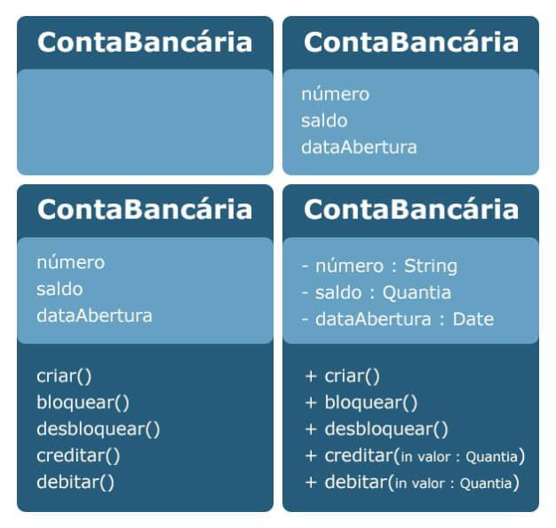

Figura 5 - Exemplo de refinamentos em uma classe. 

Vamos analisar os refinamentos: a primeira estrutura indica uma classe e o respectivo nome; a segunda inclui os atributos; a terceira adiciona os métodos ou funções das classes, e a quarta detalha os atributos e métodos. Na análise, não é importante definirmos os tipos de dados, sendo fundamental no projeto, pois a especificação de projeto tem de garantir a implementação, ou seja, a codificação da classe. 

Além desse refinamento, novos elementos são inseridos em função das associações entre as classes, das heranças existentes, ou mesmo em virtude da criação de novas classes. 

Um aspecto importante é a possibilidade de aplicação de padrões de projeto, ou design patterns, no modelo de classes de projeto. Esses padrões representam templates de melhores práticas para a solução de determinados problemas comuns, que serão resolvidos mais facilmente quando implementados pelo programador. A Figura 6 exemplifica o padrão Factory Method. 

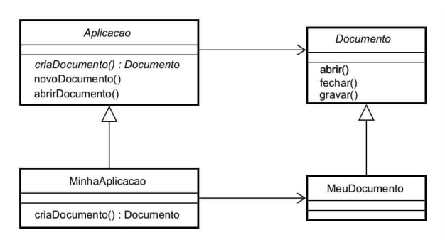

Figura 6 - Exemplo do padrão Factory Method. 

## Detalhamento dos aspectos dinâmicos do sistema 

O que seriam aspectos dinâmicos? Lembre-se: o paradigma dominante na indústria de software é a orientação a objetos, que, de forma simplificada, é a representação do mundo real por meio de objetos que se comunicam por meio de mensagens. 

A referida comunicação representa a dinâmica existente entre os objetos e, para a sua representação, temos o modelo de interação, que inclui dois diagramas: diagrama de comunicação e diagrama de sequência. Ambos os diagramas têm a mesma abstração dinâmica com representações distintas e recíprocas. 

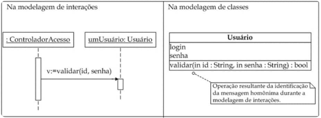

Figura 7 - Diagrama sequência versus classes de projeto. 

## Qual a relação existente entre o modelo de classes e o modelo de interação? 

O modelo de interação é desenvolvido usualmente em paralelo com o modelo de classes de projetos, de modo que os métodos implementados nas classes são identificados a partir das mensagens definidas no modelo de interação. A Figura 7 exemplifica, à esquerda, parte de um diagrama de sequência, onde a mensagem “validar” estabelece uma comunicação entre os objetos “controlador acesso” e “usuário”, sendo a mensagem implementada no objeto receptor “usuário”, ou seja, a classe “usuário” inclui o método “validar” com os respectivos parâmetros. 

## Detalhamento da arquitetura do sistema 

Uma atividade que aplicamos de forma intensa na Engenharia de Software é a fatoração, ou seja, a decomposição da solução do problema em partes menores, facilitando principalmente o trato da complexidade. 

Imaginemos um sistema de software complexo; intuitivamente, temos de realizar a decomposição em subsistemas. O processo do projeto que permite identificar os referidos subsistemas, estabelecendo um framework para controle e comunicação entre eles, é denominado projeto de arquitetura. 

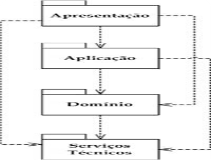

Figura 8 - Camadas de software. 

A arquitetura é definida por meio de duas abstrações: lógica e física. 

A Figura 8 ilustra uma divisão lógica comumente aplicada no projeto de arquitetura, sendo composta das seguintes camadas: apresentação, aplicação, domínio e serviços técnicos. 

Importante destacar que as camadas mais altas devem depender das camadas mais baixas – essa fatoração permite melhor trato da complexidade, ou seja, decomposição do sistema em partes menores. Outra vantagem é o reúso, pois as camadas inferiores são independentes das camadas superiores. A arquitetura em camadas permite baixo acoplamento, ou seja, mínimo de dependências entre os subsistemas, e alta coesão, isto é, deve haver mais associações entre as classes internamente do que externamente. 

A camada de apresentação da Figura 8 inclui as denominadas classes de fronteira, que permitem a instanciação dos objetos de fronteira que interagem com os usuários. 

A camada de aplicação inclui as classes de controle, que permitem a instanciação dos objetos de controle que atuam como intermediários entre os objetos da camada de apresentação e os objetos do domínio do problema. 

A camada de domínio é composta pelas classes de domínio oriundas do diagrama de classes, que permitem a instanciação dos objetos do domínio do problema – esses objetos podem conter métodos que alteram o próprio estado. 

Finalmente, a camada de serviços técnicos pode incluir serviços genéricos, cabendo destaque à camada de persistência de dados. 

Assim como existem padrões de projeto aplicados ao projeto de classes (Figura 6), temos também padrões aplicados à arquitetura. Como exemplo, podemos destacar o padrão de arquitetura em camadas denominado MVC (Model-View-Controller), formulado na década de 1970 e focado no reúso de código e na separação de conceitos em três camadas interconectadas, tal como ilustra a Figura 9. 

O controlador (controller) tem funcionalidade para atualizar o estado do modelo, como, por exemplo, uma nota fiscal, ou alterar a apresentação da visão do modelo. 

Um modelo (model) mantém os dados, notificando visões e controladores quando da ocorrência de mudança em seu estado. 

A visão (view) permite a exibição dos dados. 

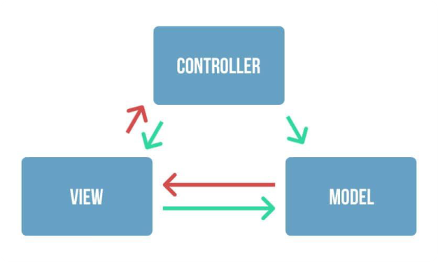

Figura 9 - Arquitetura MVC. 

Após a definição lógica da arquitetura, o engenheiro de software precisará definir a arquitetura física por meio do modelo de implantação, que projeta a infraestrutura de hardware necessária para o software projetado. 

## Você poderia questionar: “O engenheiro de software especifica hardware?”. 

Nesse caso, não, mas o projeto tem de definir os nós computacionais necessários para a implantação do software, devendo a especificação do hardware ficar por conta da equipe de infraestrutura. A Figura 10 exemplifica um diagrama de implantação com quatro nós computacionais e as respectivas conexões. 

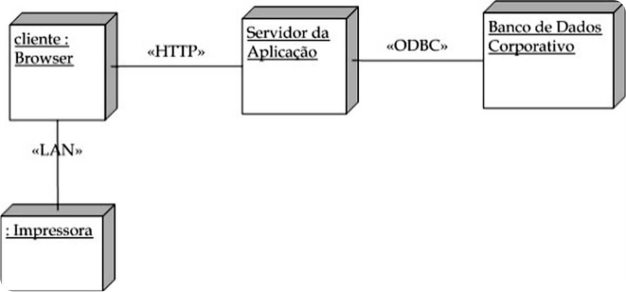

Figura 10 - Diagrama de implantação. 

## Você lembra qual a composição das camadas apresentadas? 

Cada camada é composta por um conjunto de classes, formando componentes diversos. Os componentes podem ser compostos por uma ou mais classes que encapsulam funcionalidades de forma independente – um conjunto de componentes pode compor um sistema complexo. A forma de representar essa “componentização” do software é definida no modelo de implementação. A Figura 11 ilustra o diagrama de componentes embutido no diagrama de implantação da Figura 10, de modo que podemos verificar a alocação por nó computacional dos referidos componentes. 

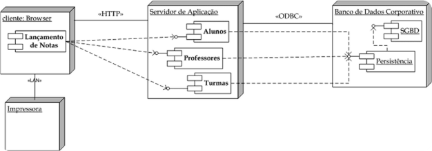

Figura 11 - Diagrama de componentes embutido. 

### Arquitetura de sistemas de software 

Neste vídeo, você conhecerá um pouco sobre a arquitetura de sistemas de software. 

Conteúdo interativo 

Acesse a versão digital para assistir ao vídeo. 

## Mapeamento objeto-relacional 

O padrão da indústria de software atualmente é o paradigma orientado a objetos, que podem assumir estruturas de dados com elevado grau de complexidade, sendo que a maioria deles, em algum momento, necessita de persistência. 

Por outro lado, o padrão das tecnologias de banco de dados ainda é o modelo relacional, ou seja, temos uma estrutura de armazenamento bidimensional denominada tabela. 

## O que fazer para integrar os dois padrões? 

Vamos utilizar o diagrama de classes como modelo conceitual do banco de dados e, a partir de então, gerar o modelo lógico de banco de dados, criando as tabelas necessárias às persistências exigidas pelos objetos. Esse processo é denominado mapeamento objeto-relacional. A Figura 12 ilustra um exemplo de associação muitos-para-muitos em um diagrama de classes, cujo mapeamento gera as três tabelas descritas. 

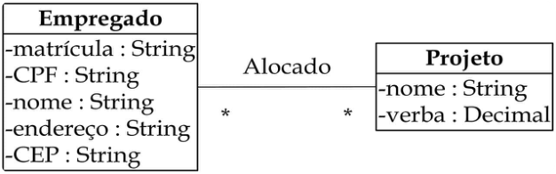

Figura 12 - Exemplo de associação muitos-para-muitos. 

Agora, confira o resultado do mapeamento muitos-para muitos: 

plain-text 

1    Empregado(id, matrícula, CPF, nome, endereço, CEP, idDepartamento) 

- 2    Alocação(id, idProjeto, idEmpregado) 

3    Projeto (id, nome, verba) 

### Realização do projeto da interface gráfica com o usuário 

O diagrama de casos de uso define as funcionalidades do sistema, sendo que cada caso de uso representa uma interação completa entre o sistema e um agente externo denominado ator. Nessa interação, precisamos definir uma interface como meio de comunicação homem-máquina. Nesse ponto, o requisito-chave não funcional é usabilidade, portanto é fundamental a participação do usuário no processo de definição das interfaces, ou seja, “deixe o usuário no comando”. 

Vamos apresentar possíveis questões relativas à interface que podem surgir: tempo de resposta – em um sistema de venda online com alto tempo de resposta, talvez ocorra uma desistência e uma ida para o concorrente; recursos de ajuda, disponíveis sem que haja necessidade de abandonar a interface; tratamento de erros, por meio de uma linguagem inteligível para o usuário; acessibilidade da aplicação, com foco no atendimento aos usuários com necessidades especiais. 

#### Resumindo 

Neste módulo, pudemos avaliar a importância da etapa de projeto no processo de desenvolvimento de software. Cabe ao engenheiro de software implementar as seguintes atividades que genericamente compõem a etapa de projeto: Refinamento dos aspectos estáticos e estruturais do sistema.Detalhamento dos aspectos dinâmicos do sistema.Detalhamento da arquitetura do sistema.Mapeamento objeto-relacional.Realização do projeto da interface gráfica com o usuário. Ao final desta etapa, podemos iniciar a implementação do software de acordo com as especificações contidas nos modelos de projeto gerados. 

## Verificando o aprendizado 

##### Questão 1 

Sobre as camadas do modelo de arquitetura MVC (Model - View-Controller) usado no desenvolvimento web, é correto afirmar: 

A 

Todos os dados e a lógica do negócio para processá-los devem ser representados na camada controller. 

##### B 

A camada model pode interagir com a camada view para converter as ações do cliente em ações que são compreendidas e executadas na camada controller. 

##### C 

A camada view é a camada responsável por exibir os dados ao usuário. Em todos os casos, essa camada somente pode acessar a camada model por meio da camada controller. 

##### D 

A camada controller, geralmente, possui um componente controlador padrão, criado para atender a todas as requisições do cliente. 

A alternativa D está correta. 

O padrão de arquitetura de projeto MVC torna fácil a manutenção do software, permitindo a implantação modular de forma rápida, cabendo à camada view gerar um evento a partir de uma requisição do cliente. O referido evento é atendido por um controller. 

##### Questão 2 

O engenheiro de software está encerrando a etapa de análise e iniciando a etapa de projeto. Assinale a afirmativa que NÃO é uma atividade de projeto: 

##### A 

Aumentar o grau de abstração do modelo de classes. 

##### B 

Identificar os métodos das classes a partir de modelos dinâmicos. 

##### C 

Definir o modelo lógico de banco de dados. 

D 

Utilizar padrões de projeto no diagrama de classes. 

A alternativa A está correta. 

A etapa de projeto permite o refinamento de modelos de análise, tal como o modelo de classes, de forma a diminuir o nível de abstração. Exemplo: o modelo de classes é refinado aumentando o nível de detalhamento. 

3. Implementação e testes do processo de desenvolvimento de software 

## Implementação 

Quais são as entregas da etapa “projeto” do processo de desenvolvimento de software? Modelos, ou seja, diagramas e especificações textuais que permitem a implementação, ou codificação do software. Realizando um paralelo com a Engenharia Civil, temos plantas baixas, projeto estrutural, hidráulico-sanitário, elétrico etc.; agora, podemos ir para o terreno construir a casa. 

A etapa “implementação” do processo de desenvolvimento de software permite realizar a tradução dos modelos de projeto em código executável por meio do uso de uma ou mais linguagens de programação. 

Temos aqui um desafio! Ainda não conhecemos todos os detalhes dos algoritmos que efetivamente resolvem o problema; para solucioná-lo, entram em cena os programadores. 

Podemos destacar o impacto de muitos requisitos não funcionais nesta etapa, tais como linguagens de programação, frameworks de persistência, e.g., framework para o mapeamento objeto-relacional escrito na linguagem Java denominado hibernate, sistema de gerenciamento de banco de dados, requisitos de qualidade, e.g., confiabilidade, usabilidade etc., reutilização de componentes, entre outros. 

Nesse contexto, podemos descrever a denominada “Crise do software” sintetizada pela afirmativa de Edsger Dijkstra, em 1972: 

A maior causa da crise do software é que as máquinas tornaram-se várias ordens de magnitude mais potentes! Em termos diretos, enquanto não havia máquinas, programar não era um problema; quando tivemos computadores fracos, isso se tornou um problema pequeno, e, agora que temos computadores gigantescos, programar tornou-se um problema gigantesco. 

PRESSMAN, 2016. 

Importante destacar que o desenvolvimento tecnológico do hardware nos últimos anos permitiu o desenvolvimento de softwares cada vez mais complexos, tendo forte impacto na indústria de software. Como exemplo, podemos apresentar a substituição do paradigma estruturado pelo paradigma orientado a objetos, baseado na programação orientada a objetos, que permite o reúso intensivo de especificação, bem como melhor manutenibilidade e, como consequência, o desenvolvimento de softwares mais complexos. 

## Qualidade de software 

Um dos fatores que exerce influência negativa sobre um projeto é a complexidade, estando associada a uma característica bastante simples: o tamanho das especificações. Em programas de computador, o problema de complexidade é ainda mais grave, em razão das interações entre os diversos componentes do sistema. 

A discussão sobre problemas de software versus complexidade não estará completa sem abordar o assunto qualidade. De forma simplificada, a qualidade está em conformidade com os requisitos, tendo como objetivo satisfazer o cliente por meio da aplicação da Engenharia de Software, nosso contexto. 

A norma ISO 9126 identifica seis atributos fundamentais de qualidade para o software: 

## Funcionalidade 

Satisfação dos requisitos funcionais. 

## Confiabilidade 

Tempo de disponibilidade do software. 

## Usabilidade 

Facilidade de uso. 

## Eficiência 

Otimização dos recursos do sistema. 

## Facilidade de manutenção 

Realização de correção no software. 

## Portabilidade 

Adequação a diferentes ambientes. 

A qualidade possui duas dimensões fundamentais aplicáveis ao software: as dimensões da qualidade do processo e da qualidade do produto. 

Considerando que estamos descrevendo a etapa de implementação do processo de software, vamos apresentar considerações relativas à qualidade do produto software, ou seja, aos testes que garantem a qualidade do produto software. 

## Teste de software 

A qualidade do produto software pode ser garantida através de sistemáticas aplicações de testes nos vários estágios do desenvolvimento da aplicação. Esses testes permitem a validação da estrutura interna do software e sua aderência aos respectivos requisitos. A integração dos subsistemas também é avaliada, com destaque para as interfaces de comunicação existentes entre os referidos componentes de software. 

Podemos, então, definir teste como um processo sistemático e planejado que tem por finalidade única a identificação de erros. No caso de softwares complexos, sabe-se que o teste será capaz de descobrir a presença de erros, mas não a sua ausência! 

Softwares mal testados podem gerar prejuízos às empresas. Um defeito de projeto poderá encadear requisições de compras inadequadas, gerar resultados financeiros incorretos, entre outros. Até mesmo as tomadas de decisões gerenciais da empresa podem ser negativamente impactadas, pois muitos profissionais se apoiam nas informações com o objetivo de tornar a empresa mais eficiente. A qualidade das decisões está intimamente ligada à qualidade das informações disponibilizadas aos diversos níveis gerenciais. 

Os procedimentos de testes aplicados diretamente em softwares são também conhecidos como testes de software ou testes dinâmicos, podendo, em sua maioria, sofrer alto nível de automação, o que possibilita a criação de complexos ambientes de testes que simulam diversos cenários de utilização. 

#### Atenção 

Lembre-se: quanto mais cenários simulados, maior o nível de validação que obtemos do produto, caracterizando maior nível de qualidade do software desenvolvido. 

Os testes de software têm por objetivo avaliar a qualidade desse produto nas mais variadas dimensões possíveis, ou seja, em relação à sua estrutura interna, na aderência às regras de negócios estabelecidas, nos parâmetros de performance esperados pelo produto etc. 

Durante a codificação do software, podemos adotar a estratégia representada na Figura 14. Essa espiral é percorrida a partir do interior, aumentando o nível de abstração a cada volta. Vamos descrever como cada etapa dessa estratégia funciona. 

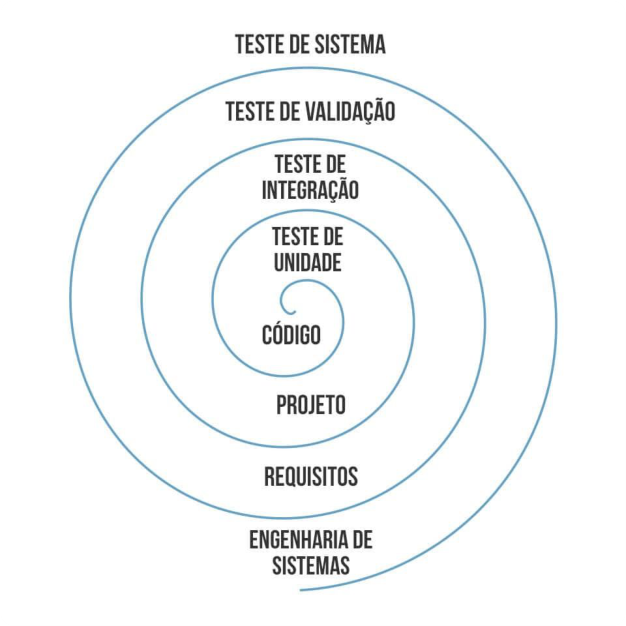

Figura 14 – Estratégia de Teste. 

### Tipos de teste de software 

Neste vídeo, você conhecerá um pouco sobre os tipos de teste de software. 

#### Conteúdo interativo 

Acesse a versão digital para assistir ao vídeo. 

## Teste de unidade 

A validação da unidade de software é a primeira etapa da estratégia, tendo por objetivo testar componentes individuais de uma aplicação. 

Nesta estratégia de testes, o objetivo é executar o software a fim de exercitar adequadamente toda a estrutura interna de um componente, como os desvios condicionais, os laços de processamento etc. 

## Teste de integração 

Objetiva a manutenção de compatibilidade das novas unidades construídas, ou modificadas, com os componentes previamente existentes. 

A compatibilidade de um componente é quebrada sempre que existe alteração ou exclusão de uma rotina ou propriedade pública de um componente. Quando isso ocorre, todos os outros componentes que empregam essas rotinas ou propriedades estão automaticamente incompatíveis com o componente modificado, gerando erros durante a execução do software. São exatamente esses erros que devem ser identificados nesse estágio dos testes de software. 

## Teste de validação 

Quando atingimos esse estágio dos testes, a maior parte das falhas de funcionalidade deve ter sido detectada nos testes unitários e nos testes de integração, sendo o objetivo desta etapa realizar a validação da solução como um todo. Os testes de validação contam com uma infraestrutura mais complexa de hardware, visando estar o mais próximo do ambiente real de produção. 

Nesta etapa, são realizados os testes funcionais, que visam verificar se a versão corrente do sistema permite executar processos ou casos de uso completos do ponto de vista do usuário, de modo a obter os resultados esperados; e os testes não funcionais, que visam testar o software em relação às características não funcionais, como desempenho, segurança, confidencialidade, recuperação a falhas etc. 

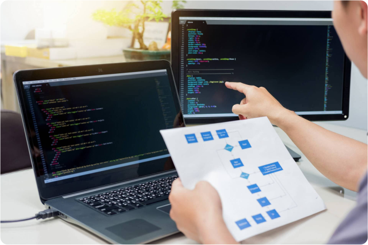

Devemos planejar os testes de software a partir dos cenários contidos nas descrições de casos de uso e identificados na etapa de análise do processo de software; normalmente, o engenheiro de software define os cenários com alto nível de abstração lógica, denominados também de casos de teste. Neste caso, o analista de teste da equipe de qualidade deverá diminuir o nível de abstração dos referidos cenários, detalhando os mesmos por meio dos casos de testes. Como exemplo, um caso de uso “Realizar saque de conta”, onde podemos imaginar um cenário em que o saldo supera o valor do saque e a transação ocorre sem problema, ou cenários alternativos ou de exceção, tais como bloqueio do saque por saldo insuficiente; liberação do saque utilizando o limite disponível pelo banco com cobrança de juros; liberação do saque com retirada de fundo de aplicação, entre outros. 

Nesta etapa, ocorrem os procedimentos de aceite, que deverão ser realizados a cada ciclo de implementação da solução, permitindo correções antecipadas de determinados pontos que não foram adequadamente atendidos pelo software. 

Como essa é a última oportunidade efetiva de detectar falhas no software, poderemos empregar o aceite como uma estratégia para reduzir riscos de uma implantação onde um erro vital não detectado pode comprometer a imagem da solução como um todo. Dessa forma, podemos dividir o aceite em três momentos distintos: o Teste Alpha, o Teste Beta e o Aceite Formal. 

#### Aceite Teste Alpha 

Os usuários finais são convidados a operar o software dentro de um ambiente controlado, sendo realizado na instalação do desenvolvedor. 

#### Aceite Teste Beta 

Os usuários finais são convidados a operar o produto utilizando suas próprias instalações físicas, ou seja, o software é testado em um ambiente não controlado pelo desenvolvedor. 

#### Aceite Formal 

Trata-se de uma variação do Teste Beta, cabendo aos próprios clientes e usuários determinarem o que deverá ser testado e validar se os requisitos foram adequadamente implementados. A validação tem sucesso quando o software atende os requisitos, ou seja, funciona da forma esperada pelo usuário. 

## Teste de sistema 

A última etapa na espiral, apresentada na Figura 14, é o teste de sistema, que extrapola os limites da engenharia de software, ou seja, considera o contexto mais amplo da engenharia de sistemas de computadores. Após ser validado, o software deve ser combinado com outros elementos do sistema, tais como hardware, base de dados etc. 

Vejamos alguns testes sugeridos nesta etapa. 

#### Teste de recuperação 

Este teste tem por objetivo avaliar o comportamento do software após a ocorrência de um erro ou de determinadas condições anormais. 

Os testes de recuperação devem também contemplar os procedimentos de recuperação do estado inicial da transação interrompida, impedindo que determinados processamentos sejam realizados pela metade e sejam futuramente interpretados como completos. Como exemplo, simular saque com defeito no caixa eletrônico ou simular saque com queda de energia. 

#### Teste de segurança 

Teste cujo objetivo é detectar as falhas de segurança que podem comprometer o sigilo e a fidelidade das informações, bem como provocar perdas de dados ou interrupções de processamento. Esses ataques à segurança do software podem ter origens internas ou externas. 

A ideia é avaliar o nível de segurança que toda a infraestrutura oferece, simulando situações que provocam a quebra de protocolos de segurança. Como exemplo, avaliar se a senha do cartão está sendo requisitada antes e depois da transação ou avaliar se a senha adicional e randômica está sendo requisitada no início da operação. 

#### Teste por esforço 

Teste com o objetivo de simular condições atípicas de utilização do software, provocando aumentos e reduções sucessivas de transações que superem os volumes máximos previstos para o software, gerando contínuas situações de pico e avaliando como o software e toda a infraestrutura estão se comportando. Como exemplo, simular 10.000 saques simultâneos. 

#### Teste de desempenho 

Teste cujo objetivo é determinar se o desempenho, nas situações previstas de pico máximo de acesso e concorrência, está consistente com os requisitos definidos. Devemos especificar os tempos de resposta considerados factíveis à realização de cada cenário. Como exemplo, garantir que manipulação com dispositivos físicos no saque não ultrapassem 10 segundos da operação. 

#### Teste de disponibilização 

Também chamado de teste de configuração, tem por objetivo executar o software sobre diversas configurações de softwares e hardwares. A ideia é garantir que a solução tecnológica seja executada adequadamente sobre os mais variados ambientes de produção previstos nas fases de levantamento dos requisitos. 

O referido teste também examina todos os procedimentos de instalação e instaladores a serem utilizados pelos clientes, bem como a documentação que será usada pelos usuários finais. Como exemplo, simular saque com impressora dos fornecedores X, Y e Z. 

#### Resumindo 

Neste módulo, pudemos avaliar a importância das etapas de implementação e testes do processo de desenvolvimento de software. À medida que o programador codifica a solução a partir dos modelos gerados na etapa de projeto, os testes são aplicados por meio de uma estratégia de testes em forma de espiral, incluindo quatro categorias de testes. Inicialmente, o teste unitário permite validar a estrutura interna de cada componente de software. O teste de integração possibilita validar a integração de novos componentes, ou componentes que passaram por manutenção, com os componentes previamente validados. O teste de validação inclui a realização de testes de alto nível realizados pelos usuários finais do sistema, inicialmente em ambientes controlados pelo desenvolvedor e, posteriormente, em ambientes de produção não controlados pelo desenvolvedor, a fim de que ocorra a verificação do atendimento aos requisitos. Ao final, podemos ter a aceitação do sistema pelo usuário. Finalizando, o teste de sistema, que extrapola os limites da Engenharia de Software, permite combinar o software com outros elementos do sistema, tais como hardware, base de dados etc. 

Agora, é com você! Vamos verificar se atingimos o objetivo deste módulo? Você está convidado a realizar as atividades a seguir. 

## Verificando o aprendizado 

Questão 1 

(Secretaria da Fazenda do Estado da Bahia - Auditor Fiscal - Tecnologia da Informação - FCC - 2019) Suponha que uma auditora fiscal da área de TI atue na etapa de testes e avaliação da qualidade de um software em desenvolvimento. Como o software sofria alterações a cada nova funcionalidade a ele incorporada, a auditora propôs que a equipe de testes adotasse como padrão um tipo de teste que garantisse que as mudanças recentes no código deixassem o resto do código intacto, visando impedir a introdução de erros. A equipe decidiu realizar um tipo de teste para avaliar a parte modificada e as áreas adjacentes que podem ter sido afetadas, dentro de uma abordagem baseada em risco. Assim, os testadores destacariam as áreas de aplicação que poderiam ser afetadas pelas recentes alterações de código e selecionariam os casos de testes relevantes para o conjunto de testes. Procedendo desta forma, seriam realizados testes: 

A 

De revisão de funcionalidade. 

B 

Gama. 

C 

De aceite operacional. 

D 

De regressão. 

A alternativa D está correta. 

Teste de regressão permite a reexecução de um subconjunto de testes previamente executados, assegurando que as alterações ou inserções de novas funcionalidades não impactaram outras partes do software. 

Questão 2 

Uma equipe de desenvolvedores do software está na fase final dos testes em ambiente controlado e decidiu iniciar os testes de recuperação e segurança imediatamente. Assinale a opção correta relativa ao início dos referidos testes: 

A 

A equipe está realizando incorretamente os testes de sistema antes de realizar, por completo, os testes de validação. 

##### B 

A equipe está desenvolvendo corretamente os últimos testes antes de disponibilizar o software aos usuários finais. 

C 

A equipe deveria estar iniciando os testes de integração. 

D 

A equipe deveria estar iniciando os testes de validação do tipo Aceite Formal. 

A alternativa A está correta. 

Os testes de validação do tipo Aceite Alpha ocorrem em ambiente controlado; na sequência, são realizados os testes de Aceite Beta e Formal, encerrando os testes de validação. Após esses testes, são realizados os testes de sistema, que incluem, entre outros, os testes de recuperação e segurança. 

4. Implantação e manutenção do desenvolvimento de software 

## Implantação 

Considerando as etapas do processo de desenvolvimento de software apresentadas, o que temos até o momento? 

O produto software testado em condições de migrar para o ambiente denominado “produção”, ou seja, mundo real, onde os usuários irão utilizá-lo nas suas rotinas diárias, seja na realização de um controle administrativo, seja no contexto de um processo de tomada de decisão. 

A implantação é a etapa do processo de desenvolvimento de software relacionada à transferência do sistema da comunidade de desenvolvimento para a comunidade de usuários, ou seja, o sistema entra em produção no ambiente real. 

O objetivo da implantação é produzir com sucesso a entrega do software para seus usuários finais, podendo cobrir vasta gama de atividades, como descritas a seguir: 

#### A produção de releases externos do software 

Inclui o lançamento de uma nova versão do software, ou resultado de uma manutenção no mesmo, sendo exigidas decisões, por parte de desenvolvedores e usuários, sobre como realizar a distribuição do produto. 

#### A embalagem do software 

Quando o software será comercializado por meio de determinada mídia, como, por exemplo, DVD. 

#### Distribuição do software 

É o processo de entrega de software para o usuário final, podendo ocorrer de forma manual, sem auxílio de ferramentas, ou automática, com auxílio de ferramentas. 

#### Instalação do software 

É um processo que inclui a instalação de todos os arquivos necessários à execução do software projetado. 

#### Prestação de ajuda e assistência aos usuários 

Quando a complexidade do software exige um serviço de atendimento aos clientes que procuram esclarecimentos sobre dúvidas relacionadas às funcionalidades ou sobre problemas técnicos relacionados ao software, e.g., serviço de help desk. 

## Gestão de configurações versus Implantação 

Vamos imaginar que estamos desenvolvendo um software utilizando o fluxo de processo iterativo e incremental, ou evolucionário, sendo esse fluxo comumente adotado atualmente. Após os testes, geramos a primeira versão e a disponibilizamos no ambiente de produção. Neste ponto, realizamos a implantação dessa versão. 

O que faz a equipe desenvolvedora? Inicia o desenvolvimento da segunda versão, ou seja, mais um conjunto de requisitos é analisado em um novo ciclo iterativo. Em algum momento, soa um alerta dos usuários informando que “temos um defeito” no software em produção. 

## O que você faria como engenheiro de software? 

#### Cenário 1 

Cenário 2 

Terminar a versão 2 com o defeito corrigido e liberá-la para produção. 

Realizar a manutenção, eliminando o defeito na versão 1, liberá-la para produção e realizar a devida alteração na versão 2 em desenvolvimento. 

Tecnicamente, o cenário 2 é a melhor solução, pois o usuário teria de aguardar a liberação da versão 2, convivendo por um período com o impacto negativo do defeito do software no ambiente de produção. 

Neste pequeno estudo de caso, podemos destacar dois problemas para o engenheiro de software: o controle de alterações e o controle de versões. 

Nesta etapa, temos de considerar alguns aspectos que relacionam a gestão de configurações com a implantação de um sistema. 

Gestão de configuração, de forma simplificada, é um conjunto de tarefas que visam gerenciar as alterações durante o desenvolvimento do software, sendo essa gestão aplicada em todas as etapas do processo de desenvolvimento de software. Uma das tarefas do processo de gestão de configuração é denominada “controle de alterações”, permitindo solucionar o primeiro problema apresentado anteriormente. 

A Figura 15 ilustra um processo de controle de alterações, que, a partir de uma solicitação de alteração, requer a avaliação do mérito técnico, dos efeitos colaterais em potencial, do impacto global em termos de configuração e da funcionalidade e do custo da alteração. Na referida figura, o acrônimo ECO (Engineering Change Order) representa um pedido de alteração de engenharia. 

## Qual a importância deste processo para a etapa de implantação? 

O processo tem de estar bem definido e ajustado à complexidade do software quando implantado, pois os defeitos serão identificados em produção, e os procedimentos de alteração estarão definidos. 

Lembre-se de que, em projetos complexos, a falta de um controle de alterações pode gerar o caos. Afinal, sabe-se que a fase de testes não é capaz de zerar a existência de erros. 

Vamos, agora, ao segundo problema do nosso pequeno exemplo apresentado, ou seja, “controle de versões”. Neste caso, ainda no contexto do gerenciamento de configuração, podemos destacar o gerenciamento de releases. 

Um release de sistema é uma versão do mesmo distribuída aos clientes. A gestão de releases determina quando um release será liberado para o cliente, gerencia o processo de criação e de meios de distribuição, bem como documenta o release. 

Um release pode incluir: 

- Arquivos de configuração 

- 

- Arquivos de dados 

- 

- Um programa de instalação 

- 

- Documentação eletrônica ou em papel 

- 

- Empacotamento e publicidade associada 

- 

Agora, confira o processo de controle de alterações. 

Figura 15 – O processo de controle de alterações. 

### Processo de gerenciamento de riscos na etapa de planejamento 

Neste vídeo, você conhecerá um pouco sobre o processo de gerenciamento de riscos na etapa de planejamento. 

Conteúdo interativo 

Acesse a versão digital para assistir ao vídeo. 

## Manutenção 

Realizada a implantação do software com sucesso, iniciamos imediatamente a próxima etapa: a manutenção. 

A etapa mais longa do ciclo de vida do software, a manutenção inclui a correção de defeitos não identificados nas etapas anteriores do processo de desenvolvimento de software, no aprimoramento da implementação dos subsistemas e na disponibilização de novas funcionalidades a partir da identificação de novos requisitos. 

Pouco tempo depois de iniciada a etapa de manutenção, começam a chegar aos engenheiros de software os relatos de erros, bem como solicitações de adaptações e melhorias. Estas devem ser planejadas, programadas e executadas. Reiteramos aqui a importância do processo de gestão de alterações descrito anteriormente e ilustrado na Figura 15. 

Outro problema associado à manutenção é a mobilidade dos engenheiros de software, pois, com o passar do tempo, a equipe que trabalhou no desenvolvimento do software pode ter sido substituída ou mesmo dissolvida, ou seja, pode ocorrer a inexistência de um engenheiro de software que conheça o sistema. 

Neste ponto, podemos destacar a importância do correto cumprimento de todas as etapas do processo de desenvolvimento de software, de modo a gerar uma solução bem estruturada para o projeto, incluindo os diversos modelos que representam decisões tomadas ao longo do projeto, o que permite o entendimento da solução por parte de um engenheiro de software que não trabalhou no desenvolvimento do produto. 

Na verdade, toda solução que aplica as melhores práticas da engenharia de software busca o cumprimento do requisito não funcional denominado manutenibilidade, sendo esse um indicativo qualitativo da facilidade de corrigir, adaptar ou melhorar o software. 

Importante! Um dos grandes objetivos da engenharia de software é criar sistemas que apresentem alta manutenibilidade. 

## Manutenção versus Reengenharia de software 

Vamos considerar determinado produto de software implantado. Ao longo do tempo, a equipe de engenheiros de software realiza as manutenções necessárias em função de erros detectados ou de alterações geradas a partir da volatilidade dos requisitos. Paralelamente, a tecnologia vai se tornando obsoleta, e a manutenção, cada vez mais difícil. 

O que você faria? Que tal reconstruirmos o produto com mais funcionalidades, melhor desempenho, confiabilidade e manutenibilidade? Esse processo é denominado reengenharia. 

A reengenharia possui dois níveis: reengenharia de processos de negócio e reengenharia de software. 

No primeiro nível, também denominado estratégico, a reengenharia de processos de negócio visa – por meio de alterações em regras de negócio, ou seja, das tarefas que permitem a obtenção de um resultado de negócio – o aumento da eficiência e competitividade de uma empresa. 

Destacamos que um software tem como importante objetivo agregar valor a uma organização por meio da automação de processos; portanto, a referida alteração no negócio deve ser absorvida pela engenharia de software, gerando dois cenários: 

Cenário 1 Cenário 2 Que exige a construção de um novo software. Que permite a modificação de um software existente. 

No segundo cenário, aplicamos a reengenharia de software, o que extrapola os objetivos da etapa manutenção. 

#### Resumindo 

Neste módulo, destacamos a importância das etapas de implantação e manutenção do processo de desenvolvimento de software. A implantação inclui a migração do software de um ambiente de desenvolvimento para um ambiente de produção, permitindo a utilização do software pelos diversos usuários envolvidos. Após a etapa de implantação, temos a manutenção. A existência de erros descobertos em produção é um fato; para tal, a equipe de engenheiros de software terá de aplicar as tarefas definidas no processo de gerenciamento de alterações. Outro motivo comum de solicitação de manutenção ocorre em função da volatilidade dos requisitos. Com o tempo, as solicitações vão sendo intensificadas em função de alterações de regras de negócios ou pela obsolescência da tecnologia, podendo-se, neste caso, aplicar a reengenharia de software, o que extrapola a etapa de manutenção. 

Agora, é com você! Vamos verificar se atingimos o objetivo deste módulo? Você está convidado a realizar as atividades a seguir. 

## Verificando o aprendizado 

##### Questão 1 

O gerente de determinado projeto de software possui uma longa lista de requisitos funcionais e não funcionais, em função da sua complexidade. As equipes de programadores e de qualidade estão encerrando as etapas de implementação e testes, possibilitando a implantação do software. Qual processo tem de estar bem definido e ajustado à complexidade do software quando da execução da etapa implantação, em função dos defeitos que deverão ser identificados em produção? 

A 

Processo de reengenharia. 

B 

Processo de controle de alterações. 

C 

Processo de controle de releases. 

D 

Processo de software. 

A alternativa B está correta. 

Com certeza, ocorrerão erros em produção, gerando pedidos de manutenção do software. A definição prévia de um processo de controle de alterações permitirá a realização de manutenções sistemáticas e de forma planejada. 

Questão 2 

(CESGRANRIO - 2013 - BNDES - Profissional Básico - Análise de Sistemas – Desenvolvimento) De modo geral, o processo de desenvolvimento de um software pode ser organizado partindo de três fases importantes, que são as de definição, de desenvolvimento e de manutenção. Na fase de manutenção, dentre outras atividades, são: 

A 

Levantados os requisitos dos usuários para a programação das diversas fases do projeto, inclusive as operacionais e as preditivas. 

##### B 

Efetuados os testes de funcionalidade do software, revistos os objetivos para os quais ele foi desenvolvido e redefinidas as funções em desacordo com esses objetivos. 

##### C 

Incluídas novas funções requeridas pelo cliente e feitas adaptações por modificações de hardware. 

##### D 

Reavaliadas as bases operacionais, nas quais o software está sendo executado, e prototipados os novos requisitos de hardware. 

#### A alternativa C está correta. 

As alterações solicitadas durante a etapa de manutenção do software comumente incluem erros gerados em etapas anteriores do processo de desenvolvimento de software. Devido ao uso do software pelos 

usuários, poderão também surgir solicitações de novas funcionalidades, bem como problemas decorrentes de atualização de hardware. 

5. Conclusão 

## Considerações finais 

Apresentamos as etapas genéricas, ou típicas, de um processo de desenvolvimento de software, que são: levantamento de requisitos, análise, projeto, implementação, testes, implantação e manutenção. Lembramos que a Engenharia de Requisitos inclui as etapas de levantamento de requisitos e análise desse processo. 

O levantamento de requisitos tem como principal entrega o documento de requisitos, comumente categorizados em requisitos funcionais, não funcionais e de domínio, ou regras de negócio. Essa etapa define o contexto do projeto. 

Na análise, o engenheiro de software cria os modelos a partir dos requisitos. Como exemplos, destacamos os modelos de casos de uso, de classes e atividades. 

No projeto, ocorrem os refinamentos dos modelos de análise e a criação de novos modelos, que permitirão a implementação da solução. Como exemplo, podemos destacar os modelos de interação, implementação e implantação. 

Na etapa de implementação, ocorre a codificação da solução a partir dos modelos gerados na etapa de projeto. Na sequência, temos a etapa de testes, que permite a validação inicial de unidades de código, terminando na validação do sistema como um todo em ambiente próximo ao de produção. 

A etapa de implantação permite a migração para o ambiente de produção, onde estão os usuários finais do sistema. Em seguida, temos a etapa de manutenção, que visa o atendimento às solicitações de alterações no software em virtude de defeitos encontrados ou alterações decorrentes da volatilidade de alguns requisitos. 

#### Podcast 

Para encerrar, ouça sobre as Fases do Desenvolvimento de Software. 

#### Conteúdo interativo 

Acesse a versão digital para ouvir o áudio. 

### Explore+ 

- Leia o capítulo 2 de Princípios de Análise e Projeto de Sistemas com UML, de Eduardo Bezerra. 

- 

- Leia os capítulos 3, 7, 12 e 22 de Engenharia de Software, de Roger Pressman. 

- 

- Leia os capítulos 4, 6, 11 e 23 de Engenharia de Software, de Ian Sommerville. 

- 

### Referências 

BEZERRA, E. Princípios de Análise e Projeto de Sistemas com UML. 3. ed. Rio de Janeiro: Elsevier, 2014. 

DIJKSTRA, E. W. The Humble Programmer: Turing Award Lecture, Comm. ACM, v. 15, n. 10, p. 859-866, out. 1972. Consultado em meio eletrônico em: 18 ago. 2020. 

PRESSMAN, R. S.; MAXIM, B. R. Engenharia de Software. 8. ed. Porto Alegre: AMGH Editora, 2016. 

SOMMERVILLE, I. Engenharia de Software. 8. ed. São Paulo: Pearson Prentice Hall, 2007. 

