Modelos de processos de desenvolvimento de software 

Os modelos de Processos de Desenvolvimento de Software e seus fluxos de atividades. Prof. Alberto Tavares da Silva 

1. Itens iniciais 

## Propósito 

Compreender os principais modelos de processos de desenvolvimento de software (processo unificado, Extreme Programming, Scrum e processo unificado ágil), suas aplicações, etapas e atividades, conhecimentos indispensáveis ao engenheiro de software. 

## Objetivos 

- Descrever os modelos prescritivos de processo de desenvolvimento de software 

- 

- Explicar o Processo Unificado para o desenvolvimento de software 

- 

- Explicar o processo de desenvolvimento ágil Extreme Programming (XP) 

- 

- Explicar o processo de desenvolvimento ágil SCRUM e o Processo Unificado Ágil (AUP) 

- 

## Introdução 

O software apresenta um destaque cada vez maior na vida moderna. Uma tendência que ratifica essa importância está no uso intensivo dos smartphones. O sucesso dessa tecnologia, não descartando a relevância do hardware, tem um forte respaldo na competência do software, isto é, interfaces com designs atraentes, responsivas, usabilidade intuitiva, entre outras características. 

Por trás desta competência, temos vários especialistas, tais como: engenheiros de software, web designers, administradores de banco de dados, arquitetos de software e outros que trabalham arduamente para manutenção desse sucesso exponencial. Esta equipe tem uma composição multidisciplinar, refletindo uma característica do software: a complexidade. O trato dessa complexidade requer a aplicação da Engenharia de Software que, por sua vez, tem como base a camada de processos. Dito isso, podemos afirmar que não existe engenharia sem processo. 

Nesse contexto, é essencial conhecermos os principais modelos de processos de desenvolvimento de software, cuja escolha depende de forma significativa da sua complexidade, pois quanto mais complexo, mais formalismo deve estar embutido no modelo adotado. 

1. Modelos prescritivos de processo de desenvolvimento de software 

# Engenharia de software 

Os modelos de Processo de Desenvolvimento de Software têm este como principal produto no contexto da Engenharia de Software. 

Diferentemente de produtos de outras engenharias, o software possui alta volatilidade em função dos requisitos, visto que é constantemente impactado pelas evoluções na tecnologia, fatores estes que agregam a ele uma complexidade adicional. 

A melhor tratativa para a complexidade é a aplicação de metodologia que permita a decomposição do problema em outros menores e de forma sistemática, cabendo à Engenharia de Software tal sistematização. 

A Engenharia de Software é uma tecnologia em camadas, então vejamos as descrições de tais camadas: 

##### Camada de qualidade 

Garante o cumprimento dos requisitos que atendem às expectativas dos usuários. 

Camada de processo 

Determina as etapas de desenvolvimento do software. 

##### Camada de métodos 

Define, por exemplo, as técnicas de levantamento de requisitos, os artefatos gerados em função da técnica de modelagem adotada, tais como modelos de casos de uso ou de classes. 

##### Camada de ferramentas 

Estimula a utilização de ferramentas “CASE” (Computer-Aided Software Engineering) no desenho dos diversos artefatos ou mesmo na geração automática de código, entre outras aplicações. 

Vale destacar que a base da Engenharia de Software é a camada de processo. 

# Processo de desenvolvimento de software 

O processo de desenvolvimento de software é iniciado com especificações e modelos com alto nível de abstração e, à medida que o desenvolvimento de software se aproxima da codificação, o nível de abstração diminui, de modo que o código representa o nível mais baixo da abstração ou de maior detalhamento na especificação do software. 

As atividades típicas que compõem o processo de desenvolvimento de software, descritas por Pressman (2016), estão representadas na Figura 1. O objetivo é ilustrar as atividades mais comuns que compõem os 

processos de desenvolvimento de software, ou seja, as atividades genéricas incorporadas por qualquer processo, sendo uma notória diferença entre os modelos, a ênfase dada a cada atividade. 

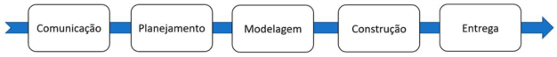

Figura 1 – Atividades Típicas de um Processo de Desenvolvimento de Software. 

Vamos agora descrever cada uma das atividades comumente previstas em um processo de desenvolvimento de software: 

# Comunicação 

As primeiras atividades de um processo de software requerem uma comunicação intensiva com os usuários, buscando o entendimento do problema, a definição de objetivos para o projeto, bem como a identificação de requisitos. 

# Planejamento 

Destaca-se, nesta atividade, a área de conhecimento e gerenciamento de projeto, que permitirá a elaboração de um Plano de Gerenciamento do Projeto de forma sistemática, tendo como entrega importante, o cronograma que inclui as atividades a serem desenvolvidas nesse projeto. 

# Modelagem 

A engenharia tem como melhor prática a geração de modelos, tal como a planta baixa de uma casa, e a maioria desses modelos gráficos, denominados de diagramas na Engenharia de Software, podendo ser complementados por descrições textuais, assim como o modelo de casos de uso. 

# Construção 

A partir dos modelos gerados, é realizada a construção ou implementação do software, portanto, os modelos determinam o comportamento deste. Essa atividade inclui a codificação e os testes de software de acordo com o planejado. 

# Entrega 

Ao final, ocorre o objetivo de um plano de projeto de software, i.e., a entrega do produto em produção de acordo com o planejado. 

# Modelos de processos prescritivos 

A Engenharia de Software permite sistematizar o desenvolvimento de software por meio de processos. Nesse sentido, um modelo de processo identifica as atividades que serão desenvolvidas, sendo comumente utilizadas as atividades ilustradas na figura anterior. 

Podemos, então, afirmar que um modelo de processo sistematiza o trabalho de engenharia de software, incluindo as atividades, fluxos de processos, artefatos gerados e outros, propiciando, também, estabilidade, controle e organização ao referido trabalho. 

O que diferencia os modelos de processos? Embora todas as atividades típicas sejam utilizadas em todos os modelos, cada representação enfatiza de forma diferente cada atividade, e o encadeamento dessas ações — talvez o mais importante — é denominado de fluxo de processo. 

O primeiro conjunto de modelos que abordaremos são os denominados modelos de processos prescritivos, por prescreverem metodologias, tarefas, artefatos, garantia da qualidade e mecanismos de controle de mudanças, ou seja, um conjunto de elementos de processo. 

## Modelo em cascata 

O modelo em cascata sugere uma abordagem sequencial, isto é, a execução das atividades ilustradas na Figura 1 de forma encadeada. Este é o modelo de processo mais antigo da engenharia de software e utilizado de forma intensa à época em que o paradigma de desenvolvimento estruturado era dominante na indústria de software. 

Podemos descrever algumas características negativas relativas a esse modelo, tais como: 

- Projetos reais raramente seguem um fluxo sequencial, em função da volatilidade dos requisitos. 

- 

- Assume que é possível ao cliente explicitar detalhadamente todas as suas necessidades em forma de requisitos, antes do início das demais fases do desenvolvimento, aumentando a possibilidade de propagação de erros pelas fases do processo. 

- Inflexibilidade na divisão do projeto em fases distintas, visto que uma versão do software somente estará disponível ao final do projeto. 

#### Dica 

Podemos aplicar o modelo em cascata em projetos com requisitos fixos e de forma que o fluxo de trabalho possa ser realizado sequencialmente até o seu encerramento. 

## Modelos de processo incremental e Modelos de processo evolucionário 

Ambos os modelos dividem o desenvolvimento de um produto de software em ciclos, e cada ciclo de desenvolvimento inclui todas as atividades contidas na figura anterior. 

Podemos observar na Figura 2 a repetição, a cada incremento e de forma iterativa, das atividades típicas de um processo de software. Cada iteração considera um subconjunto de requisitos, ocorrendo uma entrega a cada final de ciclo, isto é, a cada novo incremento um novo conjunto de funcionalidades é disponibilizado ao usuário final. 

O desenvolvimento atual do software comumente tem restrições de prazos e uma alta volatilidade dos requisitos, limitando a geração de um produto abrangente. Esse modelo permite a geração de uma versão limitada que imediatamente agrega valor ao usuário. 

### Qual é a diferença entre o modelo incremental e evolucionário? 

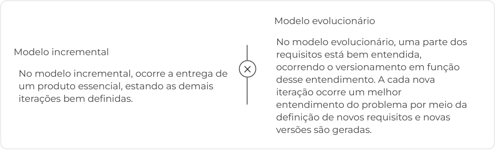

<!-- Start of picture text -->
Modelo evolucionário No modelo evolucionário, uma parte dos Modelo incremental requisitos está bem entendida, ocorrendo o versionamento em função No modelo incremental, ocorre a entrega de desse entendimento. A cada nova um produto essencial, estando as demais iteração ocorre um melhor iterações bem definidas. entendimento do problema por meio da definição de novos requisitos e novas versões são geradas. <!-- End of picture text -->

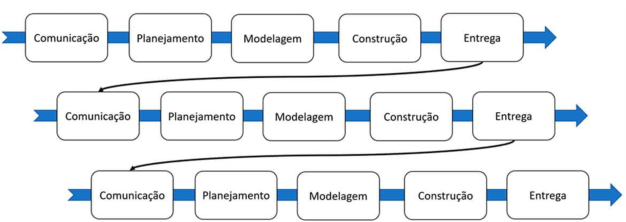

<!-- Start of picture text -->
Figura 2 – O modelo incremental. <!-- End of picture text -->

O modelo incremental de processo de desenvolvimento de software 

Veja, a seguir, as atividades típicas de desenvolvimento incremental que ocorrem em cada iteração do modelo: 

O modelo incremental de processo de desenvolvimento de software 

#### Conteúdo interativo 

Acesse a versão digital para assistir ao vídeo. 

## Prototipação 

Imagine a construção de uma grande barragem onde, em uma fase inicial, é construído um protótipo em escala reduzida para numericamente avaliar os esforços existentes. Depois dos testes, a maquete serve como peça de museu ou vai para um laboratório de uma universidade para estudos de caso. 

Você poderia questionar: como faço isso no software? A abstração é a mesma, porém o produto software tem suas peculiaridades. 

Vamos imaginar que um requisito não funcional determina que a replicação de dados ocorrerá por meio de uma tecnologia desconhecida da equipe de desenvolvimento. Seria razoável aguardar o momento do desenvolvimento para realizar a tratativa desse requisito? 

Na prototipação, o desenvolvedor interage diretamente com o usuário, escutando seus pedidos e desenvolvendo, imediatamente, um protótipo do produto desejado, isso de forma iterativa e evolucionária, como um “projeto rápido” apresentado a seguir. 

#### Saiba mais 

Podemos descartar esse software gerado? Depende, normalmente essa primeira versão do protótipo serve apenas para validar um requisito e necessita ser reconstruída, mas, considerando as peculiaridades do software, essa mesma versão pode ser refinada e integrada ao sistema em desenvolvimento. 

Atenção, a prototipação pode ser utilizada como modelo de processo na solução de problemas de baixa complexidade. 

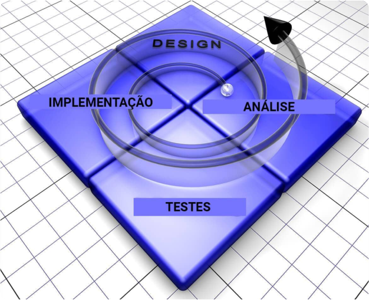

<!-- Start of picture text -->
Figura 3 – O paradigma prototipação <!-- End of picture text -->

## Modelo Espiral 

O Modelo Espiral foi originalmente proposto por Barry Boehm em 1988. De acordo com a Figura 4, cada quadrante da espiral corresponde a uma etapa do desenvolvimento e cada loop na espiral representa uma fase do processo de software. O loop mais interno pode estar relacionado com a viabilidade do sistema, o próximo, ao levantamento de requisitos e assim sucessivamente. 

#### Barry Boehm 

Barry W. Boehm é um engenheiro de software americano, professor de ciência da computação, engenharia industrial e de sistemas, além de diretor fundador do Center for Systems and Software Engineering the University of Southern California. Ele é conhecido por suas muitas contribuições para a área de engenharia de software, como o Modelo Espiral. 

##### Primeira etapa 

A primeira etapa (Analysis) inclui a determinação de objetivos, alternativas, riscos e restrições, em que ocorre o comprometimento dos envolvidos e o estabelecimento de uma estratégia para alcançar os objetivos. 

##### Segunda etapa 

Na segunda etapa (Evaluation), avaliação de alternativas, identificação e solução de riscos, executase uma análise de risco, sendo a prototipação uma boa ferramenta para tratar de ameaças. 

##### Terceira etapa 

Na terceira etapa (Development) ocorre o desenvolvimento do produto. 

##### Quarta etapa 

Na quarta etapa (Planning) o produto é avaliado, sendo realizado o planejamento para início de um novo ciclo. 

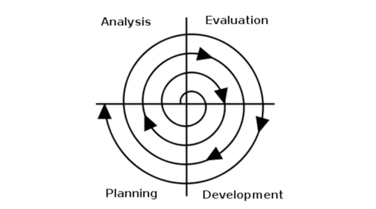

Figura 4 – O modelo espiral. Fonte: Wikimedia Commons 

Podemos fazer uso da abstração de forma a visualizarmos o modelo espiral como um metamodelo, tendo como exemplo o proposto por Pressman (2016), apresentado na Figura 5, na qual a espiral do modelo é dividida nas atividades genéricas ilustradas na Figura 1. 

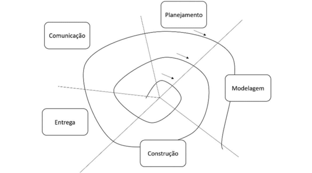

Figura 5 – O modelo espiral. 

# Resumindo 

Neste módulo, pudemos destacar a importância dos modelos dos processos prescritivos para a Engenharia de Software. Vale lembrar que a camada base dessa engenharia é a referente a processos. Os modelos de processos permitem definir as atividades que serão executadas durante o projeto de software, bem como o fluxo de processos que define o encadeamento relativo a essas mesmas atividades. 

Os modelos de processos prescritivos incluem a definição de metodologias, tarefas, artefatos, garantia da qualidade e mecanismos de controle de mudanças, isto é, um conjunto de elementos de processo. 

O modelo em cascata determina a realização das tarefas de forma sequencial. Já os modelos de processo incremental e os modelos de processo evolucionário permitem um versionamento do software de forma iterativa e incremental. 

O paradigma da prototipação é aplicado primariamente na validação de requisitos. O modelo espiral permite um desenvolvimento evolucionário do software. 

# Verificando o aprendizado 

Questão 1 

(FGV - 2010 - BADESC - Analista de Sistemas - Desenvolvimento de Sistemas) O Modelo Espiral, segundo Pressman (1995), incorpora as melhores características do Ciclo de Vida Clássico e da Prototipação e acrescenta o seguinte elemento: 

A 

Análise dos riscos. 

B 

Análise de projetos. 

C 

Avaliação de usuários. 

D 

Refinamento de requisitos. 

E 

Refinamento de protótipos. 

#### A alternativa A está correta. 

O modelo espiral é um modelo de processo de software evolucionário que une a natureza iterativa da prototipação aos aspectos sistemáticos e controlados do modelo cascata, enfatizando no segundo quadrante da espiral a análise de riscos. 

##### Questão 2 

Um gerente de projeto, junto à sua equipe de engenheiros de software, está definindo o modelo de processo de software a ser adotado em determinado projeto de software. Os requisitos do software são complexos e parcialmente identificados, o cliente impôs restrições de prazo para que o software agregue valor no seu negócio. Nesse contexto, qual o modelo de processo mais adequado? 

A 

Modelo de processo incremental. 

B 

Modelo de processo evolucionário. 

C 

Modelo espiral. 

D 

Modelo em cascata. 

E 

Modelo de processo iterativo. 

#### A alternativa B está correta. 

O modelo de processo evolucionário é o mais adequado em função da complexidade dos requisitos, estando eles parcialmente identificados. Esse modelo permite que os requisitos parcialmente identificados sejam considerados em um primeiro incremento, permitindo um melhor entendimento do domínio do problema e a identificação de novos requisitos para incrementos posteriores. O modelo possibilita, também, a disponibilização de versões de software agregando valor ao negócio do cliente. 

2. Processo Unificado para o desenvolvimento de software 

# Unified Modeling Language (UML) 

A compreensão do Processo Unificado exige que tenhamos o entendimento da Unified Modeling Language, comumente denominada de UML, que é uma linguagem de modelagem padrão para a elaboração de artefatos no contexto do paradigma de desenvolvimento orientado a objetos. 

#### Saiba mais 

Até meados da década de 1990, o paradigma de desenvolvimento estruturado era o padrão mais utilizado na indústria de software, ou seja, os métodos vigentes aplicavam os conceitos estruturados nos artefatos gerados, tal como o diagrama de fluxo de dados na etapa de análise. Importante destacar que a unidade básica do software era a função. 

Considerando a evolução da complexidade do software, alguns metodologistas perceberam que os conceitos da orientação a objetos permitiam um melhor trato da complexidade, particularmente nos requisitos reuso e manutenibilidade. Esses metodologistas começaram a propor métodos com artefatos direcionados ao referido paradigma. A unidade básica do software passou a ser o objeto, que inclui dados ou atributos, e funções ou métodos, encapsulados. 

Em algum momento, percebeu-se a necessidade de um padrão para a modelagem de sistemas que fosse aceito e utilizado amplamente, surgindo a UML em 1996 como a linguagem “unificadora” das diversas propostas de métodos orientados a objetos. Em 1997, a UML foi aprovada pelo Object Management Group (OMG), tornando-se um padrão de modelagem orientada a objeto na indústria do software. 

A UML é uma linguagem visual, independente de linguagem de programação e de processo de desenvolvimento. Um processo de desenvolvimento que utilize a UML como linguagem de modelagem envolve a criação de artefatos de software gráficos, denominados de diagramas, que podem ser complementados por descrições textuais. 

### Por que é definida como linguagem? 

Uma linguagem serve para a comunicação, possuindo uma sintaxe e uma semântica associada. A sintaxe determina o padrão de escrita, tal como, a estrutura de uma frase formada por “sujeito + verbo + predicado” e a semântica está associada ao significado da frase, tal como, “Carlos foi ao clube”. Fazendo uma analogia com a UML, a Figura 6 ilustra a estrutura de uma classe, cujo padrão inclui o nome da classe, atributos e métodos, ou seja, esse padrão de desenho, ou sintaxe do modelo, é definido pela UML. 

|Nome da Classe|
|---|
|+ atributoPublico: tipo # atributoProtegido: tipo - atributoPrivado: tipo|
|+ operacao(argumento): tipoRetorno|

E a semântica? 

A partir do momento que construímos um diagrama com um conjunto de classes, assim como ilustrado na Figura 7, temos então a formação de uma rede semântica, na qual os objetos e associações representam uma abstração da estrutura estática de certo domínio do problema. 

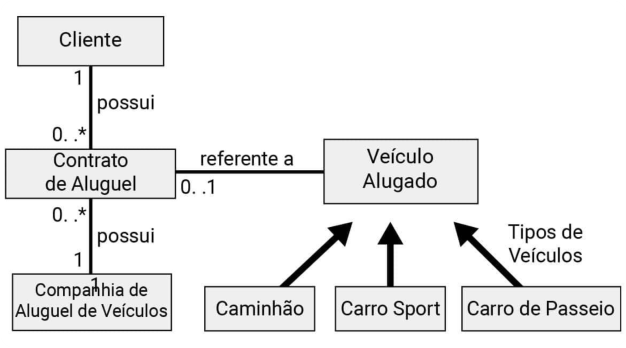

Figura 7 – Exemplo de Diagrama de Classes 

### E a comunicação? 

Como já afirmado, uma linguagem serve para comunicação. No caso do desenvolvimento de software, um modelo permite a comunicação entre engenheiros de software, entre estes e os usuários para validação dos referidos modelos, entre estes e os gerentes de projeto ou programadores; enfim, caso você, como engenheiro de software, desenhe um diagrama de classes, a semântica será compreendida por qualquer outro engenheiro de software que faça uso do paradigma orientado a objetos. 

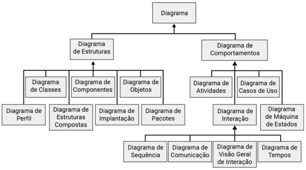

<!-- Start of picture text -->
Figura 8 – Diagramas da UML <!-- End of picture text -->

A Figura 8 ilustra os diagramas especificados na UML, com destaque para as duas categorias: diagramas comportamentais e diagramas estruturais. Os diagramas comportamentais têm ênfase na abstração funcional do projeto de software e os diagramas estruturais, nas abstrações das estruturas de dados e de componentes. 

# Processo unificado 

O Processo Unificado, também denominado de Rational Unified Process (RUP), é um processo de desenvolvimento de software criado pela Rational Software Corporation, empresa fundada pelos criadores da UML, posteriormente adquirida pela IBM. 

O RUP é considerado um processo formal que permite ser utilizado na solução de problemas com alta complexidade, entretanto, pode ser customizado para projetos de qualquer escala. 

O RUP possui três princípios: 

# Guiado por casos de uso 

O planejamento do desenvolvimento é feito em função dos casos de uso, de modo que o processo é iniciado pela abstração funcional, ou seja, pelos serviços desejados pelos usuários. 

# Centrado em arquitetura 

O RUP enfatiza o papel da arquitetura permitindo ao arquiteto de software manter o foco nas metas corretas, tais como, compreensibilidade, confiança em mudanças futuras e reutilização. 

A arquitetura deve permitir a realização dos requisitos, abrangendo um conjunto de decisões estruturais e comportamentais, alinhado às duas categorias de diagramas ilustradas na Figura 8, com destaque para a modularização da solução. 

# Iterativo e incremental 

O RUP aplica o modelo de processo de software iterativo e incremental. De forma evolucionária, novos requisitos são incorporados ocorrendo o versionamento das entregas de software ao usuário final, fundamental ao desenvolvimento de software moderno. Não necessariamente deve ocorrer uma entrega ao final de uma iteração. 

A Figura 9 ilustra o aspecto bidimensional do RUP. Na horizontal, temos as fases que permitem capturar o aspecto temporal do projeto, que podem ser utilizadas como marcos durante esse projeto, e na vertical, as atividades iterativas. Vejamos as descrições dessas fases. 

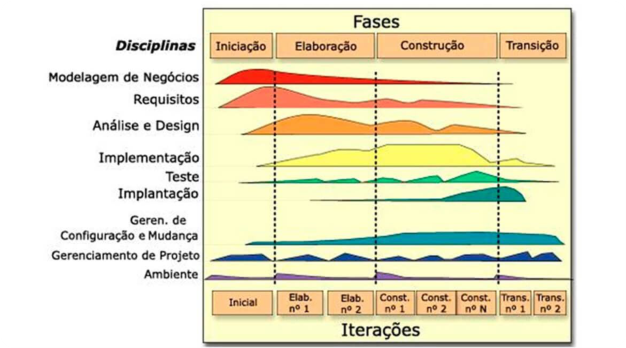

Figura 9 – O Processo Unificado 

O Processo Unificado (Rational Unified Process) 

#### Conteúdo interativo 

Acesse a versão digital para assistir ao vídeo. 

Veja mais detalhes sobre as etapas do modelo unificado a seguir: 

##### Iniciação 

A fase de iniciação, também denominada de concepção, exige do engenheiro de software uma visão inicial e geral do sistema a ser desenvolvido, cabendo destacar a possibilidade da utilização dos modelos de estado ou de atividades no desenho dos processos de negócio, isto é, a aplicação da primeira atividade do fluxo de trabalho que é a modelagem de negócio. Tal modelagem permite aos engenheiros de software compreender o negócio e garantir que todas as partes interessadas tenham um entendimento comum do domínio do problema. 

A partir dessa compreensão do negócio, pode-se obter os requisitos fundamentais do projeto, isto é, requisitos funcionais e não funcionais. Em seguida, realizar a modelagem dos casos de uso mais críticos, incluídos os principais serviços disponibilizados aos usuários, e a modelagem de classes, para entendimento da estrutura de dados a ser gerenciada pelo sistema. 

A identificação dos principais requisitos, junto aos modelos de casos de uso e classes iniciais, permite o estabelecimento do escopo do projeto. Nessa fase, a arquitetura do sistema limita-se a um esquema provisório com os principais subsistemas e as funções e recursos que o compõem. 

Temos agora dois grandes desafios aplicáveis a muitos projetos de software: verificar a viabilidade técnica e financeira do projeto, bem como garantir o seu financiamento, visto que ambos os desafios incluem também a análise de riscos. 

Podemos avançar com o projeto? Caso positivo, vamos realizar o planejamento detalhado da fase de Elaboração e geral das demais fases. Caso negativo, encerramos nossas atividades. 

# Elaboração 

Com o projeto de software aprovado, iniciamos a fase de elaboração, que é realizada de forma iterativa e incremental, de acordo com a Figura 9. Vamos reduzir o nível de abstração dos modelos de casos de uso e de classes iniciais, finalizando a atividade de análise do processo de software. 

Na sequência, temos a atividade de projeto na qual ocorre o refinamento de alguns modelos da análise e a criação de novos, assim como o modelo de interação, que representa os aspectos dinâmicos do sistema, além de construir um protótipo da interface com o usuário. A representação arquitetural é expandida em cinco visões do software: modelo de casos de uso, modelo de análise, modelo de projeto, modelo de implementação e modelo de implantação. Cada visão inclui um conjunto de modelos com seus respectivos diagramas. Nessa fase, devemos, também, minimizar os riscos e realizar o planejamento da fase de construção. 

# Construção 

A fase de construção segue o modelo de arquitetura gerando os componentes, ou aplica-se o reuso, que tornam os casos de uso operacionais para os usuários. 

Os modelos gerados na fase de elaboração são concluídos para refletir a versão final do incremento de software. Com o avanço da codificação, são realizados os testes unitários, os testes de integração entre os componentes e os testes de validação, até o teste beta, em que os usuários realizam a validação em ambiente de desenvolvimento controlado. 

# Transição 

A fase de transição tem como objetivo realizar a implantação do software no ambiente de produção. Inicialmente, o software é disponibilizado aos usuários para realização do teste beta em ambiente não controlado pelo desenvolvimento, tendo como foco a correção de defeitos e mudanças necessárias em função dos feedbacks dos usuários. 

Nessa fase, podem ocorrer a elaboração dos manuais do usuário, treinamento dos usuários, procedimentos de instalação, montagem de estrutura de suporte ou definição do processo de manufatura. Na conclusão dessa fase, o incremento torna-se uma versão de produção utilizável pela comunidade de usuários. 

# Fluxo de Trabalho 

Após o detalhamento das fases do RUP ilustradas na Figura 9, vamos entender as atividades transversais. Essas atividades, que correspondem às atividades genéricas de um processo de desenvolvimento de software, apresentadas anteriormente, compõem o denominado fluxo de trabalho, sendo as atividades distribuídas em todas as fases. 

### Como ocorre o relacionamento entre as dimensões fases do projeto X fluxos de projeto da Figura 9? 

Cada atividade do fluxo de trabalho se desenvolve de forma mais intensa em determinada fase. Por exemplo, os fluxos de trabalho da modelagem de negócio e requisitos são intensos na fase de concepção, justamente quando são definidos os requisitos de alto nível do negócio; a análise e design, i.e., projeto, tem uma intensidade na concepção em função dos modelos de análise e projeto, entretanto podemos observar alguma atividade na fase de construção, pois alguns modelos são refinados nesta fase do software. 

### Por que ocorre a atividade de implementação na fase de elaboração? Essa fase não é intensa em análise e projeto? 

Lembra-se da prototipação? Podemos nessa fase validar algum requisito do software aplicando a prototipação que inclui atividade de codificação, i.e., implementação. 

O RUP define três grupos de atividades de apoio ao desenvolvimento do software: 

##### Ambiente 

Inclui as atividades necessárias para configurar os processos e as ferramentas que darão suporte à equipe de desenvolvimento. 

Gerenciamento de configuração e mudança 

Permite a estruturação sistemática dos artefatos, tais como documentos e modelos, que precisam estar sob controle de versão, devendo essas alterações serem visíveis. 

##### Gerência de projeto 

Enfatiza a importância do gerenciamento de projetos; nessa atividade, sugerimos a utilização das melhores práticas contidas no PMBOK (o guia Project Management Body of Knowledge é um conjunto de práticas na gestão de projetos organizado pelo instituto PMI, sendo considerado a base do conhecimento sobre gestão de projetos por profissionais da área. 

# Resumindo 

Neste módulo, pudemos avaliar a importância do Processo Unificado no contexto do desenvolvimento de software. Inicialmente, apresentamos a UML, linguagem de modelagem unificada, a qual define o padrão dos artefatos de software de acordo com o paradigma de desenvolvimento orientado a objetos a serem utilizados em dado modelo de processo de desenvolvimento de software. 

Prioritariamente, o RUP é um modelo de processo de software para o desenvolvimento de acordo com o paradigma orientado a objetos. Esse processo tem um alto grau de formalismo, possuindo os seguintes princípios: baseado em casos de uso, centrado em arquitetura e iterativo e incremental. Enfim, se o problema for complexo, o RUP é um forte candidato a ser escolhido por algum engenheiro de software como requisito não funcional “modelo de processo de software”. 

#### Atenção 

Vale destacar que o RUP pode ser ajustado a qualquer escala de complexidade e a seleção do requisito não será tão simplista. 

# Verificando o aprendizado 

Questão 1 

(Referência: CESPE - 2010 - TRE-MT - Analista Judiciário - Tecnologia da Informação) O RUP (Rational Unified Process) é uma técnica usada na modelagem de sistemas. Com relação a esse assunto, assinale a opção correta: 

##### A 

Uma das principais características do RUP é o uso da iteração que, por meio de refinamentos sucessivos, melhora o entendimento do problema. 

##### B 

O RUP fornece uma metodologia que utiliza um conjunto de ferramentas, modelos e entregáveis que interage diretamente com o código do sistema desenvolvido, agilizando o processo de compilação. 

##### C 

Pelo fato de o RUP ser muito complexo, seu foco evita a redução dos riscos do projeto. Essa fase é tratada diretamente na UML. 

##### D 

O RUP reduz sensivelmente os requisitos de documentação de um projeto. 

##### E 

O RUP tem dois modelos de comunicação: um para ambientes fora da equipe de desenvolvimento e outro exclusivo para a equipe de desenvolvimento. 

A alternativa A está correta. 

O RUP possui como princípio, entre outros, ser iterativo e incremental. Iterativo porque as atividades se repetem a cada nova iteração, permitindo um melhor entendimento do negócio, ou seja, compreensão gradativa dos requisitos de software à medida que o desenvolvimento avança. 

Questão 2 

### (Prefeitura Municipal de Jataí - Analista de Tecnologia da Informação (Quadrix - 2019). 

### Acerca da linguagem de modelagem unificada (UML), assinale a alternativa correta: 

##### A 

A UML é uma linguagem de código que tem a finalidade de criar, especificamente, o modelo físico de determinado sistema. 

##### B 

Sua sintaxe foi projetada apenas para atender às linguagens‐alvo mais recentes, como a JavaScript. 

##### C 

Apesar de ser uma ferramenta de modelagem muito poderosa, ela não é capaz de capturar conhecimento e expressá‐lo. 

D 

A UML tem a finalidade de documentar e visualizar os artefatos que são especificados e construídos na análise e no desenho de um sistema. 

##### E 

A melhor definição para a UML, de acordo com diversos analistas, é que ela é uma linguagem de programação visual. 

A alternativa D está correta. 

A UML é uma linguagem de modelagem que permite a especificação de artefatos de software gerados nas etapas de análise e projeto de um processo de software. 

3. Processo de desenvolvimento ágil Extreme Programming (XP) 

# Desenvolvimento Ágil de Software 

Até meados dos anos 1990, os processos de desenvolvimento de software prescritivos exigiam um detalhado planejamento de projeto, um sistema de garantia da qualidade estabelecido, a aplicação de métodos de análise e projeto, tal como a modelagem de caso de uso, apoiados por ferramentas CASE e controlados por um disciplinado e formal modelo de processo de desenvolvimento de software. 

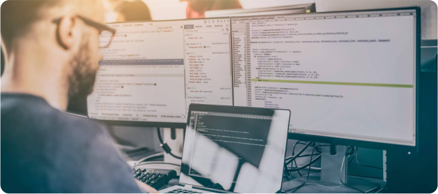

Essa visão era influenciada por equipes de engenheiros de software engajados em sistemas de software complexos que exigiam um esforço significativo de planejamento, projeto e documentação de sistema. 

### Mas esse esforço justifica-se em sistemas de menor grau de complexidade? 

Em 2001, um grupo de 17 metodologistas e outros profissionais da indústria de software se reuniram no estado norte-americano de Utah para discutir e propor uma alternativa aos processos prescritivos dominantes à época. Ao final da reunião, esse grupo lançou as bases para um novo conceito de processo de software, as quais foram registradas em um documento que chamaram de Manifesto para o Desenvolvimento Ágil de Software, que inclui quatro valores: 

- Indivíduos e interações, mais do que processos e ferramentas. 

- Software em funcionamento, mais do que documentação abrangente. 

- Colaboração com o cliente, mais do que negociação de contratos. 

- Resposta a mudanças, mais do que seguir um plano. 

A maioria dos métodos ágeis de desenvolvimento de software têm foco no próprio software, em vez de em seu projeto e documentação, assumem um fluxo de processo iterativo e incremental para entrega de software e apoiam aplicações de negócios nas quais os requisitos possuem alta volatilidade durante o desenvolvimento. 

Um projeto de software ágil busca a capacidade de implantar uma nova versão a cada incremento, enfatizando o software funcional como uma medida primária de progresso. 

A entrega de software rápida permite que os clientes validem de forma imediata o incremento, indicando possíveis erros ou alterações de requisitos, bem como descrevendo novos requisitos para as próximas iterações. 

#### Atenção 

Métodos ágeis também enfatizam comunicações em tempo real entre equipe de desenvolvimento e clientes. 

# Extreme programming - XP 

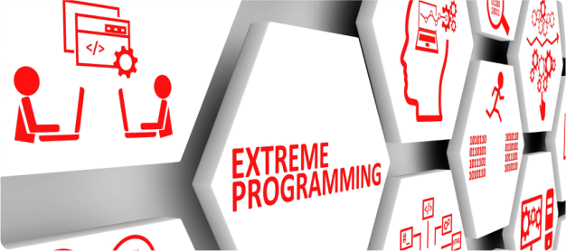

A Extreme Programming, ou simplesmente XP, é considerada um processo de desenvolvimento de software ágil, tendo sido proposta por Kent Beck em 1999. A XP adota valores que servem como critérios que norteiam as partes interessadas de um projeto, incluindo: comunicação, simplicidade, feedback, coragem e respeito. 

Vejamos uma breve descrição de cada valor: 

#### Kent Beck 

Kent Beck é um engenheiro de software americano criador do Extreme Programming e Test Driven Development. Beck foi um dos 17 signatários originais do Agile Manifesto (Manifesto ágil) em 2001, que trata-se de uma declaração de princípios que fundamentam o desenvolvimento ágil de software. 

##### Comunicação 

A comunicação objetiva construir um entendimento dos requisitos com o mínimo de documentação formal e o máximo de interação entre equipe de desenvolvimento e clientes. 

##### Simplicidade 

A simplicidade sugere que a equipe adote soluções mais simples, criando um ambiente onde o custo de mudanças no futuro seja baixo. 

##### Feedback 

O feedback permite que os programadores também tenham feedback quando da execução dos testes e quando da validação funcional por parte dos clientes, permitindo a correção de erros e alterações nos requisitos. 

##### Coragem 

A coragem é necessária para lidar com o risco de erro, que deve ser considerado natural e se traduz em confiança nos seus mecanismos de prevenção e proteção. 

##### Respeito 

O respeito é o valor mais básico e que dá sustentação a todos os demais, e sem o qual não haverá nada que possa salvar um projeto de software do insucesso. 

#### Saiba mais 

Assim como um segundo nível de abstração, a XP possui cinco princípios que servem para ajudar a equipe de software na escolha de alternativas de solução de problemas durante o projeto. Os princípios incluem: feedback rápido, assumir simplicidade, mudança incremental, abraçando mudanças e trabalho de qualidade. 

A XP possui doze práticas que se enquadram nos valores e princípios descritos na tabela a seguir: 

|TABELA 1|– Doze práticas enquadradas nos valores e princípios da XP|
|---|---|
|Prática|Descrição|
|Jogo de Planejamento|Os requisitos são registrados em cartões, ou fichas, denominados “história de usuários”, sendo a descrição e a priorização realizadas pelos clientes. A equipe de desenvolvimento estima a duração de cada release.|
|Pequenas Releases|Cada release deve ser a menor possível, incluindo os requisitos mais importantes para o negócio. As releases frequentes permitem um maior feedback para clientes e equipe de desenvolvimento, facilitando o aprendizado e a correção dos defeitos do software.|
|Metáfora|Facilita a comunicação com o cliente, entendendo a sua realidade, isto é, procura traduzir as palavras do usuário para o significado que ele espera dentro do projeto. Como exemplo, a metáfora “Estoque 4.0” para um subsistema de gestão virtual dos estoques no contexto de um sistema de logística.|
|Projeto Simples|Projeto simples inclui projetar somente as histórias de usuários, ou funcionalidades, previamente definidas, bem como se concentrar em soluções de projeto simples e bem estruturadas, tal como o menor número possível de classes e métodos.|

|TABELA 1|– Doze práticas enquadradas nos valores e princípios da XP|
|---|---|
|Cliente no local de Trabalho|Incluir um cliente na equipe de desenvolvimento para responder perguntas, ou alguém da parte do cliente com conhecimento do negócio. O cliente é protagonista em um projeto XP.|
|Semana de 40 horas|Estimula a busca de um ritmo sustentado de trabalho, tal como 40 horas semanais. Horas extras são permitidas quando trouxerem produtividade para a execução do projeto, devendo estar restringidas a duas semanas seguidas.|
|Programação Pareada|Todo código deve ser gerado por dois programadores trabalhando em um único computador. O programador codifica e o parceiro revisa e sugere. Dessa forma, o programa sempre é revisto por duas pessoas, evitando e diminuindo, assim, a possibilidade de defeitos. Com isso, busca-se sempre a evolução da equipe, melhorando a qualidade do código fonte gerado.|
|Propriedade Coletiva|O código fonte pode ser alterado por qualquer membro da equipe de desenvolvimento, de modo que esta detém a propriedade do código. O objetivo com isso é fazer a equipe conhecer todas as partes do sistema. Os testes de unidade e integração garantem a estabilidade dessa prática.|
|Padronização do Código|A prática da propriedade coletiva de código exige o estabelecimento de regras para programar a serem seguidas por todos. O objetivo é facilitar o entendimento do código.|
|Desenvolvimento Orientado a Testes|Um framework automatizado é sugerido para a escrita dos testes unitários, antes que determinada funcionalidade seja implementada, técnica denominada “test first”. Os testes de integração também são realizados sistematicamente. Os testes de validação são especificados pelos clientes a partir das histórias de usuários.|
|Refatoração|A refatoração é um processo de modificar a estrutura interna do software sem alterar o seu comportamento externo, permitindo a melhoria contínua da programação com o mínimo de introdução de erros e mantendo a compatibilidade com o código já existente.|
|Integração Contínua|O sistema deverá ser integrado sempre que produzir uma nova funcionalidade. Essa continuidade permite a detecção imediata de erros de integração, evitando problemas de compatibilidade e interface.|

# Processo XP 

A XP adota o paradigma orientado a objetos, aplicando seus valores, princípios e práticas em um processo com quatro atividades metodológicas: planejamento, projeto, codificação e testes. A Figura 10 ilustra essas atividades metodológicas propostas por Pressman (2016). 

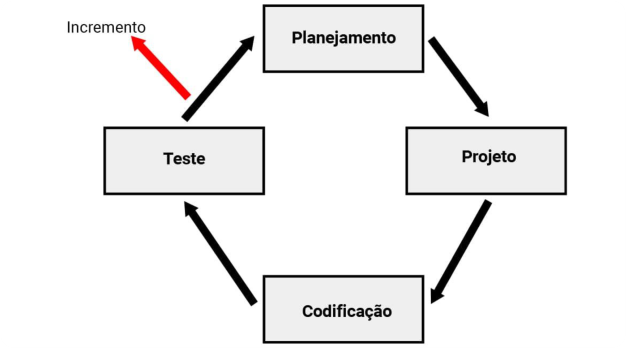

Figura 10 – O processo XP. 

# O processo ágil Extreme Programming (XP) 

Assista, a seguir, o processo XP e suas etapas de planejamento, projeto, codificação e teste: 

O processo ágil eXtreme Programming (XP) 

#### Conteúdo interativo 

Acesse a versão digital para assistir ao vídeo. 

Veja mais detalhes sobre o processo XP e suas etapas: 

##### Planejamento 

A primeira atividade é ouvir o cliente, realizando um levantamento de requisitos que possibilite o entendimento do escopo do problema. Essa atividade gera um conjunto de histórias de usuários, escritas pelos clientes, juntamente à equipe de desenvolvimento que, de forma simplificada, compõem as necessidades destes. Cada história é colocada em uma ficha ou cartão, sendo priorizadas pelos clientes em função da agregação de valor ao negócio. 

Após a elaboração dos cartões, a equipe de desenvolvimento avalia as histórias e as divide em tarefas, estimando o esforço e os recursos necessários à implementação. Caso o esforço exija mais do que três semanas de desenvolvimento, é preciso que o cliente fatore a história analisada em histórias menores. 

As histórias que farão parte de cada incremento são selecionadas de forma conjunta por equipe de desenvolvimento e clientes, considerando os seguintes critérios: as histórias de maior risco serão priorizadas, em seguida, as que agregam maior valor ao negócio. 

Após a implantação da primeira versão do software, é calculada a velocidade do projeto que é o número de histórias de usuários implementadas na primeira release. Essa velocidade serve para avaliar se o compromisso firmado está compatível e auxiliar na estimativa de prazos das versões seguintes. 

##### Projeto 

Aqui temos a máxima: “Não complique!” 

A XP estimula a modelagem com cartões CRC (Classe-Responsabilidade-Colaborador), que permitem identificar as classes orientadas a objetos relevantes para a iteração corrente do software. Os cartões CRC são os únicos artefatos de projeto gerados durante o processo XP. 

Caso algum requisito necessite ser validado em função de sua complexidade, é recomendada a prototipação, como solução pontual, a fim de reduzir o risco dessa especificação no projeto. 

A refatoração também é estimulada, tendo em vista uma melhor organização do código interno do software sem impactar a sua funcionalidade, o que minimiza as possibilidades de erros. 

##### Codificação 

A XP sugere que dois programadores trabalhem juntos em um mesmo computador a fim de criarem código para uma história, fornecendo um mecanismo de solução de problemas em tempo real, cabendo a máxima de que duas cabeças pensam melhor que uma, além de garantir a qualidade do código, pois a sua revisão é imediata. Ambos desenvolvedores têm papéis distintos, tal como, uma pessoa implementa o código, outro verifica os padrões de codificação. 

Quando da conclusão da codificação, esse código é integrado aos demais. A estratégia de integração contínua possibilita a identificação precoce de erros. 

##### Teste 

Como afirmado anteriormente, a equipe de desenvolvimento avalia cada história e a divide em tarefas, que representa uma característica discreta do sistema. Antes da codificação, a equipe de desenvolvimento elabora os testes de unidades a serem aplicados nas tarefas. A automação desses testes é fortemente recomendada, o que estimula a realização dos teste de regressão (é a reexecução de algum subconjunto de testes que já foram conduzidos para garantir que as modificações não propagaram efeitos colaterais indesejáveis) toda vez que o código for alterado. 

A estratégia de integração contínua está vinculada aos testes de integração, realizados de forma sistemática a cada novo código gerado a ser integrado, o que permite lançar alertas logo no início, evitando propagações indesejadas. 

Os testes de aceitação são elaborados pelos clientes com base nas histórias de usuários especificadas anteriormente e que serão implementadas na próxima release. O foco está nas funcionalidades externas visíveis aos clientes. Em outras palavras, os testes verificam se o sistema atende às reais necessidades dos usuários. 

# Resumindo 

Neste módulo, compreendemos as principais características das metodologias ágeis e, em particular, da Extreme Programming – XP. A partir do questionamento do excesso de formalismo dos processos prescritivos dominantes em meados da década de 1990, foi redigido o Manifesto para o Desenvolvimento Ágil de Software, com quatro valores: Indivíduos e interações, mais do que processos e ferramentas; software em funcionamento, mais do que documentação abrangente; colaboração com o cliente, mais do que negociação de contratos; e resposta a mudanças, mais do que seguir um plano. 

A maioria dos métodos ágeis de desenvolvimento de software tem como foco o software, em vez de formalismos de projeto e documentação, assumem um fluxo de processo iterativo e incremental e apoiam aplicações com requisitos altamente voláteis durante o desenvolvimento. 

A XP possui um conjunto de valores, princípios e práticas como base aos que assumem a metodologia XP. 

O processo XP possui quatro atividades metodológicas: 

O planejamento está fundamentado nas histórias de usuários. 

O projeto tem um mínimo de formalismo em função de gerar um único tipo de artefato, os cartões CRC, sendo sugeridas a prototipação e refatoração nessa etapa. 

A codificação sugere o trabalho em par de programadores alocados em um único computador, permitindo uma revisão de código em tempo real. 

Os testes têm uma característica peculiar, são escritos antes da codificação e aplicados de forma sistemática em ambiente automatizado; na sequência, temos os testes unitários, de integração e aceitação. 

# Verificando o aprendizado 

Questão 1 

(Empresa Brasileira de Correios e Telégrafos (Correios) - FIP - 2009). Assinale a alternativa que não apresenta características dos métodos ágeis de desenvolvimento de software: 

##### A 

Entregas parciais do sistema em períodos curtos, que duram de semanas a meses, com preferência para intervalos menores. 

##### B 

Atribuição dos requisitos de maior complexidade funcional e não funcional nas primeiras interações com os clientes, de forma a priorizar os aspectos críticos do sistema. 

##### C 

Quantidade de código executável considerada a medida mais importante do progresso do desenvolvimento de um software. 

##### D 

Mudanças nos requisitos, mesmo quando ocorrem próximas ao final do desenvolvimento. 

##### E 

Processos de desenvolvimento e recursos tecnológicos disponíveis considerados mais importantes do que as interações entre os membros das equipes. 

#### A alternativa A está correta. 

Um dos valores dos métodos ágeis inclui “indivíduos e interações, mais do que processos e ferramentas”. Esse valor tem origem de uma rejeição dos proponentes dos modelos ágeis aos processos prescritivos com rigoroso formalismo, incluindo os respectivos métodos e ferramentas CASE sugeridas. Para esses proponentes, a comunicação entre membros da equipe, incluindo clientes, é mais importante. 

##### Questão 2 

Um engenheiro de software, no contexto de um projeto alinhado à metodologia ágil XP, está planejando as atividades relacionadas ao primeiro incremento, estabelecendo a seguinte sequência: detalhamento das histórias de usuários em tarefas, elaboração dos cartões CRC, codificação, elaboração dos testes unitários e execução dos testes. Assinale a opção correta relativa à sequência descrita: 

A 

A elaboração dos testes deve ocorrer antes da codificação. 

B 

A codificação deve ocorrer antes da elaboração dos cartões CRC. 

C 

A elaboração dos cartões CRC deve ocorrer antes do detalhamento das histórias de usuários em tarefas. 

D 

A codificação deve ser realizada antes da elaboração dos cartões CRC. 

E 

A sequência está correta. 

A alternativa A está correta. 

A prática de desenvolvimento orientada a testes determina que os testes unitários sejam escritos antes da codificação, técnica também conhecida como “test first”. 

4. Processo de desenvolvimento ágil SCRUM e o Processo Unificado Ágil (AUP) 

# Metodologia ágil SCRUM 

O termo Scrum, cujo significado se reporta a um método de reinício de jogada no esporte rugby, foi concebido fora da indústria de software como um estilo de gerenciamento de produtos. A partir de conceitos relacionados com este termo, Jeffrey Sutherland e Ken Schwaber, no início da década de 1990, desenvolveram o denominado Processo de Desenvolvimento SCRUM, publicado em 1995. Desde então, esse processo passou a ser aplicado no desenvolvimento de software em todo o mundo. 

A metodologia Scrum sofreu, posteriormente, desenvolvimentos adicionais abrangendo o gerenciamento de projetos, não necessariamente relacionados a projetos de software. Entretanto, o Scrum é empregado de forma sistemática no gerenciamento de projetos de desenvolvimento de software, utilizando-se dos valores e princípios do manifesto ágil junto aos conceitos definidos em seu framework. Tal metodologia tem sua aplicação recomendada principalmente quando, em função da complexidade do projeto, não é possível estabelecer todos os requisitos nas fases iniciais do planejamento. 

Importante destacar que alguns autores adotam uma abstração de aplicar ao Scrum uma denominação de processo ágil de desenvolvimento de software. 

##### Transparência 

A equipe de desenvolvedores deve dispor de um mesmo entendimento dos aspectos significativos do processo com base num padrão, tal como uma linguagem comum referente ao processo. 

##### Inspeção 

A máxima é “inspeção constante de todos os artefatos”, ou seja, a equipe de desenvolvedores deve sistematicamente inspecionar os artefatos Scrum e o progresso desses, de modo a detectar não conformidades; entretanto, a inspeção não deve ser um entrave à própria execução das tarefas. 

##### Adaptação 

Inclui a adaptação do produto software, que pode sofrer mudanças em função da volatilidade dos requisitos e/ou mudanças da tecnologia, bem como a adaptação do processo em função de alguma falha; os ajustes devem ser realizados o mais rápido possível de forma a evitar a propagação de desvios. 

# Papéis no Scrum 

Uma equipe Scrum é composta pelo Product Owner (Dono de Produto), Scrum Master e Scrum team. 

O Dono do Produto, ou Product Owner, faz o papel do cliente, determinando os requisitos e funcionalidades que deverão ser entregues, incluindo as suas mudanças, além de manter e comunicar às partes interessadas uma visão clara do projeto e estar disponível para esclarecer eventuais questionamentos. 

O Scrum Master é o responsável por garantir que as regras do método Scrum estejam sendo seguidas, desempenhando, também, funções de um facilitador na resolução de problemas ou nas interferências externas. O Scrum Master é o mantenedor das regras e dos procedimentos do Scrum durante a execução do projeto, auxiliando a todos da equipe a entenderem seus papéis no processo. 

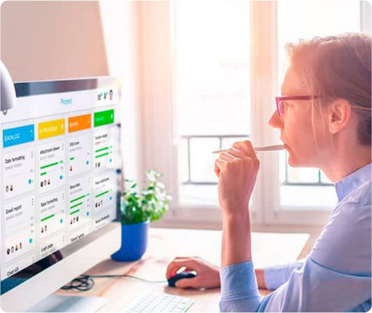

A Scrum Team, ou equipe scrum, é multidisciplinar, incluindo os especialistas necessários para desenvolver o produto de forma a não depender de membros externos, tais como programadores, administradores de banco de dados, web designers etc. 

# Artefatos Scrum 

Os Artefatos Scrum são concebidos com a finalidade de garantir que as equipes Scrum sejam bem-sucedidas na geração de um incremento. 

Vejamos os principais artefatos: 

### Product Backlog 

Lista incluindo todos os requisitos ou funcionalidades levantados para o produto, estando sob responsabilidade do product owner; no início do desenvolvimento, são estabelecidos os requisitos inicialmente conhecidos e mais bem compreendidos, evoluindo à medida que o produto e o ambiente em que ele será utilizado também evoluem, ou seja, o product backlog é dinâmico. 

### Sprint Backlog 

Subconjunto de requisitos do product backlog selecionados para determinada iteração, denominada de Sprint; inclui, também, o plano para entregar um incremento do produto e atingir a meta da Sprint, isto é, estabelece quais funcionalidades estarão na próxima versão e o trabalho necessário para a referida entrega, também denominada de “Done”. A equipe de desenvolvimento é a responsável, quando necessário, pelas modificações no sprint backlog. 

# Eventos Scrum 

Os eventos permitem otimizar a organização das inspeções e iterações, sendo por meio deles que os conceitos descritos são postos em prática de uma forma ágil e produtiva. Os eventos permitem, também, a 

minimização da necessidade de reuniões não contempladas no Scrum. Os eventos possuem um tempo prédefinido com uma duração máxima estipulada denominada de timebox, o que garante uma quantidade apropriada de tempo no planejamento. 

Vejamos os eventos Scrum. 

# Sprint 

O Sprint corresponde a uma unidade de iteração em Scrum, tendo uma duração (timebox) em torno de um mês, ao final do qual é gerado um incremento de produto em condições de uso pelos usuários finais. Ele possui duração consistente durante todo o desenvolvimento. Cada Sprint inclui as atividades típicas de um processo de desenvolvimento de software, tais como, levantamento de requisitos, análise, projeto etc. 

# Reunião de planejamento do Sprint 

A Reunião de planejamento do Sprint permite planejar o trabalho a ser realizado em dado Sprint, sendo esse plano resultado de trabalho colaborativo da equipe scrum. A reunião é limitada a 8h para um Sprint de um mês, dividida em duas partes que, respectivamente, buscam respostas às seguintes perguntas: O que será entregue no incremento resultante do Sprint planejado? Como será alcançado o trabalho necessário para entregar o incremento? 

# Reunião diária do Sprint (Daily Scrum) 

A Reunião diária do Sprint (Daily Scrum), como diz o próprio nome, é um evento diário limitado a 15 minutos, no qual a equipe scrum ajusta as atividades e cria um plano para as próximas 24 horas. Isso é feito inspecionando o trabalho desde a última daily scrum e pela previsão do trabalho a ser feito antes da próxima reunião diária. 

# Revisão do Sprint 

A Revisão do Sprint é realizada no final do sprint para inspecionar o incremento e adaptar, se necessário, o product backlog. Essa é uma reunião informal, e a apresentação do incremento destinase a obter feedback e a fomentar a colaboração na equipe, não devendo ultrapassar quatro horas para sprints de um mês. 

# Retrospectiva do Sprint 

A Retrospectiva do Sprint é uma oportunidade formal para a equipe scrum inspecionar e criar um plano de melhorias a ser seguido durante o próximo Sprint, sendo uma reunião limitada a 3h para sprints de um mês. Os objetivos dessa retrospectiva incluem verificar como correu o último sprint no que diz respeito às pessoas, relações, processos e ferramentas; identificar e ordenar os itens que correram de forma satisfatória e potenciais ajustes; e criar um plano para implementar melhorias no modo como a equipe scrum faz o seu trabalho. 

# Fluxo de Processo do Scrum 

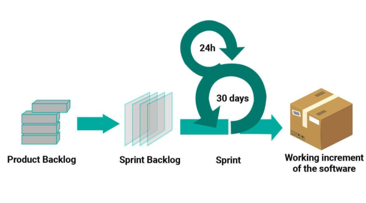

Figura 11 – Fluxo de Processo Scrum 

# O processo de desenvolvimento ágil Scrum 

Veja, a seguir, o fluxo do processo Scrum, seus papéis, eventos e artefatos produzidos: 

O processo de desenvolvimento ágil Scrum 

Conteúdo interativo 

Acesse a versão digital para assistir ao vídeo. 

O fluxo de processo Scrum está ilustrado na Figura 11. Os requisitos que definem as funcionalidades a serem entregues são agrupadas pelo product owner no product backlog. 

Veja mais detalhes sobre este fluxo, a seguir: 

### Reunião de planejamento de sprint 

No início de cada sprint, é realizada a reunião de planejamento de sprint, com a participação do product owner, scrum master e scrum teams, a fim de que sejam priorizados e selecionados os requisitos do product backlog que serão implementados no sprint em planejamento. Esses requisitos são decompostos em tarefas, para cada tarefa é alocado um responsável que realiza a sua estimativa. Ao final da reunião, essas tarefas passam a compor o sprint backlog. 

### Desenvolvimento do sprint 

Na sequência, a scrum team inicia o desenvolvimento do sprint de acordo com o planejado. No início de cada dia do sprint, a daily scrum permite o compartilhamento, entre os membros da equipe, do que foi concluído no dia anterior e quais as prioridades do dia atual. O scrum master conduz essa reunião. 

### Reunião de revisão de sprint 

Ao final do sprint, ocorre a reunião de revisão de sprint que permite a geração de um product backlog revisto, sendo definidas as prováveis exigências para o próximo sprint; os requisitos podem ser ajustados em função de sua volatilidade ou de novas tecnologias. Participam dessa reunião o project owner, o scrum master e a scrum team. 

### Reunião de retrospectiva do sprint 

A última atividade da iteração sprint é a reunião de retrospectiva do sprint com a finalidade de levantar as lições aprendidas nessa iteração, incluindo os pontos positivos e o que precisa ser aprimorado nas próximas reuniões. 

# Processo Unificado Ágil - AUP 

O Processo Unificado Ágil, ou Agile Unified Process (AUP), é uma versão simplificada do Rational Unified Process (RUP). O AUP baseia-se nos seguintes princípios: 

- A equipe sabe o que está fazendo. O AUP disponibiliza links de acesso à documentação com muitos detalhes, isso para os que estiverem interessados. 

- Simplicidade. Tudo é descrito de forma concisa maximizando a simplicidade. 

- Agilidade. O AUP está em conformidade com os valores e princípios da metodologia ágil de desenvolvimento de software. 

- Concentre-se em atividades de alto valor. O foco está nas atividades que realmente agregam valor ao cliente. 

- Independência de ferramenta. A recomendação é utilizar as ferramentas mais adequadas, que muitas vezes são ferramentas simples. 

- Customização. O produto AUP é facilmente customizável às necessidades dos seus usuários. 

O AUP adota uma natureza serial para o que é amplo, e iterativo para o que é particular. Vejamos a natureza serial do AUP que inclui as mesmas quatro fases adotadas pelo RUP: 

#### Concepção 

Tem como objetivos a identificação do escopo do projeto, de uma arquitetura em potencial para o sistema e a viabilidade do projeto. 

#### Elaboração 

Tem foco na comprovação da arquitetura do sistema. 

#### Construção 

Visa a construir um software funcional de forma iterativa e incremental que atenda às necessidades das partes interessadas do projeto. 

#### Transição 

Tem como objetivo validar e implantar o sistema em ambiente de produção. 

Vejamos a natureza iterativa do AUP. As atividades que são realizadas de forma iterativa pelos membros da equipe de desenvolvimento para construir, validar e entregar software operacional são as seguintes: 

# Modelagem 

Inclui o entendimento do negócio em questão e do problema a ser resolvido pelo software, identificando uma solução; representações UML para os modelos são utilizadas, entretanto, devem ser suficientemente boas e adequadas, ou seja, o mínimo de formalismo. 

# Implementação 

Transformação dos modelos em código executável, realizando os respectivos testes básicos, tais como testes unitários. 

# Testes 

Realização de uma avaliação objetiva a fim de garantir a qualidade, incluindo a detecção de defeitos, a validação funcional e a verificação de que os requisitos são cumpridos. 

# Implantação 

Planejar e executar a entrega do software operacional aos usuários finais e na obtenção de feedback dos usuários. 

# Gerenciamento de configuração 

Garantir o acesso aos artefatos do projeto, incluindo o rastreamento das diversas versões, bem como o controle e gerenciamento de suas alterações. 

# Gestão de projetos 

Planejar, monitorar e controlar as atividades do projeto a fim de que ele seja entregue no prazo, dentro do orçamento e atendendo as expectativas dos usuários. 

# Ambiente 

Atua em apoio às demais atividades, garantindo a infraestrutura do processo que inclui padrões, ferramentas e outras tecnologias de suporte disponíveis à equipe. 

# Resumindo 

Neste módulo, destacamos os processos de desenvolvimento ágil Scrum e Processo Unificado Ágil (AUP). O Scrum é uma metodologia que possui uma destacada aplicação em projetos de software. Existe a possibilidade de aplicarmos a metodologia Scrum no gerenciamento de projeto ágil de software ou como processo ágil de desenvolvimento de software. Como todo processo ágil, aplica o fluxo de processo iterativo, sendo cada iteração denominada de sprint e, ao final de cada um destes, é gerada uma entrega, isto é, um software operacional. 

O método AUP tem suas origens no Processo Unificado (RUP), podendo ser considerado uma versão simplificada em função de sua adesão aos valores e princípios das metodologias ágeis. As fases do projeto permanecem as mesmas do RUP, tais como, concepção, elaboração, construção e transição. As mudanças significativas estão nas atividades iterativas compostas de modelagem, implementação, testes, implantação, gerenciamento de configurações, gestão de projetos e ambiente. 

# Verificando o aprendizado 

##### Questão 1 

(Tribunal de Justiça do Estado do Rio Grande do Norte (TJ-RN) - COMPERVE - 2020) O Scrum é um framework dentro do qual as pessoas podem tratar e resolver problemas de forma ágil. O coração do Scrum está em suas sprints. Segundo o Scrum Guide, em um projeto que adota Scrum, a autoridade de cancelar uma sprint cabe ao 

A 

Time scrum. 

B 

Scrum Master. 

C Product Owner. D Team manager. E 

Gerente de projeto. 

A alternativa C está correta. 

Somente o product owner tem a autoridade para cancelar um Sprint antes do prazo estabelecido, embora o possa fazer sob influência das partes interessadas. 

##### Questão 2 

O Método AUP é considerado uma simplificação do RUP, em função de seu ajuste aos valores do manifesto ágil. Qual atividade iterativa do AUP melhor representa a adesão ao seguinte valor: “Software em funcionamento, mais do que documentação abrangente”? 

A 

Modelagem. 

B 

Implementação. 

C D 

Testes 

Implantação. 

E 

Análise. 

A alternativa A está correta. 

O RUP possui como atividades que exigem modelagem: modelagem de negócio, levantamento de requisitos, análise e projeto. Podemos destacar que essas atividades foram agregadas na atividade modelagem do processo ágil AUP. 

5. Conclusão 

# Considerações finais 

Apresentamos os principais modelos de processo de desenvolvimento de software prescritivos, bem como detalhamos o Processo Unificado (RUP) e os métodos ágeis, com seus valores, princípios e práticas, sendo detalhados o processo Extreme Programming (XP), o processo SCRUM e o Processo Unificado Ágil (APU). 

Os modelos de processos prescritivos incluem um conjunto de elementos metodológicos de processo. A partir do questionamento do excesso de formalismo desses processos prescritivos, dominantes em meados da década de 90, foi redigido o Manifesto para o Desenvolvimento Ágil de Software, com um conjunto de valores, princípios e práticas que foram assimilados pelos processos ágeis, tais como, XP, SCRUM e AUP. 

Entre os métodos ágeis, o XP está fundamentado nas histórias de usuários, tendo um único tipo de artefato de modelagem, que são os cartões CRC. O SCRUM tem como evento base o sprint, que corresponde a uma iteração com as tarefas que permitem a criação de incrementos de software operacional. Já o AUP, adota as etapas clássicas do RUP, aplicando uma significativa simplificação nas atividades iterativas, particularmente, na modelagem. 

#### Podcast 

Para encerrar, o professor Alberto Tavares fala sobre os principais pontos sobre os modelos de processos de desenvolvimento de software. 

#### Conteúdo interativo 

Acesse a versão digital para ouvir o áudio. 

## Explore+ 

Para saber mais sobre os assuntos tratados neste tema, leia: 

- Capítulos 4 e 5. Engenharia de Software, Pressman. 

- 

- Capítulos 4 e 17. Engenharia de Software, Sommerville. 

- 

- Capítulo 2. Princípios de Análise e Projeto de Sistemas com UML, Bezerra 

- 

- Capítulo 2. Engenharia de Software Moderna, Valente. 

## Referências 

BEZERRA, Eduardo. Princípios de Análise e Projeto de Sistemas com UML. Elsevier, 3. ed, Rio de Janeiro, 2014. 

PRESSMAN, Roger S.; Maxim, Bruce R. Engenharia de Software. AMGH Editora, 8. ed, Porto Alegre, 2016. 

SOMMERVILLE, Ian. Engenharia de Software. 8. ed. São Paulo: Pearson Prentice Hall, 2007. 

VALENTE, Marcos T. Engenharia de Software Moderna. 1. ed. Belo Horizonte: Independente, 2020. 

