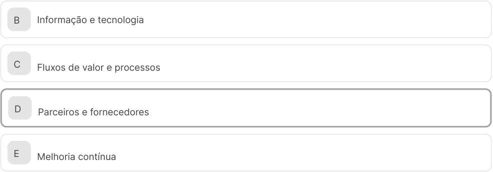
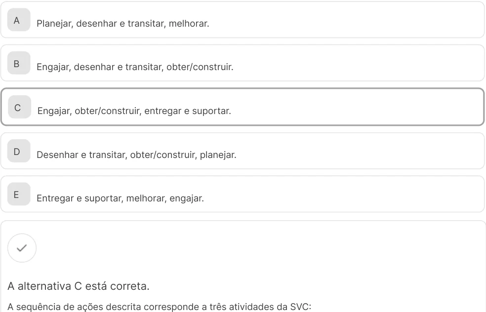

# O cenário de serviços de TI 

Você aprenderá a gerenciar serviços de TI com base nos fundamentos do ITIL 4, focando a cocriação de valor para a empresa. Esse conhecimento é essencial para a sua carreira, pois o mercado busca profissionais que saibam usar a tecnologia para otimizar processos, reduzir custos e impulsionar a inovação de forma eficiente. 

1. Itens iniciais 

### Objetivos 

- Definir os componentes do sistema de valor de serviço (SVS) e seus princípios orientadores. 

- 

- Descrever a aplicação da cadeia de valor e do catálogo de serviços para a entrega de soluções ao negócio. 

- 

- Reconhecer a aplicação da técnica de mapeamento de fluxo de valor (VSM) e dos princípios Lean para identificar e implementar melhorias em processos de suporte de TI. 

### Introdução 

Olá! Boas-vindas! Neste vídeo, acompanhe a transformação da TI, de um setor de suporte técnico para um parceiro estratégico fundamental para o sucesso dos negócios. Veja também a importância da cocriação de valor e a relevância desse conhecimento para a sua carreira no mercado de trabalho atual. 

#### Conteúdo interativo 

Acesse a versão digital para assistir ao vídeo. 

1. Fundamentos do gerenciamento de serviços com ITIL 4 

## Introdução ao gerenciamento de serviços de TI 

Neste vídeo, apresentaremos o conceito de cocriação de valor, usando uma analogia simples para demonstrar como o benefício de um serviço é criado em colaboração com o cliente, não sendo apenas entregue pela TI. Não perca! 

#### Conteúdo interativo 

Acesse a versão digital para assistir ao vídeo. 

A percepção sobre a tecnologia da informação evoluiu, exigindo uma compreensão mais estratégica de seu papel. Assim, entender o que é o gerenciamento de serviços de TI (ITSM) e o conceito de cocriação de valor é o primeiro passo para essa atuação. Esse conhecimento teórico ainda permite compreender como a TI pode colaborar de modo ativo com outras áreas na geração de resultados de negócio, deixando de atuar apenas de maneira reativa. 

Dominar essa visão viabiliza uma atuação profissional com maior impacto e relevância. 

O gerenciamento de serviços de TI, ou ITSM (do inglês, IT Service Management), é como as equipes de TI gerenciam a entrega de serviços de ponta a ponta para os clientes. Isso inclui todos os processos e atividades para projetar, criar, entregar e dar suporte aos serviços de TI. 

O foco do ITSM está em como a tecnologia pode entregar valor ao negócio e aos seus usuários. Pense nisso como uma mudança de mentalidade: em vez de gerenciar apenas a infraestrutura (servidores, redes), gerenciamos o resultado que essa infraestrutura entrega (por exemplo, o serviço de e-mail ou o serviço de acesso ao sistema financeiro). 

De suporte a parceiro estratégico: a nova visão de valor 

Historicamente, o valor de um serviço era visto como algo que o provedor (a área de TI) criava e entregava ao consumidor (o usuário). A ITIL 4, versão mais recente da Information Technology Infrastructure Library, é um framework de melhores práticas para o gerenciamento de serviços de TI (IT Service Management/ITSM) que rompe com essa visão tradicional e introduz o conceito de cocriação de valor. 

Mas o que é valor? 

Valor é o resultado percebido pelo stakeholder (o cliente, o usuário), e não o produto ou a solução em si. 

Vamos ver um exemplo! O valor de um aplicativo de delivery não é o aplicativo em si, mas a conveniência de receber a comida em casa. 

No novo cenário, o valor é cocriado por meio de uma colaboração ativa entre o provedor e o consumidor (portanto, ele deixou de ser algo meramente entregue). O provedor de serviço não consegue criar valor sozinho. 

O valor também pode ser destruído quando um serviço, embora funcional, impõe obstáculos ao usuário, como interfaces complexas, lentidão ou falhas de segurança. Nesses casos, em vez de gerar benefícios, o serviço compromete a experiência e os resultados esperados. Por exemplo, um sistema de ponto eletrônico até funciona de modo correto, mas é tão complicado, que faz os funcionários perderem 10 minutos por dia para registrar entrada e saída. Isso reduz a produtividade e a satisfação, destruindo valor em vez de criá-lo. 

Vamos a um caso prático de cocriação de valor com um serviço de streaming. 

#### Exemplo 

A Netflix (provedor) oferece um catálogo gigantesco de filmes e séries e uma infraestrutura robusta. No entanto, o valor (o entretenimento e a conveniência) só é criado quando você (consumidor) usa seu tempo, seu dispositivo (smart TV ou celular), sua conexão de internet e sua assinatura para assistir a um filme. 

Ou seja, se ninguém assistir, não há valor criado, apenas potencial de valor. A colaboração é o que torna o serviço valioso. 

Adotar a mentalidade de cocriação é o que transforma a TI de um centro de custos reativo em um verdadeiro parceiro estratégico, que dialoga com o negócio para criar soluções que gerem resultados reais. 

## Atividade 1 

O gerenciamento de serviços de TI, conhecido como ITSM, é regido por princípios que modificam o papel da TI dentro do negócio. Considerando os princípios contemporâneos de ITSM, assinale a alternativa correta referente a como os serviços de TI geram benefícios e utilidade para o negócio. 

- A O benefício é resultado de uma parceria, na qual a solução do provedor e o uso pelo consumidor geram o resultado desejado. 

- B A responsabilidade pela geração de benefícios é da equipe de TI, que deve entregar um produto finalizado e funcional. 

- C A ausência de falhas técnicas e a alta performance da infraestrutura são os fatores primordiais que definem o sucesso de um serviço. 

- D A principal métrica para aferir o sucesso de um serviço é a economia de recursos financeiros que ele proporciona à organização. 

- E A satisfação do cliente é garantida quando todos os indicadores operacionais e acordos de nível de serviço (SLAs) são atingidos. 

#### A alternativa A está correta. 

A lógica correta baseia-se no princípio da cocriação. Nessa visão, o provedor de TI oferece o potencial e as ferramentas, mas o benefício real só se manifesta quando o consumidor utiliza de modo ativo o serviço para alcançar seus próprios resultados. Portanto, o valor surge da interação contínua e da parceria entre as partes envolvidas. 

As demais alternativas apresentam visões incompletas ou ultrapassadas, pois se concentram em aspectos isolados, como a perfeição técnica, as métricas operacionais (SLAs) ou uma perspectiva unilateral que atribui à TI a responsabilidade exclusiva pela entrega de valor. 

## O sistema de valor de serviço (SVS) 

Neste vídeo, detalharemos como as oportunidades e demandas são transformadas em valor, descrevendo a função de cada um dos seus cinco componentes principais. Assista! 

#### Conteúdo interativo 

Acesse a versão digital para assistir ao vídeo. 

Para que a entrega de valor seja consistente, ela precisa de um modelo organizacional, que é o sistema de valor de serviço (SVS) do ITIL 4. Entender seus componentes e como eles interagem permite visualizar de que maneira as oportunidades ou demandas do negócio são convertidas em valor real. Além disso, esse conhecimento permite enxergar a organização de forma holística, conectando governança, práticas e melhoria contínua em um fluxo único e eficaz. 

Pense no SVS como o motor de uma organização moderna. Mas como assim? 

Entrada Saída De um lado, entra o combustível: Do outro lado, sai o resultado: valor, que oportunidades e demandas. Essas são as representa os benefícios, a utilidade e a necessidades, os desejos e as ideias que importância percebidos por clientes e surgem no mercado ou dentro da própria stakeholders. empresa. 

O SVS é o modelo operacional que descreve como todos os componentes e atividades da organização trabalham juntos, como um sistema integrado, para viabilizar a criação de valor. 

##### Os componentes do SVS 

São cinco os elementos principais, que funcionam de forma interligada. Veja! 

#### Cadeia de valor de serviço (SVC) 

É o coração do SVS. Trata-se do conjunto de atividades interconectadas que a organização realiza para entregar um produto ou serviço valioso. 

#### Práticas 

São conjuntos de recursos organizacionais projetados para realizar um trabalho ou atingir um objetivo. O ITIL 4 agrupa o que antes eram chamados de processos em 34 práticas, como gerenciamento de incidentes, gerenciamento de mudanças e gerenciamento de segurança da informação. 

#### Princípios orientadores 

São as recomendações que guiam uma organização em todas as circunstâncias. Eles formam a base da cultura da empresa e da tomada de decisão. 

#### Governança 

É como a organização é dirigida e controlada. A governança define as responsabilidades, avalia o desempenho e garante que as estratégias estejam alinhadas aos objetivos do negócio. 

#### Melhoria contínua 

É uma responsabilidade de todos na organização. A melhoria contínua está integrada em todos os níveis do SVS para que a organização esteja sempre se adaptando e melhorando o modo como trabalha. 

Mas atenção: os elementos vistos não funcionam em um vácuo. Eles são influenciados por fatores externos e garantem que a organização opere como um sistema coeso e ágil, capaz de responder de forma rápida às mudanças nas demandas do negócio. 

Os fatores externos que influenciam o SVS são analisados pelo modelo PESTLE, representando fatores políticos, econômicos, sociais, tecnológicos, legais e ambientais. Por exemplo, uma nova lei de proteção de dados (fator legal) pode forçar uma organização a mudar suas práticas de governança, o que impacta todo o SVS. 

## Atividade 2 

Uma organização multinacional está passando por uma reestruturação após a entrada em vigor de novas regulamentações internacionais. A equipe de gestão observa que essas mudanças impactam os mecanismos internos de controle, exigindo ajustes que envolvem desde decisões estratégicas até práticas operacionais. 

Considerando a relação entre o SVS e os fatores externos analisados pelo modelo PESTLE, qual elemento do sistema deve ser fortalecido para que a organização consiga manter respostas eficazes e coerentes diante de novos requisitos regulatórios? 

- A Princípios orientadores, por apoiarem decisões em cenários de incerteza e oferecerem direcionamento cultural às equipes. 

- B Práticas, por contribuírem para ajustar rotinas e estruturar recursos que podem ser adaptados de acordo com novos requisitos regulatórios. 

- CMelhoria contínua, por favorecer análises recorrentes que identificam pontos de adequação necessários diante de alterações do ambiente externo. 

- D Cadeia de valor de serviço, por oferecer visão integrada das atividades que podem ser reorganizadas conforme mudanças no contexto. 

- E Governança, por alinhar direcionamento estratégico, responsabilidade organizacional e conformidade com exigências externas. 

A alternativa E está correta. 

Governança é o elemento que sustenta o alinhamento entre o que a organização pretende alcançar e como suas decisões são conduzidas, especialmente quando fatores externos, como mudanças legais, tecnológicas ou políticas, exigem adaptações. Ela define responsabilidades, orienta decisões estratégicas de acordo com o novo cenário e promove ajustes de forma integrada entre as diferentes áreas. 

Dessa maneira, a organização consegue responder às exigências regulatórias de modo consistente, preservando seu direcionamento estratégico e a coerência entre seus componentes internos. 

## As quatro dimensões do gerenciamento de serviços 

Nesse vídeo, vamos nos aprofundar em cada uma das quatro dimensões da gestão de serviços: organizações e pessoas, informação e tecnologia, parceiros e fornecedores, fluxos de valor e processos. Imperdível! 

#### Conteúdo interativo 

Acesse a versão digital para assistir ao vídeo. 

Nenhum serviço de TI existe de forma isolada. Para que uma solução seja bem-sucedida, é necessário analisá-la sob diferentes perspectivas. 

O estudo das quatro dimensões fornece a estrutura teórica para a análise holística. Ignorar qualquer uma delas pode levar a falhas e custos inesperados, tornando seu domínio essencial para o planejamento e a gestão de serviços robustos. 

Imagine construir uma casa focando apenas os tijolos. Você esquece os trabalhadores, a planta baixa e os fornecedores de cimento, por exemplo. O resultado seria um desastre, certo? No gerenciamento de serviços, a lógica é a mesma. Focar apenas a tecnologia é uma receita para o fracasso. 

As quatro dimensões do gerenciamento de serviços são um lembrete constante de que, para entregar valor, é preciso ter uma abordagem equilibrada e holística. Elas garantem que todos os aspectos de um serviço sejam considerados. 

Veja a seguir quais são as dimensões do gerenciamento de serviços. 

#### Organizações e pessoas 

Abrange a cultura da empresa, a estrutura das equipes, os papéis, as responsabilidades e as habilidades das pessoas envolvidas. De nada adianta ter a melhor tecnologia se a equipe não estiver treinada, se a comunicação for ruim ou se a cultura organizacional não apoiar a colaboração. 

#### Informação e tecnologia 

Referem-se às informações gerenciadas pelo serviço, ao conhecimento necessário para operá-lo e às tecnologias que o suportam. Isso inclui desde as aplicações e bancos de dados até a infraestrutura de servidores e redes. É a dimensão que lida com o que e como é entregue tecnicamente. 

#### Parceiros e fornecedores 

Engloba o relacionamento da organização com outras empresas que participam do projeto, do desenvolvimento, da entrega e do suporte dos serviços. Isso envolve desde o provedor de internet e a empresa de hospedagem em nuvem até os desenvolvedores de software terceirizados. Gerenciar esses contratos e relacionamentos é indispensável. 

#### Fluxos de valor e processos 

Enfoca como as diversas partes da organização trabalham de forma integrada para cocriar valor. Ela define as atividades, os fluxos de trabalho e os procedimentos necessários para transformar a demanda do cliente em um serviço entregue. 

A chave é lembrar que as quatro dimensões se sobrepõem e interagem o tempo todo. Logo, a boa gestão de serviços exige que todas sejam consideradas em conjunto ao tomar qualquer decisão sobre um serviço. 

##### Vamos a um exemplo! 

Considere uma empresa que adota um novo e poderoso software de CRM (dimensão: informação e tecnologia), mas não investe no treinamento adequado da equipe de vendas (dimensão: organizações e pessoas). O resultado provável será baixa adoção da ferramenta, dados inseridos de forma incorreta e frustração geral. A tecnologia era ótima, mas ao ignorar a dimensão humana, o projeto falhou, pois não entregou o valor esperado. 

## Atividade 3 

Uma equipe está desenvolvendo um novo aplicativo de e-commerce. Durante o planejamento, ela decide formalizar contratos com uma empresa de logística para as entregas e com um provedor de pagamentos online. Qual das quatro dimensões do gerenciamento de serviços é abordada com essas ações? 

A Organizações e pessoas 

<!-- Start of picture text -->
B Informação e tecnologia C Fluxos de valor e processos D Parceiros e fornecedores E Melhoria contínua <!-- End of picture text -->

#### A alternativa D está correta. 

A decisão de estabelecer acordos com empresas externas, como as responsáveis pela logística e pelos pagamentos, enquadra-se na gestão de entidades terceirizadas, que é o foco da dimensão parceiros e fornecedores. 

As demais alternativas estão incorretas por tratarem de outros aspectos, como a capacitação da equipe interna, a infraestrutura do aplicativo ou o desenho do fluxo de compra. Já a melhoria contínua, embora seja um componente do SVS, não constitui uma das quatro dimensões. 

## Os sete princípios orientadores do ITIL 4 

Neste vídeo, conheceremos os sete princípios orientadores que atuam como a bússola para a tomada de decisão em ITSM. 

#### Conteúdo interativo 

Acesse a versão digital para assistir ao vídeo. 

Como tomar as melhores decisões no dia a dia da gestão de serviços? Os sete princípios orientadores são recomendações universais que funcionam como uma bússola para a cultura e o comportamento de profissionais de TI. A compreensão de cada princípio — do foco no valor ao mantenha a simplicidade — oferece uma base sólida para embasar decisões, estimular a melhoria contínua e assegurar que todo o trabalho esteja alinhado aos objetivos estratégicos da organização. 

Os princípios orientadores são a mentalidade que sustenta o ITIL 4. Eles são recomendações atemporais e universais que podem (e devem) ser aplicadas em qualquer iniciativa de melhoria, em qualquer decisão de gestão ou na definição de qualquer processo. São eles que garantem que a organização não se perca em meio a processos complexos e tecnologias, mantendo-se sempre no caminho da criação de valor. 

A seguir, veja quais são os sete princípios. 

#### Foque o valor 

É o princípio fundamental. Toda e qualquer atividade realizada pela organização deve, de alguma forma, contribuir para a criação de valor para seus stakeholders. Se você não consegue responder à pergunta: “Como isso ajuda a criar valor?”, talvez a atividade não deva ser feita. 

#### Comece onde você está 

Evite a tentação de destruir tudo e começar do zero. Antes de iniciar qualquer projeto e melhoria, analise o estado atual para entender o que já existe e pode ser aproveitado. Muitas vezes, bons processos e ferramentas já estão em uso e podem servir de base para o futuro. 

#### Progrida iterativamente com feedback 

Não tente fazer tudo de uma vez. Grandes projetos, quando executados em um único big bang, são arriscados e demoram a gerar valor. A abordagem correta é dividir o trabalho em partes menores e gerenciáveis (iterações). Ao final de cada iteração, colete feedback para que o projeto esteja no caminho certo e ajuste o curso (se necessário). 

#### Colabore e promova a visibilidade 

Os silos organizacionais são inimigos da eficiência. Trabalhar em conjunto, envolvendo clientes, pessoas desenvolvedoras, fornecedoras e outras equipes, leva a melhores resultados. Para que a colaboração funcione, o trabalho e suas consequências devem ser visíveis para todos os envolvidos, gerando confiança e evitando surpresas. 

#### Pense e trabalhe holisticamente 

Ao tomar uma decisão, considere o impacto no sistema todo, pois nenhuma parte da organização trabalha de forma isolada. Uma mudança em um serviço pode afetar outros processos, equipes e ferramentas. Ter essa visão completa é essencial para uma gestão eficaz. 

#### Mantenha a simplicidade e a praticidade 

Busque sempre a solução mais simples e direta. Processos muito complexos geram desperdício e são difíceis de gerenciar. Use o número mínimo de etapas necessárias para atingir o resultado desejado. Se um processo, uma métrica ou um relatório não agrega valor, elimine-o. 

#### Otimize e automatize 

A otimização busca tornar algo o mais eficaz e útil possível. Mas antes de automatizar um processo, simplifique-o e otimize-o. Afinal, automatizar um processo ineficiente apenas fará você executar coisas ruins mais rápido. Após a otimização, a automação deve ser usada para liberar os recursos humanos de tarefas repetitivas, permitindo que eles foquem atividades de maior valor. 

## Atividade 4 

Um gestor de TI percebe que sua equipe gasta muito tempo resolvendo de forma manual um tipo de incidente recorrente. Então, ele reúne um time multifuncional (negócio, desenvolvimento, infraestrutura) para mapear o impacto completo do problema. Juntos, eles redesenham o processo para torná-lo mais eficiente e, em seguida, implementam uma ferramenta que resolve o incidente de forma automática. Quais dois princípios orientadores do ITIL 4 são mais bem demonstrados pela abordagem do gestor? 

A Foque o valor e comece onde você está. B Pense e trabalhe holisticamente, otimize e automatize. C Progrida iterativamente com feedback e mantenha a simplicidade. D Comece onde você está, colabore e promova a visibilidade. E Mantenha a simplicidade e foco no valor. 

#### A alternativa B está correta. 

A abordagem do gestor exemplifica dois princípios-chave. Ao reunir um time multifuncional para entender o impacto completo do problema no sistema, ele está pensando e trabalhando de forma holística. Em seguida, ao redesenhar o processo para implementar uma solução automática, ele está aplicando o princípio otimize e automatize. As outras combinações não capturam a essência da ação: a visão sistêmica seguida da automação de um processo já melhorado. 

2. A entrega de valor na prática 

## A cadeia de valor de serviço 

Neste vídeo, assista ao funcionamento da cadeia de valor de serviço (SVC) como a engrenagem central do SVS. 

#### Conteúdo interativo 

Acesse a versão digital para assistir ao vídeo. 

A cadeia de valor de serviço (SVC) (do inglês, Service Value Chain) do ITIL 4 um é modelo operacional claro que transforma demanda em valor de forma eficaz. Conhecer suas atividades interconectadas — planejar, engajar, projetar e entregar — é indispensável para construir fluxos de trabalho que realmente funcionam. Esse conhecimento teórico permite desenhar e otimizar as etapas necessárias para entregar produtos e serviços de maneira ágil e eficiente. 

Ele é ainda o modelo operacional que mostra o passo a passo para transformar uma demanda em um produto ou serviço de valor entregue. 

A SVC não é um processo rígido e linear. Pense nela como um conjunto de ingredientes que podem ser combinados de diferentes maneiras para criar receitas específicas, chamadas de fluxos de valor. 

Cada tipo de trabalho (resolver um incidente, criar um novo software etc.) terá seu próprio fluxo de valor, combinando as atividades da SVC na ordem mais apropriada. 

A seguir, veja quais são as seis atividades da cadeia de valor: 

#### Planejar 

##### Plan 

Cria um entendimento compartilhado da visão, do status atual e da direção de melhoria para todos os produtos e serviços. O planejamento acontece em um nível estratégico. 

#### Melhorar 

##### Improve 

Garante a melhoria contínua de produtos, serviços e práticas em todas as outras atividades da cadeia de valor e nas quatro dimensões. A melhoria é responsabilidade de todos e acontece em todos os níveis. 

#### Engajar 

##### Engage 

É o ponto de interação com stakeholders. Serve para entender as necessidades dos clientes, promover a transparência e construir um bom relacionamento com todas as partes interessadas. 

#### Desenhar e transitar 

Design & Transition 

É quando os requisitos do negócio são transformados em especificações para novos serviços ou para melhorias nos existentes. Essa atividade garante que os produtos e serviços atendam às expectativas de qualidade, custo e prazo. 

#### Obter/construir 

##### Obtain/Build 

É responsável por criar ou adquirir os componentes do serviço. Isso pode envolver o desenvolvimento de um software internamente, a compra de um hardware de um fornecedor ou a configuração de um serviço em nuvem. 

#### Entregar e suportar 

Deliver & Support 

É nessa atividade que o serviço é disponibilizado para os usuários. Também inclui o suporte contínuo para que o serviço funcione conforme o esperado e para que os incidentes sejam resolvidos. 

A combinação flexível das seis atividades permite que a organização crie caminhos eficientes e personalizados para cada tipo de demanda, garantindo uma entrega de valor ágil e adaptável. 

##### Fluxo de valor em ação 

Imagine que Maria, a diretora financeira, percebe que sua equipe gasta dias compilando dados manualmente para o fechamento mensal. Isso é uma demanda por uma solução mais eficiente. Vamos acompanhar as medidas adotadas! 

##### Primeira fase 

O gerente de TI inicia um fluxo de valor. Primeiro, ele engaja com Maria e sua equipe para entender os requisitos e as dores do processo atual. Em seguida, a ideia é levada ao comitê estratégico, que realiza a atividade de planejar para que a nova solução esteja alinhada com as metas da empresa. 

##### Segunda fase 

Com a aprovação, a equipe de arquitetos entra em cena para desenhar a nova solução de relatórios. Logo depois, os desenvolvedores entram na atividade de obter/construir, escrevendo o código do novo sistema. Antes do lançamento, o fluxo retorna à atividade de desenhar e transitar, na qual a equipe de qualidade realiza os testes e prepara o ambiente. 

##### Terceira fase 

O novo serviço é ativado na entregar e no suporte, e a equipe de Maria começa a usá-lo. Três meses depois, o gerente de TI ativa a atividade de melhorar, coletando feedback para fazer ajustes e otimizar ainda mais os relatórios. Todas essas atividades foram combinadas de forma flexível para criar valor. 

## Atividade 1 

Uma organização decide criar um fluxo de valor para atender a uma nova solicitação de serviço. O fluxo inicia com uma reunião para entender as necessidades do cliente, depois passa pela criação de um novo componente de software e finaliza com a disponibilização do serviço aos usuários. 

Quais as três atividades da cadeia de valor de serviço (SVC), respectivamente, foram combinadas para criar esse fluxo? 

<!-- Start of picture text -->
A Planejar, desenhar e transitar, melhorar. B Engajar, desenhar e transitar, obter/construir. C Engajar, obter/construir, entregar e suportar. D Desenhar e transitar, obter/construir, planejar. E Entregar e suportar, melhorar, engajar. A alternativa C está correta. A sequência de ações descrita corresponde a três atividades da SVC: <!-- End of picture text -->

1. A reunião com o cliente é a atividade de engajar. 2. A criação do componente de software é obter/construir. 3. A disponibilização do serviço aos usuários é entregar e suportar. 

As demais alternativas apresentam combinações que não seguem a lógica descrita no cenário ou incluem atividades que não foram mencionadas. 

## O catálogo de serviços como ferramenta estratégica 

Você já pensou no catálogo de serviços como a vitrine da TI? Neste vídeo, confira a importância do catálogo no gerenciamento de expectativas e para dar transparência. 

#### Conteúdo interativo 

Acesse a versão digital para assistir ao vídeo. 

A clareza na oferta de serviços é a base para uma relação de confiança entre a TI e o negócio. O catálogo de serviços funciona como uma vitrine, definindo o que é oferecido e como pode ser solicitado. Compreender sua estrutura e importância estratégica ajuda a gerenciar as expectativas dos usuários e padronizar a entrega, habilitando profissionais a criarem uma fonte única de informações que aumenta a transparência e otimiza a eficiência operacional. 

#### Exemplo 

Imagine entrar em um restaurante sem cardápio. Você não saberia o que pedir, quanto tempo demoraria nem quanto custaria. Seria uma experiência confusa e frustrante. O catálogo de serviços existe para evitar essa situação na área de TI. 

O catálogo de serviços é a fonte única de informações sobre todos os serviços de TI ativos e disponíveis para os usuários. Funciona como um portal no qual os clientes podem entender: 

- O que a TI oferece 

- 

- Como solicitar 

- 

- Quais os prazos esperados 

- 

- Quem está autorizado a usar cada serviço. 

- 

O objetivo é simples: trazer transparência e gerenciar expectativas. 

Um erro comum é pensar no catálogo de serviços como uma lista única. Na prática, ele se organiza em duas visões distintas, cada uma voltada a públicos específicos; veja! 

Catálogo de serviços de negócio 

É a visão do cliente. Ela descreve os serviços em uma linguagem de negócio, mas sem jargão técnico e focando o valor que eles entregam. Exemplos incluem serviço de e-mail corporativo, hospedagem de página web ou acesso ao sistema de vendas. É o que o usuário final vê e interage. 

Catálogo de serviços técnico 

É a visão da TI. Contém todas as informações técnicas, os serviços de suporte e as dependências necessárias para que o catálogo de negócio funcione. 

Por exemplo, para que o serviço de e-mail corporativo exista, o catálogo técnico pode listar serviço de servidor exchange, serviço de backup de contas e serviço de antispam. Essa visão é usada pela equipe de TI para a gestão operacional. 

A combinação das duas visões garante que a TI tenha controle sobre seus componentes técnicos, enquanto oferece uma experiência clara e simplificada para seus clientes. 

Por fim, o catálogo de serviços é parte de um conceito mais amplo chamado portfólio de serviços. Pense nele como o livro de receitas completo de um chef, que contém: 

- O funil de serviços: as novas ideias e serviços em desenvolvimento. 

- 

- O catálogo de serviços: o menu atual, visível ao cliente. 

- 

- Os serviços obsoletos: pratos que já foram retirados do menu. 

- 

O catálogo é o que o cliente vê, mas o portfólio gerencia o ciclo de vida completo. 

## Atividade 2 

Um novo colaborador da equipe de marketing acessa o portal interno da empresa para solicitar acesso a uma ferramenta de análise de redes sociais. A opção que ele visualiza, chamada licença para ferramenta de análise de mídia social, detalha o benefício para o negócio e o prazo de liberação. Essa descrição do serviço, como é apresentada ao colaborador, é um componente de qual elemento? 

|A|Portfólio de serviços|
|---|---|
|B|Catálogo de serviços técnico|
|C|Acordo de nível operacional (OLA)|
|D|Cadeia de valor de serviço (SVC)|
|E|Catálogo de serviços de negócio|

A alternativa E está correta. 

A visão do catálogo é voltada para o consumidor final, utilizando uma linguagem de negócio e descrevendo o serviço em termos de sua utilidade para o usuário. 

Confira por que as demais alternativas estão incorretas: 

- O catálogo técnico conteria os detalhes de infraestrutura invisíveis ao usuário. 

- 

- O portfólio é um conceito mais amplo, incluindo serviços em desenvolvimento ou desativados. 

- 

- OLA e SVC são outros componentes da arquitetura ITIL que não se referem à oferta de serviços visível ao cliente. 

## A evolução do suporte de TI 

Neste vídeo, assista à jornada evolutiva do suporte técnico, contrastando o modelo reativo do help desk com a visão estratégica e integrada do service desk. 

#### Conteúdo interativo 

Acesse a versão digital para assistir ao vídeo. 

A área do suporte técnico evoluiu de um modelo reativo (de resolução de problemas) para uma função proativa, centrada na experiência do usuário. A jornada de evolução — do tradicional help desk ao integrado service desk e às abordagens preditivas — ajuda a projetar estruturas de atendimento que agreguem valor real ao negócio. Esse entendimento permite posicionar o suporte como um parceiro que antecipa necessidades, em vez de ser apenas um apaga-incêndios. 

A função do suporte de TI passou por uma transformação significativa. Antes encarado como um centro de custos dedicado apenas a corrigir falhas, hoje é reconhecido como um ponto de contato para a experiência do usuário e um parceiro estratégico na entrega de valor. 

O help desk foi o primeiro modelo organizado de suporte técnico. Seu foco era estritamente reativo: um usuário tinha um problema (ex.: "minha impressora não funciona"), abria um chamado e a equipe do help desk reagia para resolver aquele problema. O objetivo principal era restaurar a funcionalidade o mais rápido possível. O help desk era como um balcão de ajuda para problemas técnicos pontuais. 

Com a adoção do ITSM, o conceito evoluiu para o service desk, marcando uma mudança fundamental. Mais amplo e estratégico, ele vai além da gestão de incidentes (problemas), abrangendo também as requisições de serviço, como pedidos para a instalação de novos softwares. 

#### Atenção 

O service desk é o ponto único de contato — ou SPOC (Single Point of Contact) — entre a TI e os usuários para todas as questões relacionadas a serviços. Ele se integra a outros processos de gerenciamento, como gerenciamento de mudanças e de problemas, buscando resolver o sintoma, bem como encontrar e eliminar a causa-raiz dos problemas. 

A evolução mais recente, impulsionada pela inteligência artificial e análise de dados, é o suporte preditivo. Nessa modalidade, o suporte moderno busca antecipar as necessidades. 

Por exemplo, sistemas de monitoramento podem detectar que um servidor está prestes a falhar e gerar uma ação corretiva antes que os usuários sejam impactados. O uso de chatbots e bases de conhecimento permite que os usuários resolvam suas próprias questões (autoatendimento), liberando a equipe humana para focar problemas mais complexos e estratégicos. 

A evolução do suporte está alinhada a uma estratégia conhecida como shift-left. A ideia é mover para a esquerda (shift-left) a resolução de problemas, aproximando-a ao máximo do usuário e do menor custo possível. 

Imagine o cenário: um problema que antes exigia um especialista (nível 3) deve ser documentado e transferido para um especialista (nível 1). Melhor ainda, um problema que o nível 1 resolvia deve ser movido para o próprio usuário por meio de um portal de autoatendimento. O objetivo é sempre aumentar a agilidade e a eficiência. 

## Atividade 3 

Uma organização quer evoluir seu suporte de TI para reduzir custo e tempo de atendimento. O diagnóstico mostra que: 

- 65% dos chamados são repetitivos (ex.: reset de senha, instalação padrão, dúvidas frequentes). 

- 

- O nível 2 está sobrecarregado e o nível 1 resolve pouco. 

- 

- A experiência do usuário é ruim porque o canal de entrada muda conforme o tipo de solicitação. 

- 

Considerando as boas práticas de gestão de serviços, qual combinação de ações é a mais adequada para atingir o objetivo? 

A Reforçar um modelo de help desk reativo, priorizando o encerramento rápido de incidentes no nível 1. 

- BEstruturar um service desk como ponto único de contato e aplicar uma estratégia de shift-left apoiada por base de conhecimento e autoatendimento para demandas repetitivas. 

- C Migrar para suporte preditivo, trocando grande parte do atendimento humano por monitoramento e automações. 

Direcionar requisições de serviço para o nível 3 e manter incidentes recorrentes no nível 2 para D investigação. 

- E Separar canais: um para requisições de serviço e outro para incidentes, evitando centralização para ganhar agilidade. 

A alternativa B está correta. 

Vemos que a alternativa correta combina ponto único de contato (service desk) com shift-left (transferir resolução para níveis mais próximos do usuário e de menor custo), usando base de conhecimento e autoatendimento para reduzir volume repetitivo e aliviar o nível 2. Isso melhora a experiência do usuário, aumenta a eficiência e reduz o custo. 

3. Otimizando o fluxo de trabalho com Lean IT 

## Introdução ao mapeamento de fluxo de valor (VSM) e seus benefícios 

Neste vídeo, explicaremos o objetvo principal do mapeamento de fluxo de valor (VSM) e destacaremos os principais benefícios da técnica. Não perca! 

#### Conteúdo interativo 

Acesse a versão digital para assistir ao vídeo. 

O mapeamento de fluxo de valor (ou Value Stream Mapping (VSM)) é a ferramenta que permite visualiza o processo completamente, identificando todas as etapas, desde a solicitação de um cliente até a entrega final. Trata-se de uma técnica visual importante, com raízes na manufatura japonesa (especialmente na Toyota), e que se popularizou na área de TI por sua eficácia na identificação de desperdícios e oportunidades de melhoria. 

A teoria por trás do VSM e seus benefícios nos ajudam a distinguir atividades que agregam valor das que geram desperdício. Além disso, esse conhecimento é a base para otimizar qualquer processo de forma inteligente e eficaz. 

Em essência, o VSM é um mapa que ilustra todas as etapas envolvidas na entrega de um produto ou serviço, desde o momento em que a demanda surge até a entrega final ao cliente. 

O objetivo do VSM é mais que documentar processos, pois consiste também em visualizar o fluxo de valor de ponta a ponta. Essa abordagem contempla tanto as atividades que agregam valor — aquelas que geram transformação e pelas quais o cliente está disposto a pagar — quanto as atividades que não agregam, identificadas como desperdícios. 

A aplicação do VSM proporciona uma série de benefícios às organizações de TI. Vamos conhecê-las! 

#### Visualização clara do processo 

VSM torna visível o estado atual do processo, revelando gargalos, atrasos e dependências que antes eram invisíveis. Ao ver o fluxo completo, todos os envolvidos têm uma compreensão compartilhada de como o trabalho é feito. 

#### Identificação de desperdícios 

VSM é a ferramenta ideal para encontrar os famosos sete desperdícios do Lean (superprodução, espera, transporte, processamento excessivo, estoque, movimentação e defeitos) aplicados ao contexto de TI. Isso pode incluir esperas por aprovação, retrabalhos, transferências desnecessárias de informação etc. 

#### Melhoria contínua 

VSM permite que as equipes elaborem um mapa do estado futuro — um desenho de como o processo deveria ser após as otimizações. Isso ocorre quando os desperdícios são identificados e impulsiona um ciclo contínuo de aprimoramento. 

#### Comunicação e colaboração aprimoradas 

VSM promove o diálogo entre diferentes equipes e stakeholders devido às suas características. Ele facilita o alinhamento e a construção de um entendimento comum sobre como o valor é criado e onde estão os problemas. 

#### Foco no cliente 

VSM sempre é feito com a perspectiva do cliente em mente. Ao mapear o fluxo de valor, o objetivo é como entregar o melhor resultado para o consumidor, eliminando tudo o que não contribui para isso. 

## Atividade 1 

Uma equipe de TI decide utilizar o mapeamento de fluxo de valor (VSM) para analisar o processo de implantação de novos hardwares. Qual dos seguintes resultados é um benefício direto e primário que a equipe esperaria alcançar com a aplicação dessa técnica? 

|A|Aumentar a quantidade de hardwares adquiridos em um único pedido, visando economia de escala.|
|---|---|
|B|Padronizar a escolha de fornecedores de hardware para garantir descontos significativos.|
|C|Obter uma representação visual de todas as etapas do processo, identificando gargalos e desperdícios de tempo.|
|D|Reduzir o número de incidentes de segurança relacionados a hardwares, por meio de um monitoramento proativo.|

- E Automatizar de forma integral a etapa de configuração dos novos hardwares adquiridos pela empresa. 

#### A alternativa C está correta. 

O benefício central e imediato do VSM é a criação de uma representação visual do fluxo de trabalho, o que permite identificar com clareza onde estão os gargalos, as esperas e outras formas de desperdício. As demais alternativas descrevem ações ou resultados que podem ser consequência de melhorias no processo, mas não são o benefício direto ou o propósito principal da técnica de mapeamento em si. 

## Aplicando o VSM para melhorar o serviço de suporte 

Neste vídeo, confira a aplicação prática do VSM, o mapeamento do estado atual, a identificação dos desperdícios (esperas, transferências) e, em seguida, o desenho de um estado futuro otimizado com autoatendimento. 

#### Conteúdo interativo 

Acesse a versão digital para assistir ao vídeo. 

No serviço de suporte, a aplicação do VSM ajuda a identificar gargalos, atrasos e tarefas redundantes que frustram usuários e sobrecarregam a equipe. Entender como desenhar o mapa do estado atual e projetar o mapa do estado futuro para um processo de suporte é a habilidade prática que transforma o conhecimento teórico em resultados concretos, como a redução do tempo de resolução de chamados. 

Vamos aplicar o VSM em um cenário clássico de suporte de TI: o processo de atendimento a um chamado de reset de senha. 

##### Mapeando o estado atual 

Uma equipe se reúne e desenha o fluxo de como um chamado de reset de senha é tratado hoje. O mapa revela as etapas que veremos logo a seguir. 

#### Etapa 1 

O usuário liga para o service desk (tempo de trabalho: 5 min). 

#### Espera 1 

O chamado entra em uma fila de atendimento (tempo de espera: 15 min). 

#### Etapa 2 

O analista nível 1 atende, registra o chamado e verifica a identidade do usuário (tempo de trabalho: 10 min). 

#### Etapa 3 

O analista nível 1, que não tem permissão para resetar senhas, escala o chamado para a equipe de administração de sistemas (transferência: 1 min). 

#### Espera 2 

O chamado fica na fila da equipe de administração de sistemas (tempo de espera: 45 min). 

#### Etapa 4 

O administrador de sistemas reseta a senha e informa o analista Nível 1 (tempo de trabalho: 5 min). 

#### Etapa 5 

O analista nível 1 liga de volta para o usuário e informa a nova senha (tempo de trabalho: 5 min). 

Ao final do mapeamento, a equipe calcula o lead time (tempo desde a solicitação até a entrega) e o tempo de processamento (tempo gasto trabalhando no chamado). Confira! 

Lead time total Tempo de processamento total 81 minutos 26 minutos 

A conclusão é impressionante, pois apenas 32% do tempo total é gasto em atividades que agregam valor. O restante (55 minutos) é puro desperdício (esperas e transferências). 

##### Desenhando o estado futuro 

Com os desperdícios identificados, a equipe desenha um novo mapa, o estado futuro, com um processo otimizado. A equipe propõe a implementação de um portal de autoatendimento (self-service). Acompanhe a seguir como ficariam os novos dados. 

1 

Novo fluxo 

O usuário acessa o portal, confirma sua identidade através de um segundo fator de autenticação (como um código no celular) e reseta sua própria senha. 

2 Novo lead time 5 minutos 

3 

Novo tempo de processamento 

5 minutos 

4 

Eficiência 100% 

O mapa do estado futuro se consolida como um plano de ação estruturado, que define as etapas necessárias para a implementação do portal de self-service. Dessa forma, ele transforma um processo lento e ineficiente em uma solução ágil, capaz de gerar valor imediato para o usuário. 

No entanto, o trabalho não termina com a implementação (lembre-se: a etapa final foi medir o impacto). 

Considerando um cenário com volume semanal de 25 chamados de reset de senha, uma solução como a vista poderia reduzir o volume de chamados em quase 100%, liberando 30 horas de trabalho do service desk por mês. Esses dados demonstram o potencial de melhoria de um processo por meio do mapeamento de fluxo de valor. 

## Atividade 2 

Após mapear o estado atual de um processo de suporte, uma equipe de TI se reúne para desenhar o mapa do estado futuro. Qual é o objetivo principal ao criar o segundo mapa durante um exercício de VSM? 

- A Documentar de modo permanente como o processo funcionava no passado para fins de auditoria. B Aumentar o número de etapas manuais no processo para maior controle de qualidade. C Justificar o aumento do orçamento da equipe de TI para o próximo ano fiscal, com base nas ineficiências encontradas. 

- D Propor novo fluxo de trabalho ideal, que elimina os desperdícios e gargalos identificados na análise do estado atual. 

- E Selecionar os membros da equipe que serão responsabilizados pelos atrasos e gargalos encontrados no processo. 

#### A alternativa D está correta. 

O objetivo de criar um mapa do estado futuro é projetar uma visão otimizada do processo, orientada por como ele deve funcionar após a eliminação dos desperdícios identificados no mapa do estado atual, como esperas, retrabalho e outras ineficiências. 

As demais alternativas refletem propósitos secundários ou inadequados à técnica, cujo foco principal é apenas a melhoria contínua dos processos. 

## Integrando os princípios Lean à cultura de TI 

No vídeo a seguir, serão apresentados os princípios fundamentais do pensamento Lean, como a eliminação de desperdício (muda), o empoderamento das equipes e a otimização do todo, mostrando como essa mentalidade sustenta a agilidade e a eficiência em TI. Não perca! 

Conteúdo interativo 

Acesse a versão digital para assistir ao vídeo. 

O sucesso de técnicas como o VSM depende do desenho de mapas e da adoção de uma filosofia de trabalho conhecida como Lean. Isso acontece porque ferramentas como o VSM são mais eficazes quando sustentadas por uma cultura de melhoria contínua. 

Os princípios Lean, originários do sistema Toyota de produção, fornecem a base filosófica para essa cultura. Assim, para que a mentalidade de otimização se torne parte do DNA da área de TI, precisamos compreender conceitos como eliminação de desperdício e empoderamento das equipes, pois isso nos ajudará a criar um ambiente em que todos estão engajados em melhorar os processos a cada dia. 

O pensamento Lean busca maximizar o valor para o cliente enquanto minimiza o desperdício. Em TI, isso se traduz em entregar serviços de alta qualidade, de forma mais rápida e com menor custo, concentrando-se sempre no que o cliente, de fato, precisa. 

Adotar uma cultura Lean significa internalizar alguns princípios fundamentais que guiam o comportamento de toda a equipe. Acompanhe a seguir cada um desses princípios. 

##### Eliminação de desperdício (muda) 

É o coração do Lean. O desperdício é qualquer atividade que consome recursos, mas não agrega valor do ponto de vista do cliente. No ambiente de TI, isso pode se manifestar de diferentes formas: 

#### Espera 

É correspondente ao tempo aguardando aprovações, respostas ou a disponibilidade de um sistema. 

#### Defeitos 

Englobam bugs em software ou erros em configurações que geram retrabalho. 

#### Processamento excessivo 

Envolve a adição de funcionalidades não solicitadas ou a criação de relatórios que ninguém utiliza. 

#### Transferências 

Ocorrem quando chamados são encaminhados de forma desnecessária entre diferentes equipes. 

##### Empoderamento das equipes 

A filosofia Lean defende que as pessoas que estão mais próximas do trabalho são as mais capacitadas para identificar problemas e propor melhorias. Uma cultura Lean empodera as equipes, oferecendo autonomia para otimizar seus próprios processos. Em vez de uma gestão de cima para baixo, a melhoria vem de todos os níveis da organização. 

##### Entregar rápido, errar rápido (fail fast) 

O Lean valoriza a velocidade e o aprendizado contínuo. Em vez de passar meses planejando um serviço idealizado, a abordagem Lean incentiva a entrega de um produto mínimo viável (MVP) de forma rápida. Isso permite coletar feedback real do cliente o mais cedo possível, aprender com os erros e ajustar o curso, evitando grandes investimentos em ideias que podem não funcionar na prática. 

#### Exemplo 

Pense na abordagem MVP da seguinte forma: se o objetivo do cliente é se locomover do ponto A ao B, a abordagem tradicional seria passar um ano construindo um carro. A abordagem Lean/MVP seria entregar, no primeiro mês, um skate. Ele cumpre a função básica e gera feedback. Com base nesse aprendizado, no segundo mês, entrega-se uma bicicleta. No terceiro, uma moto, e assim por diante, sempre entregando valor funcional e aprendendo com o uso real a cada etapa. 

##### Otimização do todo (visão sistêmica) 

Um princípio Lean importante é não otimizar uma parte do sistema em detrimento do todo. De nada adianta a equipe de desenvolvimento criar códigos 50% mais rápido se a equipe de testes se tornar um gargalo e o tempo total de entrega para o cliente aumentar. A otimização deve sempre olhar para o fluxo de valor completo, de ponta a ponta. 

A integração desses princípios transforma a TI de uma simples executora de tarefas em um verdadeiro motor de melhoria contínua, promovendo uma organização mais ágil, eficiente e orientada à geração de valor. 

## Atividade 3 

Uma equipe de suporte de TI, inspirada pela filosofia Lean, decide que, em vez de escalar todos os chamados de baixa complexidade para outra equipe, os usuários receberão treinamento e autonomia para resolver esses chamados diretamente. Qual princípio Lean está sendo aplicado nessa decisão? 

A Processamento excessivo 

- B Otimização do todo 

C Entregar rápido, errar rápido 

D Empoderamento das equipes 

E Eliminação de desperdício (muda) 

#### A alternativa D está correta. 

A decisão de dar autonomia e capacitação à equipe da linha de frente para resolver problemas diretamente, sem a necessidade de escalonamento, é um exemplo clássico de empoderamento das equipes. A filosofia 

por trás dessa ação é que os profissionais mais próximos do trabalho são os mais indicados para tomar decisões e implementar melhorias. Embora isso também ajude a eliminar desperdícios (como transferências e esperas), o princípio central que guia a mudança de responsabilidade é o empoderamento. 

4. Conclusão 

## Considerações finais 

O que você aprendeu neste conteúdo? 

- A importância de alinhar a TI à estratégia do negócio para cocriar valor. 

- 

- A forma como o sistema de valor de serviço (SVS) do ITIL 4 organiza a entrega de valor. 

- 

- A necessidade de uma abordagem holística por meio das quatro dimensões. 

- 

- O papel dos sete princípios orientadores como guia para a tomada de decisão. 

- 

- O uso da cadeia de valor para construir fluxos de trabalho ágeis e eficazes. 

- 

- A função do catálogo de serviços para dar transparência à oferta de TI. 

- 

- A evolução do suporte técnico de um modelo reativo para um parceiro estratégico. 

- 

- O que é o mapeamento de fluxo de valor (VSM) e como ele identifica desperdícios. 

- 

- A aplicação prática do VSM para otimizar os processos do serviço de suporte. 

- 

- A importância de uma cultura Lean para sustentar a melhoria contínua em TI. 

- 

##### Explore + 

Não pare por aqui. Confira os materiais que separamos para você! 

- Confira o livro ITIL Foundation: ITIL 4 Edition, publicação oficial da Axelos/PeopleCert. A obra é uma leitura indispensável para quem deseja aprofundar os conceitos apresentados, entender os detalhes de cada prática ou se preparar para a certificação oficial ITIL 4 Foundation, um diferencial importante no mercado de trabalho. 

- Leia o livro Aprendendo a enxergar: mapeando o fluxo de valor para agregar valor e eliminar o desperdício, de Mike Rother e John Shook. Trata-se de um guia clássico e definitivo sobre o mapeamento de fluxo de valor (VSM). Esse livro é o manual prático que ensina, passo a passo, como aplicar a técnica em qualquer organização. 

- O Gartner é uma das principais empresas de pesquisa e consultoria do mundo. Acessar a sua seção sobre ITSM permite ter uma visão estratégica das tendências de mercado, dos desafios e do futuro do gerenciamento de serviços. É uma fonte confiável para entender como os conceitos do ITIL 4 estão sendo aplicados e adaptados para resolver problemas de negócio no mundo real. Vale a pena conferir! 

- Acesse o site da PeopleCert, responsável por todo o ecossistema de certificações. Em seu site oficial, o estudante pode encontrar informações atualizadas sobre a evolução do framework, os diferentes módulos de certificação disponíveis e artigos que conectam as boas práticas de gestão de serviços às necessidades do mercado global. 

##### Referências 

AGUTTER, C. ITIL 4 Essentials: Your essential guide for the ITIL 4 Foundation exam and beyond. 2. ed. IT Governance publishing, 2020. 

BELL, S. C.; ORZEN, M. A. Lean IT: Enabling and Sustaining Your Lean Transformation. New York: CRC Press, 2010. 

ISACA. Estrutura COBIT 2019: Introdução e Metodologia. ISACA, 2018. 

WOMACK, J. P.; JONES, D. T.; ROOS, D. A máquina que mudou o mundo. Porto Alegre: Bookman, 2023. 
