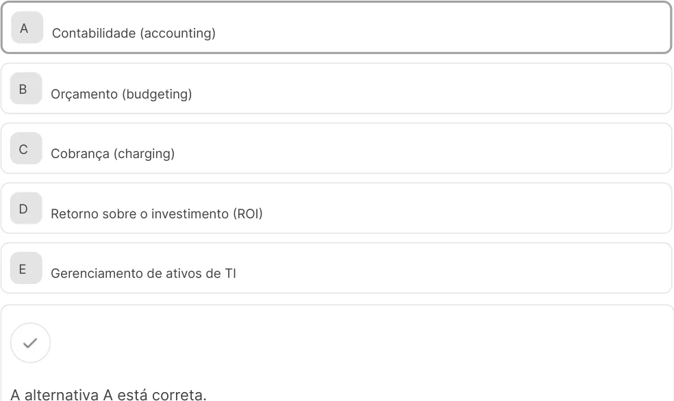
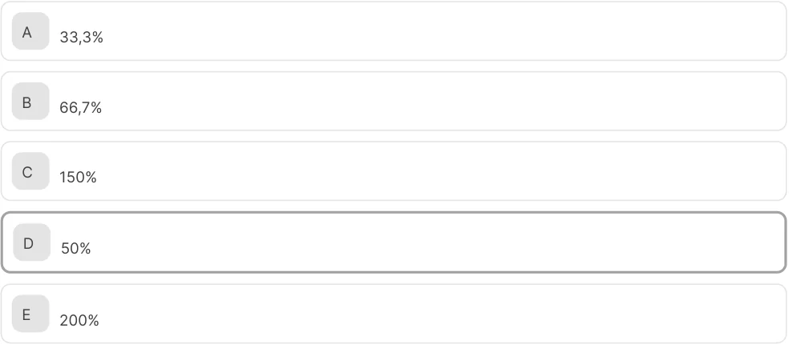

# GERENCIAMENTO OPERACIONAL 

Você aprenderá a gerenciar a operação de TI de forma estratégica, equilibrando a demanda dos usuários com a capacidade da equipe e medindo o desempenho com indicadores (KPIs) relevantes. O foco será a gestão dos níveis de serviço com base na experiência do cliente. Este conhecimento é vital, pois o mercado busca profissionais que garantam a eficiência operacional e saibam demonstrar o retorno financeiro (ROI) dos investimentos em tecnologia. 

Prof. Sérgio Cardoso 

1. Itens iniciais 

##### Objetivos 

- Gerenciar a capacidade e o desempenho dos serviços de TI com base na demanda do negócio. 

- 

- Formular acordos de nível de serviço e de experiência com base em indicadores de desempenho (KPIs). 

- Calcular o retorno sobre o investimento (ROI) de projetos e serviços de tecnologia. 

- 

### Introdução 

Este vídeo destaca a importância de gerir a casa de máquinas da TI de forma estratégica, apresentando os principais pilares desse processo: o equilíbrio entre demanda e capacidade, a mensuração do desempenho por meio de KPIs, a gestão da experiência do cliente e a demonstração do retorno financeiro (ROI) dos investimentos em tecnologia. 

#### Conteúdo interativo 

Acesse a versão digital para assistir ao vídeo. 

1. Gestão da capacidade, demanda e desempenho 

## Contextualizando o ITIL 4 e suas práticas 

Antes de estudar as técnicas de gestão operacional, é necessário compreender o mapa que orienta as melhores práticas do mercado. Nesse contexto, você será apresentado ao ITIL 4, o framework de gerenciamento de serviços de TI mais adotado globalmente. Entender o que é o ITIL, sua filosofia orientada à geração de valor e o conceito de práticas constitui a base que dará coerência e significado a todo o conhecimento que você construirá a seguir.Neste vídeo, você conhecerá o ITIL 4, explorando sua filosofia orientada à geração de valor e a transição de um enfoque centrado em processos para uma abordagem baseada em práticas, o que fornece o contexto essencial para a compreensão dos conceitos que serão desenvolvidos. 

#### Conteúdo interativo 

Acesse a versão digital para assistir ao vídeo. 

Ao longo deste conteúdo, você verá menções constantes ao ITIL 4 e suas práticas. Mas o que é isso? O ITIL (Information Technology Infrastructure Library) não é uma ferramenta, um software ou um padrão rígido que deve ser seguido à risca. Ele é um framework, ou seja, um conjunto de orientações, conceitos e boas práticas de mercado para o gerenciamento de serviços de TI (ITSM). Pense nele como uma grande biblioteca de conhecimento que ajuda as organizações a usarem a tecnologia para criar valor real para o negócio. 

Sua versão mais recente, o ITIL 4, foi lançada em 2019, com uma grande evolução em relação às versões anteriores. Ele foi projetado para a era da transformação digital, sendo muito mais flexível, ágil e integrado a outras metodologias, como Lean, Agile e DevOps. O foco principal do ITIL 4 deixou de ser apenas a gestão de processos para se tornar a cocriação de valor, em colaboração direta com os clientes e stakeholders. 

Uma das mudanças mais importantes do ITIL 4 foi a substituição do conceito de processos pelo de práticas. Uma prática é mais do que um processo, ela é um conjunto de recursos organizacionais (pessoas, processos, tecnologias, informações, parceiros) projetados para realizar um trabalho ou atingir um objetivo. O ITIL 4 estabelece 34 

práticas de gerenciamento. Neste contexto, serão abordadas algumas das mais relevantes para a gestão operacional, com ênfase na gestão da capacidade e do desempenho, assim como na gestão do nível de serviço.O ITIL 4 abrange diversas outras áreas importantes para a gestão de TI, incluindo algumas das práticas mais conhecidas, que você verá a seguir. 

Service desk 

Gerenciamento de incidentes 

Consiste em um ponto único de contato entre a TI e seus usuários. 

Restaura os serviços o mais rápido possível após uma falha. 

Gerenciamento de mudanças 

Possibilita que as mudanças no ambiente de TI sejam feitas com o mínimo de risco e impacto negativo. 

Gerenciamento de segurança da informação Protege a organização e suas informações contra ameaças. 

## Atividade 1 

Com base na filosofia do ITIL 4, qual das seguintes afirmações melhor descreve o que é uma prática de gerenciamento? 

- A Um conjunto de recursos organizacionais (como pessoas e processos) usados para realizar um trabalho ou atingir um objetivo. 

- B Um software específico que deve ser adquirido para automatizar as tarefas da equipe de tecnologia da informação. 

- C Um conjunto de regras rígidas e processos que devem ser implementados de forma idêntica em todas as organizações. 

- D Um certificado obrigatório que todos os profissionais de TI precisam ter para atuar no mercado de gerenciamento de serviços. 

- E Um sinônimo para um processo técnico, focado exclusivamente nas atividades de configuração da infraestrutura. 

#### A alternativa A está correta. 

A alternativa correta define prática como um conjunto de recursos organizacionais, em consonância com a abordagem holística adotada pelo ITIL 4. As demais opções estão incorretas, pois o ITIL 4 não se caracteriza como um software, não é um framework rígido, não se trata de um certificado obrigatório — embora existam certificações — e compreende a prática como um conceito mais amplo do que um simples processo técnico. 

## Entendendo a demanda e a capacidade na prática de TI 

O equilíbrio é a chave para a eficiência. De um lado, temos as necessidades do negócio, que geram uma demanda constante por serviços de TI. Do outro, a capacidade da equipe e da infraestrutura para atender a essa demanda. Compreender a dinâmica entre esses dois conceitos é o primeiro passo para evitar sobrecargas, ociosidade e, principalmente, a insatisfação dos clientes. Este conhecimento teórico é a base para uma gestão de recursos inteligente e proativa. 

Neste vídeo, você conhecerá os conceitos fundamentais de demanda e capacidade em TI. Por meio de exemplos práticos, o conteúdo demonstra os riscos do desequilíbrio entre esses fatores, como a sobrecarga, que provoca insatisfação, e a ociosidade, que leva ao desperdício de recursos financeiros. 

#### Conteúdo interativo 

Acesse a versão digital para assistir ao vídeo. 

Toda operação de TI funciona sobre uma balança com dois pratos: a demanda e a capacidade. A seguir, você vai entender como cada um desses elementos se relaciona e influencia o desempenho da área de TI. Vamos lá! 

##### Demanda 

Refere-se a toda a carga de trabalho que chega para a TI. Ela não se limita apenas a incidentes ou problemas (“o sistema caiu"), incluindo também requisições de novos serviços, projetos de melhoria e consultas de usuários. Sua principal característica é a volatilidade, com picos em determinados horários ou épocas do ano, como no fechamento fiscal ou na Black Friday. 

É importante entender que a demanda pode ser categorizada. Uma parte dela vem de atividades que agregam valor direto, como desenvolver um novo produto ou implementar um sistema que aumenta as vendas. Outra parte, no entanto, é a demanda de falha (failure demand), que consiste no trabalho que só existe porque algo não funcionou como deveria: resolver bugs, atender reclamações ou corrigir erros de processos anteriores. Um dos objetivos da gestão é justamente reduzir a demanda de falha para liberar capacidade para atividades que impulsionam o negócio. 

##### Capacidade 

Representa o máximo de carga de trabalho que a TI consegue suportar, mantendo os níveis de qualidade acordados. Essa capacidade não se restringe aos aspectos tecnológicos, como o poder de processamento dos servidores, mas engloba também o fator humano, representado pelo número de analistas disponíveis e por suas competências. 

O grande desafio do gerenciamento operacional é manter essa balança equilibrada, pois o desequilíbrio gera problemas que afetam diretamente o negócio. Quando a demanda é maior que a capacidade, a equipe fica sobrecarregada, o tempo de resposta aumenta, a qualidade do serviço cai e a satisfação do cliente despenca. Em contrapartida, uma capacidade muito maior que a demanda, embora pareça confortável, representa um desperdício de recursos. Os servidores ociosos e as licenças de software não utilizadas são custos que não geram retorno, corroendo o lucro da operação. 

#### Atenção 

O gerenciamento eficaz busca prever a demanda e ajustar a capacidade de forma proativa, garantindo que o negócio sempre tenha os recursos de que precisa, no momento certo e com um custo otimizado. 

## Atividade 2 

Uma empresa de varejo on-line identifica que, durante a Black Friday, seu site apresenta lentidão significativa, o que resulta em perda de vendas. Ao longo do restante do ano, porém, o desempenho da plataforma é considerado excelente.Este cenário é um exemplo clássico de qual situação de gerenciamento operacional? 

- A Um problema de gestão financeira, pois a empresa não investiu em marketing adequado. 

- B Uma falha de governança, pois as políticas de segurança não foram aplicadas de forma correta. 

- C Um desequilíbrio onde a capacidade da infraestrutura é insuficiente para atender a um pico de demanda sazonal. 

- D Uma situação de capacidade excessiva, onde os recursos de tecnologia são subutilizados. 

- E Um problema de gestão de fornecedores, indicando que o provedor de internet não cumpriu o contrato. 

#### A alternativa C está correta. 

A alternativa correta descreve com precisão o cenário em questão: a infraestrutura existente possui capacidade suficiente para a operação normal, mas torna-se inadequada diante de um aumento previsível e significativo de acessos, caracterizando um pico de demanda que resulta na degradação do serviço. As demais alternativas são pouco prováveis, pois o problema não se relaciona a ações de marketing, questões de segurança, excesso de recursos ou, necessariamente, a falhas contratuais do fornecedor, mas sim ao planejamento do equilíbrio entre demanda e capacidade. 

## A prática de gerenciamento da capacidade e do desempenho 

Uma vez que entendemos a importância do equilíbrio, precisamos de um método para alcançá-lo. A prática de gerenciamento da capacidade e do desempenho do ITIL 4 fornece esse método. Ela estrutura as atividades necessárias para garantir que os serviços atinjam os níveis de desempenho acordados, de forma econômica e 

sustentável. Dominar essa teoria permite planejar e provisionar recursos de forma estratégica, assegurando que a performance nunca seja um impeditivo para o sucesso do negócio. 

Neste vídeo, você aprenderá como o ITIL 4 orienta a garantia da performance esperada dos serviços. O conteúdo utiliza a analogia de uma rodovia para diferenciar capacidade, demanda e performance, além de explicar como a análise em três níveis — negócio, serviço e componente — permite um planejamento mais proativo. 

#### Conteúdo interativo 

Acesse a versão digital para assistir ao vídeo. 

A prática de gerenciamento da capacidade e do desempenho tem um propósito claro: garantir que os serviços atinjam os níveis de performance esperados, satisfazendo a demanda atual e futura de forma financeiramente viável. O foco aqui não é apenas a capacidade da infraestrutura (quantos servidores temos?), mas a performance do serviço do ponto de vista do cliente (o site está rápido e a transação é concluída sem demora?). A performance é o que o cliente realmente percebe e valoriza. 

#### Exemplo 

Imagine uma rodovia em funcionamento. A capacidade corresponde ao número de pistas disponíveis; a demanda, à quantidade de veículos que desejam utilizá-la em um determinado momento; e a performance, à velocidade com que esses veículos conseguem se deslocar, refletindo a experiência do motorista. Quando a demanda cresce significativamente, como nos horários de pico, e a capacidade não é suficiente para absorvê-la, a performance cai de forma acentuada, resultando em congestionamentos. 

A gestão de capacidade e desempenho atua como a concessionária de uma rodovia: monitora o tráfego em tempo real e analisa tendências de crescimento — como a construção de um novo bairro — para planejar a ampliação de pistas antes que o congestionamento se torne um problema crônico. 

Na área de TI, é essencial analisar o uso atual dos sistemas, prever o crescimento do negócio e garantir que os recursos — como servidores, redes e equipes — sejam adequados para suportar a demanda futura, sempre equilibrando custos e a experiência do usuário.Para que essa gestão seja eficaz, ela é realizada em três níveis de análise distintos, que você conhecerá a seguir. 

#### Negócio 

A análise foca as tendências e estratégias futuras da empresa. Por exemplo, a empresa planeja lançar um novo produto ou expandir para um novo mercado no próximo ano? Isso ajuda a prever a demanda em longo prazo. 

#### Serviço 

O foco aqui é a performance de um serviço de ponta a ponta, como ele é percebido pelo cliente. Monitora-se o tempo de resposta de um site de e- commerce ou o tempo para processar uma transação de pagamento, por exemplo. 

#### Componente 

Esta é a análise mais técnica, focada na utilização dos recursos individuais de infraestrutura, como o uso da CPU de um servidor, o espaço em disco ou a largura de banda da rede. 

Uma boa gestão integra a análise desses três níveis para tomar decisões informadas, garantindo que os recursos técnicos estejam sempre alinhados às necessidades do negócio e à experiência do cliente. 

## Atividade 3 

Antes de lançar uma grande campanha de marketing que deve aumentar de forma significativa o número de acessos simultâneos ao seu portal de e-commerce, a equipe de TI analisa os dados de uso atuais e projeta o impacto do aumento de tráfego. Com base nessa análise, eles provisionam mais recursos de servidor para garantir que o site permaneça rápido e estável durante a campanha.A ação proativa da equipe de TI é um exemplo de 

A uma resposta reativa a uma falha, executada após a degradação do serviço. 

B uma gestão que antecipa o aumento da demanda para manter a performance do serviço. 

- C uma atividade de aquisição de tecnologia, focada no ciclo de compras da empresa. D uma atualização de segurança para proteger o portal contra ameaças durante a campanha. 

- E um programa de treinamento para a equipe sobre os limites técnicos da plataforma. 

#### A alternativa B está correta. 

A alternativa correta apresenta com clareza a essência da prática, que consiste em atuar de forma proativa para assegurar que os serviços alcancem o desempenho necessário diante de demandas futuras. Não se trata de reagir a falhas, adquirir equipamentos sem direcionamento estratégico, priorizar exclusivamente a segurança ou treinar usuários. O foco principal está no planejamento de recursos fundamentado em análises e previsões, garantindo a manutenção da performance dos serviços. 

## Prática de monitoramento e gerenciamento de eventos 

Não se pode gerenciar aquilo que não é visível. Para assegurar o desempenho dos serviços, é essencial acompanhar continuamente o estado da infraestrutura de TI. Nesse contexto, a prática de monitoramento e gerenciamento de eventos constitui a base dessa observação, pois permite compreender e interpretar o comportamento dos componentes tecnológicos. O estudo de seus conceitos é fundamental para detectar mudanças de estado, identificar falhas de forma proativa e acionar as respostas adequadas, estabelecendo assim a base de uma operação de TI estável e resiliente.Neste vídeo, você aprenderá como a TI monitora o que acontece em sua infraestrutura. O conteúdo define o que é um evento e apresenta os três tipos principais — informativo, aviso e exceção — mostrando como essa classificação permite que a equipe de TI atue de forma proativa para evitar falhas antes que elas impactem o negócio. 

#### Conteúdo interativo 

Acesse a versão digital para assistir ao vídeo. 

A prática de monitoramento e gerenciamento de eventos tem como propósito observar sistematicamente os serviços e seus componentes e registrar e relatar as mudanças de estado significativas, identificadas como eventos. Pense no monitoramento como os sentidos da sua operação de TI: ele é a visão, a audição e o tato que permitem perceber o que está acontecendo em tempo real. 

#### Atenção 

Um evento é qualquer mudança de estado que tenha relevância para o gerenciamento de um serviço ou de outro item de configuração. Por exemplo, a conclusão de um backup, um usuário fazendo login no sistema ou a utilização da CPU de um servidor ultrapassando 80% são todos eventos. 

A gestão de eventos filtra e analisa essa grande quantidade de informações para determinar a ação apropriada. Embora a maioria dos eventos seja rotineira e não exija intervenção, alguns podem indicar problemas ou oportunidades de melhoria, que podem ser classificados em três tipos principais, apresentados a seguir. 

##### Informativos 

Indicam uma operação normal. Por exemplo, "backup concluído com sucesso" ou "usuário X fez login". Geralmente, são apenas registrados. 

##### Avisos (warnings) 

Indicam que um limite foi atingido e uma ação pode ser necessária para evitar um impacto futuro. Por exemplo, espaço em disco atingiu 85% da capacidade. Isso permite uma ação proativa, como limpar arquivos antigos antes que o disco fique cheio e o serviço pare. 

##### Exceções (exceptions) 

Indicam que um serviço ou componente está operando de forma anormal e já existe um impacto (ou o impacto é iminente). Por exemplo, servidor web não está respondendo ou transação financeira falhou. Esse tipo de evento geralmente aciona a criação automática de um incidente para que a equipe de suporte investigue. 

Uma boa gestão de eventos é a base para uma operação proativa, permitindo que a TI identifique e resolva problemas antes que eles causem interrupções significativas para o negócio. 

##### Exemplo prático: a jornada de um evento 

Imagine um servidor web. Um evento Informativo ocorre a cada vez que um usuário faz login. Às 14h, o sistema gera um aviso (warning), pois o uso da CPU atingiu 85%, um limiar de risco. A equipe de TI, alertada, começa a investigar. Às 14h15, antes que a equipe possa agir, o uso da CPU atinge 100% e o servidor para de responder, gerando um evento de exceção. Este último evento, por sua vez, aciona automaticamente a abertura de um chamado de incidente crítico para a equipe de suporte. 

## Atividade 4 

O sistema de monitoramento de uma empresa gera um alerta automático para a equipe de TI informando que o uso de memória de um servidor crítico atingiu 90% de sua capacidade total. Embora o servidor ainda esteja funcionando, esse nível é considerado um limiar de risco.Como esse alerta deve ser classificado dentro da prática de gerenciamento de eventos? 

A Como incidente, uma vez que qualquer alerta já caracteriza uma falha no serviço. 

- B Como uma requisição de serviço, que deve entrar na fila de atendimento padrão. 

- C Como um evento informativo, que deve ser apenas registrado para futuras consultas. 

D Como um evento de exceção, indicando que o serviço já foi interrompido. 

E Como um evento de aviso, que sinaliza uma potencial falha futura e permite uma ação proativa. 

A alternativa E está correta. 

Trata-se de um cenário em que um limiar foi alcançado, mas o serviço ainda não apresentou falha, o que caracteriza um aviso (warning). Esse tipo de evento tem como objetivo permitir uma atuação proativa da equipe, prevenindo uma falha efetiva. 

2. Do nível de serviço à experiência do cliente 

## Prática de gerenciamento do nível de serviço (SLM) 

Para que a entrega de valor seja eficaz, é necessário que as expectativas entre a TI e o negócio estejam claras e alinhadas. A prática de gerenciamento do nível de serviço (SLM – service level management) é a ferramenta para criar esse alinhamento. Estudar seus conceitos é fundamental para aprender a definir, documentar e gerenciar os níveis de serviço esperados, garantindo que a performance da TI seja medida de forma objetiva e transparente, construindo uma relação de confiança com o cliente.Neste vídeo, você aprenderá o que é um acordo de nível de serviço (SLA) e sua importância para alinhar as expectativas entre a TI e o negócio. O conteúdo detalha o conceito SMART, usando um exemplo prático para mostrar como transformar uma necessidade de negócio em uma meta técnica, específica e mensurável. 

#### Conteúdo interativo 

Acesse a versão digital para assistir ao vídeo. 

A prática de gerenciamento do nível de serviço (SLM) tem o propósito de definir metas claras de nível de serviço e garantir que a entrega dos serviços seja devidamente avaliada, monitorada e gerenciada em relação a essas metas. Em outras palavras, o SLM traduz as necessidades do negócio em metas técnicas e mensuráveis para a TI.O principal artefato dessa prática é o acordo de nível de serviço (SLA – Service Level Agreement). Trata-se de um documento que formaliza as metas acordadas entre o provedor de serviços de TI e o cliente, descrevendo o serviço prestado e estabelecendo os critérios e métricas pelos quais seu desempenho será avaliado. 

Um bom SLA deve ser SMART. Vamos detalhar isso com um exemplo prático, como a disponibilidade do serviço de e-commerce. Acompanhe! 

#### S 

Specific (específico) 

A meta deve ser inequívoca. Em vez de o site ficar pouco tempo fora do ar, a meta específica é a disponibilidade do serviço de e-commerce. 

#### M 

Measurable (mensurável) 

A meta deve ser mensurável. Por exemplo, a disponibilidade pode ser avaliada pelo percentual de tempo em operação, estabelecendo como métrica um índice de 99,9% de disponibilidade. 

#### A 

##### Achievable (alcançável) 

A meta precisa ser realista com os recursos existentes. Uma meta de 100% de disponibilidade é praticamente inalcançável e teria um custo proibitivo. Já 99,99%, embora desafiadora, é considerada alcançável com a infraestrutura atual. 

#### R 

Relevant (relevante) 

A meta deve ser importante para o negócio. A disponibilidade do site de e- commerce está diretamente ligada à capacidade de gerar vendas. Portanto, esta métrica é essencial para o sucesso da empresa. 

#### T 

Time-bound (com prazo definido) A meta deve ter um período de apuração claro. Por exemplo, a disponibilidade de 99,9% será medida mensalmente, durante 24 horas por dia, 7 dias por semana. 

O SLM, não se limita a criar um documento. É uma prática contínua que envolve negociar os acordos, monitorar se as metas estão sendo cumpridas, relatar os resultados para os clientes e, quando necessário, tomar ações para melhorar o serviço e garantir que as expectativas do negócio sejam atendidas de forma consistente. 

## Atividade 1 

A equipe de TI de uma empresa cumpre rigorosamente seu acordo de nível de serviço (SLA) para o sistema de vendas, que promete uma disponibilidade de 99,5% do tempo, apurada mensalmente. No entanto, o departamento de vendas reclama de forma constante, pois as poucas falhas que ocorrem (totalizando 0,5% do tempo) acontecem sempre nos últimos dois dias do mês, que são os dias de pico de faturamento. Do ponto de vista do gerenciamento do nível de serviço (SLM), o que esse conflito demonstra? 

- A A equipe de vendas está equivocada em sua reclamação, pois os relatórios do SLA provam que a meta foi atingida. 

- B O problema é exclusivamente técnico, devendo ser resolvido com mais investimento em infraestrutura para atingir 100% de disponibilidade. 

- CO SLA, embora tecnicamente cumprido, falha por não ser relevante ao negócio, pois a métrica de disponibilidade mensal não captura o impacto crítico das falhas em horários específicos. 

- DA única solução para o problema é a equipe de TI ser penalizada financeiramente pelas falhas, independentemente do cumprimento da meta percentual. 

EA falha está na gestão de incidentes da equipe, sendo um problema operacional que não tem relação com a definição do acordo de nível de serviço. 

#### A alternativa C está correta. 

A alternativa correta destaca o aspecto mais estratégico do SLM: um SLA só tem valor se for relevante para o negócio (o “R” de SMART). O exemplo demonstra que, embora a meta percentual seja alcançada, ela oculta um problema crítico para a operação, evidenciando que a métrica escolhida é inadequada. A solução não é simplesmente culpar o cliente, buscar uma meta irrealista, aplicar punições ou tratar o problema como operacional, mas sim renegociar o SLA para incluir metas mais inteligentes, como garantir disponibilidade específica nos horários de pico. 

## Definindo métricas e indicadores de desempenho (KPIs) 

Para gerenciar o nível de serviço de forma eficaz, precisamos ir além das promessas e começar a medir. Mas o que medir? Você aprenderá a diferenciar métrica de indicador de desempenho (KPI). Compreender essa distinção é vital, pois enquanto as métricas nos dão dados, os KPIs nos dizem se estamos no caminho certo para atingir nossos objetivos. Neste vídeo, você entenderá a diferença fundamental entre métricas (dados brutos) e indicadores-chave de desempenho (KPIs), que medem o progresso em direção a um objetivo. O conteúdo utiliza uma analogia, como o painel de um carro, para mostrar como um KPI dá contexto a uma métrica e apoia a tomada de decisão. 

#### Conteúdo interativo 

Acesse a versão digital para assistir ao vídeo. 

No dia a dia da gestão de TI, os termos métrica e indicador de desempenho (KPI) são frequentemente usados como sinônimos, mas eles representam conceitos distintos. Entender essa diferença é o que separa uma gestão que coleta dados de uma gestão que toma decisões estratégicas. 

Uma métrica é um dado mensurável que fornece informações quantificáveis sobre determinado aspecto. É qualquer elemento que possa ser medido. Por exemplo: 

- Número de chamados resolvidos em um mês: 500. 

- 

- Tempo de atividade (uptime) de um servidor: 99,8%. 

- 

- Tempo médio para responder a um e-mail: 25 minutos. 

- 

Esses são dados brutos. Eles fornecem informações, mas não indicam, por si só, se os resultados são positivos ou negativos. Um indicador-chave de desempenho (KPI – Key Performance Indicator) é uma métrica vinculada a um objetivo de negócio. Ele responde à pergunta: “Estamos no caminho certo para atingir nossa meta?” e oferece contexto, permitindo medir o progresso rumo a um resultado desejado. Um KPI é uma métrica que realmente faz a diferença. 

#### Exemplo 

Pense no painel de um carro: a velocidade atual, como 80 km/h, representa uma métrica. Já o KPI seria algo como "manter a velocidade dentro do limite legal da via, por exemplo, 110 km/h". Enquanto o velocímetro fornece o dado bruto, o KPI oferece o contexto necessário para tomar uma decisão — seja manter, acelerar ou frear. 

Nem toda métrica constitui um KPI. Uma organização pode acompanhar centenas de métricas, mas deve definir apenas alguns KPIs, aqueles realmente essenciais para o sucesso de um serviço ou de um objetivo estratégico. Por exemplo, se a meta da empresa é aumentar a satisfação do cliente com o suporte, o número total de chamados (métrica) pode ser menos relevante do que a porcentagem de chamados resolvidos no primeiro contato, que se torna um forte candidato a KPI.Veja a seguir como os KPIs podem ser de diferentes naturezas: 

Indicadores de eficácia Indicadores de eficiência Medem o sucesso em atingir o Medem o grau de eficiência na utilização dos resultado esperado. Como exemplo, recursos, sendo um exemplo representativo considera-se o percentual de satisfação o custo por chamado resolvido. do cliente. 

Com base no que acabamos de aprender, podemos concluir que uma boa gestão busca o equilíbrio entre ambos. 

## Atividade 2 

A equipe de TI de uma empresa definiu como objetivo estratégico para o trimestre aumentar a eficiência e a agilidade da equipe de suporte. Para medir o progresso em direção a esse objetivo, o gestor precisa escolher um KPI relevante. 

Diante desse cenário, qual representa o melhor exemplo de um KPI para esse objetivo específico? 

A O número total de computadores e notebooks gerenciados pela empresa. 

B O percentual de chamados resolvidos logo no primeiro contato da equipe. 

- C O custo mensal da licença da ferramenta de help desk utilizada pelo time. 

- D O número total de chamados de suporte abertos durante o último mês. 

- E A marca dos servidores utilizados no data center principal da companhia. 

#### A alternativa B está correta. 

A alternativa correta é o único item que atua como um indicador-chave de desempenho para o objetivo de aumentar a eficiência e a agilidade. Um alto percentual de resoluções no primeiro contato demonstra que a equipe está solucionando problemas de maneira rápida e eficaz. As demais opções, embora representem dados mensuráveis, não refletem o progresso em relação ao objetivo definido: o número de equipamentos, o custo da ferramenta, o volume de chamados e a marca dos servidores constituem apenas informações operacionais, sem caracterizar indicadores de desempenho para a meta proposta. 

## O alinhamento estratégico dos KPIs e a demonstração de valor 

Definir KPIs é apenas o primeiro passo. Para que realmente tenham valor, eles devem estar alinhados ao que a organização considera sucesso. Você aprenderá a conectar os indicadores de TI aos objetivos estratégicos do negócio, transformando a TI de um centro de custos técnicos em um verdadeiro parceiro estratégico, capaz de comunicar seu valor de forma clara e incontestável.Neste vídeo, você verá como conectar os KPIs da TI diretamente aos objetivos estratégicos da empresa. O conteúdo apresenta a lógica de cascata (objetivo de negócio > estratégia de TI > KPI de TI), mostrando como a TI pode provar seu valor ao mudar a conversa de performance técnica para impacto no negócio. 

#### Conteúdo interativo 

Acesse a versão digital para assistir ao vídeo. 

Um dos maiores erros na gestão de TI é medir o sucesso com métricas de vaidade. Por exemplo, celebrar que os servidores tiveram 99,999% de uptime quando o verdadeiro problema da empresa é a lentidão de um sistema de vendas. Os KPIs só têm valor real quando refletem os objetivos do negócio. Se a meta da empresa é aumentar a retenção de clientes, a TI deve escolher KPIs que meçam sua contribuição para essa meta, como o tempo médio de resolução de problemas do cliente ou a disponibilidade do portal do cliente. 

O alinhamento estratégico dos KPIs segue uma lógica de cascata. Conheça a seguir como ela se desdobra nos próximos níveis. 

#### Objetivo de negócio 

O que a empresa quer alcançar, como, por exemplo, aumentar a receita em 15% ao longo deste ano, ampliando sua participação no mercado e fortalecendo seus resultados financeiros. 

#### Estratégia de TI 

Como a TI pode contribuir para esse objetivo, a exemplo de garantir que a plataforma de e-commerce seja estável e performática para suportar um maior volume de vendas. 

#### KPIs de TI 

Como vamos medir o sucesso dessa contribuição, tais como o KPI 1, manter a disponibilidade do site em 99,95% durante o horário comercial, e o KPI 2, garantir que o tempo de carregamento da página de produto seja inferior a 1,5 segundos. 

Ao criar essa conexão clara, a TI para de apresentar relatórios técnicos que só fazem sentido para a própria equipe e passa a demonstrar seu impacto direto nos resultados da empresa. Em vez de dizer que os servidores estão ótimos, a TI pode dizer que garante a performance da plataforma que gerou R$ 5 milhões em vendas no último mês, superando a meta. Essa mudança de linguagem e de foco é o que legitima os investimentos em tecnologia e posiciona a TI como um parceiro estratégico essencial. 

## Atividade 3 

O objetivo estratégico de uma empresa é melhorar a satisfação e a fidelidade de seus clientes. A equipe de TI deseja definir um KPI que demonstre sua contribuição direta para essa meta de negócio.Qual das seguintes opções seria o KPI mais alinhado a esse objetivo de negócio? 

A O tempo médio que um cliente leva para ter seu problema técnico resolvido de forma definitiva. 

- B O número de atualizações de segurança aplicadas nos servidores no último mês. C O percentual de utilização da capacidade de processamento do principal banco de dados da empresa. 

- D O custo total gasto com licenças de software para as estações de trabalho dos funcionários. 

- E O número de novos funcionários contratados para a equipe de infraestrutura de TI. 

#### A alternativa A está correta. 

A alternativa correta é a única que avalia diretamente um fator que influencia a satisfação e a fidelidade do cliente. Um tempo de resolução rápido e eficiente está associado a uma experiência positiva com a marca. As demais opções representam métricas operacionais ou financeiras de TI que, embora relevantes para a gestão interna, não evidenciam de maneira clara e direta como a tecnologia contribui para os objetivos estratégicos do negócio. 

## Além dos SLAs: medindo a experiência do cliente (XLA) 

Cumprir todas as metas de um SLA é importante, mas não garante a satisfação do cliente. O futuro da gestão de serviços está em avaliar a percepção e o sentimento do usuário. É nesse contexto que surge o acordo de nível de experiência (XLA). Compreender esse conceito prepara o profissional para ir além das métricas técnicas e concentrar-se no que realmente importa: a experiência do cliente ao utilizar o serviço.Neste vídeo, você acompanhará a evolução da medição de serviços, comparando o SLA, que avalia o que é entregue, com o XLA, que mede como o cliente se sente. O conteúdo mostra por que cumprir metas técnicas não garante a satisfação do usuário e como priorizar a experiência do cliente representa o caminho futuro da gestão de serviços. 

#### Conteúdo interativo 

Acesse a versão digital para assistir ao vídeo. 

Por muitos anos, o acordo de nível de serviço (SLA) foi a principal referência para avaliar o desempenho da TI. No entanto, seu foco está em medir o que é entregue, e não como o serviço é efetivamente prestado. 

É possível, por exemplo, que um SLA prometa resolver incidentes em até 4 horas e a TI cumpra essa meta. No entanto, se durante essas 4 horas o cliente precisou ligar três vezes, foi transferido entre diferentes analistas e recebeu informações conflitantes, sua experiência foi péssima, mesmo que o SLA tenha sido tecnicamente cumprido.Para resolver essa lacuna, surgiu o acordo de nível de experiência, ou XLA (experience level agreement). O XLA é um acordo focado em medir os sentimentos, a percepção e o resultado real do cliente ao usar um serviço. Ele complementa o SLA, trazendo a perspectiva humana para a gestão. 

Enquanto o SLA usa métricas técnicas (os tijolos do serviço), o XLA usa pontos de contato da experiência (os Xperience Points ou XPs) para medir a jornada do cliente. 

Veja a diferença a seguir. 

Métrica de SLA 

Métrica de XLA 

Disponibilidade do sistema foi de 99,9%. 

Em uma escala de 1 a 5, quão fácil foi para você concluir a tarefa desejada no sistema? 

Métrica de SLA 

Métrica de XLA 

Tempo de resolução do chamado foi de 3 horas e 50 minutos (dentro da meta de 4 horas). 

O analista demonstrou empatia e conhecimento para resolver seu problema? (medido por uma pesquisa de satisfação pós-atendimento). 

A gestão moderna combina SLAs e XLAs. Pense em um serviço de entrega de pizza. O SLA garante que a pizza chegará em até 30 minutos. O XLA garante que a pizza chegará quente, o entregador será cordial e a embalagem estará intacta. A seguir, veja como cada um desses conceitos avalia o serviço sob perspectivas diferentes. 

XLAs SLAs Mede a qualidade da experiência Mede a promessa técnica. real. 

Os SLAs garantem que a casa (a infraestrutura e os processos) esteja em ordem. Os XLAs garantem que o morador (o cliente) se sinta bem dentro dela. A pergunta "quão fácil foi para você obter a ajuda?" é um exemplo clássico de uma métrica de experiência conhecida como CES (customer effort score – pontuação de esforço do cliente). 

Quanto menos esforço o cliente precisa fazer para ter seu problema resolvido, melhor será sua percepção sobre o serviço e maior será sua lealdade à marca. 

Além do CES, duas outras métricas são amplamente usadas para medir a experiência. Veja a seguir! 

CSAT (customer satisfaction score NPS (net promoter score) Mede a satisfação com uma interação Mede a lealdade do cliente à marca ou serviço específica, geralmente com a pergunta "qual com a pergunta "em uma escala de 0 a 10, o seu nível de satisfação com o atendimento quanto você recomendaria nosso serviço a um recebido?". amigo?". 

Ao priorizar a experiência, a TI assegura que não entrega apenas tecnologia, mas oferece valor percebido e apreciado tanto pelo negócio quanto pelos seus usuários. 

## Atividade 4 

Após um atendimento de suporte, um usuário recebe uma pesquisa rápida com a seguinte pergunta: Em uma escala de 1 a 5, quão fácil foi para você obter a ajuda de que precisava hoje? A medição realizada por essa pergunta é um exemplo clássico de um indicador usado para qual tipo de acordo? 

A Um acordo de nível operacional (OLA), que mede o desempenho entre equipes internas da TI. 

- B Um acordo de nível de serviço (SLA), focado em metas técnicas como tempo de atividade. 

C Um contrato de subjacência (UC), que rege a relação com um fornecedor externo. 

D Um acordo de nível de experiência (XLA), focado na percepção e sentimento do usuário. 

E Um indicador-chave de risco (KRI), que mede a probabilidade de ocorrência de uma falha. 

#### A alternativa D está correta. 

A alternativa correta reflete o foco da pergunta, que não é medir um aspecto técnico (como tempo de resolução ou disponibilidade), mas a percepção de esforço e facilidade do usuário durante a jornada de suporte. Essa medição da experiência subjetiva do cliente é a principal característica de um XLA, que complementa as métricas puramente técnicas de um SLA. As outras opções se referem a outros tipos de acordos ou indicadores com finalidades distintas. 

3. Gestão financeira dos serviços de TI 

## Fundamentos da gestão financeira em TI 

Falar de tecnologia é, inevitavelmente, falar de dinheiro. Para que a TI atue de forma estratégica, ela precisa gerenciar seus recursos financeiros com a mesma disciplina que gerencia seus servidores. Você conhecerá os três pilares da gestão financeira de TI: orçamento, contabilidade e cobrança. Dominar esses conceitos é o que permite à TI planejar seus investimentos, entender seus custos e demonstrar sua eficiência financeira para o negócio.Neste vídeo, você conhecerá os três pilares da gestão financeira de TI. O conteúdo explica de forma clara o papel do orçamento (planejar gastos), da contabilidade (entender para onde o dinheiro foi) e da cobrança (influenciar o consumo), mostrando como essas atividades dão visibilidade e sustentação às decisões de investimento. 

#### Conteúdo interativo 

Acesse a versão digital para assistir ao vídeo. 

A prática de gerenciamento financeiro de serviços do ITIL 4 tem como objetivo apoiar as estratégias e o planejamento da organização, assegurando a alocação e o uso eficiente dos recursos financeiros. Mais do que controlar gastos, essa prática oferece visibilidade sobre os custos e facilita decisões estratégicas relacionadas a investimentos em tecnologia.Essa prática se sustenta em três atividades principais, que você conhecerá a seguir. 

##### Orçamento (budgeting) 

Esta é a atividade de prever e controlar os gastos da organização. Em TI, o orçamento é um plano que estima quanto dinheiro será necessário para financiar os serviços e projetos durante um período, geralmente um ano. Um bom orçamento não é apenas uma lista de despesas; ele é uma negociação. A TI precisa justificar os recursos que está pedindo (ex.: precisamos de R$ 200 mil para um novo servidor de banco de dados para suportar o crescimento esperado do e-commerce), e o negócio precisa garantir que esses investimentos estejam alinhados às suas prioridades. 

##### Contabilidade (accounting) 

Se o orçamento é o planejamento, a contabilidade é o registro. Esta atividade consiste em identificar e alocar todos os custos da TI. O objetivo é entender para onde o dinheiro está indo. Quanto custa manter o serviço de e-mail? Qual o custo total do sistema de vendas, incluindo licenças, suporte e infraestrutura? Ao responder essas perguntas, a contabilidade de custos permite que a organização entenda a real lucratividade de seus produtos e serviços e identifique oportunidades de otimização. Essa análise de custos está diretamente ligada ao conceito de custo total de propriedade (TCO). Ao avaliar uma nova tecnologia, não se deve olhar apenas o preço de compra, mas o custo total ao longo de sua vida útil, que inclui manutenção, suporte, treinamento e eventuais custos de desativação. A contabilidade de serviços ajuda a tornar o TCO visível. 

Cobrança (charging) 

Esta é a atividade opcional de cobrar dos departamentos de negócio pelos serviços de TI que eles consomem. A cobrança pode ter vários modelos, desde um simples rateio de custos até um modelo de preços por unidade de serviço (ex.: R$ 50 por caixa de e-mail). O principal objetivo da cobrança não é dar lucro para a TI, mas influenciar o comportamento do consumidor. Ao saber quanto um serviço custa, os departamentos de negócio tendem a usá-lo de forma mais consciente, evitando o desperdício de recursos caros. 

## Atividade 1 

A equipe de TI de uma empresa calcula o custo total para manter o serviço de CRM, somando os gastos com licenças de software, horas de suporte da equipe e o custo da infraestrutura de servidores dedicada. O objetivo é apresentar ao departamento de vendas o custo real do serviço que eles utilizam.Esta atividade de apuração de custos é um exemplo de qual pilar da gestão financeira de TI? 

<!-- Start of picture text -->
A Contabilidade (accounting) B Orçamento (budgeting) C Cobrança (charging) D Retorno sobre o investimento (ROI) E Gerenciamento de ativos de TI A alternativa A está correta. <!-- End of picture text -->

A contabilidade (ou accounting) no contexto da gestão financeira de TI consiste em identificar e alocar os custos aos serviços que os consomem. Essa atividade não envolve planejar gastos futuros (orçamento), cobrar pelo serviço (cobrança) ou medir o retorno de um investimento (ROI). Trata-se, antes, do passo fundamental para compreender exatamente para onde o dinheiro foi direcionado. 

## Calculando o retorno sobre o investimento em projetos de TI 

Todo investimento em tecnologia precisa se justificar. O retorno sobre o investimento, ou ROI, é a métrica financeira mais utilizada para medir a eficiência de um investimento. Aprender a calcular e interpretar o ROI é uma habilidade para o profissional de TI, pois permite comparar diferentes opções de investimento e demonstrar, em números, o benefício financeiro que a tecnologia traz para o negócio.Neste vídeo, você aprenderá de forma prática como calcular o retorno sobre o investimento (ROI). O conteúdo apresenta a fórmula e, em seguida, aplica-a em um exemplo numérico simples, como um projeto de automação, mostrando passo a passo como transformar custos e economias em uma porcentagem clara de retorno. 

#### Conteúdo interativo 

Acesse a versão digital para assistir ao vídeo. 

O retorno sobre o investimento (ROI) é um indicador de desempenho que mede quanto lucro ou economia um investimento gerou em relação ao seu custo. É uma forma simples de responder à pergunta: para cada real que investimos neste projeto, quantos reais ganhamos de volta? O resultado é geralmente expresso em porcentagem. 

A fórmula básica para o cálculo do ROI é apresentada a seguir. 

Onde, a seguir, você poderá compreender o significado de cada elemento da fórmula. 

Receita obtida Custo do Investimento É um ganho direto, como o aumento nas É o valor total gasto para implementar o projeto, vendas, ou uma economia, como a redução dos incluindo hardware, software, licenças e horas custos operacionais. de trabalho. 

Embora a fórmula seja simples, o grande desafio do cálculo do ROI está na coleta dos dados. É necessário disciplina para identificar todos os custos reais do investimento (que podem incluir horas de treinamento e quedas temporárias de produtividade) e, principalmente, para medir de forma realista a receita ou economia gerada. 

Um cálculo de ROI só é confiável se os dados que o alimentam forem precisos. 

Vamos a um exemplo prático para solidificar o conceito calculando o ROI de um projeto de automação. Imagine que o departamento de TI propõe um projeto para automatizar um processo manual no setor financeiro. Acompanhe! 

Custo do investimento Receita obtida 

O custo total para adquirir o software de Após um ano, a empresa calcula que a automação e para a equipe implementá-lo é de automação eliminou a necessidade de horas R$ 50.000. extras e reduziu erros manuais, gerando uma economia líquida de R$ 80.000 no período. 

Agora, você acompanhará a aplicação da fórmula para entender como ela funciona na prática.1. Calculamos o ganho líquido. 

(economia) - (custo) . 

2. Dividimos o ganho líquido pelo custo do investimento. 

3. Multiplicamos por 100 para obter a porcentagem. 

O ROI do projeto foi de 60%. Isso significa que, para cada real investido, a empresa obteve um retorno de 60 centavos, além do próprio real investido. Essa métrica permite ao gestor comparar este projeto com outros e tomar decisões baseadas em dados financeiros concretos. 

## Atividade 2 

Uma empresa investiu R$ 20.000 em um novo sistema de CRM para a equipe de vendas. Ao final do primeiro ano, a empresa calculou que o novo sistema foi responsável por um aumento de R$ 30.000 nas receitas de vendas. 

Qual foi o retorno sobre o investimento (ROI) deste projeto? 

<!-- Start of picture text -->
A 33,3% B 66,7% C 150% D 50% E 200% <!-- End of picture text -->

#### A alternativa D está correta. 

Para calcular o ROI, subtraímos o custo do ganho: R$ 30.000 (ganho) - R$ 20.000 (custo) = R$ 10.000 (ganho líquido). Em seguida, dividimos o ganho líquido pelo custo do investimento: R$ 10.000 / R$ 20.000 = 0,5. Multiplicando por 100, chegamos a um ROI de 50%. Isso demonstra que o projeto gerou um retorno financeiro de 50% sobre o valor que foi investido. 

## Justificativa de investimentos e demonstração do valor para o negócio 

Saber calcular o ROI é importante, mas saber comunicar e vender o valor de um projeto é o que realmente diferencia um profissional de TI estratégico. Um número isolado, por si só, nem sempre é suficiente para convencer a diretoria. Por isso, é essencial construir um argumento de valor que vá além do ROI, considerando benefícios indiretos e alinhando a proposta de investimento de forma clara e consistente aos objetivos estratégicos da empresa.Neste vídeo, você aprenderá como construir um argumento de valor que vai além do cálculo financeiro. O conteúdo destaca a importância de considerar benefícios intangíveis, como a redução de riscos e o ganho de agilidade, mostrando como um caso de negócio completo transforma a TI em um parceiro de inovação. 

#### Conteúdo interativo 

Acesse a versão digital para assistir ao vídeo. 

Apresentar um ROI positivo é o primeiro passo para justificar um investimento, mas o verdadeiro desafio é construir um caso de negócio (business case) convincente.  Um caso de negócio é um documento que vai além da simples apresentação de números, pois constrói a narrativa do valor que o projeto irá gerar. Para isso, além das análises financeiras, deve também contemplar os benefícios intangíveis envolvidos. 

Nem todo valor pode ser medido em reais. Muitos benefícios de um projeto de TI são indiretos ou intangíveis, mas ainda assim importantes para o sucesso do negócio. Ao justificar um investimento, é necessário destacar também esses ganhos, que você conhecerá a seguir por meio de alguns exemplos. 

##### Melhoria na satisfação do cliente 

Um novo portal de autoatendimento pode não aumentar a receita diretamente, mas melhora a experiência do cliente, o que impacta a fidelidade a longo prazo. 

##### Redução de riscos 

Um investimento em segurança cibernética tem um ROI difícil de calcular, mas seu valor está em evitar o custo gigantesco de uma violação de dados. 

##### Melhoria na tomada de decisão 

Um novo sistema de business intelligence (BI) pode não gerar receita, mas fornece dados de melhor qualidade para os gestores, levando a decisões mais inteligentes e estratégicas. 

##### Aumento da agilidade e flexibilidade 

Uma nova infraestrutura em nuvem pode permitir que a empresa lance novos produtos no mercado mais rapidamente que seus concorrentes. 

Ao combinar o cálculo do ROI com a argumentação sobre os benefícios intangíveis, o profissional de TI consegue demonstrar o valor total do investimento. Ele mostra que não está apenas pedindo dinheiro para comprar tecnologia, mas propondo uma solução que tornará a empresa mais eficiente, segura, ágil e competitiva. Essa abordagem transforma a TI de um centro de custos em um verdadeiro motor de inovação e valor para o negócio. 

#### Atenção 

A capacidade de construir uma narrativa de valor — combinando dados financeiros sólidos (o ROI) com uma argumentação clara sobre os benefícios estratégicos e intangíveis — é o que efetivamente transforma um gestor de TI em um líder de negócio influente e respeitado. 

## Atividade 3 

A equipe de TI propõe um projeto para migrar os sistemas da empresa para um provedor de nuvem. O cálculo do ROI financeiro direto é modesto. No entanto, o gestor de TI argumenta que o principal benefício do projeto é que a empresa poderá lançar novos produtos e serviços três vezes mais rápido que seus concorrentes.Como esse argumento sobre a velocidade de lançamento deve ser classificado na justificativa do investimento? 

A Como um benefício direto e financeiro, que pode ser facilmente calculado no ROI. 

- B Como um benefício intangível, relacionado ao aumento da agilidade e da vantagem competitiva do negócio. 

- C Como um custo do investimento, pois exigirá horas de trabalho da equipe de desenvolvimento. 

- D Como um risco do projeto, pois a velocidade pode comprometer a qualidade da entrega. 

- E Como uma métrica de vaidade, pois não tem impacto real nos resultados da empresa. 

#### A alternativa B está correta. 

A alternativa correta identifica o argumento como um benefício intangível. A capacidade de ser mais ágil e rápido que a concorrência é um valor estratégico imenso, mas é difícil de quantificar em um cálculo de ROI direto (A).  Não se trata de um custo — embora envolva riscos que precisam ser gerenciados —, nem de uma métrica de vaidade, uma vez que impacta diretamente a competitividade da organização. Assim, configura-se como um ganho estratégico que complementa e enriquece a análise financeira. 

4. Conclusão 

## Considerações finais 

- A importância de equilibrar a demanda do negócio com a capacidade da TI. 

- 

- O papel da gestão de capacidade e desempenho para garantir a performance dos serviços. 

- 

- Como o monitoramento de eventos permite uma operação de TI mais proativa. 

- 

- A função do acordo de nível de serviço (SLA) para alinhar expectativas com o negócio. 

- 

- A diferença entre uma métrica operacional e um indicador-chave de desempenho (KPI). 

- 

- Como alinhar os KPIs de TI aos objetivos estratégicos da empresa. 

- 

- A importância de medir a experiência do cliente (XLA) além das métricas técnicas. 

- 

- Os três pilares da gestão financeira em TI: orçamento, contabilidade e cobrança. 

- 

- Como calcular o retorno sobre o investimento (ROI) de um projeto de tecnologia. 

- 

- A importância de argumentar sobre benefícios intangíveis para justificar investimentos. 

- 

#### Podcast 

Vamos ouvir um breve resumo de todo o assunto aqui tratado. 

#### Conteúdo interativo 

Acesse a versão digital para ouvir o áudio. 

##### Explore + 

Veja os materiais que separamos especialmente para você! 

Confira o site Gartner - Key Performance Indicators (KPIs), que consiste em uma das principais fontes de pesquisa e tendências em tecnologia. Esta seção de seu site oferece uma visão sobre como o mercado está utilizando KPIs para medir o sucesso e impulsionar a transformação digital. É uma excelente fonte para entender quais indicadores são mais relevantes para diferentes setores e objetivos de negócio. 

Leia o livro Measure what matters, de John Doerr. Esta obra é referência mundial sobre o sistema de metas OKR (objectives and key results), que é uma evolução natural da gestão por KPIs. Trata-se de uma leitura essencial para quem quer levar a definição de indicadores a um nível estratégico. 

A obra Administração de serviços: operações, estratégia e tecnologia da informação, de James A. Fitzsimmons e Mona J. Fitzsimmons, apresenta uma base teórica robusta sobre temas como gestão da capacidade, qualidade em serviços e a interseção entre operações e estratégia, complementando os conceitos do ITIL com uma visão de administração de negócios. 

Leia o livro Gestão do relacionamento e customer experience - A revolução na experiência do cliente, de Roberto Madruga. A obra detalha métodos e estratégias para ir além dos SLAs e começar a medir e gerenciar a jornada e a percepção do cliente, aprofundando o conceito de XLA que introduzimos. 

O livro Indicadores de desempenho: dos objetivos à ação – métodos para elaborar KPIs e obter resultados, de Andresa S. N. Francischini e Paulo G. P. Francischini, é uma referência nacional e um guia prático completo sobre a criação de KPIs. Os autores detalham como traduzir os objetivos estratégicos de uma empresa em indicadores que realmente medem o progresso e geram resultados. 

##### Referências 

ALBERTIN, A. L. Tecnologia da informação e desempenho empresarial. Rio de Janeiro: Atlas, 2010. 

AXELOS. ITIL Foundation, ITIL 4 Edition. London: TSO (The Stationery Office), 2019. 

AXELOS. ITIL 4: Drive Stakeholder Value. London: TSO (The Stationery Office), 2020. 

AXELOS. ITIL 4: High-velocity IT. London: TSO (The Stationery Office), 2020. 

FITZSIMMONS, J. A.; FITZSIMMONS, M. J. Administração de serviços: operações, estratégia e tecnologia da informação. São Paulo: AMGH, 2014. 

FRANCISCHINI, A. S. N.; FRANCISCHINI, P. G. P. Indicadores de desempenho: dos objetivos à ação – métodos para elaborar KPIs e obter resultados. Rio de Janeiro: Alta Books, 2017. 

HUBBARD, D. W. How to measure anything: finding the value of intangibles in business. Hoboken, NJ: John Wiley & Sons, 2014. 
