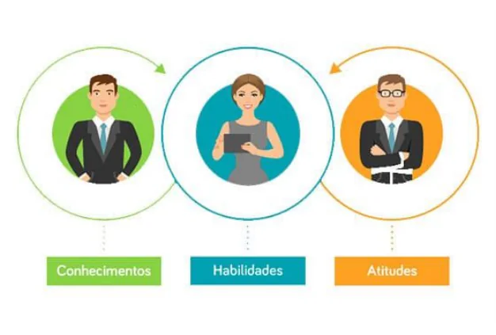
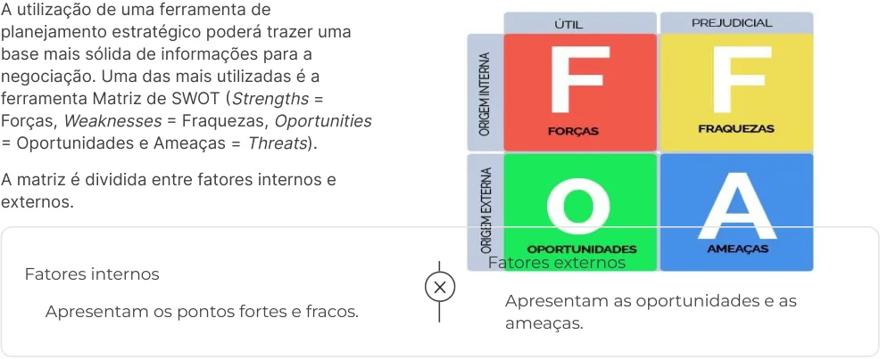

# Gestão de stakeholder 

Melhores práticas da gestão de stakeholder na área de Suporte e Gestão de Serviços de Tecnologia da Informação (TI), com o objetivo de gerar valor para as partes interessadas em se tornar uma organização bem-sucedida. 

Profª. Priscila Granato da Silva Castro Fleischhauer 

1. Itens iniciais 

#### Propósito 

Apresentar o conjunto de boas práticas da área de gestão destakeholdersde TI necessárias a uma organização, ressaltando a importância em considerar as partes interessadas, para uma visão ampla a respeito dos impactos das decisões em diferentes níveis e para a garantia do sucesso da execução de projetos. 

#### Objetivos 

- Definir Conceitos e os stakeholders no projeto. 

- 

- Categorizar os stakeholders. 

- 

- Descrever os aspectos comportamentais, diplomacia e negociação (inteligência emocional, empatia). 

- 

- Definir o gerenciamento de stakeholder e processos de mudanças. 

#### Introdução 

A gestão de stakeholder é de suma importância para que um modelo de negócio seja bem-sucedido. Trata-se de grupos de interesse que, em algum nível, são impactados pelas decisões que a empresa toma. Dedicar-se aos stakeholders faz toda a diferença para o desempenho dos projetos e auxilia ao alcance de resultados mais satisfatórios no negócio. 

Ao mesmo tempo em que as ações da empresa e sua tomada de decisões causam um impacto no consumidor, a satisfação, ou insatisfação, desses indivíduos ou grupos também opera forte influência nos resultados e objetivos da empresa. 

O maior desafio para a equipe de gestão de uma empresa é garantir que, dentro da variedade de perfis dos stakeholders atendidos pela organização, seja possível encontrar um objetivo ou expectativa comum a todos eles, para garantir um crescimento sustentável e estável de uma organização. 

Portanto, a importância do gerenciamento e monitoramento dos stakeholders de uma empresa é enorme. Sendo assim, é preciso alinhar os objetivos e expectativas dos grupos, projetar as ações em torno do sucesso esperado e garantir a geração de valor constante. 

1. Conceitos e identificação dos stakeholders no projeto 

## O que são stakeholders 

É uma expressão proveniente da composição de duas palavras em inglês, stake, que significa interesse, risco ou participação, e holder, que significa aquele que possui. O resultado da expressão pode ser traduzido para o português como Parte Interessada. 

O conceito de stakeholder foi criado na década de 1960, por Robert Edward Freeman, que trouxe a teoria de que, para obter sucesso e se manter relevante no mercado, uma empresa precisa gerar valor para a parte interessada, ou seja, o cliente. Essa geração de valor pode, ou não, ser financeira e deve atingir o cliente, de forma clara e contínua, com o objetivo de atender às suas expectativas. 

No passado, as empresas se orientavam, em relação ao mercado, por números, lucros e resultados. O conceito de stakeholder apresentou uma orientação empresarial, voltada para quem é impactado, direta ou indiretamente, por suas ações e bens ofertados. 

##### Resumindo 

Pode-se dizer que stakeholders são públicos de interesse. Quando se pensa no universo da gestão de empresas, que precisa de diversos recursos, desde os financeiros até os humanos, como as equipes, os equipamentos e ferramentas de gestão de projetos, como softwares, é muito importante ter também o conhecimento dos stakeholders de um projeto para alcançar os objetivos de uma estratégia. 

Quando um profissional se envolve com um projeto ou negócio, é fundamental que identifique quem são os stakeholders, que também serão elementos principais do trabalho. 

Com o conceito de stakeholders, esse novo modelo de negócios dá um passo além do sistema de shareholders (acionistas), quando só quem estava investindo financeiramente manifestava interesse naquele negócio e projeto. Não havia qualquer análise sobre os públicos impactados pela iniciativa. 

Na teoria dos stakeholders de Freeman (1984), existem diversos outros componentes da sociedade que devem ser considerados na tomada de decisão de uma empresa. Então, para entender mais sobre esse conceito, é preciso saber muito além do significado de stakeholders. 

##### Propósito 

##### Definição 

As empresas mais modernas adquiriram essa visão mais global a respeito de suas iniciativas, que termina considerando outros públicos como interessados. O propósito é muito maior do que apenas vender e ganhar dinheiro. Também entra, neste ponto, um fator de responsabilidade social. 

A teoria do stakeholder procura descrever quais são as pessoas e grupos de pessoas que estão servindo de stakeholders de uma empresa ou organização, e propor métodos que os administradores devem usar para dar a devida consideração aos interesses destes. 

Numa abordagem com grande destaque nas modernas teorias éticas e da responsabilidade social dos stakeholders, a teoria defende que a empresa não deve pautar-se apenas pelo interesse dos acionistas/ proprietários, mas também pelos interesses dos outros stakeholders (partes interessadas), nomeadamente os empregados, gestores, comunidade local, clientes e fornecedores. 

#### Stakeholders primários e secundários 

A partir da identificação dos grupos, ou partes interessadas, o cenário em que a empresa se encontra e realiza seus negócios vai dizer quais são os tipos de stakeholders que ela atende. De acordo com a situação, a divisão pode se dar em primários ou secundários (também chamados internos e externos). Essa divisão se baseia no grau de dependência da relação entre empresa e parte interessada. 

As ações de cada uma dessas partes podem influenciar de forma positiva ou negativa na tomada de decisões e projetos de uma empresa. Como exemplo, poderá afetar diretamente a imagem da marca, de forma positiva ou negativa. 

##### Stakeholders primários (ou internos) 

São aqueles que exercem maior influência direta sobre a empresa e seus projetos. Por exemplo: 

- Clientes 

- 

- Investidores 

- 

- Fornecedores 

- 

- Funcionários 

- 

- Proprietários 

- Concorrentes 

##### Stakeholders secundários (ou externos) 

São aqueles que são impactados, influenciam e estabelecem alguma relação com a empresa, mas não são tidos como determinantes para que objetivos e metas propostos sejam alcançados. Sendo assim, temos alguns exemplos: 

- Imprensa 

- 

- Comunidade externa 

- 

- Analistas e especuladores financeiros 

- 

- Governo 

- 

- ONGs 

- 

O grau de dependência e impacto que cada uma dessas partes representa para os negócios da empresa deve ser levado em consideração, pois pode variar de acordo com o tempo, projetos ou interesses. 

## A importância dos stakeholders 

As ações de uma organização e sua tomada de decisões causam impacto no consumidor. A satisfação, ou insatisfação, desses indivíduos ou grupos também opera forte influência nos resultados e objetivos da empresa. 

O maior desafio para a equipe de gestão de uma empresa é garantir que, dentro da variedade de perfis dos stakeholders atendidos pela organização, seja possível encontrar um objetivo ou expectativa comum a todos eles. Apenas cumprindo esse desafio, a garantia de um crescimento sustentável e estável da sua organização se torna possível. 

##### Resumindo 

Portanto, a importância do gerenciamento e monitoramento dos stakeholders de uma empresa é enorme, pois auxilia a minimização dos riscos e impactos negativos na execução de um projeto ou processo. Como consequência, existem ações importantes, tais como, alinhar os objetivos e expectativas dos grupos, projetar as ações em torno do sucesso esperado e garantir a geração de valor constante. 

## Os stakeholders e a TI 

Da mesma forma que uma organização possui stakeholders externos e internos, a área de TI também tem suas próprias partes interessadas. 

O stakeholder de TI pode ser definido como qualquer grupo ou indivíduo que é afetado ou que possa afetar as decisões estratégicas relacionadas à tecnologia da informação em uma empresa. 

Portanto, as definições anteriores também são válidas para a gestão de stakeholders em projetos de TI. 

Entretanto, existem alguns aspectos importantes que precisam ser levados em consideração: 

##### Complexidade 

##### Custos e benefícios 

Muitos projetos são complexos em termos de inovação tecnológica e/ou número de interfaces entre envolvidos. Isso leva a um alto nível de incerteza quanto à tecnologia envolvida, o que pode atrapalhar os prazos combinados e a relação com as partes interessadas. 

Muitas vezes, os custos de um projeto de TI são tangíveis, o que não ocorre com muitos dos benefícios. Assim, o projeto é passível de falhas que podem levar a desperdícios e atrasos. 

## Identificação dos stakeholders 

É importante que os stakeholders sejam identificados no início de um projeto, já que influenciam as restrições e os requisitos a serem colocados em prática na gestão de projetos. 

Quando os gestores não mapeiam corretamente os stakeholders, com os seus interesses e o seu grau de influência, podem se deparar com fracassos no processo. 

Para identificar os stakeholders, é preciso desenvolver a estratégia de identificação das partes interessadas, conforme observa-se a seguir: 

Relacionar todas as possíveis partes interessadas 

Uma boa forma de listar todas as partes interessadas é por meio de uma sessão de brainstorming (termo muito utilizado no mercado empresarial, para o desenvolvimento de ideias criativas, visando a solução de algum problema). Nessa fase, não importa o grau de interesse ou de impacto que cada stakeholder exerce, basta que correspondam a pessoas ou organizações afetadas. Além do brainstorming inicial, pesquisas de mercado, benchmarking com a concorrência e conversas com o cliente podem auxiliar na realização de um melhor levantamento do público envolvido. 

###### Entender os interesses de cada stakeholder 

É preciso entender quais são os reais interesses de cada um deles. Assim, será possível identificar stakeholders com interesses conflitantes que possam prejudicar o projeto. 

Estabelecer os níveis de influência dos stakeholders 

Nessa etapa, é preciso definir o nível de influência de cada um. O nível de influência corresponde à capacidade que a parte interessada tem de alavancar os resultados do projeto ou de paralisá-lo. É recomendado, inclusive, que se use um diagrama para melhor organizar e entender esse nível de influência. 

Classificar os stakeholders por ordem de importância 

Nesta etapa, a ideia de identificar os stakeholders é classificá-los em ordem de importância e desenvolver um plano de ação para cada um deles. Ou seja, quais serão as formas de interagir com os stakeholders, o tipo de comunicação empregado, a maneira de obter seu apoio, que tipo de riscos cada um pode trazer ao projeto e as respectivas estratégias para mitigá-los. 

#### Conclusão 

O stakeholder é fundamental para empresas de todos os segmentos. É importante entender o que é stakeholder, visto que se trata de um fator primordial para o sucesso de um negócio. 

Identificar os stakeholders de uma empresa, negócio ou projeto é uma fase fundamental do planejamento estratégico em qualquer setor. Eles são os grupos ou pessoas que estão interessados ou serão afetados pelo projeto, e, portanto, sempre devem ser levados em consideração. 

A gestão dos stakeholders é necessária na mitigação dos riscos, principalmente os que ainda são desconhecidos. Com o envolvimento dos stakeholders, a capacidade de resposta e o campo de visão e ação dos projetos são ampliados. Por isso, os stakeholders devem ser valorizados em suas atividades e posição, já que são imprescindíveis para o sucesso de um negócio ou projeto. 

#### Conceitos e identificação dos stakeholders no projeto 

No vídeo a seguir, abordamos os conceitos e Identificação dos stakeholders no projeto. 

Conteúdo interativo 

Acesse a versão digital para assistir ao vídeo. 

## Vem que eu te explico! 

Os vídeos a seguir abordam os assuntos mais relevantes do conteúdo que você acabou de estudar. 

### Conceito de stakeholders 

Conteúdo interativo 

Acesse a versão digital para assistir ao vídeo. 

### Teoria dos stakeholders 

Conteúdo interativo 

Acesse a versão digital para assistir ao vídeo. 

## Verificando o aprendizado 

Questão 1 

(Ano: 2009 Banca: FCC Órgão: TCE-GO Prova: FCC - 2009 - TCE-GO - Analista de Controle Externo - Planejamento e Desenvolvimento Organizacional) 

Considere as afirmativas a seguir com relação aos stakeholders de uma organização: 

I. No mundo contemporâneo, o interesse dos stakeholders deixou de ser uma opção e passou a ser um diferencial estratégico. 

II. Os stakeholders secundários são aqueles indiretamente influenciados ou atingidos pelas ações empresariais, como, por exemplo, a mídia e os grupos de pressão. 

III. O envolvimento dos stakeholders permite achar um equilíbrio de forças e minimizar riscos e impactos negativos na execução de um processo. 

IV. Se a empresa não atender aos anseios de seus stakeholders primários, poderá ter problemas, como o enfraquecimento da imagem e a desvalorização e o boicote à marca e ao produto, entre outros. 

V. Uma organização, para atender às necessidades de todas as suas partes interessadas, precisa gerar um benefício maior do que o seu custo total. 

Está correto o que se afirma em: 

A 

I, II e III, apenas. 

B 

I, II, III, IV e V. 

C 

I e III, apenas. 

D 

II, III, IV e V, apenas. 

E 

II, IV e V, apenas. 

##### A alternativa B está correta. 

O conceito de stakeholder teve início nos anos 1960 e, desde então, passou a fazer parte da estratégia do negócio ou projeto. Atualmente, os stakeholders são envolvidos nos processos, projetos e negócio, pois têm papel fundamental, já que podem influenciar ações, imagem da empresa e marca. É preciso estar atento aos anseios e expectativas dos stakeholders. 

###### Questão 2 

(Ano: 2019 Banca: UFCG Órgão: UFCG Prova: UFCG - 2019 - UFCG - Administrador) 

Considere as afirmativas a seguir sobre a teoria dos stakeholders: 

I. A teoria dos stakeholders possibilita que se reconheça a influência de cada grupo de interesse sobre a organização. 

II. A teoria dos stakeholders permite uma leitura das pressões sociais em torno dos objetivos da organização. 

III. As perspectivas dos stakeholders são conflitantes com a dos shareholders, não sendo possível conciliar. 

Assinale a alternativa correta: 

A 

Apenas a alternativa I está correta. 

B Estão corretas I e II. C Estão corretas I e III. D Estão corretas II e III. E 

Estão corretas I, II e III. 

A alternativa B está correta. 

A Teoria dos stakeholders traz um conceito mais abrangente, no qual todas as partes relacionadas integram o contexto da definição estratégica da Organização, em função da sua influência no produto/ mercado interno e externo. 

2. Classificação e análise dos stakeholders 

## Classificação dos stakeholders 

Os stakeholders passaram a ser analisados de forma criteriosa pelas empresas. Por isso, é importante entender todos os grupos, pessoas e entidades que influenciam a empresa de alguma forma. 

Classificar stakeholders pode ser um processo demorado, mas é essencial para identificar quem são os mais importantes e onde os esforços de comunicação da empresa deverão estar focados. O ideal é que seja determinado um tipo de classificação padronizado e que seja utilizado para todos os projetos, de forma organizada. 

Algumas perguntas podem auxiliar nesse processo de classificação de stakeholders: 

- Que tipo de riscos cada um pode trazer ao projeto, e como mitigá-los? 

- E se, por acaso, o inesperado acontecer, como sair de uma situação de conflito com os stakeholders mais influentes? 

Para isso, o gestor precisará de duas competências essenciais: comunicação e negociação. O segredo é se manter sempre à frente da sua equipe e evitar embates desnecessários, mantendo um diálogo aberto com todas as partes interessadas. 

#### Tipos de stakeholders 

Existem muitos exemplos de stakeholders. Afinal, o termo engloba qualquer grupo ou pessoa que possua interesses ou assuma riscos em um determinado projeto, negócio. Para facilitar o entendimento e a identificação dos stakeholders, eles foram divididos em dois tipos: internos e externos. 

Stakeholders internos ou primários 

Diretamente relacionados com a cadeia de valor da empresa. São aqueles que possuem alguma afiliação formal com a empresa. Os primários são: Clientes; Investidores, Fornecedores, Funcionários, Proprietários, Concorrentes. 

Stakeholders externos ou secundários 

Público que tem interesse e influência no negócio, mesmo sem participar diretamente de sua cadeia de valor. São aqueles que, apesar de diretamente afetados pela direção dos projetos da empresa, não possuem afiliação com ela. Como exemplo, clientes e fornecedores. Os secundários são: Imprensa;Comunidade externa;Analistas e especuladores financeiros;Governo;ONGs. 

## Papel dos stakeholders 

O papel dos stakeholders afeta diretamente a organização e, por isso, não pode ser negligenciado. 

##### Exemplo 

Os acionistas que podem recusar investimento em empresas que causam danos ao meio ambiente ou a qualquer outra situação. Os consumidores também podem ser citados como defensores da causa do meio ambiente e hoje estão engajados e são socialmente responsáveis. Possuem poder de influenciar em diversas decisões. 

Dessa forma, as empresas estão buscando uma ação em prol da sustentabilidade. Se não fossem os consumidores, acionistas e outros grupos, as decisões voltadas em busca da sustentabilidade seriam bem diferentes. 

Portanto, atualmente, existem stakeholders que estão prontos para punir organizações em defesa de uma causa, e o papel deles tem afetado as organizações. Além disso, os passos que são dados nos negócios levam isso em consideração. 

A influência pode ser identificada como aqueles que ameaçaram ou cooperarão com a organização. Podem ser classificados como: dispostos, marginais, indispostos e ambíguos. 

Dispostos a apoiar Marginais Baixo potencial em ameaçar e alto em cooperar. Não são especialmente cooperadores e nem altamente ameaçadores. Indispostos a cooperar looks_4 Ambíguos 

Alto potencial de ameaça e baixo potencial em Alto potencial em cooperar e ameaçar. cooperação. 

## Análise dos stakeholders 

Muito embora a retomada dos conceitos de stakeholders seja recente no mundo da estratégia empresarial, ela permite aos estrategistas entender algumas variáveis que eram, até então, nebulosas na análise da área de negócios, tornando-se um importante recurso na criação de subsídios para a tomada de decisão estratégica. 

Em mercados de alta concorrência e de baixo grau de informações, a análise dos stakeholders merece destaque por ser uma ferramenta eficaz e extremamente conveniente, pois permite desenvolver o panorama de negócios, além de identificar as variáveis-chaves para a elaboração de cenários. 

As dificuldades para sua aplicação giram em torno da necessidade de ter acesso a especialistas de diferentes classes de stakeholders. A não observância deste item torna-se inviável à análise e extremamente perigosa à tomada de decisões. 

##### Exemplo 

Se em uma empresa, a concorrência e as informações econômicas são raras e a elaboração de estratégias é prejudicada por meio de metodologias comuns. O resultado disso são erros na tomada de decisão que, consequentemente, gerará prejuízos. Ao analisar os stakeholders, a visão será abrangente e, no momento da tomada de decisão, a compreensão do ambiente da organização será melhor. Além disso, será possível identificar tendências, criar cenários e variáveis, visando definir subsídios para a decisão. 

A análise preditiva dos stakeholders pode ajudar os estrategistas a compreender o ambiente e, assim, viabilizar uma visão panorâmica da área de negócios em que a empresa está inserida. Ainda é importante criar cenários a partir da análise preditiva dos stakeholders e identificar as variáveischave e tendências de futuro, a fim de criar subsídios para a decisão estratégica. 

Análises preditivas usam dados e algoritmos estatísticos para identificar a probabilidade de resultados futuros, a partir de dados históricos. O objetivo é ir além de saber o que aconteceu, para obter uma melhor avaliação do que poderá acontecer no futuro. 

##### Atenção 

Cada vez mais, os stakeholders tornam-se importantes no momento da tomada de decisão. Por esse motivo, é preciso reconhecer a influência que exercem sobre uma empresa. 

Quando ocorrer a identificação e classificação de um stakeholder, é preciso verificar a influência que exerce sobre o projeto e a empresa. Para isso, as relações com os stakeholders devem ser classificadas em três classes: poder, legitimidade e urgência. 

##### Poder 

Quando se considera uma empresa, Poder é o ato de exercer autoridade, mandar ou influenciar as partes relacionadas ou stakeholders. Entretanto, cabe ressaltar que o poder não é constante e pode durar um período curto ou longo. 

##### Legitimidade 

É oriunda da palavra legítimo, que significa amparado por lei, legal. Trata-se da classe que define os direitos que os stakeholders possuem. Eles são, muitas vezes, divulgados e formalizados. 

##### Urgência 

É uma situação que precisa de solução imediata. Isso faz com que um stakeholder tenha prioridade em relação a outro, devido à condição emergencial. 

Essas classes fazem com que os stakeholders precisem ser classificados em mais detalhes. Dessa forma, será possível determinar a sua importância para uma organização. De acordo com o modelo de Michell, Agle e Wood (1997), os stakeholders podem ser classificados em sete tipos. 

No modelo, a seguir, pode-se identificar a projeção e a relação dos stakeholders sobre a empresa. 

## Categorização dos tipos de stakeholders 

Os tipos de stakeholders são classificados como: 

##### Stakeholder arbitrário 

Não possui urgência, apesar de ter legitimidade. Além disso, não tem poder de influenciar a organização. São mais receptivos e envolvidos com a responsabilidade social corporativa. 

##### Stakeholder reivindicador 

É aquele que não possui poder ou legitimidade. Consequentemente, não devem atrapalhar a organização. É necessário monitorá-lo, pois tem potencial para obter outro atributo. 

##### Stakeholder dominante 

É aquele que espera e recebe muita atenção na organização. Influencia a empresa, pois tem poder e legitimidade. 

##### Stakeholder perigoso 

É aquele que não possui poder, urgência e legitimidade. Contudo, é possivelmente violento e coercitivo, resultando em um perigo. 

##### Stakeholder dependente 

É aquele que depende do poder de outro stakeholder. Mesmo tendo alegações legítimas e urgentes, suas reivindicações serão levadas em consideração somente quando outro as apresentar ou defender. 

##### Stakeholder definitivo 

É aquele que tem poder e legitimidade. Os gestores devem dar prioridade e atenção imediata quando o stakeholder definitivo alegar urgência. 

## Conclusão 

De modo geral, cada grupo de stakeholders possui determinado tipo de interesse, que envolve compensação financeira, satisfação e ética. Vale ressaltar que o envolvimento de todos os grupos permite a busca de um equilíbrio de forças e a redução de resultados negativos e riscos na execução de todas as etapas. O atendimento simultâneo às necessidades de cada grupo ou das partes interessadas resultará na estabilidade e existência duradoura da organização. 

#### Classificação e análise dos stakeholders 

A classificação e análise dos stakeholders são abordadas no vídeo a seguir. 

Conteúdo interativo 

Acesse a versão digital para assistir ao vídeo. 

## Vem que eu te explico! 

Os vídeos a seguir abordam os assuntos mais relevantes do conteúdo que você acabou de estudar. 

### Tipos de stakeholders 

Conteúdo interativo 

Acesse a versão digital para assistir ao vídeo. 

### Influência dos stakeholders na organização 

Conteúdo interativo 

Acesse a versão digital para assistir ao vídeo. 

## Verificando o aprendizado 

###### Questão 1 

(Ano: 2014 ‒Banca: VUNESP ‒ Órgão: DESENVOLVESP ‒ Prova: VUNESP ‒ 2014 ‒ DESENVOLVESP ‒ Analista ‒ Grupo 7) 

Mitchel, Agle e Wood identificaram sete tipos de stakeholders. Para os autores, o stakeholder que tem a sua influência na empresa assegurada pelo poder e pela legitimidade, e que recebe, por isso, muita atenção da instituição, é chamado de: 

A 

Reivindicador. 

B 

Dependente. 

C 

Perigoso. 

D 

Dominante. 

E 

Arbitrário. 

A alternativa D está correta. 

O stakeholder com categoria dominante é aquele que possui influência na empresa, com poder e legitimidade. É comum que esse tipo de stakeholder receba muita atenção da empresa. 

###### Questão 2 

(Ano: 2020 ‒ Banca: Instituto Brasileiro de Formação e Capacitação ‒ IBFC ‒ Prova: IBFC ‒ EBSERH ‒ Empresa Brasileira de Serviços Hospitalares ‒ EBSERH ‒ Analista Administrativo ‒ Área Relações Públicas) 

Stakeholders influenciam a organização em diversos aspectos. Sobre eles, assinale a alternativa correta. 

A 

Stakeholders são os funcionários da organização. 

B 

Stakeholders são os consumidores da marca. 

C 

Stakeholders são pessoas ou grupos que têm interesse em uma empresa, negócio ou indústria, podendo, ou não, ter feito um investimento neles. 

D 

Stakeholders e endomarketing têm o mesmo significado. 

E 

Stakeholders são grupos de banqueiros estrangeiros que investem em uma marca. 

A alternativa C está correta. 

Os stakeholders são um grupo ou pessoa com interesse no projeto ou negócio e que influenciam as tomadas de decisão de uma empresa. 

3. Aspectos comportamentais, diplomacia e negociação (inteligência emocional, empatia) 

## Introdução 

Com um mercado globalizado, as organizações dependem de diversas estratégias para manterem-se competitivas. Como as pessoas são consideradas um dos maiores recursos das organizações, faz-se necessário que suas competências sejam coerentes com esse novo cenário. 

Para que os objetivos sejam alcançados, as organizações dependem das pessoas. Ao longo dos anos, a relação entre as organizações e o capital humano mudou drasticamente. Os colaboradores deixaram de ser apenas parte do processo produtivo e passaram a ser foco, ocupando papel determinante no sucesso das organizações. Em contrapartida, as organizações passaram a exigir competências variadas dos seus colaboradores, como estratégia competitiva, contando com responsabilidade, esforço, comprometimento e dedicação. Dentre as competências exigidas, o comportamento passou a ser um desafio nas organizações, em razão das influências intrapessoais e interpessoais. 

Saber controlar e gerenciar as emoções e ter habilidade para compreender as ações dos outros tornou-se um diferencial no mundo organizacional. 

Atualmente, além do conhecimento técnico, o mercado exige um profissional com autoconhecimento atrelado ao autogerenciamento, automotivação, empatia e habilidades sociais. A diplomacia e a inteligência emocional (IE) ganham posição na vida organizacional e mostram caminhos para que o ambiente mude por meio do controle psíquico do profissional. 

## Aspectos comportamentais 

Competências comportamentais são traços da personalidade ou aptidões que formam os padrões responsáveis pelas atitudes de uma pessoa. 

Muito se fala de competências comportamentais, e isso tem sido fator determinante na avaliação ou no momento de contratação de profissionais. 

Scott B. Parry escreveu o livro A Busca por Competências, publicado em 1996. Ele desenvolveu elementos que são o alicerce para as competências de uma pessoa e os impactos para o desempenho no trabalho. Trata-se do Termo CHA: Conhecimento, Habilidade e Atitude. 

##### Conhecimento 

##### Habilidade 

É representado por fatos, conceitos e qualquer forma de aprendizado de uma pessoa. Um exemplo de conhecimento é: reconhecer as peças de um automóvel. 

Esta etapa permite colocar em prática o que foi aprendido por uma pessoa. Um exemplo de habilidade é: saber consertar um automóvel. 

##### Atitude 

Esta etapa permite que uma pessoa coloque em prática o conhecimento e as habilidades adquiridas. Um exemplo de atitude é: estar motivado para se dedicar ao trabalho. 

Conhecimento e Habilidade são indicados para avaliar as qualidades técnicas de um profissional, como, por exemplo, por meio do currículo. As competências comportamentais, por sua vez, são indicadas para avaliar as atitudes, como, por exemplo, por meio de condutas e preferências pessoais. 

As competências comportamentais poderão ser desenvolvidas por meio de treinamentos. 

As competências comportamentais são essenciais para o trabalho e a carreira profissional. A seguir, estão relacionadas algumas delas: 

##### Liderança 

É considerada a habilidade de motivar, influenciar, inspirar e comandar um grupo de pessoas a fim de atingir objetivos. 

##### Automotivação 

É o ato de motivar a si mesmo, provocada por estímulos internos. 

##### Trabalho em equipe 

É quando um grupo ou uma sociedade resolve criar um esforço coletivo para resolver um problema. 

##### Comunicação efetiva 

É aquela em que o indivíduo sabe filtrar e organizar as informações que deve repassar e escolhe o canal ideal a ser utilizado para transmitir a sua ideia. 

##### Capacidade de negociação 

É quando um indivíduo consegue obter resultados por meio do relacionamento que possui com os colaboradores e os representantes de uma empresa. 

##### Criatividade 

É a inventividade, inteligência e talento, natos ou adquiridos, para criar, inventar, inovar. 

##### Adaptabilidade 

É a capacidade de adaptar-se às novas situações, buscando interagir, de forma adequada, às diferentes exigências das mudanças no ambiente. 

##### Busca por conhecimentos 

É a capacidade humana de entender, apreender e compreender as coisas. 

##### Bom humor 

Significa boa disposição, sendo sinônimo de alegria, felicidade, contentamento. 

##### Relacionamento interpessoal 

Uma relação entre duas ou mais pessoas. 

## Diplomacia 

Para serem bem-sucedidas em um ambiente cada vez mais complexo e globalizado, empresas têm lançado mão de estratégias para alcançar sua própria política externa. A diplomacia corporativa logo se tornou um instrumento de gestão estratégica. Para atuar nesta área, surge o diplomata corporativo, responsável por avaliar e compreender cenários, representar, negociar, criar acordos e minimizar conflitos, com o grande objetivo de aplicar as estratégias traçadas por sua corporação. 

Desenvolver habilidades Aquirir conhecimentos Desenvolver habilidades como liderança, Além disso, adquirir conhecimentos comunicação e negociação são essenciais multidisciplinares é importante para o para atuar nesta atividade, já que situações gerenciamento de estratégias de de conflitos de interesses, culturas diferentes internacionalização, bem como para pôr e gerenciamento de crises fazem parte do dia em prática a política externa, ou seja, a a dia da profissão. estratégia internacional das empresas. 

A diplomacia é a prática das relações internacionais entre Estados. Quando se fala sobre diplomacia corporativa, trata-se de conceito similar, a prática das relações, só que em ambiente corporativo, entre empresas e os stakeholders. 

Diplomata corporativo é aquele que representa a empresa perante os stakeholders e tem a função de: identificar e analisar os stakeholders da empresa, planejar as relações entre empresa e os stakeholders, representar a empresa e controlar os resultados. 

## Negociação (inteligência emocional, empatia) 

Negociação é um processo de comunicação, de interação social, que envolve duas ou mais pessoas, a respeito de seus interesses, identidades e cognição, dedicadas ao alcance de um acordo sobre a substância negociada por meio de ganhos mútuos. 

O mundo empresarial tem vivido um momento de extrema competição e volatilidade. Ao mesmo tempo, nunca se falou tanto sobre relações humanas e como elas afetam o nosso dia a dia. Ao utilizar o conhecimento a respeito do ser humano, é possível que as técnicas de negociação empresarial possam ajudar a maximizar os seus resultados. 

Existem duas ferramentas que auxiliam no desenvolvimento das competências para uma boa negociação: a inteligência emocional e a empatia. 

##### Inteligência emocional 

A inteligência emocional trata do gerenciamento das emoções do próprio indivíduo, assim como das pessoas que estão à sua volta. 

Por esse motivo, é essencial, primeiramente, conhecer as próprias emoções, para que seja possível lidar da melhor forma possível nos relacionamentos interpessoais. 

Atualmente, existem diversos treinamentos de gestão voltados para a melhoria do autoconhecimento. 

##### Empatia 

A empatia, por sua vez, é a capacidade de um indivíduo se colocar no lugar do outro, em determinada situação. Esta atitude faz com que uma pessoa compreenda melhor o comportamento do outro. 

Portanto, o autoconhecimento, a inteligência emocional e a empatia são ferramentas que auxiliam em uma negociação e suporte à tomada de decisão. 

A negociação é uma das competências mais valorizadas no mercado atual, sendo importante o conhecimento de técnicas para melhorar a interação com as partes relacionadas ou stakeholders. 

#### Planejamento 

Para que seja realizada uma boa negociação, é preciso ter informações sobre o negócio, a estratégia, o objetivo e, principalmente, o conhecimento do stakeholder. 

<!-- Start of picture text -->
A utilização de uma ferramenta de planejamento estratégico poderá trazer uma base mais sólida de informações para a negociação. Uma das mais utilizadas é a ferramenta Matriz de SWOT (Strengths = Forças, Weaknesses = Fraquezas, Oportunities = Oportunidades e Ameaças = Threats). A matriz é dividida entre fatores internos e externos. Fatores externos Fatores internos Apresentam as oportunidades e as Apresentam os pontos fortes e fracos. ameaças. <!-- End of picture text -->

Como exemplo de fatores internos, pontos fortes, pode ser citado o conhecimento do segmento. Como exemplo de pontos fracos, por sua vez, pode ser citada a equipe reduzida de uma empresa. 

Quando se abordam os fatores externos, um exemplo de oportunidades seria o diferencial da marca de uma empresa, e como ameaça, haveria a questão de mudanças regulatórias. 

#### Organização da negociação 

Essa técnica de negociação tem duas abordagens importantes. Primeiramente, a definição do local, que poderá contribuir no processo de negociação. O segundo item é estabelecer um relacionamento de confiança com o stakeholder. Nesse caso, o uso da empatia é de grande valia. 

#### Negociação 

A técnica de negociação é a etapa de fechamento, na qual o negociador explanará o motivo da reunião, a ideia, o produto ou serviço ofertado e sua relevância. Além disso, o negociador deverá ter todas as respostas às perguntas do stakeholder. A partir daí, será estabelecida a negociação e de que forma poderá ser efetivada. 

## Conclusão 

As relações de trabalho mudaram. No novo modelo de gestão, algumas peças-chave, como conhecimento, informação e comportamento, montam um cenário inovador e altamente competitivo. Para atender às expectativas desse mercado, no qual as organizações estão inseridas, os profissionais vivem situações de intensa pressão na busca por metas e objetivos para o alcance de resultados satisfatórios. Várias competências passaram a ser exigidas dos indivíduos e a inteligência emocional surgiu como um dos requisitos nos processos de recrutamento e seleção, e avaliação de desempenho. 

##### Dica 

Identificar as emoções e dosá-las de forma estratégica traz benefícios aos profissionais na solução de conflitos, na convivência com colegas de trabalho e superiores, no trato com clientes, nas negociações com fornecedores, aumentando também a chance de empregabilidade. Líderes emocionalmente inteligentes influenciam, conquistam, fazem aliados e conduzem suas equipes rumo ao sucesso. 

É importante entender os aspectos emocionais dos stakeholders e os possíveis impactos causados nos conteúdos compartilhados durante os processos de gerenciamento de projetos. A criação de um ambiente com segurança psicológica permite que os stakeholders alcancem um estado de maior liberdade para o compartilhamento livre e efetivo, permitindo que novos conhecimentos sejam construídos sem os medos e bloqueios normalmente existentes. 

#### Aspectos comportamentais, diplomacia e negociação 

No vídeo a seguir, abordamos tópicos importantes como aspectos comportamentais, diplomacia, inteligência emocional e stakeholders. 

##### Conteúdo interativo 

Acesse a versão digital para assistir ao vídeo. 

## Vem que eu te explico! 

Os vídeos a seguir abordam os assuntos mais relevantes do conteúdo que você acabou de estudar. 

### Competências comportamentais 

Conteúdo interativo 

Acesse a versão digital para assistir ao vídeo. 

### Negociação 

Conteúdo interativo 

Acesse a versão digital para assistir ao vídeo. 

## Verificando o aprendizado 

###### Questão 1 

(Ano: 2021 ‒ Banca: FURB ‒ Órgão: FURB-SC ‒ Prova: FURB ‒ 2021 ‒ FURB-SC ‒ Assistente Administrativo) 

Os quatro aspectos da análise SWOT são: 

A 

Fontes, Fraquezas, Opositores e Aliados. 

B 

Fraquezas, Fortalezas, Orientações e Ataques. 

C 

Forças, Fraquezas, Oportunidades e Ameaças. 

D 

Fiscalizações, Fontes, Operações e Aliados. 

E 

Forças, Financiamentos, Operações e Avaliações. 

A alternativa C está correta. 

Análise SWOT é uma técnica utilizada para auxiliar organizações a identificar forças, fraquezas, oportunidades e ameaças relacionadas à competição em negócios ou ao planejamento de projetos. 

Questão 2 

(Ano: 2018 ‒ Banca: CESGRANRIO ‒ Órgão: Transpetro ‒ Prova: CESGRANRIO ‒ 2018 ‒ Transpetro ‒ Administrador Júnior) 

As negociações são constantes no mundo dos negócios, nos relacionamentos diários e em tantas outras situações que nem se percebe a importância desse processo. Uma negociação se caracteriza por ser um processo que 

A 

deve conduzir a um acordo que proporcione resultados que atendam aos interesses das partes e que sejam satisfatórios e colaborativos. 

###### B 

deve atender ao interesse individual da parte que tem maior poder de barganha no processo. 

###### C 

desconsidera os conflitos de interesse, já que o processo, em si, tem como objetivo identificar a melhor solução para as partes envolvidas. 

D 

é unidirecional, devendo abordar uma única área de interesse, já que a manutenção do foco na solução é o objetivo desse processo. 

###### E 

requer uma pesquisa documental rigorosa, para que a comunicação possa ser negligenciada, tendo em vista os conflitos que a comunicação gera, por diferenças de interpretação. 

A alternativa A está correta. 

A negociação está presente nas empresas há longo tempo e trata-se de um acordo entre as partes relacionadas. Hoje em dia, existem orientações técnicas e comportamentais que auxiliam nesse processo. 

4. Gerenciamento de stakeholder e processos de mudanças 

## Gerenciamento de stakeholders 

Para que um projeto específico de uma empresa ou até mesmo o seu modelo de negócio seja bem-sucedido, é imprescindível uma adequada gestão de stakeholders. 

Para gerenciar os stakeholders de maneira mais eficiente, existem práticas do guia PMBOK que podem ser implementadas por uma empresa. PMBOK significa Project Management Body of Knowledge, termo em inglês que significa Conjunto de conhecimentos em gerenciamento de projetos. 

O guia PMBOK é um conjunto de práticas na gestão de projetos organizado pelo instituto PMI e é considerado a base do conhecimento sobre gestão de projetos por profissionais da área. O Project Management Institute (PMI), ou em português, Instituto de Gerenciamento de Projetos, é uma organização sem fins lucrativos que tem o objetivo de disseminar as melhores práticas de gerenciamento de projetos em todo o mundo. 

##### Identificação 

O gerenciamento dos stakeholders envolve a identificação das partes relacionadas no projeto e que podem ser afetadas. Podem ser pessoas e ou organizações. Por esse motivo, é importante que os objetivos do projeto sejam bem claros e definidos de acordo com a participação dos stakeholders. Desta forma, haverá maior aceitação do projeto e mudanças que sejam necessárias, eliminando possíveis resistências. 

##### Planejamento 

O gerenciamento dos stakeholders requer um planejamento bem detalhado, para que sejam desenvolvidas estratégias com o envolvimento de todos os stakeholders identificados, durante o ciclo do projeto. É importante que os stakeholders entendam quais as ações serão priorizadas para atender às suas necessidades e impactar de forma positiva nos resultados da área e consequentemente da empresa. A participação ativa das partes interessadas torna o processo mais ágil e efetivo, possibilitando a revisão das atividades e processos. 

A comunicação é uma ferramenta primordial no engajamento dos stakeholders, no projeto. É preciso haver informações do andamento do projeto, desde o início, meio e fim. 

Durante a realização do projeto, as expectativas dos stakeholders podem ser alteradas. Por esse motivo, é importante o monitoramento e o gerenciamento, para que o projeto possa estar alinhado a essas expectativas e também alinhado com os envolvidos na execução do projeto. 

## Etapas do gerenciamento de stakeholders 

A metodologia proposta pelo PMBOK apresenta etapas bem definidas para o gerenciamento dos stakeholders, que auxiliam na efetividade de um projeto. 

#### Identificação das partes interessadas 

Logo no início do projeto, é importante identificar os stakeholders internos e externos. No grupo dos stakeholders internos temos: a equipe do projeto, os parceiros, fornecedores, gerentes das áreas envolvidas, alta gerência, clientes internos e externos e investidores. Os stakeholders externos do projeto pertencem ao grupo de pessoas ou empresas do mercado, diretamente impactado pelo projeto. 

Nessa etapa de identificação do stakeholder, é preciso descrever o papel de cada um e identificar se o stakeholder está no grupo de ameaças ou se é aquele que apoia o negócio durante o desenvolvimento do projeto. 

#### Classificação dos stakeholders 

O stakeholder deve ser classificado de acordo com a ordem de importância. Posteriormente, é necessário desenvolver um plano de ação para a comunicação, utilizando as técnicas de inteligência emocional e empatia, tornando a interação mais positiva e eficiente. Devem ser criadas estratégicas para mitigar riscos de influências e a forma de obter o apoio ao projeto. 

##### Atenção 

Cabe ressaltar que quanto mais complexo for o projeto, mais stakeholders estarão envolvidos. Como consequência, haverá a necessidade de um gerenciamento de stakeholder mais específico e detalhado, visando garantir o sucesso do projeto. 

#### Demais etapas do gerenciamento de stakeholders 

A seguir, as demais etapas do gerenciamento dos stakeholders propostas pelo PMBOK: 

###### Gerenciamento do engajamento 

Quando se aborda a questão do engajamento, é preciso entender quem são os apoiadores e quem não está envolvido no projeto. Também é importante conhecer os stakeholders que possuem os recursos para o projeto e de que forma serão usados. Desta forma, propiciará um adequado gerenciamento do engajamento dos stakeholders. 

###### Desenvolvimento de estratégias 

Estratégias precisam ser definidas, visando ao aumento da interação com os stakeholders que apoiam o projeto. Quanto maior o envolvimento deles, mais fácil fica minimizar as barreiras a implementação do projeto. Estratégia de comunicação das etapas do projeto e a elaboração de relatórios são essenciais para compartilhar informações e, assim, obter melhores resultados. 

###### Monitoramento do relacionamento 

É importante medir a satisfação do stakeholder, acompanhando se as expectativas têm sido atendidas e se os resultados estão sendo alcançados. Nessa etapa, é possível identificar se ocorreram mudanças. 

## Ferramentas de gerenciamento dos stakeholders 

Existem ferramentas que auxiliam no gerenciamento dos stakeholders. Entre elas está a realização de pesquisas, que permite entender quais são os interesses e expectativas do stakeholders, bem como a satisfação ao longo da execução do projeto. Existem outras ferramentas, como, questionários, coleta e análise de informações, opiniões especializadas e debates. 

## Processos de mudanças 

A gestão de mudanças tem como principal objetivo aumentar a probabilidade de sucesso dos projetos de mudanças nas organizações, fazendo com que as iniciativas sejam realizadas com menos impactos nos indivíduos e mais retorno sobre o investimento. 

O processo de gerenciamento de mudanças é o conjunto harmônico de atividades envolvidas no controle da mudança do ambiente de Tecnologia da Informação (TI). O objetivo básico do processo é garantir que as mudanças sejam registradas, avaliadas, autorizadas, planejadas, implantadas e revisadas. 

O processo de mudança pode ser mapeado de diferentes formas, pois cada empresa busca a sua real necessidade dentro de um controle processual das atualizações tecnológicas. Algumas querem ter um controle maior para as mudanças emergenciais, outras querem que as mudanças rotineiras sigam um fluxo diferenciado, que não requer nenhum registro, apenas uma aprovação por e-mail. 

Existem quatro etapas básicas para definição do processo de mudança, como veremos a seguir: 

#### Desenhar 

Quando um profissional propõe uma mudança, é preciso demonstrar para a alta direção quais suas as vantagens e de que forma ela afetará a empresa. Por esse motivo, é importante desenhar o fluxo das mudanças tecnológicas. A partir deste fluxo, pode ser necessária a criação de outras diretrizes. 

#### Testar 

Depois que todo o processo foi mapeado, é necessário testá-lo, a fim de verificar se tudo está conforme foi desenhado. Para isso, é importante seguir os procedimentos a seguir: 

##### Envolver 

Envolver os representantes das equipes técnicas para apresentação do processo de mudança, para que todos entendam como a mudança funcionará. 

##### Solicitar mudanças 

Solicitar ao grupo que abram mudanças para que eles possam entender como deverá ser feito o preenchimento das requisições. Com este procedimento, é possível colocar em prática o fluxo criado para verificar se tudo está conforme o planejado. 

##### Contactar 

Entrar em contato com o gestor e apresentar todo o fluxo criado e os testes já realizados. Além da apresentação do fluxo da mudança, é importante que o gestor seja aliado, pois ele será o responsável para discutir com os diretores toda a implantação deste processo. 

##### Definir datas 

Definir a data de implantação da mudança e a criação de um novo processo. 

#### Comunicar 

A comunicação é a principal ferramenta para que uma nova implantação seja bem-sucedida em uma empresa. Algumas ações devem ser tomadas para comunicação de uma mudança, a saber: 

1 

2 

Apresentar o processo de mudança para toda a área de TI, pois todo o público saberá o que e quem está implantando o processo, e poderá esclarecer muitas dúvidas no próprio local da apresentação; 

Preparar um e-mail explicando o motivo da implantação do Processo de Mudança, que mostre as vantagens e a segurança que a empresa terá com o controle de alterações tecnológicas; 

3 

Caso exista uma área dentro de TI responsável pela comunicação interna, peça a eles para enviarem o e-mail depois de estar revisado. 

#### Implantar 

Nesta etapa, o fluxo criado deverá ser enviado à área corporativa de processos ou compliance da empresa, para que o fluxo seja guardado e seja registrada a versão, em caso de qualquer nova alteração no processo. É nessa fase que se espera que os riscos, as incertezas e o nível de influência dos staketholders tenham reduzido e os custos com a mudança tenham aumentado. 

#### Conclusão 

Os stakeholders são muito importantes no meio empresarial e, por esse motivo, uma empresa tem e deve considerá-los sempre para melhorar suas estratégias e resultados. Em geral, quanto mais complexo for um projeto, mais stakeholders estarão envolvidos nele e maior serão os esforços para identificá-los e classificálos. 

Existem empresas que não dão a devida atenção ao gerenciamento dos stakeholders e isso pode trazer prejuízos causados pela sua não identificação, tais como atrasos no cronograma, falha em especificações de projetos e erros de cálculos de custo e alocação de recursos. 

Em relação ao processo de mudança, as pessoas podem ser afetadas por mudanças, que podem ser desencadeadas em função de um ou mais projetos. Uma mudança que ainda não tenha todos os seus detalhes explanados, quando anunciada, sempre causa certo desconforto na empresa e, consequentemente, surge uma resistência a ela. Por isso, é importante o processo da mudança. Alguns stakeholders podem ser mais afetados do que outros. Uma mudança muitas vezes é um processo holístico. Dependendo do seu nível de complexidade, tamanho e natureza, ela pode impactar em boa parte das áreas de uma organização ou mudá-la por completo. 

#### Gerenciamento de stakeholder e processos de mudanças 

O gerenciamento de stakeholder e os processos de mudanças são abordados no vídeo a seguir. 

Conteúdo interativo 

Acesse a versão digital para assistir ao vídeo. 

## Vem que eu te explico! 

Os vídeos a seguir abordam os assuntos mais relevantes do conteúdo que você acabou de estudar. 

### Gerenciamento de stakeholder 

Conteúdo interativo 

Acesse a versão digital para assistir ao vídeo. 

### Processos de mudanças 

Conteúdo interativo 

Acesse a versão digital para assistir ao vídeo. 

## Verificando o aprendizado 

Questão 1 

(Fonte: Ano: 2015 Banca: FCC Órgão: MPE-PB Prova: FCC - 2015 - MPE-PB - Analista de Sistemas – Desenvolvedor) 

Numa etapa prévia ao início das atividades de desenvolvimento dos entregáveis de um projeto, um Gerente está planejando as interações e comunicações que acontecerão com um dos interessados para quebrar resistências e garantir o seu engajamento. Considerando que ele segue o PMBOK 5ª edição, essa atividade é integrante do Processo: 

A 

Controlar o engajamento das partes interessadas, também conhecida como controlar stakeholders, do grupo de processos de gerenciamento da comunicação do projeto, também conhecido como gerenciamento das comunicações. 

###### B 

Controlar o engajamento das partes interessadas, também conhecida como controlar stakeholders, da área de conhecimento de gerenciamento das partes interessadas, também conhecido como gerenciamento dos stakeholders do projeto. 

###### C 

Planejar o gerenciamento das partes interessadas, também conhecida como planejar o gerenciamento dos stakeholders, da área de conhecimento de gerenciamento das partes interessadas, também conhecido como gerenciamento dos stakeholders do projeto. 

###### D 

Planejar o escopo do projeto, também conhecida como planejar o gerenciamento do escopo, da área de conhecimento de gerenciamento do escopo do projeto, também conhecido como gerenciamento das atividades do projeto. 

###### E 

Gerenciamento das partes interessadas, também conhecido como gerenciamento dos stakeholders do projeto, do grupo de processos planejar o gerenciamento das partes interessadas, também conhecida como planejar o gerenciamento dos stakeholders. 

A alternativa C está correta. 

Os stakeholders são denominados partes relacionadas, e como consequência, o gerenciamento segue a mesma adequação e as práticas de mercado encontram-se no PMBOK. 

###### Questão 2 

(Fonte: Ano: 2018 Banca: FGV Órgão: MPE-AL Prova: FGV - 2018 - MPE-AL - Analista do Ministério Público - Gestão Pública) 

Os custos de mudança, as incertezas, os riscos e o nível de influência de stakeholders são variáveis que mudam de intensidade no decorrer do projeto. Com esse conhecimento, na etapa de encerramento do projeto, espera-se que: 

###### A 

Os custos de mudança, as incertezas, os riscos e os níveis de influência dos stakeholders tenham diminuído. 

###### B 

Os custos de mudança tenham aumentado e as incertezas, os riscos e os níveis de influência dos stakeholders tenham diminuído. 

###### C 

Os custos de mudança e os riscos tenham aumentado e as incertezas e níveis de influência dos stakeholders tenham diminuído. 

D 

Os custos de mudança, os riscos e as incertezas tenham aumentado e os níveis de influência dos stakeholders tenham diminuído. 

E 

Os custos de mudança, as incertezas, os riscos e os níveis de influência dos stakeholders tenham aumentado. 

A alternativa B está correta. 

Na etapa de encerramento do projeto, existe a expectativa de que os riscos e incertezas tenham se reduzido e, consequentemente, a influência dos stakeholders também. Os custos tendem a aumentar, considerado que a mudança está sendo efetivada. 

5. Conclusão 

## Considerações finais 

O grande trunfo de um bom relacionamento com os stakeholders é sempre dispor de meios de comunicação e estar aberto ao diálogo com cada grupo. Quanto maior e mais simples for o acesso concedido, maiores serão as chances de uma relação mais amigável e com menos impacto negativo. A interação com os stakeholders deve ser encarada pelas empresas como uma oportunidade de desenvolver uma inteligência competitiva e funcionar como uma importante ferramenta de gestão e planejamento estratégico. 

Hoje um dos maiores desafios, para uma empresa, é manter os colaboradores satisfeitos e engajados diante das influências que as mudanças comportamentais no ambiente de trabalho trazem. Não é simples tornar colaboradores mais efetivos, produtivos e aptos para encarar os desafios que as empresas enfrentam diariamente. O grande desafio fica por conta de realizar mudanças comportamentais no ambiente de trabalho, para que a empresa alcance resultados satisfatórios. Deve-se tratar da individualidade de cada um dos seus colaboradores, traçando objetivos e metas que se encaixem nas suas habilidades e que de alguma forma influenciem na sua capacidade produtiva. 

Assim vemos a importância do gerenciamento dos stakeholders ou partes relacionadas, do aspecto comportamental e do processo de mudança. 

##### Podcast 

Ouça o podcast. Nele, apresentamos um resumo do conteúdo estudado. 

Conteúdo interativo 

Acesse a versão digital para ouvir o áudio. 

#### Explore + 

Leia os seguintes livros: 

- •Gestão dos stakeholders: como gerenciar o relacionamento e a comunicação, de Thelma Rocha e Andrea Goldschmidt, publicado pela editora Saraiva, em 2012. 

- Gerenciamento de stakeholders em Projetos , de Álvaro Antônio Bueno De Camargo, Edmarson Bacelar Mota, José Angelo Santos Do Valle, Paula Misan Klajnberg Zygielszyper, publicado pela editora FGV, em 2014. 

- •A Empresa 360°: como levar em conta os interesses de todos os stakeholders e conduzir sua empresa por um caminho de transformação, por Sarah Kaplan, publicado pela editora Benvirá, em 2020 

- •Inteligência emocional: a teoria revolucionária que redefine o que é ser inteligente, de Daniel Goleman, publicado pela editora Objetiva, em 2012. 

#### Referências 

FREEMAN, R. Edward (1984) Gestão Estratégica: Uma abordagem das partes interessadas. 

GOLEMAN, D. Trabalhando com a inteligência emocional. Rio de Janeiro: Objetiva, 2001. 

MITCHELL, R. K.; AGLE, B. R.; WOOD, D. J. Toward a Theory of stakeholder Identification and Salience: Defining the Principle of Who and What Really Counts. The Academy of Management Review, New York, v. 22, n.4, p. 853-886, 1997. 

PMBOK. A guide to the Project Management Body of Knowledge: Exposure Draft. 5. ed. Pennsylvania: Four Campus Boulevard, 2012. 

ZACCARELLI, S. et al. Clusters e redes de negócios: uma nova visão para a gestão dos negócios. São Paulo: Atlas, 2008. 
