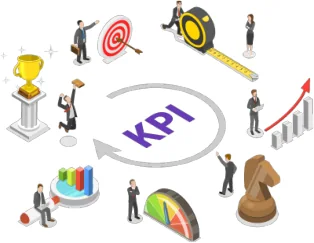
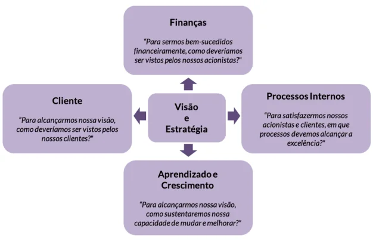
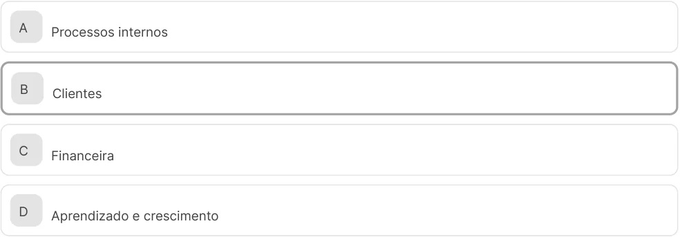
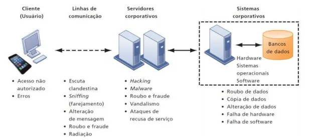
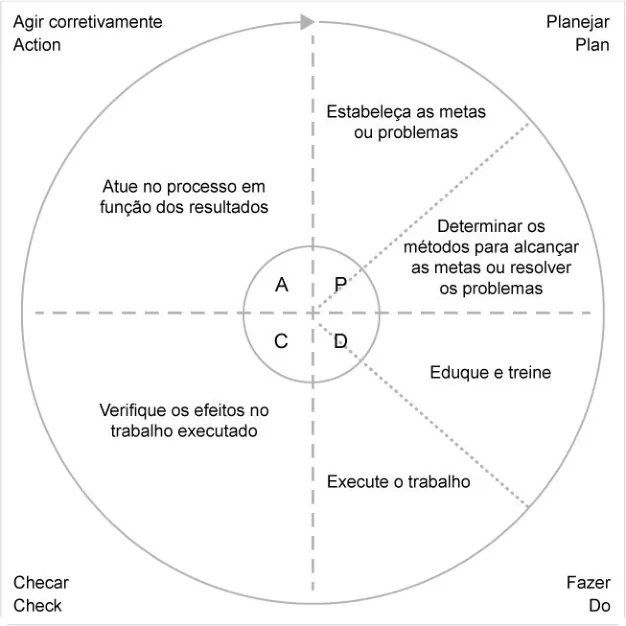
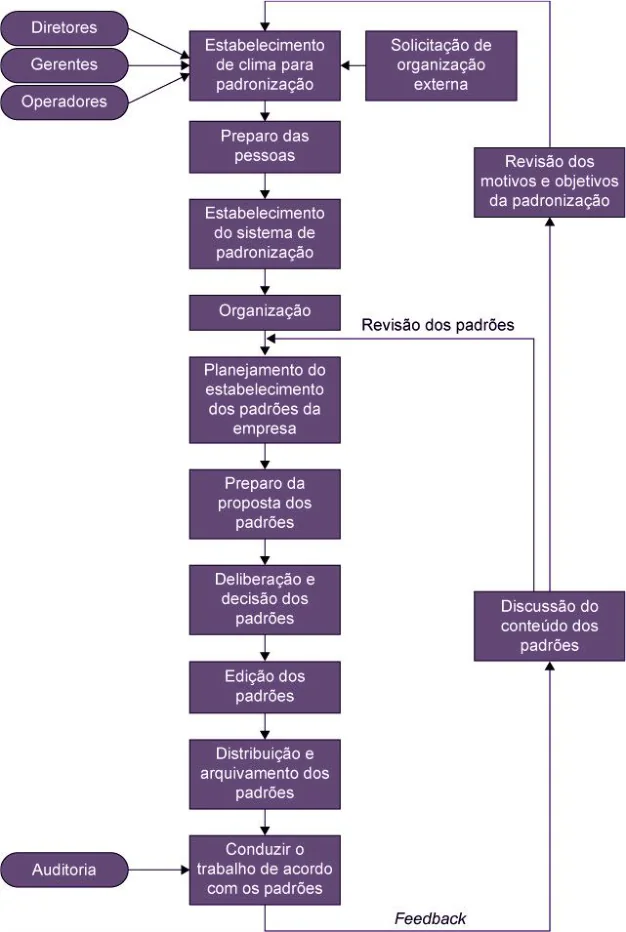

Gestão da qualidade na entrega dos servicos de TI 

Você vai entender o plano de melhoria contínua e a sua implementação em uma organização focada na melhoria contínua dos processos. 

Prof. Marcelo Vasconcellos Gomes 

1. Itens iniciais 

### Propósito 

Compreender o conceito e como implementar um plano de melhoria contínua com o objetivo de tornar uma organização mais eficiente. 

### Objetivos 

- Identificar os principais conceitos sobre Indicadores de Desempenho (KPI), Balanced Scorecard (BSC) e Acordo de Nível de Serviço. 

- Descrever Gerenciamento de Continuidade de Serviço e Segurança da Informação. 

- 

- Descrever o plano de melhoria contínua e sua implementação. 

- 

### Introdução 

Neste tema, aprenderemos como funciona a implementação de um plano de melhoria contínua com uma visão mais operacional do dia a dia de uma organização, de modo a tornar seus processos mais eficientes. 

Apresentaremos conceitos importantes sobre o assunto: Como um bom plano de melhoria contínua deve ser estruturado e a forma como este plano deve ser implementado, de modo a trazer bons resultados dentro de uma organização. 

1. Indicadores de Desempenho (KPI), Balanced Scorecard (BSC) e Acordo de Nível de Serviço 

# Indicadores de desempenho (KPI) 

O principal objetivo de uma organização é potencializar e otimizar seus resultados, otimizar o uso de recursos físicos e humanos e focar nas atividades que geram resultados positivos. 

Para que este objetivo seja atingido, é fundamental que a organização tenha um controle de métricas. É através de um controle baseado em Indicadores de Desempenho que a alta direção e os gestores da organização poderão identificar os pontos fortes e fracos de processos específicos para a tomada de decisões estratégicas. 

Atenção 

Aquilo que não se mede não se gerencia. 

### Os objetivos do uso de Indicadores de Desempenho 

Em organizações que trabalham com desenvolvimento de softwares e serviços de TI, por exemplo, existem vários objetivos que se buscam atingir, mas, obviamente, os objetivos dependem totalmente do nível de maturidade na qual a organização se encontra. 

Os objetivos podem ser: 

- Entregar produtos e/ou serviços de TI com qualidade e eficácia. 

- 

- Melhorar a eficácia do processo de desenvolvimento. 

- 

- Aumentar os níveis de satisfação, internos e externos. 

- 

- Reduzir os custos com retrabalho. 

- 

- Aumentar a produtividade de toda equipe. 

- 

- Aperfeiçoar continuamente o processo de desenvolvimento. 

- 

### As principais vantagens do uso de Indicadores de Desempenho 

As organizações podem otimizar e aprimorar seus processos, substituir processos manuais por automatizados, reduzir custos de forma significativa, investir naquilo que potencializa e gera resultado positivo, otimizar e aumentar a eficiência de sua equipe e fazer uso estratégico de seus recursos físicos e humanos. 

### Pré-requisitos para a definição de Indicadores de Desempenho 

Existem várias características importantes que estão associadas à definição de Indicadores de Desempenho e ao uso do controle de métricas. Para a criação de Indicadores, é importante observar os seguintes prérequisitos: 

Os objetivos a atingir com a utilização de Indicadores de Desempenho devem ser claros para toda organização Todos da organização devem estar cientes dos reais objetivos dos Indicadores, pois, sendo um processo transparente e claro a todos, haverá o engajamento de toda equipe para que os Indicadores sejam coletados com sucesso. 

As métricas coletadas devem ser simples de se entender 

Devido aos diversos tipos de audiências (pessoas ou grupos de pessoas que serão os destinatários das medições), as métricas devem ser simples de entender e de se utilizar, com o objetivo de atingir os objetivos e subsidiar os processos de tomada de decisão. 

As métricas devem ser claras e objetivas 

As métricas devem ser claras e objetivas com o objetivo de reduzir ou minimizar o impacto de influência pessoal na coleta, cálculo e análise dos resultados. 

As métricas coletadas devem ser efetivas na gestão de custos da organização Os resultados obtidos através das métricas devem se sobrepor aos custos necessários durante os processos de coleta, cálculo, análise e distribuição dos Indicadores. 

### Como os Indicadores de Desempenho podem ser classificados 

As métricas de desenvolvimento de software e serviços podem ser classificadas de diferentes formas, levando em conta o tipo de dado que foi coletado, os objetivos e o nível de utilização como segue abaixo: 

## Tipo de medidas 

Conforme o tipo de medidas, a classificação pode ser: 

Objetivas/subjetivas 

Diferenciar as medições que contam alguma coisa (objetiva) das que envolvem o julgamento pessoal (subjetiva). 

Absolutas/relativas 

As medidas absolutas não irão variar com a inclusão de novos itens, o tamanho do software, por exemplo, é uma medida absoluta. Já as medidas relativas mudam, por exemplo, médias de valores de eventos. 

Explícitas/derivadas 

As medidas explícitas são aquelas obtidas diretamente, ao passo que as medidas derivadas são obtidas através de outras medidas derivadas ou explícitas. 

##### Dinâmicas/estáticas 

Medidas dinâmicas possuem um componente temporal e medidas estáticas, que, por sua vez, não mudam de acordo com o tempo. 

##### Preditivas/explanatórias 

As medidas preditivas consistem em estimativas geradas a partir da transformação de medidas explícitas/derivadas ou dinâmicas/estáticas. As medidas são, geralmente, obtidas através da transformação de outras medidas e com o uso de métodos quantitativos. 

## Objetivo da medição 

Conforme o objetivo da medição, a classificação pode ser: 

##### Mediçőes estratégicas 

São medições que impactarão a estratégia da organização. Estes tipos de medições também deverão permitir o benchmarking, ou seja, a comparação com outras organizações concorrentes ou não. 

##### Mediçőes táticas 

Este tipo de medição diz respeito ao gerenciamento do ambiente de software e de serviços em termos, por exemplo, impacto da introdução de novas ferramentas, adoção de processos otimizados, treinamento de pessoal e análise de tendências da produtividade. 

##### Medições operacionais 

Este tipo de medição ocorrerá em nível de produto e/ou serviço, visando otimizar o processo de desenvolvimento de softwares e o processo de serviços. 

# Balanced scorecard (BSC) 

O Balanced Scorecard (BSC), traduzido para o português como “Indicadores Balanceados de Desempenho”, é uma metodologia de medição e gestão amplamente utilizada e se baseia em Indicadores de Desempenho. O BSC foi desenvolvido para ser extremamente efetivo para a gestão e o alinhamento efetivo da TI com as expectativas. 

#### Comentário 

O BSC foi criado por Robert Kaplan e David Norton no início dos anos 90 e se constitui basicamente em um novo modelo para a gestão estratégica, baseado em indicadores financeiros e não financeiros vinculados à estratégia organizacional. 

### Conhecendo as perspectivas do BSC 

De acordo com Kaplan e Norton (1997), o BSC foi dividido em quatro perspectivas de avaliação, conforme apresentado na imagem abaixo: 

<!-- Start of picture text -->
Conteúdo interativo Acesse a versão digital para ver mais detalhes da imagem abaixo. <!-- End of picture text -->

As 4 perspectivas do BSC. 

Explicando melhor os itens da imagem, temos: 

#### Perspectiva financeira 

Os objetivos financeiros servem de foco para as outras perspectivas do BSC. Qualquer medida deve fazer parte de uma cadeia de relações de causa e efeito que culminam com a melhoria do desempenho financeiro da organização. 

#### Perspectiva de clientes 

Descreve as formas nas quais o valor deve ser criado para os clientes, como sua demanda por esse valor deve ser satisfeita e os motivos pelos quais o cliente irá querer pagar por ele. Esta perspectiva permite que as organizações alinhem suas medidas essenciais de resultados relacionados aos clientes: 

- satisfação 

- fidelidade 

- retenção 

- captação 

- lucratividade 

#### Perspectiva de processos internos 

Esta perspectiva é, basicamente, uma análise dos processos internos da organização. A análise sempre inclui a identificação dos recursos e das capacidades necessárias para elevar o nível interno de qualidade. 

#### Perspectiva do aprendizado e crescimento 

Desenvolve os objetivos e as medidas para orientar o aprendizado e o crescimento organizacional, procurando atenuar o problema supracitado. Os objetivos estabelecidos nas outras três perspectivas – financeira, do cliente e dos processos internos – revelam onde a organização deve se destacar para obter um desempenho excepcional. 

### Ações necessárias para se alinhar o BSC ao planejamento estratégico 

O BSC é uma ferramenta que materializa a visão e a estratégia da organização por meio de um mapa coerente com objetivos e métricas de desempenho, organizados segundo quatro perspectivas diferentes e por meio das ações: 

#### Processo 1 

Esclarecer e traduzir a visão e a estratégia: O processo de Scorecard tem início com um trabalho de equipe da alta administração para traduzir a estratégia de sua unidade de negócios em objetivos estratégicos específicos. 

#### Processo 2 

Comunicar e associar objetivos e medidas estratégicas: Os objetivos e medidas estratégicas são transmitidos à organização de diversas formas, por exemplo, jornais internos, quadros de aviso e contatos pessoais. 

#### Processo 3 

Planejar, estabelecer metas e alinhar iniciativas estratégicas: O BSC produz maior impacto ao ser utilizado para induzir a mudança organizacional. Os altos executivos deverão estabelecer metas que, se atingidas, transformarão a organização. 

#### Processo 4 

Melhorar o feedback e o aprendizado estratégico: O quarto processo gerencial incorpora ao BSC um contexto de aprendizado estratégico. 

### Conhecendo as etapas do BSC 

Conforme Kaplan e Norton (1997), o processo do BSC baseia-se nas seguintes etapas: 

#### Arquitetura do programa de medição 

O objetivo desta etapa é promover compreensão e análise crítica dos direcionadores de negócio e de visão de futuro. Um segundo objetivo é resgatar as diretrizes estratégicas, analisando sua coerência com os direcionadores de negócio e visão de futuro. 

#### Definição dos objetivos estratégicos 

As atividades desta etapa implicam em alocar os objetivos estratégicos nas quatro dimensões do BSC, correlacionando-os entre si. Neste processo, poderão ou não surgir gaps no inter-relacionamento, que deverão ser eliminados ou preenchidos a partir de novas discussões e análises do planejamento estratégico da organização. 

Escolha e elaboração dos indicadores Nesta etapa, ocorre a identificação de indicadores de tendência e de resultados que medem diretamente cada objetivo estratégico. Recomenda-se a utilização de um número limitado de métricas balanceadas de tendência e resultado, a fim de viabilizar o processo de monitoramento e controle. 

Elaboração do plano de implementação 

Uma vez definidos os indicadores associados aos diferentes objetivos estratégicos, definem-se metas, planos de ação e responsáveis, a fim de direcionar a implementação da estratégia. 

# Acordo de nível de serviço 

Um Acordo de Nível de Serviço (ANS) ou Service Level Agreement (SLA) tem como principal objetivo a obtenção dos padrões de qualidade combinados entre o cliente e o fornecedor para os serviços contratados. A gestão do acordo de nível de serviço inicia com um acordo de expectativas entre o cliente e o fornecedor. 

#### Atenção 

É importante lembrar que quando falamos de fornecedor não estamos nos referindo somente a fornecedores externos, mas também a fornecedores internos. Por exemplo: a área de TI da organização pode ser considerada como o fornecedor da área de negócios e determinar acordos de nível de serviço com o objetivo de garantia de qualidade. 

### O que são acordos, serviços, níveis de serviço e metas de serviço 

É importante entender que um acordo é um contrato ou compromisso assumido entre duas partes, enquanto um serviço é um meio para que se ofereça valor aos clientes. Já um nível de serviço é a mensuração de desempenho do serviço que está sendo disponibilizado, ao passo que metas de nível de serviço indicam as condições necessárias para que um serviço seja considerado satisfatório, de modo a atender às expectativas do cliente e das demais partes interessadas. 

### Os três tipos de Acordos de Níveis de Serviço 

Basicamente, são três os tipos de Acordos de Níveis de Serviço. A diferenciação entre os três é importante na medida em que o relacionamento entre as partes interessadas não é exatamente igual, sendo eles: 

Acordo de Nível de Serviço (ANS) ou Service Level Agreement (SLA) É um acordo entre o provedor de serviços de TI e um cliente. 

Acordo de Nível Operacional (ANO) ou Operational Level Agreement (OLA) É um acordo entre um provedor de serviços de TI e outra parte da mesma organização. 

#### Contrato de Apoio (CA) ou Underpinning Contract (UC) 

É um contrato entre um provedor de serviços de TI e um terceiro. O contrato de apoio irá fornecer metas e responsabilidades que são necessárias para que se atenda às metas de nível de serviço requeridas. 

### Etapas da gestão dos níveis de serviço 

Para que se realize a gestão dos níveis de serviço de forma efetiva, as seguintes etapas deverão ser realizadas: 

Definir o Acordo de Nível de Serviço (SLA) 

A definição do acordo de nível de serviço deverá ser clara e objetiva e com foco no atendimento das expectativas do cliente. 

##### Monitorar o desempenho 

O monitoramento do desempenho de serviços poderá exigir processos bastante sofisticados, principalmente, em se tratando de ferramentas de TI. Os recursos de TI existem para nos apoiar na execução das medições. 

##### Obter e analisar os dados 

Os dados coletados durante as medições do serviço deverão ser organizados de forma adequada para que sejam interpretados e analisados facilmente. 

Melhorar os serviços prestados 

Devemos analisar e planejar as ações de melhoria dos eventos e processos para que o nível desejado do serviço seja atingido. É o momento também de avaliar todas as falhas ocorridas e estabelecer planos de ação para que todas as falhas sejam eliminadas ou mitigadas. 

##### Aprimorar o SLA 

A execução deste processo permitirá que a organização conheça cada vez mais suas atividades, seus processos essenciais e o que exatamente é valorizado pelo cliente. 

### O que é definido nos Acordos de Níveis de Serviço 

Um Acordo de Nível de Serviço é um documento que formalizará um acordo entre cliente e fornecedor e, de modo geral, são definidos: 

#### Participantes 

Quem são as partes envolvidas na prestação do serviço. 

#### Prazo de validade 

Por quanto tempo o acordo irá vigorar. 

#### Escopo do serviço 

Quais são os serviços cobertos pelo acordo. 

#### Limitações 

Quais as condições nas quais não há cobertura do acordo. 

#### Papéis e responsabilidades 

Quais são os papéis e responsabilidades de todos os participantes envolvidos na prestação do serviço. 

#### Objetivos do nível de serviço 

Quais são as bases ou faixas consideráveis para a prestação do serviço. 

#### Indicadores do nível de serviço 

Qual será a base da medição dos níveis de serviço. 

#### Recompensas e penalidades 

Poderão ser definidos bônus para níveis de serviço que superam as expectativas e penalidades para serviços com desempenho abaixo do acordado. 

#### Serviços opcionais 

Alguns serviços podem impactar em eventos que ocorrem de forma irregular, então, os serviços opcionais ajudarão a definir o que é eventual. 

#### Exclusões 

Quais são os serviços que não são cobertos pelo nível de serviço acordado. 

#### Reporte dos resultados 

Como que os resultados serão publicados e como será realizado o seu reporte. 

#### Critérios de administração e revisão 

É indispensável que os resultados dos níveis de serviço sejam analisados e discutidos em reuniões conjuntas. 

#### Critérios de medidas de serviços 

Quais serão os critérios de disponibilidade, desempenho, tempo de resposta, cumprimento em horários específicos, falhas por eventos executados, contingência e continuidade. 

Assista ao vídeo e entenda mais sobre o balanced scorecard e a importância dos indicadores de desempenho. 

#### Conteúdo interativo 

Acesse a versão digital para assistir ao vídeo. 

# Verificando o aprendizado 

##### Questão 1 

Estudamos conceitos importantes, como Indicadores de Desempenho, Balanced Scorecard e Acordo de Nível de Serviço. Assinale a alternativa que descreve os pré-requisitos necessários para a implementação de indicadores: 

As métricas devem ser claras e objetivas, as métricas coletadas devem ser efetivas na gestão de custos Ada organização, as métricas coletadas devem ser simples de se entender e os objetivos a atingir com a utilização de Indicadores de Desempenho devem ser claros para toda organização. 

As métricas devem ser claras e objetivas, as métricas coletadas devem ser efetivas na gestão de contratos Bda organização, as métricas coletadas devem ser simples de se entender e os objetivos a atingir com a utilização de Indicadores de Desempenho devem ser claros à alta administração. 

As métricas devem ser claras e objetivas, as métricas coletadas devem ser efetivas na gestão de custos da organização, as métricas coletadas podem ser difíceis de se entender e só de acesso a alta administraçãoC os objetivos a atingir com a utilização de Indicadores de Desempenho devem ser claros para toda organização. 

As métricas devem ser claras e objetivas, as métricas coletadas devem ser efetivas na gestão de custos da organização, as métricas coletadas devem ser simples de se entender e os objetivos a atingir com a D utilização de Indicadores de Desempenho devem ser claros somente para a alta administração da organização. 

#### A alternativa A está correta. 

Quando se define e se implementa Indicadores de Desempenho, todas as métricas devem ser claras e objetivas para que se tenha o engajamento de toda organização. As metas sempre serão de otimizar os resultados e, com isso, também deverá ocorrer a otimização de custos da organização. Todas as metas devem ser objetivas e tangíveis, assim como os objetivos devem ser claros para todos da organização. 

##### Questão 2 

Conhecemos noções relevantes sobre Balanced Scorecard, como suas perspectivas. Assinale a alternativa que apresenta a perspectiva que melhor traduz a missão e a estratégia da organização em objetivos específicos para segmentos focalizados que podem ser comunicados a toda organização: 

<!-- Start of picture text -->
A Processos internos B Clientes C Financeira D Aprendizado e crescimento <!-- End of picture text -->

#### A alternativa B está correta. 

O principal objetivo de uma boa estratégia é fazer entregas de valor ao cliente, assim como saber identificar o que distingue a nossa contribuição para o cliente em comparação com nossos concorrentes. 

2. Gerenciamento de Continuidade de Serviço e Segurança da Informação 

# Gerenciamento de continuidade de serviço 

O Gerenciamento de Continuidade de Serviço de TI tem como objetivo principal gerenciar e reduzir os riscos que podem afetar os serviços de TI e, consequentemente, as áreas de negócio. O Gerenciamento de Continuidade é quem vai garantir a restauração dos recursos técnicos e dos serviços de TI, respeitando os prazos acordados e requeridos pelo negócio. Entende-se por recursos técnicos, aplicações, rede de dados, repositório de dados, central de serviço, suporte técnico, ou seja, tudo que a TI oferece e controla para que as áreas de negócio funcionem. Em outras palavras, a TI tem de continuar a entregar seus serviços em um nível aceitável após um incidente de interrupção. 

#### Atenção 

De acordo com a norma da ABNT NBR ISO 22301:2013, a continuidade de negócio é a capacidade da organização em continuar a entrega de produtos ou serviços em um nível aceitável previamente definido após incidentes de interrupção. 

Podemos relacionar outras responsabilidades do Gerenciamento de Continuidade: 

- Concluir Análise de Impacto no Negócio (BIA – Business Impact Analysis); 

- 

- Avaliar e reduzir riscos identificados; 

- 

- Planejar a recuperação de processos de negócios críticos; 

- 

- Garantir o estabelecimento de mecanismos apropriados de continuidade e recuperação; 

- 

- Definir os critérios de aceitação do serviço etc. 

- 

O Gerenciamento de Continuidade está muito relacionado com o Gerenciamento de Risco. É importante que os riscos que possam afetar o gerenciamento de serviços de TI sejam mitigados, pois, certamente, afetarão o negócio. É exatamente isso que a TI não pode deixar acontecer, o negócio tem de ser preservado! 

A TI precisa se planejar para responder a contento as ameaças a que está exposta: 

- Danos ou impedimentos de acesso às instalações; 

- 

- Perda de serviços de suporte críticos; 

- 

- Falta ou falha de fornecedores críticos; 

- 

- Erro humano ou técnico; 

- 

- Fraude, sabotagem, extorsão ou espionagem; 

- Vírus ou outras falhas de segurança; 

- Ação industrial (roubo de informações); 

- Desastres naturais, entre outros. 

Vamos ver alguns componentes relacionados ao Gerenciamento de Continuidade de Serviços de TI. 

### Plano de Continuidade de Serviços de TI 

O Plano de Continuidade é um documento que define todas as ações necessárias para recuperação de um ou mais serviços de TI, de acordo com a prioridade acordada com a área de negócio. Ele deve estar sempre atualizado. Qualquer atualização que seja necessária deverá ser feita por meio do controle da Gerência de Mudanças. O plano é parte integrante do Plano de Continuidade do Negócio, que é um conjunto de ações estratégicas que devem ser tomadas para assegurar o funcionamento dos principais processos da empresa nos momentos de interrupção. 

As responsabilidades individuais e as da equipe envolvida devem estar detalhadas no plano de continuidade e seu armazenamento tem que ser externo das instalações. Imagine um desastre nas instalações, nesse caso, ninguém tem o acesso ao plano de continuidade? 

Segundo a NBR ISO 22301:2013, Planos de Continuidade de Negócios são procedimentos documentados que orientam as organizações a responder, recuperar, retornar e restaurar a um nível pré-definido de operação após a interrupção. 

Alguns conceitos que fazem parte do Gerenciamento de Continuidade: 

##### Risco 

Probabilidade de um evento acontecer, podendo ser uma ameaça (negativo) ou uma oportunidade (positivo). Contudo, no Gerenciamento de Continuidade, estamos falando de ameaças e perigo de um evento que poderá prejudicar o funcionamento de serviços de TI e do negócio. 

##### Análise de risco 

É a análise de um evento que poderá causar prejuízo, perdas financeiras ou afetar que a empresa atinja seus objetivos. 

##### Vulnerabilidade 

É uma fragilidade existente que pode ser atingida por uma ameaça. 

##### Ameaça 

Tudo que pode explorar uma vulnerabilidade e causar um incidente. Exemplo: O fogo é uma ameaça que pode explorar a vulnerabilidade existentes nos materiais inflamáveis que estejam em uma casa. 

##### Função vital do negócio 

É um processo ou serviço que é crítico para a organização e não pode ser interrompido. E se for, deve ter uma contingência, nem que seja manual. Pense em uma operadora de plano de saúde, que possui um processo que libera as senhas de internação em hospitais credenciados. Os pacientes não podem ser recusados nos hospitais, pois não possuem a senha. Deve haver uma contingência qualquer, mas tem que ser resolvido e não pode esperar o problema surgir para se ter uma solução. A solução, a contingência, tem que estar documentada e ser aplicada nesses casos, de forma quase que imediata. 

### Análise de Impacto de Negócio (BIA) 

O BIA, como é O Essa perda pode ser temporária – apenas mais conhecido, propósitouma interrupção ou definitiva. A partir dos é uma forma de do BIA é levantamentos de quais as ameaças, prever as quantificarvulnerabilidade, impacto, probabilidade, são consequências o listados os riscos, que deverão ser que podem impacto analisados. Uma vez analisados os riscos e ocorrer na no com a identificação dos serviços de TI mais empresa, em negócio importantes, é possível definir qual a seus processos e referenteresposta ou plano de ação para os processos sistemas, caso a uma prioritários. Nessa hora, já está planejado o um risco de perda deque deve ser feito quando uma interrupção interrupção se serviço. acontecer. materialize. 

É importante ficar claro, que não se pode deixar o planejamento para ser elaborado na hora da interrupção. A velocidade de resposta ao problema poderá ser o diferencial das perdas que a empresa irá sofrer. 

No resultado do BIA – no relatório deve constar, por exemplo, para cada sistemas e processos: prazo de tolerância à interrupção, impactos causados, prioridade, plano de recuperação, responsáveis e substitutos, entre outras informações. 

Quando falamos em continuidade, não podemos deixar de mencionar o Plano de Continuidade do Negócio (PCN). O PCN assegura a continuidade dos processos considerados críticos e vitais para a organização em caso de uma paralisação, seja por um desastre natural ou intencional. O PCN criará políticas, normas e padrões para que nessas situações adversas a empresa possa dar prosseguimento, recuperar e retornar ao seu estado normal. Tudo isso com o intuito de mitigar as perdas financeira. 

Geralmente, o PCN é constituído de três ou mais planos. Vamos abordar 3 deles: Plano de Administração de Crise – PAC, Plano de Continuidade Operacional – PCO e o Plano de Recuperação de Desastres – PRD. 

### Plano de Continuidade do Negócio 

É composto por: 

#### Plano de Administração de Crise – PAC 

O PAC é acionado após decretada a crise e é voltado para todo o processo. Nele, serão definidas as funções e responsabilidades de cada equipe envolvida nas contingências necessárias, antes, durante e após a ocorrência do evento. 

#### Plano de Continuidade Operacional – PCO 

O PCO aciona os primeiros procedimentos do PAC e é composto de procedimentos pré-definidos que permitirão a continuidade dos processos e serviços vitais da organização dentro dos prazos acordados. Com ele, os gestores de negócio saberão fazer o que é necessário na ausência ou falha de um componente que suporte o processo de negócio. 

#### Plano de Recuperação de Desastres – PRD 

O PRD determina o planejamento para retomada das atividades normais da empresa, que deverá retornar aos seus níveis normais de operação anteriores à crise. 

Algumas decisões são tomadas quanto ao tipo de recuperação que a empresa vai estabelecer, com base nas análises de riscos realizadas anteriormente. Essas providências são chamadas de Providências de Standby: 

- Solução de contorno manuais 

- 

- Abordagem de fortaleza 

- 

- Seguro 

Além dessas, temos: 

##### Acordo de Reciprocidade 

É um acordo entre Organizações para que uma empresa use as instalações da outra empresa no caso de um desastre. Isso pode funcionar para trabalhos em batch ou armazenagem, mas não é viável em ambientes complexos e distribuídos. Há também questões de capacidade, manutenção e segurança a serem considerados. 

Recuperação Imediata em até 24h – Hot Standby 

É um site alternativo que já opera os sistemas críticos a serem usados quando o site principal estiver inacessível ou não puder ser utilizado. Os sistemas de negócio crítico são “espelhados” no site alternativo. Há 3 tipos de instalações de hot standby: interno, dentro da organização, embora não no mesmo prédio; externo, fornecido por um terceiro e compartilhado por vários clientes e móvel, instalações específicas em um caminhão, que podem ser transportadas entre o site principal e o alternativo. Os bancos utilizam esse tipo de procedimento de recuperação. 

Recuperação Intermediária entre 24 e 72h – Warm Standby 

Similar à Recuperação Imediata, exceto pelo fato que os sistemas críticos precisam ser recuperados e postos a funcionar. 

Recuperação gradativa – Cold Standby 

É uma instalação vazia, com rede elétrica e outros serviços, equipe de suporte e equipamento de telecomunicações. 

Dito isso, podemos constatar que nada do que foi apresentado é suficiente se o PCN não for testado. 

O teste do PCN deverá ser realizado periodicamente e os funcionários treinados, para que no momento da crise todos saibam o que deve ser feito. Com ele, é possível mensurar a eficácia do PCN e apurar os ajustes necessários, entendendo que sua atualização é extremamente importante. 

É simples entender a falta que faz um Gerenciamento de Continuidade eficiente e as consequências causadas por um desastre, basta observar alguns casos clássicos como: o atentado às Torres Gêmeas nos Estados Unidos e o Tsunami no Japão. 

# Gerenciamento de segurança da informação 

O Gerenciamento de Segurança da Informação deve alinhar a segurança de TI com a segurança do negócio e garantir que a Segurança da Informação seja gerenciada de forma efetiva em todos os serviços e atividades do Gerenciamento de Serviços de TI. Dessa forma, protegendo a informação de danos decorrentes de falhas em confidencialidade, integridade e disponibilidade, entendendo que não se pode garantir a Segurança da Informação quando esses elementos são frágeis. 

Podemos entender integridade como a informação estando na forma que foi disponibilizada e que só foi atualizada por pessoas e atividades autorizadas. 

#### Exemplo 

Um exemplo de quebra de confidencialidade são as conversas entre dois funcionários de uma empresa em um restaurante ou em um transporte público, onde quem está ao lado, que pode ser o seu concorrente, está ouvindo tudo. Outro exemplo, mas, de indisponibilidade, é com relação a sistemas fora do ar ou ataques de negação de serviço, que não permitem que os clientes acessem os serviços de uma empresa. Não havendo acesso, consequentemente, não ocorrerá a venda do produto. Uma quebra de integridade em uma informação pode ser, por exemplo, a alteração de uma informação no banco de dados. 

É preciso enfatizar que a informação existe em diversas formas e deve ser protegida em todas elas. A princípio, o que logo pensamos é a respeito da informação em forma digital, que está no meio eletrônico, e pode ser protegida por hardware e software, mas existe a informação escrita e falada, que necessita das atitudes pessoais de cada um de nós. 

Segundo Laudon e Laudon (2010), se você opera com uma empresa, precisa ter a segurança e o controle como prioridades. 

#### Segurança 

#### Controles 

Abarca as políticas, os procedimentos e as medidas técnicas usadas para impedir acesso não autorizado, alteração, roubo ou danos físicos a sistemas de informação. 

Consistem em todos os métodos, nas políticas e nos procedimentos organizacionais que garantem a segurança dos ativos da organização, a precisão e a confiabilidade de seus registros contábeis, bem como a adesão operacional aos padrões administrativos. 

A imagem a seguir de Laudon e Laudon (2011) exibe as vulnerabilidades e desafios a que uma empresa está exposta. 

<!-- Start of picture text -->
Conteúdo interativo Acesse a versão digital para ver mais detalhes da imagem abaixo. <!-- End of picture text -->

Vale ressaltar que, na maioria dessas vulnerabilidades, o elo pessoas tem grande envolvimento. Um hardware quebrado, configurado indevidamente, danificado por uso impróprio ou atividade criminosa, faz com que serviços não sejam processados. Um erro em um software ocasionado por erros de programação, instalação inadequada ou alterações não autorizadas, na verdade, ocorre devido a pessoas. Pessoas que não elaboraram e implementaram políticas de segurança, ou por pessoas que não as seguiram. 

Alguns mecanismos podem ser implantados para que mitiguem os riscos de segurança: 

#### Controle físico 

#### Controle lógico 

Paredes, cadeados, blindagem, guardas, portas etc. 

Barreiras que limitam o acesso às informações no ambiente tecnológico - controle de acesso lógico (senhas, firewall, biometria etc.), criptografia. 

# Sistema de gerenciamento da segurança da informação 

O Sistema de Gerenciamento da Segurança da Informação é uma estrutura composta de políticas, processos, padrões, guias e ferramentas que tem o intuito de garantir que a organização possa atingir seus objetivos em segurança da informação. 

A implantação de um Sistema de Gerenciamento da Segurança da Informação não é uma tarefa simples. Um bom começo é a utilização da norma ABNT NBR ISO/IEC 27001:2013. Segundo a ABNT, a norma especifica os requisitos para estabelecer, implementar, manter e melhorar continuamente um sistema de gestão da Segurança da Informação dentro do contexto organizacional. Ela também inclui requisitos para a avaliação e tratamento de riscos de Segurança da Informação voltados para as necessidades da organização. 

O conjunto de normas ISO/IEC 27000 é específico para Sistemas de Gerenciamento de Segurança da Informação. 

Todos esses cuidados com Segurança da Informação são essenciais, uma vez que estamos na Era da Informação, e informação é volátil e frágil, podendo desaparecer ou ser manipulada de diversas formas. A informação gera conhecimento, suporta as tomadas de decisão e representa valor para uma empresa, assim, deve ser cuidadosamente preservada. 

Assista ao vídeo e conheça mais sobre os conceitos básicos de gerenciamento de continuidade. 

Conteúdo interativo 

Acesse a versão digital para assistir ao vídeo. 

# Verificando o aprendizado 

##### Questão 1 

O acesso aos dados fornecidos para a administração financeira da XYZ só pode ser feito por usuários autorizados. O Gerenciamento da Segurança toma providências para garantir isso. Através dessas ações, qual aspecto dos dados pode ser garantido? 

A Disponibilidade B Integridade 

C Estabilidade 

##### D Confiabilidade 

#### A alternativa D está correta. 

A segurança de informação foca em três pilares para garantir que a segurança da informação é efetiva. Quando falamos em o acesso à informação só ser permitido a pessoas autorizadas, é um exemplo de confiabilidade. 

##### Questão 2 

Qual conceito faz parte do Gerenciamento da Continuidade dos Serviços em TI?? 

A Dimensionamento de aplicações B Vulnerabilidade C Sustentabilidade D Resiliência 

#### A alternativa D está correta. 

O Gerenciamento de Continuidade vai garantir a restauração dos serviços de TI respeitando os prazos acordados e requeridos pelo negócio, dentro da prioridade estabelecida. A resiliência é uma propriedade, emprestada da física, utilizada no Gerenciamento de Continuidade, que significa o serviço retornar a suas funções após ter ocorrido algum problema de interrupção. 

3. Plano de melhoria contínua e sua implementação 

# Conceitos 

### O que é um plano de melhoria contínua? 

Atualmente, o mercado é altamente competitivo e somente organizações eficientes conseguem sobreviver neste cenário, que é repleto de novas ideias, novas necessidades e total inovação. Por estas razões, uma organização eficiente sempre passa por constante inovação e investimentos em melhorias nos seus processos. 

É extremamente importante que a organização adote esta postura inovadora, para que um desenvolvimento contínuo seja atingido. 

Um plano de melhoria contínua basicamente irá definir a forma como o negócio da organização deve ser estruturado, de modo que ela continue se desenvolvendo e aprimorando os seus processos com o passar do tempo. 

# Objetivos 

Qual o principal objetivo da implementação de um plano de melhoria contínua? 

O principal motivo da implementação de um plano de melhoria contínua é permitir que a organização esteja em constante aperfeiçoamento e inovação. Somente através da implementação de um plano que permita um aperfeiçoamento contínuo nos processos é que uma organização trilhará seu caminho em busca dos melhores resultados possíveis, tornando-a extremamente competitiva. 

# Questões 

Quais questões devem ser respondidas antes de se elaborar um plano de melhoria contínua? 

Antes da organização elaborar um plano de melhoria contínua, é fundamental que as seguintes questões sejam respondidas: 

O que a organização quer melhorar? 

Esta questão deverá direcionar o foco de todos da organização para que haja pleno entendimento do que realmente deve ser melhorado, ou seja, todos os esforços devem ser direcionados para o que realmente deve ser melhorado na organização e qualquer esforço que não tenha impacto em melhoria deverá ser dispensado. 

Como a organização saberá se a mudança realizada foi realmente uma melhoria? 

A única forma que permitirá que a organização saiba de fato se a mudança realizada através do plano foi uma melhoria é através do uso de métricas e indicadores, a partir dos quais a organização irá medir os resultados gerados contra os resultados esperados. 

Importante: Aquilo que não se mede, não se gerencia. 

Quais mudanças devem ser realizadas de modo a gerar melhorias? 

Esta questão consiste basicamente em responder quais são as ações necessárias para que as melhorias sejam implementadas na organização. 

### O plano de melhoria contínua deve ser estratégico 

Todo plano de melhoria contínua deve ser estratégico, ou seja, o plano deve ser revisado e adaptado sempre que houver necessidade. Os resultados gerados serão medidos contra os resultados esperados e, se os resultados gerados não forem satisfatórios, as ações presentes no plano de melhoria deverão ser revisadas e adaptadas. 

Não faz sentido nenhum seguir um plano de melhoria contínua da forma como foi inicialmente planejado se os resultados gerados não são satisfatórios para a organização. 

# O plano de melhoria contínua e o lean 

O Lean basicamente define um conjunto de princípios e técnicas que permitem a análise e melhoria nos processos da organização. O método Lean surgiu com a ascensão industrial do Japão no pós-guerra e está totalmente relacionado ao Sistema Toyota de Produção, em inglês Toyota Production System – TPS. 

O método Lean está totalmente relacionado com a melhoria contínua, pois sua filosofia prega que a organização sempre deverá melhorar seus processos através da padronização disciplinada e do aprendizado em longo prazo. No método Lean, a melhoria contínua é denominada como kaizen. 

### O plano de melhoria contínua e o PDCA 

O famoso PDCA – Planejar (Plan), Fazer (Do), Verificar (Check) e Agir (Action) está totalmente alinhado ao processo de melhoria contínua. O ciclo PDCA é um método focado em melhoria contínua e é um método eficiente para o controle da eficácia dos processos. 

A imagem apresenta as quatro etapas do ciclo PDCA que deverão ser executadas durante todo o ciclo de melhoria contínua dentro da organização: 

#### Conteúdo interativo 

Acesse a versão digital para ver mais detalhes da imagem abaixo. 

Ciclo do PDCA. 

Entenda melhor cada item. 

#### Planejar - PLAN 

Esta é a primeira etapa do ciclo PDCA, na qual deve ser elaborado o plano de melhoria contínua. Basicamente, serão determinados os objetivos para as melhorias de processos, a equipe responsável pela execução do PDCA e deverá ser elaborado um cronograma com todas as ações, prazos e responsáveis. A implementação de um plano de melhoria contínua poderá ser vista como um grande projeto da organização com início, meio e fim e, para isso, deverá ser designado um gerente de projetos que será o responsável por acompanhar todo o processo de implementação da melhoria contínua. 

#### Fazer – DO 

Após a etapa de planejar, é chegada a hora de “botar a mão na massa”, ou seja, da equipe executar todas as atividades previstas no plano de melhoria contínua. É importante que nesta etapa todas as atividades previstas no plano sejam devidamente executadas, a comunicação sobre a evolução dos trabalhos deverá ser clara e transparente para todos, os prazos estipulados no cronograma de trabalho deverão ser rigorosamente seguidos e todas as ações e riscos identificados deverão ser totalmente evidenciadas. 

#### Verificar/Checar – CHECK 

Nesta etapa, todos os resultados gerados deverão ser analisados. Também deverá ser avaliado o que deve ser melhorado para as etapas seguintes e todas as melhorias identificadas devem ser devidamente implementadas. É fundamental que nesta etapa se analise se o resultado gerado está de acordo com o resultado esperado, todos os desvios encontrados deverão ser devidamente tratados e é importante que se reconheça todas as principais causas dos problemas encontrados. 

#### Agir corretivamente – ACTION 

Esta é a última etapa do ciclo PDCA, na qual a possível melhoria no processo já foi implementada. Este é o momento das correções, todos os problemas encontrados devem ser devidamente corrigidos e melhorias implementadas, de modo que o ciclo recomece novamente e de forma mais otimizada. Nesta etapa, é importante que se corrijam os defeitos encontrados, criem-se ações para a prevenção das principais causas identificadas, que se implementem ações preventivas de modo a se analisar se o resultado gerado está devidamente conforme o esperado, e que se repitam todas as etapas do ciclo PDCA, até que todos os resultados esperados sejam concretizados com sucesso. 

### Quais são os passos para a implementação de um plano de melhoria contínua? 

É um erro muito comum que as organizações não dediquem o tempo suficiente planejando corretamente o plano de melhoria contínua, ou seja, existe uma ânsia tão grande por parte da diretoria e da alta gestão da organização em já sair implementando as mudanças, que várias questões importantes podem ser totalmente descartadas. Ignorar questões importantes pode ser desastroso e impactar em riscos negativos em médio e longo prazo. 

Com o objetivo de minimizar riscos negativos de um plano de melhoria contínua mal planejado, os seguintes passos devem ser executados: 

## Entender quais são os objetivos estratégicos da organização 

O primeiro passo é que todos tenham uma visão clara sobre os reais objetivos estratégicos da organização. A direção e a alta gestão devem garantir que a organização como um todo tenha uma visão clara sobre os objetivos estratégicos. 

É extremamente equivocado iniciar um processo de implantação de um plano de melhoria contínua sem garantir o alinhamento de todos aos objetivos estratégicos da organização. 

#### Exemplo 

Uma organização de desenvolvimento de softwares pretende elevar o nível de satisfação do cliente de 7.0 (atual) para 8.0 (desejado) e, para que isso seja alcançado, é necessário reduzir em 30% o tempo de atendimento de um ticket de média complexidade, em que normalmente o cliente aguarda até 4 horas para receber um retorno sobre o seu problema. 

## Estudar quais são os processos que agregam mais valor para a organização 

Alguns processos da organização podem não agregar tanto valor quanto a percepção de todos, principalmente do mercado e do cliente. Desta forma, um estudo em profundidade sobre todos os processos é aconselhável e obviamente o plano de melhoria contínua deverá focar principalmente nos processos que mais agregam valor de negócio para a organização. 

#### Exemplo 

Uma organização de desenvolvimento de softwares possui como foco principal o desenvolvimento de softwares de prateleira em que praticamente 80% de sua receita é em contratos de manutenção com clientes. Os outros 20% são eventuais projetos conduzidos por equipes específicas. Existem oportunidades de melhoria em ambas as áreas, mas com certeza a organização deverá priorizar melhorias nos processos que estão dentro dos 80% de representatividade no faturamento. 

## Mapear os processos que mais agregam valor para a organização 

Todos os processos que agregam valor deverão ser devidamente mapeados para facilitar a identificação de melhorias e garantir que todos estejam devidamente alinhados aos processos. Uma excelente ferramenta para o mapeamento de processos é a utilização de fluxogramas e é importante existir uma clareza nestes diagramas, de modo que a informação mapeada seja clara e consistente, e não confusa e de difícil entendimento. 

A imagem a seguir apresenta um exemplo de um fluxograma em alto nível no qual a organização tinha como objetivo em seu plano de melhoria contínua o de padronizar as atividades de seus colaboradores. 

Conteúdo interativo Acesse a versão digital para ver mais detalhes da imagem abaixo. 

<!-- Start of picture text -->
Exemplo de fluxograma. <!-- End of picture text -->

Fluxogramas confusos e mal organizados tendem a gerar total desinteresse por parte de todos e isto com certeza é extremamente prejudicial em um processo de melhoria contínua. 

#### Exemplo 

Uma organização de desenvolvimento de softwares possui duas áreas: Projetos e sustentação. A área de sustentação representa 80% da sua receita mensal, enquanto a área de projetos representa 20%. Muitos colaboradores desconhecem todas as etapas dos processos de sustentação. Sendo assim, a empresa irá desenhar todos os processos de sustentação com todo o fluxo do negócio e, através da visualização e do conhecimento dos processos mapeados, será mais fácil de identificar quais são os atuais gargalos e quais pontos necessitam de melhorias. 

Procurar por oportunidades de melhoria nos processos 

Sempre existe o que melhorar nos processos atuais de uma organização. Por esta razão, uma organização eficaz sempre estará imersa em um processo constante de melhoria contínua. 

#### Exemplo 

Uma organização de desenvolvimento de softwares possui um índice mensal de 30% referente a retrabalho na sua área de desenvolvimento de produtos. Após o mapeamento de todos os processos da área, identificou-se que alguns colaboradores desconheciam parte dos processos, ou seja, revelou-se um gargalo com falta de treinamentos adequados e direcionados.  Uma das ações presentes no plano de melhoria contínua será treinar e nivelar o conhecimento de todos os colaboradores da área, de modo a reduzir o índice mensal de retrabalho para 10% em um primeiro momento, mas no futuro a empresa pretende reduzir para 5% o índice mensal de retrabalho. 

## Desenhar os novos processos de forma otimizada 

A ferramenta fluxograma deverá ser utilizada de forma adequada para que os processos sejam desenhados de forma otimizada. Os processos devem ser claros e de fácil entendimento de todos. Desenhos confusos geram desmotivação e total desinteresse por parte de todos. 

#### Exemplo 

Uma organização de desenvolvimento de softwares possui um índice mensal de 30% referente a retrabalho na sua área de desenvolvimento de produtos. Após a identificação dos gargalos existentes, a organização estipulou a meta de reduzir para 10% o índice de retrabalho mensal. No novo fluxo de processo desenhado, é perceptível de se analisar que o processo de qualidade será mais robusto. Um dos principais motivos do retrabalho era com o desempenho de certas rotinas, pois o processo de qualidade anterior não previa o uso de ferramentas de testes de desempenho. A partir do novo processo desenhado, haverá uma cobertura de 80% em todas as rotinas das aplicações que deverão ser submetidas ao teste de desempenho, onde será simulada, por exemplo, uma quantidade elevada de usuários tentando executar a mesma transação de forma simultânea. 

## Implementar os novos processos e testá-los 

Antes de colocar os novos processos em prática, a organização deverá testá-los. Provavelmente, a primeira versão dos novos processos não terá um resultado satisfatório e isso irá exigir ajustes finos após os testes, mas ajustes e melhorias fazem parte do ciclo de melhoria contínua. A organização não deve esperar que a primeira versão dos processos esteja perfeita e sem pontos que precisam ser melhorados. 

#### Exemplo 

Uma organização de desenvolvimento de softwares possui um índice mensal de 30% referente a retrabalho na sua área de desenvolvimento de produtos. Após a identificação dos gargalos existentes, a organização estipulou a meta de reduzir para 10% o índice de retrabalho mensal. No novo fluxo de processo que prevê um controle de qualidade mais rigoroso, a organização estipulou um índice de cobertura de 80% em testes automatizados. A equipe criou um ambiente de testes e simulou a execução do novo processo e o resultado foi uma provável redução do atual índice de 30% para 20%, o que não foi satisfatório em um primeiro momento. Após uma revisão mais detalhada dos resultados, a equipe de qualidade identificou que a ferramenta de testes de desempenho poderia ser configurada de uma forma mais otimizada. Então, a ferramenta de testes de desempenho foi automatizada e um novo teste foi realizado. Dessa vez, os resultados foram bem melhores. A organização, de acordo com a simulação, conseguiu reduzir o provável índice de retrabalho para 10%. 

Neste simples exemplo, foram realizados somente dois ciclos de simulação, mas em situações mais complexas, com certeza, poderá existir a necessidade de mais ciclos de testes e mais ajustes poderão ser identificados. O ponto principal é que a organização deverá investir tempo em testar os novos processos antes de colocá-los em prática. Obviamente, quanto mais ciclos de testes e ajustes, maior será o custo da qualidade, mas o custo com retrabalho e com o desgaste da organização perante seus clientes ainda poderá ser maior. De qualquer forma, a organização sempre deverá fazer uma análise de custo e benefício e somente submeter a um ciclo mais rigoroso de testes os processos que mais agregam valor de negócio, e com uma representatividade maior na sua receita mensal. 

## Iniciar o processo de melhoria contínua 

Com os processos devidamente desenhados e testados, a organização deverá iniciar o processo de melhoria contínua. Nesta etapa, a organização deverá definir os indicadores de desempenho para que os processos possam ser medidos. Através do uso de indicadores de desempenho, a organização irá medir os resultados do processo de melhoria contínua. O plano de melhoria contínua deverá ser constantemente revisado de modo a garantir total eficácia nos processos da organização. 

#### Exemplo 

Após a organização ter adotado a prática do uso de uma ferramenta de testes de desempenho em sua área de qualidade, nos primeiros meses a meta de 10% de retrabalho foi atingida. Agora, a organização pretende reduzir de 10% para 5% o índice de retrabalho, conforme foi estipulado no início da definição do plano de melhoria contínua. Para reduzir para 5%, a organização deverá investir em uma ferramenta de testes de desempenho com um custo bem maior e que também irá gerar mais custos com treinamentos e licenças. Para isso, novas melhorias terão que ser planejadas e todas as etapas anteriores deverão ser repetidas, para que se inicie um novo processo de melhoria contínua na prática. 

Assista ao vídeo e conheça mais sobre como funciona o plano de melhoria contínua. 

#### Conteúdo interativo 

Acesse a versão digital para assistir ao vídeo. 

# Verificando o aprendizado 

##### Questão 1 

Estudamos sobre o que é necessário para a elaboração de um plano de melhoria contínua dentro de uma organização. Assinale a alternativa que apresenta as questões que devem ser respondidas antes de se pensar em elaborar um plano de melhoria contínua: 

- AQual o custo da implementação do plano de melhoria, qual a equipe que será responsável pela implementação da melhoria e como será o cronograma de implementação. 

- BQuem será o patrocinador do projeto de implementação do plano de melhoria, quais ferramentas serão utilizadas e o que a organização quer melhorar. 

- CO que a organização quer melhorar, como a organização saberá se a mudança realizada foi realmente uma melhoria e quais mudanças devem ser realizadas de modo a gerar melhorias. 

- DO que a organização quer melhorar, quem será o patrocinador do projeto de implementação da melhoria e qual será o cronograma de implementação. 

#### A alternativa C está correta. 

Antes de se pensar em elaborar um plano de melhoria contínua, é fundamental que se entenda o que exatamente a organização quer melhorar, quais são os pontos-chave nos quais a organização irá identificar de fato se o que foi implementado é ou não uma melhoria, e todas as atividades e o envolvimento necessário para que se implementem todas as mudanças necessárias, de modo que as melhorias sejam executadas com sucesso. 

##### Questão 2 

Qual o primeiro passo que deve ser executado para a implementação de um plano de melhoria contínua? 

- A Estudar quais são os processos que agregam mais valor para a organização. 

- B Procurar por oportunidades de melhoria nos processos. 

- C Mapear os processos que mais agregam valor para a organização. 

D Entender quais são os objetivos estratégicos da organização. 

#### A alternativa D está correta. 

O primeiro passo para a implementação de um plano de melhoria contínua é entender quais são os objetivos estratégicos da organização. Muitas organizações falham em partir direto para a execução do plano de melhorias sem antes garantir que todos da organização possuam uma visão clara da estratégia da organização, onde a organização se encontra e onde ela pretende chegar. Os objetivos estratégicos da organização devem ser claros para todos, de modo que o plano de melhoria contínua seja elaborado em total conformidade com a estratégia da organização. 

4. Conclusão 

# Considerações finais 

Estudamos os principais conceitos sobre plano de melhoria contínua. Como vimos, é extremamente importante que todos da organização estejam totalmente alinhados aos objetivos estratégicos para que o plano de melhoria contínua esteja totalmente alinhado com a estratégia da organização. 

Também conhecemos todos os passos necessários para que se implemente um plano de melhoria contínua dentro de uma organização. Além disso, entendemos quais são as ferramentas indicadas para que se definam e se desenhem as melhorias nos processos existentes da organização. 

#### Podcast 

Para encerrar, ouça sobre a gestão da qualidade na entrega dos serviços de TI. 

#### Conteúdo interativo 

Acesse a versão digital para ouvir o áudio. 

### Explore + 

Para saber mais sobre os assuntos tratados neste tema, assista ao vídeo: 

- Tutorial Bizagi Modeler – Criando fluxogramas, no canal AdmTube da UFRA. 

- 

Leia: 

- A meta: Um processo de melhoria contínua, de Eliyahu M. Goldratt. 

- 

- Gemba Kaizen: Uma abordagem de bom senso à estratégia de melhoria contínua, de Masaaki Imai. 

- 

- O modelo Lean de melhoria contínua: Uma crônica de transformação enxuta em um ambiente administrativo, de Carlos Fernando Martins. 

### Referências 

CAMPOS, V. F. Qualidade total: Padronização de empresas. 2. ed. Belo Horizonte: Falconi, 2014. 

ISHIKAWA, K. TQC – Total Quality Control: Estratégia e administração da qualidade. São Paulo: IM&C, 1985. 
