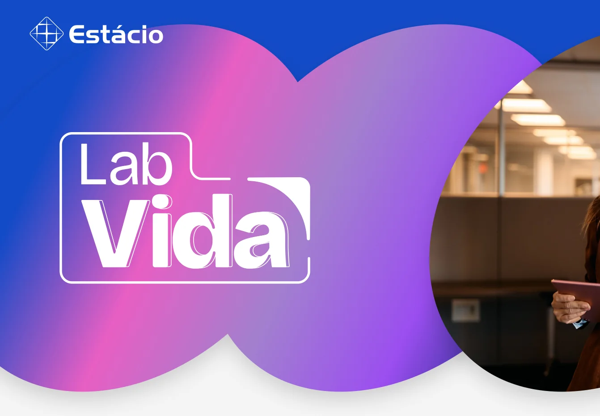
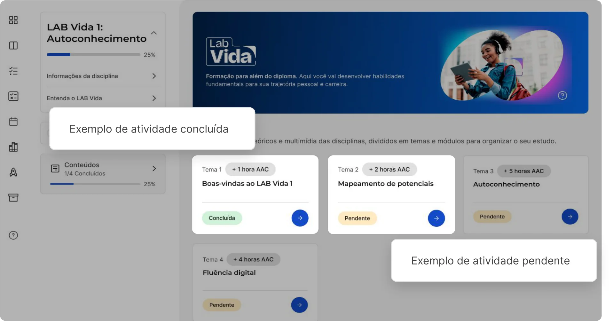
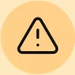
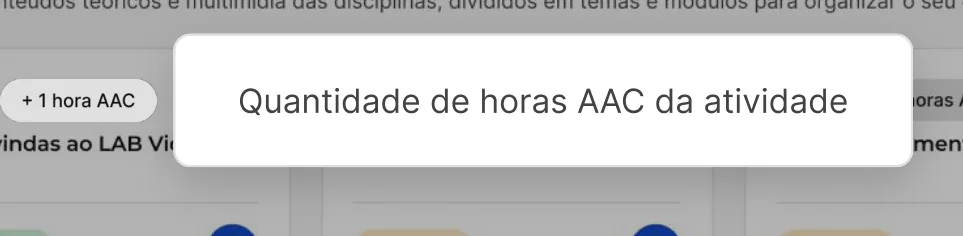

# O que é o LAB Vida? 

O L ~~A~~ B Vida é um programa de ~~f~~ ormação in ~~t~~ egral que acompanha você ao longo do curso. ~~A~~ cada semes ~~t~~ re, você es ~~t~~ uda uma disciplina obriga ~~t~~ ória vol ~~t~~ ada ao desenvolvimen ~~t~~ o de habilidades essenciais para a vida e para a carreira. É uma opor ~~t~~ unidade de re ~~f~~ le ~~t~~ ir, crescer e se preparar para os desa ~~f~~ ios do mundo real. 

# Como o progresso é calculado? 

Cada a ~~t~~ ividade concluída con ~~t~~ a para o seu avanço na disciplina L ~~A~~ B Vida. Para a ~~t~~ ingir 100% de progresso, é necessário concluir ~~t~~ odas as a ~~t~~ ividades do semes ~~t~~ re. 

<!-- Start of picture text -->
Exemplo de a t ividade concluída Exemplo de a t ividade penden t e <!-- End of picture text -->

# Como alcanço aprovação? 

- ~~A~~ s disciplinas L ~~A~~ B Vida ~~t~~ êm um cri ~~t~~ ério de aprovação di ~~fe~~ ren ~~t~~ e das disciplinas comuns. Nelas, não há provas ou avaliações ~~t~~ radicionais ~~—~~ sua aprovação é de ~~f~~ inida pelo seu progresso nas a ~~t~~ ividades. 

Para ser aprovado, você precisa concluir pelo menos 60% das a ~~t~~ ividades da disciplina. Quando isso acon ~~t~~ ece, sua no ~~t~~ a ~~f~~ inal é 6, e você é au ~~t~~ oma ~~t~~ icamen ~~t~~ e aprovado. Mas lembre ~~-~~ se: a no ~~t~~ a ~~f~~ inal da disciplina é proporcional ao progresso (ou seja, se você concluir 85% de progresso, por exemplo, sua no ~~t~~ a na disciplina será 8,5). 

# Quais são as a ~~t~~ ividades da disciplina LAB Vida? 

Con ~~t~~ eúdos 

- São compos ~~t~~ os por ~~t~~ ex ~~t~~ o e recursos mul ~~t~~ imídia, vol ~~t~~ ados para o desenvolvimen ~~t~~ o de habilidades pessoais, de mercado e ~~t~~ ecnológicas ao longo da sua ~~f~~ ormação. Para uma melhor experiência, recomenda ~~-~~ se seguir a ordem sugerida de conclusão. 

# Como conquis ~~t~~ o horas AAC? 

- Cada a ~~t~~ ividade vale horas ~~AA~~ C. ~~A~~ o concluir uma a ~~t~~ ividade, você acumula horas no con ~~t~~ ador da disciplina. Se você a ~~t~~ ingir 60% de progresso, ao ~~f~~ inal do período as horas acumuladas serão lançadas au ~~t~~ oma ~~t~~ icamen ~~t~~ e na sua ma ~~t~~ rícula. 

- Esse ~~t~~ o ~~t~~ al ~~f~~ icará regis ~~t~~ rado no seu his ~~t~~ órico de ~~At~~ ividades ~~A~~ cadêmicas Complemen ~~t~~ ares ( ~~AA~~ C). Em caso de reprovação, as horas acumuladas não são validadas e não serão lançadas. 

- O lançamen ~~t~~ o das horas ocorre au ~~t~~ oma ~~t~~ icamen ~~t~~ e após o ~~t~~ érmino do período, mas pode levar alguns dias. Se, após 30 dias do ~~f~~ im do período, as horas ainda não ~~t~~ iverem sido regis ~~t~~ radas, você pode abrir um 

- requerimen ~~t~~ o para solici ~~t~~ ar análise. 

Con ~~t~~ ador de horas ~~AA~~ C da disciplina 

<!-- Start of picture text -->
Quan t idade de horas  AA C da a t ividade <!-- End of picture text -->

Lembre ~~-~~ se: as disciplinas L ~~A~~ B Vida são obriga ~~t~~ órias e ~~f~~ undamen ~~t~~ ais para sua ~~fo~~ rmação. ~~A~~ cada semes ~~t~~ re você ~~t~~ em uma disciplina di ~~f~~ eren ~~t~~ e para desenvolver suas habilidades. 

Todos os direi ~~t~~ os reservados 
