# Aprofundamento de funções 

Você vai estudar as funções por diferentes perspectivas complementares: entender o conceito matemático, analisar as propriedades por métodos analíticos e explorar as representações gráficas. O foco estará na consolidação da noção de função real de uma variável real. 

Profa. Loisi Carla Monteiro Pereira 

1. Itens iniciais 

#### Propósito 

Compreender a relevância do conceito de função para interpretação e resolução de problemas diversos, inclusive fenômenos naturais, sociais e de outras áreas. 

#### Objetivos 

- Reconhecer graficamente o domínio, a imagem e o contradomínio de funções. 

- 

- Identificar graficamente os tipos de funções: injetora, sobrejetora e bijetora. 

- 

- Definir funções crescentes e decrescentes. 

- 

- Definir funções periódicas. 

- 

#### Introdução 

Para fazermos modelos matemáticos de nossa realidade, associamos quantidades numéricas aos acontecimentos, fatos e objetos que desejamos estudar ou analisar. É comum obtermos relações expressas em termos de fórmulas ou expressões matemáticas, porém, muitas vezes, as expressões obtidas nem sempre dão origem a um número real para todos os possíveis valores da variável independente. 

Este conteúdo aborda as funções reais de variável real, em que tanto o domínio quanto o contradomínio são subconjuntos de R ou até mesmo todo o R. Mostraremos como as funções se comportam em determinados intervalos da reta real e algumas de suas aplicações. 

Ao observar a natureza, percebemos diversos fenômenos que ocorrem de forma repetitiva em intervalos regulares de tempo, seguindo padrões cíclicos — como as estações do ano e os batimentos cardíacos, por exemplo. Fenômenos desse tipo são representados por uma classe importante de funções: as periódicas. Dentro desse grupo, destacam-se as funções trigonométricas, como seno, cosseno e tangente. 

Para começar, assista ao vídeo a seguir e veja como é importante aprofundar o entendimento sobre as funções. 

##### Conteúdo interativo 

Acesse a versão digital para assistir ao vídeo. 

1. Domínio, imagem e o contradomínio de funções 

## Função 

#### Definindo funções e seus domínios 

As funções são relações matemáticas que seguem algumas regrinhas, e seus domínios precisam de uma análise detalhada. Vamos aprendê-las neste vídeo. Confira! 

##### Conteúdo interativo 

Acesse a versão digital para assistir ao vídeo. 

As funções estão presentes em várias áreas da nossa vida, desde o cálculo de custos e lucro até a otimização de processos contábeis e econômicos. Você já parou para pensar o que define funções? Sabe o que é um domínio da função e como analisá-lo? Vamos explorar juntos como essas ferramentas matemáticas são fundamentais na resolução de problemas práticos e no avanço das tecnologias! 

#### Conceito de função e notação funcional 

Uma função pode ser entendida como uma relação matemática entre dois conjuntos, em que cada valor do primeiro conjunto (domínio) corresponde exatamente a um valor no segundo conjunto (imagem). Formalmente, escrevemos uma função como , em que é o nome da função e é a variável independente. Vamos entender melhor analisando a imagem a seguir. 

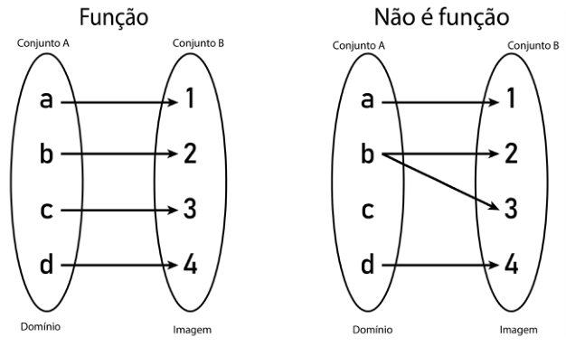

Representação de função e não função entre as relações dos conjuntos A e B. 

Aparecem dois conjuntos na imagem: A e B. Primeiro, observe que cada elemento de A tem um único correspondente em B, ou seja, para cada elemento do conjunto do domínio, temos um único elemento correspondente na imagem. Dizemos, então, que a relação entre A e B é uma função. 

Já no segundo caso, vemos que entre o conjunto A e B, o elemento b tem dois correspondentes no conjunto B, o que significa que ele tem dois elementos de imagem, e isso caracteriza que essa relação não é uma função. Sendo assim, podemos definir a função como sendo uma relação entre dois conjuntos, em que cada elemento do domínio tem somente um elemento de imagem. 

Agora, como definir domínio e imagem? Na verdade, se pegarmos a imagem, que representa uma função, temos, nos conjuntos A e B, três conjuntos distintos: o conjunto domínio (D), o conjunto contradomínio (CD) e 

o conjunto imagem (Im). O conjunto do domínio é de onde saem as setinhas do conjunto A. Por isso o conjunto A é chamado de domínio. O conjunto contradomínio é o conjunto B, pelo simples fato de ele estar recebendo as setinhas. Já o conjunto imagem é formado pelos elementos de B que recebem as setinhas. 

Na imagem, de fato, todos os elementos do conjunto B recebem a setinha, mas vamos analisar agora o conjunto a seguir. 

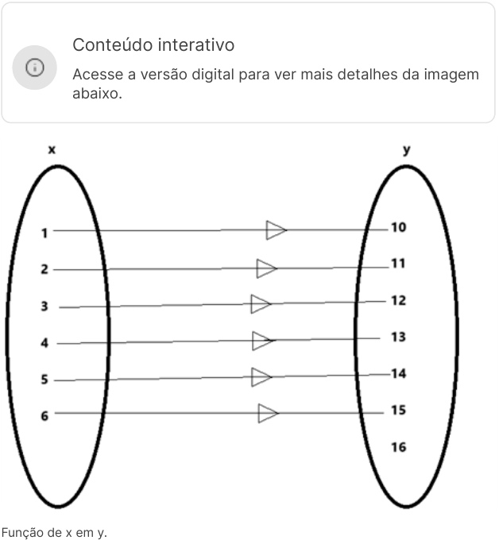

<!-- Start of picture text -->
Conteúdo interativo Acesse a versão digital para ver mais detalhes da imagem abaixo. Função de x em y. <!-- End of picture text -->

Perceba que todos os elementos do conjunto x tem um único elemento de correspondência no conjunto y, o que caracteriza uma função, porém sobra um elemento de y sem ligação. Isso nos diz que os conjuntos: domínio, contradomínio e imagem são: 

Perceba que existe uma diferença entre o contradomínio e a imagem, sendo a imagem formada pelos elementos que receberam a ligação dos elementos do conjunto x. 

Existem diversos tipos de funções e, em geral, na matemática, elas são representadas com o auxílio de polinômios, mas existem outros tipos de funções, como a trigonométrica, mas aqui vamos focar as funções polinomiais. A função é normalmente representada por: f(x), em que f representa a função, e o x dentro do parêntese representa a variável dessa função, que chamamos de variável independente. 

Por que isso? 

O x é o elemento do domínio, que vai levar ao contradomínio da função f(x), um valor. Ao fazer isso, a função f(x) vai processar esse valor e, após processar, vai nos retornar um segundo valor, que é o resultado de f(x). Esse resultando chamamos de imagem. Sendo assim, podemos dizer que x é a variável independente da função e f(x) a variável dependente da função. Isso porque seu valor depende do processamento do contradomínio, que terá valores diferentes para cada valor de entrada de x. Por exemplo, considere a função: 

Perceba que x é a nossa variável independente. Por quê? Porque x é o número que vamos escolher para entrar na função. O cálculo: x + 10 é o contradomínio. Por quê? Porque quando inserirmos o valor de x, vamos realizar um cálculo, que nada mais é do que o processamento do valor de x, e o resultado encontrado será a imagem, que nada mais é do que o valor de f(x). Vamos exemplificar! 

Vamos atribuir para essa função os mesmos valores do domínio da última imagem, ou seja: 

Perceba, então, que x tem que assumir os valores: 1,2,3,4,5,6. Vamos então realizar essa substituição! 

|Domínio|Contradomínio|Imagem|
|---|---|---|
|x|x + 10|f (x)|
|1|1+10|11|
|2|2+10|12|
|3|3+10|13|
|4|4+10|14|
|5|5+10|15|
|6|6+10|16|

Tabela: Exemplo de domínio e imagem de uma função. Loisi Carla Monteiro Pereira. 

Viu? Os elementos do domínio ( ) foram processados no contradomínio , o que resultou na imagem 

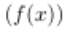

A função que calculamos anteriormente é conhecida como função afim. Essa função é representada por um polinômio de grau 1, e tem como o domínio, todo o conjunto dos números reais, ou seja: . Isso significa que ela é capaz de aceitar qualquer número, no lugar de . 

Mas o domínio sempre será de todos os números reais? A resposta é não! E, para isso, vamos ver dois exemplos: 

1º exemplo 

Perceba agora que a função mudou, e ela tem um na parte de baixo da fração. Será que aqui podemos colocar todos os números reais no lugar do ? A resposta é não! E sabe por quê? Simples, não existe número nenhum que possa ser dividido por zero, ou seja, não existe: . Pense! Quanto seria a divisão de 8 pedaços de pizza para zero pessoas? Isso não faz sentido, correto? É o mesmo caso dessa fração . Não faz sentido. Nesse caso, como não pode ter zero embaixo (no denomiador da fração), o domínio são todos os números reais, exceto o zero, ou seja: 

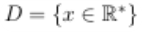

Para o domínio é dado por: 

Lemos esse conjunto domínio da seguinte maneira: x pertence aos reais, exceto o zero. Esse asterístico significa que o zero não faz parte do conjunto domínio. 

Podemos ver que o zero não faz parte do domínio, vendo o gráfico a seguir. 

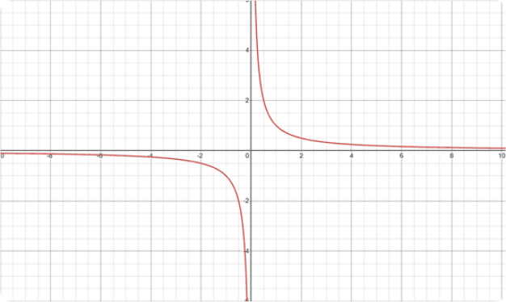

Gráfico: \(\text { função } f(x)=\frac{1}{x} \text {. }\) 

O gráfico aparece no lado positivo do plano cartesiano e também no lado negativo, mas ele salta o zero, ou seja, não passa por x=0. 

2° exemplo 

Perceba que, agora, a função envolve uma raiz quadrada, e dentro de uma raiz quadrada não pode haver número negativo, afinal, não existe raiz quadrada de número negativo. Isso significa que a função pode ter valores positivos ou zero, pois raiz quadrada de zero é zero. Logo, o domínio é: 

Lemos da seguinte forma: x pertence aos reais, tal que x tem que ser maior ou igual a zero. 

Vejamos no gráfico! 

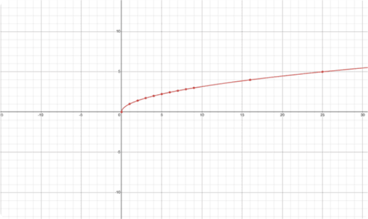

Gráfico: \(\text {função } f(x)=\sqrt{x} \text {. }\) 

Viu? O gráfico dessa função começa no zero e se desenvolve para todos os valores de x positivos. Por isso seu domínio é definido em . 

Entendeu agora como analisamos domínio de uma função? Nós olhamos para a função e vemos se tem alguma restrição, daí explicitamos qual é essa restrição, como fizemos nos dois exemplos anteriores. 

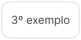

<!-- Start of picture text -->
3º exemplo <!-- End of picture text -->

Vamos descrever o domínio da função do terceiro exemplo em vídeo. Não deixe de conferir! 

#### Domínio de uma função não contínua 

As funções podem ser contínuas, como as funções , ou , mas existem funções que são descontínuas, como a função . Neste vídeo, veremos como analisar seu domínio. Vamos lá! 

##### Conteúdo interativo 

Acesse a versão digital para assistir ao vídeo. 

## Imagem de uma função 

Descubra neste vídeo como podemos encontrar o conjunto imagem de uma função por meio da inversa da função. 

##### Conteúdo interativo 

Acesse a versão digital para assistir ao vídeo. 

Imagine uma função como uma máquina que transforma números. Você insere um valor (a entrada, pertencente ao domínio) e a máquina o processa, produzindo um novo valor (a saída, que faz parte da imagem). A imagem de uma função é o conjunto de todos os possíveis valores de saída que a função pode gerar. Em outras palavras, é o conjunto de todos os valores que a função "atinge". 

Para entender melhor, vamos explorar o conceito de intervalo de existência da imagem, que descreve os valores mínimos e máximos que a imagem pode assumir. Uma forma poderosa de determinar a imagem é através da função inversa. A ideia é simples: se a função original leva o domínio à imagem, a inversa faz o caminho contrário, levando a imagem de volta ao domínio. Vamos aprender isso por meio de exemplos: 

### Exemplo 1 - Função afim 

Considere a função afim f(x) = 2x + 1. Para encontrar sua inversa, vamos primeiro escrever a função na forma de equação, trocando f(x) por y: 

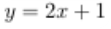

Agora, vamos trocar x por y: 

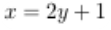

Por fim, vamos isolar y: 

Y é a função inversa , ou seja: a inversa de é . 

Agora que conhecemos a inversa da função, vamos encontrar o domínio da função inversa. Perceba que não temos nenhuma restrição em . Podemos usar todos os números positivos, todos os negativos, e 

o zero também pode fazer parte. Então, uma vez que não há restrição, podemos definir o domínio de , como todos os reais. Logo, nesse caso, a imagem de são todos os números reais, ou seja: 

Isso significa dizer que o conjunto de números que pertencem à imagem estão no intervalo de: . 

Agora, vamos explorar a função . Seguindo o mesmo processo para encontrar a inversa, vamos escrever a função na forma de equação: 

Agora, vamos trocar a posição de x e y: 

Por fim, vamos isolar y: 

A inversa é . Aqui, o domínio da inversa é todos os números reais exceto o zero (não podemos dividir por zero). Consequentemente, a imagem de também são todos os reais, exceto o zero, representado por . 

### Exemplo 3 - Função módulo 25 

Finalmente, vamos analisar a imagem da função módulo: . Para encontrar a inversa, precisamos considerar que calcular o módulo de é fazer o seguinte: 

Perceba que calcular o módulo de -5 é elevar -5 ao quadrado e depois tirar sua raiz quadrada, ou seja: 

Perceba, que para realizar a análise, existe uma pegadinha nessa função. Isso porque o domínio dessa função permite todos os reais, todavia, a imagem não é de todos os reais. Como assim? Perceba que, se entrarmos com um número negativo no lugar de x, o resultado será positivo, por exemplo: 

Então, como na aplicação do número negativo, isso nos remete a um valor positivo, a imagem estará definida somente para os reais positivos, ou seja: 

Vamos olhar para o gráfico para entender melhor: 

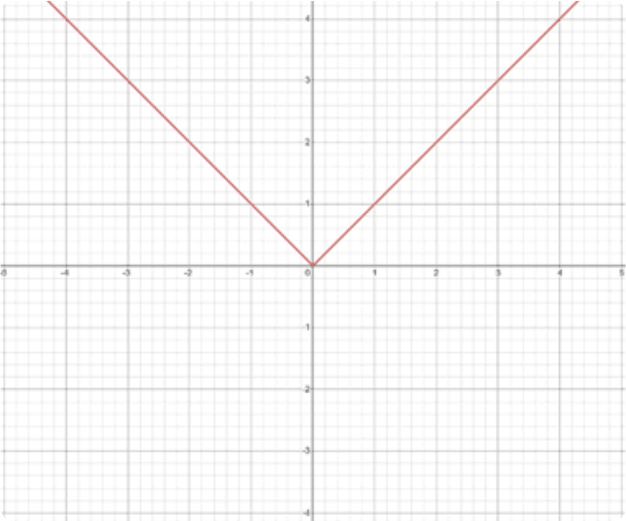

Gráfico: \(\text {Função } f(x)=|x| \text {. }\) 

Perceba que, para valores negativos de , temos valores de positivos, e para valores de positivos, temos valores de positivos, e o zero também participa da função. 

Agora que você já leu o exemplo e a solução, vamos concretizar esse aprendizado neste vídeo. Confira! 

Conteúdo interativo 

Acesse a versão digital para assistir ao vídeo. 

## Domínio 

Confira a definição do domínio da função neste vídeo. 

##### Conteúdo interativo 

Acesse a versão digital para assistir ao vídeo. 

#### Exemplo 1 

Dado o gráfico de uma função, uma forma de encontrar o domínio da função é projetar o gráfico no eixo . 

Observe o gráfico da função : 

Gráfico: Função \(f\) 

O que acontece se projetarmos o gráfico da função no eixo ? Confira no gráfico a seguir. 

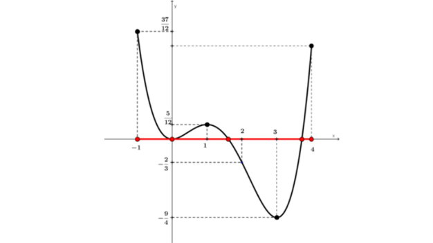

Gráfico: A função no eixo \(O_x\) 

Vemos que o domínio da função é o intervalo no eixo das abscissas indicado em vermelho. Seu domínio é o intervalo fechado: 

#### Exemplo 2 

Observe o gráfico da função g: 

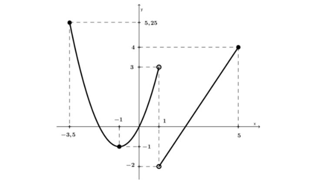

Gráfico: Função g 

O que acontece se projetarmos o gráfico da função no eixo ? Confira a seguir. 

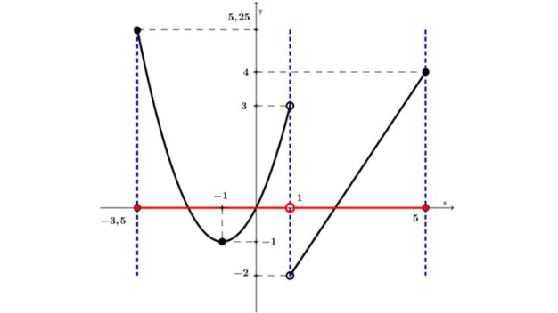

Gráfico: A função g projetada no eixo Ox 

Vemos que o domínio da função g é o conjunto no eixo das abscissas indicado em vermelho. Seu domínio é a união de intervalos disjuntos (intervalos cuja interseção é vazia): 

#### Domínio da função 

Assista ao vídeo e veja mais um exemplo de domínio da função. 

Conteúdo interativo Acesse a versão digital para assistir ao vídeo. 

## Imagem 

Exemplo 1 

Dado o gráfico de uma função, uma forma de encontrar a imagem da função é projetar o seu gráfico no eixo 

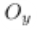

Observe o gráfico da função : 

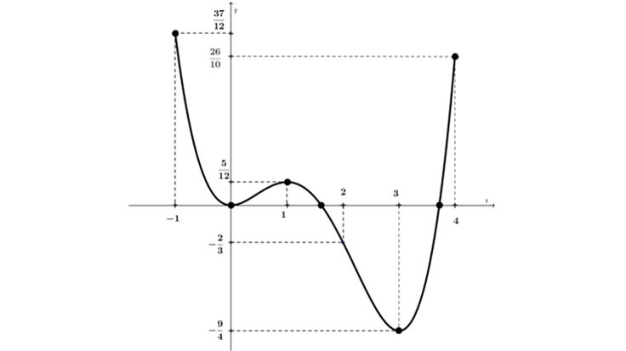

Gráfico: Função \(f\) 

O que acontece se projetarmos o gráfico da função no eixo Oy? Veja! 

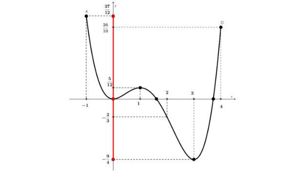

Gráfico: A função no eixo Oy 

A imagem da função é o intervalo fechado indicado em vermelho no eixo . Sua imagem é o intervalo fechado. 

#### Exemplo 2 

Observe o gráfico da função g: 

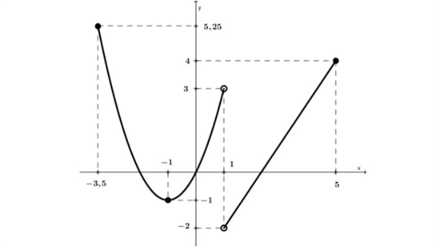

Gráfico: A função g 

O que acontece se projetarmos o gráfico da função no eixo Oy? Confira! 

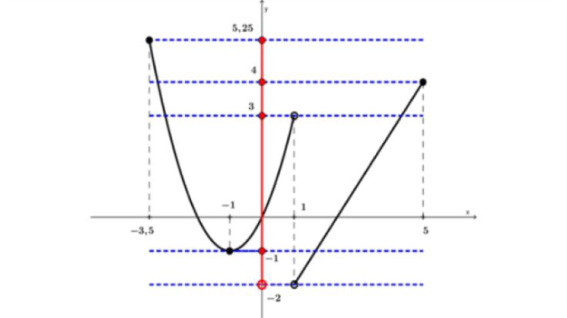

Gráfico: A função g projetada no eixo Oy 

Vemos que a imagem da função é o intervalo indicado em vermelho no eixo . Sua imagem é o intervalo ( . 

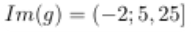

#### Exemplo 3 

Considere agora o gráfico da função h: 

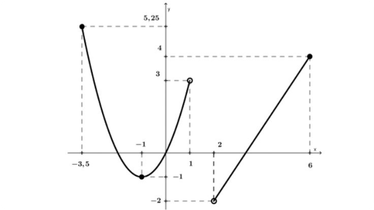

Gráfico: Função h 

Se projetarmos o gráfico da função no eixo Oy, vemos que a imagem da função h é o intervalo indicado em vermelho no eixo Oy, conforme mostrado a seguir. 

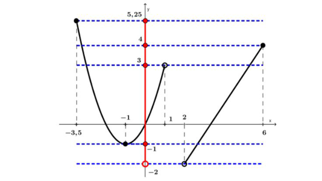

Gráfico: A função no eixo Oy 

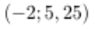

Sua imagem é o intervalo 

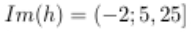

Em resumo, é possível determinar a imagem de um conjunto de pontos: 

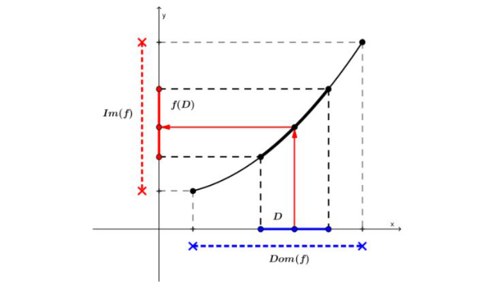

Gráfico: Imagem de um conjunto de pontos 

Se é um subconjunto do domínio da função (pintado de azul no gráfico), então, a imagem deste subconjunto é dada por . 

#### Exemplo 4 

Assista ao vídeo e confira mais um exemplo de imagem da função. 

Conteúdo interativo 

Acesse a versão digital para assistir ao vídeo. 

#### Exemplo 5 

Observe o gráfico da função f e o intervalo [−2 /3;5 /12] destacado em verde no eixo Oy, que é um subconjunto da imagem de f. 

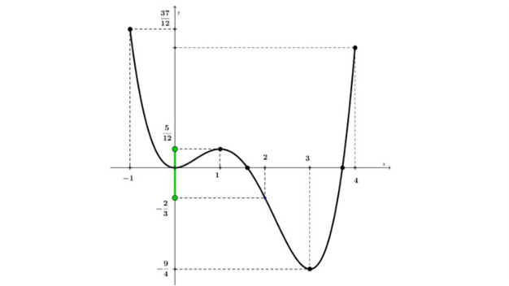

Gráfico: Função f 

Ao traçar as retas y =5 /12 e y = −2 /3 de forma horizontal, partindo no eixo Oy , temos: 

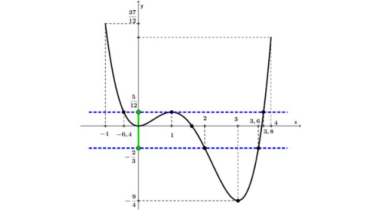

Gráfico: As retas \(y=5 / 12\) e \(y=-2 / 3\) 

Se pegarmos a parte do gráfico restrita à região entre as retas y = −2 /3 e y =5 /12 , temos: 

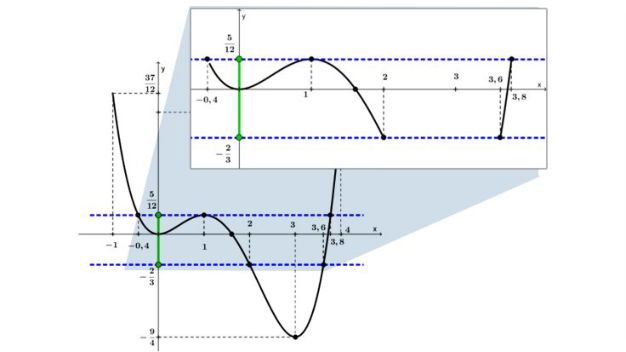

Gráfico: A região entre as retas y = − 2 / 3 e y = 5 / 12 

Agora, para descobrirmos a parte do domínio correspondente ao intervalo [−2 /3;5 /12] da imagem, basta projetarmos no eixo Ox. A parte do eixo Ox que nos interessa está destacada em vermelho: [−0,4 ; 2] ∪ [3,6 ; 3,8]: 

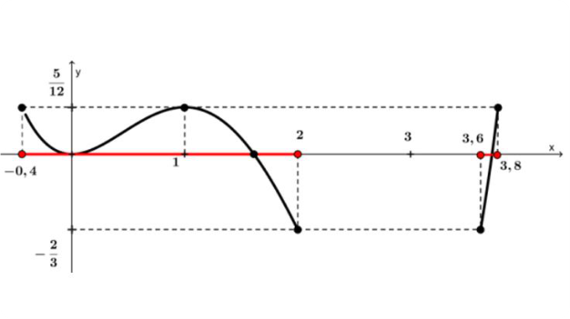

Gráfico: Parte do domínio correspondente ao intervalo [− 2 / 3 ; 5 / 12 ] 

## Teoria na prática 

A startup InovaTech desenvolveu um aplicativo inovador. O lucro da empresa, em milhares de reais, em função do tempo t (em meses) desde o lançamento do aplicativo, é modelado pela seguinte função: 

L(t) representa o lucro da InovaTech no mês t. Diante disso, determine: 

a) O domínio da função L(t), considerando as restrições do problema. Expresse o domínio como uma união de intervalos. 

b) A imagem da função L(t). Expresse a imagem como uma união de intervalos. 

Acompanhe a resolução no vídeo a seguir! 

#### O caso InovaTech 

Vamos utilizar as análises matemáticas aprendidas, para encontrar neste vídeo, o domínio e a imagem da função que descreve o lucro em função do tempo. Assista! 

Conteúdo interativo 

Acesse a versão digital para assistir ao vídeo. 

## Mão na massa 

Questão 1 

Dona Bete é uma boleira renomada por seus bolos deliciosos. Para facilitar o cálculo do preço das encomendas, ela utiliza a seguinte função matemática: 

x representa o diâmetro do bolo em centímetros (cm) e o resultado de f(x) corresponde ao preço por fatia do bolo (em reais). 

Para garantir que a função f(x) calcule corretamente o preço por fatia, qual deve ser o domínio da função, ou seja, quais valores de x (diâmetro do bolo) são permitidos para que o cálculo faça sentido no contexto da situação? 

A 

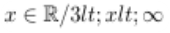

B 

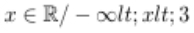

C 

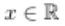

D 

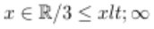

E 

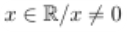

A alternativa A está correta. 

Na função , a expressão dentro da raiz quadrada precisa ser positiva para evitar raízes quadradas de números negativos, além de garantir que o denominador não seja zero. Assim, , ou seja, . Portanto, o domínio da função é . 

#### Questão 2 

Um economista está analisando uma função que representa o lucro de uma empresa em função da quantidade de produtos vendidos, dada por: 

Aqui, L(x) representa o lucro e x é o número de produtos vendidos. Para garantir que as análises sejam precisas, é necessário entender o domínio dessa função, ou seja, quais valores de x são aceitos. 

Qual das opções a seguir apresenta a análise correta do domínio da função L(x)? 

A B C D 

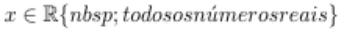

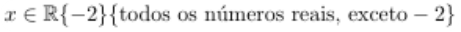

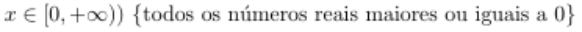

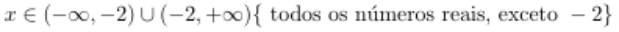

E 

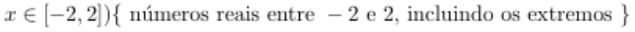

##### A alternativa B está correta. 

A função não está definida para porque isso resultaria em uma divisão por zero. Portanto, o domínio da função são todos os números reais, exceto -2, já que valores negativos não se aplicam no contexto do lucro da empresa. 

#### Questão 3 

Considere a função a seguir. 

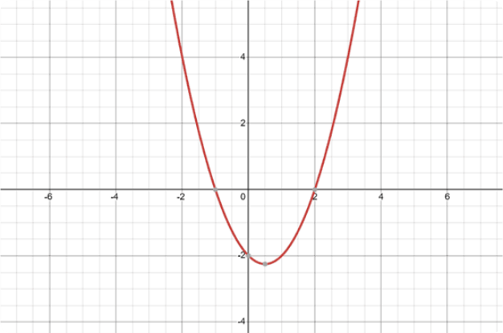

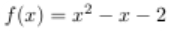

A função apresentada mostra uma parábola descrita por: grau. 

, que é uma função do segundo 

Com base na imagem, assinale a alternativa que indica o valor da imagem para o elemento do domínio igual a 2. 

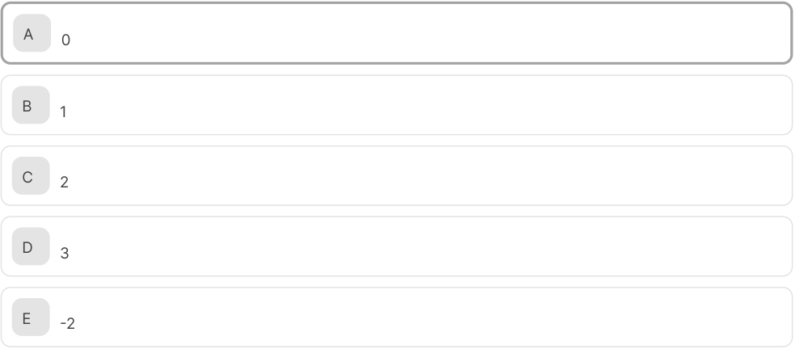

<!-- Start of picture text -->
A 0 B 1 C 2 D 3 E -2 <!-- End of picture text -->

<!-- Start of picture text -->
A alternativa A está correta. <!-- End of picture text -->

No plano cartesiano, os elementos do domínio estão representados no eixo x, e os elementos da imagem, no eixo y. Quando x = 2, y = 0. Veja! 

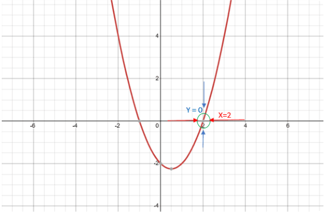

#### Questão 4 

Considere a função matemática apresentada no gráfico a seguir. 

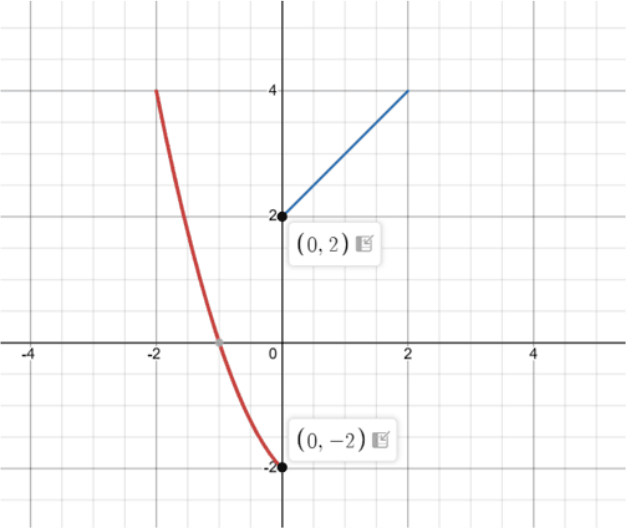

Em que coordenada da abscissa ocorre a disjunção dos intervalos da função? 

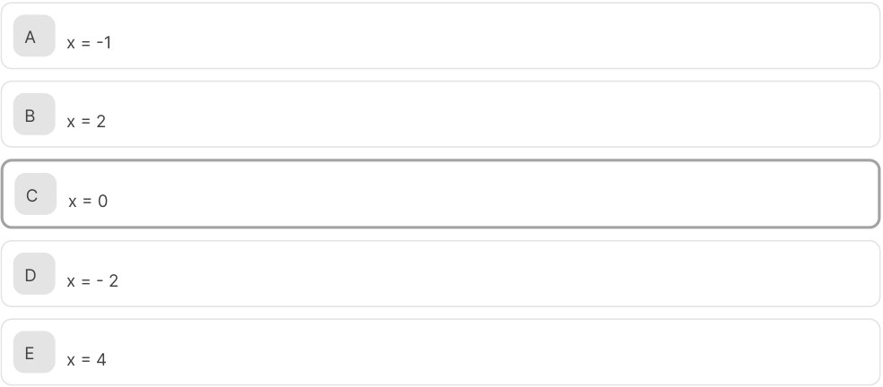

<!-- Start of picture text -->
A x = -1 B x = 2 C x = 0 D x = - 2 E x = 4 <!-- End of picture text -->

A alternativa C está correta. 

Veja que no gráfico a parte da função em vermelho termina em (0, -2), ou seja, sua abscissa é x = 0, e a parte da função em azul começa em (0, 2), ou seja, sua abscissa é x = 0. Então, a disjunção acontece na abscissa x = 0. 

#### Questão 5 

Um contador está desenvolvendo uma planilha para calcular o crescimento de um investimento ao longo do tempo. Para isso, ele usará uma função que deve ter um domínio restrito a valores não negativos, ou seja, , representando o tempo em anos. 

Qual das opções a seguir apresenta uma função cujo domínio é ? 

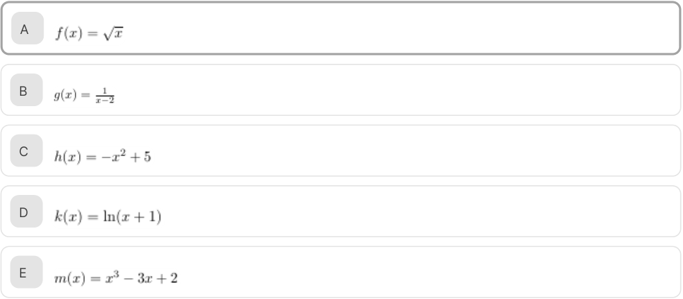

<!-- Start of picture text -->
A B C D E <!-- End of picture text -->

##### A alternativa A está correta. 

A função está definida para todos os valores de x que são maiores ou iguais a 0, pois a raiz quadrada de um número negativo não é um valor real. As outras opções têm domínios que incluem números negativos. 

#### Questão 6 

Um analista financeiro está estudando a variação do preço de uma ação ao longo dos anos, utilizando a função , em que representa a flutuação do preço da ação em função do tempo , medido em anos. 

Qual das opções apresenta a análise correta sobre o domínio da função e a imagem que ela pode assumir ao longo do tempo? 

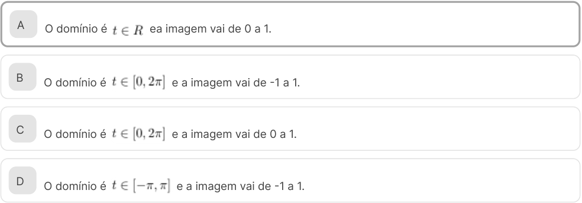

<!-- Start of picture text -->
A O domínio é   ea imagem vai de 0 a 1. B O domínio é   e a imagem vai de -1 a 1. C O domínio é   e a imagem vai de 0 a 1. D O domínio é   e a imagem vai de -1 a 1. <!-- End of picture text -->

E O domínio é e a imagem vai de 0 a 0,5. 

##### A alternativa A está correta. 

A função tem domínio em , já que está definida para todos os valores reais. Os valores que a função pode assumir na função señ variam entre -1 e 1 , mas, como estamos falando de , os valores negativos se tornam positivos, logo, a imagem passa a variar de 0 a 1. 

## Verificando o aprendizado 

###### Questão 1 

(PETROBRAS - 2008) Considere que f é uma função definida do conjunto D em R por: ƒ(x) = x² − 4x + 8. Sendo Im a imagem de f, é correto afirmar que, se: 

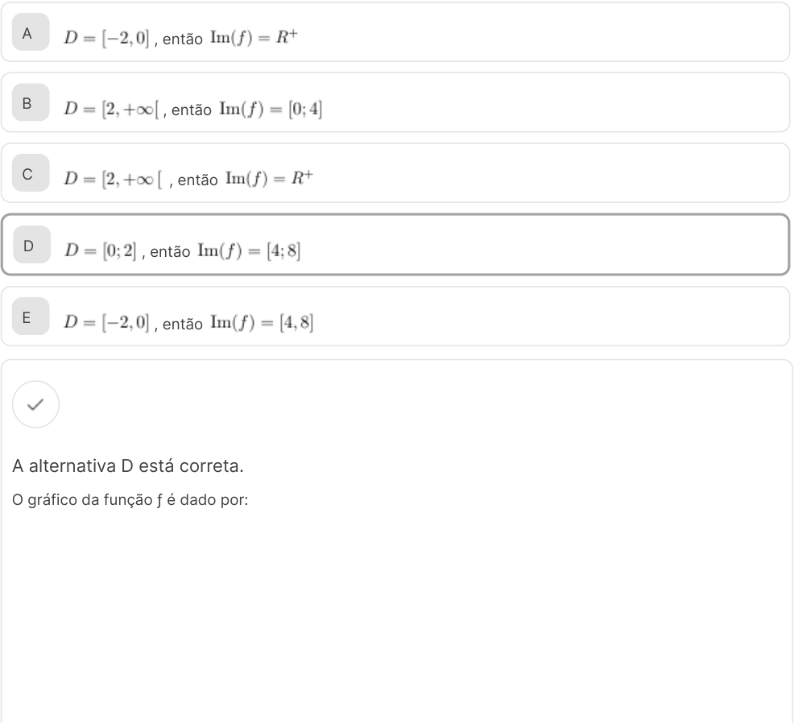

<!-- Start of picture text -->
A , então B , então C , então D , então E , então A alternativa D está correta. O gráfico da função ƒ é dado por: <!-- End of picture text -->

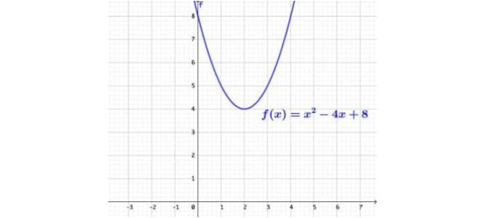

Vamos analisar cada restrição do domínio da função f. Note que, se D = [−2, 0], temos que Im(ƒ) = [8, 20]. Se D = [2, +∞[, temos que Im(ƒ) = [4, +∞). 

Se D = [0; 2], temos que ln(ƒ) = [4 ; 8]. 

###### Questão 2 

|Consid|ere a função f(x) = 120x ÷ (300−x). Podemos afirmar que o domínio da função f é:|
|---|---|
|A|Todo número real x.|
|B|Todo número real x, exceto os números positivos.|
|C|Todo número real x, exceto x = 300.|
|D|Todo número real x, exceto os números negativos.|
|E|Todo número real x, exceto x = 0.|
|A alt|ernativa C está correta.|
|A fun|ção não está definida para x = 300, pois este número anula o denominador.|

2. Tipos de funções: injetora, sobrejetora e bijetora 

## Funções injetoras 

#### Conhecendo funções injetoras 

Descubra o que é uma função injetora neste vídeo e entenda a importância de conhecer o seu comportamento. 

##### Conteúdo interativo 

Acesse a versão digital para assistir ao vídeo. 

Funções injetoras parece um nome complicado, mas a ideia é bem simples e útil, principalmente quando pensamos em organização e processos em uma empresa. 

Imagine que você esteja organizando os funcionários em diferentes equipes para um projeto. Uma função injetora no mundo da matemática é como garantir que cada funcionário (que seria o nosso x) tenha uma única função ou tarefa atribuída (que seria o nosso f(x)), e que funções ou tarefas diferentes sejam sempre atribuídas a funcionários diferentes. Não pode haver dois funcionários fazendo a mesma função se eles são pessoas diferentes. 

Formalizando um pouco, mas sem complicação: uma função é dita injetora (ou injetiva) se, para quaisquer dois números, , que fazem parte do domínio da função , e que são diferentes um do outro , os resultados da função para esses números — ou seja, e — também são sempre diferentes na imagem de . 

Em termos mais práticos ainda, pense assim: se você tem dois inputs diferentes ( e ), você sempre vai ter outputs diferentes, como: ( e . É como um sistema de senhas único para cada usuário, cada pessoa (input) tem uma senha diferente (output). 

Vamos entender com o auxílio de diagramas. Para isso, vamos repetir: uma função é injetora quando só existe uma única ligação entre domínio e imagem. Nenhum elemento de imagem pode receber mais do que um elemento de domínio, veja! 

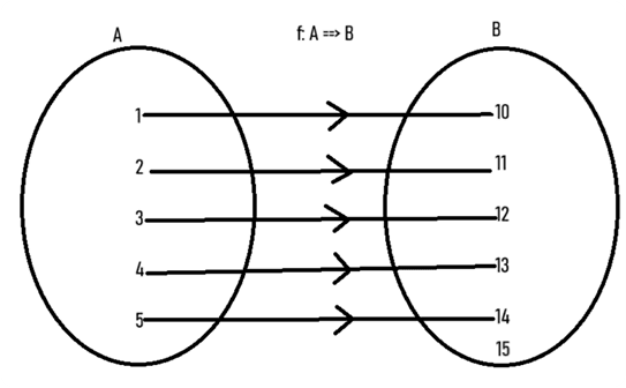

\(\text { Função injetora de } A \rightarrow B \text {. }\) 

Perceba que todos os elementos do domínio (conjunto A) têm um único correspondente na imagem (conjunto B) e que nenhum elemento da imagem tem mais de um elemento do domínio. É, literalmente, "um para cada um". 

Vamos explorar três exemplos de funções injetoras, também conhecidas como funções um-para-um. 

Atenção Lembre-se que uma função é injetora se cada elemento da imagem está associado a um único elemento do domínio. Em outras palavras, se , então . 

Exemplo 1 - Função fim 

Vamos verificar neste exemplo como a função afim é injetora. 

Para analisar se uma função é injetora, observamos este gráfico: 

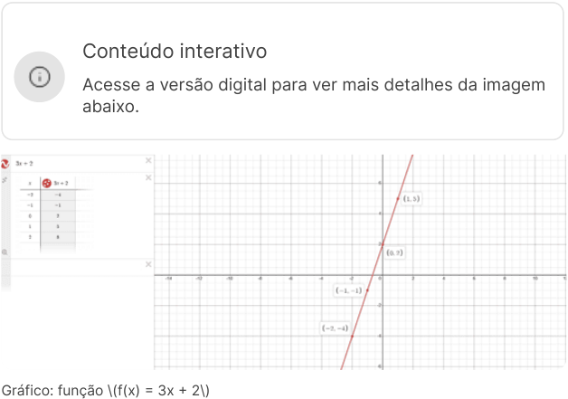

<!-- Start of picture text -->
Conteúdo interativo Acesse a versão digital para ver mais detalhes da imagem abaixo. Gráfico: função \(f(x) = 3x + 2\) <!-- End of picture text -->

Perceba que temos uma reta crescente (que cresce da esquerda para a direita). E que cada elemento de x tem um único correspondente em y, e que cada elemento em y recebe somente um elemento em x. Por isso, essa função afim é injetora. 

Observação: funções afins do tipo , em que é diferente de zero, são sempre injetoras. O coeficiente angular diferente de zero garante que a reta seja inclinada e, portanto, cada valor de na imagem corresponde a um único valor de no domínio. 

### Exemplo 2 - Função exponencial 

É uma função do tipo , em que é a base e é o expoente. Para poder verificar que esse tipo de função é injetora, vamos analisar a função: . Faremos da mesma forma que fizemos anteriormente. Vamos analisar o gráfico! 

<!-- Start of picture text -->
Conteúdo interativo Acesse a versão digital para ver mais detalhes da imagem abaixo. <!-- End of picture text -->

Gráfico: função \(f(x) = 2^x\). 

Perceba que, assim como na função afim, temos somente um para um de x e y. E por isso, a função exponencial é uma função injetora. 

### Exemplo 3 - Função quadrada 

Vejamos agora um exemplo de uma função que não é injetora, uma função quadrada do tipo 

. Para isso, vamos analisar o gráfico de 

Conteúdo interativo Acesse a versão digital para ver mais detalhes da imagem abaixo. 

Gráfico: função \(f(x) = ax^2 - x - 12\). 

Repare no gráfico que temos alguns exemplos de valores distintos do domínio com a mesma imagem, perceba quando e quando também. Outro exemplo: quando e quando . 

O fato de existirem elementos distintos do domínio com a mesma imagem faz com que a função não seja injetora. 

## Funções sobrejetoras 

#### Função sobrejetora 

Assista ao vídeo para entender o que é uma função sobrejetora e conferir exemplos práticos que ajudam a identificar se uma função possui ou não essa característica. 

Conteúdo interativo 

Acesse a versão digital para assistir ao vídeo. 

Imagine lançar uma campanha de marketing e descobrir que ela só alcançou uma parte do mercado (público-alvo). Frustrante, não? No universo matemático, as funções também lidam com essa questão de "alcance": como garantir que todos os elementos de um conjunto sejam "atingidos" por uma regra específica? É aqui que entra o conceito de função sobrejetora. 

Afinal, o que é uma função sobrejetora? 

Imagine ter um conjunto de “clientes em 

potencial” (domínio) e um conjunto de "benefícios do seu produto" (contradomínio). Uma função sobrejetora garante que cada benefício seja relevante para pelo menos um cliente em potencial. Em outras palavras, ninguém fica de fora! A imagem da função (os benefícios realmente relevantes) coincide perfeitamente com o contradomínio (todos os benefícios do produto). Formalmente, uma função é sobrejetora se, para cada elemento em (contradomínio), existe pelo menos um (domínio), tal que . 

Em outras palavras, quando o conjunto imagem é igual ao conjunto contradomínio, temos uma função sobrejetora. Vamos ver o diagrama com os balõezinhos para entender melhor: 

Representação de uma função sobrejetora. 

Nenhum elemento do conjunto B ficou sem ligação, logo, o conjunto imagem é igual ao conjunto contradomínio e ambos são iguais ao conjunto B. 

Agora, vamos explorar alguns exemplos para consolidar esse conceito. 

### Exemplo 1 

Para entender o comportamento de uma função sobrejetora, vamos analisar o comportamento de uma função afim do tipo . A função a ser analisada é: . 

Para analisar se o seu contradomínio é igual à sua imagem, observe o gráfico. 

<!-- Start of picture text -->
Conteúdo interativo Acesse a versão digital para ver mais detalhes da imagem abaixo. <!-- End of picture text -->

<!-- Start of picture text -->
Gráfico: Função afim \(f(x) = 3x - 5\). <!-- End of picture text -->

Perceba que os domínios da função são todos os reais e, como já vimos, as imagens de qualquer função afim, também são todos os reais. Logo, nesse caso, o conjunto contradomínio é igual ao conjunto imagem, o que faz essa função ser sobrejetora. 

Agora, vamos falar de uma função que não apresenta o comportamento sobrejetor: a função quadrática. 

### Exemplo 2 

Vamos analisar a função quadrática . Observe o gráfico! 

Gráfico: Função quadrática \(f(x)=x^2\). 

Perceba que a imagem da função está totalmente acima do eixo , ou seja, a imagem pertence somente aos reais positivos. Por conta disso, essa função não é sobrejetora, pois os valores negativos do contradomínio não interagem com os elementos do domínio. 

## Função bijetora 

É uma função que é injetora e sobrejetora ao mesmo tempo. Ou seja, para cada elemento da imagem, pode haver somente um elemento do domínio, e o conjunto imagem precisa ser igual ao conjunto contradomínio. Demonstrando no diagrama de balõezinhos, temos: 

<!-- Start of picture text -->
Representação de uma função bijetora. <!-- End of picture text -->

Confira mais exemplos! 

Exemplo 1: Vamos considerar a função afim . Perceba que essa é uma função afim do tipo , em que . O gráfico dessa função nos mostra o seguinte: 

Função afim \(f(x) =4x\). 

Perceba que o domínio pertence a todos os reais, e a imagem também, uma vez que se trata de uma função afim. Para cada ponto do domínio, temos um ponto de imagem diferente, o que nos faz ver que a função é injetora. Além disso, o conjunto imagem é igual ao conjunto contradomínio, que é o conjunto dos números reais, logo, ela também é sobrejetora. Isso faz dessa função uma função bijetora. 

## Teoria na prática 

Imagine que sua agência de marketing foi contratada para uma campanha publicitária inovadora voltada para o público de meia-idade (45 a 65 anos). O objetivo ambicioso é alcançar 5 milhões de pessoas desse grupo demográfico em apenas 3 dias utilizando anúncios on-line. A equipe de analistas de dados desenvolveu um modelo matemático para prever o alcance da campanha ao longo do tempo, baseado em uma função que leva em conta a viralização do conteúdo e o investimento em impulsionamento. 

A função que modela o alcance de pessoas da campanha em função do tempo x (em dias) é dada por: 

Considerando o contexto do problema, defina o domínio, o contradomínio e a imagem, e indique se a função f(x) é injetora sobrejetora ou bijetora. Por fim, diga se a campanha de marketing teve sua meta alcançada. 

Após finalizar o caso, acompanhe a resolução no vídeo a seguir! 

#### Analisando uma função exponencial 

Veja, neste vídeo, a aplicação de uma função exponencial em uma situação real. 

##### Conteúdo interativo 

Acesse a versão digital para assistir ao vídeo. 

## Mão na massa 

###### Questão 1 

Uma empresa de marketing digital usa a função para prever o ROI de campanhas on-line, em que $x$ é o investimento em milhares de reais (entre 1 e 10) ef(x) é o ROI em porcentagem. Qual opção descreve corretamente o domínio, a imagem, o tipo de função e o ROI para um investimento de R$2.000? 

A Domínio: [1, 10], Imagem: [0, ), Injetora, B Domínio: ( 0,10 ], Imagem: , Sobrejetora, C Domínio: [1, 10], Imagem: [0, ], Injetora não sobrejetora, ROI D Domínio: , Imagem: , Bijetora, E Domínio: , Imagem: , Sobrejetora, 

<!-- Start of picture text -->
A alternativa C está correta. Vamos analisar por partes: - Domínio: [1, 10], conforme enunciado. - Imagem: Aproximadamente [0,  ], considerando o comportamento da função. - Tipo: Injetora (cada x tem um único  ), não sobrejetora (não cobre todos os reais). - ROI para R$ 2.000: <!-- End of picture text -->

Como o ROI é em porcentagem, multiplicamos por 100: 

Observação: os termos negativos = 0,0078125 e = 0,25 são muito menores que 1, por isso, eles foram dispensados. 

###### Questão 2 

Uma empresa de manufatura produz determinado produto. O custo total de produção (em milhares de reais) é dado pela função C(q) = q² + 2q + 5, em que q representa a quantidade de produtos produzidos (em milhares de unidades). A capacidade máxima de produção da empresa é de 10 mil unidades. 

Analise a função C(q) e assinale a opção correta sobre a análise de domínio, imagem e natureza da função: 

A Domínio: [0, 10], Imagem: [5, 125], Função Bijetora 

B Domínio: [0, 10], Imagem: [5, 125], Função Injetora 

C Domínio: , Imagem: [4, ), Função Injetora 

D Domínio: , Imagem: , Função Sobrejetora 

E Domínio: , Imagem: [5, ), Função Sobrejetora 

##### A alternativa B está correta. 

O domínio é limitado pela capacidade máxima de produção. A imagem corresponde aos custos para a produção dentro do domínio. A função é injetora, pois, para cada quantidade produzida, há um custo único. Não é sobrejetora porque a imagem não abrange todos os reais positivos. 

###### Questão 3 

Uma empresa de varejo utiliza uma função para modelar a demanda (em milhares de unidades) de um produto em função do seu preço p (em reais): D(p) = 10 – 0,5p, onde 0 ≤ p ≤ 20. 

Considerando a função de demanda D(p): 

A Domínio: [0, 20], Imagem: [0, 10], Função Bijetora 

B Domínio: [0, 20], Imagem: [0, 10], Função Injetora, mas não sobrejetora. C Domínio: (-∞, ∞), Imagem: (-∞, ∞), Função Bijetora. D Domínio: [0, 10], Imagem: [0, 20], Função Sobrejetora. 

E Domínio: [0, 20], Imagem: [10, 0], Função Injetora 

##### A alternativa B está correta. 

O domínio é definido no enunciado e a imagem varia de 10 (para p=0) a 0 (para p=20). Por fim, a função é bijetora, pois é injetora (cada preço tem uma demanda única) e sobrejetora (todos os valores de demanda entre 0 e 10 são atingidos). 

###### Questão 4 

Uma empresa de consultoria possui 8 consultores e precisa alocá-los em 6 projetos distintos. Cada consultor pode ser alocado em apenas um projeto e cada projeto precisa de, pelo menos um, consultor. 

Modelando a alocação de consultores como uma função que mapeia consultores em projetos, 

|A|a função pode ser injetora e sobrejetora.|
|---|---|
|B|a função pode ser injetora, mas não sobrejetora.|
|C|a função pode ser sobrejetora, mas não injetora.|
|D|a função não pode ser injetora nem sobrejetora.|
|E|a função pode ser bijetora.|

- A alternativa C está correta. 

Como cada projeto precisa de, pelo menos, um consultor, a função é sobrejetora. No entanto, como há mais consultores do que projetos, alguns consultores precisarão ser alocados no mesmo projeto, tornando a função não injetora. 

###### Questão 5 

Uma empresa de e-commerce modela seu estoque de um produto pela função E(t) = 1000 - 50t, onde t é o tempo em dias (começando em t=0 com estoque cheio) e E(t) é o número de unidades em estoque. A empresa realiza uma nova encomenda para reabastecer o estoque exatamente quando o nível atinge 200 unidades. 

Considerando o período de tempo desde t=0 até o momento exato em que a nova encomenda é feita, qual alternativa descreve corretamente o domínio relevante (D) desse período, a imagem correspondente (I) dos níveis de estoque, e a classificação da função E(t) como uma aplicação de D em I? 

|A|D = [0, 16], I = [200, 1000], Função Bijetora.|
|---|---|
|B|D = [0, 20], I = [0, 1000], Função Injetora.|
|C|D = [0, ∞), I = (-∞, 1000], Função Sobrejetora.|
|D|D = [0, 16], I = [200, 1000], Função Injetora.|
|E|D = [0, 20], I = [200, 1000], Função Bijetora.|

##### A alternativa A está correta. 

1. Determinação do Domínio Relevante (D): 

   - O período começa em t=0. 

   - 

   - O período termina quando o estoque atinge 200 unidades. Precisamos encontrar o valor de t para o qual E(t) = 200. 

   - 1000 - 50t = 200 

   - 1000 - 200 = 50t 

   - 800 = 50t 

   - t = 800 / 50 = 16 dias. 

   - Portanto, o domínio relevante, que representa o intervalo de tempo do ciclo operacional considerado, é D = [0, 16]. 

###### 2. Determinação da Imagem Relevante (I): 

- A imagem consiste nos valores de E(t) para t no domínio [0, 16]. 

- No início do período (t=0): E(0) = 1000 - 50(0) = 1000 unidades. 

- 

- No final do período (t=16): E(16) = 1000 - 50(16) = 1000 - 800 = 200 unidades. 

- 

- Como E(t) é uma função linear decrescente, ela assume todos os valores reais entre 200 e 1000 (inclusive) conforme t varia de 0 a 16. 

- Portanto, a imagem relevante, que representa os níveis de estoque durante este ciclo, é I = [200, 1000]. 

###### 3. Classificação da Função (E: D → I): 

- Injetora (Um-para-um)? Sim. Como E(t) é uma função linear com inclinação não nula (-50), cada valor de t no domínio [0, 16] corresponde a um único valor E(t) na imagem [200, 1000]. Se t1 ≠ t2, então E(t1) ≠ E(t2). 

- Sobrejetora (Sobre)? Sim. Considerando a função como uma aplicação do domínio D = [0, 16] no contradomínio I = [200, 1000], todo elemento da imagem I é atingido por algum elemento do domínio D. Ou seja, para qualquer nível de estoque y entre 200 e 1000, existe um tempo t entre 0 e 16 tal que E(t) = y. 

- Bijetora? Sim. Uma função é bijetora se for simultaneamente injetora e sobrejetora (quando o contradomínio considerado é a própria imagem relevante). 

A função E(t), restrita ao ciclo operacional t ∈ [0, 16], mapeia este domínio bijetivamente na imagem [200, 1000]. A alternativa (a) descreve corretamente o domínio, a imagem e a classificação. A alternativa (d) está parcialmente correta (a função é injetora), mas incompleta, pois também é sobrejetora sobre a imagem relevante, tornando-a bijetora. As demais alternativas erram o domínio, a imagem ou ambos. 

###### Questão 6 

Uma empresa utiliza a função para modelar a produtividade percentual de um novo funcionário em relação ao máximo possível, onde t é o tempo de treinamento em semanas (t ≥ 0). 

Considerando o domínio natural da função no contexto do problema (D) e a imagem correspondente dos níveis de produtividade (I), qual alternativa descreve corretamente D, I e a classificação da função P(t)? 

A D = [0, ∞), I = (0, 100), Função Bijetora 

- B D = [0, ∞), I = [0, 100), Função Injetora 

- C D = (-∞, ∞), I = (0, 100), Função Sobrejetora 

- D D = [0, ∞), I = [0, 100], Função Injetora 

- E D = (-∞, ∞), I = (-∞, ∞), Função Bijetora 

##### A alternativa B está correta. 

1. Determinação do Domínio (D): 

   - A variável t representa o tempo de treinamento em semanas. No contexto do problema, o tempo não pode ser negativo. Ele começa em t=0 (início do treinamento) e pode, teoricamente, continuar indefinidamente. 

   - Portanto, o domínio natural da função neste contexto é D = [0, ∞). Isso elimina as opções (c) e (e). 

###### Determinação da Imagem (I): 

2. 

- A imagem consiste nos valores possíveis de P(t) para t no domínio [0, ∞). 

- 

- No início (t=0): P(0) = 100 = 100 = 100(1 - 1) = 0. A produtividade começa em 0%. 

- Conforme t aumenta e tende ao infinito (t → ∞): O termo -0.2t tende a -∞. O termo tende a 0. 

- Assim, P(t) tende a 100(1 - 0) = 100. A produtividade se aproxima assintoticamente de 100%, mas nunca a atinge para valores finitos de t, pois é sempre maior que zero. 

- Para verificar se a função é crescente, calculamos a derivada: = . Como é sempre positivo, P'(t) é sempre positivo para t ≥ 0. Isso confirma que a função é estritamente crescente. 

- Como a função começa em P(0)=0 e cresce continuamente, aproximando-se de 100 sem nunca atingi-lo, a imagem (conjunto de valores de produtividade possíveis) é I = [0, 100). Isso elimina as opções (a) (que exclui 0) e (d) (que inclui 100). 

###### 3. Classificação da Função (P: D → **ℝ** ): 

- Injetora? Sim. Como a derivada P'(t) é sempre positiva no domínio [0, ∞), a função P(t) é estritamente crescente. Funções estritamente crescentes (ou decrescentes) são sempre injetoras (um-para-um), pois valores diferentes de t no domínio levarão a valores diferentes de P(t). 

- Sobrejetora? Depende do contradomínio considerado. Se o contradomínio for [0, 100), então ela é sobrejetora. Se for [0, 100] ou ℝ, ela não é sobrejetora. A classificação nas opções parece focar nas propriedades intrínsecas da função sobre seu domínio natural. 

- Bijetora? Uma função só é bijetora se for injetora e sobrejetora. Como ela é injetora, mas não necessariamente sobrejetora sobre qualquer contradomínio além de [0, 100), "Injetora" é a classificação mais segura e universalmente correta baseada apenas na análise da função e sua derivada. 

A função tem domínio [0, ∞) e imagem [0, 100). Ela é estritamente crescente e, portanto, injetora. A alternativa (b) é a única que apresenta corretamente o domínio, a imagem e uma classificação válida (Injetora). 

## Verificando o aprendizado 

Questão 1 

Considere a função bijetora ƒ: [1,+ ∞) → (−∞, 3] definida por ƒ(x) = −x² + 2x + 2 e seja (a, b) o ponto de interseção de ƒ com sua inversa ƒ−1 . O valor numérico da expressão a + b é 

<!-- Start of picture text -->
A 2. B 4. C 6. D 8. E 9. <!-- End of picture text -->

A alternativa B está correta. 

Repare que neste domínio a função é estritamente decrescente. Vamos buscar os pontos em que ƒ encontra a sua inversa localizando as interseções entre ƒ e a função y = x (função identidade). Logo: 

Como o domínio de ƒ é o intervalo [1, +∞), o único valor de x que nos interessa é x = 2 e, para este valor, ƒ(2) = 2. Assim, o ponto buscado é (a, b) = (2, 2) e então a + b = 4. 

### Questão 2 

Considere a função , dada por: 

Nestas condições, é correto afirmar que 

A ƒ é sobrejetora. 

B ƒ é injetora. C ƒ é bijetora. D . E . 

A alternativa D está correta. Observe o gráfico da função f : 

Utilizando o teste da horizontal, vemos que a função não é injetora e, consequentemente, não é bijetora. Em contrapartida, . Logo, a função não é sobrejetora. 

3. Funções crescentes e decrescentes 

## Comportamento das funções crescentes e decrescentes 

Vamos analisar neste vídeo como o domínio e a imagem das funções se comportam, e como elas podem ser classificadas em crescente e decrescente. 

Conteúdo interativo 

Acesse a versão digital para assistir ao vídeo. 

As funções crescentes e decrescentes são conceitos fundamentais na análise do comportamento de funções. Elas descrevem como os valores da função mudam em relação às mudanças na variável independente. 

Uma função é dita crescente em um intervalo se, para quaisquer dois pontos e nesse intervalo, com , temos . 

Em termos mais simples, uma função crescente é aquela em que o valor da função aumenta à medida que o valor de x aumenta. Ou seja, ela cresce, da esquerda para a direita. Já a função decrescente, decresce da esquerda para a direita, como podemos ver nos exemplos a seguir. 

### Funções crescentes: 

Gráfico: \(f(x) = e^{4x}\) 

Gráfico: \(f(x) = x\) 

Gráfico: \(f(x) = x^3\) 

### Funções decrescentes: 

Gráfico: \(f(x) = 2 - e^x\) 

Gráfico: \(f(x) = -x\) 

Gráfico: \(f(x)=-\sqrt{x}\) 

A identificação de funções crescentes e decrescentes é importante para entender o comportamento geral de uma função, o que é particularmente útil em várias aplicações, como análise de tendências em economia, taxas de crescimento em biologia e otimização em engenharia. 

## Exemplos de funções crescentes e decrescentes 

Vamos ver neste vídeo quatro exemplos que ilustram as funções crescentes e decrescentes. 

##### Conteúdo interativo 

Acesse a versão digital para assistir ao vídeo. 

Vejamos alguns exemplos que nos ajudam a elucidar as funções crescentes e decrescentes de forma prática! 

### Exemplo 1 - Função crescente: curva de aprendizagem 

Uma empresa de desenvolvimento de software contratou um novo programador. O gerente de projetos usa esta função para prever a produtividade do funcionário ao longo do tempo. 

- No início (t = 0), P(0) = 20%, indicando que o novo funcionário começa com 20% da produtividade máxima. 

- Após 3 meses (t = 3), P(3) ≈ 60%, mostrando um aumento significativo. 

- 

- Após 12 meses (t = 12), P(12) ≈ 91%, indicando que o funcionário está próximo da produtividade máxima. 

O gerente pode usar essas informações para planejar alocações de projetos, definir expectativas realistas e programar treinamentos adicionais se necessário. 

### Exemplo 2 - Função decrescente: depreciação de equipamentos 

Uma empresa de manufatura comprou uma máquina de corte a laser por $50.000. O contador usa essa função para calcular o valor contábil da máquina ao longo do tempo. 

- No momento da compra, (t = 0), V(0) = $50.000. 

- Após 1 ano, (t = 1), V(1) = $42.500. 

- 

- Após 5 anos, (t = 5), V(5) ≈ $21.300. 

- 

O CFO pode usar essas informações para decidir quando é mais vantajoso para substituir o equipamento, considerando o custo de manutenção versus o valor residual. 

### Exemplo 3 - Função crescente: crescimento de receita com marketing digital 

Uma startup de e-commerce está considerando aumentar seu investimento em marketing digital. O CMO usa essa função para projetar o impacto na receita mensal. 

- Com o investimento atual (x = 0), R(0) = $10.000 de receita mensal. 

- 

- Com $5.000 adicionais, (x = 5), R(5) ≈ $16.900. 

- 

- Com $10.000 adicionais, (x = 10), R(10) ≈ $25.000. 

- 

O CMO pode usar esses dados para justificar o aumento no orçamento de marketing, mostrando o potencial retorno sobre o investimento. 

Exemplo 4 - Função decrescente: custo unitário com economia de escala 

função: C(q) = 50 + 1000/q 

Uma fábrica de eletrônicos está analisando como o aumento na produção afeta o custo unitário. O gerente de operações usa essa função para otimizar a produção: 

- Produzindo 1.000 unidades (q = 1), C(1) = $1.050 por unidade. 

- Produzindo 5.000 unidades (q = 5), C(5) = $250 por unidade. 

- 

- Produzindo 10.000 unidades (q = 10), C(10) = $150 por unidade. 

O gerente pode usar essas informações para determinar o nível ideal de produção, equilibrando custos unitários mais baixos com a demanda do mercado e a capacidade de armazenamento. 

## Verificando o aprendizado 

#### Questão 1 

(Adaptada de: UFPE - 2017) No gráfico a seguir, temos o nível da água armazenada em uma barragem ao longo de três anos: 

De acordo com o gráfico, podemos afirmar que 

|A|o nível de 70 m foi atingido uma única vez.|
|---|---|
|B|o nível da água armazenada cresce em todo tempo.|
|C|o nível da água armazenada é estritamente decrescente.|
|D|o nível de 40 m foi atingido 2 vezes nesse período.|
|E|o nível de 20 m não foi atingido nenhuma vez nesse período.|

##### A alternativa D está correta. 

Traçando uma reta horizontal paralela ao eixo x (tempo), vemos que o nível de 40 m foi atingido 2 vezes no período de 3 anos. Isso já mostra que a função, cujo gráfico tem a representação da figura, não é injetora. Além disso, como existem oscilações no nível da água armazenada, em alguns instantes ela cresce e em outros decresce. Assim, a função em questão não é crescente nem decrescente. 

###### Questão 2 

Uma função é crescente e satisfaz a seguinte condição: , para todo . 

<!-- Start of picture text -->
Se  , qual o valor de   ? A 1 B 2 C 3 D 4 E 5 A alternativa C está correta. Note que: Logo, temos: <!-- End of picture text -->

4. Funções periódicas 

## Exemplo de função periódica 

Confira no vídeo uma aplicação de função periódica. 

##### Conteúdo interativo 

Acesse a versão digital para assistir ao vídeo. 

## Função periódica 

#### Definição 

Uma função é considerada periódica quando existe um número real T > 0, tal que f(x + T), para todo x no domínio da função. 

O menor dos valores de T > 0, para os quais a propriedade é verificada, é chamado de período da f. 

Se uma função f é periódica de período T, então, f também é periódica de período nT, em que n ∈ N, já que: 

#### Exemplo 1 

Considere a função f do gráfico a seguir, que corresponde ao eletrocardiograma de uma pessoa saudável: 

##### Eletrocardiograma 

Exame que tem o objetivo de detectar se existe alguma falha na condução elétrica pelo coração. 

Gráfico: Função f 

Observe que o padrão de repetição ocorre em intervalos de comprimento T, e não em intervalos de comprimento menor. Assim, a função f é uma função periódica de período T. 

#### Exemplo 2 

Considere a função: 

f: N → Z, tal que f(x) = (−1)x 

A tabela a seguir mostra o valor da função f para os valores de x de 0 a 5. 

|x|0|1|2|3|4|5|
|---|---|---|---|---|---|---|
|f(x)|(−1)0= 1|(−1)1= −1|(−1)2= 1|(−1)3= −1|(−1)4= 1|(−1)5= −1|

Tabela: Valor da função f para os valores de x de 0 a 5 Adaptado de Loisi Carla Monteiro Pereira 

Se x é um número par, f(x) = 1. Se x é um número ímpar, f(x) = −1. 

Essa é uma função periódica de período 2. Por quê? 

Ora, quando x varia duas unidades, o valor da função se repete, ou seja: 

Dessa forma, podemos afirmar que o período dessa função é 2. 

#### Exemplo 3 

Acompanhe neste vídeo as funções seno, cosseno e tangente. 

##### Conteúdo interativo 

Acesse a versão digital para assistir ao vídeo. 

Considere a função f(t) = sen(t) e P um ponto no ciclo trigonométrico. 

Imagine que o ponto P se movimenta no ciclo no sentido anti-horário, a partir da posição (1, 0) e dá uma volta completa, ângulo t varia de 0 até 2π(pi). 

Pensando no ciclo, é possível percebe que: 

|Quando o ângulo t cresce de|O valor f(t)= sen(t)|
|---|---|
|0 a π(pi) ÷ 2|Cresce de 0 a 1|
|π(pi) ÷ 2 a π(pi)|Descresce de 1 a 0|
|π(pi) a 3π(pi) ÷ 2|Descresce de 0 a −1|

|Quando o ângulo t cresce de|O valor f(t)= sen(t)|
|---|---|

3π(pi) ÷ 2 a 2π(pi) Cresce de −1 a 0 

Tabela: A função f(t) = sen(t) e o ângulo t Adaptado de Loisi Carla Monteiro Pereira 

### Representação gráfica do exemplo 3 

Confira no vídeo a representação. 

##### Conteúdo interativo 

Acesse a versão digital para assistir ao vídeo. 

#### Exemplo 4 

O fluxo de ar através da traqueia é uma função periódica do tempo x e ocorre em ambos os sentidos dos pulmões (inspiração e expiração). 

O fluxo pode ser representado pela função: 

###### f(x) = A sen(z x) 

Na qual constatamos que: 

- A = fluxo máximo durante a expiração e inspiração. 

- z = período respiratório. 

- z = 2π(pi) ÷ T → T = o tempo que o indivíduo leva para fazer um ciclo completo. 

A função f é, certamente, uma aproximação, pois T varia de indivíduo para indivíduo. Mas estudos experimentais mostram que é uma boa aproximação da realidade. Observe o seguinte gráfico: 

Gráfico: A = 1 , T = 1 / 4 , A = 2 , T = 1 / 3 

## Verificando o aprendizado 

Questão 1 

Sendo ƒ: R → R uma função periódica de período 2, podemos afirmar que 

|A|a função g(x) = ƒ(2x) é periódica de período 4.|
|---|---|
|B|a função g(x) = ƒ(2x) é periódica de período 1.|
|C|a função h(x) = ƒ(x/2) é periódica de período 1.|
|D|a função h(x) = ƒ(x + q), sendo q uma constante positiva, não é periódica.|
|E|a função h(x) = ƒ(x/2) não é periódica.|
|A alt Note g(x + A fun|ernativa B está correta. que a função g(x) = ƒ(2x) é periódica de período 1, pois: 1) = ƒ(2(x + 1)) = ƒ(2x + 2) = ƒ(2x) = g(x) ção h(x) = ƒ(x/2) é periódica de período 4.|
|A fun|ção h(x) = ƒ(x + q) é periódica de período 4.|

###### Questão 2 

Considere que a função ƒ : [4, +∞[→ [−3, 7] seja periódica com período 6 e seja estritamente crescente no intervalo [4, 10]. Logo, podemos afirmar que 

<!-- Start of picture text -->
A ƒ(10) = ƒ(25) e ƒ(4) < ƒ(8). B ƒ(12) = ƒ(24) e ƒ(15) < ƒ(16). C ƒ(15) = ƒ(21) e ƒ(21) < ƒ(22). D ƒ(18) = ƒ(24) e ƒ(28) < ƒ(27). E ƒ(20) = ƒ(11) e ƒ(24) < ƒ(25). <!-- End of picture text -->

A alternativa D está correta. Veja que ƒ(24) = ƒ(18 + 6) = ƒ(18), pois f é periódica de período 6. Além disso, f(28) = f(4)= −3, pois f é sobrejetora e estritamente crescente em [4, 10), e também ƒ(27) = ƒ(9) > ƒ(4). Assim, f(28) < f(27). 

5. Conclusão 

## Considerações finais 

No estudo das funções reais de variável real, você pôde observar que a descrição de problemas do cotidiano é realizada com o auxílio das funções. 

O entendimento das funções reais de variável real requer aprender, de maneira mais aprofundada, a determinar o domínio e a imagem de alguns tipos de funções algébricas, bem como reconhecer geometricamente quando a função é injetora, sobrejetora e bijetora. 

Para isso, é muito importante que você faça todos os exercícios propostos e estude bem os exemplos apresentados para compreender melhor o conteúdo. 

#### Explore + 

Explore estes recursos para enriquecer seus estudos: 

- GeoGebra: Use o aplicativo on-line para criar representações gráficas interativas e visualizar funções de forma prática. 

- Portal OBMEP do Saber: Acesse conteúdos que ampliam a sua visão sobre matemática aplicada. 

- 

Agora, mergulhe nestes exemplos disponíveis no GeoGebra: 

- Na obra Desenho da função seno, de André Borges, você encontrará a construção do gráfico da função seno, que permite visualizar de maneira clara o comportamento dessa função. 

- Já em Duração do dia, de Paulo Correia, descubra um exercício interessante que apresenta como as horas de sol variam ao longo do ano em diferentes regiões do planeta — uma ótima oportunidade para perceber como a matemática dialoga com fenômenos naturais. 

#### Referências 

BRASIL. Instituto Brasileiro de Geografia e Estatística. Projeção da população do Brasil e das Unidades da Federação. Brasília: IBGE, 2008. 

DELGADO GÓMEZ, J. J. Pré-cálculo. Rio de Janeiro: CEDERJ, 2002. v. 4. 

FOMIN, D. A. Círculos matemáticos. Rio de Janeiro: IMPA, 2010. 

IEZZI, G.; MURAKAMI, C. Fundamentos de Matemática Elementar I. São Paulo: Atual, 2013. v. 1. 

LIMA, E.; CARVALHO, P. E. W.; MORCAGO, C. A Matemática do Ensino Médio. 9. ed. Rio de Janeiro: SBM, 2006. v. 1. 

LUCENA, M. Guerra às sacolinhas. Galileu, n. 225, 2010. 

MAESTRI, R. Algumas boas notícias com algumas não tanto da covid-19. Jornal GGN, mar. 2020. 

STEWART, J. Cálculo. 5. ed. São Paulo: Pioneira Thomson Learning, 2006. v. 1. 

COVID-19: que países conseguiram contrariar a curva do coronavírus? Visão Saúde, 2020. Consultado em 10 abr. 2025. 

