# Cálculo proposicional 

Você vai ser apresentado à lógica matemática e seus métodos para poder identificar raciocínios válidos ou não válidos e analisar com clareza os argumentos na organização das ideias e dos processos criativos. Isso é importante não só para desenvolver um software ou um algoritmo, mas também resolver problemas de aplicação matemática de forma eficiente e independente da sua natureza. 

Profa. Ana Lucia de Sousa 

1. Itens iniciais 

#### Preparação 

Antes de iniciar o conteúdo: 

- É recomendável buscar, em seu dispositivo, uma calculadora on-line do tipo calculadora lógica (tabelaverdade) para acompanhar os exemplos apresentados. 

- Faça o download do Solucionário. Nele, você encontrará o feedback das atividades. 

- 

#### Objetivos 

- Identificar proposições simples e compostas. 

- 

- Identificar a tabela-verdade de proposições compostas. 

- 

- Reconhecer o valor lógico das proposições e a estrutura lógica da álgebra booleana. 

- 

- Reconhecer o significado de implicação lógica, equivalência e regras de inferências. 

- 

#### Introdução 

Neste vídeo, você vai entender a lógica matemática, com a introdução aos princípios da lógica clássica dedutiva, às proposições simples e compostas e aos valores lógicos via tabelas-verdade. Você vai ver também conceitos como tautologias, contradições, contingências, álgebra de Boole, implicações lógicas, equivalências e veracidade dos argumentos. 

##### Conteúdo interativo 

Acesse a versão digital para assistir ao vídeo. 

1. Introdução ao cálculo proposicional 

## Aristóteles 

O conhecimento teórico da lógica permite a organização e análise precisa de ideias para a resolução de problemas complexos e a construção de argumentos sólidos. Aristóteles, conhecido como pai do pensamento lógico, estabeleceu as bases dessa disciplina. Assistir ao vídeo sobre esse tema ajudará a compreender a evolução da lógica e sua aplicação prática. 

Nesse vídeo, você vai aprender os fundamentos da lógica aristotélica, incluindo a teoria do silogismo, a importância histórica de Aristóteles e as contribuições de matemáticos como Boole, De Morgan, Peano, Russell, Frege e Leibniz na evolução da lógica matemática. 

##### Conteúdo interativo 

Acesse a versão digital para assistir ao vídeo. 

Quando falamos de lógica, não podemos deixar de falar sobre Aristóteles (século IV AEC. 384 − 322 AEC.): filósofo grego e grande pensador, conhecido como o pai do pensamento lógico e o criador da lógica. 

Para Aristóteles, a lógica era uma importante ferramenta presente em todas as ciências. Além disso, ele defendia a ideia de que, partindo de conhecimentos considerados verdadeiros, era possível obter novos conhecimentos. Ele formulou regras de encadeamento de raciocínios que, a partir de premissas verdadeiras, levavam a conclusões verdadeiras.Suas obras sobre lógica foram reunidas e publicadas no século II. Uma obra muito importante em que Aristóteles estruturou todo o seu trabalho, chamada de Organon ("ferramenta para o correto pensar"), apresenta princípios importantes que são válidos até os dias atuais. A lógica de Aristóteles era baseada em argumentações válidas (teoria do silogismo). 

Veja um exemplo clássico de silogismo muito conhecido: 

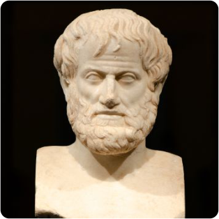

Busto de Aristóteles feito de mármore. 

Todo homem é mortal. Sócrates é homem. Logo, Sócrates é mortal. 

Ao longo da história, a lógica de Aristóteles evoluiu graças às inúmeras contribuições dos matemáticos que notaram que a lógica apresentada por ele não era suficiente para se trabalhar com o rigor matemático. Ela poderia ser imprecisa, pois fazia uso basicamente da linguagem natural. 

As contribuições dos matemáticos, portanto, foram muito importantes. 

- George Boole (1815-1864), matemático inglês, é considerado um dos responsáveis pelo surgimento da lógica matemática a partir da introdução de uma notação matemática mais precisa. 

- Augustus De Morgan (1806-1871), em conjunto com George Boole, ajudou a tornar a lógica matemática uma forte ferramenta para a programação de computadores. 

- Giuseppe Peano (1858-1932), por sua vez, elaborou uma notação matemática mais simples, que usamos até os dias atuais. 

- Outro nome importante é Bertrand Russell (1872-1920), um dos fundadores da "filosofia analítica", que, além de usar a lógica para esclarecer questões relacionadas aos fundamentos da matemática, também a utilizava para esclarecer questões filosóficas. 

- Podemos citar, também, as contribuições de Friedrich Ludwig G. Frege (1848-1925) e de Gottfried Wilhelm Von Leibniz (1646-1716). 

## Atividade 1 

###### Questão 1 

O filósofo Aristóteles marcou a história da lógica. Qual das seguintes afirmações melhor descreve sua contribuição para a lógica? 

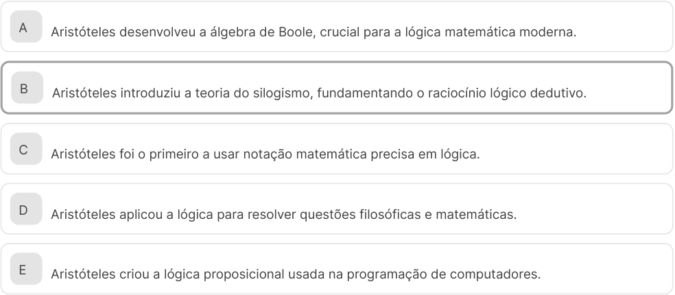

<!-- Start of picture text -->
A Aristóteles desenvolveu a álgebra de Boole, crucial para a lógica matemática moderna. B Aristóteles introduziu a teoria do silogismo, fundamentando o raciocínio lógico dedutivo. C Aristóteles foi o primeiro a usar notação matemática precisa em lógica. D Aristóteles aplicou a lógica para resolver questões filosóficas e matemáticas. E Aristóteles criou a lógica proposicional usada na programação de computadores. <!-- End of picture text -->

##### A alternativa B está correta. 

Aristóteles é conhecido como pai do pensamento lógico, e sua principal contribuição foi a introdução da teoria do silogismo, que estabelece regras de encadeamento de raciocínios lógicos. Essa teoria permitiu que, a partir de premissas verdadeiras, fosse possível chegar a conclusões igualmente verdadeiras, formando a base do raciocínio lógico dedutivo, algo ainda atualmente fundamental. Suas ideias foram compiladas na obra Organon, que continua sendo um marco no estudo da lógica. 

## Linguagem natural e linguagem simbólica 

O conhecimento teórico sobre as linguagens natural e simbólica é essencial, pois facilita a compreensão e a comunicação de conceitos complexos de maneira precisa. Esse conhecimento é particularmente útil em áreas como matemática e computação, que lidam com a clareza e a exatidão. Assista a este vídeo para entender como transformar a linguagem natural em simbólica a partir do uso de proposições. 

Neste vídeo, você vai aprender conceitos das linguagens natural e simbólica, definição e exemplos de proposições, classificação das proposições em simples e compostas, e a atribuição de valores lógicos. Você também vai entender como transformar enunciados naturais em simbólicos utilizando símbolos lógicos. 

##### Conteúdo interativo 

Acesse a versão digital para assistir ao vídeo. 

A linguagem, segundo o dicionário Aurélio, pode ser compreendida como um sistema de símbolos ou sinais que permite a transmissão da informação. Dessa forma, temos a linguagem escrita formada por um conjunto 

de símbolos, que são as letras do alfabeto, os sinais de pontuação, acentos etc. Ela é dotada de regras para juntar esses símbolos e formar palavras e frases, sentenças ou enunciados. 

É comum chamar a linguagem escrita de linguagem natural já que esta faz parte do nosso cotidiano. Aprenderemos, porém, a transformar essa linguagem natural ou corrente em uma linguagem simbólica. Isso ocorre quando conhecemos os símbolos lógicos. 

###### Proposições 

### Definição 

Proposições são sentenças ou enunciados declarativos que exprimem um pensamento de sentido completo. Logo, não consideramos como proposição as sentenças exclamativas (Feliz Natal!), interrogativas (Qual é o seu nome?) ou imperativas (Estude, agora!). 

##### Atenção 

- Carlos é estudioso. 

- O número 49 é um quadrado perfeito 

- Fomos ao teatro ontem. 

- 2 < 5. 

Note que, nesses exemplos, estamos declarando algo que pode ser considerado verdadeiro ou falso. 

###### Classificação das proposições 

As proposições podem ser classificadas em simples ou compostas. 

Proposiçöes simples (ou atômicas) 

As proposições simples são formadas apenas por sujeito e predicado. Em geral, usamos as letras minúsculas do alfabeto latino etc. para designá-las. Exemplos: João é inteligente. Fomos ao teatro ontem. O quadrado é um polígono regular. 

Proposiçōes compostas (ou moleculares) 

As proposições compostas são formadas por duas ou mais proposições simples. Em geral, são designadas por letras maiúsculas do alfabeto latino etc. Exemplos: Maria é bonita e Pedro é estudioso. Maria é professora ou médica. 

0 número 5 é ímpar e o número 25 é um quadrado perfeito. 

#### Valor lógico de uma proposição 

Uma proposição pode ser verdadeira ou falsa. Usamos ( ) quando a proposição é falsa ou ( ) quando ela é verdadeira. 

##### Exemplo 

Sejam e duas proposições. 

   - : 0 número 5 é ímpar. 

- 

- : 0 número 15 é um quadrado perfeito 

Com relação ao valor lógico dessas proposições, podemos usar a seguinte notação: 

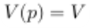

   - significa que o valor lógico da proposição é verdadeiro. 

- 

- significa que o valor lógico da proposição é falso. 

Princípios importantes da lógica matemática 

A lógica matemática é regida por três princípios: 

Princípio do 3° excluído 

Princípio da não contradição 

Uma proposição pode ser caracterizada em lógica como "verdadeira" ou "falsa". Ou seja, não é possível uma terceira caracterização lógica. 

Uma proposição não pode ser simultaneamente verdadeira e falsa. 

Princípio da identidade 

Esse princípio diz que uma proposição ou enunciado é igual a si mesmo. 

## Atividade 2 

Questão 1 

Nem todas as sentenças são consideradas proposições. Qual das seguintes opções a seguir melhor descreve uma proposição na lógica? 

A Uma sentença exclamativa com sentido completo. 

- B Uma sentença interrogativa com sentido completo. 

- C Uma sentença imperativa com sentido completo. 

- D Uma sentença declarativa com sentido completo. 

- E Uma sentença condicional com sentido completo. 

##### A alternativa D está correta. 

Uma proposição, na lógica, é uma sentença ou um enunciado declarativo que exprime um pensamento de sentido completo, e que pode ser considerado verdadeiro ou falso. Sentenças exclamativas, interrogativas e imperativas não são consideradas proposições, pois não declaram algo que pode ser avaliado como verdadeiro ou falso. Exemplos de proposições incluem enunciados como Marina é vaidosa ou O número 8 é a raiz quadrada de 64, que podem ser verificados e ter um valor lógico atribuído. 

## Conectivos ou juntores 

É preciso ter conhecimento teórico sobre conectivos lógicos para se aprofundar em lógica matemática e programação. Os conectivos permitem transformar a linguagem natural em simbólica, facilitando a construção e análise de proposições complexas. Assista a este vídeo para entender como utilizar conectivos lógicos para formar novas proposições e realizar operações lógicas fundamentais. 

Neste vídeo, você vai conhecer os conectivos lógicos ― conjunção, disjunção (inclusiva e exclusiva), condicional, bicondicional e negação. Você também vai ver exemplos da transformação de proposições da linguagem natural para a simbólica, bem como suas aplicações e sua importância na lógica matemática. 

##### Conteúdo interativo 

Acesse a versão digital para assistir ao vídeo. 

Podemos realizar operações sobre as proposições utilizando elementos conhecidos na lógica como conectivos ou juntores. 

- Os conectivos são símbolos lógicos com os quais efetuamos as operações lógicas obedecendo regras do cálculo proposicional. 

- Eles são importantes, pois novas proposições podem ser formadas a partir de outras proposições com sua utilização. 

- Com os conectivos, passamos uma proposição da linguagem natural para a linguagem simbólica. 

Na linguagem natural ou corrente, os conectivos são palavras. Veja alguns exemplos: 

Vamos considerar duas proposições simples e . 

Maria é alta Maria é elegante 

Usando os conectivos, podemos formar outras proposições a partir das proposições e . 

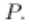

Maria é alta e elegante. Maria é alta ou elegante. Se Maria é alta, então é elegante. Maria é alta se, e somente se é elegante. 

Veja que, na linguagem natural, as palavras utilizadas são, por exemplo: e, ou, se, então, se e somente se. 

Representamos essas palavras através de símbolos lógicos com os quais efetuamos as chamadas operações lógicas. Agora, vamos conhecer os conectivos lógicos e as operações realizadas sobre as proposições. 

Conjunção 

Linguagem corrente: “e”, “mas”, “além disso”, “também”. 

Notação: ∧ 

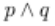

Essa notação é usada entre duas proposições: 

Como se ler: e 

Exemplo 

Sejam as proposições: 

Paulo é trabalhador. Paulo é estudioso. 

Usando o conectivo “e”, podemos formar outra proposição: 

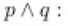

##### Paulo é trabalhador e Paulo é estudioso. 

Podemos dizer simplesmente: Paulo é trabalhador e estudioso. 

A conjunção pode ser representada por diagramas, na teoria dos conjuntos. Nesse caso, ela representa a interseção dos conjuntos e . 

#### Disjunção 

Linguagem corrente: "ou". 

Notação: 

Essa notação é usada entre duas proposições: . 

Como se lê: ou 

### Exemplo 

Sejam as proposições: 

Paulo ganhou um carro. Paulo ganhou um apartamento. 

Usando o conectivo “ou”, podemos formar outra proposição: 

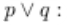

##### Paulo ganhou um carro ou Paulo ganhou um apartamento. 

Podemos dizer simplesmente: Paulo ganhou um carro ou ganhou um apartamento. 

Com relação à disjunção, ela pode ser: 

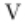

- Disjunção inclusiva, cujo símbolo é 

- 

- Disjunção exclusiva, cujo símbolo é . 

Veja, a seguir, exemplos desses tipos de disjunção: 

Disjunção inclusiva Disjunção exclusiva 

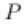

: Ana é professora ou médica. : Ou Ana é paulista, ou é gaúcha.Nesse caso, Ana não pode ser paulista e gaúcha ao mesmo tempo. Ou seja, se Ana é paulista, excluímos a possibilidade de Ana ser gaúcha e vice-versa. 

A disjunção , na teoria dos conjuntos, representa a união dos conjuntos e . 

Condicional 

Linguagem corrente: “Se... então” 

##### Notação: 

Essa notação é usada da seguinte forma: Se então . 

Exemplo 

Observe a proposição: 

Paulo é aprovado em cálculo. Paulo ganha um prêmio. 

Usando o conectivo “se... então”, podemos formar outra proposição: 

Se Paulo é aprovado em cálculo, então ganha um prềmio. 

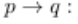

Podemos dizer simplesmente: Se Paulo é aprovado em cálculo, então ganha um prêmio. 

Veja a relação entre e na proposição condicional a seguir: 

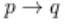

Sendo: 

- A proposição é chamada de antecedente. 

- 

- A proposição é chamada de consequente. 

- 

   - é condição suficiente para 

- 

   - é condição necessária para 

- 

A condicional pode ser representada através de diagramas. Nesse caso, ela representa a inclusão do conjunto no conjunto . 

#### Bicondicional 

Linguagem corrente: “... Se e somente se...”. 

Notação: 

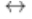

Essa notação é usada da seguinte forma: se e somente se . 

#### Exemplo 

Observe a seguinte proposição: 

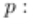

Carlos é trabalhador. Carlos é estudioso. 

Usando o conectivo “se e somente se”, podemos formar outra proposição: 

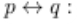

Carlos é trabalhador se, e somente se, Carlos é estudioso. 

Observe sobre a bicondicional: 

   - é condição necessária e suficiente para 

- 

   - é condição necessária e suficiente para . 

- 

A bicondicional pode ser representada através de diagramas. Nesse caso, ela representa a igualdade dos conjuntos e . 

#### Negação 

Linguagem corrente: "não", "é falso que", "não é o caso que", "não é verdade que". 

Notação: (til) ou (chamada de cantoneira). 

A notação mais utilizada: ~ 

Essa notação é usada na frente da letra que usamos para designar a proposição, para negá-la: 

Como se ler: não 

### Exemplo 

Observe as proposições: 

Maria é uma aluna inteligente. ~ Maria não é uma aluna inteligente. Marcos é engenheiro. ~ Não é verdade que Marcos é engenheiro. ~ É falso que Marcos é engenheiro. 

Quando negamos a negação da proposição , obtemos a própria proposição , isto é: ~~ ou é o mesmo que escrever ~(~ ). 

Temos mais dois conectivos não muito usuais: 

NAND ( ) 

Ele é a combinação de dois conectivos: “não” e “e”. 

### Exemplo 

Sejam as proposições e : 

Maria vai ao clube. Maria vai estudar lógica. Não é verdade que (Maria vai ao clube e vai estudar lógica). 

NOR ( ) 

NOR é a combinação de dois conectivos: "não" e "ou". 

### Exemplo 

Sejam as proposições e : 

Maria vai ao clube. Maria vai estudar lógica. Não é verdade que (Maria vai ao clube ou vai estudar lógica). 

## Atividade 3 

Questão 1 

Considere as seguintes proposições: 

1. Ana é professora e médica. 

2. Carlos é engenheiro ou Carlos é advogado. 

3. Se Maria é aluna, então Maria estuda. 

4. Pedro é músico se, e somente se, Pedro toca piano. 

5. Não é verdade que João é alto. 

Qual das seguintes opções associa corretamente os conectivos lógicos às proposições apresentadas? 

|A|1 - Disjunção; 2 - Conjunção; 3 - Bicondicional, 4 - Condicional, 5 - Negação.|
|---|---|
|B|1 - Conjunção; 2 - Disjunção; 3 - Condicional; 4 - Bicondicional; 5 - Negação.|
|C|1 - Conjunção; 2 - Disjunção; 3 - Negação; 4 - Condicional; 5 - Bicondicional.|
|D|1 - Bicondicional; 2 - Conjunção; 3 - Disjunção; 4 - Negação; 5 - Condicional.|
|E|1 - Negação; 2 - Conjunção; 3 - Bicondicional; 4 - Disjunção; 5 - Condicional.|
|A alt|ernativa B está correta.|
|A pro cone (se... repre por lingu|posição 1 usa o conectivo lógico de conjunção (e), representado por . A proposição 2 usa o ctivo lógico de disjunção (ou), representado por . A proposição 3 usa o conectivo lógico condicional então), representado por . A proposição 4 usa o conectivo lógico bicondicional (se e somente se), sentado por . Finalmente, a proposição 5 usa o conectivo lógico de negação (não), representado . É preciso compreender esses conectivos para transformar proposições da linguagem natural em agem simbólica e realizar operações lógicas corretamente.|

## Conversão de linguagem 

O domínio dos conectivos lógicos possibilita a transformação de proposições da linguagem natural para a simbólica, uma habilidade útil em matemática e computação. Essa compreensão permite a precisão na comunicação e a análise de ideias complexas. Assista a este vídeo e descubra, com exemplos práticos, como aplicar conectivos lógicos a fim de criar proposições compostas a partir de proposições simples. 

Neste vídeo, você vai ver exemplos de transformação de proposições da linguagem natural para a linguagem simbólica. Você vai ver, ainda, casos de conjunção, disjunção, condicional, bicondicional e negação, além da interpretação de proposições compostas utilizando símbolos lógicos. 

##### Conteúdo interativo 

Acesse a versão digital para assistir ao vídeo. 

Agora que conhecemos os conectivos e as operações sobre as proposições, podemos escrever uma proposição composta da linguagem natural para a linguagem simbólica. 

Vamos considerar a seguinte proposição composta: 

“O aluno aprende rápido e o professor possui muito conhecimento.” 

Escrever essa proposição composta na linguagem simbólica é muito simples. Veja o procedimento: 

O aluno aprende rápido ( ) e (conjunção ) o professor possui muito conhecimento ( ) 

Para isso, é preciso: 

Passo 1 

Identifique na proposição a palavra que representa o conectivo: e. 

Passo 2 

Identifique antes e depois do "e" as proposições simples e atribua uma letra para cada proposição. 

- aluno aprende rápido. 

- O professor possui muito conhecimento. 

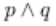

Portanto, a linguagem simbólica é 

Veja exemplos de algumas situações. 

#### Exemplo 1 

O aluno não aprende rápido ou o professor possui muito conhecimento. 

~ O aluno não aprende rápido. O professor possui muito conhecimento. 

Solução: 

A linguagem simbólica é ~ 

#### Exemplo 2 

(MPU - ESAF - Adaptado) Considere as seguintes proposições: 

Não vejo Paulo. Não vou ao cinema. Fico triste. 

Passe para a linguagem simbólica a seguinte proposição: 

Quando não vejo Paulo, não vou ao cinema ou fico triste. 

Solução: 

- Quando não vejo paulo, não vou ao cinema ou fico triste. 

- 

- Atenção: Nessa proposição, temos uma condicional. 

- 

- Se não vejo Paulo, então não vou ao cinema ou fico triste. 

- 

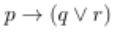

- Linguagem simbólica: 

Exemplo 3 

Dadas as proposições simples: 

Carla comprou um carro. Carla comprou um apartamento. 

Passe para a linguagem simbólica as seguintes proposições: 

1. Carla comprou um carro, mas não comprou um apartamento. 

- 

2. Não é verdade que Carla comprou um carro ou comprou um apartamento. 

- 

3. Carla nem comprou um carro e nem comprou um apartamento. 

- 

4. É falso que Carla não comprou o carro ou não comprou o apartamento. 

- 

Solução: 

1. Carla comprou um carro, mas não comprou um apartamento. 

   - p: Carla comprou um carro. 

   - 

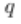

   - : Carla comprou um apartamento. 

- 

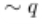

   - : Não comprou um apartamento. 

- 

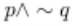

   - Linguagem simbólica: 

2. Não é verdade que Carla comprou um carro ou comprou um apartamento. 

   - : Carla comprou um carro. 

   - : Carla comprou um apartamento. 

   - "Não é verdade que" é uma negação (~). 

• Linguagem simbólica: 

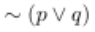

3. Carla nem comprou um carro e nem comprou um apartamento. 

   - p: Carla comprou um carro. 

   - 

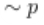

   - : Carla não comprou um carro. 

- 

   - : Carla comprou um apartamento. 

- 

   - : Nem comprou um apartamento. 

- 

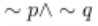

   - Linguagem simbólica: 

   - 

4. É falso que Carla não comprou o carro ou não comprou o apartamento 

   - : Carla comprou um carro. 

- 

   - : Carla não comprou um carro. 

- 

   - : Carla comprou um apartamento. 

- 

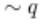

   - : não comprou um apartamento. 

- 

- "É falso que" é uma negação (~). 

- 

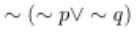

- Linguagem simbólica: 

#### Exemplo 4 

Dadas as proposições “O estudante aprende rápido” e “O professor possui muito conhecimento”, passe para a linguagem corrente as proposições: 

1. ~ 

2. ~ 

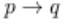

3. ~ 

4. ~~ 

5. ~ ↔ ~ 

Solução: 

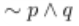

1. 

   - estudante aprende rápido. 

- 

   - : 0 estudante não aprende rápido. 

- 

- : 0 professor possui muito conhecimento. 

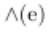

- Conectivo: 

- estudante não aprende rápido e o professor possui muito conhecimento. 

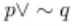

2. 

   - estudante aprende rápido. 

- 

- professor possui muito conhecimento. 

- : O professor não possui muito conhecimento. 

- Conectivo: (ou). 

- 

- : 0 estudante aprende rápido ou o professor não possui muito conhecimento. 

4. 

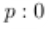

   - estudante aprende rápido. 

- 

   - : 0 estudante não aprende rápido. 

- 

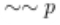

   - : Não é verdade que o estudante não aprende rápido. 

- 

- Quando negamos a negação da proposição , obtemos a própria proposição , isto é: é o próprio . 

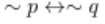

5. 

   - estudante aprende rápido. 

- 

   - : 0 estudante não aprende rápido. 

- 

- professor possui muito conhecimento. 

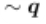

   - : O professor não possui muito conhecimento. 

- 

- Conectivo: (se e somente se). 

- 

- estudante não aprende rápido se, e somente se, o professor não possui muito 

- conhecimento. 

## Atividade 4 

###### Questão 1 

Considere a proposição “Nem Carlos é engenheiro nem Paulo é professor”. Marque a alternativa que corresponde à representação simbólica correta dessa proposição. 

A B C D E 

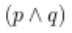

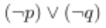

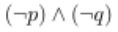

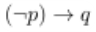

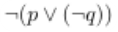

A alternativa C está correta. 

Solução: 

"Nem Carlos é engenheiro nem Paulo é professor." 

Vamos considerar: 

¬ : Nem Carlos é engenheiro. 

¬ : Nem Paulo é professor. 

Analisando as alternativas: 

A) ¬( ∧ ) - INCORRETA, pois dizer que "não é verdade que Carlos é engenheiro e Paulo é médico" é o mesmo que dizer que "Carlos não é engenheiro ou Paulo não é médico". A operação correta é a conjunção e não a disjunção. 

B) (¬ ) ∨ (¬ ) - INCORRETA, pois a operação que aparece na simbologia é a disjunção inclusiva, e o correto é a conjunção. 

C) (¬ ) ∧ (¬ ) - CORRETA, pois, na proposição dada, temos uma operação de conjunção e a operação de negação. "Nem Carlos é engenheiro e nem Paulo é professor". Logo, essa proposição na linguagem simbólica fica: (¬ ) ∧ (¬ ). 

D) (¬ ) → - INCORRETA, pois, na proposição dada, não temos a presença da condicional "se... então". 

E) ¬( ∨ (¬ )) - INCORRETA, pois, na proposição dada, temos a conjunção como operação principal e as duas proposições simples apresentam a operação de negação. Veja que nessa alternativa a operação é a disjunção. 

2. Tabela-verdade de proposições 

## Construção da tabela-verdade 

O domínio da lógica proposicional depende do entendimento da construção da tabela-verdade. Esse conhecimento é aplicado em diversas áreas, como a matemática e a computação, permitindo a análise precisa de proposições e suas combinações. Assista a este vídeo para aprender como criar tabelas-verdade de maneira clara e prática, utilizando exemplos com diferentes números de proposições. 

Neste vídeo, você vai ver como construir tabelas-verdade de proposições simples e compostas utilizando exemplos práticos com uma, duas e três proposições. Você vai aprender como preencher todas as combinações possíveis de valores lógicos (V e F) para analisar a veracidade das proposições. 

##### Conteúdo interativo 

Acesse a versão digital para assistir ao vídeo. 

Como vimos, toda proposição composta tem um valor lógico verdadeiro ou falso. Esse valor lógico pode ser determinado facilmente através da chamada tabela-verdade. Nela, representamos todos os possíveis valores lógicos das proposições simples que formam as proposições compostas e suas combinações. 

A tabela-verdade possui colunas e linhas, como toda tabela. 

- Nas primeiras colunas, colocamos as proposições simples. 

- 

- O número de linhas depende da quantidade de proposições simples. 

- 

O cálculo para determinarmos o número de linhas é simples: 

Número de linhas = 2n linhas, onde n é o número de proposições simples. 

##### Exemplo 

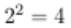

- Se a proposição composta possui duas proposições simples e , a tabela-verdade terá linhas. Em cada linha, colocamos todas as combinações possíveis de e . 

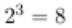

- Se a proposição composta possui três proposições simples e , a tabela-verdade terá linhas. Em cada linha, colocamos todas as combinações possíveis de e . 

Agora, entenderemos melhor a construção da tabela-verdade de uma proposição composta considerando 1, 2 e 3 proposições simples. 

#### Proposição simples 

Seja uma proposição simples. Para construir a tabela-verdade dessa proposição, temos apenas duas possibilidades: a proposição pode ser verdadeira ou falsa. 

Proposição composta com duas proposições simples 

Sejam duas proposições simples e . A tabela-verdade possui linhas. Agora, vamos considerar todas as possibilidades de combinar e . 

Note que podemos ter: 

- As duas proposições e verdadeiras. 

- 

- A primeira proposição verdadeira e a segunda proposição falsa. 

- 

- A primeira proposição falsa e a segunda proposição verdadeira. 

- 

- As duas proposições e falsas. 

- 

Observe: 

Podemos construir a tabela-verdade colocando e em qualquer ordem, desde que as linhas referentes às proposições simples tenham todas as combinações possíveis. Uma maneira mais prática é colocar na coluna da primeira proposição simples dois ( ) seguidos de dois ( ) . Em seguida, na coluna da próxima proposição simples, alterna-se e , começando com . 

#### Proposições compostas com três proposições simples 

Sejam três proposições simples , e . A tabela-verdade possui 8 linhas. Agora, vamos considerar todas as possibilidades de combinar e . 

Note que podemos ter: 

- Todas as 3 proposições simples verdadeiras. 

- 

- Duas proposições simples verdadeiras e uma proposição simples falsa. 

- 

- Uma proposição simples verdadeira e duas proposições simples falsas. 

- 

- Todas as proposições simples falsas. 

- 

Observe: 

Uma maneira prática de construir a tabela-verdade com 8 linhas é colocar na coluna da primeira proposição simples quatro ( ) seguidos de quatro ( ). 

Na coluna da segunda proposição simples, alterna-se dois ( ) e dois ( ) , começando com dois ( ). 

Por último, na coluna da terceira proposição simples, alterna-se e , começando por . Assim, todas as combinações são verificadas. 

## Atividade 1 

###### Questão 1 

Considere a construção de uma tabela-verdade para uma proposição composta por três proposições simples e . Qual é o número correto de linhas que essa tabela deve possuir e como deve ser organizada a distribuição de (verdadeiro) e (falso) nas colunas das proposições simples? 

A A tabela-verdade deve ter 4 linhas, com alternância de e em cada coluna. 

B A tabela-verdade deve ter 8 linhas, com e alternando em cada linha. 

C A tabela-verdade deve ter 6 linhas, com cada proposição simples recebendo um número igual de e . 

DA tabela-verdade deve ter 8 linhas, com a coluna de tendo quatro seguidos de quatro , a coluna de alternando dois e dois , e a coluna de alternando e . 

E A tabela-verdade deve ter 8 linhas, com e distribuídos aleatoriamente. 

##### A alternativa D está correta. 

Para uma proposição composta por três proposições simples ( e ), a tabela-verdade deve possuir linhas, pois cada proposição pode ser verdadeira ( ) ou falsa ( ), gerando todas as combinações possíveis. A organização prática das colunas é: na primeira coluna ( ), quatro seguidos de quatro ; na segunda coluna ( ), dois seguidos de dois , repetidos; na terceira coluna ( ), 

alternando e em cada linha. Essa organização garante que todas as combinações possíveis de e sejam consideradas. 

## Tabelas-verdade dos conectivos lógicos 

O conhecimento teórico sobre as tabelas-verdade dos conectivos lógicos permite compreender a lógica proposicional e sua aplicação prática. Tal entendimento viabiliza uma comunicação clara e precisa para a construção e análise de proposições complexas. Assista a este vídeo para aprender a determinar o valor lógico de conectivos como negação, conjunção, disjunção, condicional, bicondicional, NAND e NOR, e como construir suas tabelas-verdade. 

Neste vídeo, você vai conhecer os valores lógicos dos principais conectivos lógicos ― negação, conjunção, disjunção (inclusiva e exclusiva), condicional, bicondicional, NAND e NOR. Além disso, você vai entender como construir tabelas-verdade para cada conectivo a partir de aplicações com exemplos práticos. 

##### Conteúdo interativo 

Acesse a versão digital para assistir ao vídeo. 

Agora vamos verificar o valor lógico dos seguintes conectivos: negação, conjunção, disjunção inclusiva, disjunção exclusiva, condicional, bicondicional, NAND e NOR, e suas tabelas-verdade. 

#### Negação (Não) 

A negação da proposição é a proposição representada por ~ . Ou seja: 

O valor lógico da proposição ~ é oposto ao da proposição . 

Quando o valor lógico da proposição for verdadeiro, o valor lógico da proposição ~ será falso, e viceversa. 

##### Exemplo 

Os juros bancários são altos. 

- ~ Os juros bancários não são altos. 

Tabela-verdade da negação 

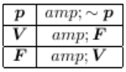

#### Conjunção (E) 

O valor lógico da conjunção ficará mais fácil de ser compreendido através da seguinte declaração: 

“Carlos levará Paula ao cinema e comprará um presente para ela.” 

Note que Carlos prometeu a Paula que a levará ao cinema e comprará um presente para ela. Ou seja, os dois eventos devem ocorrer simultaneamente. Dessa forma, o valor lógico da conjunção só será verdadeiro quando as duas proposições forem verdadeiras. Nos demais casos, a conjunção é falsa. 

Temos uma proposição composta, em que: 

   - Carlos levará Paula ao cinema. 

- 

   - Comprará um presente para ela. 

- 

   - Carlos levará Paula ao cinema comprará um presente para ela. 

- 

Agora, vamos analisar declaração através da tabela-verdade: 

|Carlos levou Paula ao cinema.|Comprou um presente para ela.|
|---|---|
|Carlos levou Paula ao cinema.|Não comprou um presente para ela.|
|Carlos não levou Paula ao cinema.|Comprou um presente para ela.|
|Carlos não levou Paula ao cinema.|Não comprou um presente para ela.|

Tabela: Tabela-verdade proposição composta.Ana Lúcia de Sousa. 

#### Tabela-verdade da conjunção 

Observe a tabela a seguir. 

Tabela: Tabela-verdade da conjunção.Ana Lúcia de Sousa. 

#### Disjunção inclusiva (OU inclusivo) 

Considere a seguinte declaração: 

“Carlos levará Paula ao cinema ou comprará um presente para ela.” 

Nessa declaração, Carlos prometeu a Paula que a levará ao cinema ou comprará um presente para ela. Assim, basta ele realizar os dois eventos ou apenas um dos eventos para a declaração ser verdadeira. 

Temos uma proposição composta, em que: 

   - Carlos levará Paula ao cinema. 

- 

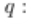

   - Comprará um presente para ela. 

- 

   - Carlos levará Paula ao cinema ou comprará um presente para ela. 

- 

Agora, vamos analisar declaração através da tabela-verdade: 

|Carlos levou Paula ao cinema.|Comprou um presente para ela.|
|---|---|
|Carlos levou Paula ao cinema.|Não comprou um presente para ela.|
|Carlos não levou Paula ao cinema.|Comprou um presente para ela.|
|Carlos não levou Paula ao cinema.|Não comprou um presente para ela.|

Tabela: Tabela-verdade de disjunção inclusiva. 

Ana Lúcia de Sousa. 

#### Tabela-verdade da disjunção (inclusiva) 

Observe a tabela. 

Tabela: Tabela-verdade de disjunção (inclusiva).Ana Lúcia de Sousa. 

Dessa forma, a disjunção inclusiva será falsa somente quando as duas proposições forem falsas. Nos demais casos, a disjunção é verdadeira. 

#### Disjunção exclusiva (OU exclusivo) 

Considere a seguinte declaração: 

“Paulo é carioca ou paulista.” 

Nessa declaração, Paulo não pode ser simultaneamente carioca e paulista. Temos uma proposição composta, em que: 

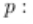

   - Paulo é carioca. 

- 

   - Paulo é paulista. 

- 

   - : Paulo é carioca ou paulista. 

- 

Agora, vamos analisar declaração através da tabela-verdade. 

|Paulo é carioca.|Paulo é paulista.|
|---|---|
|Paulo é carioca.|Paulo não é paulista.|

|Paulo não é carioca.|Paulo é paulista.|
|---|---|
|Paulo não é carioca.|Paulo não é paulista.|

Tabela: Tabela-verdade de disjunção exclusiva (OU exclusivo). 

Ana Lúcia de Sousa. 

#### Tabela-verdade da disjunção (exclusiva) 

Observe a tabela a seguir. 

Tabela: Tabela-verdade de disjunção (exclusiva).Ana Lúcia de Sousa. 

Veja que a disjunção exclusiva será falsa somente quando as duas proposições forem falsas ou quando as duas proposições forem verdadeiras. Nos demais casos, a disjunção é verdadeira. 

#### Condicional (Se... então) 

Considere a seguinte declaração: 

“Se Paula passar em cálculo, então Carlos comprará um presente para ela.” 

Temos uma proposição composta, em que: 

   - Paula passar em cálculo. 

- 

   - Carlos comprará um presente para ela. 

- 

   - → Se Paula passar em cálculo, então Carlos comprará um presente pra ela. 

- 

Não se esqueça que, na condicional: 

Se ocorre um determinado evento, um fato acontecerá. 

Na declaração dada, temos 

- Evento: Paula passar em cálculo. 

- 

- Fato: Carlos comprará um presente para a Paula. 

- 

Agora, vamos analisar declaração através da tabela-verdade. 

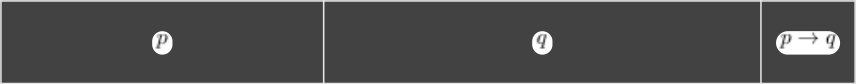

|Paula passou em cálculo.|Carlos comprou um presente para ela.|
|---|---|
|Paula passou em cálculo.|Carlos não comprou um presente para ela.|
|Paula não passou em cálculo.|Carlos comprou um presente para ela.|
|Paula não passou em cálculo.|Carlos não comprou um presente para ela.|

Tabela: Tabela-verdade de condicional (Se... então).Ana Lúcia de Sousa. 

#### Tabela-verdade da condicional 

Observe a tabela a seguir. 

Tabela: Tabela-verdade de condicional.Ana Lúcia de Sousa. 

Conclusão: a condicional será falsa somente quando o antecedente é verdadeiro e o consequente é falso. Nos demais casos, a condicional é verdadeira. 

#### Bicondicional (Se e somente se) 

Considere a seguinte declaração: 

“Carlos comprará um presente para Paula se e somente se Paula passar em cálculo.” 

Temos uma proposição composta, em que: 

   - Carlos comprará um presente para Paula. 

- 

   - Paula passar em cálculo. 

- 

- ↔ Carlos comprará um presente para Paula se e somente se Paula passar em cálculo. 

Na bicondicional ↔ , temos duas condicionais que ocorrem simultaneamente, na ida e na volta: → e → . 

   - → Se Carlos comprar um presente para Paula, então Paula passará em cálculo. 

- 

   - → : Se Paula passar em cálculo, então Carlos comprará um presente para ela. 

- 

Dessa forma, a bicondicional também pode ser escrita da seguinte forma: 

Agora, vamos analisar declaração através da tabela-verdade. 

|Carlos comprou um presente para Paula.|Paula passou em cálculo.|
|---|---|
|Carlos comprou um presente para Paula.|Paula passou em cálculo.|
|Carlos não comprou um presente para Paula.|Paula passou em cálculo.|
|Carlos não comprou um presente para Paula.|Paula não passou em cálculo.|

Tabela: Tabela-verdade.Ana Lúcia de Sousa. 

#### Tabela-verdade da bicondicional 

Observe a tabela a seguir. 

Tabela: Tabela-verdade.Ana Lúcia de Sousa. 

Veja que a bicondicional será verdadeira somente quando as proposições p e q forem ambas verdadeiras ou falsas. Nos demais casos, a bicondicional é falsa. 

#### NAND (↑) 

Como vimos, o conectivo NAND surge a partir da combinação do conectivo “não” com o conectivo “e”. 

Vamos considerar duas proposições simples: 

   - Carlos vai ao cinema. 

- 

   - Carlos vai assistir à televisão. 

- 

   - ↑ Não é verdade que Carlos vai ao cinema e vai assistir à televisão. 

- 

Veja que podemos escrever: 

Não é verdade que (Carlos vai ao cinema e vai assistir à televisão). 

Linguagem simbólica: ~( ∧ ) 

#### Tabela-verdade do conectivo NAND 

Observe a tabela a seguir. 

Tabela: Tabela-verdade do conectivo NAND.Ana Lúcia de Sousa. 

#### NOR (↓) 

Como vimos, o conectivo NOR surge a partir da combinação do conectivo “não” com o conectivo “ou”. 

Vamos considerar duas proposições simples: 

   - Carlos vai ao cinema. 

- 

   - Carlos vai assistir à televisão. 

- 

   - ↓ Não é verdade que Carlos vai ao cinema ou vai assistir à televisão. 

- 

Veja que podemos escrever: Não é verdade que (Carlos vai ao cinema ou vai assistir à televisão) 

Linguagem simbólica: ∼( ) 

#### Tabela-verdade do conectivo NOR 

Observe a tabela a seguir. 

Tabela: Tabela-verdade do conectivo NOR.Ana Lúcia de Sousa. 

## Atividade 2 

###### Questão 1 

(CBMERJ/2014 - Adaptada) Considerando as proposições p: Roberto é rico e q: Roberto é feliz verdadeiras, analise as afirmações e marque a alternativa correspondente: 

1. Roberto é pobre, mas feliz. 

2. Roberto é pobre ou infeliz. 

3. Roberto é rico e infeliz. 

4. Roberto é pobre ou rico, mas é feliz. 

A I (V), II (F), III (V), IV (F) B I (F), II (V), III (F), IV (F) C I (F), II (F), III (V), IV (F) 

- D I (V), II (V), III (F), IV (V) 

- E I (F), II (F), III (F), IV (V) 

##### A alternativa E está correta. 

Note que temos somente a conjunção e a disjunção para analisar. 

   - A conjunção é verdadeira apenas se as duas proposições envolvidas são verdadeiras. Nos demais casos, ela é falsa. 

   - A disjunção é falsa apenas se as duas proposições envolvidas são falsas. Nos demais casos, ela é verdadeira. 

- 0 enunciado apresentou duas proposições que são sempre verdadeiras. 

- p. Roberto é rico (V). : Roberto é feliz (V). 

De acordo com essas proposições, vamos analisar o valor lógico das afirmações I, II, III e IV.1. Roberto é pobre, mas feliz (Falso) e (Verdadeiro) Falso.2. Roberto é pobre ou infeliz (Falso) ou (Falso) Falso.3. Roberto é rico e infeliz (Verdadeiro) e (Falso) Falso.4. Roberto é pobre ou rico, mas é feliz (Falso ou Verdadeiro) e (Verdadeiro). 

Resolvemos sempre o que está dentro do parêntese. Veja que, falso ou verdadeiro, o valor lógico é verdadeiro. Agora, temos:(Verdadeiro) e (Verdadeiro) = Verdadeiro.Logo, a sequência correta é: I (F), II (F), III (F), IV (F). 

## Ordem de precedência dos conectivos 

Você já deve ter observado que devemos obedecer à ordem de precedência dos conectivos, assim como fazemos na matemática ao resolver uma expressão. A ordem de precedência é: primeiro a negação ( ); seguida pela conjunção ou disjunção ( ) e (V), na ordem em que aparecem; depois a condicional ; e, 

por último, a bicondicional . Assista ao vídeo para ver esses conceitos em ação e entender melhor como aplicálos na prática. 

Neste vídeo, você vai acompanhar os passos detalhados para construir tabelas-verdade de proposições compostas. Utilizando o exemplo, você vai ver como preencher todas as combinações possíveis de valores lógicos e analisar a aplicação da ordem de precedência dos conectivos lógicos. 

##### Conteúdo interativo 

Acesse a versão digital para assistir ao vídeo. 

Agora que conhecemos a tabela-verdade de cada conectivo, podemos construir a tabela-verdade de qualquer proposição composta. Devemos ficar atentos, porém, à ordem das proposições nas colunas da tabela. 

##### Atenção 

É importante obedecer a ordem de procedência dos conectivos da mesma forma que fazemos na matemática quando resolvemos uma expressão. 

Se, na proposição composta, temos a presença de parênteses, então, devemos começar por eles e, depois, verificar o que está fora deles. 

#### Ordem de precedência para os conectivos 

Essa ordem deve ser a seguinte: 

1. Negação (~). 

2. Conjunção ou disjunção ( ) e ( ), na ordem em que aparecem. 

3. Condicional (→). 

4. Bicondicional (↔). 

#### Exemplo 

Construa a tabela-verdade da seguinte proposição: ( ~ ) → (~ ). 

Acompanhe a solução a seguir. 

### Passo 1 

Verificar a quantidade de proposições simples existentes. 

Neste exemplo, temos duas proposições: e 

Vamos, então, construir uma tabela-verdade com 4 linhas. Inicialmente, colocaremos nas duas primeiras colunas as proposições e . Em seguida, colocaremos nas linhas, conforme estudamos anteriormente, todas as combinações possíveis de e . 

Tabela: Tabela-verdade do passo 1.Ana Lúcia de Sousa. 

### Passo 2 

Na proposição dada, temos dois parênteses. Comece pelo primeiro parêntese da esquerda para a direita. 

( ~ ) → (~ ) 

Abriremos uma coluna para colocarmos a negação ~ . Veja que ~ é a negação de . Complete a coluna ~ com e . 

|~|
|---|

Tabela: Tabela-verdade do passo 2.Ana Lúcia de Sousa. 

### Passo 3 

Abriremos uma coluna para colocarmos a proposição ~ . Em seguida, completaremos a coluna com de acordo com a análise da coluna com a coluna e o conectivo "ou" ( ). 

|~|~|
|---|---|

Tabela: Tabela-verdade do passo 3.Ana Lúcia de Sousa. 

Lembre-se de que, de acordo com a tabela-verdade da disjunção (V), ela é falsa quando as duas proposições são falsas. Nos demais casos, a disjunção é verdadeira. 

### Passo 4 

Verificar o outro parêntese. 

( ~ ) → (~ ) 

Abriremos uma coluna para colocarmos a negação ~ . Veja que ~ é a negação de . Complete a coluna ~ com e . 

|~ ~ ~|
|---|

Tabela: Tabela-verdade do passo 4.Ana Lúcia de Sousa. 

### Passo 5 

Abriremos uma coluna para colocarmos a proposição ~ . Em seguida, completaremos a coluna com e de acordo com a análise da coluna ~ com a coluna q e o conectivo "e" ( ). 

|~ ~ ~ ~|
|---|

Tabela: Tabela-verdade do passo 5.Ana Lúcia de Sousa. 

Lembre-se de que, de acordo com a tabela-verdade da conjunção ( ), ela é verdadeira quando as duas proposições são verdadeiras. Nos demais casos, a conjunção é falsa. 

### Passo 6 

Agora que já analisamos os dois parênteses, vamos verificar a condicional que une os parênteses. 

Abra uma coluna e coloque a proposição ( ~ ) → (~ ). Em seguida, complete a coluna com e de acordo com a análise da coluna ( ~ ) com a coluna (~ ) e o conectivo "se... então" . 

|~ ~ ~ ~ ( ~ )→(~ )|
|---|

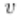

|~ ~ ~ ~ ( ~ )→(~ )|
|---|

Tabela: Tabela-verdade do passo 6.Ana Lúcia de Sousa. 

Lembre-se de que, de acordo com a tabela-verdade da condicional (→), ela é falsa quando o antecedente é verdadeiro e o consequente é falso. Nos demais casos, a condicional é verdadeira. 

Agora, você pode construir a tabela-verdade de qualquer proposição composta. 

## Atividade 3 

Questão 1 

(TRT/SP - 2008) Dadas as proposições simples e , tais que é verdadeira e é falsa, considere as seguintes proposições compostas:(1) (2) (3) (4) 

Quantas dessas proposições compostas são verdadeiras? 

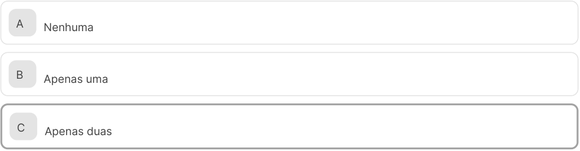

<!-- Start of picture text -->
A Nenhuma B Apenas uma C Apenas duas <!-- End of picture text -->

<!-- Start of picture text -->
D Apenas três <!-- End of picture text -->

E Quatro 

A alternativa C está correta. 

Vamos analisar o valor lógico de cada proposição considerando que e . 

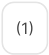

<!-- Start of picture text -->
(1) <!-- End of picture text -->

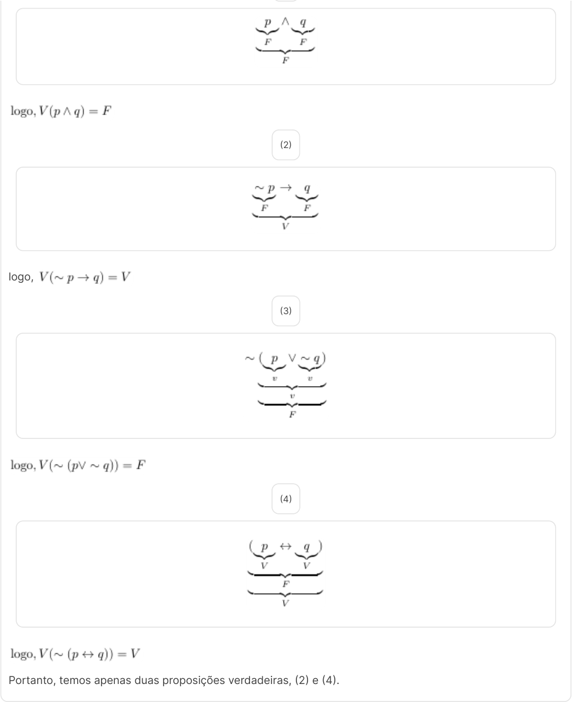

<!-- Start of picture text -->
(2) logo, (3) (4) Portanto, temos apenas duas proposições verdadeiras, (2) e (4). <!-- End of picture text -->

## Análise do valor lógico de uma proposição composta sem a construção da tabela-verdade 

Você já deve ter percebido queo conhecimento teórico sobre conectivos lógicos e tabelas-verdade é necessário para entender e resolver problemas lógicos complexos. Dessa forma, aprimorando seus conhecimentos, você pode avaliar a validade de um argumento sem a necessidade de construir a tabelaverdade. Assista a este vídeo para aprender, a partir de um exemplo prático, a verificar o valor lógico de proposições. 

##### Conteúdo interativo 

Acesse a versão digital para assistir ao vídeo. 

Considere a proposição e a informação . 

A partir dessa informação, é possível verificar se a proposição dada é verdadeira ou falsa. 

Solução: 

Devemos determinar se o valor lógico do enunciado é falso ou verdadeiro. De acordo com a informação dada , podemos determinar o valor lógico de e . 

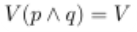

, onde o conectivo é a conjunção. 

De acordo com a tabela-verdade da conjunção, ela só é verdadeira quando as duas proposições são verdadeiras. Logo, podemos concluir que e . 

Temos: 

Nesse enunciado, temos dois parênteses. Não esqueça que começamos sempre com os parênteses. 

O valor lógico de no primeiro parêntese. 

No segundo parêntese, temos uma condicional 

De acordo com a tabela-verdade da condicional, quando o antecedente é verdadeiro e o consequente é falso, o valor lógico da proposição é falso. Nos demais casos, a condicional é verdadeira. Logo, 

Temos, então: 

Por último, vamos analisar outra condicional que une . 

Considerando o mesmo raciocínio, podemos concluir que o valor lógico da proposição é verdadeiro. 

Conclusão: o valor lógico do enunciado é verdadeiro. 

Após o estudo desse primeiro exemplo, que tal ampliar seus conhecimentos com mais exemplos práticos a fim de determinar o valor lógico de proposições? Assista a este vídeo para aprender a verificar o valor lógico de proposições utilizando tabelas-verdade. 

#### Aplicação da tabela-verdade 

Neste vídeo, você vai ver alguns exemplos práticos para determinar o valor lógico de proposições utilizando conectivos lógicos como conjunção, condicional, bicondicional e disjunção. Você vai aprender em detalhes como construir e analisar tabelas-verdade para resolver problemas lógicos. 

Conteúdo interativo 

Acesse a versão digital para assistir ao vídeo. 

#### Exemplo 

Determine o valor lógico das seguintes proposições: 

a. e b. Se então c. se e somente se d. ou 

Solução: Nesse exemplo, vamos trabalhar com a tabela-verdade dos conectivos lógicos. a) 2 + 6 = 5 e 4 + 4 = 8 

Conectivo: Conjunção. 

A conjunção é verdadeira sempre que as duas proposições envolvidas são verdadeiras. Nos demais casos, ela é falsa. 

Logo, o valor lógico da proposição é falso. 

b) Se 1 + 3 = 5 então 6 + 6 = 12 

Conectivo: Condicional. 

A condicional é falsa sempre que o antecedente for verdadeiro e o consequente for falso. Nos demais casos, ela é verdadeira. 

Logo, o valor lógico da proposição é verdadeiro. 

c) 2 + 4 = 7 se e somente se 4² = 16 

Conectivo: Bicondicional. 

A bicondicional é verdadeira sempre que as duas proposições envolvidas são ambas verdadeiras ou ambas falsas. Nos demais casos, ela é falsa. 

Logo, o valor lógico da proposição é falso. 

d) 2 + 6 = 8 ou 4 + 4 = 7 

Conectivo: Disjunção. 

A disjunção é falsa apenas se as duas proposições envolvidas são falsas. Nos demais casos, ela é verdadeira. 

Logo, o valor lógico da proposição é verdadeiro. 

#### Observação sobre a ordem de precedência dos conectivos: 

Quando nos deparamos com uma proposição composta sem parênteses, fica muito complicado saber que termos da expressão devemos considerar primeiro. 

Para colocarmos os parênteses, devemos seguir a ordem de precedência dada neste módulo, seguindo o critério do conectivo mais forte para o mais fraco. Veja como é simples: 

Seja a proposição composta: 

Veja que o conectivo mais forte nessa proposição é a bicondicional. Com os parênteses ela fica do seguinte modo: 

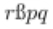

Agora, considere a proposição 

Nessa proposição, o conectivo mais forte é a condicional. Colocando o parêntese, temos: 

## Atividade 4 

###### Questão 1 

Os conectivos bidirecionais são extremamente relevantes para a tomada de decisão, pois ajudam a avaliar situações em que duas proposições devem ter o mesmo valor lógico para uma condição ser verdadeira. Aplicando esse conectivo, qual é o valor lógico da proposição ? 

A Verdadeiro 

B Falso 

C Indeterminado 

D Verdadeiro apenas se 2 + 4 = 7 for verdadeiro 

E Falso apenas se for falso 

A alternativa B está correta. 

A proposição usa o conectivo bicondicional. A bicondicional é verdadeira apenas quando ambas as proposições têm o mesmo valor lógico (ambas verdadeiras ou ambas falsas). No caso em questão, é falso e é verdadeiro. Como as proposições têm valores lógicos diferentes, a bicondicional é falsa. Portanto, o valor lógico da proposição é falso. 

3. Valor lógico das proposições e a estrutura lógica da álgebra booleana 

## Valor lógico das proposições 

Determinar o valor lógico da proposição composta através da tabela-verdade nos levará ao conhecimento de conceitos novos. Ou seja, pelo resultado da última coluna da tabela identificaremos se a proposição composta é uma tautologia, uma contradição, ou uma contingência. Assista a este vídeo para aprender, de maneira clara e prática, esses conceitos. 

Neste vídeo, você vai aprender a determinar o valor lógico da proposição composta através da tabela-verdade e conhecer conceitos novos. Você vai, ainda, aprender a identificar, por meio do resultado da última coluna da tabela, se a proposição composta é uma tautologia, uma contradição ou uma contingência. 

##### Conteúdo interativo 

Acesse a versão digital para assistir ao vídeo. 

Nas proposições compostas, não é simples verificar o seu valor lógico apenas olhando para elas. No entanto, através da construção da tabela-verdade isso é mais intuitivo, apesar do trabalho, que pode ser maior ou menor, dependendo do tamanho da proposição. 

Determinar o valor lógico da proposição composta através da tabela-verdade nos fará conhecer conceitos novos. Ou seja, vamos identificar através do resultado da última coluna da tabela se a proposição composta é uma tautologia, uma contradição ou uma contingência. 

#### Tautologia 

Para compreender esse conceito, vamos considerar a seguinte proposição: 

Vamos construir sua tabela-verdade. Veja que não é simples analisar o valor lógico dessa proposição (5ª coluna da tabela): 

|~ ~ ~ ~ ~ ~  ↔~ ~|
|---|

Tabela: Tabela verdade de tautologia.Ana Lúcia de Sousa. 

Note que a última coluna da tabela-verdade tem, em todas as linhas, o valor lógico (verdadeiro). Ou seja, não há nenhum valor lógico (falso). Quando isso ocorre, estamos diante de uma tautologia. 

Dizemos que uma proposição (simples ou composta) é uma tautologia se seu valor lógico é , independentemente dos valores lógicos das proposições que a compõem. 

Contradição 

Para compreender esse conceito, vamos considerar a seguinte proposição: 

Vamos construir sua tabela-verdade e analisar o resultado da última coluna da tabela. 

|1ª|2ª|3ª|4ª|5ª|6ª|7ª|
|---|---|---|---|---|---|---|
||||~|~|~ ~|( )↔(~ ~ )|

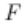

Tabela: Tabela verdade de contradição.Ana Lúcia de Sousa. 

O preenchimento da 7ª coluna é o resultado da seguinte análise: 3ª coluna ↔ 6ª coluna. 

Lembre-se de que a bicondicional tem o valor lógico (verdadeiro) sempre que as duas proposições são verdadeiras ou falsas. Nos demais casos, o valor lógico é (falso). 

Veja que a última coluna da tabela-verdade tem em todas as linhas o valor lógico (falso). Ou seja, não há nenhum valor lógico (verdadeiro). Quando isso ocorre, dizemos que estamos diante de uma contradição. 

Dizemos que uma proposição é uma contradição se seu valor lógico é (falso), independentemente dos valores lógicos das proposições que a compõem. 

#### Contingência 

Para compreender esse conceito, vamos considerar a seguinte proposição: 

Vamos construir sua tabela-verdade e analisar o resultado da última coluna da tabela 

|1ª 2ª|3ª|4ª|5ª|6ª|7ª|
|---|---|---|---|---|---|
||~|~|~|~|( ~ )→(~ )|

Tabela: Tabela verdade de contingência.Ana Lúcia de Sousa. 

O preenchimento da 7ª coluna é o resultado da seguinte análise: 5ª coluna → 6ª coluna. 

Veja que a última coluna da tabela-verdade não apresenta em todas as linhas somente resultados (verdadeiro) e nem apresenta somente resultados (falso). Ou seja, quando, na última coluna da tabela, encontramos os valores lógicos e , cada um pelo menos uma vez, isso significa que temos uma contingência ou indeterminação. Em outras palavras, a contingência é toda proposição composta que não é tautologia nem contradição. 

## Atividade 1 

Questão 1 

(ENADE/2011) Com relação ao valor lógico, avalie as afirmações a seguir.1. 2. 3. 

4. 

É tautologia apenas o que se afirma em: 

<!-- Start of picture text -->
A I B II C I e III D II e IV E III e IV <!-- End of picture text -->

##### A alternativa B está correta. 

Lembre-se de que a notação (¬) representa a negação (∼). 

Nessa questão, é necessário construir a tabela-verdade de cada afirmação. Teremos uma tautologia se na última coluna da tabela-verdade encontrarmos somente o valor lógico V (verdadeiros) em todas as linhas. 

###### I. ¬( ∧ ¬ ) 

|~ **∧**¬ ¬( **∧**¬ )|
|---|

Na última coluna da tabela, não temos uma tautologia. A afirmação I não é uma tautologia. 

II. → ( → ) 

|→  →(  → )|
|---|

Na última coluna da tabela, temos uma tautologia. A afirmação II é uma tautologia. 

III. ( ¬ ) → ¬ 

|¬ ¬ ¬ ( ¬ )→¬|
|---|

Na última coluna da tabela, não temos uma tautologia. A afirmação III não é uma tautologia. IV. ( ) (¬ ¬ ) 

|¬ ¬ ¬ ¬ ( ) (¬ ¬ )|
|---|

Na última coluna da tabela, não temos uma tautologia. A afirmação IV não é uma tautologia. Podemos concluir que somente a afirmação II é uma tautologia. 

## Álgebra booleana 

O conhecimento teórico sobre a álgebra booleana nos permite entender o funcionamento dos sistemas digitais e da computação. Essa álgebra, que trabalha com valores binários, é a base da lógica dos circuitos eletrônicos e dos computadores. Assista a este vídeo para aprender sobre os operadores booleanos AND, OR e NOT, e como construir tabelas-verdade a partir de expressões booleanas. 

Neste vídeo, você vai conhecer os conceitos fundamentais da álgebra booleana, incluindo operadores AND, OR e NOT. Você também vai ver as tabelas-verdade para cada operador, bem como exemplos práticos de como construir essas tabelas a partir de expressões booleanas. 

##### Conteúdo interativo 

Acesse a versão digital para assistir ao vídeo. 

A álgebra booleana, também conhecida como álgebra de Boole, surgiu a partir da publicação de um trabalho de George Boole, matemático inglês, em 1854. 

Essa álgebra considera apenas dois valores: 1 (um) e 0 (zero). 

Esses valores também são chamados de constantes booleanas e podem ser representados pelos valores lógicos verdadeiro e falso. Normalmente, consideramos: 

- 1 (um) - verdadeiro 

- 

- 0 (zero) - falso 

- 

A álgebra booleana tem um papel importante no surgimento da computação. Vale sinalizar que ela está presente nos computadores, sob a forma de bit (do inglês Binary Digit), que até os dias atuais utilizam essa aritmética binária. 

Considera-se, na álgebra booleana: 

- Variáveis booleanas (A, B, C, ...) que assumem os valores 1 ou 0, ou seja, verdadeiro ou falso, respectivamente. 

- 

- A partir das variáveis booleanas podemos construir uma expressão matemática que é chamada de expressão booleana. Essa expressão também assume apenas dois valores: 1 ou 0 (verdadeiro ou falso). 

São tipos de expressões booleanas: 

#### Operações na álgebra booleana 

### Operação de adição 

Operador: OR (ou). 

Essa operação equivale à operação 

Notação: ou OR . 

### Operação de multiplicação 

Operador: AND (e). 

Essa operação equivale à operação . 

Notação: ou AND . 

### Operação de complementação 

Ela também pode ser chamada de inversão ou negação, pois trocará o valor lógico da variável booleana. 

- Operador: NOT (não). 

- Notação: Ā ou A'. 

- 

- Essa operação equivale à operação de negação ~p. 

- 

- NOT também é chamado de operador unário. 

- 

Observe o exemplo: 

- Se A = 0 então Ā = 1 

- 

- Se A = 1 então Ā = 0 

- 

Agora, conheceremos a tabela-verdade dos operadores AND, OR e NOT e a construção de algumas tabelas a partir das expressões booleanas. 

#### Tabela-verdade: NOT 

Seja a expressão S = Ā em que A é uma variável booleana. 

|1 0|
|---|
|0 1|

Tabela: Tabela-verdade de NOT.Ana Lúcia de Sousa. 

Veja que: 

- Se a entrada for 1, a saída é 0 

- 

- Se a entrada for 0, a saída é 1 

- 

#### Tabela-verdade: AND 

Seja a expressão S = A ∙ B, em que A e B são variáveis boolenas. 

|1|1|1|
|---|---|---|
|1|0|0|
|0|1|0|
|0|0|0|

Tabela: Tabela-verdade de AND.Ana Lúcia de Sousa. 

Observe que o resultado será 1 (verdadeiro) somente se as duas variáveis booleanas forem iguais a 1. Isso só ocorre na primeira linha da tabela-verdade. Nos demais casos, o resultado é 0 (falso). 

#### Tabela-verdade: OR 

Seja a expressão S = A + B, onde A e B são variáveis booleanas. 

|1 1|1|
|---|---|
|1 0|1|

|0|1|1|
|---|---|---|
|0|0|0|

Tabela: Tabela-verdade de OR.Ana Lúcia de Sousa. 

Usando OR, o resultado será 0 (falso) somente se as duas variáveis booleanas forem iguais a 0 (zero). Isso só ocorre na quarta linha da tabela-verdade. Nos demais casos, o resultado é 1 (verdadeiro). 

Agora, podemos construir tabelas-verdade de outras expressões booleanas. Veja alguns exemplos. 

Exemplo 1 

Construa a tabela-verdade da expressão booleana S = (A ∙ B) ∙ (B + C). 

Solução: 

Vamos identificar inicialmente as variáveis booleanas. 

Variáveis booleanas: e 

Lembre-se de que essa tabela possui linhas, pois possui 3 variáveis. Nas primeiras colunas, devemos colocar as variáveis e , com seus respectivos valores 1 ou . Em seguida, devemos seguir o mesmo procedimento realizado no módulo 2, para ou . 

|1|1|1|
|---|---|---|
|1|1|0|
|1|0|1|
|1|0|0|
|0|1|1|
|0|1|0|
|0|0|1|
|0|0|0|

Tabela: Primeira tabela-verdade do exemplo 1.Ana Lúcia de Sousa. 

Agora, vamos abrir uma coluna para a operação que está dentro do primeiro parêntese (A ∙ B). 

|1 1 1 1|
|---|

|1|1|0|1|
|---|---|---|---|
|1|0|1|0|
|1|0|0|0|
|0|1|1|0|
|0|1|0|0|
|0|0|1|0|
|0|0|0|0|

Tabela: Segunda tabela-verdade do exemplo 1.Ana Lúcia de Sousa. 

A operação utilizada é AND. Nessa operação, o resultado será 1 (verdadeiro) somente se as duas variáveis booleanas forem iguais a 1, ou seja, A = 1 e B = 1. Nos demais casos, o resultado é 0 (falso). 

Agora, vamos abrir a próxima coluna para a operação (B + C). 

|1|1|1|1|1|
|---|---|---|---|---|
|1|1|0|1|1|
|1|0|1|0|1|
|1|0|0|0|0|
|0|1|1|0|1|
|0|1|0|0|1|
|0|0|1|0|1|
|0|0|0|0|0|

Tabela: Terceira tabela-verdade do exemplo 1.Ana Lúcia de Sousa. 

A operação utilizada é OR. Nessa operação, o resultado será 0 (falso) somente se as duas variáveis booleanas forem iguais a 0 (zero), ou seja, A = 0 e B = 0. Nos demais casos, o resultado é 1 (verdadeiro). 

Por último, abrimos a última coluna para a expressão completa S = (A ∙ B) ∙ (B + C). 

|1|1|1|1|1 1|
|---|---|---|---|---|
|1|1|0|1|1 1|
|1|0|1|0|1 0|

|1|0|0|0|0|0|
|---|---|---|---|---|---|
|0|1|1|0|1|0|
|0|1|0|0|1|0|
|0|0|1|0|1|0|
|0|0|0|0|0|0|

Tabela: Quarta tabela-verdade do exemplo 1.Ana Lúcia de Sousa. 

A operação utilizada é AND. Nessa operação, o resultado será 1 (verdadeiro) somente se as duas variáveis booleanas forem iguais a 1, ou seja, A = 1 e B = 1. Nos demais casos, o resultado é 0 (falso). 

### Exemplo 2 

Construa a tabela-verdade da expressão booleana S = Ā + B. 

Solução: 

Vamos identificar, inicialmente, as variáveis booleanas. 

Variáveis booleanas: e 

Lembre-se de que essa tabela apresenta linhas, pois possui 2 variáveis. Nas primeiras colunas, devemos colocar as variáveis e , com seus respectivos valores 1 ou 0 . 

|1|1|0|1|
|---|---|---|---|
|1|0|0|0|
|0|1|1|1|
|0|0|1|1|

Tabela: Tabela-verdade do exemplo 2.Ana Lúcia de Sousa. 

Ā representa a negação de A. Logo, se A = 1, então Ā = 0. Se A = 0 então Ā = 1. 

Em S = Ā + B a operação utilizada é OR. Nessa operação, o resultado será 0 (falso) somente se as duas variáveis booleanas forem iguais a 0 (zero), ou seja, A = 0 e B = 0. Nos demais casos, o resultado é 1 (verdadeiro). 

Na álgebra booleana, também devemos ficar atentos aos parênteses e à ordem de precedência dos operadores. 

###### 1. Parênteses 

2. Negação ou complementação 

3. Multiplicação lógica (A ∙ B) 

4. Soma lógica (A + B) 

## Atividade 2 

###### Questão 1 

(ENADE/2017) A álgebra booleana possui um operador unário ~, conhecido como NÃO, e os operadores binários *e +, conhecidos como Ee OU, respectivamente. A tabela-verdade é utilizada para validar uma fórmula composta de operadores da álgebra booleana. 

A seguir, é apresentada a tabela-verdade para as proposições p, q e r diante da fórmula , em que representa uma proposição verdadeira e F, uma proposição falsa. 

A + ~ * ~ B + * ~ C ~ + * D ∼ + ∼ * E ∼ + * ∼ 

A alternativa C está correta. 

Nessa questão, devemos ficar atentos à ordem de precedência dos conectivos na álgebra booleana. De acordo com a teoria estudada, a multiplicação lógica é a operação principal. 

Dessa forma, a colocação do parêntese em cada alternativa fica da seguinte forma: 

A) ( + ∼ ) * ∼ B) ( + ) * ∼ C) (∼ + ) * D) (∼ + ∼ ) * E) (∼ + ) * ∼ 

Analisando as alternativas: 

Na análise, vamos considerar a primeira linha da tabela, onde os valores lógicos de cada proposição simples são: ( ) = ; ( ) = e ( ) = , e o resultado na coluna G é verdadeiro. 

Vamos verificar esses valores lógicos em cada alternativa. A alternativa correta é aquela cujo resultado é verdadeiro. 

A) ( + ∼ ) * ∼ . INCORRETA, pois ( + ) * = * = 

C) (∼ + ) * . CORRETA, pois ( + ) * = * = D) (∼ + ∼ ) * . INCORRETA, pois ( + ) * = * = E) (∼ + ) * ∼ . INCORRETA, pois ( + ) * = * = 

4. Conceitos de implicação lógica, equivalência e regras de inferência 

## Implicações lógicas 

O conhecimento teórico sobre implicações lógicas nos ajuda a compreender a relação entre proposições e construir argumentos válidos. É uma habilidade muito útil em áreas como matemática, lógica e computação, nas quais é preciso verificar as proposições. Assista a este vídeo para aprender, com exemplos práticos, como apurar se uma proposição implica logicamente outra a partir da construção de tabelas-verdade. 

Neste vídeo, você vai conhecer as implicações lógicas, um conceito central na lógica proposicional que estabelece a relação de dependência entre duas proposições. Você também vai aprender como uma proposição p implica logicamente uma proposição q usando a notação . Você vai, por fim, entender, com exemplos práticos, como e , o processo de verificação, utilizando tabelas-verdade. 

##### Conteúdo interativo 

Acesse a versão digital para assistir ao vídeo. 

Vamos considerar duas proposições compostas e 

Podemos dizer que a proposição implica logicamente a proposição , se a proposição tem o valor lógico verdadeiro sempre que a proposição for verdadeira. 

Para indicar essa implicação, usamos a seguinte notação: 

#### Exemplo 1 

Vamos verificar se a proposição composta implica logicamente a proposição composta , através da tabela-verdade. 

Simbolicamente: 

Tabela: Tabela-verdade do exemplo 1.Ana Lúcia de Sousa. 

Veja que, na primeira linha da tabela-verdade, a proposição tem o valor lógico verdadeiro, e o mesmo ocorre com a proposição . Portanto, podemos dizer que implica logicamente , ou, ainda, . 

Atenção 

Na tabela, só nos interessa analisar as linhas em que há (verdadeiro). 

#### Exemplo 2 

Considere as proposições compostas: e . Podemos afirmar que: ? 

Solução 

Vamos construir a tabela-verdade. 

Tabela: Tabela-verdade do exemplo 2.Ana Lúcia de Sousa. 

Veja que, nas duas últimas linhas, temos que a proposição é verdadeira e a proposição é falsa. Logo, é falso que: 

## Atividade 1 

Questão 1 

Os conectivos condicionais permitem a análise de implicações entre proposições para a tomada de decisão lógica. Considerando as proposições e , qual é o valor lógico da proposição quando é verdadeiro e é falso? 

A Verdadeiro B Falso C Indeterminado D Verdadeiro apenas se q for verdadeiro E Falso apenas se p for falso 

##### A alternativa A está correta. 

Para determinar o valor lógico da proposição quando é verdadeiro e q é falso, analisamos a tabela-verdade. Primeiro, é falso, pois pé verdadeiro eq é falso. Segundo, é verdadeiro é falso. Assim, é falso, pois o antecedente é verdadeiro eo consequente é falso. Portanto, temos (falso) (falso). De acordo com a tabela-verdade da condicional, uma proposição com antecedente falso é sempre verdadeira. Logo, é verdadeiro nesse caso. 

## Equivalência lógica 

O conhecimento teórico sobre equivalências lógicas garante a precisão em argumentos e raciocínios matemáticos e computacionais para a análise e simplificação de proposições lógicas. Entender como diferentes proposições podem ser equivalentes ajuda a resolver problemas complexos de forma mais eficiente. Assista a este vídeo para aprender, com exemplos práticos, como verificar equivalências lógicas utilizando tabelas-verdade e leis de equivalência. 

Neste vídeo, você vai aprender sobre equivalências lógicas, um conceito central na lógica proposicional que permite verificar quando duas proposições são logicamente equivalentes. Você também vai ver as tabelasverdade e as leis de equivalência, bem como exemplos práticos que ilustram como identificar e aplicar equivalências lógicas em diferentes contextos. 

##### Conteúdo interativo 

Acesse a versão digital para assistir ao vídeo. 

Sejam e duas proposições compostas. Dizemos que uma proposição é equivalente a uma proposição se as tabelas-verdade dessas proposições forem iguais. Usamos a seguinte notação: 

Podemos relacionar as equivalências e as tautologias. Dessa forma, dizemos que as proposições e são equivalentes se e somente se ↔ é uma tautologia. Além disso, elas também são equivalentes se forem uma tautologia ou uma contradição. 

#### Tabela de equivalências 

Observe a tabela a seguir. 

|Comutativas Associativas|
|---|
|Idempotentes|
|Absorções|
|Distributivas|
|Leis de Morgan|
|Definições de implicação|
|Definições de bicondicional|
|Negação da bicondicional|
|Negação|
|Contrapositiva|

Tabela: Tabela de equivalências.Ana Lucia de Sousa. As equivalências que aparecem com frequências são: 

<!-- Start of picture text -->
Negação do "e": Leis de Morgan Negação do "ou": Definições de implicação Negação da condicional Negação Contrapositiva <!-- End of picture text -->

Tabela: Tabela de frequentes equivalências.Ana Lucia de Sousa. Veja alguns exemplos. 

1 - (CESGRANRIO/2009) Se Marcos levanta cedo, então Júlia não perde a hora. É possível sempre garantir que: 

1. Se Marcos não levanta cedo, então Júlia perde a hora. 

2. Se Marcos não levanta cedo, então Júlia não perde a hora. 

3. Se Júlia perde a hora, então Marcos levantou cedo. 

4. Se Júlia perde a hora, então Marcos não levantou cedo. 

5. Se Júlia não perde a hora, então Marcos levantou cedo. 

Solução: 

Nessa questão, devemos buscar uma proposição equivalente a: Se Marcos levanta cedo, então Júlia não perde a hora. Considerando: 

   - Marcos levanta cedo. 

- 

   - Júlia não perde a hora. 

- 

- Na linguagem simbólica podemos escrever: → . 

Veja que temos uma condicional. Então, vamos verificar na tabela a equivalência onde aparece a condicional. Contrapositiva: → ↔ ∼~ → ~ . Vamos negar as proposições e . 

- Marcos levanta cedo. 

- ~ Marcos não levanta cedo. 

- Júlia não perde a hora. 

- ~ Júlia perde a hora. 

- ~ → ~ Se Júlia perde a hora, então Marcos não levanta cedo. 

- Alternativa correta: D 

2 - (CBMERJ/2014 - Adaptado) Dizer que “não é verdade que 'Marcela não é bonita ou Maria não é organizada' ” é logicamente equivalente a dizer que é verdade que: 

1. Se Marcela não é bonita, então Maria é organizada. 

2. Marcela é bonita e Maria é organizada. 

3. Marcela é bonita ou Maria não é organizada. 

4. Marcela é bonita ou Maria é organizada. 

5. Marcela não é bonita e Maria não é organizada. 

Solução: “Não é verdade que Marcela não é bonita ou Maria não é organizada.” Na linguagem simbólica, temos: 

- ~ Marcela não é bonita. 

- ~ Maria não é organizada. 

- Não é verdade é uma negação (~). 

Temos, então: ~(~ ~ ) Aplicando as Leis de De Morgan: Negação do "ou": Assim, Logo, Marcela é bonita e Maria é organizada.Alternativa correta: B 

#### Outras proposições associadas a uma condicional 

Com relação à condicional → , temos as seguintes proposições associadas: 

- Proposição recíproca → 

- Proposição contrária ~ → ~ 

A proposição contrapositiva também é uma proposição associada à condicional e é a única equivalente à condicional. 

## Atividade 2 

###### Questão 1 

(Fundação Carlos Chagas) Se não leio, não compreendo. Se jogo, não leio. Se não desisto, compreendo. Se é feriado, não desisto. Então: 

A Se jogo, não é feriado. 

- B Se não jogo, é feriado. 

- C Se é feriado, não leio. 

<!-- Start of picture text -->
D Se não é feriado, leio. E Se é feriado, jogo. A alternativa A está correta. Vamos escrever cada declaração na linguagem simbólica. Veja que, em todas as declarações, temos a condicional. Se não leio, não compreendo. ∼  → Se jogo, não leio.   → ∼ Se não desisto, compreendo. ∼  → ∼ Se é feriado, não desisto.   → ∼ Temos, então: Agora vamos fazer as implicações: Podemos concluir que  , ou seja: Se jogo, não é feriado.Observação:Usando a contrapositiva , podemos escrever: <!-- End of picture text -->

## Regras de inferência 

O conhecimento teórico sobre as regras de inferência ajuda a validar argumentos de maneira eficiente. Essas regras simplificam a verificação de proposições complexas, sendo fundamentais tanto na matemática quanto na computação. Assista a este vídeo para aprender, a partir de exemplos práticos, como aplicar regras de inferência como modus ponens, modus tollens, silogismo hipotético e outras para verificar a validade de argumentos. 

Neste vídeo, você vai aprender sobre as principais regras de inferência utilizadas para validar argumentos lógicos. Você também vai ver exemplos práticos de como aplicar regras como modus ponens, modus tollens, silogismo hipotético e outras para simplificar e verificar a veracidade de proposições complexas. 

##### Conteúdo interativo 

Acesse a versão digital para assistir ao vídeo. 

Agora, vamos conhecer as regras de inferência. Através delas, podemos verificar a validade de argumentos. Considere a seguinte situação: 

Se Carlos estuda, então é aprovado em lógica. 

Se Carlos não estuda bem, então o professor é culpado. 

Se Carlos é aprovado em lógica, então seus pais ficam felizes. 

Os pais de Carlos não estão felizes. Logo, o professor é culpado. 

Se Carlos é aprovado em lógica, então seus pais ficam felizes. 

Os pais de Carlos não estão felizes. 

Logo, o professor é culpado. 

Esse argumento é válido? 

Não sabemos. Podemos verificar a validade de um argumento através da construção da tabela-verdade, mas nem sempre esse trabalho é tão simples, pois o número de linhas da tabela-verdade aumenta de acordo com a quantidade de proposições presentes na formulação dos argumentos. 

Diante de situações como essa, podemos usar as regras de inferência, que são argumentos válidos e/ou regras lógicas usados na validação de outros argumentos. Com as regras de inferência, podemos realizar as demonstrações de maneira mais simples. 

Homem concentrado sentado em frente ao computador. 

As regras de inferência são importantes para os estudantes de computação no desenvolvimento de algoritmos, e para os estudantes de matemática que precisam conhecer as regras lógicas de demonstrações. Neste módulo, apenas conheceremos essas regras, pois elas são detalhadas em temas que tratam de métodos de demonstração. 

#### Regra da adição (AD) 

As premissas são colocadas sobre o traço horizontal. Abaixo dele temos a conclusão. 

### Exemplo 

(Fundação Carlos Chagas - Adaptado) Consideraremos as seguintes proposições: 

A temperatura está baixa. Há nevoeiro. 

Conclusão: 

A temperatura está baixa ou há nevoeiro. 

#### Regra da simplificação (SIMP) 

Observe a proposição seguir. 

### Exemplo 

(Fundação Carlos Chagas - Adaptado) Consideraremos as seguintes proposições: 

A temperatura está baixa. Há nevoeiro. A temperatura está baixa e há nevoeiro. Conclusão: A temperatura está baixa. Também podemos considerar: Há nevoeiro. 

Modus ponens (MP) 

Observe a proposição seguir. 

### Exemplo 

(Fundação Carlos Chagas - Adaptado) Consideraremos as seguintes proposições: 

A temperatura está baixa. Há nevoeiro. Se a temperatura está baixa então há nevoeiro. A temperatura está baixa. 

Conclusão: 

Há nervoeiro. 

Modus tollens (MT) 

Observe a proposição seguir. 

### Exemplo 

(Fundação Carlos Chagas - Adaptado) Consideraremos as seguintes proposições: 

: A temperatura está baixa. : Há nevoeiro. : Se a temperatura está baixa então há nevoeiro. : Não há nevoeiro. 

Conclusão: 

∼ A temperatura não está baixa. 

#### Silogismo hipotético (SH) 

Observe a proposição seguir. 

### Exemplo 

(Fundação Carlos Chagas - Adaptado) Consideraremos as seguintes proposições: 

A temperatura está baixa. Há nevoeiro. Os aviões não decolam. → Se a temperatura está baixa então há nevoeiro. → Se há nevoeiro então os aviões não decolam. 

Conclusão: 

→ Se a temperatura está baixa então os aviões não decolam. 

#### Silogismo disjuntivo (SD) 

### Exemplo 

(Fundação Carlos Chagas - Adaptado) Consideraremos as seguintes proposições: 

A temperatura está baixa. Há nevoeiro. A temperatura está baixa ou há nevoeiro. ∼ : A temperatura não está baixa. 

Conclusão: 

Há nevoeiro. 

Também podemos considerar: 

A temperatura está baixa ou há nevoeiro. ∼ Não há nevoeiro. 

Conclusão 

Há nevoeiro. A temperatura está baixa. 

#### Regra da conjunção (CONJ) 

Observe a proposição seguir. 

### Exemplo 

(Fundação Carlos Chagas - Adaptado) Consideraremos as seguintes proposições: 

A temperatura está baixa. Há nevoeiro. 

Conclusão: 

## Atividade 3 

Questão 1 

No estudo da lógica proposicional, as regras de inferência permitem deduzir conclusões a partir de premissas dadas. Por exemplo, ao aplicar essas regras para determinar qual delas justificaria a conclusão q com base 

nas premissas fornecidas, temos estas proposições: : A temperatura está baixa e ; : Há nevoeiro.Dessa forma, qual regra de inferência justifica a conclusão a partir das premissas e ? 

A Modus tollens B Silogismo hipotético C Modus ponens D Regra da adição E Regra da simplificação 

##### A alternativa C está correta. 

Para justificar a conclusão q a partir das premissas → e , utilizamos a regra de inferência chamada modus ponens. De acordo com essa regra, se temos uma condicional → e sabemos que é verdadeiro, podemos concluir que q também é verdadeiro. Portanto, a regra correta é modus ponens. 

## Análise dos argumentos 

As regras de inferência são fundamentais para a matemática, a lógica e a computação. Assista a este vídeo para aprender, a partir de exemplos práticos, como utilizar as regras de inferência para analisar a validade de argumentos e entender a estrutura lógica por trás deles. 

Neste vídeo, você vai aprender a utilizar as regras de inferência para validar argumentos lógicos. Você também vai ver exemplos práticos de como identificar e aplicar premissas e conclusões para determinar a validade de um argumento, um processo de dedução lógica explicado passo a passo. 

##### Conteúdo interativo 

Acesse a versão digital para assistir ao vídeo. 

Conhecendo as regras de inferência, sabemos que elas são importantes na validação de argumentos e para, a partir de proposições conhecidas, deduzirmos outras proposições. 

No estudo de argumentos, consideraremos exemplos mais simples, nos quais poderemos fazer uso do valor lógico dos conectivos para analisarmos sua validade. 

Um argumento é formado por um conjunto de proposições simples ou compostas, em que uma dessas proposições é a conclusão, que vamos chamar de Q. 

O restante das proposições são as premissas ou hipóteses do argumento. Um argumento apresenta uma sequência de premissas: 

Premissa 1 Premissa 2 Premissa 3 Premissa 

Logo, podemos indicar um argumento por: 

Dessa forma, podemos dizer que a conclusão se deduz das premissas, ou que a conclusão decorre das premissas. 

Se as premissas e a conclusão têm valor lógico (verdadeiro), dizemos que o argumento é válido. Na análise da validade de um argumento, consideramos que todas as premissas são verdadeiras. Se o argumento for inválido, chamamos de sofisma ou falácia. 

Veja um exemplo de argumento: 

#### Exemplo 

(CEBRASPE/ABIN/2018 - Adaptado) As seguintes proposições lógicas formam um conjunto de premissas de um argumento: 

Se Pedro não é músico, então André é servidor da ABIN. Se André é servidor da ABIN, então Carlos não é espião. Carlos é um espião. 

A partir dessas premissas, julgue o item a seguir, acerca de lógica de argumentação. Analise que, se a proposição lógica “Pedro é músico” for a conclusão desse argumento, então, as premissas, juntamente com essa conclusão, constituem um argumento válido. 

Solução: Premissas: 

- Se Pedro não é músico, então André é servidor da ABIN. 

- 

- Se André é servidor da ABIN, então Carlos não é espião. 

- 

- Carlos é um espião. 

Conclusão: Pedro é músico. 

Consideramos todas as premissas e a conclusão verdadeiras. 

1. Se Pedro não é músico, então André é servidor da ABIN. ( ) 

2. Se André é servidor da ABIN, então Carlos não é espião. ( ) 

3. Carlos é um espião. ( ) 

Conclusão: Pedro é músico ( ) 

Agora, começaremos a analisar a partir da proposição simples “Carlos é um espião”. 

Se Pedro não é músico , então André é servidor da ABIN . Se André é servidor da ABIN , então Carlos não é espião . Carlos é um espião. ( ) 

Logo, concluímos que Pedro é músico. O argumento é válido. 

## Atividade 4 

###### Questão 1 

No estudo da lógica proposicional, é preciso entender como as premissas levam a conclusões válidas utilizando regras de inferência. Consideremos a situação de uma estudante, Maria, que enfrenta a necessidade de passar em um exame. As seguintes premissas são fornecidas para analisar a situação e deduzir uma conclusão válida: 

1. Se Maria estuda, então ela passa no exame. 

2. Maria não passou no exame. 

Qual conclusão pode ser validamente inferida dessas premissas? 

A Maria não estudou. 

- B Maria passou no exame. 

- C Maria estudou. 

- D Maria não é inteligente. 

- E O exame é difícil. 

##### A alternativa A está correta. 

Para determinar a conclusão válida a partir das premissas Se Maria estuda, então ela passa no exame e Maria não passou no exame, utilizamos a regra de inferência modus tollens. Segundo essa regra, se temos e , então podemos concluir . Vamos aplicar ao nosso exemplo:1. (Se Maria estuda, então ela passa no exame). 

2 (Maria não passou no exame).3. Portanto, (Maria não estudou). 

Assim, a conclusão válida é Maria não estudou. 

5. Conclusão 

## Considerações finais 

- A importância da lógica para organizar o pensamento e tomar decisões corretas. 

- 

- A importância de conhecer os fundamentos da lógica para várias áreas do conhecimento. 

- 

- Breve história da lógica e a contribuição de matemáticos importantes. 

- 

- Introdução à álgebra booleana e seus conceitos básicos. 

- 

- A lógica é aplicada em situações do cotidiano. 

- 

- Exemplos práticos ajudaram a entender os conceitos lógicos. 

- 

- A colaboração da análise lógica na compreensão de argumentos. 

- 

- A relevância da lógica para o desenvolvimento de disciplinas em engenharias e ciências exatas. 

- 

- A importância do cálculo proposicional especialmente na computação. 

- 

##### Podcast 

Ouça o podcast com um resumo do conteúdo estudado. 

##### Conteúdo interativo 

Acesse a versão digital para ouvir o áudio. 

###### Explore + 

Para saber mais sobre os assuntos abordados neste conteúdo: 

Leia os artigos: 

- A lógica no cotidiano e a lógica na matemática, de Flávia Soares. 

- 

- A álgebra boolena presente nos circuitos lógicos, de Vilton Ricardo dos Santos e Cassius Gomes de Oliveira. 

Assista aos vídeos: 

- Grandes Pensadores: Aristóteles, com Liliana de Castro, no canal Socratica Português, no Youtube. 

- A lógica de Alice, no site Matemática Multimídia da Unicamp. 

- 

###### Referências 

ALENCAR FILHO, E. Iniciação à lógica matemática. 18. ed. São Paulo: Nobel, 2002. 

BARBOSA, M. A.Introdução à lógica matemática para acadêmicos. Curitiba: InterSaberes, 2017. 

BARROS, D.M. Raciocínio lógico, matemático e quantitativo. São Paulo: Novas Conquistas São Paulo, 2001. 

DAGHLIAN, J. Lógica e álgebra de Boole. 4. ed. São Paulo: Atlas, 2012. 

FERNANDES, D. C. R. Lógica matemática. Rio de Janeiro: SESES, 2016. 

HEGENBERG, L. Lógica: o cálculo de predicados. Rio de Janeiro: Forense Universitária, 2012. 

LEITE, A. E.; CASTANHEIRA, N. P. Raciocínio lógico e lógica quantitativa. Curitiba: InterSaberes, 2017. 

MACHADO, N. J.; CUNHA, M. O. Lógica e linguagem cotidiana: verdade, coerência, comunicação, argumentação. 2. ed. Belo Horizonte: Autêntica, 2008. 

