# Métodos de demonstração 

Você vai estudar os métodos de demonstração como fundamento matemático para problemas relacionados à engenharia e à computação. Projetar, analisar, interpretar, resolver e validar soluções para problemas, por meio do uso de metodologias e técnicas que envolvam métodos de demonstração, são aspectos de formalismo da lógica matemática importantes para os profissionais das ciências exatas em geral. 

Prof. Manuel Ramos de Freitas 

1. Itens iniciais 

#### Preparação 

Antes de iniciar o conteúdo, é recomendável que você use um navegador de internet de sua preferência em seu dispositivo e busque uma calculadora on-line do tipo calculadora lógica (tabela-verdade) para acompanhar os exemplos apresentados. 

#### Objetivos 

- Descrever as demonstrações por vacuidade, trivial, direta e por contradição (ou redução ao absurdo). 

- 

- Reconhecer as técnicas envolvendo quantificadores. 

- 

- Reconhecer o princípio da indução e suas aplicações. 

- 

#### Introdução 

Uma demonstração matemática é o processo de provar uma declaração começando com axiomas simples e utilizando regras de inferência para construir teoremas complexos. Semelhante à programação de computadores, que usa instruções simples para criar software complexo, realizar a construção de uma demonstração é como construir uma ponte das premissas à conclusão desejada. 

Assista ao vídeo e entenda melhor! 

Conteúdo interativo 

Acesse a versão digital para assistir ao vídeo. 

1. Métodos de demonstração 

## Método de demonstração trivial 

O conhecimento teórico em matemática é essencial para desenvolver habilidades de raciocínio lógico e resolver problemas complexos. Compreender como as demonstrações funcionam permite que você aplique conceitos fundamentais em diversas situações. Vamos explorar como as implicações e demonstrações matemáticas são estruturadas e aplicadas, proporcionando uma base sólida para avançar em estudos mais aprofundados. 

Assista ao vídeo e entenda como as implicações matemáticas, representadas por , são usadas para construir demonstrações. Confira exemplos sobre como verificar a validade dessas implicações para diferentes valores dentro de um conjunto. 

Conteúdo interativo 

Acesse a versão digital para assistir ao vídeo. 

Em quase todas as implicações que encontraremos, e são frases abertas, ou seja, vamos realmente considerar ou , ou alguma implicação relacionada, dependendo de que variável será usada. 

- As variáveis ou (ou alguns outros símbolos) são usadas para representar elementos de algum conjunto S, que contextualiza as discussões, o domínio da variável. 

- Para cada valor de uma variável de seu domínio, teremos resultados de uma declaração. 

#### Exemplo 

Vamos acompanhar um exemplo! 

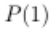

é uma afirmação verdadeira, enquanto é uma afirmação falsa. 

Da mesma forma, raramente é o caso de ser verdadeiro para todo ou que ser falso para todo . 

Quando a instrução quantificada for expressa como resultado ou teorema, muitas vezes escrevemos uma declaração da seguinte forma: 

Ou desta forma: 

Assim, (1) é verdade se for uma afirmação verdadeira para cada ; enquanto (1) é falso se for falso para pelo menos um elemento . 

Para cada elemento , vamos verificar as condições sob as quais" " tem um valorverdade . 

Observe a tabela! 

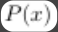

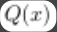

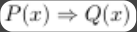

|V|V|V|
|---|---|---|
|V|F|F|
|F|V|V|
|F|F|V|

Tabela: Representação valor-verdade V. Manuel Ramos de Freitas. 

Assim, se for verdadeiro para todo ou for falso para todo , então, determinando a verdade ou falsidade de (1), torna-se consideravelmente mais fácil. De fato, se pode ser mostrado que é verdadeiro para todo , independentemente do valor da verdade de , então, de acordo com a tabela da verdade para a implicação, (1) é verdadeira. Isso constitui uma demonstração de (1) e é chamada de demonstração trivial. 

A declaração a seguir é verdadeira, e uma demonstração (trivial) consiste apenas em observar que 3 é um inteiro ímpar. 

Considere . Se , então, 3 é ímpar. 

A respeito da declaração, acompanhe! 

Resultado 1 Seja . Se , então: 

##### Demonstração 

Sendo para cada número real , segue-se que: 

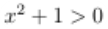

Assim 

Agora, considere o seguinte: 

Em que . 

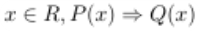

Então, o resultado 1 afirma a verdade: para todo 

Desde que verificamos que é verdadeiro para cada , segue que é verdadeiro para todo , assim, o resultado 1 é verdadeiro. 

Nesse caso, quando considerado sobre o domínio é, na verdade, uma afirmação verdadeira. Foi esse fato que nos permitiu dar uma demonstração trivial do Resultado 1. A demonstração do Resultado 1 não depende de . 

##### Comentário 

Desde que , nós poderíamos ter substituído " " por qualquer hipótese (incluindo o mais satisfatório " " ), e o resultado ainda seria verdadeiro. Na verdade, esse novo resultado tem a mesma demonstração. Para ter certeza, é raro, de fato, quando uma demonstração trivial é usada para verificar uma implicação; no entanto, isso é um lembrete importante da tabela-verdade mostrada. 

## Atividade 1 

###### Questão 1 

Seja x ∈ ℕ*. Se 8 + |x| ≤ 10, então x² + 3x − 2 é par. Avalie as asserções a seguir e a relação proposta entre elas. 

I. Suponha que para o número natural não nulo x, temos 8 + |x| ≤ 10. Então |x| ≤ 2 e x ∈ ℕ*, logo x pode assumir os valores 1 ou 2. 

###### Porque 

II. Para x = 1, temos 1² + 3·1 − 2 = 2, que é um número par. 

A respeito dessas asserções, assinale a resposta correta. 

A As asserções I e II são proposições verdadeiras, e II é uma justificativa correta para I. 

B As asserções I e II são proposições verdadeiras, mas II não é uma justificativa correta para I. 

- C A asserção I é uma proposição verdadeira e a II é uma proposição falsa. 

D A asserção I é uma proposição falsa e a II é uma proposição verdadeira. 

E As asserções I e II são proposições falsas. 

##### A alternativa B está correta. 

A assertiva I é verdadeira, pois da desigualdade 8 + |x| ≤ 10 obtemos |x| ≤ 2, e como x ∈ ℕ*, os valores possíveis são 1 e 2. A assertiva II também é verdadeira, pois 1² + 3·1 − 2 = 2, que é par. Entretanto, a II não justifica a I, pois apenas verifica um caso particular. 

## Método de demonstração por vacuidade 

Compreender os diferentes tipos de demonstrações matemáticas, como a demonstração por vacuidade, é essencial para aplicar conceitos teóricos em diversas situações práticas. 

Neste vídeo, exploraremos a demonstração por vacuidade, em que é falso para todo , tornando verdadeira. Exemplos práticos, como "Se , então ", ilustram como a falsidade de valida a implicação, independentemente de . Assista! 

##### Conteúdo interativo 

Acesse a versão digital para assistir ao vídeo. 

Considere e frases abertas sobre um domínio .Assim, é uma afirmação verdadeira, se puder ser mostrado que é falso para todo (independentemente do valor da verdade de ), de acordo com a tabela-verdade para implicação. Tal demonstração chamase demonstração por vacuidade. 

##### Exemplo 

Na frase aberta , se for par, então é uma afirmação verdadeira. 

Vamos a um exemplo de uma demonstração por vacuidade. 

#### Exemplo 

Resultado 2 

Observe os aspectos a seguir. 

Seja . Se , então: 

### Demonstração 

Primeiro, observe que: 

Portanto: 

Assim, temos o seguinte: 

Dada a expressão anterior, temos que é falsa para todo , e a implicação é verdadeira. Para: 

O resultado 2 afirma a verdade de: 

Desde que verifiquemos que é falso para cada , é verdadeiro para cada . 

Nesse caso, é uma declaração falsa para cada . Isso é o que nos permitiu dar uma demonstração de vacuidade do resultado 2. 

Na demonstração do resultado 2, a verdade ou a falsidade de não desempenham nenhum papel. 

## Atividade 2 

Questão 1 

Considere a implicação "Seja . Se , então ". Analise as afirmações a seguir e escolha a correta. A A implicação é verdadeira para todo , pois é sempre maior que 0 . B A implicação é falsa para todo , pois não pode ser maior ou igual a 8 para nenhum valor de C A implicação é verdadeira para alguns valores de , mas falsa para outros. D A implicação é falsa para , pois é igual a 0, contrariando a hipótese. E A implicação é verdadeira porque é falso para todo , tornando a implicação verdadeira por vacuidade. A alternativa E está correta. A demonstração por vacuidade afirma que, se é falso para todo , então é verdadeira independentemente do valor-verdade de . No caso dado, 2 é sempre maior que 0, tornando a hipótese falsa e validando a implicação por vacuidade. 

## Método de demonstração direta 

A demonstração direta é uma técnica essencial que permite provar a veracidade de proposições, assumindo que uma condição inicial é verdadeira e mostrando que a conclusão também é verdadeira. 

Assista ao vídeo para entender como a demonstração direta funciona e veja exemplos práticos dessa técnica. 

##### Conteúdo interativo 

Acesse a versão digital para assistir ao vídeo. 

Intuitivamente, a demonstração direta de uma proposição do tipo sugere que assumamos que como uma proposição verdadeira e, através de uma linha de argumentação bem estruturada, conseguirmos concluir que a proposição seja, também, verdadeira. 

Na prática, o que tentamos desenvolver é um encadeamento de proposições condicionais, a partir da premissa até que possamos garantir a veracidade da proposição . 

Para justificarmos essa técnica, vamos abordar, as seguir, dois conceitos simples: a chamada regra de inferência modus ponens e a veracidade usual da condicional (ou fechamento da prova direta). 

Vejamos! 

#### A regra de inferência modus ponens 

A chamada regra de inferência modus ponens nos permite afirmar que, se duas proposições são verdadeiras, como: 

Então, podemos concluir que a proposição é verdadeira. 

Parece natural, não é mesmo, porque a tabela-verdade da condicional nos garante, de fato, que essa “argumentação” parece razoável. Veja! 

Basta observar que a única linha da tabela-verdade da condicional, em que e são proposições verdadeiras, ocorre exatamente quando é verdadeira! 

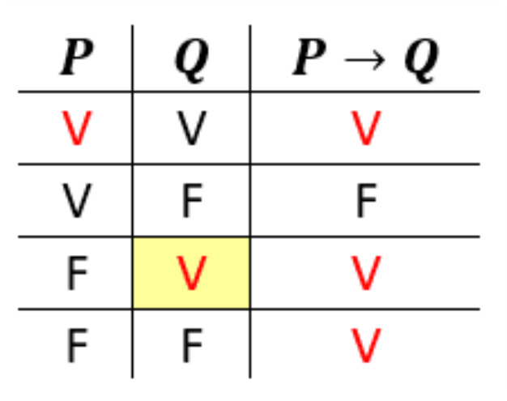

Suponha, então, que desejamos provar diretamente que uma proposição é verdadeira. Assumimos, inicialmente, que seja uma proposição verdadeira (porque, se for falsa, não há o que provar, pois, nesse caso, a condicional é obviamente verdadeira (veja a tabela-verdade!). 

Imagine que sabemos que as três proposições encadeadas, como e , também sejam verdadeiras. O que podemos concluir a partir da regra modus ponens? 

- Ora, se é uma proposição verdadeira e também é uma proposição verdadeira, podemos concluir (pela regra modus ponens) que é verdadeira. 

- Se é verdadeira e é verdadeira, analogamente, podemos também concluir que é verdadeira. 

- Finalmente, se e são verdadeiras, a proposição Q também é verdadeira. 

Agora, para concluirmos que a demonstração direta é uma técnica consistente, basta perceber o que faltaria argumentar para fechar essa estratégia de demonstração. 

#### Fechamento da demonstração direta 

Bem, havíamos suposto que era verdadeira e, a partir daí, concluímos que é verdadeira. Ora, se é verdadeira e é verdadeira, a simples tabela-verdade da condicional justifica a veracidade de . Observe! 

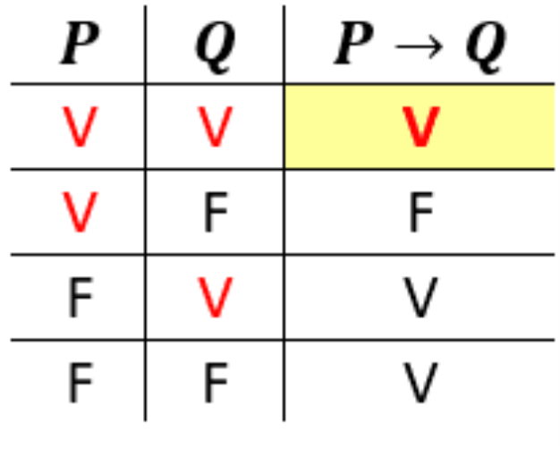

#### O contexto 

Em qualquer área de conhecimento, seja aritmética, mecânica, química, genética etc., somos sempre demandados a provar afirmativas a respeito do nosso objeto de estudo. 

Naturalmente, as técnicas de demonstração, que são universais, são essenciais. Mas é preciso deixar claro qual o contexto em discussão e quais axiomas, definições e eventuais propriedades já são estabelecidas no contexto em estudo! 

Em vários exemplos a seguir, usaremos os números inteiros para praticar o uso da demonstração direta. 

Para isso, vamos supor as seguintes propriedades e definições: 

Fechamento do conjunto dos inteiros com respeito à adição e à multiplicação: 

- Se e são inteiros, então é inteiro. 

- Se e são inteiros, então é inteiro. 

Definição de inteiro par e inteiro ímpar: 

- é um inteiro par se e somente se há um inteiro para o qual (ou seja, a divisão de m por 2 

- deixa resto zero). 

- é um inteiro ímpar se e somente se há um inteiro para o qual (ou seja, a divisão de 

- m por 2 deixa resto 1 . 

Definição de quadrado perfeito 

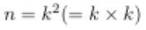

- é um inteiro quadrado perfeito se e somente se há um inteiro , tal que 

Note que definições, por serem proposições ida e volta (ou seja, de mão dupla) são sempre bicondicionais (ida e volta). Veja a reescrita da definição de inteiro par : 

- Se é um inteiro par, então há um inteiro para o qual . Se há um inteiro para o qual , então é um inteiro par. 

#### Exemplo 

Se é um inteiro ímpar, então é um inteiro par. 

#### Demonstração 

Suponha que é um inteiro ímpar. Então, há inteiro, tal que: 

Assim: 

Como é um inteiro, segue-se que é par. 

#### Exemplo 

### Resultado 

Se é um inteiro ímpar, então é ímpar. 

#### Demonstração 

Suponha que é ímpar. Assim, para algum inteiro : 

Logo: 

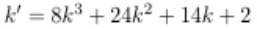

é um inteiro (como ), segue que 1 é ímpar. 

Uma vez que 

##### Dica 

1. Escreva uma demonstração para que outra pessoa possa ler.2. Escreva frases completas, começando com "Demonstração" e terminando com " ".3. Ao introduzir uma nova variável/símbolo, explique o que é o símbolo e a que conjunto a variável pertence. 

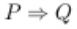

#### Contrapositiva de uma implicação 

Trata-se de uma implicação 

### Exemplo 

Observe a expressão! 

Logo: 

As implicações e são logicamente equivalentes, como mostra a tabela-verdade a seguir. 

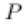

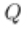

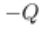

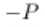

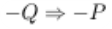

|V V V F F V|
|---|

|V|F|F|V|F|F|
|---|---|---|---|---|---|
|F|V|V|F|V|V|
|F|F|V|V|V|V|

Tabela-verdade. Manuel Ramos de Freitas. 

Uma demonstraçã̃o por contraposição ou contrapositiva de é uma demonstração direta de 

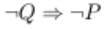

### Exemplo 

### Resultado 

Seja . Se é par, então é ímpar. 

### Demonstração 

Suponha que é par. Em seguida, , para algum inteiro , então: 

Uma vez que é par. 

## Atividade 3 

Questão 1 

Seja . Se é ímpar, entāo é par. 

Nesse contexto, avalie as afirmações a seguir.I. Suponha que é um inteiro. Em seguida faça , para algum .II. Portanto, .III. Uma vez que 

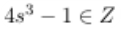

, segue que é um ímpar Inteiro. 

Agora, assinale a alternativa correta. 

A I e III estão corretas. 

B II e III estão corretas. 

C I, II e III estão corretas. 

D I apenas está correta. 

E II apenas está correta. 

A alternativa C está correta. 

Suponha que é um inteiro. Então , para algum . Portanto, . Uma vez que , segue que é um ímpar inteiro. 

## Demonstração por redução ao absurdo 

É uma técnica poderosa que permite provar a veracidade de uma proposição ao mostrar que a negação dessa proposição leva a uma contradição. Exploraremos como essa técnica pode ser aplicada para provar que 0 é o único elemento neutro da adição no conjunto dos números naturais. Ao supor a existência de outro elemento neutro e chegar a uma contradição, a veracidade da proposição original é validada. 

Assista ao vídeo e entenda melhor a técnica de demonstração por redução ao absurdo (ou por contradição). 

##### Conteúdo interativo 

Acesse a versão digital para assistir ao vídeo. 

#### Preliminares 

Se você é curioso dê uma paquerada no método socrático, genial estratégia do mestre grego usada com seus pupilos, nas suas aulas. 

Quando um pupilo enunciava alguma afirmação (proposição) na qual acreditava ser verdadeira, Sócrates, como quem não quer nada, sugeria uma ou mais afirmativas (proposições) com a qual o pupilo concordava, ingenuamente e que, pasme, acarretava exatamente o oposto da proposição do interlocutor. 

E essa era a demolidora estratégia para mostrar a seus pupilos que eventualmente uma proposição na qual acreditavam estava furada! Ou seja, levava o infeliz a concluir que o que era verdadeiro era a negativa do que julgava ser verdadeiro! 

Mas lembre-se de Aristóteles, que foi pupilo de Platão, que, por sua vez, foi discípulo de Sócrates! Aristóteles enunciou, com toda pompa do mundo, o princípio da não contradição: “Uma proposição não pode ser, ao mesmo tempo, verdadeira e falsa!”. 

De certa forma, a técnica da demonstração por contradição (ou pela redução ao absurdo) consiste, basicamente, na estratégia utilizada por Sócrates e no princípio da não contradição. 

Vejamos como funciona essa técnica! 

### A técnica 

Inicialmente, lembre-se que o que chamamos de contradição é nada mais nada menos que uma proposição cuja tabelaverdade resulta em F (falso), independentemente do valor-verdade das proposições que a compõem. Por exemplo, ' e , é uma contradição, pois independente de ser uma proposição 

verdadeira ou falsa, a proposição composta ' e é uma proposição falsa! 

A estratégia para a demonstração por contradição está, então, em assumir que a proposição P - que devemos demonstrar, não é verdadeira, ou seja, é falsa! A partir dessa premissa, perceber que isso acarretaria que alguma proposição é verdadeira e ao mesmo tempo falsa, o que conduziria a uma contradição. 

Dessa forma, concluíriamos que não é verdade que a proposição original é falsa, ou seja, tem que ser verdadeira. 

### Exemplos 

### Exemplo 1 

A soma de um número racional com um número irracional é um número irracional. 

### Demonstração 

Se estamos no contexto dos números racionais, convém ter presente a definição de número racional: 

- Um número é racional se e somente se há inteiros e , tais que . 

- 

1. Vamos admitir que a proposição é falsa, ou seja, que há um racional e um irracional com a soma sendo um número racional. 

2. Se e são racionais, há e inteiros tais que e também existem e , também inteiros, com tais que . 

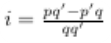

3. Mas ; daí, Logo, , ou seja, 

4. Mas então há e , inteiros, tais que . 

5. Então, de (4), é um número racional, e não irracional! 

6. Logo, obtemos uma contradição, pois de (1) e (5), concluímos que a proposição ' é irracional' é uma proposição verdadeira e uma proposição falsa. 

7. Portanto, a premissa s é irracional. 

### Exemplo 2 

Sejam a > b > c números inteiros positivos que representam as medidas dos lados de um triângulo retângulo, mostre que um dos lados é múltiplo de 3. 

### Demonstração 

No contexto da geometria plana, é bom lembrar do Teorema de Pitágoras: 

- Se e são as medidas dos lados de um triângulo retângulo e a se refere à hipotenusa, então . 

Também é interessante perceber que: 

- se é inteiro e não é múltiplo de 3 , então é da forma ou , para algum inteiro . 

Vamos, então, à demonstração propriamente dita 

- 1    Vamos admitir que a proposição é falsa, ou seja, que a, b e c são inteiros positivos, medidas dos lados de um triângulo retângulo e nenhuma dessas medidas é múltipla de 3.      2    Então, podemos afirmar que: ◦ ◦    Há inteiros e tais que e . 

- 3    Substituindo a, b e c no teorema de Pitágoras, obtemos, sucessivamente: 

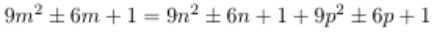

- ◦ 

- 4    Fazendo , de 

- (3) obtemos 5    Mas, se , então não é inteiro.      6    De (4) e (5), obtivemos uma contradição ( é inteiro e não é inteiro). 

Logo, não é verdade que nenhuma das medidas seja múltipla de 3. Isto é, alguma medida (a ou b ou c) é múltipla de 3. 

## Atividade 4 

Questão 1 

Muitas vezes, a demonstração de uma proposição do tipo não possui uma abordagem simples. Entretanto, há proposições logicamente equivalentes (mesma tabela-verdade) cuja demonstração pode ser mais facilmente abordada. 

Dadas as proposições: 

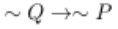

I. 

II. ou III. ou 

Entre essas três proposições, quais são equivalentes à proposição ? 

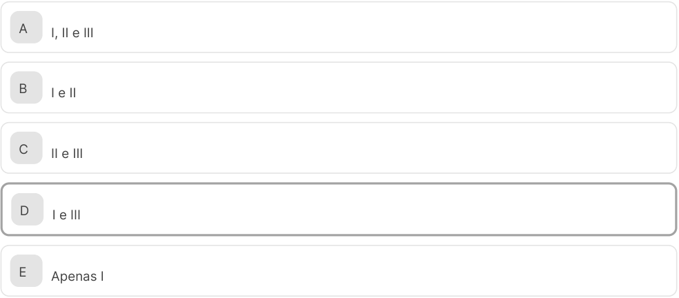

<!-- Start of picture text -->
A I, II e III B I e II C II e III D I e III E Apenas I <!-- End of picture text -->

A alternativa D está correta. 

Basta analisar as tabelas-verdade das proposições envolvidas: 

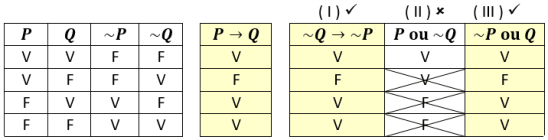

2. Técnicas de quantificadores 

## Quantificador universal 

Representado pelo símbolo , o quantificador universal é fundamental para expressar que uma proposição é verdadeira para todos os elementos de um domínio específico. 

Neste vídeo, exploraremos o uso do quantificador universal em sentenças abertas e como ele pode ser usado para criar declarações quantificadas. Assista e aprofunde seu entendimento sobre esse importante conceito! 

##### Conteúdo interativo 

Acesse a versão digital para assistir ao vídeo. 

Há um símbolo na lógica de predicados que é usado para representar a expressão "para todos", "para cada", ou "para qualquer um". 

Esse símbolo é , que parece um A maiúsculo de cabeça para baixo. Ele é chamado de quantificador universal, pois indica que algo é universalmente verdadeiro sobre uma variável. A variável à qual o quantificador se aplica é escrita logo após o símbolo. 

Mencionamos que, se for uma sentença aberta sobre um domínio , então é uma declaração para cada . Vamos ilustrar! 

Exemplo 

Considere S = {1, 2, ..., 7}. Então: é primo. 

é uma declaração para cada . 

Portanto, são declarações verdadeiras as seguintes: 

P(1): 3 é primoP(2): 7 é primoP(3): 11 é primoP(4): 19 é primo 

Enquanto são declarações falsas as declarações a seguir. 

P(5): 27 é primoP(6): 39 é primoP(7): 51 é primo 

Há outra maneira de uma sentença aberta ser convertida em uma declaração, por exemplo, pela quantificação. Considere P(x) uma frase aberta sobre um domínio S. 

Adicionar a frase "para cada " à frase produz a chamada declaração quantificada. 

A frase "para cada" é referida como o quantificador universal e é denotada pelo símbolo . Outras formas de expressar o quantificador universal são "para cada um" e "para todos". Essa afirmação quantificada é expressa em símbolos por: 

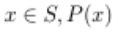

. (3.2) 

Em palavras, ela é expressa por: para cada 

A instrução quantificada (3.1) (ou (3.2)) é verdadeira se for verdadeira para cada ; enquanto ela é falsa se for falsa para pelo menos um elemento . 

## Atividade 1 

Questão 1 

Qual das opções a seguir representa corretamente o uso do quantificador universal? 

A Existe um número natural que é par. B Todos os pássaros têm asas. C Alguns alunos não compareceram à aula. D Há uma solução para cada equação. E Nenhum estudante faltou à prova. 

##### A alternativa B está correta. 

O quantificador universal, representado pelo símbolo ∀, afirma que uma propriedade se aplica a todos os elementos de um determinado conjunto. No caso da opção B, a afirmação é que a propriedade de "ter asas" se aplica a todos os membros do conjunto "pássaros". As demais opções utilizam quantificadores existenciais ou não afirmam uma universalidade. 

## Quantificador existencial 

Os quantificadores universal e existencial nos permitem expressar proposições sobre todos ou alguns elementos de um domínio específico. Exploraremos como usar o quantificador existencial para transformar sentenças abertas em declarações quantificadas e verificar sua veracidade. 

Para entender melhor, assista ao vídeo! 

##### Conteúdo interativo 

Acesse a versão digital para assistir ao vídeo. 

Outra maneira de converter uma frase aberta P(x) sobre um domínio S em uma declaração por meio da quantificação é pela introdução de um quantificador chamado quantificador existencial. 

Cada uma das frases "existe", "para alguns" e "para pelo menos uma" é referida como um quantificador existencial e é denotada pelo símbolo . 

A declaração quantificada é a seguinte: 

Ela pode ser expressa em palavras por: existe tal que . (3.4) 

A instrução quantificada (3.3) (ou (3.4)) é verdadeira se for verdadeira para pelo menos um elemento ; enquanto ela é falsa se for falsa para todo . 

Agora, vamos considerar duas declarações quantificadas construídas a partir da sentença aberta vista no exemplo anterior. 

#### Exemplo 

Para a sentença em aberto, temos: 

A instrução quantificada é a seguinte: 

Ou seja, para cada é primo, sendo uma declaração falsa, uma vez que, por exemplo, é também falso. 

No entanto, a declaração quantificada a seguir é verdadeira. 

ou seja, existe tal que é primo é verdadeira já que é verdadeiro, por exemplo. 

A declaração quantificada também pode ser expressa como: se , então . 

#### Exemplo 

Considere a frase em aberto sobre o conjunto de números reais. 

Então: 

Ou, equivalentemente, temos: 

Em palavras, pode ser expressa da seguinte forma: como para cada número real , ou seja, se é um número real, então , ou ainda "o quadrado de cada número real é não negativo". 

Em geral, o quantificador universal é usado para alegar que a declaração resultante de uma determinada sentença aberta é verdadeira para cada valor do domínio da variável atribuído à variável. Consequentemente, a declaração é verdadeira, já que é verdadeira para cada número real . 

Suponha agora que devemos considerar a frase aberta . A declaração , (para cada número real , temos ) é falsa, já que, por exemplo, é falso. Claro, isso significa que sua negação é verdadeira. Se não fosse o caso de que, para cada número real , temos , então deveria existir algum número real , tal que . 

A negação existe um número real x tal que x² > 0 pode ser escrito em símbolos como: 

Ou: 

Geralmente, se estamos considerando uma frase aberta sobre um domínio , então: 

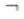

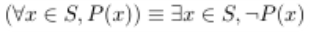

#### Exemplo 

A seguinte declaração contém o quantificador existencial. 

Existe um número real tal que . (3.5). Se deixarmos , então (3.5) pode ser reescrito como . 

A declaração (3.5) é verdadeira, uma vez que é verdadeiro quando (ou quando . 

Daí, a negação de (3.5) é: 

Para cada número real . 

Portanto, a declaração (3.6) é falsa. 

## Atividade 2 

###### Questão 1 

Considere a declaração quantificada: existe um número real x tal que x² = 3. Qual das alternativas explica a veracidade dessa declaração? 

A A declaração é verdadeira porque é um número real que satisfaz . 

B A declaração é verdadeira porque é um número real que satisfaz . 

- C A declaração é falsa porque não existe nenhum número real que satisfaça . 

D A declaração é falsa porque é um número real que satisfaz . 

- E A declaração é verdadeira porque é um número real que satisfaz . 

A alternativa B está correta. 

A declaração quantificada "Existe um número real tal que " é verdadeira porque (ou 

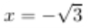

) é um número real que satisfaz a condição . Portanto, a proposição é verdadeira, 

demonstrando o uso correto do quantificador existencial 

3. Princípio da indução 

## Princípio da indução 

É um princípio muito eficaz para provar proposições sobre conjuntos numéricos. Vamos explorar esse princípio e suas aplicações, ajudando você a entender como ele pode ser usado para validar teoremas de forma rigorosa. 

Assista ao vídeo sobre o princípio da indução e acompanhe alguns exemplos que ilustram essa técnica. 

##### Conteúdo interativo 

Acesse a versão digital para assistir ao vídeo. 

Considere um conjunto de números reais. 

Um número é chamado de elemento mínimo (ou menor) de se para cada . 

Atenção: alguns conjuntos não vazios de números reais têm um elemento menor, outros não. 

O conjunto tem um menor elemento, ou seja, 1, enquanto não tem menor elemento. O intervalo fechado tem o mínimo elemento 2, mas o intervalo aberto não tem elemento mínimo. o conjunto 

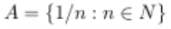

também não tem menor elemento. 

##### Comentário 

Se um conjunto não vazio de números reais tem um elemento menor, então esse elemento é necessariamente único. Lembre-se: ao tentar demonstrar que um elemento possuidor de determinada propriedade é único, é costume assumir que há dois elementos com essa propriedade. Vamos demonstrar que esses elementos são iguais, implicando que há exatamente um desses elementos. 

#### Teorema 4.1 

Se um conjunto de números reais tem um elemento menor, então tem um elemento menor que é único. 

### Demonstração 

Considere e os menores elementos de . Uma vez que é um elemento menor, . Além disso, desde que é um elemento menor, . Portanto, . 

Atenção: a demonstração que demos do Teorema 4.1 é uma demonstração direta. 

Há uma propriedade de grande interesse para conjuntos numéricos, em geral. Vejamos! 

Um conjunto não vazio de números reais é bem ordenado se cada subconjunto de tem um elemento menor. Seja , os subconjuntos não vazios de são 

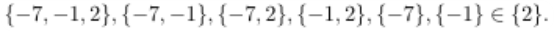

##### Comentário 

Embora pareça evidente que o conjunto de inteiros positivos é bem ordenado, essa afirmação não pode ser demonstrada a partir das propriedades de inteiros positivos que usamos intuitivamente. Consequentemente, essa afirmação é aceita como um axioma adicional, como indicado a seguir. 

### Axioma: princípio da boa ordenação 

O conjunto de inteiros positivos é bem ordenado. 

Uma consequência do princípio da boa ordenação é outro princípio, que serve como base para outra e importante técnica de demonstração. 

#### Teorema 4.2 - princípio da indução matemática 

Para cada inteiro positivo , seja ser uma declaração. Se (1) (1) é verdadeiro e (2) a implicação 

Se , então é verdade para cada inteiro positivo , então é verdadeiro para cada inteiro positivo . 

### Demonstração 

Suponha, pelo contrário, que o teorema é falso. Em seguida, as condições (1) e (2) são satisfeitas, mas existem alguns inteiros positivos para os quais é uma afırmação falsa. Observe! 

Uma vez que é um subconjunto não vazio de , ele segue pelo princípio de boa ordenação, e entende-se que contém um elemento mínimo . 

Uma vez que é verdadeiro, . Assim, e . 

Portanto, e assim é uma declaração verdadeira. 

Por condição (2), (2) também é verdadeiro e assim . Isso, no entanto, contradiz nossa suposição de que . 

## Atividade 1 

###### Questão 1 

A divisibilidade entre números inteiros é um conceito estudado há mais de 2.000 anos e tem aplicações modernas como a criptografia, que permite codificar informações a fim de transmiti-la com segurança. 

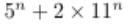

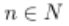

Coloque em ordem a demonstração de que 3 divide 

, para todo 

I. De fato, para , temos que 3 divide . Suponha, agora, que, para algum , saibamos que 3 divide . Logo, existe um número inteiro a tal que . 

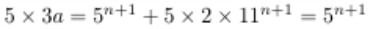

II. Multiplicando por 5 ambos os lados da igualdade acima, temos 

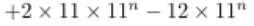

III. Daí, segue a igualdade , em que o segundo membro é divisível por 3 por ser igual a . 

IV. Assim, demonstramos que 3 divide , o que acarreta que 3 divide , para todo número natural . 

A I, II, III, IV 

B II, I, IV, III 

C III, II, I, IV 

D IV, III, II, I 

E I, III, II, IV 

A alternativa A está correta. 

De fato, para , temos que 3 divide . Suponha agora, que, para algum , saibamos que 3 divide . Logo, existe um número inteiro tal que . 

Multiplicando por 5 ambos os lados da igualdade acima, temos 

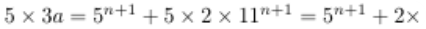

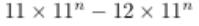

Daí, segue a igualdade , em que o segundo membro é divisível por 3 por ser igual a . 

Assim, demonstramos que 3 divide , acarretando que 3 divide , para todo número natural . 

## Princípio da indução matemática 

É uma técnica significativa usada para provar proposições sobre números inteiros, garantindo que uma propriedade se mantenha verdadeira para todos os elementos de um domínio. Vamos explorar o princípio da indução matemática, ilustrando com exemplos práticos como ele pode ser utilizado para demonstrar teoremas. 

Assista ao vídeo e aprofunde seu conhecimento sobre esse importante método! 

##### Conteúdo interativo 

Acesse a versão digital para assistir ao vídeo. 

Para cada inteiro positivo , seja uma declaração. Se (1) é verdadeiro e (2) , é verdade, então também é verdade. 

Como consequência do princípio da indução matemática, a declaração quantificada pode ser demonstrada como verdade se (1) mostrarmos que a declaração (1) é verdadeira e (2) estabelecermos a verdade da implicação se , então para cada inteiro positivo . 

Uma demonstração usando o princípio da indução matemática é chamada de demonstração de indução ou de demonstração por indução. A verificação da validade de em uma demonstração de indução é chama-se etapa-base ou âncora da indução. Na implicação Se P(k), então P(k + 1) para um inteiro positivo arbitrário k, a instrução P(k) é chamada de hipótese indutiva (ou indução). Muitas vezes usamos uma demonstração direta para verificar embora qualquer técnica de demonstração seja aceitável.Veja! 

Ou seja, normalmente assumimos que a hipótese indutiva é verdadeira para um inteiro positivo 

arbitrário e para tentar mostrar que é verdade. Estabelecer a validade de (4.1) é chamado de passo indutivo na demonstração por indução. 

Ilustramos essa técnica de demonstração mostrando que a soma dos primeiros inteiros positivos é dada pela expressão para qualquer inteiro positivo , ou seja, . 

#### Resultado 4.3 

Faça o seguinte: 

Em que . Então, é verdadeiro para cada inteiro positivo . 

Demonstração:Empregamos indução. Faça , logo a declaração é verdadeira. 

Assuma que é verdadeira para um inteiro positivo arbitrário , ou seja, que: 

Mostramos que P(k + 1) é verdadeira, ou seja, mostramos o seguinte: 

Como desejado, temos: 

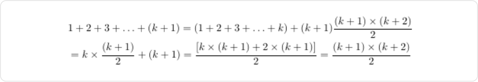

Pelo princípio da indução matemática, é verdadeiro para cada inteiro positivo . 

### Análise da demonstração 

Na demonstração do resultado 4.3, começamos afirmando que a indução foi usada. Isso alerta o leitor sobre o que esperar na demonstração. 

Além disso, na demonstração do passo indutivo, presume-se que, para um inteiro positivo , isto é, para um 

inteiro positivo arbitrário , . 

Observação: não assumimos que para cada inteiro positivo , assumindo o 

que estamos tentando demonstrar no resultado 4.3. 

#### Resultado 4.4 

Para cada inteiro positivo . 

Demonstração: 

Vamos proceder por indução! 

Fazendo , obtemos , que é uma afirmação claramente verdadeira. Vamos assumir que, para algum inteiro positivo, temos: 

Devemos mostrar que P(k + 1) é também verdadeiro. Como desejado, temos o seguinte: 

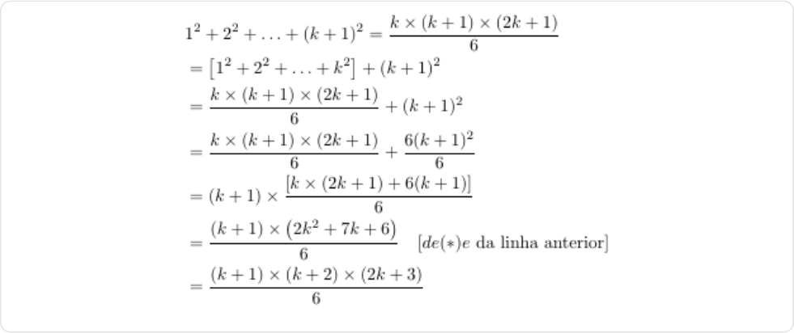

Pelo princípio da indução matemática, para qualquer inteiro positivo 

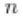

Estritamente falando, a última frase na demonstração do resultado 4.4 é típica da última sentença de cada demonstração, usando indução matemática, em que a ideia é mostrar que a hipótese do princípio da indução matemática está satisfeita e assim a conclusão segue. Alguns, portanto, omitem essa frase final, uma vez que se entende que as propriedades (1) e (2) do teorema 4.2 estão satisfeitas, tem-se uma demonstração. 

## Atividade 2 

###### Questão 1 

Lilian Nasser, em um trecho do seu livro Argumentação e provas, declara que, na maioria das escolas brasileiras, os adolescentes não são incentivados a pensar e a comunicar suas próprias ideias, o que já fora observado não só no Brasil, mas em diversos países, e a investigação sobre "argumentação e provas no ensino de matemática" vem recebendo um impulso cada vez maior entre os pesquisadores e educadores. 

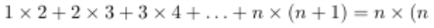

Considerando a demonstração da declaração 

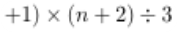

para cada positivo inteiros . 

I. Demonstraremos por indução que Sn : 

é verdade para todos os números naturais . A declaração é verdadeira. 

II. Assuma que: 

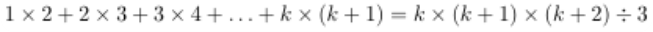

Sk: 

é verdadeira e prove que: 

é verdadeiro. 

III. Observe que: 

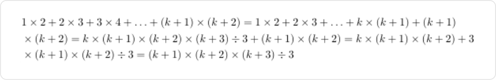

IV. Assim, pelo princípio da indução matemática, Sn é verdadeiro para todos os números naturais 

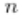

É correto o que afirmamos em: 

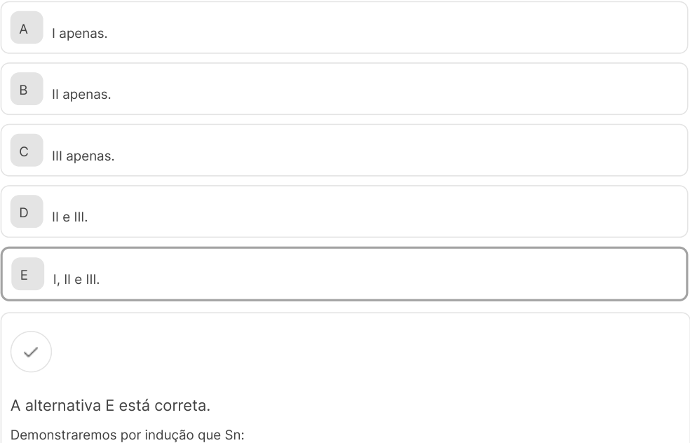

<!-- Start of picture text -->
A I apenas. B II apenas. C III apenas. D II e III. E I, II e III. A alternativa E está correta. Demonstraremos por indução que Sn: <!-- End of picture text -->

é verdade para todos os números naturais . 

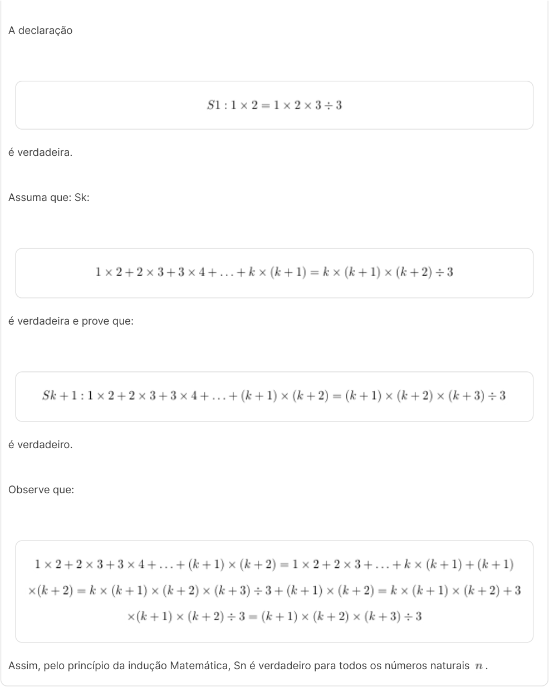

<!-- Start of picture text -->
A declaração é verdadeira. Assuma que: Sk: é verdadeira e prove que: é verdadeiro. Observe que: Assim, pelo princípio da indução Matemática, Sn é verdadeiro para todos os números naturais  . <!-- End of picture text -->

## Princípio da indução forte 

É uma ferramenta poderosa que nos permite provar proposições complexas ao considerar múltiplos casos simultaneamente. Vamos explorar esse princípio e ver como ele pode ser utilizado para demonstrar teoremas e resolver problemas. 

Amplie seu entendimento sobre esse importante método com o vídeo a seguir. 

##### Conteúdo interativo 

Acesse a versão digital para assistir ao vídeo. 

Há uma outra forma de indução matemática. Esse princípio atende por muitos nomes: princípio da indução forte, forte princípio da indução matemática; forma forte de indução; forma suplente de indução matemática e segundo princípio da indução matemática. 

#### Teorema 4.5 - princípio forte da indução matemática 

Em cada inteiro positivo , temos: seja uma declaração. Se é verdadeira e a implicação: Se para cada inteiro com , então é verdadeira para cada inteiro positivo , então 

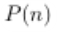

é verdadeiro para cada inteiro positivo . 

Como o princípio da indução matemática (teorema 4.2), o princípio forte da indução matemática também é uma consequência do princípio de boa ordenação. 

O Princípio Forte da Indução Matemática é agora declarado mais simbolicamente a seguir: 

Para cada inteiro positivo , seja uma declaração, se (1) é verdadeiro e (2) 

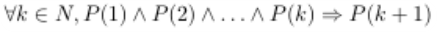

é verdade, então é também verdade. 

A diferença nas declarações do princípio da indução matemática e do princípio forte da indução matemática está na etapa indutiva (condição 2). 

Para demonstrar que é verdade pelo princípio da indução matemática, é necessário mostrar que é verdadeiro e verificar a seguinte implicação: 

É verdade para cada inteiro positivo . Por outro lado, para demonstrar que é verdade pelo princípio forte da indução matemática, somos obrigados a mostrar que é verdadeiro. Verifique a implicação! 

É verdadeiro para cada inteiro positivo 

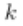

Se fôssemos apresentar demonstrações diretas das implicações (4.2) e (4.3), então seria permitido assumir mais na etapa indutiva (4.3) do princípio forte da indução matemática do que na etapa de indução (4.2) do princípio de indução matemática e ainda obter a mesma conclusão. 

Se a suposição de que é verdadeiro, é insuficiente para verificar a verdade de para um inteiro positivo arbitrário , mas a suposição de que todas as declarações , para verificar a verdade de é suficiente, então isso sugere que devemos usar o princípio forte de indução matemática. 

Qualquer resultado que possa ser demonstrado pelo princípio da indução matemática também pode ser demonstrado pelo princípio forte da indução matemática. 

Assim como há uma versão mais geral do princípio da indução matemática (ou seja, teorema 4.2), há também uma versão mais geral do princípio forte. Também nos referiremos a isso como o Forte Princípio da Indução Matemática. 

#### Teorema 4.6 - forte princípio da indução matemática 

Para um inteiro fixo , seja . Para cada , que seja uma declaração. Se (1) é verdadeiro e (2), temos a implicação: 

Se para cada inteiro com , então é verdadeiro para cada inteiro , então 

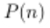

é verdadeiro para cada inteiro . 

Agora consideremos uma classe de declarações matemáticas, em que o princípio forte de indução matemática é comumente a técnica de demonstração apropriada. 

Suponha que estamos considerando uma sequência de números, também expressa como . Uma maneira de definir uma sequência é especificar explicitamente o primeiro termo (em função de ). Por exemplo, podemos ter um: 

Uma sequência também pode ser definida recursivamente. Em uma sequência recursivamente definida , apenas o primeiro termo ou talvez os primeiros termos são definidos especificamente, dizer para alguns fixo . Esses são chamados de valores iniciais. 

Em seguida, é expresso em termos de e, mais geralmente, para é expresso em termos de . Isso é chamado de relação de recorrência. 

Um exemplo específico disso é a sequência {an} definida por: 

Nesse caso, existem dois valores iniciais, ou seja, e . 

A relação de recorrência aqui é para . Fazendo , descobrimos que . Ao fazer , temos . Da mesma forma, e . 

A partir dessas informações, temos como palpite que para cada . 

Usando o forte princípio da indução, podemos, de fato, demonstrar que essa conjectura é verdadeira! 

Resultado 4.7 

Uma sequência é definida recursivamente por: 

Em seguida, 

### Demonstração 

Nós procedemos por indução. 

Desde , a fórmula mantém para . 

Assuma por um inteiro positivo arbitrário que para todos os inteiros i com 1 ≤ i ≤ k. 

Mostramos que . Se , então . Desde , segue-se que quando . 

Portanto, podemos assumir que . 

Desde , segue-se que 

que é o resultado desejado. 

Pelo Princípio Forte da Indução Matemática, 

### Análise da Indução 

Alguns comentários sobre a demonstração do Resultado 4.7 estão em ordem. Em um ponto, nós assumimos para um inteiro positivo arbitrário que para todos os inteiros com . Nosso objetivo era mostrar que . 

Uma vez que é um inteiro positivo, pode ocorrer que ou . Se , então precisamos mostrar que . Que é conhecido porque esse é um dos valores iniciais. 

Se , então e pode ser expresso como pela relação de recorrência. Para mostrar que quando , era necessário saber que e que . 

Porque estávamos usando o Princípio Forte da Indução Matemática, sabíamos ambas as informações. Se tivéssemos usado o Princípio da Indução Matemática, então teríamos assumido (e, portanto, sabíamos) que , mas não teríamos sabido que , e assim teríamos sido incapazes de estabelecer a desejada expressão para . 

## Atividade 3 

###### Questão 1 

O princípio forte da indução matemática é uma variação do princípio da indução matemática. Considere as seguintes afirmações sobre o princípio forte da indução matemática. 

I. É necessário provar que a base da indução é verdadeira. 

II. É necessário provar que a declaração é verdadeira para todos os casos anteriores até o caso considerado. 

III. É necessário provar que a declaração é verdadeira para o próximo caso apenas. 

Qual das seguintes alternativas descreve corretamente o princípio forte da indução matemática? 

|A|Apenas a afirmação I é verdadeira.|
|---|---|
|B|Apenas a afirmação II é verdadeira.|
|C|Apenas as afirmações I e II são verdadeiras.|
|D|Apenas as afirmações I e III são verdadeiras.|
|E|As afirmações II e III são verdadeiras.|

##### A alternativa C está correta. 

O princípio forte da indução matemática requer que a base da indução seja verdadeira (afirmação I) e que a declaração seja verdadeira para todos os casos anteriores até o caso considerado (afirmação II). A afirmação III está incorreta porque, no princípio forte da indução matemática, não é suficiente provar a declaração para apenas o próximo caso. É necessário considerar todos os casos anteriores até o caso considerado. Portanto, as afirmações I e II são verdadeiras. 

4. Conclusão 

## Considerações finais 

- Método trivial de demonstração: explicação do método trivial, no qual a verdade da proposição é evidente. 

- Demonstração por contradição: técnica de prova na qual se assume a negação da proposição e chegase a uma contradição. 

- 

- Redução ao absurdo: similar à contradição, esse método mostra que a negação da proposição leva a um resultado absurdo. 

- Princípio da indução matemática: método de prova usado para proposições envolvendo números inteiros, consistindo na base e no passo indutivo. 

- 

- Princípio forte da indução matemática: uma variação da indução matemática, na qual se assume a verdade para todos os casos anteriores até o caso considerado. 

- Aplicações na engenharia: como os métodos de demonstração são usados para resolver problemas e desenvolver novas tecnologias em engenharia. 

- Aplicações na ciência da computação: o uso de demonstrações para validar algoritmos e garantir a correção de programas. 

- Importância do raciocínio lógico: como o raciocínio lógico é fundamental para diversas profissões, desde cientistas a advogados. 

- 

- Exemplos práticos: ilustração de cada método de demonstração com exemplos práticos, ajudando na compreensão dos conceitos. 

- Treinamento em lógica e demonstração: a importância de treinar alunos em lógica e métodos de demonstração para prepará-los para desafios profissionais. 

##### Podcast 

Acompanhe neste bate-papo a importância do estudo de técnicas de demonstração para as ciências exatas. 

##### Conteúdo interativo 

Acesse a versão digital para ouvir o áudio. 

###### Explore + 

O logicismo, o formalismo, o intuicionismo e os diferentes modos de pensar a lógica matemática tiveram como pano de fundo o método de demonstração matemática como objeto central. Que tal explorar essas discussões e buscar seu posicionamento diante delas? 

Pesquise o trabalho da filósofa portuguesa Olga Pombo sobre a lógica e o logicismo em seminários na Universidade de Lisboa. 

Busque também como Pedro Antonio Dourado de Rezende aborda o logicismo, o formalismo e o intuicionismo em sua palestra: A crise nos fundamentos da matemática e a teoria da computação. 

Se você se interessa em conhecer mais sobre o uso da indução matemática no projeto e na análise de algoritmos, há vários materiais instrucionais disponíveis sobre o projeto de algoritmos e a indução matemática. Faça uma busca! 

Referências 

ALENCAR FILHO, E. Iniciação à lógica matemática. 16. ed. São Paulo: Editora Nobel, 1999. 

CHANG, C. et al. Symbolic logic and mechanical theorem proving. Cambridge: Academic Press, 1973. 

ENDERTON, H. A Mathematical introduction to logic. 2. ed. Cambridge: Academic Press, 2001. 

GERSTING, J. L. Fundamentos matemáticos para a ciência da computação. 4. ed. São Paulo: LTC, 2001. 

SOARES, F. S. C. S. et al. Lógica para computação. 2. ed. São Paulo: Cengage Learning, 2017. 

SOUZA, J. N. Lógica para ciência da computação. 3. ed. São Paulo: GEN LTC, 2014. 

