# Praticando 

Matemática e Lógica 

1. Itens iniciais 

#### Apresentação 

Praticar é fundamental para o seu aprendizado. Sentir-se desafiado, lidar com a frustração e aplicar conceitos são essenciais para fixar conhecimentos. No ambiente Praticando, você terá a oportunidade de enfrentar desafios específicos e estudos de caso, criados para ampliar suas competências e para a aplicação prática dos conhecimentos adquiridos. 

#### Objetivo 

Ampliar competências e consolidar conhecimentos através de desafios específicos e estudos de caso práticos. 

1. Estudo de Caso 

## Decisão na Análise de Gráficos Epidemiológicos 

###### Caso Prático 

Durante a pandemia global de 2020 causada pelo vírus SARS-CoV-2, as políticas públicas de saúde foram constantemente ajustadas com base nos gráficos de projeção epidemiológica. Um desses gráficos, elaborado pelo epidemiologista Neil Ferguson, do Imperial College, indicava os requisitos de leitos de Unidade de Terapia Intensiva (UTI) por 100 mil habitantes em diferentes cenários. As projeções mostravam picos de necessidade em períodos específicos, pressionando o sistema de saúde a tomar decisões sobre o redirecionamento de recursos e a implementação de lockdowns em momentos críticos. Entretanto, houve discordância entre as autoridades sobre a interpretação dos dados e a necessidade de intervenções mais rigorosas, especialmente quando os picos projetados variavam entre cenários otimistas e pessimistas. 

Diante das informações apresentadas, analise criticamente como a interpretação dos gráficos de projeção pode influenciar as decisões políticas em tempos de crise sanitária. Considere as consequências de uma interpretação inadequada e sugira como essas decisões poderiam ser mais bem fundamentadas. 

##### Chave de resposta 

Uma possível solução para o problema de decisão baseado em gráficos epidemiológicos envolve a análise cuidadosa dos diferentes cenários projetados, compreendendo tanto as limitações quanto a precisão dos dados. A interpretação inadequada, seja por otimismo excessivo ou por um pessimismo infundado, pode levar a decisões que comprometam tanto a saúde pública quanto a economia. Para mitigar esses riscos, é essencial combinar a análise gráfica com outras formas de modelagem matemática, dados empíricos atualizados e uma consulta constante com especialistas de diversas áreas. Assim, as decisões políticas podem ser fundamentadas não apenas nas projeções, mas também em uma visão holística que considera os impactos a curto e longo prazo das ações implementadas. 

Para saber mais sobre esse conteúdo, acesse o 

Tema: Gráficos e Interpretações Gráficas . 

2. Desafios 

## Teoria dos Conjuntos E Princípios de Contagem 

###### Desafio 1 

Imagine que você é o gerente de uma sorveteria que oferece o “Triplo Especial”, onde cada cliente pode escolher três porções de sorvete para compor a sua taça. Como gerente, você precisa calcular quantas combinações diferentes de triplos especiais os clientes podem formar, sabendo que a sorveteria oferece oito sabores de sorvete. Esse cálculo é essencial para organizar o estoque de sabores mais populares e garantir a variedade que atrai os clientes. Quantas combinações diferentes de triplos especiais podem ser formadas com esses oito sabores disponíveis? 

A C38. 

B A38. 

C C810. 

D 

PR310. 

E 

AR310. 

##### A alternativa A está correta. 

A) C38: Correta. Essa alternativa está correta porque representa a combinação de 8 sabores disponíveis, escolhendo 3 porções, sem considerar a ordem das escolhas. Em problemas de combinação, a ordem dos elementos não importa, o que diferencia combinações de arranjos. O cálculo seria dado por , onde n é o número total de elementos (8 sabores) e k é o número de elementos escolhidos (3 porções). Neste caso, a combinação correta é . 

B) A38: Incorreta. Essa alternativa representa um arranjo, onde a ordem das escolhas importa, o que não é o caso aqui. A questão pede a combinação, não o arranjo. 

C) C810: Incorreta. Esta alternativa é incorreta porque representa uma combinação com mais sabores do que os disponíveis. Não faz sentido considerar 810 sabores quando o problema estabelece que há apenas 8. 

D) PR310: Incorreta. Essa alternativa se refere a uma permutação com repetição, o que não se aplica, pois cada sabor pode ser escolhido apenas uma vez na combinação. 

E) AR310: Incorreta. Como mencionado na alternativa anterior, esta refere-se a um arranjo com repetição, o que não é aplicável no contexto da questão. 

Para saber mais sobre esse conteúdo, acesse o módulo 3 

Agrupamentos Combinatórios 

"Esse tipo de situação nos remete ao terceiro agrupamento básico, utilizado em contagem, e que chamamos de combinação de n objetos tomados p a p, ou n escolhe p, em que não importa a ordem dos objetos, mas apenas o subconjunto formado por eles. Então, no caso geral, devemos dividir o número de filas por p! para contarmos uma única vez cada uma das p! filas que compõem o mesmo conjunto. Representando o número de combinações de n, p a p por Cn p." 

Desafio 2 

Você está trabalhando como analista de sistemas em uma empresa de tecnologia que desenvolve softwares de segurança para bancos. Sua tarefa é criar senhas seguras utilizando números de 4 dígitos distintos, escolhidos a partir dos algarismos de 1 a 9. No entanto, para aumentar a segurança, cada senha deve necessariamente conter pelo menos um dígito 2 e um dígito 5. Sua tarefa é calcular o número total de senhas possíveis que atendem a esses critérios, para garantir que o sistema seja à prova de fraudes. 

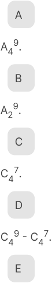

<!-- Start of picture text -->
A A49. B A29. C C47. D C49 - C47. E <!-- End of picture text -->

A49 - A47. 

##### A alternativa E está correta. 

A) A49: Incorreta. Esta alternativa trata de um arranjo, onde a ordem importa, mas sem considerar as restrições de inclusão obrigatória dos dígitos 2 e 5. Não atende ao critério essencial da questão. 

B) A29: Incorreta. Esta alternativa está errada pois considera um arranjo com dois dígitos, mas a questão pede quatro dígitos distintos e a inclusão dos dígitos 2 e 5. 

C) C47: Incorreta. Esta alternativa considera uma combinação sem atender à exigência de inclusão dos 

dígitos 2 e 5. Além disso, trata de uma combinação com sete dígitos, enquanto a pergunta é específica para quatro. 

D) C49 - C47: Incorreta.  Embora esta alternativa use a subtração entre combinações, o cálculo não atende ao problema porque não garante que 2 e 5 sejam necessariamente incluídos. 

E) A49 - A47: Correta. Esta é a alternativa correta porque representa o cálculo apropriado para encontrar o número de senhas possíveis que incluem, obrigatoriamente, os dígitos 2 e 5. A combinação total de 4 dígitos distintos (A49) subtrai as combinações que não atendem ao critério (A47), resultando na quantidade correta de combinações válidas. 

Para saber mais sobre esse conteúdo, acesse o módulo 2 

###### Princípio da Multiplicação 

"Esse tipo de situação, em que dispomos de n objetos e queremos criar filas (ordenações) usando apenas p dos n objetos disponíveis, é um dos agrupamentos usuais da análise combinatória: São os chamados arranjos de n objetos tomados p a p que, usualmente, representamos por An pou An,p." 

###### Desafio 3 

Você trabalha como consultor de logística em uma empresa que presta serviços de manutenção e limpeza para grandes embarcações. A empresa divide seus prestadores em dois grupos: o Grupo 1, composto por seis empresas que fazem limpeza interna, e o Grupo 2, com cinco empresas especializadas em manutenção elétrica. Sua tarefa é selecionar três empresas do Grupo 1 e duas do Grupo 2 para realizar os serviços em uma embarcação específica. Quantas combinações diferentes de contratação podem ser feitas com as opções disponíveis? 

A 

###### 200. 

B 150. C 400. D 1200. E 

###### 2400. 

##### A alternativa A está correta. 

A) 200: Correta. Esta alternativa está correta porque o número de combinações diferentes de contratação das empresas pode ser calculado utilizando o conceito de combinação simples. Para o Grupo 1, a combinação de 3 empresas entre 6 é dada por . Para o Grupo 2, a combinação de 2 empresas entre 5 é dada por . O número total de combinações possíveis é, então, 20×10=200. B) 150: Incorreta. Esta alternativa está errada porque subestima o número de combinações possíveis. A lógica de cálculo, como descrito, deve considerar a combinação de três empresas no primeiro grupo e duas no segundo grupo, o que resulta em mais do que 150 combinações. C) 400: Incorreta. Embora esta alternativa dobre o número correto de combinações, não leva em conta a multiplicação correta entre os grupos. O erro ocorre ao não aplicar corretamente o princípio de multiplicação entre as combinações dos dois grupos. D) 1200: Incorreta. Este número considera combinações com muito mais empresas do que o necessário, provavelmente confundindo o cálculo com um problema de permutação ou de arranjos onde a ordem importa, o que não é o caso. E) 2400: Incorreta. Esta alternativa apresenta um número muito elevado de combinações, sugerindo um erro conceitual na forma de cálculo, possivelmente confundindo o problema com um arranjo com repetição, que não se aplica. 

Para saber mais sobre esse conteúdo, acesse o módulo 3 

###### Agrupamentos Combinatórios 

“Destacamos a família dos arranjos, das permutações e das combinações. Quando a ordem dos objetos no agrupamento não importa, como na questão apresentada, a combinação é a técnica apropriada. Neste 

caso, as combinações dos grupos de empresas são independentes e devem ser multiplicadas para encontrar o número total de possibilidades.” 

## Gráficos e Interpretações Gráficas 

###### Desafio 1 

Você está atuando como um analista de dados em uma empresa que precisa avaliar um conjunto específico de dados para um relatório importante. Imagine que você recebeu dois conjuntos: X, que contém os valores 0 e 2, e Y, que contém os valores de 1 a 2. Sua tarefa é combinar esses conjuntos de maneira a formar um novo conjunto que inclua todos os possíveis resultados da soma de um elemento de X com um elemento de Y. Esse conjunto final será a base para uma análise detalhada que será apresentada à gerência. Qual será o conjunto resultante da operação e 

A 

[1, 2]. 

B 

[1,4]. 

C 

. D 

. E 

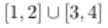

##### A alternativa E está correta. 

A) [1,2]: Incorreta. Essa alternativa apresenta apenas os valores do conjunto Y sem considerar a soma com os elementos de X. Ao somar os valores de X e Y, obtemos elementos adicionais que não estão presentes nesta alternativa. 

B) [1,4]: Incorreta. Essa alternativa não contempla todos os resultados possíveis da soma dos elementos dos conjuntos X e Y. Ela sugere que o intervalo se estende até 4, mas não inclui os valores intermediários resultantes da combinação dos elementos dos dois conjuntos. 

C) : Incorreta. Aqui, há uma tentativa de incluir um intervalo maior, mas o zero não deveria ser parte do resultado, pois 0 não pode ser somado a um valor que esteja fora do intervalo considerado. 

D) : Incorreta. Essa alternativa apresenta uma notação que indica a exclusão de 1, o que não é adequado, já que 1 é o resultado da soma de 0 (de XXX) e 1 (de YYY). Além disso, a inclusão de 0 é indevida, conforme explicado anteriormente. 

E) : Correta. Essa alternativa está correta porque reflete adequadamente os resultados possíveis das somas dos elementos dos conjuntos X e Y. Ao somar os elementos de X e Y, obtemos 1 (0+1), 2 (0+2), 3 (2+1) e 4 (2+2). Portanto, o conjunto correto é a união dos intervalos [1, 2] e [3, 4], o que está perfeitamente refletido nessa alternativa. 

Para saber mais sobre esse conteúdo, acesse o módulo 1 

###### Intervalos 

“No decorrer deste tema, os intervalos merecem destaque. Será necessário que você analise situações gráficas e localize os melhores momentos – os intervalos – para possíveis intervenções. A palavra intervalo nos remete a uma forma de medir. No contexto matemático, os intervalos são subconjuntos do conjunto dos números reais R.” 

### Desafio 2 

Como analista de mercado em uma grande rede de supermercados, você está encarregado de monitorar os preços de diversas marcas de refrigerantes. Um dos aspectos críticos da sua análise é identificar padrões de preços para determinar estratégias de vendas e promoções. O gráfico a seguir representa as diferentes marcas de refrigerante disponíveis em sua loja e os respectivos preços. Com base em sua análise, você precisa determinar quais conclusões podem ser feitas sobre as diferenças de preços entre as marcas e qual estratégia pode ser mais eficaz para maximizar as vendas, considerando que algumas marcas possuem preços idênticos ou muito próximos. 

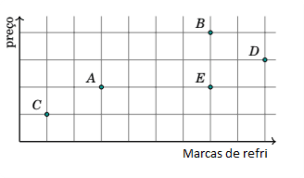

A 

Todas as marcas são diferentes. 

B 

Este gráfico é um gráfico de função. 

C 

Nem todas as marcas têm preços diferentes. 

D 

A marca D é a mais cara. 

E 

A mesma marca vende o produto mais caro e mais barato. 

##### A alternativa C está correta. 

A) Todas as marcas são diferentes: Incorreta. Embora existam várias marcas representadas no gráfico, isso não implica necessariamente que todos os preços sejam diferentes. A análise do gráfico mostra que algumas marcas possuem preços idênticos, o que invalida esta alternativa. 

B) Este gráfico é um gráfico de função: Incorreta. Um gráfico de função é aquele onde cada valor de entrada (no caso, as marcas) tem exatamente uma saída correspondente (o preço). Entretanto, o gráfico em questão permite que uma marca tenha mais de um preço, o que o caracteriza como não sendo um gráfico de função no sentido matemático estrito. 

C) Nem todas as marcas têm preços diferentes: Correta. Esta alternativa é verdadeira porque o gráfico indica claramente que algumas marcas possuem o mesmo preço. Por exemplo, as marcas B e D estão próximas no eixo de preços, indicando que podem ter valores idênticos ou muito semelhantes, enquanto outras marcas têm preços únicos. 

D) A marca D é a mais cara: Incorreta. Apesar de a marca D estar entre as mais caras, o gráfico sugere que a marca B pode ter um preço igual ou maior, e assim, essa afirmativa não é completamente verdadeira, dependendo da leitura precisa do gráfico. 

E) A mesma marca vende o produto mais caro e mais barato: Incorreta. Esta alternativa sugere que uma única marca é responsável pelo maior e menor preço, o que não é evidenciado pelo gráfico. Cada ponto no gráfico representa uma única marca associada a um único preço, então essa situação não se aplica. 

Para saber mais sobre esse conteúdo, acesse o módulo 2 

###### Plano cartesiano 

“ O plano cartesiano apresenta duas linhas numéricas: uma horizontal, da esquerda para a direita, e outra vertical, de baixo para cima. Utiliza-se a letra x para simbolizar os valores sobre a reta horizontal e a letra y para simbolizar os valores sobre a reta vertical. Observe que: À medida que x aumenta, o ponto se move mais para a direita. Quando x diminui, o ponto se move mais para a esquerda. À medida que y aumenta, o ponto se move mais para cima. Quando y diminui, o ponto se move mais para baixo.” 

Desafio 3 

Como engenheiro responsável pelo desenvolvimento de novos produtos, você precisa entender o comportamento de um corpo em movimento para otimizar o design de um dispositivo de lançamento. Durante um teste, você acompanha a trajetória de um corpo lançado do solo e deve determinar a altura máxima atingida e a distância total percorrida até o ponto de queda. Utilize o gráfico fornecido para identificar o par ordenado que representa esses valores. 

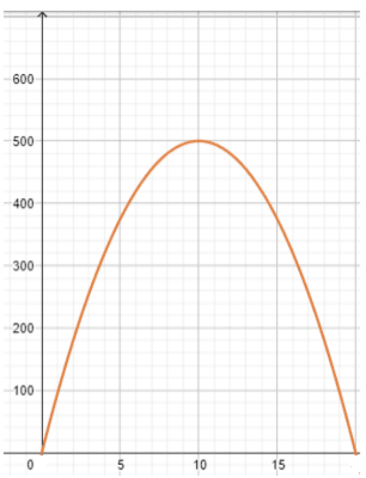

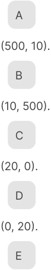

<!-- Start of picture text -->
A (500, 10). B (10, 500). C (20, 0). D (0, 20). E <!-- End of picture text -->

(500, 20). 

##### A alternativa E está correta. 

A) (500, 10): Incorreta. Essa alternativa indica uma altura máxima de 500 unidades, mas com uma distância de apenas 10 unidades do ponto de lançamento. Essa configuração não é consistente com o comportamento esperado para um corpo lançado a uma altura tão elevada. 

B) (10, 500): Incorreta. Aqui, a altura máxima atingida é muito baixa (10 unidades) enquanto a distância é extremamente alta (500 unidades). Isso sugere uma trajetória quase horizontal, o que não condiz com a descrição do problema, onde se espera uma altura significativa. 

C) (20, 0): Incorreta. Este par ordenado indica que o corpo atingiu 20 unidades de altura, mas caiu de volta no ponto de origem (distância zero). Isso só ocorreria se o corpo tivesse sido lançado diretamente para cima e caído exatamente onde foi lançado, o que não é o caso aqui. 

D) (0, 20): Incorreta. Esta alternativa sugere que o corpo nunca atingiu altura (0 unidades), mas percorreu uma distância horizontal de 20 unidades. Isso contradiz a necessidade de identificar a altura máxima atingida. 

E) (500, 20): Correta. Esta alternativa está correta, pois indica que o corpo atingiu uma altura máxima de 500 unidades antes de percorrer uma distância total de 20 unidades até o ponto de queda. Isso é consistente com a descrição de uma trajetória parabólica típica de corpos lançados verticalmente. 

Para saber mais sobre esse conteúdo, acesse o módulo 4 

###### Máximos e mínimos de um gráfico 

“O valor de x é o que geralmente chamamos na literatura de máximo ou mínimo. O valor de y = f (x) é o valor máximo ou valor mínimo.” 

## Aprofundamento de Funções 

###### Desafio 1 

Imagine que você é um engenheiro de uma fábrica e está encarregado de calcular a produção necessária para evitar prejuízos. A empresa determinou que o lucro pode ser representado pela função , onde f(x) está em reais e x representa o número de unidades produzidas. Sua tarefa é calcular a quantidade mínima de unidades a serem produzidas para que o lucro não seja negativo. Após analisar, você conclui que a quantidade correta é: 

A 

10 unidades. 

B 

15 unidades. 

C 

20 unidades. 

D 

25 unidades. 

E 

30 unidades. 

##### A alternativa C está correta. 

Para resolver essa questão, devemos encontrar o ponto em que o lucro f(x) deixa de ser negativo. A função representa o lucro em função do número de unidades produzidas. O ponto de equilíbrio, onde não há lucro nem prejuízo, ocorre quando f(x)=0. 

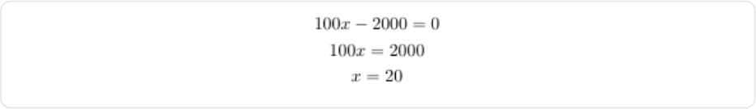

Assim, a quantidade mínima de unidades a serem produzidas para não haver prejuízo é 20 unidades. 

A) 10 unidades: Incorreto. Com 10 unidades, o cálculo do lucro seria 100 × 10 - 2000 = -1000 reais, resultando em prejuízo. 

B) 15 unidades: Incorreto. Com 15 unidades, o cálculo do lucro seria 100 × 15 - 2000 = -500 reais, ainda resultando em prejuízo. 

C) 20 unidades: Correto. Com 20 unidades, o cálculo do lucro seria 100 × 20 - 2000 = 0 reais, atingindo o ponto de equilíbrio. 

D) 25 unidades: Incorreto. Embora produza lucro (100 × 25 - 2000 = 500 reais), não é a quantidade mínima necessária para evitar prejuízo. 

E) 30 unidades: Incorreto. Também produz lucro (100 × 30 - 2000 = 1000 reais), mas não é a quantidade mínima necessária. 

Para saber mais sobre esse conteúdo, acesse o módulo 1 

Função 

"Quando uma função está definida por uma fórmula matemática, a fórmula em si pode impor restrições sobre os valores reais para os quais podemos calculá-la. O domínio da função é o maior subconjunto de R onde a expressão que define a função assume valores reais. Ao resolver F(X) = 0, estamos encontrando o ponto onde a função cruza o eixo das abscissas, indicando o ponto de equilíbrio financeiro." 

###### Desafio 2 

Você é um profissional responsável por modelar fenômenos cíclicos, como as estações do ano ou os batimentos cardíacos, que se repetem em intervalos regulares. Considere a função f(x) definida em e periódica com período para . Sabendo que , determine o valor de f(6). 

A 

5. B 

2. C 

7. D 9. E 4. 

##### A alternativa A está correta. 

Para resolver a questão, utilizamos a propriedade de periodicidade da função f, que nos diz que .  Com período T=4: 

f(6) = f(6 - 4) = f(2) Sabendo que f(2)= 5: 

f(6) = 5 

Assim, o valor de f(6) é 5. 

A) 5: Correto. Com base na periodicidade da função, sabemos que f(6)= f(2) = 5. 

B) 2: Incorreto. Não há indicação de que o valor da função em 6 seja 2. 

C) 7: Incorreto. Este valor não se alinha com a periodicidade dada. 

D) 9: Incorreto. Também não corresponde ao valor da função dada a periodicidade. 

E) 4: Incorreto. A periodicidade indica que o valor deve ser igual a f(2), que é 5. 

Para saber mais sobre esse conteúdo, acesse o módulo 4 

###### Funções periódicas 

"Uma função é considerada periódica quando existe um número real T>0 tal que para todo x no domínio da função. O menor dos valores de T>0, para os quais a propriedade é verificada, é chamado de período da função." 

###### Desafio 3 

Como matemático, você é convidado a analisar as propriedades de funções específicas para aplicá-las em sistemas de controle. Uma função em estudo é f(x) = 2x + 1, definida para o conjunto dos números reais. Sua tarefa é determinar a classificação correta dessa função em termos de injeção, sobrejeção ou bijeção, baseando-se no comportamento de mapeamento de elementos de seu domínio e contradomínio. 

A 

A função f é injetora, mas não é sobrejetora. 

B 

A função f é sobrejetora, mas não é injetora. 

C 

A função f é injetora e sobrejetora. 

###### D 

A função f não é nem injetora nem sobrejetora. 

###### E 

A função f não é definida. 

##### A alternativa C está correta. 

A) A função f é injetora, mas não é sobrejetora: Incorreta. Para que uma função seja injetora, cada elemento do domínio deve mapear para um único elemento distinto no contradomínio. A função f(x) = 2x + 1 é injetora porque, para quaisquer x1 e x2 diferentes, temos f(x1) ≠ f(x2). No entanto, ela é também sobrejetora, já que todo valor real pode ser alcançado ao variar x. Portanto, essa alternativa está incorreta ao afirmar que não é sobrejetora. 

B) A função f é sobrejetora, mas não é injetora: Incorreta. Esta função é sobrejetora porque cada valor real do contradomínio é coberto por algum valor de x. No entanto, a afirmação de que a função não é injetora é incorreta, pois, como mencionado, para quaisquer dois valores distintos de x, os valores de f(x) também são distintos. Assim, a função é tanto injetora quanto sobrejetora, e esta alternativa está incorreta. 

C) A função f é injetora e sobrejetora: Correta. A função f(x) = 2x + 1, sendo linear, é tanto injetora (pois diferentes valores de x produzem diferentes valores de f(x)) quanto sobrejetora (pois qualquer número real pode ser obtido por algum valor de x). Isso significa que a função é bijetora, e essa é a descrição correta do comportamento da função. 

D) A função f não é nem injetora nem sobrejetora: Incorreta. Como já explicado, a função é tanto injetora quanto sobrejetora, então essa alternativa está claramente incorreta. 

E) A função f não é definida: Incorreta. A função f(x) = 2x + 1 é perfeitamente definida para todos os números reais, tornando essa alternativa completamente errada. 

Para saber mais sobre esse conteúdo, acesse o módulo 2 

Tipos de funções: injetora, sobrejetora e bijetora 

“Uma função f é dita injetora (ou injetiva) se, para quaisquer dois números a1, a2 ∈ Dom(f), tais que a1 ≠ a2, os números f(a1) e f(a2) na imagem de f são também distintos. Uma função é sobrejetora (ou sobrejetiva) se todo elemento do contradomínio é a imagem de pelo menos um elemento do domínio. Uma função bijetora é aquela que é tanto injetora quanto sobrejetora.” 

## Cálculo Proposicional 

###### Desafio 1 

Como engenheiro da computação, você está desenvolvendo um sistema que utiliza álgebra booleana para otimizar processos lógicos em circuitos digitais. Ao analisar uma expressão booleana envolvendo as operações E (AND) e OU (OR), é crucial determinar a ordem correta das operações para garantir que o sistema funcione corretamente e sem erros lógicos. Considere a expressão , identifique a sequência correta de operações que devem ser realizadas para obter o valor da expressão de forma precisa. 

###### A 

Em primeiro lugar, deve-se realizar a operação lógica E (AND) para depois realizar a operação lógica OU (OR). 

###### B 

Deve-se realizar as operações na ordem em que são apresentadas, porque essa ordem não influencia no resultado da operação. 

###### C 

Em primeiro lugar, deve-se realizar a operação OU (OR) para depois realizar a operação E (AND). 

D 

Deve-se inverter as operações, transformando a operação OU (OR) em uma operação E (AND) e vice-versa, para depois realizá-las na ordem em que são apresentadas. 

E 

Não é possível obter o valor de S, porque em uma expressão da álgebra booleana não se pode utilizar operadores diferentes em conjunto. 

##### A alternativa A está correta. 

A) Correta. Na álgebra booleana, a operação lógica E (AND) tem prioridade sobre a operação lógica OU (OR). Isso significa que, em qualquer expressão onde essas operações coexistam, a operação E deve ser realizada primeiro para garantir a precisão do resultado. No caso de S = A + B ⋅ C, devemos primeiro calcular B ⋅ C (AND) e, em seguida, adicionar A (OR) ao resultado, o que assegura que a expressão seja avaliada corretamente. 

B) Incorreta. Esta alternativa sugere que a ordem das operações não influencia o resultado, o que é falso na álgebra booleana. A ordem das operações é crucial; realizar operações na ordem incorreta pode levar a resultados errôneos. Neste caso, realizar a operação OU (OR) antes da operação E (AND) mudaria o valor final da expressão, o que não seria correto. 

C) Incorreta. A alternativa C propõe que a operação OU (OR) deve ser realizada antes da operação E (AND), o que vai contra as regras da álgebra booleana. Priorizar o OR sobre o AND não segue a hierarquia estabelecida, resultando em um cálculo incorreto e, consequentemente, em um sistema que não funcionaria como esperado. 

D) Incorreta. A ideia de inverter as operações, como sugerido pela alternativa D, é um erro conceitual. Na álgebra booleana, não se deve trocar as operações OU e E, pois isso altera completamente o significado da expressão e o valor final obtido. A execução na ordem apresentada é essencial para manter a lógica correta. 

E) Incorreta. A alternativa E está incorreta ao afirmar que não é possível utilizar operadores diferentes em conjunto. Na verdade, a álgebra booleana é baseada na combinação de diferentes operadores lógicos, como AND, OR, e NOT. O uso conjunto desses operadores é fundamental para a construção de expressões lógicas complexas, desde que as operações sejam realizadas na ordem correta. 

Para saber mais sobre esse conteúdo, acesse o módulo: 3 

Álgebra booleana 

"Na álgebra booleana, também devemos ficar atentos aos parênteses e à ordem de precedência dos operadores. 1º - Parênteses 2º - Negação ou complementação 3º - Multiplicação lógica (A ∙ B) 4º - Soma lógica (A + B)." 

###### Desafio 2 

Você é um auditor fiscal do trabalho e, em suas atividades, frequentemente precisa interpretar documentos legais e contratuais que contêm condições específicas. Um dos desafios que você enfrenta é negar corretamente proposições condicionais para avaliar diferentes cenários possíveis. Considerando uma situação em que uma determinada ação só ocorre sob uma condição específica, é essencial entender como negar corretamente essa afirmação para garantir que todas as implicações legais sejam consideradas. Analise a proposição condicional ''se estiver chovendo, eu levo o guarda-chuva'' e escolha a negação correta. 

A 

Se não estiver chovendo, eu levo o guarda-chuva. 

###### B 

Não está chovendo e eu levo o guarda-chuva. 

###### C 

Não está chovendo e eu não levo o guarda-chuva. 

###### D 

Se estiver chovendo, eu não levo o guarda-chuva. 

E 

Está chovendo e eu não levo o guarda-chuva. 

##### A alternativa E está correta. 

A) Incorreta. A negação de uma proposição condicional não se traduz simplesmente invertendo a condição e a ação. A alternativa A sugere que "Se não estiver chovendo, eu levo o guarda-chuva" seria a negação correta, mas isso não corresponde à lógica da negação condicional. Negar uma proposição condicional envolve afirmar que a condição original é verdadeira, mas que o resultado esperado não ocorre. 

B) Incorreta. A alternativa B apresenta uma conjunção ("Não está chovendo e eu levo o guarda-chuva"), mas não reflete a negação correta da proposição condicional dada. A negação correta deve refutar o vínculo entre a condição e a consequência estabelecida, o que esta alternativa não faz. 

C) Incorreta. A alternativa C indica que "Não está chovendo e eu não levo o guarda-chuva", o que é uma conjunção que nega ambos os componentes da proposição original. No entanto, a negação de uma proposição condicional não nega a condição inicial, mas sim o resultado da ação esperada sob essa condição. 

D) Incorreta. Esta alternativa sugere que a negação seria "Se estiver chovendo, eu não levo o guardachuva", o que também não está correto. A negação correta de uma condicional precisa afirmar a ocorrência da condição e negar o resultado esperado, mas sem condicionar novamente a ação. 

E) Correta. A negação de uma proposição condicional "Se estiver chovendo, eu levo o guarda-chuva" é, de fato, "Está chovendo e eu não levo o guarda-chuva". Esta negação reflete que a condição (está chovendo) se verifica, mas a ação esperada (levar o guarda-chuva) não ocorre. Esta é a forma correta de negar uma condicional, conforme as regras da lógica proposicional. 

Para saber mais sobre esse conteúdo, acesse o módulo 4 

Equivalência lógica 

"As equivalências que aparecem com frequências são:...Negação da condicional ∼ (p → q) ↔ p ∧ ∼q.” 

###### Desafio 3 

Em sua atuação em um processo de herança, você se depara com a necessidade de avaliar a veracidade de informações complexas que envolvem múltiplas relações familiares e condicionais. Suponha que você precise validar a veracidade de uma série de afirmações envolvendo relações familiares e a herança de determinados bens. Neste contexto, é essencial entender como as proposições condicionais e disjunções afetam a conclusão de que um determinado cenário é verdadeiro ou falso. Com base nas seguintes informações: Ana é prima de Bia ou Carlos é filho de Pedro. Se Jorge é irmão de Maria, então Breno não é neto de Beto. Se Carlos é filho de Pedro, então Breno é neto de Beto. Ora, Jorge é irmão de Maria. Escolha a alternativa que corretamente reflete a conclusão lógica. 

A 

Carlos é filho de Pedro ou Breno é neto de Beto. 

B 

Breno é neto de Beto e Ana é prima de Bia. 

C 

Ana não é prima de Bia e Carlos é filho de Pedro. 

D 

Jorge é irmão de Maria e Breno é neto de Beto. 

E 

Ana é prima de Bia e Carlos não é filho de Pedro. 

##### A alternativa E está correta. 

A) Incorreta. A alternativa A sugere uma disjunção simples, mas não considera todas as informações e condicionais fornecidas no enunciado. Embora Carlos possa ser filho de Pedro, isso por si só não garante a veracidade da proposição completa, já que a condição de Breno ser neto de Beto também precisa ser avaliada. Como a proposição condicional não é confirmada para ambas as partes, esta alternativa está incorreta. 

B) Incorreta. A alternativa B propõe que Breno é neto de Beto e Ana é prima de Bia, mas essa conjunção não reflete a complexidade das relações apresentadas no enunciado. O erro está em presumir que ambas as afirmações são verdadeiras sem considerar as interdependências entre as proposições. A verdade de uma proposição não garante automaticamente a verdade da outra, o que invalida essa alternativa. 

C) Incorreta. A negação de que Ana não é prima de Bia e a afirmação de que Carlos é filho de Pedro na alternativa C não são compatíveis com as condições apresentadas no enunciado. Esta combinação de proposições falha ao não considerar a implicação total das informações fornecidas, tornando esta resposta incorreta. 

D) Incorreta. A afirmação de que Jorge é irmão de Maria e Breno é neto de Beto na alternativa D parece plausível, mas não está completamente alinhada com as implicações lógicas das proposições condicionais dadas. Embora as duas partes possam ser verdadeiras de forma independente, o enunciado sugere que há uma relação condicional mais profunda que não é capturada por esta alternativa. 

E) Correta. A alternativa E reconhece que, dado que Ana é prima de Bia, Carlos não pode ser filho de Pedro, de acordo com as condições dadas no enunciado. Esta resposta reflete corretamente a interdependência das proposições e as negações necessárias para chegar à conclusão lógica correta. Esta alternativa é a única que satisfaz todas as condições apresentadas e que está em total conformidade com as regras da lógica proposicional. 

Para saber mais sobre esse conteúdo, acesse o módulo 3 

Análise do valor lógico das proposições compostas por meio da tabela-verdade 

“Nas proposições compostas, não é simples verificar o seu valor lógico apenas olhando para elas. No entanto, através da construção da tabela-verdade isso é mais intuitivo, apesar do trabalho, que pode ser maior ou menor, dependendo do tamanho da proposição. Determinar o valor lógico da proposição composta através da tabela-verdade nos fará conhecer conceitos novos.” 

## Cálculo de Predicados 

### Desafio 1 

Você está trabalhando como analista de sistemas em uma empresa de tecnologia e foi designado para otimizar um algoritmo que utiliza equações matemáticas para determinar soluções em tempo real. Uma parte do algoritmo envolve a resolução de equações quadráticas, e você deve garantir que o código seja capaz de 

identificar corretamente as soluções dessas equações dentro de um conjunto específico de números reais. Considere as equações abertas e fornecidas a seguir: 

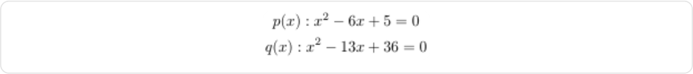

Determine qual conjunto representa corretamente o conjunto-verdade da união de e para todos os valores possíveis de no conjunto dos números reais. 

A 

{1, 5}. 

B 

{-1, -4, 9}. 

C 

{4, 9}. 

D 

{-1, 4, -9}. 

E 

{1, 4, 5, 9}. 

A alternativa E está correta. 

A) : Incorreta. Esta alternativa representa apenas o conjunto-verdade da equação , que é . As soluções para esta equação são =1 e =5, que formam o conjunto . No entanto, a questão pede o conjunto-verdade da união de e , então apenas considerar não é suficiente. 

B) : Incorreta. Esta alternativa inclui valores que não satisfazem as equações fornecidas. Os números -1 e -4 não são raízes nem de nem de . Embora 9 seja uma raiz de , a inclusão dos valores negativos torna esta alternativa incorreta. 

C) : Incorreta. Essa alternativa contém as raízes da equação , que são e . No entanto, ela omite as raízes de , o que faz com que essa opção não represente corretamente a união dos conjuntos-verdade de e . 

D) : Incorreta. Esta opção inclui valores que não satisfazem nenhuma das equações. 4 e 9 são raízes de , mas -1 e -9 não são raízes válidas para nenhuma das equações dadas. 

E) : Correta. Esta alternativa combina corretamente as raízes das duas equações. As raízes de são 1 e 5 , e as raízes de são 4 e 9 . Portanto, o conjunto-verdade da união de e é , que corresponde à alternativa correta. 

Para saber mais sobre esse conteúdo, acesse o módulo 1 

###### Operações lógicas sobre sentenças abertas 

“Operação de conjunção é a sentença aberta p(x) ∧ q(x) em A, satisfeita por um elemento a ∈ A. Essa operação tem o valor lógico verdadeiro quando a ∈ A satisfaz p(x) e q(x).” 

###### Desafio 2 

Imagine que você é um matemático contratado para criar um sistema que automatiza o processo de resolução de problemas algébricos em uma plataforma educacional. Um dos requisitos é garantir que o sistema compreenda e manipule corretamente as propriedades dos números reais, especificamente ao lidar com o conceito de inversos multiplicativos. Considere a afirmação de que "todo número real diferente de zero possui um inverso multiplicativo" e selecione a alternativa que expressa corretamente essa afirmação em linguagem simbólica. 

A . B . C . D . E . 

A alternativa B está correta. 

A) : Incorreta. Esta expressão está errada porque afirma que X=0 e ainda assim sugere que existe Y tal que XY=1. No entanto, o inverso multiplicativo só existe para números 

diferentes de zero. Portanto, a expressão correta deve incluir a condição X≠0 antes de afirmar a existência de um Y tal que XY=1. 

B) : Correta. Esta expressão utiliza corretamente o quantificador universal para afirmar que para todo X no conjunto dos números reais, se X for diferente de zero, então existe um Y tal que XY=1. Isso está de acordo com a definição de inverso multiplicativo, que só existe para números reais diferentes de zero. 

C) : Incorreta. Embora esta expressão também envolva a condição X≠0, ela falha ao não quantificar Y. Ela sugere que XY=1 para todo X diferente de zero, mas não especifica que Y é o inverso multiplicativo de X. A falta do quantificador existencial (∃Y) torna a expressão incompleta. 

D) : Incorreta. Esta alternativa é incorreta porque utiliza o quantificador existencial para X, sugerindo que existe pelo menos um número real X diferente de zero que possui um inverso multiplicativo, mas isso não captura o fato de que todos os números reais diferentes de zero têm essa propriedade. 

E) : Incorreta. Esta alternativa utiliza a bicondicional ↔, o que implica que a existência de Y para o qual XY=1 é necessária e suficiente para que X≠0. Embora isso seja verdade, a forma mais correta de expressar a relação é utilizando a implicação →, que afirma que se X≠0, então existe Y tal que XY=1. 

Para saber mais sobre esse conteúdo, acesse o módulo 2 

###### Quantificadores Universal 

"Para representarmos as expressões “para todos” e “qualquer que seja”, devemos colocar o símbolo ∀ seguido do x antes de p(x). Podemos dizer que ∀ x representa uma operação lógica que tem por finalidade transformar uma sentença aberta p(x) em A, que não tem nenhum valor lógico, numa sentença verdadeira ou falsa. Essa operação é denominada quantificação universal." 

###### Desafio 3 

Você é um pesquisador em linguística e está estudando a comunicação em comunidades isoladas. Durante uma visita a uma aldeia remota, você observa que há certos padrões de comportamento relacionados ao descanso dos aldeões. Um dos habitantes, Pedro, fez uma observação intrigante: "Não é verdade que todos os aldeões desta aldeia não dormem a sesta". Sua tarefa é analisar esta afirmação e determinar qual das seguintes proposições deve ser verdadeira para que a observação de Pedro também seja verdadeira. 

A 

No máximo, um aldeão daquela aldeia não dorme a sesta. 

B 

Todos os aldeões daquela aldeia dormem a sesta. 

C 

Pelo menos um aldeão daquela aldeia dorme a sesta. 

D 

Nenhum aldeão daquela aldeia não dorme a sesta. 

E 

Nenhum aldeão daquela aldeia dorme a sesta. 

##### A alternativa C está correta. 

A) No máximo, um aldeão daquela aldeia não dorme a sesta: Incorreta. Essa alternativa sugere que apenas um aldeão na aldeia não dorme a sesta, o que é diferente de afirmar que pelo menos um aldeão dorme a sesta. A negação da afirmação original de Pedro requer apenas que haja pelo menos um aldeão que realmente dorme a sesta, e não a limitação ao número de aldeões que não dormem. 

B) Todos os aldeões daquela aldeia dormem a sesta: Incorreta. Embora esta proposição garanta que todos os aldeões dormem a sesta, ela é mais forte do que o necessário para validar a afirmação de Pedro. A observação de Pedro só precisa que haja pelo menos um aldeão que dorme a sesta, não todos. 

C) Pelo menos um aldeão daquela aldeia dorme a sesta: Correta. Esta alternativa captura precisamente a condição necessária para que a negação da afirmação original de Pedro seja verdadeira. Se pelo menos um aldeão dorme a sesta, então a proposição "não é verdade que todos os aldeões não dormem a sesta" se mantém verdadeira. 

D) Nenhum aldeão daquela aldeia não dorme a sesta: Incorreta. Esta alternativa está formulada de forma a causar confusão. Se nenhum aldeão "não dorme a sesta", isso significa que todos os aldeões dormem a sesta, o que, como discutido na alternativa B, é uma afirmação mais forte do que a necessária. 

E) Nenhum aldeão daquela aldeia dorme a sesta: Incorreta. Esta proposição é a negação direta da alternativa correta, o que a torna falsa. Se nenhum aldeão dorme a sesta, então a afirmação de Pedro, que nega a universalidade dessa condição, não pode ser verdadeira. 

Para saber mais sobre esse conteúdo, acesse o módulo 3 

Negação de sentenças abertas com o quantificador universal 

"Quando colocamos a negação na frente do quantificador universal, dizemos que 'não é verdade que todos os homens são bons motoristas'. Portanto, a negação de proposição com quantificador universal é equivalente a: ." 

Métodos de Demonstração Desafio 1 

Imagine que você é um engenheiro mecânico encarregado de projetar um sistema de engrenagens que inclui dois discos, e , com raios e , conforme imagem a seguir. 

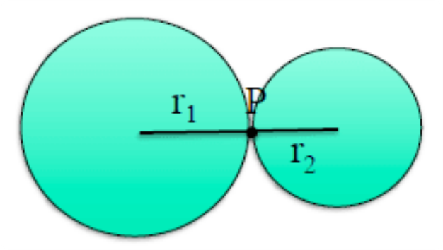

O sistema exige que os discos girem sem deslizamento, e você precisa garantir que os pontos de contato entre os dois discos não voltem a coincidir após o início do movimento. Suponha que o raio é racional e o raio é irracional. Para prever o comportamento desse sistema ao longo do tempo, você precisa analisar a situação e determinar se os pontos e , que inicialmente estavam em contato, voltarão a coincidir. A seguir, considere as asserções abaixo e julgue sua veracidade. 

I. Suponhamos, por absurdo, que e se encontram em algum momento após os círculos terem iniciado seus movimentos. Como o movimento é uniforme e sem deslizamento, podemos afirmar que as velocidades lineares de e são iguais. 

II. Então, seja esse encontro dado, após ter dado m voltas e , n voltas. Dessa forma, temos: 

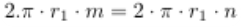

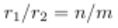

III. Nesse ponto, obtemos um absurdo, pois sendo um número racional e irracional, temos que a razão é um número irracional, enquanto é um número racional, já que para todo . 

A 

Apenas um item está certo. 

B 

Apenas os itens I e II estão certos. 

C 

Apenas os itens II e III estão certos. 

D 

Todos os itens estão certos. 

E 

Apenas os itens I e III estão certos. 

##### A alternativa D está correta. 

Todos os itens estão corretos. A análise apresentada considera corretamente que, se os dois discos se encontrassem novamente após o início do movimento, teríamos uma contradição, pois a razão entre o número de voltas seria racional, enquanto a razão entre os raios seria irracional, o que é impossível. Esse raciocínio está em linha com as propriedades dos números racionais e irracionais e demonstra que, uma vez iniciada a rotação sem deslizamento, os pontos e nunca mais coincidirão. 

Para saber mais sobre esse conteúdo, acesse o módulo 2 

Demonstração por Contradição e por Redução ao Absurdo 

“Uma demonstração é dita demonstração por redução ao absurdo ou simplesmente demonstração por absurdo quando a demonstração P ⇒ Q consiste em supor a hipótese P, supor a negação ¬Q e concluir uma contradição (em geral Q e ¬Q).” 

###### Desafio 2 

Como cientista de dados, você lida com grandes volumes de informações e precisa assegurar que certas operações matemáticas se comportem de forma previsível. Por exemplo, saber se o quadrado de um número par sempre resulta em outro número par, especialmente ao projetar algoritmos que dependem dessa propriedade. Suponha que é um número inteiro par e que você precisa demonstrar que também será par. Essa demonstração garante a precisão e a consistência dos resultados em suas análises. Considere a afirmação abaixo e avalie sua veracidade. 

Suponhamos que é par, isto é, para algum inteiro k. 

Porque 

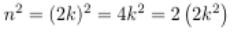

, onde é um inteiro. Portanto, é par." 

A 

As duas asserções são proposições verdadeiras, e a segunda é uma justificativa correta da primeira. 

B 

As duas asserções são proposições verdadeiras, mas a segunda não é uma justificativa correta da primeira. 

C 

A primeira asserção é uma proposição verdadeira, e a segunda é falsa. 

D 

A primeira asserção é uma proposição falsa, e a segunda é verdadeira. 

E 

Ambas as asserções são proposições falsas. 

##### A alternativa A está correta. 

A proposição de que o quadrado de um número par é par é correta, e a demonstração apresentada confirma essa verdade. Ao expressar um número par como , onde k é um inteiro, e ao elevar essa expressão ao quadrado, chegamos a , que é claramente um múltiplo de 2, portanto par. Essa demonstração utiliza uma lógica direta e segue as definições matemáticas básicas, sendo essencial para garantir a correção de algoritmos que lidam com números inteiros. 

Para saber mais sobre esse conteúdo, acesse o módulo 1 

Método de Demonstração Direta 

“Demonstração Direta de P ⇒ Q: A estratégia é supor que P(x) é verdadeiro para um x arbitrário ∈ S>, e mostrar que Q(x) é verdadeiro para esse x.” 

###### Desafio 3 

Como matemático, você está desenvolvendo uma pesquisa sobre a natureza dos números primos e suas propriedades. Durante seu estudo, você se depara com a função para valores inteiros positivos de e a conjectura de que essa função sempre gera números primos. Para validar essa hipótese, você decide testar a função para diferentes valores de . Considerando o texto, analise as afirmativas abaixo: 

I. Os fatores são quase impossíveis de localizar manualmente. 

II. Os quatro inteiros positivos produzem um número primo: 

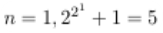

, é primo. 

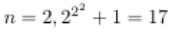

, é primo. 

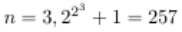

, é primo. 

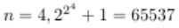

,é primo. 

III. ; não é primo. 

Assinale a opção que apresenta somente as alternativas corretas. 

A 

I, apenas. 

B 

II e III, apenas. 

C 

I e III, apenas. 

D 

I e II, apenas. 

E 

I, II e III. 

##### A alternativa E está correta. 

As três asserções são corretas. A função gera números primos para os valores de n=1 a n=4, conforme descrito nas asserções II e III. No entanto, para n=5, o número gerado não é primo, pois pode ser fatorado como 641 × 6700417. Esse exemplo demonstra a importância de verificar a primalidade para diferentes valores de n e ilustra que, apesar de a função gerar números primos para pequenos valores de n, nem sempre isso ocorre para valores maiores. 

Para saber mais sobre esse conteúdo, acesse o módulo 4 

###### Princípio da Indução Matemática 

“Como consequência do Princípio da Indução Matemática, a declaração quantificada ∀ n ∈ N, P(n) pode ser demonstrada ser verdade se (1) podemos mostrar que a declaração P(1) é verdadeira e (2) podemos estabelecer a verdade da implicação.” 

3. Conclusão 

## Considerações finais 

Continue explorando, praticando e desafiando-se. Cada exercício é uma oportunidade de crescimento e cada erro, uma lição valiosa. Que sua jornada de aprendizado seja repleta de descobertas e realizações. Bons estudos e sucesso na sua carreira! 

Compartilhe conosco como foi sua experiência com este conteúdo. Por favor, responda a este formulário de <u>avaliação</u> e nos ajude a aprimorar ainda mais a sua experiência de aprendizado! 

